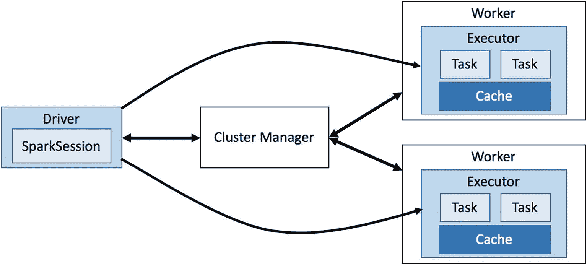

# 1.Apache Spark 简介

没有比现在更好的学习 Apache Spark 的时机了。由于其易用性、速度和灵活性，它已成为大数据堆栈中的关键组件之一。多年来，它已成为多种工作负载类型的统一引擎，如大数据处理、数据分析、数据科学和机器学习。许多行业的公司广泛采用这种可扩展的数据处理系统，包括脸书、微软、网飞和 LinkedIn。此外，它在每个主要版本中都得到了稳步的改进。

Apache Spark 的最新版本是 3.0，于 2020 年 6 月发布，标志着 Spark 作为开源项目的十周年纪念。这个版本包括对 Spark 许多方面的增强。值得注意的增强是创新的实时性能优化技术，以加速 Spark 应用程序，并帮助减少开发人员调整 Spark 应用程序所需的时间和精力。

本章提供了 Spark 的高级概述，包括核心概念、架构和 Apache Spark 堆栈中的各种组件。

## 概观

Spark 是一个通用的分布式数据处理引擎，旨在提高速度、易用性和灵活性。这三个属性的结合使得 Spark 如此受欢迎，并在行业中被广泛采用。

Apache Spark 网站声称，它运行某些数据处理作业的速度比 Hadoop MapReduce 快 100 倍。事实上，在 2014 年，Spark 赢得了 Daytona GraySort 大赛，这是一个行业基准，看看一个系统能以多快的速度对 100TB 的数据(1 万亿条记录)进行排序。Databricks 提交的材料声称，Spark 可以使用比 Hadoop MapReduce 创下的世界纪录少 10 倍的资源，将 100 TB 的数据排序快 3 倍。

自从 Spark 项目开始以来，易用性一直是 Spark 创造者的主要关注点之一。它提供了 80 多个高级的、通常需要的数据处理操作符，使开发人员、数据科学家和分析人员可以轻松地使用它们来构建各种有趣的数据应用程序。此外，这些运算符有多种语言版本:Scala、Java、Python 和 r。软件工程师、数据科学家和数据分析师可以挑选自己喜欢的语言，用 Spark 解决大规模数据处理问题。

在灵活性方面，Spark 提供了一个统一的数据处理堆栈，可以解决多种类型的数据处理工作负载，包括批处理应用程序、交互式查询、需要多次迭代的机器学习算法以及实时流应用程序，以近乎实时地提取可操作的见解。在 Spark 出现之前，每种类型的工作负载都需要不同的解决方案和技术。现在，公司只需利用 Spark 来满足其所有数据处理需求，它可以显著降低运营成本和资源。

大数据生态系统由许多技术组成，包括 *Hadoop 分布式文件系统* (HDFS)，这是一个分布式存储引擎和集群管理系统，可以有效地管理一个机器集群和不同的文件格式，以二进制和列格式存储大量数据。Spark 与大数据生态系统集成良好。这是 Spark 采用率快速增长的另一个原因。

Spark 的另一个很酷的地方是它是开源的。因此，任何人都可以下载源代码来检查代码，弄清楚某个特性是如何实现的，并扩展其功能。在某些情况下，它可以极大地帮助减少调试问题的时间。

## 历史

Spark 始于 2009 年加州大学伯克利分校 AMPLab 的一个研究项目。当时，该项目的研究人员观察到 Hadoop MapReduce 框架在处理交互式和迭代数据处理用例方面的低效率，因此他们想出了通过引入内存存储和有效处理故障恢复的方法来克服这些低效率的方法。一旦这个研究项目被证明是优于 MapReduce 的可行解决方案。它于 2010 年开源，并于 2013 年成为 Apache 顶级项目。

参与这个研究项目的许多研究人员成立了一家名为 Databricks 的公司，他们在 2013 年筹集了超过 4300 万美元。Databricks 是 Spark 背后的主要商业管家。2015 年，IBM 宣布了一项重大投资，旨在建立一个 Spark 技术中心，通过与开源社区密切合作来推进 Apache Spark，并将 Spark 打造为公司分析和商业平台的核心。

关于 Spark 的两篇热门研究论文分别是《Spark:带工作集的集群计算》( [`http://people.csail.mit.edu/matei/papers/2010/hotcloud_spark.pdf`](http://people.csail.mit.edu/matei/papers/2010/hotcloud_spark.pdf) )和《弹性分布式数据集:内存集群计算的容错抽象》( [`http://people.csail.mit.edu/matei/papers/2012/nsdi_spark.pdf`](http://people.csail.mit.edu/matei/papers/2012/nsdi_spark.pdf) )。这些论文在学术会议上广受好评，为任何想要学习和了解 Spark 的人提供了良好的基础。

从一开始，Spark 开源项目就是一个非常活跃的项目和社区。贡献者的数量增加了 1000 多个，有超过 20 万个 Apache Spark meetups。Apache Spark 贡献者的数量已经超过了广泛流行的 Apache Hadoop 的贡献者数量。

Spark 的创造者为他们的项目选择了 Scala 编程语言，因为它结合了 Scala 的简洁性和静态类型。现在，Spark 被认为是用 Scala 编写的最大的应用程序之一，它的流行无疑帮助 Scala 成为主流编程语言。

## Spark 核心概念和架构

在深入 Spark 的细节之前，对核心概念和各种核心组件有一个高层次的理解是很重要的。本节包括以下内容。

*   火花簇

*   资源管理系统

*   火花应用

*   火花驱动器

*   火花执行者

### Spark 集群和资源管理系统

Spark 本质上是一个分布式系统，旨在高效快速地处理大量数据。这种分布式系统通常部署在一组机器上，称为 Spark 集群。一个集群可以小到几台机器，也可以大到几千台机器。根据 [`https://spark.apache.org/faq.html`](https://spark.apache.org/faq.html) 的 Spark FAQ，世界上最大的 Spark 集群有 8000 多台机器。

公司依靠像 Apache YARN 或 Apache Meso 这样的资源管理系统来高效、智能地管理一组机器。典型资源管理系统中的两个主要组件是集群管理器和工作器。主设备知道从设备的位置、内存大小以及每个从设备拥有的 CPU 内核数量。集群管理器的主要职责之一是通过向工作人员分配工作来协调工作。每个工作者提供资源(内存、CPU 等。)分配给集群管理器，并执行分配的工作。这类工作的一个例子是启动一个特定的流程并监控其运行状况。Spark 旨在轻松地与这些系统进行互操作。近年来，大多数采用大数据技术的公司都有一个 YARN 集群来运行 MapReduce 作业或其他数据处理框架，如 Apache Pig 或 Apache Hive。

完全采用 Spark 的创业公司可以使用现成的 Spark 集群管理器来管理一组专门使用 Spark 执行数据处理的机器。

### 火花应用

Spark 应用程序由两部分组成。一个是用 Spark APIs 表达的数据处理逻辑，一个是*驱动*。数据处理逻辑可以简单到只有几行代码来执行解决特定数据问题的几个数据处理操作，也可以复杂到训练一个复杂的机器学习模型，需要多次迭代并运行数小时才能完成。Spark 驱动程序实际上是 Spark 应用程序的中央协调器，它与集群管理器进行交互，以确定哪些机器运行数据处理逻辑。对于每一台机器，驱动程序请求集群管理器启动一个被称为*执行器*的进程。

Spark 驱动程序的另一项非常重要的工作是代表应用程序管理 Spark 任务并将其分配给每个执行器。如果数据处理逻辑要求火花驱动器收集计算结果以呈现给用户，则它与每个火花执行器协调以收集计算结果，并在将它们呈现给用户之前将它们合并在一起。Spark 驱动程序通过一个名为`SparkSession`的组件执行任务。

### 火花驱动器和执行器

每个 Spark 执行器都是一个 JVM 进程，专用于特定的 Spark 应用程序。Spark 执行器的生命周期是 Spark 应用程序的持续时间，可能是几分钟或几天。有一个有意识的设计决策是不在不同的多个 Spark 应用程序之间共享 Spark 执行器。这样做的好处是将每个应用程序相互隔离。不过，如果不将数据写入像 HDFS 这样的外部存储系统，在不同的应用程序之间共享数据并不容易。

简而言之，Spark 采用了主/从架构，其中驱动程序是主设备，执行程序是从设备。这些组件中的每一个都作为一个独立的进程在 Spark 集群上运行。Spark 应用程序由一个驱动程序和一个或多个执行程序组成。作为从角色，Spark 执行器执行被告知的任务，即以任务的形式执行数据处理逻辑。每个任务都在独立的 CPU 内核上执行。这就是 Spark 并行处理数据以提高速度的方式。此外，当应用程序逻辑要求时，每个 Spark 执行器负责在内存和/或磁盘上缓存一部分数据。

启动 Spark 应用程序时，您可以指定应用程序需要的执行器数量，以及每个执行器应该拥有的内存量和 CPU 内核数量。

图 [1-1](#Fig1) 显示了 Spark 应用程序和集群管理器之间的交互。


图 1-2

由一个驱动程序和三个执行器组成的 Spark 集群



图 1-1

Spark 应用程序和集群管理器之间的交互

### Spark 统一堆栈

与其前身不同，Spark 提供了一个统一的数据处理引擎，称为 Spark stack。像其他设计良好的系统一样，该堆栈建立在一个名为 Spark Core 的强大基础之上，它提供了管理和运行分布式应用程序所需的所有功能，如调度、协调和处理容错。此外，它为数据处理提供了一个强大的通用编程抽象，称为*弹性分布式数据集* (RDDs)。在这个坚实的基础之上是一个库集合，其中每个库都是为特定的数据处理工作负载而设计的。Spark SQL 擅长交互式数据处理。火花流是实时数据处理。Spark GraphX 用于图形处理。Spark MLlib 是机器学习用的。Spark R 使用 R shell 运行机器学习任务。

这一统一引擎为构建下一代大数据应用程序带来了多项重要优势。首先，应用程序的开发和部署更简单，因为它们使用一组统一的 API，并在单个引擎上运行。第二，结合不同类型的数据处理(批处理、流等。)的效率要高得多，因为 Spark 可以在相同的数据上运行这些不同的 API 集，而无需将中间数据写出到存储中。

最后，最令人兴奋的好处是，Spark 使全新的应用程序成为可能，因为它易于组合不同的数据处理类型集；例如，对实时数据流的机器学习预测的结果运行交互式查询。一个每个人都能联想到的类比是智能手机，由强大的相机、手机和 GPS 设备组成。通过结合这些组件的功能，智能手机可以实现像 Waze 这样的创新应用，Waze 是一种交通和导航应用。


图 1-3

Spark 统一堆栈

#### 火花核心

Spark 核心是 Spark 分布式数据处理引擎的基石。它由 RDD、分布式计算基础设施和编程抽象组成。

分布式计算基础设施负责在集群中的许多机器之间分配、协调和调度计算任务。这使得能够在大型机器集群上高效、快速地执行大量数据的并行数据处理。分布式计算基础设施的另外两个重要职责是处理计算任务失败和跨机器移动数据的有效方式，称为数据混洗。高级 Spark 用户应该熟悉 Spark 分布式计算基础设施，以便有效地设计高性能 Spark 应用程序。

RDD 密钥编程抽象是每个 Spark 用户都应该学习并有效使用各种提供的 API 的东西。RDD 是跨集群划分的可并行操作的容错对象集合。本质上，它为 Spark 应用程序开发人员提供了一组 API，使他们能够轻松高效地执行大规模数据处理，而无需担心数据驻留在集群上的什么位置以及机器故障。RDD API 面向多种编程语言，包括 Scala、Java 和 Python。它们允许用户传递本地函数在集群上运行，这是非常强大和独特的。rdd 将在后面的章节中详细介绍。

Spark stack 中的其余组件被设计为运行在 Spark Core 之上。因此，Spark 内核在 Spark 版本之间所做的任何改进或优化都会自动提供给其他组件。

#### Spark SQL

Spark SQL 是构建在 Spark Core 之上的一个模块，它是为大规模结构化数据处理而设计的。自从它带来了新水平的灵活性、易用性和性能以来，它的受欢迎程度一直在飙升。

结构化查询语言(SQL)已经成为数据处理的通用语言，因为它易于用户表达他们的意图。执行引擎然后执行智能优化。Spark SQL 将它带到了 Pb 级的数据处理领域。Spark 用户现在可以发出 SQL 查询来执行数据处理，或者使用通过 DataFrame API 公开的高级抽象。数据帧实际上是组织成指定列的数据的分布式集合。这不是一个新的想法。它的灵感来自于 R 和 Python 中的数据帧。考虑数据帧的一个更简单的方法是，它在概念上相当于关系数据库中的一个表。

在幕后，Spark SQL Catalyst optimizer 执行许多分析数据库引擎中常见的优化。

提升 Spark 灵活性的另一个 Spark SQL 特性是能够从各种结构化格式和存储系统读取和写入数据，例如 JavaScript 对象符号(JSON)、逗号分隔值(CSV)、Parquet 或 ORC 文件、关系数据库、Hive 等。

根据 2021 年的 Spark 调查，Spark SQL 是增长最快的组件。这是有意义的，因为 Spark SQL 使“大数据”工程师之外的更广泛的受众能够利用分布式数据处理的能力，即数据分析师或任何熟悉 SQL 的人。

Spark SQL 的座右铭是编写更少的代码，读取更少的数据，而优化器会完成最艰巨的工作。

#### 火花结构化流

有人说，“动态数据的价值等于或大于历史数据。”在高度竞争的行业中，处理数据的能力已经成为许多公司的竞争优势。Spark 结构化流模块能够以高吞吐量和容错的方式处理来自各种数据源的实时流数据。数据可以从 Kafka、Flume、Kinesis、Twitter、HDFS 或 TCP socket 等来源获取。

Spark 处理流数据的主要抽象是离散化流(d stream)，它通过将输入数据分成小批(基于时间间隔)来实现增量流处理模型，这些小批可以定期结合当前处理状态来产生新的结果。

流处理有时涉及到连接静态数据，Spark 使这变得非常容易。换句话说，由于统一的 Spark 堆栈，在 Spark 中可以很容易地将批处理和交互式查询与流处理结合起来。

Spark 版引入了一个新的可伸缩和容错的流处理引擎，称为结构化流。该引擎进一步简化了流处理应用程序开发人员的生活，它将流计算视为静态数据上的批处理计算。这个新的引擎自动递增地和连续地执行流处理逻辑，并在新的流数据到达时产生结果。结构化流媒体引擎的另一个独特功能是保证端到端的一次性支持，这使得“大数据”工程师在将数据保存到关系数据库或 NoSQL 数据库等存储系统方面比以前容易得多。

随着这个新引擎的成熟，它支持一类新的易于开发和维护的流处理应用程序。

根据 Databricks 首席架构师 Reynold Xin 的说法，执行流分析的最简单方法是不必对流进行推理。

#### Spark MLlib(消歧义)

MLlib 是 Spark 的机器学习库。它提供了 50 多种常见的机器学习算法和抽象，用于管理和简化模型构建任务，如特征化、构建管道、评估和调整模型以及模型的持久性，以帮助将模型从开发转移到生产。

从 Spark 2.0 版本开始，MLlib APIs 基于数据帧，以利用 Spark SQL 引擎中 Catalyst 和钨组件提供的用户友好性和许多优化。

机器学习算法是迭代的，这意味着它们会经过多次迭代，直到实现预期目标。Spark 使得实现这些算法变得极其容易，并且可以通过一个机器集群以可扩展的方式运行它们。常用的机器学习算法，如分类、回归、聚类和协同过滤，可供数据科学家和工程师使用。

#### 图计算

图形处理对由顶点和连接它们的边组成的数据结构进行操作。图形数据结构通常用于表示现实生活中的互联实体网络，包括 LinkedIn 上的职业社交网络、互联网上的互联网页网络等等。Spark GraphX 是一个库，它通过提供一个带有附加到每个顶点和边的属性的有向多图的抽象来实现图形并行计算。GraphX 包含了一组常见的图形处理算法，包括页面排名、连接组件、最短路径等。

#### 火花

SparkR 是一个 R 包，它提供了使用 Apache Spark 的轻量级前端。r 是一种流行的统计编程语言，支持数据处理和机器学习任务。然而，R 并不是为处理无法在单台机器上运行的大型数据集而设计的。SparkR 利用 Spark 的分布式计算引擎，使用熟悉的 R shell 和许多数据科学家喜爱的流行 API 来实现大规模数据分析。

## Apache Spark 3.0

3.0 版本对 Spark stack 中的大多数组件进行了新的特性和增强。然而，大约 60%的增强是针对 Spark SQL 和 Spark 核心组件的。查询性能优化是 Spark 3.0 的主题之一，所以大部分的关注和开发都在 Spark SQL 组件中。根据 Databricks 完成的 TPC-DS 30 TB 基准测试，Spark 3.0 大约比 Spark 2.4 快两倍。本节重点介绍一些与性能优化相关的显著特性。

### 自适应查询执行框架

顾名思义，查询执行框架在运行时根据关于数据大小、分区数量等的最新统计数据来调整执行计划。因此，Spark 可以动态切换连接策略，自动优化偏斜连接，并调整分区数量。所有这些智能优化都提高了 Spark 应用程序的查询性能。

### 动态分区修剪(DPP)

DPP 背后的主要思想很简单，就是避免读取不必要的数据。它是专门为使用星型模式中的事实表和维度表的连接来查询数据的用例而设计的。通过减少事实表中需要根据给定的过滤条件与维度表连接的行数，它可以显著提高连接性能。基于 TPC-DS 基准测试，这种优化技术可以将 60%的查询的性能提高 2 到 18 倍。

### 加速器感知调度程序

越来越多的 Spark 用户正在利用 Spark 处理大数据和机器学习工作负载。后一类工作负载往往需要 GPU 来加速机器学习模型训练过程。这种增强使 Spark 用户能够为他们涉及机器学习的复杂工作负载描述和请求 GPU 资源。

## Apache Spark 应用程序

Spark 是一个多功能、快速、可伸缩的数据处理引擎。从一开始，它就被设计成一个通用引擎，并且已经证明它可以用来解决许多用例。因此，各个行业的许多公司都在使用 Spark 来解决许多现实生活中的用例。下面是使用 Spark 开发的一些应用程序。

*   客户智能应用

*   数据仓库解决方案

*   实时流解决方案

*   推荐引擎

*   日志处理

*   面向用户的服务

*   欺诈检测

## Spark 示例应用

在大数据处理领域，典型的示例应用程序是字数统计应用程序。这一传统始于 MapReduce 框架的引入。从那以后，每一本与大数据处理技术相关的书都必须遵循这个不成文的传统，纳入这个典范的例子。word count 示例应用程序中的问题空间对每个人来说都很容易理解，因为它所做的只是计算某个特定的单词在每组文档中出现的次数，无论是一本书的一章还是来自 Internet 的数百 TB 的网页。

清单 [1-1](#PC1) 是 Scala 语言中 Spark 的一个字数统计示例应用。

```
val textFiles = sc.textFile("hdfs://<folder>")
val words = textFiles.flatMap(line => line.split(" "))
val wordTuples = words.map(word => (word, 1))
val wordCounts = wordTuples.reduceByKey(_ + _)
wordCounts.saveAsTextFile("hdfs://<outoupt folder>")

Listing 1-1The Word Count Spark Example Application Written in Scala Language

```

在这五行代码背后发生了很多事情。第一行负责读取指定文件夹下的文本文件。第二行遍历每个文件中的每一行，然后将每一行标记为一个单词数组，最后将每个数组展平为每行一个单词。第三行为每个单词加 1，以计算所有文档中的单词数。第四行执行每个单词计数的求和。最后，最后一行将结果保存在指定的文件夹中。希望这能让您对 Spark 执行数据处理的易用性有一个大致的了解。未来的章节将更详细地介绍每一行代码的作用。

## Apache Spark 生态系统

在大数据领域，创新不会停滞不前。随着时间的推移，最佳实践和架构不断涌现。Spark 生态系统正在扩展和发展，以解决数据湖中的一些新兴需求，帮助数据科学家更高效地与大量数据进行交互，并加快机器学习开发生命周期。本节重点介绍了 Spark 生态系统中一些激动人心的最新创新。

### 三角洲湖

在这一点上，大多数公司都认识到了数据的价值，并制定了某种形式的策略来接收、存储、处理和提取数据中的见解。Delta Lake 的理念是利用分布式存储解决方案为各种数据消费者(如数据科学家、数据工程师和业务分析师)存储结构化和非结构化数据。为了确保 Delta Lake 中的数据可用，必须在数据目录、数据发现、数据质量、访问控制和数据一致性语义方面存在疏漏。数据一致性语义提出了许多挑战，公司已经发明了技巧或“创可贴”解决方案。

Delta Lake 是一个针对数据一致性语义的开源解决方案，它提供了一种开放的数据存储格式，具有事务保证、模式实施和演化支持。三角洲湖将在后面进一步讨论。

### 树袋熊

多年来，数据科学家一直在使用 Python pandas 库在他们的机器学习相关任务中执行数据操作。熊猫库( [`https://pandas.pydata.org`](https://pandas.pydata.org) )是一个“基于 Python 编程语言构建的快速、强大、灵活且易于使用的开源数据分析和操作工具。”pandas 非常受欢迎，并且已经成为事实上的库，因为它强大而灵活的抽象称为数据操作的数据框架。然而，pandas 被设计成只能在一台机器上运行。要在 Python 中执行并行计算，可以探索一个名为 Dask ( [`https://docs.dask.org`](https://docs.dask.org) )的开源项目。

考拉通过在 Apache Spark 上实现 pandas DataFrame API，结合了两个世界的精华，强大而灵活的 DataFrame 抽象和 Spark 的分布式数据处理引擎。

这项创新使数据科学家能够利用他们的熊猫知识与比过去大得多的数据集进行交互。

考拉 1.0 版本于 2020 年 6 月发布，覆盖了熊猫 API 的 80%。考拉的目标是让数据科学项目能够利用大型数据集，而不是被它们阻挡。

### MLflow

机器学习领域已经存在很长时间了。最近，由于算法的进步，访问大量有用数据集(如图像和大量文本)的便利性，以及教育资源的可用性，它变得更加触手可及。然而，将机器学习应用于商业问题已被证明是一个挑战，因为管理机器学习生命周期更像是一个软件工程问题。

MLflow 是一个开源项目。它是在 2018 年构想的，旨在提供一个平台来帮助管理机器学习生命周期。它由以下组件组成，以满足生命周期每个阶段的各种需求。

*   **跟踪**记录和比较机器学习实验。

*   **项目**提供了组织机器学习项目的一致格式，以轻松共享和复制机器学习模型。

*   **Models** 提供了一个标准化的格式来打包机器学习模型，一个一致的 API 来处理机器学习模型，例如加载和部署它们。

*   **Registry** 是一个模型存储，它托管机器学习模型并跟踪它们的血统、版本和部署状态转换。

## 摘要

*   Apache Spark 自诞生以来当然产生了许多火花。它在大数据领域创造了许多激动人心的事情和机会。更重要的是，它允许您创建许多新的和创新的大数据应用程序，以解决数据应用程序的各种数据处理问题。

*   Spark 的三个重要特性是易用性、速度和灵活性。

*   Spark 分布式计算基础设施采用主从架构。每个 Spark 应用程序由一个驱动程序和一个或多个执行程序组成，用于并行处理数据。并行性是在短时间内处理大量数据的关键因素。

*   Spark 提供了统一的可扩展和分布式数据处理引擎，可用于批处理、交互式和探索性数据处理、实时流处理、构建机器学习模型和预测以及图形处理。

*   Spark 应用程序可以用多种编程语言编写，包括 Scala、Java、Python 或 r。