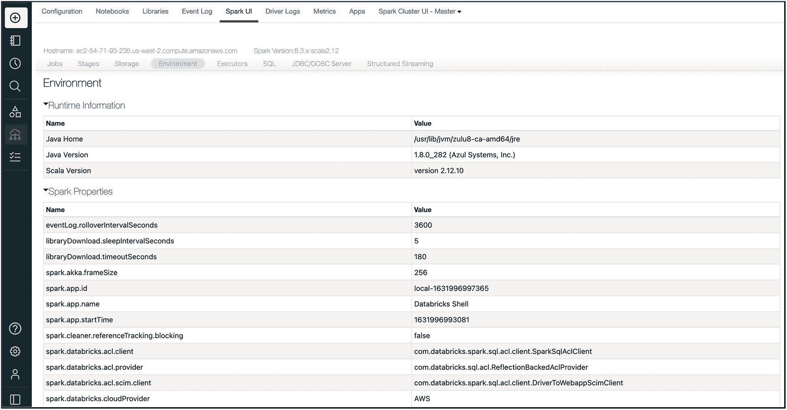
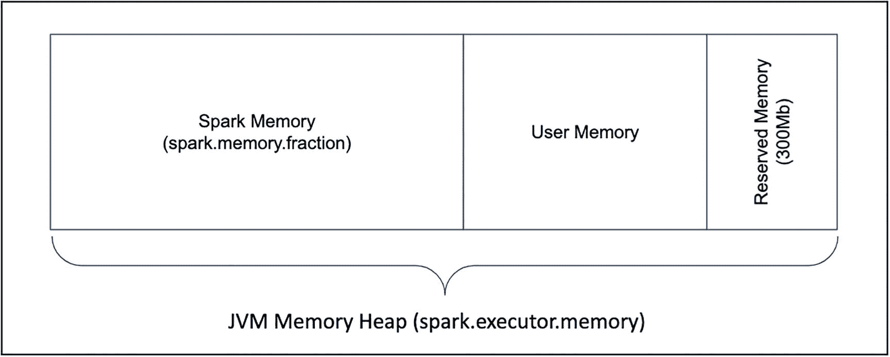
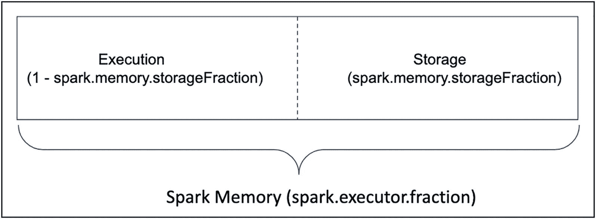
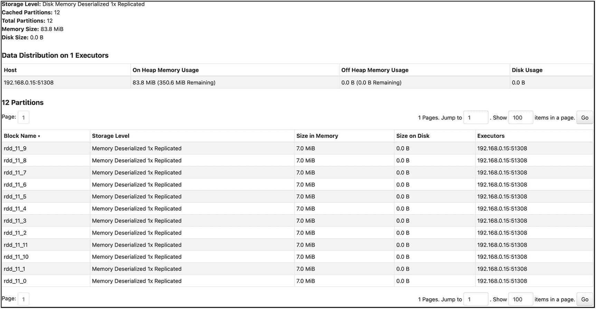
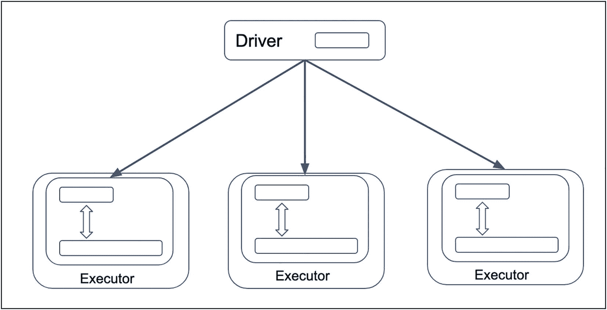
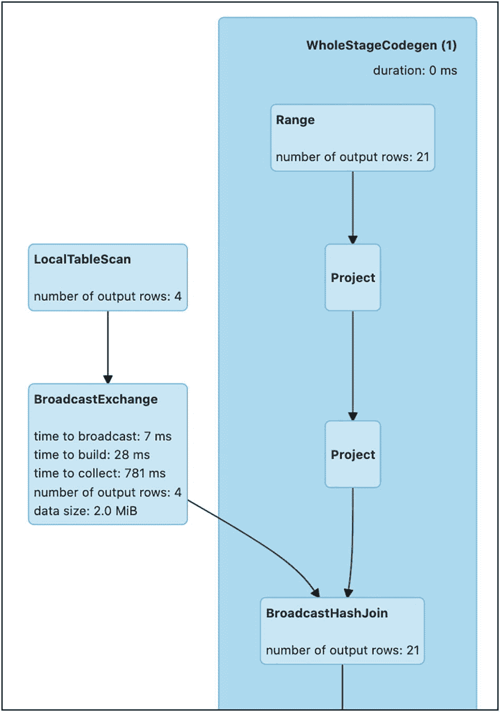
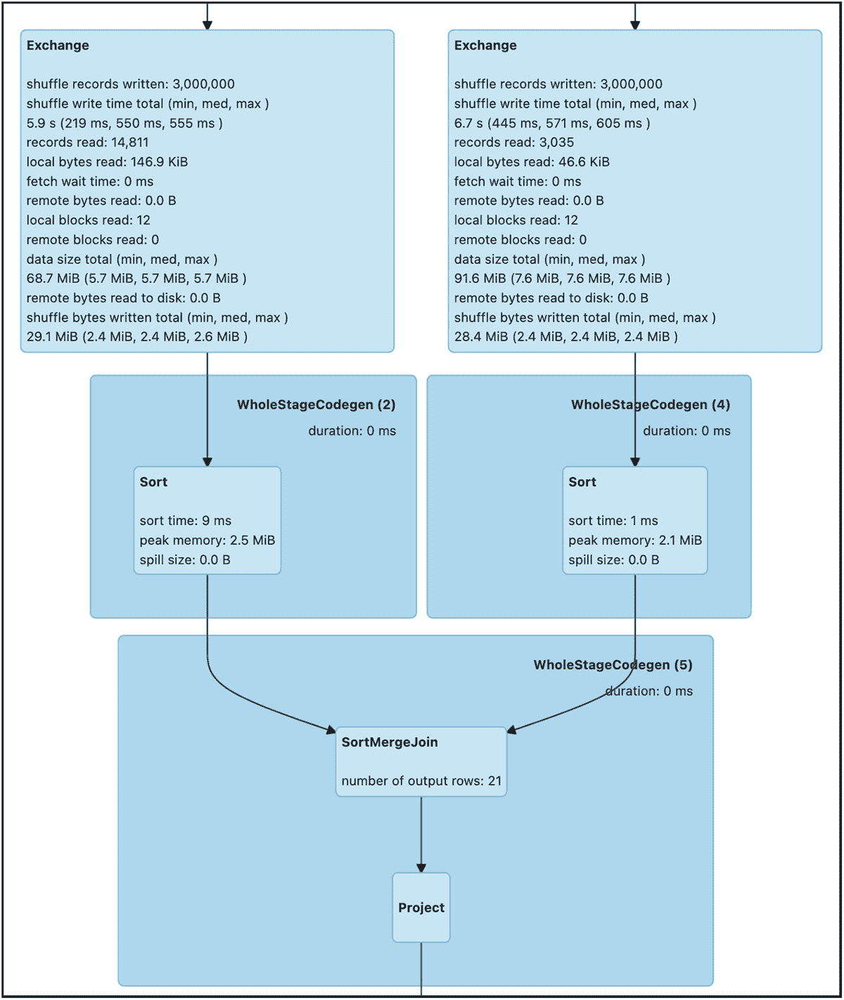
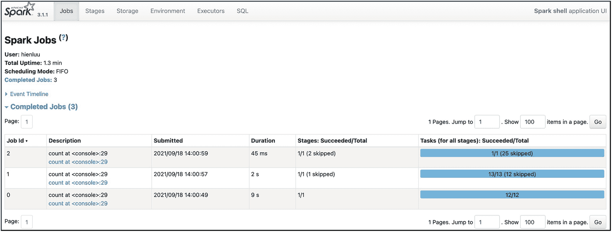
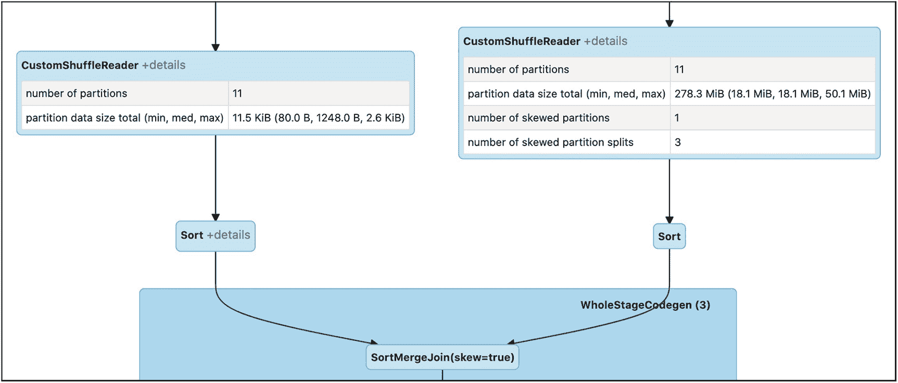

# 五、优化 Spark 应用

第 4 章讲述了 Spark SQL 执行简单到复杂数据处理的主要功能。当您使用 Spark 处理数百 GB 或数 TB 的大型数据集时，您会遇到有趣且具有挑战性的性能问题；因此，知道如何处理它们是很重要的。掌握 Spark 应用程序的性能问题是一个非常有趣、富有挑战性的广泛话题。这需要进行大量的研究，并深入了解 Spark 中与内存管理和数据移动相关的一些关键领域。

全面的调优指南是一个非常大的表面积，值得在自己的书。然而，这不是本章的目的。相反，它旨在讨论一些常见的 Spark 应用程序性能问题，您在开发 Spark 应用程序的过程中可能会遇到这些问题。

首先，它描述了一组常见的性能问题。然后详细介绍提高 Spark 应用程序性能的常用技术，比如调优重要的 Spark 配置和利用内存计算。最后一部分介绍了 Spark 3.0 中引入的自适应查询执行(AQE)框架中的智能优化技术，比如动态合并混洗分区、动态切换连接策略和优化偏斜连接。这些技术使 Spark 开发人员能够将更多的时间放在构建强大的 Spark 应用程序上，而将更少的时间放在性能优化上。

## 常见的性能问题

如果您在互联网上快速搜索常见的 Spark 应用程序性能问题，您会发现它们大致分为两类:OOM(内存不足)和需要很长时间才能完成。为了克服这些性能问题，需要了解 Spark 如何处理内存管理的底层机制，以及它如何执行一些复杂而昂贵的转换，如连接、分组和聚合。

### Spark配置

优化 Spark 应用性能的一个重要方面是了解哪些旋钮可用，如何应用这些旋钮，以及这些旋钮何时有效。在 Spark 世界中，这些旋钮被称为 Spark 属性。它们有数百种，大多数都有合理的默认值。关于 Spark 属性的完整列表，您可以在 [`https://spark.apache.org/docs/latest/configuration.html`](https://spark.apache.org/docs/latest/configuration.html) 查看 Spark 属性文档。

每个 Spark 应用程序开发人员都需要了解 Spark 属性的两个重要方面:三种不同的属性设置方式和两种不同的属性。

#### 设置属性的不同方式

有三种不同的设置属性的方法，按优先顺序进行描述。

第一种方法是通过一组配置文件完成的。在安装 Spark 的目录下，有一个包含三个文件的`conf`文件夹:`log4j.properties.template`、`spark-env.sh.template`和`spark-default.conf.template.`，简单地添加所需的属性和相关值，然后保存它们，不带`.template`后缀，让 Spark 知道将这些属性应用到 Spark 集群和提交到集群的所有 Spark 应用程序。换句话说，这些配置文件中的属性适用于全局集群级别。

第二种方法是在通过`spark-submit`提交 Spark 应用程序时指定 Spark 属性，或者使用`--config`或`-c`标志通过`spark-shell`命令行启动 Spark shell。清单 [5-1](#PC1) 是一个通过命令行传递 Spark 属性的例子。

```scala
./bin/spark-submit --conf "spark-executor-memory=4g" --class org.apache.spark.examples.SparkPi ./examples/jars/spark-examples_2.12-3.1.1.jar

Listing 5-1Passing in Spark Properties via Command Line

```

第三种方法是通过 Spark 应用程序中的`SparkConf`对象直接指定 Spark 属性。清单 [5-2](#PC2) 是在 Scala 的 Spark 应用程序中设置属性的一个非常短的例子。

```scala
import org.apache.spark.sql.SparkSession
def main(args: Array[String]) {
  val sparkSession = SparkSession.builder
                      .config("spark.executor.memory","4g")
                      .config("spark.eventLog.enabled","true")
                      .appName("MyApp").getOrCreate()
}

Listing 5-2Setting Spark Properties Directly in a Spark Application in Scala

```

由于有多种设置属性的方法，Spark 建立了以下优先顺序。直接在`SparkConf`对象上设置的属性优先级最高，其次是在`spark-submit`或`spark-shell`命令行上传递的标志，然后是配置文件中的选项。

#### 不同种类的属性

并非所有的Spark特性都是同等产生的。理解在应用程序部署生命周期的哪一部分使用哪一个是很重要的。Spark 属性主要可以分为两种:部署和运行时。

与部署相关的属性在 Spark 应用程序启动步骤中设置一次，之后就不能再更改了。因此，在运行时通过`SparkConf`对象以编程方式设置它们是没有意义的。这类属性的例子有`spark.driver.memory`或`spark.executor.instances.`，建议通过配置文件或通过`spark-submit`命令行设置这些属性。

在 Spark 应用程序运行期间，与运行时相关的属性控制 Spark 的各个方面，例如`spark.sql.shuffle.partitions`，在为连接和聚合而移动数据时使用的分区数量。除了通过命令行在配置文件中设置它们之外，还可以通过`SparkConf`对象以编程方式重复设置它们。

#### 查看Spark属性

设置Spark属性后，验证它们的值是很重要的。查看 Spark 属性最简单的方法之一是在 Spark web UI 的 Environment 选项卡中。图 [5-1](#Fig1) 显示了Spark特性的一个例子。



图 5-1

环境选项卡中的Spark属性

查看 Spark 属性的另一个简单方法是从 Spark 应用程序的`SparkConf`对象中以编程方式检索它们。清单 [5-3](#PC3) 展示了如何做到这一点。

```scala
scala> for (prop <- spark.conf.getAll.keySet) {
            println(s"${prop}: ${spark.conf.get(prop)}")
       }

spark.sql.warehouse.dir: file:/<path>/spark-warehouse
spark.driver.host: 192.168.0.22
spark.driver.port: 63834
spark.repl.class.uri: spark://<ip>:63834/classes

spark.repl.class.outputDir:/private/var/folders/_m/nq53ddp...
spark.app.name: Spark shell
spark.submit.pyFiles:
spark.ui.showConsoleProgress: true
spark.app.startTime: 1621812866358
spark.executor.id: driver
spark.submit.deployMode: client

spark.master: local[*]
spark.home: /<path>/spark-3.1.1-bin-hadoop2.7
spark.sql.catalogImplementation: hive
spark.app.id: local-1621812867559

Listing 5-3Displaying Spark Properties Programmatically

```

### Spark存储器管理

Spark 开发人员在开发和操作处理大量数据的 Spark 应用程序时遇到的挑战之一是处理内存不足(OOM)错误。当这种情况发生时，您的 Spark 应用程序停止工作或崩溃，您唯一能做的就是找出根本原因，修复它并重启您的应用程序。

在讨论 OOM 问题之前，让我们先回顾一下 Spark 是如何在驱动程序和执行器上管理内存的。如第 [1](01.html) 章所述，每个 Spark 应用程序由一个驱动程序和一个或多个执行程序组成。

#### Spark驱动器

关于内存管理，Spark 驱动程序的内存量由`spark.driver.memory`配置决定，这通常是在通过`spark-submit`命令或 Databricks 集群创建过程中的类似机制启动 Spark 应用程序时指定的。`spark.driver.memory`配置的默认值是 1 GB。

驱动程序主要负责协调 Spark 应用程序的工作负载，因此它不需要像执行器那样多的内存。有两种场景需要分配内存，在这些场景中任何不正确的 Spark 使用都可能导致 OOM 问题。

第一种情况是调用`RDD.collect`或`DataFrame.collect`动作。此操作将 RDD 或数据帧的所有数据从所有执行器传输到应用程序的驱动程序，然后驱动程序尝试分配必要的内存来存储传输的数据。例如，如果数据帧中的数据大小约为 5 GB，而驱动程序只有 2 GB，则在调用操作时会遇到 OOM 问题。与这种情况最相似的是将五个一加仑的桶中的水倒入一个两加仑的桶中。

Spark 文档建议，只有当数据量预计很小并且可以放入驱动程序内存时，才应该使用这些操作。减小 RDD 或数据帧大小的两种常见方法是，在将数据收集到Spark驱动器端之前，执行某种过滤并调用极限变换。

第二个场景是 Spark 试图广播数据集的内容。这是因为 Spark 应用程序通过调用`SparkContext.broadcast`函数使用广播变量，或者 Spark 正在执行广播连接，这将在“理解 Spark 连接”一节中讨论。

广播变量是一种优化技术，Spark 将数据集的不可变副本从驱动程序发送到 Spark 应用程序中的所有执行器。一旦执行器拥有数据集的副本，它就可供该执行器上的所有当前和未来任务使用。本质上，这是为了避免在重复需要时将同一个数据集多次传输给执行者。为了确保不会遇到 OOM 问题，请确保数据集的大小较小，或者增加驱动程序的内存大小。

在执行广播连接时，Spark 将两个被连接的数据帧中较小的数据帧发送给所有的执行器。与广播变量的情况类似，如果较小数据帧的数据太大，就会遇到 OOM 问题。您可以通过设置`spark.sql.autoBroadcastJoinThreshold`配置的值来控制 Spark 何时使用广播连接，该值的默认值为 10 GB。如果要禁用广播加入，可以将此配置值设置为–1。

#### Spark执行器

Spark 执行器端的内存管理比驱动程序端更复杂。首先，让我们讨论它如何管理内存，以及它决定在内存中存储什么。

在运行时，每个执行器都是一个运行在操作系统上的 JVM 进程。可用内存量是在 Java 虚拟机(JVM)内存堆中分配的。当启动 Spark 应用程序时，可以通过为`spark.executor.memory`属性指定一个值来为执行器指定 JVM 内存堆大小，这个值的默认值是 1 GB。JVM 堆分为三个区域:Spark内存、用户内存和保留内存(见图 [5-2](#Fig2) )。



图 5-2

JVM 堆的不同区域

图 [5-2](#Fig2) 表示`spark.executor.memory`属性中指定的内存并没有全部分配给执行者。在 Spark 应用程序中处理与内存相关的问题时，记住这一点很重要。让我们探索 JVM 内存堆中的每个区域。

*   **保留内存**留出固定数量的内存供内部使用。截至 Spark 版本，预留量为 300 MB。

*   **用户内存**是用于存储从 Spark 应用程序开发人员的数据结构创建的对象的区域，Spark 中的内部元数据，并在记录稀疏且通常较大的情况下防止 OOM 错误。该区域的大小计算为(1-`spark.memory.fraction`)*(`spark.executor.memory`-保留内存)。

*   **Spark记忆**是执行者控制下的区域。它用于执行和存储。该区域的大小计算为(`spark.memory.fraction`)*(`spark.executor.memory`–保留内存)。

更具体地说，让我们看一个例子，其中 JVM 堆大小(`spark.executor.memory`)是 4 GB，并使用配置的默认值`spark.memory.fraction`0.6。表 [5-1](#Tab1) 列出了每个 JVM 堆区域的大小。

表 5-1

具有 4 GB 堆大小的 JVM 堆区域大小

<colgroup><col class="tcol1 align-left"> <col class="tcol2 align-left"> <col class="tcol3 align-left"></colgroup> 
| 

面积

 | 

公式

 | 

大小

 |
| --- | --- | --- |
| 保留内存 | 不适用的 | 300 兆字节 |
| 用户存储器 | （1 - 0.6） * （4GB - 300MB） | 1.4 GB |
| Spark记忆 | （0.6） * （4 千兆字节 - 300 MB） | 2.2 GB |

现在让我们更深入地研究 JVM 堆的 Spark 内存区域，Spark 执行器完全控制这个区域。该区域进一步分为两个隔间:执行和存储(见图 [5-3](#Fig3) )。这两个隔间的大小是使用`spark.memory.storageFraction`配置计算的，默认值为 0.5。



图 5-3

Spark存储区中的两个隔间

Spark executor 决定在每个隔间中存储什么，它可以根据需要扩展和收缩每个隔间。下面列出了每个隔间中存储的内容以及如何计算其初始大小。

*   执行
    *   此隔离专区用于在任务执行过程中缓冲中间数据，例如混洗数据、联接两个数据集、执行聚合或排序数据。这些对象通常是短暂的，在任务完成后不再需要。

    *   该隔间的大小计算如下(Spark存储区*(1–`spark.memory.storageFraction`))

*   仓库
    *   此区间用于存储所有缓存数据，以备将来重复访问和广播变量。当您在数据帧上调用`persist()`或`cache()` API 时，它的数据被保存在内存中，并被称为缓存数据。Spark 应用程序用户控制缓存数据的生命周期，但是由于内存压力，数据可能会被驱逐。

    *   该区间的大小由`spark.memory.storageFraction`控制，计算方法为(Spark存储区* `spark.memory.storageFraction`)

Spark 版中引入了统一内存管理功能，以智能方式管理这两个部分，这种方式适用于大多数工作负载，在调整内存部分方面需要很少的专业知识，并利用应用程序不会缓存太多数据的未使用存储内存。

它通过在隔离专区之间建立一个边界来实现这些目标，该边界作为一个灵活的屏障，可以根据需要移动到任何一侧，并建立特定的规则来避免内存不足和系统故障。规则如下。

*   当执行内存超出其区间时，它可以借用尽可能多的空闲存储内存。

*   当存储内存超出其容量时，它可以借用尽可能多的空闲执行内存。

*   当执行需要更多内存，并且它的一些内存被存储舱借用时，它可以强制驱逐存储所占用的内存。

*   当存储需要更多的内存，并且它的一些内存被执行舱借用时，它不能强制驱逐被执行占用的内存。存储必须等到执行程序释放它们。

这些规则背后的主要动机是为执行提供所需的空间，而清除存储内存实现起来要简单得多。

为了防止存储内存不足，需要保证为缓存数据保留的最小内存。这是通过要求执行器接受由`spark.memory.storageFraction`属性指定的内存量来实现的，该属性指定免于驱逐的存储内存量。换句话说，只有当总存储量超过存储隔间大小时，才可以驱逐用于高速缓存数据的存储存储器。

Spark 的规则和保证可以很好地支持多种类型的工作负载。当特定类型的工作负载执行大量复杂而广泛的转换，并且不需要缓存太多数据时，它可以根据需要利用存储舱中的空闲内存。

表 [5-2](#Tab2) 描述了与内存相关的属性。

表 5-2

记忆相关的Spark特性

<colgroup><col class="tcol1 align-left"> <col class="tcol2 align-left"> <col class="tcol3 align-left"></colgroup> 
| 

属性名称

 | 

缺省值

 | 

描述

 |
| --- | --- | --- |
| `spark.driver.memory` | 1GB | 用于驱动程序进程的内存量 |
| `spark.executor.memory` | 1 GB | 每个执行器进程使用的内存量 |
| `spark.memory.fraction` | Zero point six | 用于执行和存储的部分(JVM 堆空间–300 MB)。越低。建议将其保留为默认值。 |
| `spark.memory.storageFraction` | Zero point five | 存储内存的数量不受驱逐的影响，表示为由`spark.memory.fraction`留出的区域大小的一部分。它越高，可用于执行的内存就越少，任务可能会更频繁地溢出到磁盘。建议将其保留为默认值 |

接下来，让我们讨论几个您可能会遇到 OOM 问题的常见场景。

## 利用内存中的计算

Spark 与其他数据处理引擎或框架的区别之一是能够执行内存计算，以加速 Spark 应用程序中的数据处理逻辑。本节讨论何时利用这个独特的特性，以及如何在 Spark 集群中的执行器之间将数据持久化到 Spark 临时存储(内存或磁盘)中。

### 何时保存和缓存数据

Spark 提供了将数据帧中的数据持久化(或缓存)到内存中的能力，这可供任何未来的操作使用。因此，这些操作的运行速度要快得多，通常是 10 倍，因为它们需要的数据是从计算机内存中读取的。这种能力对于迭代算法以及需要或多次重用数据帧的数据时非常有用。机器学习算法是高度迭代的，这意味着它们通过多次迭代来产生优化的模型。这种能力也有助于为分析目的提供数据的快速和交互式使用。简而言之，当一个数据帧的数据在 Spark 应用程序中被多次重用时，强烈建议您考虑持久化该数据帧数据以加速 Spark 应用程序。

让我们通过一个简单的例子来说明利用内存计算的必要性。假设您被要求分析一个具有数十亿行的大型日志文件，通过分析各种类型的异常来确定最近生产问题的根本原因。将日志文件中的数据读入 DataFrame 后，下一步是过滤这些行，只保留包含单词 *exception* `. Then,`的行，并将这些行保存在内存中，以便可以重复分析不同种类的异常。

就序列化、反序列化和存储成本而言，持久化数据集确实会产生一些成本。如果数据集只使用一次，缓存会降低 Spark 应用程序的速度。

### 持久性和缓存 API

Spark DataFrame 类提供了两个 API 来持久化数据:`cache()`和`persist()`。两者都提供相同的功能。前者是后者的简化版本，它提供了对数据帧存储方式和位置的更多控制，例如存储在内存或磁盘上，以及数据是否以序列化格式存储。

有理由问，当 Spark 应用程序没有足够的内存在内存中缓存大型数据集时会发生什么。例如，假设您的 Spark 应用程序有十个执行器，每个执行器有 6 GB 的 RAM。如果您希望保存在内存中的数据帧的大小是 70 GB，那么它就不适合 60 GB 的 RAM。这就是存储级概念的由来。持久化数据时有两个选项可供选择:位置和序列化。位置决定了数据应该存储在内存中、磁盘上还是两者的组合中。序列化选项确定数据是否应该存储为序列化对象。这两个选项代表了您正在进行的不同类型的权衡:CPU 时间和内存使用。表 [5-3](#Tab3) 描述了不同的选项，表 [5-4](#Tab4) 描述了权衡信息。

表 5-4

内存空间与 CPU 时间的权衡

<colgroup><col class="tcol1 align-left"> <col class="tcol2 align-left"> <col class="tcol3 align-left"></colgroup> 
| 

存储级别

 | 

存储量

 | 

中央处理机时间

 |
| --- | --- | --- |
| 仅限内存 | 高的 | 低的 |
| 内存和磁盘 | 高的 | 中等 |
| 仅存储用户 | 低的 | 高的 |
| 内存和磁盘用户 | 低的 | 高的 |
| 仅磁盘 | 低的 | 高的 |

表 5-3

持久化数据的存储和序列化

<colgroup><col class="tcol1 align-left"> <col class="tcol2 align-left"></colgroup> 
| 

存储级别

 | 

描述

 |
| --- | --- |
| 仅限内存 | 将数据作为反序列化对象仅保存在内存中 |
| 内存和磁盘 | 将数据作为反序列化对象保存在内存中。如果没有足够的内存，其余的将作为序列化对象存储在磁盘上。 |
| 仅存储用户 | 将数据作为序列化对象仅保存在内存中。 |
| 内存和磁盘用户 | 类似于 MEMORY_AND_DISK，但是将数据作为序列化对象保存在内存中。 |
| 仅磁盘 | 仅将数据作为序列化对象保存在磁盘上。 |
| MEMORY_ONLY_2，内存和磁盘 2 | 与 MEMORY_ONLY 和 MEMORY_AND_DISK 相同，但是在两个集群节点上复制数据。 |

当不再需要持久存储数据帧的数据时，可以使用`unpersist()` API 在调用`persist()` API 时根据指定的级别将其从内存或磁盘中删除。Spark簇具有有限的内存；如果保持持久化数据帧，当可用内存量较低时，Spark 会使用 LRU 回收策略来自动回收最近没有被访问过的持久化数据帧。

### 持久性和缓存示例

本节将介绍一个在 Spark show 中持久化数据以提高性能的例子。它还查看了一个示例 Spark UI，展示了存储在 Spark executor 中的分区。清单 [5-4](#PC4) 中的例子首先生成有 3 亿行的`app_log_df`数据帧，其中有三列:id、消息、日期。然后，它过滤`app_log_df`数据帧，只包含消息列中带有单词 *exception* 的消息，最后将输出分配给`except_log_df`数据帧。

```scala
import org.apache.spark.sql.functions._
import scala.util.Random

val log_messages = Seq[String](
      "This is a normal line",
      "RuntimeException - this is really bad",
      "ArrayIndexOutOfBoundsException - don’t do this",
      "NullPointerException - this is a nasty one",
      "SQLException - bad SQL again!!!"
)

// set up functions and UDF
def getLogMsg(idx:Int) : String = {
    val randomIdx = if (Random.nextFloat() < 0.3) 0 else
    Random.nextInt(log_messages.size)
    log_messages(randomIdx)
}

val getLogMsgUDF = udf(getLogMsg(_:Int):String)

// generate a DataFrame
val app_log_df = spark.range(30000000).toDF("id")
                  .withColumn("msg", getLogMsgUDF(lit(1)))
                  .withColumn("date",
                              date_add(current_timestamp,
                              -(rand() * 360).cast("int")))

// generate a DataFrame with “Exception” message
val except_log_df = app_log_df
                          .filter(msg.contains("Exception"))

// before persisting
except_log_df.count()

// call persist transformation to persist exception_log_df
except_log_df.cache()

// materialize the exception_log_df
except_log_df.count()

// this should be really fast
// since exception_log_df is now in memory
exception_log_df.count()

// evict exception_log_df from memory
exception_log_df.unpersist()

Listing 5-4Code Example to Persisting Data in Spark

```

图 [5-4](#Fig4) 显示了三个`count`动作的持续时间。作业 0 用于第一次调用，耗时 8 秒。Job 0 用于第二次调用，该调用强制 Spark 在内存中物化 DataFrame 数据，耗时 7 秒。作业 2 是最后一次调用，仅用了 56 毫秒。如您所见，访问内存中的数据非常快。


图 5-4

显示每个计数操作的持续时间

要查看 Spark 如何在内存中存储`except_log_df`数据帧，请调出 Spark UI 并导航到 Storage 选项卡。图 [5-5](#Fig5) 显示了缓存分区的数量和内存的总大小。


图 5-5

Spark UI 中的存储选项卡显示了缓存的数据帧

要查看持久化数据帧的每个分区的详细信息，请单击 RDD 名称列下的链接。图 [5-6](#Fig6) 显示了每个分区的大小、位置、存储级别和复制因子。



图 5-6

缓存分区的详细信息

您可以通过使用类型为`StorageLevel`的适当参数调用`persist` API 来指定存储和复制因子。

要以编程方式驱逐持久化的数据帧，您可以简单地调用`unpersist` API。分区从内存和 Spark UI 的存储选项卡中消失。

请注意，图 [5-5](#Fig5) 中的 RDD 名字列有一个长而神秘的名字。要为持久化数据帧指定一个人类可读的名称，您必须使用几行额外的代码。第一步是创建一个带有名称的临时视图，然后将相同的名称传递给使用的`SQLContext`的`cachTable` API。清单 [5-5](#PC5) 显示了所需的代码行。

```scala
except_log_df.createOrReplaceTempView("exception_DataFrame")
spark.sqlContext.cacheTable("exception_DataFrame")

Listing 5-5Persisting a DataFrame with a Human-Readable Name

```

如果这两行被成功执行，那么存储选项卡的 RDD 名称列下的名称应该类似于图 [5-7](#Fig7) 。


图 5-7

“存储”选项卡上持久数据帧的可读名称

要驱逐持久化的数据帧，只需将视图名传递给`SQLContext`的`uncacheTable` API。

## 了解Spark连接

执行任何有意义的数据分析都需要连接两个数据集，以用更多信息丰富一个数据集，或者通过执行某种聚合来提取洞察力。连接操作实际上是使用指定的键合并两个数据集。

Spark 广泛支持连接操作和数据帧、数据集和 Spark SQL APIs 中的各种连接类型。这将在第 [4](04.html) 章中介绍。本章讨论了 Spark 使用的一些连接策略以及与内存和性能相关的方面。

连接策略是一种执行连接操作的方法。Spark 支持五种不同的连接策略:广播散列连接(BHJ)、混洗散列连接(SHJ)、混洗排序合并连接(SMJ)、广播嵌套循环连接(BNLJ)和混洗复制嵌套循环连接(又称为笛卡尔乘积连接)。表 [5-5](#Tab5) 总结了每一项。在这五种策略中，Spark 中最常用的是 BHJ 和 SMJ，因为它们足够灵活，可以处理大多数情况，例如当一个数据集很小或两个数据集都很大时。

表 5-5

加入策略摘要

<colgroup><col class="tcol1 align-left"> <col class="tcol2 align-left"> <col class="tcol3 align-left"></colgroup> 
| 

名字

 | 

连接条件

 | 

描述

 |
| --- | --- | --- |
| 广播散列连接 | 等值联接 | 当其中一个数据集小到足以在网络上传播时，执行哈希连接。 |
| 无序散列连接 | 等值联接 | 当两个数据集很大时，在网络上混洗它们，然后执行散列连接。 |
| 洗牌合并加入 | 等值联接 | 当两个数据集很大时，在网络上对它们进行混排、排序，然后合并。 |
| 广播嵌套循环连接 | 等值和非等值联接 | 广播较小的数据集，并使用嵌套循环来执行连接。 |
| 无序复制嵌套循环连接 | 等值和非等值联接 | 笛卡尔乘积连接。非常慢。 |

### 广播散列连接

在五种连接策略中，BHJ(也称为仅地图端连接)是 Spark 中最简单、最快的连接策略，适用于其中一个数据集很小的情况。该策略通过驱动程序向 Spark 集群中的所有执行器广播较小数据集的副本。然后对更大的数据集执行连接，如图 [5-7](#Fig7) 所示。

Spark 使用属性`spark.sql.autoBroadcastJoinThreshold`的值来确定哪个数据集适合广播，其默认值是 10 MB。如果 Spark 集群有足够的内存来处理更大数据集的广播，那么只需将阈值增加到适当的值。BHJ 如图 [5-8](#Fig8) 所示。



图 5-8

从驱动程序向执行器广播较小的数据集哈希连接策略

当您在两个数据集之间执行连接，并且确定其中一个数据集的大小小于上述属性的阈值时，您可以通过检查执行计划来验证 Spark 是否使用了 BHJ 策略。清单 [5-6](#PC6) 展示了一个连接两个数据集的简单例子。

```scala
import org.apache.spark.sql.functions._
val small_df = Seq(("WA", "Washington"), ("CA", "California"),
                   ("AZ", "Arizona"), ("AK", "ALASKA"))
                .toDF("code", "name")
val large_df = spark.range(500000).toDF("id")
            .withColumn("code", when(rand() < 0.2, "WA")
                               .when(rand() < 0.4, "CA")
                               .when(rand() < 0.6, "AZ")
                               .otherwise("AK"))
            .withColumn("date",
                date_add(current_date,
                         -(rand() * 360).cast("int")))

val joined_df = small_df.join(large_df, "code")

Listing 5-6Joining One Small Dataset with a Larger One

```

Spark UI 有一个很好的可视化方式来举例说明执行计划，如图 [5-9](#Fig9) 所示。只需导航到 SQL 选项卡，然后单击要执行的作业。这个例子显示了通过`BroadcastExchange`操作符广播较小的数据集，然后使用`BroadHashJoin`策略。



图 5-9

Spark UI 中的广播哈希连接策略

### 无序排序合并连接

Spark 的另一个常用连接策略是 SMJ，这是连接两个大型数据集的有效方法。SMJ 首先将两个数据集中具有相同键的行放到同一个执行器的同一个分区中。接下来，按照指定的连接键对这些行进行排序。最后，合并步骤遍历这些行，合并具有匹配键的行。排序-合并过程类似于合并排序算法中的过程。这是一种合并两个大型数据集的有效方法，无需像 SHJ 那样先将一个数据集加载到内存中。

清单 [5-7](#PC7) 展示了一个模拟 SMJ 的小例子，首先通过将属性`spark.sql.autoBroadcastJoinThreshold`的值设置为–1 来禁用 SHJ，然后连接两个合理大小的数据帧。

```scala
import org.apache.spark.sql.functions._

// disable the broadcast hash strategy for Spark
// to use the shuffle sort merge strategy
spark.conf.set("spark.sql.autoBroadcastJoinThreshold", "-1")

val item_df = spark.range(3000000).toDF("item_id")
                   .withColumn("price",
                               (rand() * 1000).cast("int"))
val sales_df = spark.range(3000000).toDF("pId")
                    .withColumn("item_id",
                       when(rand() < 0.8, 100)
                       .otherwise(rand() *
                                  30000000).cast("int"))
                     .withColumn("date",
                                 date_add(current_date,
                                 -(rand() * 360).cast("int")))

val item_sale_df = item_df.join(sales_df, "item_id")

item_sale_df.show()

+-------+-----+-------+----------+
|item_id|price|    pId|      date|
+-------+-----+-------+----------+
|  18295|  484|2607123|2020-09-27|
|  19979|  261|1121863|2020-07-05|
|  37282|  915|1680173|2020-10-04|
|  54349|  785| 452954|2021-05-28|
|  75190|  756| 142474|2021-02-19|
|  89806|  763|1842105|2020-06-26|
|  92357|  689|1451331|2021-03-07|
| 110753|  418|1803550|2020-11-25|
| 122965|  729| 917035|2020-06-22|
| 150285|  823|2306377|2020-10-05|
| 180163|  591| 330650|2020-07-13|
| 181800|  606|2065247|2020-11-06|
| 184659|  443| 982178|2020-09-01|
| 198667|  796|2985859|2021-04-02|
| 201833|  464| 709169|2020-07-31|
| 208354|  357| 927660|2021-05-30|
| 217616|  627| 174367|2021-04-25|
| 223396|  752|2850510|2020-11-05|
| 225653|  188|2439243|2021-01-16|
| 233633|  628|2811113|2020-12-02|
+-------+-----+-------+----------+

Listing 5-7Joining Two Large Datasets Using SMJ

```

运行代码后，您可以在 Spark UI 中导航到 SQL 选项卡来查看执行计划，如图 [5-10](#Fig10) 所示。请注意，排序步骤首先发生，接下来是合并步骤。



图 5-10

Spark UI 中的混洗合并连接策略

## 自适应查询执行

Spark 3.0 中引入的有用和创新特性之一是自适应查询执行(AQE)框架。它应该是开发和维护处理数百 TB 到数 Pb 的大型数据管道的 Spark 应用程序开发人员或每天使用 Spark 对大型数据集执行复杂的交互式分析的数据分析师最喜欢的功能。AQE 扩展了 Spark SQL 的查询优化器和规划器，使用关于行数、分区大小等的最新统计数据来动态调整和重新生成高质量和优化的查询执行计划，以自动解决大多数常见的性能问题，并加快 Spark 应用程序的完成时间或防止它们进入 OOM。

在 Spark 2.0 中，Spark SQL Catalyst optimizer 为生成查询执行计划提供了一个通用框架，并提供了一组基于规则的优化来提高性能。Spark 2.2 引入了基于成本的优化，通过利用生成的每列数据统计信息(如基数、最小/最大值和空值)来改进优化。

Spark 3.0 中引入了 AQE，以利用关于阶段间分区的运行时统计信息来调整和重新生成查询执行计划，从而提高一些最常见的性能场景的性能，如分区过多、数据不对称或使用错误的连接类型。

为了更好地理解 AQE 是如何工作的，让我们首先回顾一下关于 Spark 工作、阶段和任务的几个核心概念。当一个数据帧的动作类型 API 被调用时，比如`count()`，或者`collect(),`或者`show()`，Spark 会启动一个任务，通过执行所有之前的转换来执行这个动作。

每个作业由一个或多个阶段组成，每当 Spark 遇到大范围转换时，就需要一个阶段，这涉及到从多个分区移动输入数据。宽变换的例子包括`groupBy()`或`orderBy()`。每个阶段都将其中间结果物化到磁盘上，只有完成所有分区的物化，才能进行下一个阶段。这代表了 AQE 通过利用分区的运行时统计数据(比如分区的总数和每个分区的大小)来调整其执行计划的自然位置。这就是为什么每个 AQE 特色名称的第一个单词都以单词*开头的主要原因。需要注意的一点是，只有当 Spark 应用程序有一个或多个阶段时，AQE 才有用。*

图 [5-11](#Fig11) 直观总结了本段所述的流程。


图 5-11

AQE 在行动

AQE 提供的性能优化非常容易使用。只需打开适当的属性，AQE 就会立即行动。启用 AQE 的顶级属性叫做`spark.sql.adaptive.enabled`，所以在尝试下面的例子之前，一定要将它设置为 true。每个特性都有自己的属性集来控制特定特性的各个细粒度方面，这将在每一节中讨论。

AQE 框架提供了这三个极其有用的特性。

*   动态合并混洗分区

*   动态切换连接策略

*   动态优化偏斜连接

以下部分讨论了它们是什么以及它们是如何工作的。

### 动态合并混洗分区

Spark 中最昂贵的操作之一是洗牌，这意味着在网络上移动数据，以便根据后续操作的需要适当地重新分配数据。如果不进行相应的调整，该操作会显著影响查询性能。关于混排的主要调节旋钮是分区的数量。如果该数字太低或太高，查询性能会降低。一个常见的挑战是分区的最佳数量通常特定于手边的用例。由于数据量的增加或数据处理逻辑的任何变化，它可能需要频繁更新。

当分区数量太大时，由于在 Spark 集群中的许多节点上传输少量数据，会造成不必要的 I/O 使用效率低下。此外，需要许多任务来复制数据，这给 Spark 任务调度程序带来了不必要的工作。

当分区数量太少时，某些分区的数据量会很大。处理这些大分区的任务需要很长时间才能完成，并且可能需要将数据溢出到磁盘。因此，这会减慢整个查询的完成时间。

为了应对分区数量的两个极端，可以通过将分区数量设置得较大来开始查询。AQE 通过在洗牌结束时利用最新的统计数据，自动将小分区组合或合并成更大的分区，以克服低效率和性能相关问题。图 [5-12](#Fig12) 直观地描述了一个 AQE 未启用的例子，这些小分区是经过处理的独立异径管。图 [5-13](#Fig13) 直观地描述了启用 AQE 的示例。小分区(B、C、D)合并成一个分区，因此总的异径管数量较少。这些数字的灵感来自这份数据块日志(参见 [`https://databricks.com/blog/2020/05/29/adaptive-query-execution-speeding-up-spark-sql-at-runtime.html`](https://databricks.com/blog/2020/05/29/adaptive-query-execution-speeding-up-spark-sql-at-runtime.html) )。


图 5-13

AQE 已启用


图 5-12

AQE 是残疾人

现在，让我们通过模拟一个场景来分析一个小型事务性事实表的计数，来看看动态合并混洗分区特性的实际应用，该事实表中大约 80%的商品是一个 ID 为 100 的流行商品。清单 [5-8](#PC8) 生成 1 亿行，80%的 item _ ids 的值为 100。接下来，它对每个 item_id 计数，然后对不同的 item _ id 计数。

```scala
import org.apache.spark.sql.functions._
// make sure the AQE is enabled
spark.conf.set("spark.sql.adaptive.enabled", "true")
spark.conf.get("spark.sql.adaptive.enabled")

val dataDF = spark.range(100000000).toDF("pId")
                .withColumn("item_id",
                     when(rand() < 0.8, 100)
                     .otherwise(rand() * 3000000).cast("int"))

dataDF.groupBy("item_id").count().count()

Listing 5-8Performing the Analysis of Item Count from a Synthetic Small Transaction Fact Table

```

完成`count()`动作后，进入 Spark UI。在第一个 Jobs 选项卡上，您会注意到三个作业中有两个被跳过，大部分工作是在 job 0 中完成的。图 [5-14](#Fig14) 显示了跳过作业的一个例子。



图 5-14

Spark UI 显示跳过的作业

让我们通过单击 Description 列下的超链接来检查 job 2。Spark UI 显示阶段 2 和阶段 3 被跳过，您会在阶段 2 的顶部看到一个名为`CustomShuffleReader` operator 的操作符。AQE 框架引入了这个操作符来合并大小小于属性`spark.sql.adaptive.advisoryPartitionSizeInBytes,`指定的大小的分区，该属性的默认值为 64 MB。图 [5-15](#Fig15) 显示了跳过阶段的 Spark UI。


图 5-15

Spark UI 显示跳过的作业和跳过的阶段

如果 AQE 被禁用，您将会看到一个非常不同的执行计划，该计划由一个单一作业(见图 [5-16](#Fig16) )和三个阶段(见图 [5-17](#Fig17) )组成。最值得注意的部分是第二阶段，根据属性`spark.sql.shuffle.partitions`的默认值，将数据划分为 200 个分区，其中大多数分区只有少量数据，如图 [5-18](#Fig18) 所示。


图 5-18

Spark UI 显示 200 个任务


图 5-17

Spark UI 显示了三个阶段及其任务


图 5-16

Spark UI 显示了执行 GroupBy 操作符的单个作业

动态合并洗牌分区功能有一小组属性来控制其行为。表 [5-6](#Tab6) 描述了这些属性。它们的名字以相同的`spark.sql.adaptive`前缀开始，因此为了简洁起见，省略了它。

表 5-6

动态合并随机分区属性

<colgroup><col class="tcol1 align-left"> <col class="tcol2 align-left"> <col class="tcol3 align-left"></colgroup> 
| 

财产

 | 

缺省值

 | 

描述

 |
| --- | --- | --- |
| <prefix>.聚结分区.已启用</prefix> | 真实的 | 支持分区合并的细粒度控制。 |
| <prefix>建议分区大小字节</prefix> | 64 兆字节 | 目标合并分区的大致大小。大小不大于目标大小。 |
| <prefix>. coalesce partitions . minpartitionsize</prefix> | 1 MB | 合并分区的最小大小。大小不小于该值。 |
| <prefix>. coalesce partitions . minpartitionnum</prefix> | 未指定时的默认Spark平行度 | 合并后建议的最小洗牌分区数。 |

### 动态切换连接策略

在 Spark 支持的不同连接类型中，性能最好的一种称为广播散列连接。过去，Spark 开发人员要么需要给 Spark 提示，要么通过使用`broadcast`函数标记其中一个数据集来明确请求 Spark 使用广播散列连接。启用 AQE 后，当 Spark 检测到连接一端的大小低于广播大小阈值时，它会动态切换到广播散列连接，以提高查询性能。当其中一个联合数据集以较大的大小开始时，这非常有用，在过滤运算符完成后，其大小会显著减小。AQE 拥有各阶段之间所有分区的更新统计数据，因此它可以利用这些数据来确定在运行时切换 join 是否有意义。

控制是否应该使用广播散列连接的阈值是`spark.sql.autoBroadcastJoinThreshold`属性，它的默认值是 10 MB。如果连接中某个数据集的数据大小小于该值，则 AQE 会切换到广播哈希连接。如果您的 Spark 集群有足够的内存在内存中存储广播数据集，那么将阈值增加到更高的值是有意义的。如果你使用数据块，那么这个属性就叫做`spark.databricks.adaptive.autoBroadcastJoinThreshold.`

现在，让我们通过模拟一个场景来看看动态切换连接策略的功能，在该场景中，连接两个数据集后，聚合逻辑具有一个过滤条件，使得一个数据集的大小低于自动广播连接阈值。AQE 可以在运行时检测到这一点，它将排序-合并连接切换到广播散列连接，以加快查询速度。初始静态计划不知道过滤器的选择性。

清单 [5-9](#PC9) 设置了两个数据帧——汽车注册和汽车销售。在其中一个列被联接后，将对其应用筛选器。在最初的执行计划中，筛选条件是未知的。

```scala
spark.conf.set("spark.sql.adaptive.enabled", true)
import org.apache.spark.sql.functions._
import scala.util.Random

// setting up functions and UDFs
def getCarByIdx(idx:Int) : String = {
  val validIdx = idx % popularCars.size
  val finalIdx  = if (validIdx == 0) 1 else validIdx
  popularCars(finalIdx)
}

def randomCar(idx:Int): String = {
  val randomCarIdx = if (Random.nextFloat() < 0.4) 0 else
                         Random.nextInt(popularCars.size)
  popularCars(randomCarIdx)
}

val getCarByIdxUDF = udf(getCarByIdx(_:Int):String)
val randomCarUDF = udf(randomCar(_:Int):String)

// setting the data frames
val car_registration_df = spark.range(5000000).toDF("id")
          .withColumn("make", when('id > 1,
            getCarByIdxUDF('id)).otherwise("FORD:F-Series"))
          .withColumn("sale_price",
                      (rand() * 100000).cast("int"))

val car_sales_df = spark.range(30000000).toDF("id")
             .withColumn("make",randomCarUDF(lit(5)))
             .withColumn("date",
                  date_add(current_date,
                           -(rand() * 360).cast("int")))

car_sales_df.join(car_registration_df, "make")
            .filter('sale_price < 300)
            .groupBy("date").agg(
                     sum("sale_price").as("total_sales"),
                     count("make").as("count_make"))
             .orderBy('total_sales.desc)
             .select('date, 'total_sales).show()

Listing 5-9Apply a Filter Condition after Joining Car Registrations and Car Sales DataFrames

```

### 动态优化偏斜连接

在 Spark 这样的并行数据计算系统中连接两个数据集时，偏斜连接是最烦人的性能问题之一。其中一个关联数据集中的数据倾斜导致分区数据大小不平衡。因此，连接需要很长时间才能完成。现实生活数据集中的数据倾斜是一种自然现象，由于受欢迎程度、人口集中度或消费者行为的影响，发生的频率比您想象的要高。例如，西海岸和东海岸城市的人口往往比美国其他城市多。在过去的几年中，Spark 应用程序开发人员提出了许多创新的想法来克服偏斜连接性能问题，这需要额外的努力。此功能只会加快倾斜连接的速度。它只需要 Spark 开发人员很少的努力。毫无疑问，这个特性让很多 Spark 开发者喜笑颜开。

Note

从概率论和统计学的研究领域来看，偏度是对分布对称性的一种度量。在数据处理领域，数据倾斜表明分布不均匀或不对称，有些列值比其他列值多很多行，而有些列值很少。

为了执行连接，Spark 根据连接键的散列为连接数据集的每一行分配一个分区 id，然后将那些具有相同分区 id 的行混排到同一个分区。如果其中一个数据集有数据倾斜，那么一个或多个分区比其他分区有更多的行，如图 [5-19](#Fig19) 所示。与处理较小分区的其他任务相比，分配给处理较大分区的任务需要更长的时间才能完成。


图 5-19

倾斜分区

启用 AQE 时，大分区被分割成几个较小的分区，由多个任务并行处理，以加快整个连接的完成时间。使用图 [5-9](#Fig9) 中的例子，分区 A，倾斜的分区，被分成两个更小的分区。分区 D 被复制两次，如图 [5-20](#Fig20) 所示。因此，有四个任务正在运行该连接，每个任务花费的时间大致相同；因此，整体完成时间较短。


图 5-20

不对称分区被拆分，相应的分区被复制

现在，让我们通过模拟两个关联数据集之一具有不对称数据的场景，来看看动态优化不对称连接功能的实际效果，并看看 AQE 将连接速度提高了多少。清单 [5-10](#PC10) 改编自 [`https://coxautomotivedatasolutions.github.io/datadriven/spark/data%20skew/joins/data_skew/`](https://coxautomotivedatasolutions.github.io/datadriven/spark/data%2520skew/joins/data_skew/) 的博客中的一个例子。

清单 [5-10](#PC10) 通过设置两个数据集，汽车注册和汽车销售，演示了倾斜连接优化。第二个问题中存在数据偏差；福特 F 系列通过调用`randomCarUDF`函数`.`实现了 40%的销售

```scala
import org.apache.spark.sql.functions._

// make sure to turn on AQE

spark.conf.set("spark.sql.adaptive.enabled", true)

// since the data size is small, avoid broadcast hash join,
// reduce the skew partition factor and threshold
spark.conf.set("spark.sql.autoBroadcastJoinThreshold", -1)
spark.conf.set("spark.sql.adaptive.skewJoin.
                skewedPartitionFactor", "1")
spark.conf.set("spark.sql.adaptive.skewJoin.
                skewedPartitionThresholdInBytes", "2mb")

val popularCars = Seq[String]("FORD:F-Series",
         "RAM:1500/2500/3500","CHEVROLET:SILVERADO",
         "TOYOTA:RAV4","HONDA:CRV",
         "TOYOTA:TACOMA","HONDA:CIVIC",
         "TOYOTA:COROLLA","GMC:SIERRA"
)

// setting up functions and UDFs
def getCarByIdx(idx:Int) : String = {
  val validIdx = idx % popularCars.size
  val finalIdx  = if (validIdx == 0) 1 else validIdx
  popularCars(finalIdx)
}

def randomCar(idx:Int): String = {
  val randomCarIdx = if (Random.nextFloat() < 0.4) 0 else
  Random.nextInt(popularCars.size)
  popularCars(randomCarIdx)
}
val getCarByIdxUDF = udf(getCarByIdx(_:Int):String)
val randomCarUDF = udf(randomCar(_:Int):String)

// create the two data frames to join
val car_registration_df = spark.range(500000).toDF("id")
           .withColumn("registration",
                lit(Random.alphanumeric.take(7).mkString("")))
           .withColumn("make",
                       when('id > getCarByIdxUDF('id))
                       .otherwise("FORD:F-Series"))
           .withColumn("engine_size",
                       (rand() * 10).cast("int"))

val car_sales_df = spark.range(30000000).toDF("id")
            .withColumn("make",randomCarUDF(lit(5)))
            .withColumn("engine_size",
                        (rand() * 11).cast("int"))
            .withColumn("sale_price",(
                         rand() * 100000).cast("int"))
            .withColumn("date",
                          date_add(current_date,
                          - rand() * 360).cast("int")))

// perform the join by make
car_registration_df.join(car_sales_df, "make")
                .groupBy("date").agg(
                    sum("sale_price").as("total_sales"),
                    count("make").as("count_make"))
                .orderBy('total_sales.desc)
                .select('date, 'total_sales).show()

Listing 5-10Joining Car Registrations and Car Sales DataFrames (Cars Sales Has Skew Data)

```

从分区统计数据中，AQE 看到了汽车销售数据帧中的不对称数据，并将大分区分割成三个较小的分区。图 [5-21](#Fig21) 显示了执行计划中分割的细节。



图 5-21

一个倾斜分区分成三个分区

一旦倾斜分区被分割成更小的分区，中值和最大持续时间都是 41 秒。图 [5-22](#Fig22) 显示任务完成时间。


图 5-22

任务持续时间平均为 41 秒

这个特性也有一小组属性来控制它的行为。表 [5-7](#Tab7) 描述了这些特性。它们的名字以相同的`spark.sql.adaptive.skewJoin`前缀开始，因此为了简洁起见，省略了它。

表 5-7

动态优化倾斜连接属性

<colgroup><col class="tcol1 align-left"> <col class="tcol2 align-left"> <col class="tcol3 align-left"></colgroup> 
| 

财产

 | 

缺省值

 | 

描述

 |
| --- | --- | --- |
| `<prefix>.enabled` | 真实的 | 细粒度控制，支持优化倾斜连接。 |
| `<prefix>.skewedPartitionFactor` | five | 乘以分区大小中值的因子，用于确定分区是否被认为是倾斜的。 |
| `<prefix>.skewedPartitionThresholdInBytes` | 256 兆字节 | 合并分区的最小大小。大小不小于该值。 |

当满足以下两个条件时，分区被认为是倾斜的。

*   `skewedPartitionFactor`分区大小> *分区大小中位数

*   分区大小>`skewedPartitionThresholdInBytes`

## 摘要

Spark 应用程序调优和优化是一个广泛的话题。本章介绍了常见的与性能相关的挑战，包括内存问题和长时间运行的查询性能。优化 Spark 应用程序的能力需要对一些调谐旋钮、Spark 如何管理其内存以及利用 AQE 的一些新功能有广泛的理解。

*   Spark 中的调谐旋钮是属性，有三种不同的设置方式。第一种方法是通过配置文件。第二种方法是在启动 Spark 应用程序时在命令行上指定它们。最后一种方法是在 Spark 应用程序中以编程方式设置它们，这具有最高的优先级。Spark UI 提供了一种查看配置属性的简单方法，这些属性组织在 Environment 选项卡下。

*   记忆是另一种重要的资源。Spark 驱动程序使用其分配的内存来存储广播变量和从所有 Spark 执行器收集的数据，这可以灵活地管理其分配的内存来处理不同的工作负载。

*   Spark 的独特功能之一是执行内存计算的能力，这可以将迭代和交互式用例的速度提高 10 倍。如果一个数据集在 Spark 应用程序中被多次使用，那么将它的数据保存在内存或磁盘上是一个很好的选择。

*   Spark 3.0 中引入的自适应查询执行框架可以在运行时执行三种不同的优化，利用阶段间物化分区的最新统计数据来提高查询性能。第一个是关于合并混洗分区，以提高 I/O 效率并减轻 Spark 调度程序的负担。第二个是关于当其中一个数据集的大小低于广播大小阈值时，将连接从排序合并连接动态地切换到广播散列连接。最后一个是关于优化倾斜连接，通过检测倾斜分区并将其分割成多个更小的分区来提高查询性能。