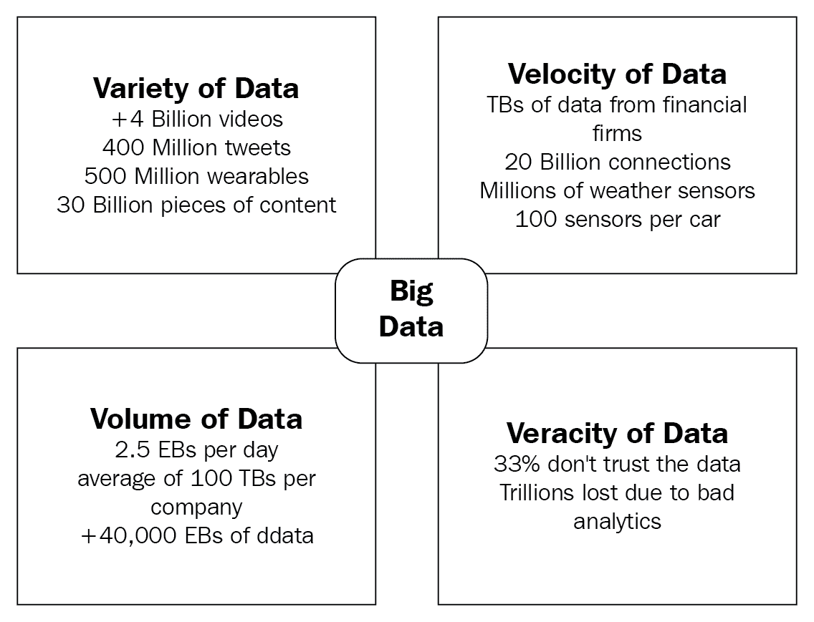
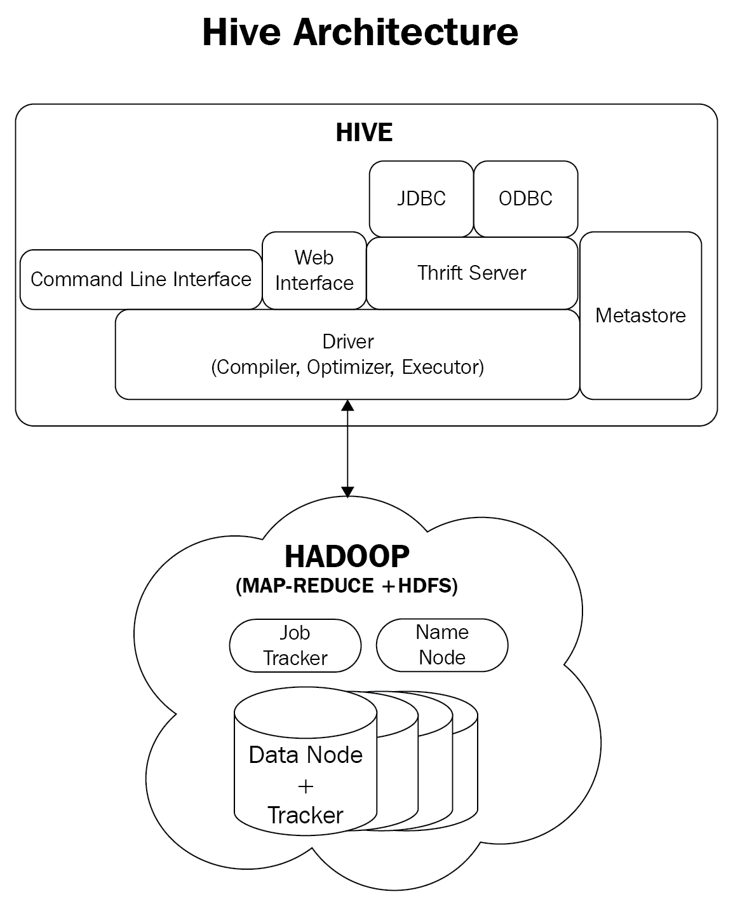
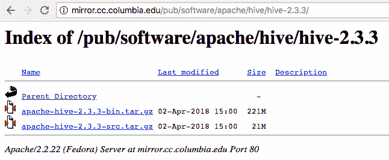
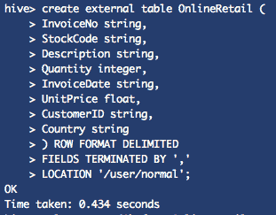
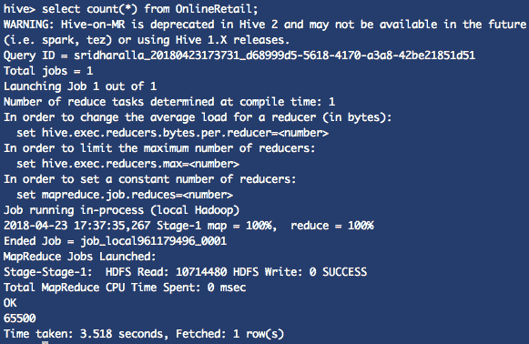
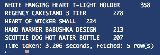

# 二、大数据分析概述

在这一章中，我们将讨论大数据分析，从一般观点开始，然后深入探讨用于深入了解数据的一些常见技术。本章向读者介绍了检查大型数据集以发现数据模式、生成报告和收集有价值见解的过程。我们将特别关注大数据的七个方面。我们还将学习数据分析和大数据；我们将看到大数据提供的挑战以及如何在分布式计算中应对这些挑战，并研究使用 Hive 和 Tableau 展示最常用技术的方法。

简而言之，本章将涵盖以下主题:

*   数据分析导论
*   大数据介绍
*   使用 Apache Hadoop 的分布式计算
*   MapReduce 框架
*   储备
*   阿帕奇火花

# 数据分析导论

数据分析是在检查数据时应用定性和定量技术的过程，目的是提供有价值的见解。利用各种技术和概念，数据分析可以提供探索数据**探索数据分析** ( **EDA** )以及得出数据结论**验证数据分析** ( **CDA** )的手段。EDA 和 CDA 是数据分析的基本概念，理解两者之间的区别很重要。

EDA 涉及用于探索数据的方法、工具和技术，旨在发现数据中的模式和数据各种元素之间的关系。CDA 涉及用于根据假设和统计技术，或对数据的简单观察，为特定问题提供见解或结论的方法、工具和技术。

# 在数据分析过程中

一旦数据被认为是现成的，数据科学家就可以使用统计方法(如 SAS)对其进行分析和探索。数据治理也成为确保正确收集和保护数据的一个因素。另一个不太为人所知的角色是**数据管理员**，他专门负责将数据理解为字节；确切地说，它来自哪里，所有发生的转换，以及业务真正需要从数据的列或字段中得到什么。

企业中的不同实体可能以不同的方式处理地址，例如:

```scala
123 N Main St vs 123 North Main Street.
```

但是，我们的分析依赖于获得正确的地址字段，否则提到的两个地址将被认为是不同的，我们的分析将不会具有相同的准确性。

分析过程从基于分析师可能需要的数据仓库的数据收集开始，收集组织中的各种数据(销售、营销、员工、薪资、人力资源等)。数据管理员和治理团队在这里非常重要，以确保收集到正确的数据，并且任何被视为机密或私人的信息不会被意外导出，即使最终用户都是员工。**社会安全号码** ( **社会安全号码**)或完整地址可能不是一个好主意，因为这可能会给组织带来很多问题。

必须建立数据质量流程，以确保正在收集和设计的数据是正确的，并且符合数据科学家的需求。在此阶段，主要目标是发现并修复可能影响分析需求准确性的数据质量问题。常见的技术是对数据进行分析，清理数据以确保数据集中的信息一致，并删除任何错误和重复记录。

因此，分析应用可以通过几个学科、团队和技能集来实现。分析应用程序可以用来生成报告，一直到自动触发业务操作。例如，您可以简单地创建每日销售报告，每天早上 8 点通过电子邮件发送给所有经理。但是，您也可以与业务流程管理应用程序或一些定制的股票交易应用程序集成，以采取行动，如购买、出售或股票市场活动警报。你也可以考虑接收新闻文章或社交媒体信息，以进一步影响将要做出的决定。

数据可视化是数据分析的一个重要部分，当您查看大量指标和计算时，很难理解数字。相反，人们越来越依赖**商业智能** ( **BI** )工具，如 Tableau、QlikView 等来探索和分析数据。当然，大规模的可视化，如显示全国所有优步汽车或显示纽约市供水的热图，需要更多定制应用程序或专门工具来构建。

管理和分析数据一直是所有行业中许多不同规模组织面临的挑战。企业一直在努力寻找一种实用的方法来获取关于客户、产品和服务的信息。当公司只有少数顾客购买他们的一些商品时，这并没有那么困难。这并不是什么大的挑战。但随着时间的推移，市场上的公司开始增长。事情变得更加复杂。现在，我们有品牌信息和社交媒体。我们有通过互联网买卖的东西。我们需要拿出不同的解决方案。随着网络开发、组织、定价、社交网络和细分，我们正在处理大量不同的数据，这些数据在处理、管理、组织和试图从数据中获得一些洞察力时带来了更多的复杂性。

# 大数据介绍

推特、脸书、亚马逊、威瑞森、梅西百货和全食超市都是使用数据分析来运营业务的公司，许多决策都基于数据分析。想想他们正在收集什么样的数据，他们可能会收集多少数据，然后他们可能会如何使用这些数据。

让我们看看前面看到的杂货店例子；如果商店开始扩大业务，建立数百家商店，会怎么样？自然，销售交易必须以比单一商店大几百倍的规模收集和存储。但是，再也没有企业独立运作了。外面有很多信息，从当地新闻、推文、Yelp 评论、客户投诉、调查活动、来自其他商店的竞争、当地不断变化的人口统计或经济等等。所有这些附加数据都有助于更好地理解客户行为和收入模型。

例如，如果我们看到对商店停车设施的负面情绪越来越多，那么我们可以对此进行分析，并采取纠正措施，例如验证停车或与城市公共交通部门谈判，以提供更频繁的火车或公共汽车，从而更好地到达。数据的数量和种类越来越多，虽然它提供了更好的分析，但也给试图存储、处理和分析所有数据的业务信息技术组织带来了挑战。事实上，看到大量的数据并不少见。

每天，我们都会创建超过 2500 万字节的数据(2 EB)，据估计，仅在过去几年中，就有超过 90%的数据被生成:

```scala
1 KB = 1024 Bytes
1 MB = 1024 KB
1 GB = 1024 MB
1 TB = 1024 GB ~ 1,000,000 MB
1 PB = 1024 TB ~ 1,000,000 GB ~ 1,000,000,000 MB
1 EB = 1024 PB ~ 1,000,000 TB ~ 1,000,000,000 GB ~ 1,000,000,000,000 MB
```

自 20 世纪 90 年代以来的如此大量的数据，以及理解和理解数据的需要，产生了大数据这个术语。

2001 年，时任咨询公司 Meta Group Inc(被 Gartner 收购)分析师的道格·兰尼(Doug Laney)提出了三个 Vs(即多样性、速度和成交量)的概念。现在，我们指的是四个 Vs，而不是三个 Vs，三个 Vs 加上了数据的准确性

以下是大数据的四个 Vs，用来描述大数据的属性。

# 各种数据

数据可以从许多来源获得，例如天气传感器、汽车传感器、人口普查数据、脸书更新、推文、交易、销售和营销。数据格式既有结构化的，也有非结构化的。数据类型也可以不同，二进制、文本、JSON 和 XML。变化真的开始触及数据深度的表面。

# 数据速度

数据可以来自数据仓库、批处理模式文件档案、近乎实时的更新，或者来自您刚刚预订的优步之旅的即时实时更新。速度是指创建数据的速度越来越快，以及关系数据库处理、存储和分析数据的速度越来越快。

# 数据量

数据可以收集和存储一小时、一天、一个月、一年或十年。对于许多公司来说，数据量正在增长到 100 倍。量是指数据的规模，这是大数据变大的部分原因。

# 数据的准确性

可以对数据进行分析，以获得可操作的见解，但是由于跨数据源分析了如此多的所有类型的数据，因此很难确保正确性和准确性证明。

以下是大数据的四个方面:



为了理解所有数据并将数据分析应用于大数据，我们需要扩展数据分析的概念，以更大的规模运营，处理大数据的四个方面。这不仅改变了用于分析数据的工具、技术和方法，也改变了我们处理问题的方式。如果在 1999 年，一个 SQL 数据库被用于一个业务中的数据，为了现在处理相同业务的数据，我们将需要一个分布式 SQL 数据库，它是可扩展的，并且适应大数据空间的细微差别。

前面描述的四个虚拟环境已经不足以涵盖大数据分析的能力和需求，因此，如今经常听到的是七个虚拟环境而不是四个虚拟环境

# 数据的可变性

可变性是指其含义不断变化的数据。很多时候，组织需要开发复杂的程序，以便能够理解程序中的上下文并解码它们的确切含义。

# 形象化

当您需要在数据处理后以可读和可访问的方式呈现数据时，可视化就会出现在图片中。

# 价值

大数据很大，并且每天都在增加，但是数据也很混乱、嘈杂，并且不断变化。它有多种格式可供所有人使用，没有分析和可视化就无法使用。

# 使用 Apache Hadoop 的分布式计算

我们被智能冰箱、智能手表、电话、平板电脑、笔记本电脑、机场自助服务亭、自动取款机等设备包围着，在这些设备的帮助下，我们现在能够做几年前无法想象的事情。我们已经习惯了 Instagram、Snapchat、Gmail、脸书、Twitter 和 Pinterest 等应用程序，几乎不可能有一天不访问这些应用程序。今天，云计算向我们介绍了以下概念:

*   基础设施即服务
*   平台即服务
*   软件即服务

幕后是高度可扩展的分布式计算世界，这使得存储和处理 **Petabytes** ( **PB** )数据成为可能:

*   1 EB = 1024 PB(5000 万部蓝光电影)
*   1 PB = 1024 TB (50，000 部蓝光电影)
*   1 TB = 1024 GB (50 部蓝光电影)

一部电影一张蓝光光盘的平均大小约为 20 GB。

现在，分布式计算的范例实际上并不是一个真正的新课题，几十年来一直以某种形式或形式被追求，主要是在研究机构以及一些商业产品公司。**大规模并行处理** ( **MPP** )是几十年前在海洋学、地震监测和太空探索等几个领域使用的范例。Teradata 等多家公司也实施了 MPP 平台，并提供商业产品和应用。

最终，谷歌和亚马逊等科技公司将可扩展分布式计算这一小众领域推向了新的进化阶段，最终导致伯克利大学创建了 Apache Spark。谷歌发表了一篇关于 MapReduce 以及**谷歌文件系统** ( **GFS** )的论文，将分布式计算的原理带到了每个人的使用中。当然，这需要归功于*道格·卡特*，他实现了谷歌白皮书中给出的概念，并向世界介绍了 Hadoop。Apache Hadoop 框架是一个用 Java 编写的开源软件框架。框架提供的两个主要领域是存储和处理。对于存储，Apache Hadoop 框架使用基于 2003 年 10 月发布的 GFS 论文的 **Hadoop 分布式文件系统** ( **HDFS** )。对于处理或计算，框架依赖于 MapReduce，这是基于 2004 年 12 月发布的一篇关于 MapReduce 的谷歌论文 MapReduce 框架从 V1(基于 JobTracker 和 TaskTracker)发展到 V2(基于 YARN)。

# MapReduce 框架

MapReduce 是一个用于在 Hadoop 集群中计算大量数据的框架。MapReduce 使用纱来调度映射器和 Reduce 作为任务，使用容器。

下图显示了一个计算单词频率的 MapReduce 作业示例:


MapReduce 与 YARN 紧密合作，规划作业和作业中的各种任务，向集群管理器(资源管理器)请求计算资源，在集群的计算资源上调度任务的执行，然后执行执行计划。使用 MapReduce，您可以读写不同格式的许多不同类型的文件，并以分布式方式执行非常复杂的计算。我们将在下一章的 MapReduce 框架中看到更多这方面的内容。

# 储备

Hive 在 MapReduce 框架上提供了一个 SQL 层抽象，并做了一些优化。这是必要的，因为使用 MapReduce 框架编写代码很复杂。例如，对特定文件中的记录进行简单的计数至少需要几十行代码，这对任何人来说都是无效的。Hive 通过将来自 SQL 语句的逻辑封装到 MapReduce 框架代码中来抽象 MapReduce 代码，该框架代码在后端自动生成和执行。这为那些需要花更多时间处理有用数据的人节省了大量时间，而不是为每一项需要执行的任务和每一项作为工作一部分的计算进行锅炉板编码:



Hive 不是为在线事务处理而设计的，不提供实时查询和行级更新。

在本节中，我们将了解 Hive 以及如何使用它来执行分析，[https://hive.apache.org/downloads.html](https://hive.apache.org/downloads.html):


点击下载链接，查看各种可下载文件，如下图所示:



# 下载并提取蜂巢二进制文件

在本节中，我们将提取下载的二进制文件，然后配置 Hive 二进制文件以开始一切:

```scala
tar -xvzf apache-hive-2.3.3-bin.tar.gz
```

一旦提取了蜂巢包，执行以下操作创建`hive-site.xml`:

```scala
cd apache-hive-2.3.3-bin
vi conf/hive-site.xml
```

在属性列表的顶部，粘贴以下内容:

```scala
<property>
 <name>system:java.io.tmpdir</name>
 <value>/tmp/hive/java</value>
</property>
```

在`hive-site.xml`底部添加以下属性:

```scala
<property>
 <name>hive.metastore.local</name>
 <value>TRUE</value>

</property>
<property>
 <name>hive.metastore.warehouse.dir</name>
 <value>/usr/hive/warehouse</value>
 </property>
```

之后，使用 Hadoop 命令，创建`hive`所需的 HDFS 路径:

```scala
cd hadoop-3.1.0
./bin/hadoop fs -mkdir -p /usr/hive/warehouse
./bin/hadoop fs -chmod g+w /usr/hive/warehouse
```

# 安装 Derby

Hive 通过利用 MapReduce 框架工作，并使用表和模式为后台运行的 MapReduce 作业创建映射器和缩减器。为了维护关于数据的元数据，Hive 使用了 Derby 这种易于使用的数据库。在本节中，我们将了解如何安装 Derby，以便在我们的 Hive 安装中使用，[https://db.apache.org/derby/derby_downloads.html](https://db.apache.org/derby/derby_downloads.html):


1.  使用命令提取 Derby，如以下代码所示:

```scala
tar -xvzf db-derby-10.14.1.0-bin.tar.gz
```

2.  然后，将目录改为`derby`，创建一个名为`data`的目录。事实上，有几个命令要运行，所以我们将在下面的代码中列出所有这些命令:

```scala
export HIVE_HOME=<YOURDIRECTORY>/apache-hive-2.3.3-bin
export HADOOP_HOME=<YOURDIRECTORY>/hadoop-3.1.0
export DERBY_HOME=<YOURDIRECTORY>/db-derby-10.14.1.0-bin
export PATH=$PATH:$HADOOP_HOME/bin:$HIVE_HOME/bin:$DERBY_HOME/bin
mkdir $DERBY_HOME/data
cp $DERBY_HOME/lib/derbyclient.jar $HIVE_HOME/lib
cp $DERBY_HOME/lib/derbytools.jar $HIVE_HOME/lib
```

3.  现在，使用一个简单的命令启动 Derby 服务器，如以下代码所示:

```scala
nohup startNetworkServer -h 0.0.0.0 
```

4.  完成后，您必须创建并初始化`derby`实例:

```scala
schematool -dbType derby -initSchema --verbose
```

5.  现在，您可以打开`hive`控制台了:

```scala
hive
```


# 使用蜂巢

与关系数据仓库相反，嵌套数据模型具有复杂的类型，如数组、映射和结构。我们可以用`PARTITIONED BY`子句根据一个或多个列的值来划分表。此外，可以使用`CLUSTERED BY`列对表或分区进行分桶，并且可以通过`SORT BY`列在该桶内对数据进行排序:

*   **表**:非常类似于 RDBMS 表，包含行和表。
*   **分区**:配置单元表可以有多个分区。它们也被映射到子目录和文件系统。
*   **桶**:数据在 Hive 中也可以分桶。它们可以作为文件存储在底层文件系统的分区中。

Hive 查询语言提供了基本的类似 SQL 的操作。以下是 HQL 可以轻松完成的几项任务:

*   创建和管理表和分区
*   支持各种关系、算术和逻辑运算符
*   评估函数
*   将表的内容下载到本地目录，或将查询结果下载到 HDFS 目录

# 创建数据库

我们首先必须创建一个数据库来保存 Hive 中创建的所有表。这一步很简单，与大多数其他数据库相似:

```scala
create database mydb;
```

以下是显示查询执行的`hive`控制台:


然后，我们开始使用刚刚创建的数据库来创建数据库所需的表，如下所示:

```scala
use mydb;
```

以下是显示查询执行的`hive`控制台:


# 创建表格

一旦我们创建了一个数据库，我们就可以在数据库中创建一个表了。表的创建在语法上类似于大多数关系数据库管理系统(数据库系统，如 Oracle、MySQL):

```scala
create external table OnlineRetail (
 InvoiceNo string,
 StockCode string,
 Description string,
 Quantity integer,
 InvoiceDate string,
 UnitPrice float,
 CustomerID string,
 Country string
 ) ROW FORMAT DELIMITED
 FIELDS TERMINATED BY ','
 LOCATION '/user/normal';
```

以下是`hive`控制台及其外观:



我们将不讨论查询语句的语法，而是讨论如何使用 stinger 计划显著提高查询性能，如下所示:

```scala
select count(*) from OnlineRetail;
```

以下是显示查询执行的`hive`控制台:



# SELECT 语句语法

以下是 Hive 的`SELECT`语句的语法:

```scala
SELECT [ALL | DISTINCT] select_expr, select_expr, ...
FROM table_reference
[WHERE where_condition]
[GROUP BY col_list]
[HAVING having_condition]
[CLUSTER BY col_list | [DISTRIBUTE BY col_list] [SORT BY col_list]]
[LIMIT number]
;
```

`SELECT`是 HiveQL 中的投影算子。要点是:

*   `SELECT`扫描由`FROM`子句指定的表格
*   `WHERE`给出过滤什么的条件
*   `GROUP BY`给出了指定如何聚合记录的列列表
*   `CLUSTER BY`、`DISTRIBUTE BY`和`SORT BY`指定排序顺序和算法
*   `LIMIT`指定要检索多少条记录:

```scala
Select Description, count(*) as c from OnlineRetail group By Description order by c DESC limit 5;
```

以下是显示查询执行的`hive`控制台:



```scala
select * from OnlineRetail limit 5;
```

以下是显示查询执行的`hive`控制台:


```scala
select lower(description), quantity from OnlineRetail limit 5;
```

以下是显示查询执行的`hive`控制台:


# where 子句

一个`WHERE`子句用于通过使用谓词操作符和逻辑操作符来过滤结果集，其帮助如下:

*   谓词运算符列表
*   逻辑运算符列表
*   功能列表

下面是使用`WHERE`子句的一个例子:

```scala
select * from OnlineRetail where Description='WHITE METAL LANTERN' limit 5;
```

以下是显示查询执行的`hive`控制台:


下面的查询向我们展示了如何使用`group by`子句:

```scala
select Description, count(*) from OnlineRetail group by Description limit 5;
```

以下是显示查询执行的`hive`控制台:


以下查询是使用`group by`子句并指定条件来过滤借助`having`子句获得的结果的示例:

```scala
select Description, count(*) as cnt from OnlineRetail group by Description having cnt> 100 limit 5;
```

以下是显示查询执行的`hive`控制台:


下面的查询是使用 group by 子句的另一个示例，使用 having 子句过滤结果，并使用`order by`子句对我们的结果进行排序，这里使用`DESC`:

```scala
select Description, count(*) as cnt from OnlineRetail group by Description having cnt> 100 order by cnt DESC limit 5;
```

以下是显示查询执行的`hive`控制台:


# 插入语句语法

Hive 的`INSERT`语句语法如下:

```scala
-- append new rows to tablename1
INSERT INTO TABLE tablename1 select_statement1 FROM from_statement; 

-- replace contents of tablename1
INSERT OVERWRITE TABLE tablename1 select_statement1 FROM from_statement; 

-- more complex example using WITH clause
WITH tablename1 AS (select_statement1 FROM from_statement) INSERT [OVERWRITE/INTO] TABLE tablename2 select_statement2 FROM tablename1;
```

# 原始类型

类型与表中的列相关联。让我们看看下表中支持的类型及其描述:

| **类型** | **描述** |
| 整数 | 

*   `TINYINT`: an integer of 1 byte.
*   : an integer of 2 bytes.
*   : an integer of 4 bytes.

 |
| 布尔型 | 

*   `BOOLEAN` : `TRUE` / `FALSE`

 |
| 浮点数 | 

*   `FLOAT`: Single precision
*   `DOUBLE`: Double precision

 |
| 定点数字 | 

*   `DECIMAL`: user-defined fixed-point value of scale and precision.

 |
| 字符串类型 | 

*   `STRING`: the character sequence in the specified character set.
*   `VARCHAR`: A character sequence with the maximum length in the specified character set.
*   `CHAR`: A character sequence of defined length in a specified character set.

 |
| 日期和时间类型 | 

*   `TIMESTAMP`: A specific time point, accurate to nanoseconds.
*   `DATE`: A date.

 |
| 二元类型 | 

*   `BINARY`: byte sequence

 |

# 复杂类型

我们可以借助以下内容从基元和其他复合类型构建复杂类型:

*   **结构**:使用点(`.`)符号可以访问类型中的元素。
*   **映射(键值元组)**:使用`['element name']`符号访问元素。
*   **数组(可索引列表)**:数组中的元素必须是同一类型。您可以使用`[n]`符号访问元素，其中 n 是数组的索引(从零开始)。

# 内置运算符和函数

下列运算符和函数不一定是最新的。(Hive 操作符和 UDF 有更多当前信息)。在 Beeline 或 Hive CLI 中，使用以下命令显示最新的文档:

```scala
SHOW FUNCTIONS;
DESCRIBE FUNCTION <function_name>;
DESCRIBE FUNCTION EXTENDED <function_name>;
```

所有 Hive 关键字都不区分大小写，包括 Hive 运算符和函数的名称。

# 内置运算符

**关系运算符**:根据操作数之间的比较是否成立，以下运算符比较传递的操作数并生成`TRUE`或`FALSE`值:

| **运算符** | **类型** | **描述** |
| `A = B` | 所有基本类型 | `TRUE`如果表达式`A`相当于表达式`B`；否则`FALSE` |
| `A != B` | 所有基本类型 | `TRUE`如果表情`A`是*不是*相当于表情`B`；否则`FALSE` |
| `A < B` | 所有基本类型 | `TRUE`如果表达式`A`小于表达式`B`；否则`FALSE` |
| `A <= B` | 所有基本类型 | `TRUE`如果表达式`A`小于或等于表达式`B`；否则`FALSE` |
| `A > B` | 所有基本类型 | `TRUE`如果表达式`A`大于表达式`B`；否则`FALSE` |
| `A >= B` | 所有基本类型 | 如果表达式`A`大于或等于表达式`B`，则为`FALSE` |
| `A IS NULL` | 所有类型 | 如果表达式`A`的计算结果为`NULL`，则为`TRUE`，否则为`FALSE` |
| `A IS NOT NULL` | 所有类型 | 如果表达式`A`的计算结果为`NULL`，则为`FALSE`，否则为`TRUE` |
| `A LIKE B` | 用线串 | `TRUE`如果字符串`A`与 SQL 简单正则表达式`B`匹配，则为`FALSE`。比较是逐个字符进行的。`B`中的`_`字符匹配`A`中的任意字符(类似于 posix 正则表达式中的`.`),`B`中的`%`字符匹配`A`中任意数量的字符(类似于 posix 正则表达式中的`.*`)。例如，`foobar` `LIKE foo`的评估结果为`FALSE`，其中作为`foobar` `LIKE` `foo___`的评估结果为`TRUE`，`LIKE` `foo%`的评估结果也是如此。要逃离`%`请使用`\` ( `%`匹配一个`%`字符)。如果数据中包含分号，并且您想要搜索它，则需要对其进行转义；`columnValue LIKE a\;b` |
| `A RLIKE B` | 用线串 | `NULL`如果`A`或`B`为`NULL`，`TRUE`如果`A`的任何(可能为空)子串与 Java 正则表达式`B`匹配(参见 Java 正则表达式语法)，则为`FALSE`。例如，`'foobar' rlike 'foo'`评估为`TRUE`，`'foobar' rlike '^f.*r$'`也是如此。 |
| `A REGEXP B` | 用线串 | 与`RLIKE`相同 |

**算术运算符**:以下运算符支持对操作数进行各种常见的算术运算。它们都返回数字类型:

| **操作员** | **类型** | **描述** |
| `A + B` | 所有数字类型 | 给出`A`和`B`相加的结果。例如，结果的类型与操作数类型的公共父类型(在类型层次结构中)相同，因为每个整数都是浮点数。因此，float 是一个包含类型的整数，因此 float 和`int`上的`+`运算符将导致一个 float。 |
| `A - B` | 所有数字类型 | 给出`A`减去`B`的结果。结果的类型与操作数类型的公共父类型(在类型层次结构中)相同。 |
| `A * B` | 所有数字类型 | 给出`A`和`B`相乘的结果。结果的类型与操作数类型的公共父类型(在类型层次结构中)相同。请注意，如果乘法导致溢出，则必须将其中一个运算符转换为类型层次结构中较高的类型。 |
| `A / B` | 所有数字类型 | 给出`A`除以`B`的结果。结果的类型与操作数类型的公共父类型(在类型层次结构中)相同。如果操作数是整数类型，那么结果就是除法的商。 |
| `A % B` | 所有数字类型 | 给出`A`除以`B`得到的提醒。结果的类型与操作数类型的公共父类型(在类型层次结构中)相同。 |
| `A & B` | 所有数字类型 | 给出`A`和`B`的按位`AND`的结果。结果的类型与操作数类型的公共父类型(在类型层次结构中)相同。 |
| `A &#124; B` | 所有数字类型 | 给出`A`和`B`的逐位`OR`结果。结果的类型与操作数类型的公共父级(在类型层次结构中)相同。 |
| `A ^ B` | 所有数字类型 | 给出`A`和`B`的按位`XOR`的结果。结果的类型与操作数类型的公共父类型(在类型层次结构中)相同。 |
| `~A` | 所有数字类型 | 给出`A`的按位`NOT`的结果。结果的类型与`A`的类型相同。 |

**逻辑运算符**:以下运算符支持创建逻辑表达式。根据操作数的布尔值，它们都返回布尔值`TRUE`或`FALSE`:

| **操作员** | **类型** | **描述** |
| `A AND B` | 布尔代数学体系的 | 如果`A`和`B`都是`TRUE`，则为真，否则为`FALSE` |
| `A && B` | 布尔代数学体系的 | 与`A AND B`相同 |
| `A OR B` | 布尔代数学体系的 | 如果`A`或`B`或两者都是`TRUE`，则为真，否则为`FALSE` |
| `A &#124;&#124; B` | 布尔代数学体系的 | 与`A`或`B`相同 |
| `NOT A` | 布尔代数学体系的 | `TRUE`如果`A`是`FALSE`，否则`FALSE` |
| `!A` | 布尔代数学体系的 | 与`NOT A`相同 |

**复杂类型上的运算符**:以下运算符提供了访问复杂类型中元素的机制:

| **操作员** | **类型** | **描述** |
| `A[n]` | `A`是一个数组`n`是一个`int` | 返回数组`A`中第 *n* <sup>个</sup>元素。第一个元素的索引为 0，例如，如果`A`是由`['foo', 'bar']`组成的数组，那么`A[0]`返回`'foo'`，而`A[1]`返回`'bar'` |
| `M[key]` | `M`是`Map<K`、`V>`键有类型`K` | 返回与地图中的键对应的值。例如，如果`M`是由
`('f' -> 'foo', 'b' -> 'bar', 'all' -> 'foobar')`组成的地图，则`M['all']`返回`'foobar'`。 |
| `S.x` | `S`是一个结构 | 返回`S`的`x`字段，例如，结构 foobar `(int foo, int bar)` foobar。`foo`返回存储在`struct`的`foo`字段中的整数。 |

# 内置功能

Hive 支持以下内置功能:

| **数据类型** | **功能** | **描述** |
| `BIGINT` | `round(double a)` | 返回双倍的舍入`BIGINT`值。 |
| `BIGINT` | `floor(double a)` | 返回等于或小于两倍的最大`BIGINT`值。 |
| `BIGINT` | `ceil(double a)` | 返回等于或大于两倍的最小值`BIGINT`。 |
| `double` | `rand(), rand(int seed)` | 返回一个随机数(逐行变化)。指定种子将确保生成的随机数序列是确定性的。 |
| `string` | `concat(string A, string B,...)` | 返回在`A`后连接`B`得到的字符串。例如，`concat('foo', 'bar')`导致`'foobar'`。该函数接受任意数量的参数，并返回所有参数的串联。 |
| `string` | `substr(string A, int start)` | 返回从开始位置开始到字符串`A`结束的`A`子字符串。例如，`substr('foobar', 4)`导致`'bar'`。 |
| `string` | `substr(string A, int start, int length)` | 返回从给定长度的起始位置开始的`A`的子串，例如
`substr('foobar', 4, 2)`结果为`'ba'`。 |
| `string` | `upper(string A)` | 返回将`A`的所有字符转换为大写后得到的字符串，例如，`upper('fOoBaR')`结果为`'FOOBAR'`。 |
| `string` | `ucase(string A)` | 和鞋面一样。 |
| `string` | `lower(string A)` | 返回将`B`的所有字符转换为小写后得到的字符串，例如，`lower('fOoBaR')`结果为`'foobar'`。 |
| `string` | `lcase(string A)` | 和下面一样。 |
| `string` | `trim(string A)` | 返回从`A`两端修剪空格得到的字符串，例如`trim('foobar ')`得到`'foobar'`。 |
| `string` | `ltrim(string A)` | 返回从`A`开始(左手边)修剪空格后得到的字符串。例如，`ltrim(' foobar ')`导致`'foobar '`。 |
| `string` | `rtrim(string A)` | 返回从`A`的末端(右手边)修剪空格得到的字符串。例如，`rtrim(' foobar')`导致`'foobar'`。 |
| `string` | `regexp_replace(string A, string B, string C)` | 返回将`B`中与 Java 正则表达式语法(参见 Java 正则表达式语法)匹配的所有子字符串替换为`C`后得到的字符串。例如，`regexp_replace('foobar', 'oo&#124;ar', )`返回`'fb'`。 |
| `int` | `size(Map<K.V>)` | 返回地图类型中的元素数量。 |
| `int` | `size(Array<T>)` | 返回数组类型中的元素数量。 |
| `value of <type>` | `cast(<expr> as <type>)` | 将表达式`expr`的结果转换为`<type>`，例如，`cast('1' as BIGINT)`将字符串`'1'`转换为其整数表示。如果转换不成功，则返回`null`。 |
| `string` | `from_unixtime(int unixtime)` | 将 UNIX 纪元(1970-01-01 00:00:00 UTC)的秒数转换为以`1970-01-01 00:00:00`格式表示当前系统时区中该时刻时间戳的字符串。 |
| `string` | `to_date(string timestamp)` | 返回时间戳的日期部分`string: to_date("1970-01-01 00:00:00") = "1970-01-01"`。 |
| `int` | `year(string date)` | 返回日期或时间戳的年份部分`string: year("1970-01-01 00:00:00") = 1970, year("1970-01-01") = 1970`。 |
| `int` | `month(string date)` | 返回日期或时间戳的月份部分`string: month("1970-11-01 00:00:00") = 11, month("1970-11-01") = 11`。 |
| `int` | `day(string date)` | 返回日期或时间戳的日期部分`string: day("1970-11-01 00:00:00") = 1, day("1970-11-01") = 1`。 |
| `string` | `get_json_object(string json_string, string path)` | 根据指定的`json`路径从`json`字符串中提取`json`对象，并返回提取的`.json`对象的`json`字符串。如果输入的`json`字符串无效，将返回`null`。 |

Hive 中支持以下内置聚合函数:

| **数据类型** | **功能** | **描述** |
| `BIGINT` | `count(*), count(expr), count(DISTINCT expr[, expr_.])` | `count(*)`–返回检索到的行的总数，包括包含`NULL`值的行；`count(expr) `–返回提供的表达式为非`NULL`的行数；`count(DISTINCT expr[, expr])`–返回所提供表达式唯一且非`NULL`的行数。 |
| `DOUBLE` | `sum(col), sum(DISTINCT col)` | 返回组中元素的总和或组中列的不同值的总和。 |
| `DOUBLE` | `avg(col), avg(DISTINCT col)` | 返回组中元素的平均值或组中列的不同值的平均值。 |
| `DOUBLE` | `min(col)` | 返回组中列的最小值。 |
| `DOUBLE` | `max(col)` | 返回组中列的最大值。 |

# 语言能力

Hive 的 SQL 提供了以下可以在表或分区上工作的基本 SQL 操作:

*   借助`WHERE`子句过滤表格中的行
*   使用`SELECT`子句从表中选择某些列
*   在两个表之间执行相等连接
*   为存储在表中的数据评估多个`group by`列上的聚合
*   将查询结果存储到另一个表中
*   将表的内容下载到本地(例如，`nfs`)目录
*   将查询结果存储在`hadoop dfs`目录中
*   管理表和分区(创建、删除和更改)
*   为自定义映射/缩减作业插入所选语言的自定义脚本

# 检索信息的备忘单

下表向我们展示了如何检索一些常用函数的信息:

| **功能** | **鼠标** |
| 检索信息(常规) | `SELECT from_columns FROM table WHERE conditions;` |
| 检索所有值 | `SELECT * FROM table;` |
| 检索某些值 | `SELECT * FROM table WHERE rec_name = "value";` |
| 用多个条件检索 | `SELECT * FROM TABLE WHERE rec1 = "value1" AND rec2 = "value2";` |
| 检索特定列 | `SELECT column_name FROM table;` |
| 检索唯一输出 | `SELECT DISTINCT column_name FROM table;` |
| 整理 | `SELECT col1, col2 FROM table ORDER BY col2;` |
| 反向排序 | `SELECT col1, col2 FROM table ORDER BY col2 DESC;` |
| 数乌鸦 | `SELECT COUNT(*) FROM table;` |
| 带计数的分组 | `SELECT owner, COUNT(*) FROM table GROUP BY owner;` |
| 最大值 | `SELECT MAX(col_name) AS label FROM table;` |
| 从多个表中选择(使用别名`w/"AS"`连接同一个表) | `SELECT pet.name, comment FROM pet JOIN event ON (pet.name = event.name)` |

# 阿帕奇火花

Apache Spark 是一个跨不同工作负载和平台的统一分布式计算引擎。Spark 可以连接到不同的平台，并使用各种范例(如 Spark Streaming、Spark ML、Spark SQL 和 Spark Graphx)处理不同的数据工作负载。

Apache Spark 是一个快速的内存数据处理引擎，具有优雅而富有表现力的开发 API，允许数据工作者高效地执行需要快速交互访问数据集的流式机器学习或 SQL 工作负载。

建立在核心之上的额外库允许工作负载用于流、SQL、图形处理和机器学习。例如，SparkML 是为数据科学设计的，它的抽象使数据科学变得更容易。

Spark 提供实时流、查询、机器学习和图形处理。在 Apache Spark 之前，我们必须针对不同类型的工作负载使用不同的技术。一个用于批处理分析，一个用于交互式查询，一个用于实时流处理，另一个用于机器学习算法。然而，Apache Spark 只需使用 Apache Spark 就可以完成所有这些任务，而不是使用不总是集成的多种技术。

使用 Apache Spark，可以处理所有类型的工作负载，Spark 还支持 Scala、Java、R 和 Python 作为编写客户端程序的手段。

Apache Spark 是一个开源分布式计算引擎，与 MapReduce 范式相比，它具有关键优势:

*   尽可能使用内存处理
*   用于批处理、实时工作负载的通用引擎
*   与纱和介子兼容
*   与 HBase、Cassandra、MongoDB、HDFS、亚马逊 S3 以及其他文件系统和数据源集成良好

Spark 早在 2009 年就在伯克利创建了，是构建 Mesos 项目的结果，Mesos 是一个支持不同类型集群计算系统的集群管理框架。

Hadoop 和 Apache Spark 都是流行的大数据框架，但它们并不真正服务于相同的目的。而 Hadoop 提供的是分布式存储和 MapReduce 分布式计算框架，而 Spark 则是在其他技术提供的分布式数据存储上运行的数据处理框架。

Spark is generally a lot faster than MapReduce because of the way it processes data. MapReduce operates on splits using disk operations, Spark operates on the dataset much more efficiently than MapReduce with the main reason behind the performance improvement of Apache Spark being the efficient off-heap in-memory processing rather than solely relying on disk-based computations.

如果您的数据操作和报告需求大部分是静态的，MapReduce 的处理风格就足够了，使用批处理来实现您的目的也是可以的，但是如果您需要对流式数据或多级处理逻辑中所需的处理需求进行分析，您可能想使用 Spark。

以下是 Apache Spark 堆栈:


# 使用 Tableau 实现可视化

无论我们使用哪种方法对大数据进行分布式计算，如果没有 Tableau 等工具的帮助，都很难理解数据的含义，Tableau 可以提供易于理解的数据可视化。

我们可以使用很多工具来做可视化，比如 Cognos、Tableau、Zoom data、KineticaDB、Python Matplotlib、R + Shiny、JavaScript 等等。我们将在[第 10 章](10.html)、*可视化大数据*中更详细地介绍可视化。

下面是 Tableau 中的一个简单的水平条形图:


Figure: Screenshot showing a simple horizontal bar chart in Tableau

以下是 Tableau 中数据的地理空间视图:


Figure: Screenshot of a geospatial view of data in Tableau

# 摘要

在本章中，我们讨论了大数据分析、大数据分析的各种概念，以及大数据的七个方面—容量、速度、准确性、多样性、价值、愿景和可视化。我们还研究了一些有助于执行分析的技术，例如 Hive 和 Tableau。

在下一章中，我们将探索 MapReduce 的世界以及执行分布式计算时最常用的模式。