# 八、Apache Flink 批处理分析

本章将向读者介绍 Apache Flink，说明如何基于批处理模型使用 Flink 进行大数据分析。我们将研究数据集 API，它提供了对大数据进行批量分析的简单易用的方法。

在本章中，我们将涵盖以下主题:

*   Apache弗林克简介
*   安装 Flink
*   使用 Scala 外壳
*   使用 Flink 集群用户界面
*   使用 Flink 进行批量分析

# Apache弗林克简介

Flink 是一个用于分布式流处理的开源框架，具有以下特性:

*   它提供了准确的结果，即使是在无序或延迟到达的情况下
*   它是有状态的和容错的，可以从故障中无缝恢复，同时保持一次应用程序状态
*   它可以大规模运行，在数千个节点上运行，具有非常好的吞吐量和延迟特性

以下是官方文档的截图，显示了如何使用 Apache Flink:

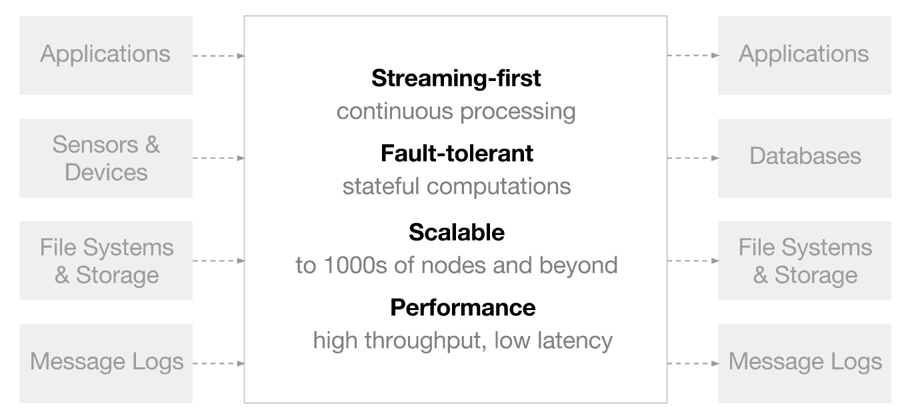

查看 Apache Flink 框架的另一种方式如下图所示:

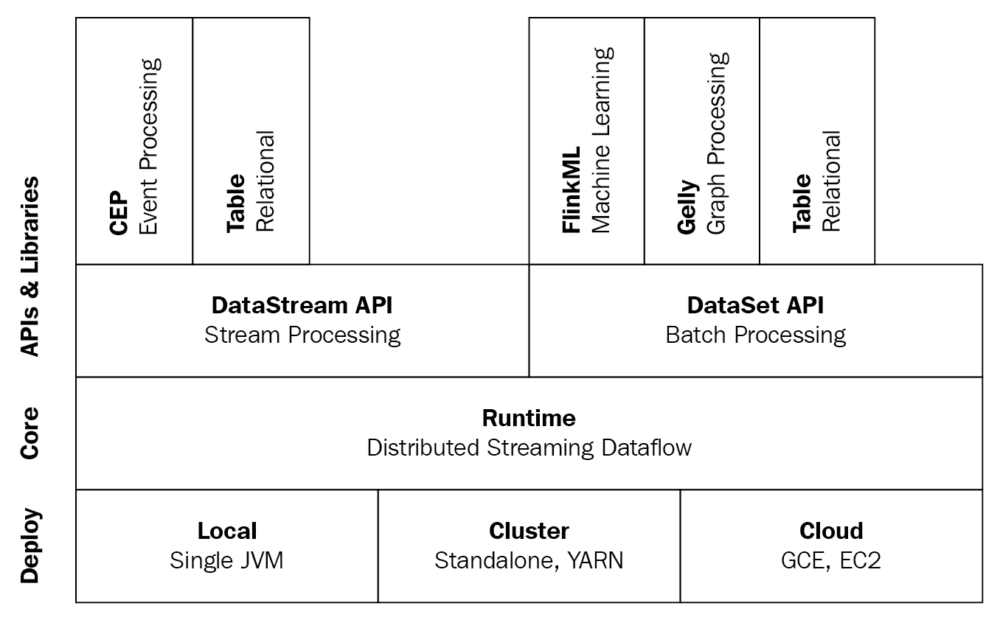

所有 Flink 程序都是延迟执行的，当程序的主方法被执行时，数据加载和转换不会直接发生。相反，每个操作都被创建并添加到程序的计划中。当执行被执行环境上的`execute()`调用显式触发时，操作实际上被执行。程序是在本地执行还是在集群上执行取决于执行环境的类型。惰性评估允许您构建复杂的程序，Flink 将其作为一个整体规划的单元来执行。

Flink 程序看起来像是转换数据集合的常规程序。每个程序都由相同的基本部分组成:

1.  获得执行环境
2.  加载初始数据
3.  指定此数据的转换、聚合和连接
4.  指定将计算结果放在哪里
5.  触发程序执行

# 无界数据集的连续处理

在详细介绍 Apache Flink 之前，让我们从更高的层次来回顾一下您在处理数据时可能遇到的数据集类型，以及您可以选择处理的执行模型类型。这两种想法经常被混为一谈；了解是什么让他们与众不同将是有益的。

首先，有两种类型的数据集:

*   **无界**:连续添加到的无限数据集
*   **有界的**:有限的、不变的数据集

许多传统上被认为是有界或批处理的真实数据集实际上是无界数据集。无论数据是存储在 HDFS 的一系列目录中，还是存储在基于日志的系统中，例如 **Apache Kafka** ，都是如此。

无界数据集的一些示例包括但不限于以下内容:

*   终端用户与移动或网络应用程序交互
*   提供测量的物理传感器
*   金融市场
*   机器日志数据

其次，就像两种类型的数据集一样，也有两种类型的执行模型:

*   **流**:只要产生数据，就连续执行的处理
*   **批处理**:在有限的时间内执行并运行至完全的处理，完成后释放计算资源

用任一类型的执行模型来处理任一类型的数据集是可能的，尽管不一定是最佳的。例如，尽管存在开窗、状态管理和无序数据的潜在问题，批处理执行长期以来一直应用于无界数据集。

Flink 依赖于流执行模型，这是处理无界数据集的直观方式:流执行是连续处理连续产生的数据。数据集类型和执行模型类型之间的一致性在准确性和性能方面提供了许多优势。

# 流动模型和有界数据集

在 Apache Flink 中，您可以使用数据流应用编程接口来处理无界数据，也可以使用数据集应用编程接口来处理有界数据。Flink 使有界和无界数据集之间的关系变得非常自然。有界数据集可以简单地视为无界数据集的特例，因此可以将所有相同的概念应用于两种类型的数据集。

有界数据集在 Flink 内部作为**有限流**处理，Flink 管理有界数据集和无界数据集的方式只有一些细微的区别。因此，可以使用 Flink 来处理有界和无界数据，两个 API 都运行在同一个分布式流执行引擎上:一个简单而强大的架构。

# 安装 Flink

在本节中，我们将下载并安装 Apache Flink。

Flink 在 Linux、OS X 和 Windows 上运行。为了能够运行 Flink，唯一的要求是有一个运行良好的 Java 7.x(或更高版本)安装。如果您正在使用 windows，请查看[https://ci . Apache . org/project/flink/Flink-docs-release-1.4/start/Flink _ on _ Windows . html](https://ci.apache.org/projects/flink/flink-docs-release-1.4/start/flink_on_windows.html)的《Windows 上的 Flink》指南，其中介绍了如何在 Windows 上运行 Flink 进行本地设置。

您可以通过发出以下命令来检查您的 Java 版本:

```scala
java -version
```

如果您有 Java 8，输出将如下所示:

```scala
java version "1.8.0_111"
Java(TM) SE Runtime Environment (build 1.8.0_111-b14)
Java HotSpot(TM) 64-Bit Server VM (build 25.111-b14, mixed mode)
```

# 下载 Flink

在[https://flink.apache.org/downloads.html](https://flink.apache.org/downloads.html)下载与您的平台相关的 Apache Flink 二进制文件:

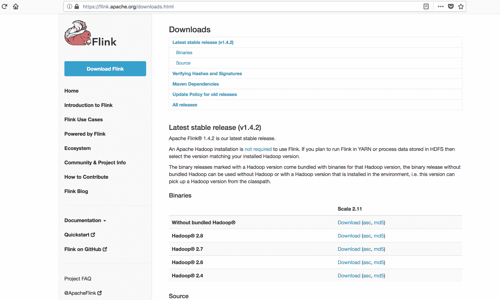

Figure: Screenshot showing Apache Flink libraries

点击下载下载 Hadoop 版本。您将在浏览器中看到下载页面，如下图所示:


Figure: Screenshot showing Hadoop version to be downloaded

在这种情况下，我下载了`flink-1.4.2-bin-hadoop28-scala_2.11.tgz`，这是可用的最新版本。

下载后，提取二进制文件。在苹果电脑或 Linux 机器上，您可以使用`tar`命令:


# 安装 Flink

首先，将目录更改为提取 Apache Flink 的位置:

```scala
cd flink-1.4.2
```

您将看到以下内容:


# 启动本地 Flink 集群

只需在`bin`文件夹中使用以下脚本，即可启动本地集群:

```scala
./bin/start-local.sh
```

运行脚本后，您应该会看到集群已经启动。

在`http://localhost:8081`检查作业管理器的网络前端，确保一切正常运行。网络前端应该报告一个可用的**任务管理器**实例:

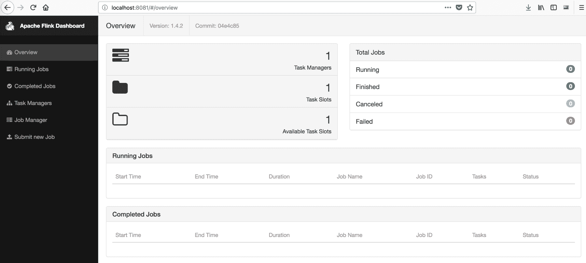

您也可以通过检查`logs`目录中的日志文件来验证系统是否正在运行:

```scala
tail log/flink-*-jobmanager-*.log
```

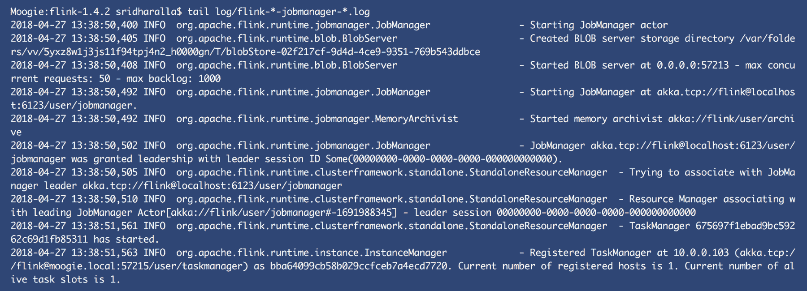

要使用 Scala 外壳，请输入以下代码:

```scala
./bin/start-scala-shell.sh remote localhost 6123
```

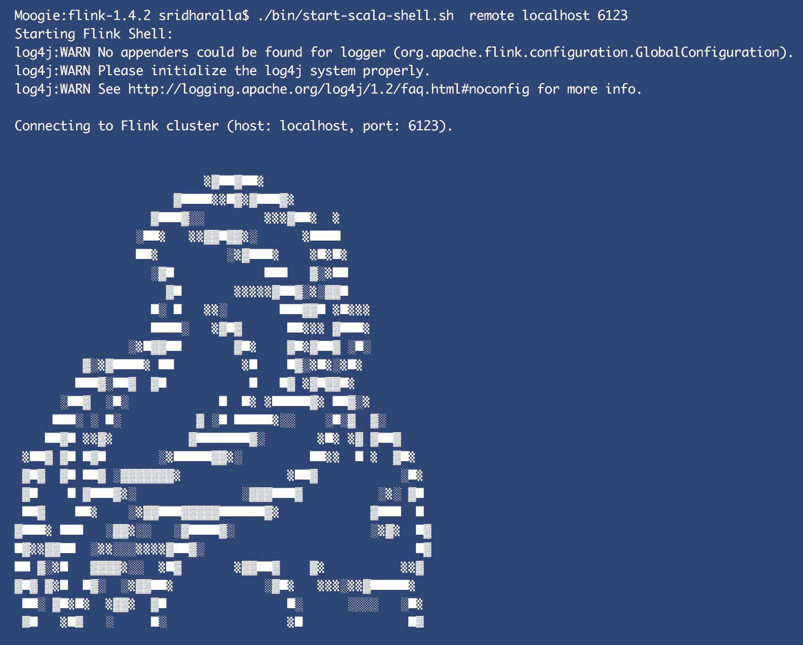

要加载数据，请输入以下代码:

```scala
val dataSet = benv.readTextFile("OnlineRetail.csv")
dataSet.count()
```

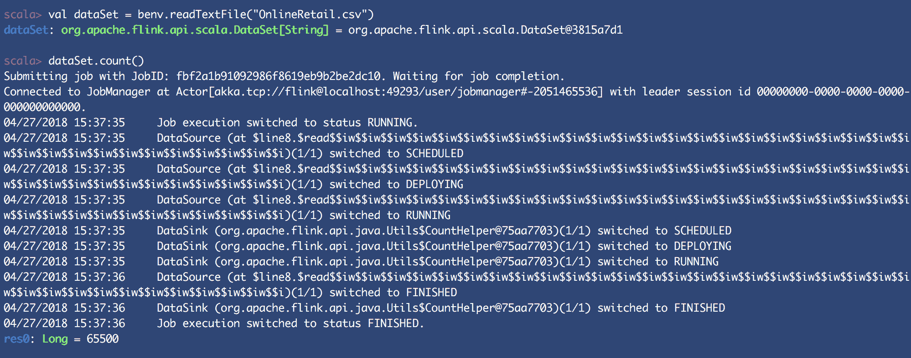

您可以使用以下代码打印数据集的前五行。结果显示在代码后面的屏幕截图中:

```scala
dataSet
.first(5)
.print()
```

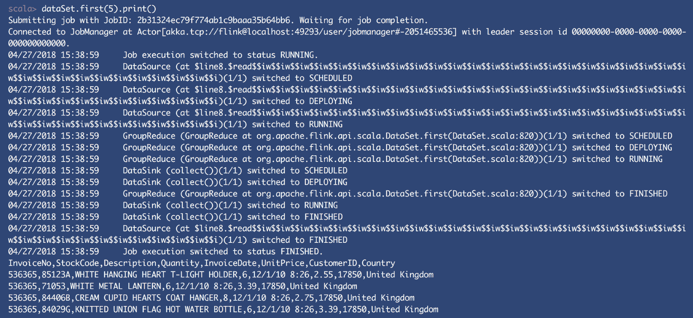

您可以使用`map()`执行简单的转换:

```scala
dataSet
.map(x => x.split(",")(2))
.first(5)
.print()
```

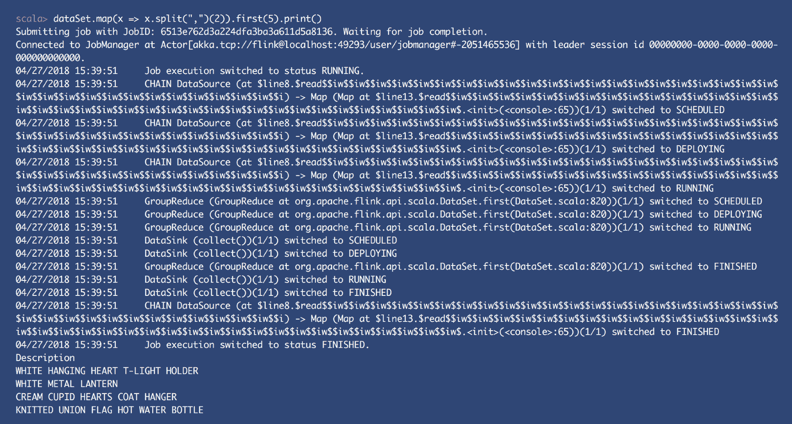

```scala
dataSet
.flatMap(x => x.split(","))
.map(x=> (x,1))
.groupBy(0)
.sum(1)
.first(10)
.print()
```

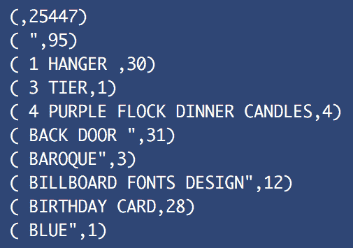

# 使用 Flink 集群用户界面

使用 Flink 集群用户界面，您可以了解和监控集群中运行的内容，并深入挖掘各种作业和任务。您可以监控作业状态、取消作业或调试作业的任何问题。通过查看日志，您还可以诊断代码的问题，并修复它们。

以下是**已完成作业**的列表:


您可以深入查看任何特定作业，以查看有关作业执行的更多详细信息:


Figure: Drilling down a particular job to see job's execution

您可以查看工作的**时间线**以获得更多详细信息:


Figure: Screenshot to see Timeline of a job

下面的屏幕截图显示了任务管理器选项卡，显示了所有的任务管理器。这有助于您了解任务经理的数量和状态:


也可以查看**日志**，如下图截图所示:

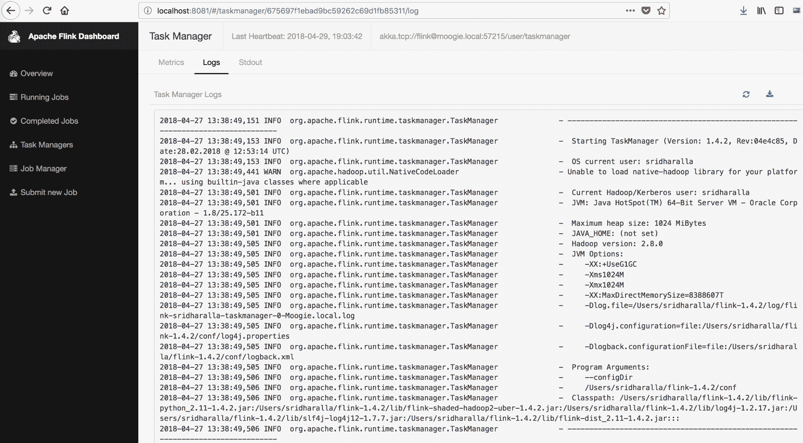

“指标”选项卡为您提供了内存和 CPU 资源的详细信息:

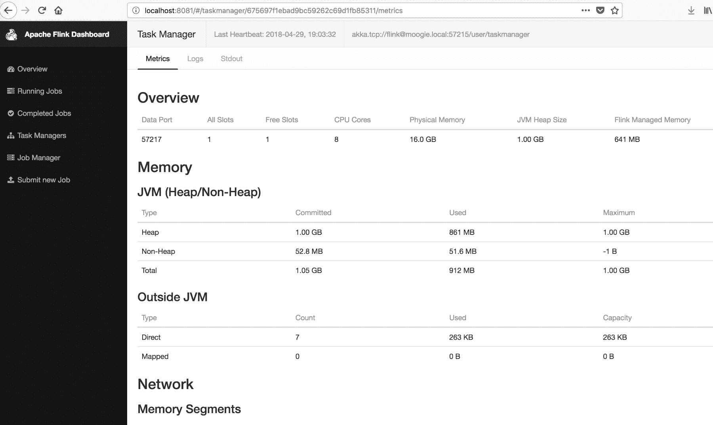

Figure: Screenshot showing details of the memory and CPU resources in Metrics tab

您也可以提交 JARs 作为作业，而不是在 Scala shell 中编写所有内容，如前所述:


# 批量分析

Apache Flink 中的批处理分析与流分析非常相似，Flink 使用相同的应用编程接口处理两种类型的分析。这提供了很大的灵活性，并允许在不同类型的分析中重用代码。

在这一节中，我们将看看我们正在使用的样本数据的一些分析工作。我们还将装载`cities.csv`和`temperature.csv`进行更多的连接操作。

# 正在读取文件

Flink 附带了几种内置格式，可以从常见的文件格式创建数据集。它们中的许多在执行环境上都有快捷方式。

# 基于文件

可以使用下面列出的 API 读取基于文件的源:

*   `readTextFile(path)` / `TextInputFormat`:逐行读取文件并以字符串形式返回。
*   `readTextFileWithValue(path)` / `TextValueInputFormat`:逐行读取文件并将其作为`StringValues`返回。`StringValues`是可变字符串。
*   `readCsvFile(path)` / `CsvInputFormat`:解析逗号(或其他字符)分隔字段的文件。返回元组、事例类对象或 POJOs 的数据集。支持基本的 Java 类型及其对应的`Value`字段类型。
*   `readFileOfPrimitives(path, delimiter)` / `PrimitiveInputFormat`:使用给定的分隔符解析新行(或另一个字符序列)定界的基本数据类型的文件，如`String`或`Integer`。
*   `readHadoopFile(FileInputFormat, Key, Value, path)` / `FileInputFormat`:创建一个`JobConf`，用指定的`FileInputFormat`、`Key`类和`Value`类从指定的路径读取文件，并作为`Tuple2<Key, Value>.`返回
*   `readSequenceFile(Key, Value, path)` / `SequenceFileInputFormat`:创建一个`JobConf`，从指定路径读取文件，类型为`SequenceFileInputFormat`、`Key`类、`Value`类，并将其作为`Tuple2<Key, Value>`返回。

# 基于集合

基于集合(数据结构，如列表、数组等)的源可以使用下面列出的 API 读取:

*   `fromCollection(Seq)`:从`Seq`创建数据集。集合中的所有元素必须属于同一类型。
*   `fromCollection(Iterator)`:从`Iterator`创建数据集。该类指定迭代器返回的元素的数据类型。
*   `fromElements(elements: _*)`:根据给定的对象序列创建数据集。所有对象必须属于同一类型。
*   `fromParallelCollection(SplittableIterator)`:从迭代器并行创建数据集。该类指定迭代器返回的元素的数据类型。
*   `generateSequence(from, to)`:并行生成给定区间内的数字序列。

# 一般的

可以使用下面列出的应用编程接口读取通用(定制)源:

*   `readFile(inputFormat, path)` / `FileInputFormat`:接受文件输入格式
*   `createInput(inputFormat)` / `InputFormat`:接受通用输入格式

我们将看看其中一个应用编程接口`readTextFile()`。使用此 API 读取文件会导致将文件(本地文本文件、hdfs 文件、Amazon s3 文件等)加载到 DataSet 中。该数据集包含正在加载的数据的分区位置，因此能够支持数据的 TBs。

让我们加载如下代码所示的示例`OnlineRetail.csv`:

```scala
val dataSet = benv.readTextFile("OnlineRetail.csv")
dataSet.first(10).print()
```

这将在加载后打印数据集的内容，如以下代码所示:

```scala
InvoiceNo,StockCode,Description,Quantity,InvoiceDate,UnitPrice,CustomerID,Country
 536365,85123A,WHITE HANGING HEART T-LIGHT HOLDER,6,12/1/10 8:26,2.55,17850,United Kingdom
 536365,71053,WHITE METAL LANTERN,6,12/1/10 8:26,3.39,17850,United Kingdom
 536365,84406B,CREAM CUPID HEARTS COAT HANGER,8,12/1/10 8:26,2.75,17850,United Kingdom
 536365,84029G,KNITTED UNION FLAG HOT WATER BOTTLE,6,12/1/10 8:26,3.39,17850,United Kingdom
 536365,84029E,RED WOOLLY HOTTIE WHITE HEART.,6,12/1/10 8:26,3.39,17850,United Kingdom
 536365,22752,SET 7 BABUSHKA NESTING BOXES,2,12/1/10 8:26,7.65,17850,United Kingdom
 536365,21730,GLASS STAR FROSTED T-LIGHT HOLDER,6,12/1/10 8:26,4.25,17850,United Kingdom
 536366,22633,HAND WARMER UNION JACK,6,12/1/10 8:28,1.85,17850,United Kingdom
 536366,22632,HAND WARMER RED POLKA DOT,6,12/1/10 8:28,1.85,17850,United Kingdom
```

如果您注意到前面的示例，您会发现第一行实际上是标题行，因此在任何分析中都没有用。您可以使用`filter()`功能过滤掉一行或多行。

以下是文件的加载和第一行的删除，并返回一个数据集:

```scala
val dataSet =benv
    .readTextFile("OnlineRetail.csv")
    .filter(!_.startsWith("InvoiceNo"))
dataSet.first(10).print()
```

这将在加载后打印数据集的内容，如以下代码所示:

```scala
 536365,85123A,WHITE HANGING HEART T-LIGHT HOLDER,6,12/1/10 8:26,2.55,17850,United Kingdom
 536365,71053,WHITE METAL LANTERN,6,12/1/10 8:26,3.39,17850,United Kingdom
 536365,84406B,CREAM CUPID HEARTS COAT HANGER,8,12/1/10 8:26,2.75,17850,United Kingdom
 536365,84029G,KNITTED UNION FLAG HOT WATER BOTTLE,6,12/1/10 8:26,3.39,17850,United Kingdom
 536365,84029E,RED WOOLLY HOTTIE WHITE HEART.,6,12/1/10 8:26,3.39,17850,United Kingdom
 536365,22752,SET 7 BABUSHKA NESTING BOXES,2,12/1/10 8:26,7.65,17850,United Kingdom
 536365,21730,GLASS STAR FROSTED T-LIGHT HOLDER,6,12/1/10 8:26,4.25,17850,United Kingdom
 536366,22633,HAND WARMER UNION JACK,6,12/1/10 8:28,1.85,17850,United Kingdom
 536366,22632,HAND WARMER RED POLKA DOT,6,12/1/10 8:28,1.85,17850,United Kingdom
 536367,84879,ASSORTED COLOUR BIRD ORNAMENT,32,12/1/10 8:34,1.69,13047,United Kingdom
```

显然这次我们没有看到标题行:

```scala
InvoiceNo,StockCode,Description,Quantity,InvoiceDate,UnitPrice,CustomerID,Country
```

我们现在将研究可以在加载的数据集上执行的更多操作。

# 转换

转换通过将转换逻辑应用于原始数据集的每一行，将数据集更改为新数据集。例如，如果我们想从输入中删除第一个标题行，那么我们可以使用`filter()`操作来完成。

下面是两个`filter()`操作的应用，首先删除标题，然后确保每行有正确的列数，在这种情况下正好是 8:

```scala
val dataSet = benv.readTextFile("OnlineRetail.csv")
    .filter(!_.startsWith("InvoiceNo"))
    .filter(_.split(",").length == 8)

dataSet.map(x => x.split(",")(2))
    .first(10).print()
```

这将在加载后打印数据集的内容，如以下代码所示:

```scala
 WHITE HANGING HEART T-LIGHT HOLDER
 WHITE METAL LANTERN
 CREAM CUPID HEARTS COAT HANGER
 KNITTED UNION FLAG HOT WATER BOTTLE
 RED WOOLLY HOTTIE WHITE HEART.
 SET 7 BABUSHKA NESTING BOXES
 GLASS STAR FROSTED T-LIGHT HOLDER
 HAND WARMER UNION JACK
 HAND WARMER RED POLKA DOT
```

同样，您可以打印数据集中的数量列:

```scala
dataSet.map(x => x.split(",")(3))
    .first(10).print()
```

这将在加载后打印数据集的内容，如以下代码所示:

```scala
 6
 6
 8
 6
 6
 2
 6
 6
 6
```

同样，您可以从数据集中打印描述和数量列的元组:

```scala
dataSet.map(x => (x.split(",")(2), x.split(",")(3).toInt))
    .first(10).print()
```

这将在加载后打印数据集的内容，如以下代码所示:

```scala
 (WHITE HANGING HEART T-LIGHT HOLDER,6)
 (WHITE METAL LANTERN,6)
 (CREAM CUPID HEARTS COAT HANGER,8)
 (KNITTED UNION FLAG HOT WATER BOTTLE,6)
 (RED WOOLLY HOTTIE WHITE HEART.,6)
 (SET 7 BABUSHKA NESTING BOXES,2)
 (GLASS STAR FROSTED T-LIGHT HOLDER,6)
 (HAND WARMER UNION JACK,6)
 (HAND WARMER RED POLKA DOT,6)
```

本节简要概述了可用的转换，可在[https://ci . Apache . org/project/flink/flink-docs-release-1.4/dev/batch/dataset _ transformations . html](https://ci.apache.org/projects/flink/flink-docs-release-1.4/dev/batch/dataset_transformations.html)中找到:

| 转换 | 描述 |
| --- | --- |
| 地图 | 获取一个元素并生成一个元素。

```scala
data.map { x => x.toInt }
```

 |
| 平面地图 | 获取一个元素并生成零个、一个或多个元素。

```scala
data.flatMap { str => str.split(" ") }
```

 |
| 地图分区 | 在单个函数调用中转换并行分区。该函数将分区作为迭代器，可以产生任意数量的结果值。每个分区中的元素数量取决于并行度和以前的操作。

```scala
data.mapPartition { in => in map { (_, 1) } }
```

 |
| 过滤器 | 为每个元素计算一个布尔函数，并保留那些该函数返回 true 的元素。
**重要**:系统假设函数不修改应用谓词的元素。违反这个假设会导致不正确的结果。

```scala
data.filter { _ > 1000 }
```

 |
| 减少 | 通过将两个元素重复组合成一个元素，将一组元素组合成一个元素。Reduce 可以应用于完整数据集，也可以应用于分组数据集。

```scala
data.reduce { _ + _ }
```

 |
| ReduceGroup | 将一组元素组合成一个或多个元素。`reduceGroup`可以应用于完整数据集，也可以应用于分组数据集。

```scala
data.reduceGroup { elements => elements.sum }
```

 |
| 总计 | 将一组值聚合成一个值。聚合函数可以被认为是内置的 reduce 函数。聚合可以应用于完整数据集，也可以应用于分组数据集。

```scala
val input: DataSet[(Int, String, Double)] = // [...]
val output: DataSet[(Int, String, Double)] = input.aggregate(SUM, 0).aggregate(MIN, 2)
```

您还可以对最小值、最大值和总和聚合使用简写语法。

```scala
val input: DataSet[(Int, String, Double)] = // [...]
val output: DataSet[(Int, String, Double)] = input.sum(0).min(2)
```

 |
| 明显的 | 返回数据集的不同元素。它从输入数据集中删除与元素的所有字段或字段子集相关的重复条目。

```scala
data.distinct()

```

 |
| 加入 | 通过创建键上相等的所有元素对来连接两个数据集。可选地使用`JoinFunction`将一对元素变成单个元素，或者使用`FlatJoinFunction`将一对元素变成任意多个(包括无)元素。

```scala
// In this case tuple fields are used as keys. "0" is the join field on the first tuple
// "1" is the join field on the second tuple.
val result = input1.join(input2).where(0).equalTo(1)
```

您可以通过连接提示指定运行时执行连接的方式。提示描述了连接是通过分区还是广播发生的，以及它是使用基于排序的算法还是基于哈希的算法。有关可能的提示列表和示例，请参考位于[的转换指南。如果没有指定提示，系统将尝试估计输入大小，并根据这些估计选择最佳策略。

```scala
// This executes a join by broadcasting the first data set
// using a hash table for the broadcast data
val result = input1.join(input2, JoinHint.BROADCAST_HASH_FIRST)
                   .where(0).equalTo(1)
```

请注意，连接转换仅适用于等连接。其他连接类型需要使用外部连接或 CoGroup 来表示。](https://ci.apache.org/projects/flink/flink-docs-release-1.4/dev/batch/dataset_transformations.html#join-algorithm-hints) |
| 外部连接 | 对两个数据集执行左、右或完全外部联接。外部联接类似于常规(内部)联接，创建所有键上相等的元素对。此外，如果在另一侧找不到匹配的键，则保留外侧的记录(满时为左、右或两者)。匹配的元素对(或者一个元素和另一个输入的空值)被赋予一个`JoinFunction`以将该元素对转变为单个元素，或者赋予一个`FlatJoinFunction`以将该元素对转变为任意多个(包括无)元素。

```scala
val joined = left.leftOuterJoin(right).where(0).equalTo(1) {
   (left, right) =>
     val a = if (left == null) "none" else left._1
     (a, right)
  }
```

 |
| 你有吗 | 缩减操作的二维变体。将一个或多个字段上的每个输入分组，然后加入这些组。每对组调用一次转换函数。参见[https://ci . Apache . org/projects/flink/flink-docs-release-1.4/dev/API _ concepts . html # specification-keys](https://ci.apache.org/projects/flink/flink-docs-release-1.4/dev/api_concepts.html#specifying-keys)的 keys 部分，了解如何定义 coGroup keys。

```scala
data1.coGroup(data2).where(0).equalTo(1)
```

 |
| 十字架 | 构建两个输入的笛卡尔乘积(叉积)，创建所有元素对。可选地使用`CrossFunction`将一对元素变成单个元素

```scala
val data1: DataSet[Int] = // [...]
val data2: DataSet[String] = // [...]
val result: DataSet[(Int, String)] = data1.cross(data2)
```

注意:Cross 可能是一个非常计算密集型的操作，甚至会对大型计算集群构成挑战！建议使用`crossWithTiny()`和`crossWithHuge()`提示系统数据集大小。 |
| 联盟 | 产生两个数据集的并集。

```scala
data.union(data2)
```

 |
| 为…修复平衡 | 均匀地重新平衡数据集的并行分区，以消除数据倾斜。只有类似地图的转换可以遵循重新平衡转换。

```scala
val data1: DataSet[Int] = // [...]
val result: DataSet[(Int, String)] = data1.rebalance().map(...)
```

 |
| 哈希分区 | 对给定键上的数据集进行哈希分区。按键可以指定为位置按键、表达式按键和按键选择器功能。

```scala
val in: DataSet[(Int, String)] = // [...]
val result = in.partitionByHash(0).mapPartition { ... }
```

 |
| 范围分区 | 范围-在给定的键上划分数据集。按键可以指定为位置按键、表达式按键和按键选择器功能。

```scala
val in: DataSet[(Int, String)] = // [...]
val result = in.partitionByRange(0).mapPartition { ... }
```

 |
| 自定义分区 | 手动指定数据分区。
注意:此方法仅适用于单字段键。

```scala
val in: DataSet[(Int, String)] = // [...]
val result = in
  .partitionCustom(partitioner: Partitioner[K], key)
```

 |
| 分类分区 | 以指定的顺序对指定字段上的数据集的所有分区进行本地排序。字段可以指定为元组位置或字段表达式。对多个字段的排序是通过链接`sortPartition()`调用来完成的。

```scala
val in: DataSet[(Int, String)] = // [...]
val result = in.sortPartition(1, Order.ASCENDING).mapPartition { ... }
```

 |
| 第一个 n | 返回数据集的前 n 个(任意)元素。First-n 可以应用于常规数据集、分组数据集或分组排序数据集。分组关键字可以被指定为关键字选择器函数、元组位置或事例类字段。

```scala
val in: DataSet[(Int, String)] = // [...]
// regular data set
val result1 = in.first(3)
// grouped data set
val result2 = in.groupBy(0).first(3)
// grouped-sorted data set
val result3 = in.groupBy(0).sortGroup(1, Order.ASCENDING).first(3)
```

 |

# 群组依据

`groupBy`操作有助于通过一些列聚合数据集的行。`groupBy()`获取用于汇总行的列索引。

按照`Description`的命令分组，打印前 10 条记录。

```scala
dataSet.map(x => (x.split(",")(2), x.split(",")(3).toInt))
    .groupBy(0)
    .first(10).print()
```

一旦加载，这将打印数据集的内容，如下所示:

```scala
 (WOODLAND DESIGN COTTON TOTE BAG,1)
 (WOODLAND DESIGN COTTON TOTE BAG,1)
 (WOODLAND DESIGN COTTON TOTE BAG,6)
 (WOODLAND DESIGN COTTON TOTE BAG,1)
 (WOODLAND DESIGN COTTON TOTE BAG,2)
 (WOODLAND DESIGN COTTON TOTE BAG,1)
 (WOODLAND DESIGN COTTON TOTE BAG,6)
 (WOODLAND DESIGN COTTON TOTE BAG,1)
 (WOODLAND DESIGN COTTON TOTE BAG,1)
 (WOODLAND DESIGN COTTON TOTE BAG,12)
 (WOODLAND PARTY BAG + STICKER SET,2)
 (WOODLAND PARTY BAG + STICKER SET,16)
 (WOODLAND PARTY BAG + STICKER SET,1)
 (WOODLAND PARTY BAG + STICKER SET,8)
 (WOODLAND PARTY BAG + STICKER SET,4)
```

`groupBy()`原料药定义如下:

```scala
/**
 * Groups a {@link Tuple} {@link DataSet} using field position keys.
 *
 * <p><b>Note: Field position keys only be specified for Tuple DataSets.</b>
 *
 * <p>The field position keys specify the fields of Tuples on which the DataSet is grouped.
 * This method returns an {@link UnsortedGrouping} on which one of the following grouping transformation
 * can be applied.
 * <ul>
 * <li>{@link UnsortedGrouping#sortGroup(int, org.apache.flink.api.common.operators.Order)} to get a {@link SortedGrouping}.
 * <li>{@link UnsortedGrouping#aggregate(Aggregations, int)} to apply an Aggregate transformation.
 * <li>{@link UnsortedGrouping#reduce(org.apache.flink.api.common.functions.ReduceFunction)} to apply a Reduce transformation.
 * <li>{@link UnsortedGrouping#reduceGroup(org.apache.flink.api.common.functions.GroupReduceFunction)} to apply a GroupReduce transformation.
 * </ul>
 *
 * @param fields One or more field positions on which the DataSet will be grouped.
 * @return A Grouping on which a transformation needs to be applied to obtain a transformed DataSet.
 *
 * @see Tuple
 * @see UnsortedGrouping
 * @see AggregateOperator
 * @see ReduceOperator
 * @see org.apache.flink.api.java.operators.GroupReduceOperator
 * @see DataSet
 */
 public UnsortedGrouping<T> groupBy(int... fields) {
 return new UnsortedGrouping<>(this, new Keys.ExpressionKeys<>(fields, getType()));
 }
```

# 聚合

在通过一些列应用`groupBy()`之后，聚合操作将逻辑应用于数据集的分组行。`groupBy()`获取用于聚合行的列的索引，聚合操作获取要聚合的列的索引。

按照`Description`对命令分组，并为每个描述添加`Quantities`，然后打印前 10 条记录。

```scala
dataSet.map(x => (x.split(",")(2), x.split(",")(3).toInt))
    .groupBy(0)
    .sum(1)
    .first(10).print()
```

这将在加载后打印数据集的内容，如以下代码所示:

```scala
 (,-2117)
 (*Boombox Ipod Classic,1)
 (*USB Office Mirror Ball,2)
 (10 COLOUR SPACEBOY PEN,823)
 (12 COLOURED PARTY BALLOONS,102)
 (12 DAISY PEGS IN WOOD BOX,62)
 (12 EGG HOUSE PAINTED WOOD,16)
 (12 IVORY ROSE PEG PLACE SETTINGS,80)
 (12 MESSAGE CARDS WITH ENVELOPES,238)
 (12 PENCIL SMALL TUBE WOODLAND,444)
```

按照`Description`对命令分组，为每个`Description`加上`Quantities`，然后打印最大`Quantity`的顶部`Description`:

```scala
dataSet.map(x => (x.split(",")(2), x.split(",")(3).toInt))
    .groupBy(0)
    .sum(1)
    .max(1)
    .first(10).print()
```

这将在加载后打印数据集的内容，如以下代码所示:

```scala
(reverse 21/5/10 adjustment,8189)
```

按照`Description`对命令分组，并为每个`Description`加上`Quantities`，然后打印最少的`Quantity`的顶部`Description`:

```scala
dataSet.map(x => (x.split(",")(2), x.split(",")(3).toInt))
    .groupBy(0)
    .sum(1)
    .min(1)
    .first(10).print()
```

这将在加载后打印数据集的内容，如以下代码所示:

```scala
(reverse 21/5/10 adjustment,-7005)
```

`sum()`原料药定义如下:

```scala
// private helper that allows to set a different call location name
 private AggregateOperator<T> aggregate(Aggregations agg, int field, String callLocationName) {
 return new AggregateOperator<T>(this, agg, field, callLocationName);
 }
/**
 * Syntactic sugar for aggregate (SUM, field).
 * @param field The index of the Tuple field on which the aggregation function is applied.
 * @return An AggregateOperator that represents the summed DataSet.
 *
 * @see org.apache.flink.api.java.operators.AggregateOperator
 */
 public AggregateOperator<T> sum (int field) {
 return this.aggregate (Aggregations.SUM, field, Utils.getCallLocationName());
 }
```

# 连接

```scala
val cities = benv.readTextFile("cities.csv")
```

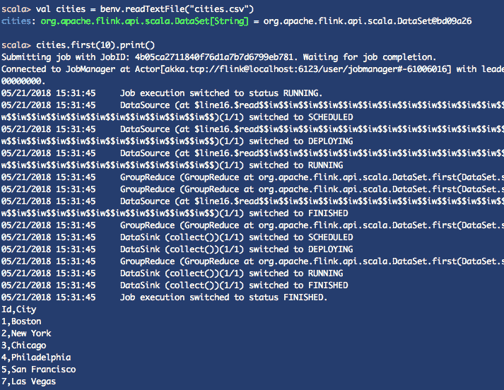

```scala
Id,City
1,Boston
2,New York
3,Chicago
4,Philadelphia
5,San Francisco
7,Las Vegas
```

```scala
val temp = benv.readTextFile("temperatures.csv")
```


```scala
Date,Id,Temperature
2018-01-01,1,21
2018-01-01,2,22
2018-01-01,3,23
2018-01-01,4,24
2018-01-01,5,25
2018-01-01,6,22
2018-01-02,1,23
2018-01-02,2,24
2018-01-02,3,25
```

现在让我们将 cities.csv 和 temperatures.csv 加载到 DataSets 中，并删除标题。

```scala
 val cities = benv.readTextFile("cities.csv")
    .filter(!_.contains("Id,"))
val temp = benv.readTextFile("temperatures.csv")
    .filter(!_.contains("Id,"))
```

然后我们将数据集转换为元组数据集。第一个数据集即城市数据集将产生`<cityId, cityName>`元组。第二个数据集是温度数据集，将产生`<cityId, temperature>`元组。

```scala
val cities2 = cities.map(x => (x.split(",")(0), x.split(",")(1)))
cities2.first(10).print()
val temp2 = temp.map(x => (x.split(",")(1), x.split(",")(2)))
temp2.first(10).print()
```

# 内部连接

内部联接要求左右表具有相同的列。如果在左侧或右侧有重复或多个键的副本，连接将很快变成某种笛卡尔连接，比正确设计以最小化多个键花费更长的时间来完成:


现在，我们准备执行内部连接来连接元组的两个数据集，如以下代码所示:

```scala
cities2.join(temp2)
 .where(0)
 .equalTo(0)
 .first(10).print()
```

该作业的输出如下所示，显示了两个数据集中的元组，其中 cityID 存在于两个数据集中:

```scala
 ((1,Boston),(1,21))
 ((2,New York),(2,22))
 ((3,Chicago),(3,23))
 ((4,Philadelphia),(4,24))
 ((5,San Francisco),(5,25))
 ((1,Boston),(1,23))
 ((2,New York),(2,24))
 ((3,Chicago),(3,25))
 ((4,Philadelphia),(4,26))
 ((5,San Francisco),(5,18))
```

现在，如果我们应用聚合并将每个城市的温度相加，我们将得到每个城市的总温度。您可以通过编写如下代码所示的代码来实现这一点:

```scala
cities2
    .join(temp2)
    .where(0)
    .equalTo(0)
    .map(x=> (x._1._2, x._2._2.toInt))
    .groupBy(0)
    .sum(1)
    .first(10).print()
```

这显示了以下结果:

```scala
(Boston,111)
(Chicago,116)
(New York,119)
(Philadelphia,116)
(San Francisco,113)
```

该工作可以在 flink UI 中看到:


`join()`原料药定义如下:

```scala

 /**
 * Initiates a Join transformation.
 *
 * <p>A Join transformation joins the elements of two
 * {@link DataSet DataSets} on key equality and provides multiple ways to combine
 * joining elements into one DataSet.
 *
 * <p>This method returns a {@link JoinOperatorSets} on which one of the {@code where} methods
 * can be called to define the join key of the first joining (i.e., this) DataSet.
 *
 * @param other The other DataSet with which this DataSet is joined.
 * @return A JoinOperatorSets to continue the definition of the Join transformation.
 *
 * @see JoinOperatorSets
 * @see DataSet
 */
 public <R> JoinOperatorSets<T, R> join(DataSet<R> other) {
 return new JoinOperatorSets<>(this, other);
 }
```

# 左外连接

左外连接给出了左侧表中的所有行，以及两个表共有的行(内连接)。如果在几乎没有共同点的表上使用，会导致非常大的结果，从而降低性能:


现在，我们准备执行左外连接来连接元组的两个数据集，如以下代码所示:

```scala
cities2
    .leftOuterJoin(temp2)
    .where(0)
    .equalTo(0) {
        (x,y) => (x, if (y==null) (x._1,0) else (x._1, y._2.toInt))
    }
    .map(x=> (x._1._2, x._2._2.toInt))
    .groupBy(0)
    .sum(1)
    .first(10).print()
```

该作业的输出如下所示，显示了两个数据集中的元组，其中 cityID 存在于左侧或两个数据集中:

```scala
(Boston,111)
(Chicago,116)
(Las Vegas,0)   // Las vegas has no records in temperatures DataSet so is assigned 0
(New York,119)
(Philadelphia,116)
(San Francisco,113)
```

该工作可以在 flink UI 中看到:


`leftOuterJoin()`原料药定义如下:

```scala
/**
 * Initiates a Left Outer Join transformation.
 *
 * <p>An Outer Join transformation joins two elements of two
 * {@link DataSet DataSets} on key equality and provides multiple ways to combine
 * joining elements into one DataSet.
 *
 * <p>Elements of the <b>left</b> DataSet (i.e. {@code this}) that do not have a matching
 * element on the other side are joined with {@code null} and emitted to the
 * resulting DataSet.
 *
 * @param other The other DataSet with which this DataSet is joined.
 * @return A JoinOperatorSet to continue the definition of the Join transformation.
 *
 * @see org.apache.flink.api.java.operators.join.JoinOperatorSetsBase
 * @see DataSet
 */
 public <R> JoinOperatorSetsBase<T, R> leftOuterJoin(DataSet<R> other) {
 return new JoinOperatorSetsBase<>(this, other, JoinHint.OPTIMIZER_CHOOSES, JoinType.LEFT_OUTER);
 }
```

# 右外连接

右外连接给出了右侧表中的所有行以及左侧和右侧的公共行(内连接)。使用它可以获得右表中的所有行以及左表和右表中的行。如果不在左边，填写`NULL`。性能类似于本表前面提到的左外连接:


现在，我们准备执行右外连接来连接元组的两个数据集，如以下代码所示:

```scala
cities2
    .rightOuterJoin(temp2)
    .where(0)
    .equalTo(0) {
        (x,y) => (if (x==null) (y._1,"unknown") else (y._1, x._2), y)
    }
    .map(x=> (x._1._2, x._2._2.toInt))
    .groupBy(0)
    .sum(1)
    .first(10).print()
```

该作业的输出如下所示，显示了两个数据集中的元组，其中 cityID 存在于右侧或两个数据集中:

```scala
(Boston,111)
(Chicago,116)
(New York,119)
(Philadelphia,116)
(San Francisco,113)
(unknown,44) . // note that only right hand side temperatures DataSet has id 6 which is not in cities DataSet
```

该工作可以在 flink UI 中看到:

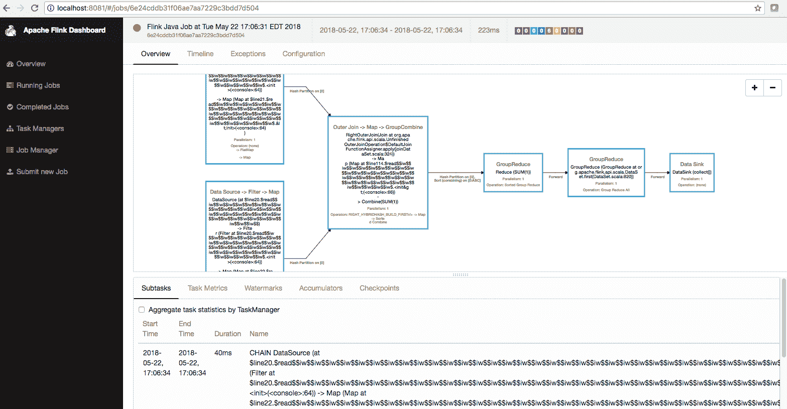

`rightOuterJoin()`原料药定义如下:

```scala
/**
 * Initiates a Right Outer Join transformation.
 *
 * <p>An Outer Join transformation joins two elements of two
 * {@link DataSet DataSets} on key equality and provides multiple ways to combine
 * joining elements into one DataSet.
 *
 * <p>Elements of the <b>right</b> DataSet (i.e. {@code other}) that do not have a matching
 * element on {@code this} side are joined with {@code null} and emitted to the
 * resulting DataSet.
 *
 * @param other The other DataSet with which this DataSet is joined.
 * @return A JoinOperatorSet to continue the definition of the Join transformation.
 *
 * @see org.apache.flink.api.java.operators.join.JoinOperatorSetsBase
 * @see DataSet
 */
 public <R> JoinOperatorSetsBase<T, R> rightOuterJoin(DataSet<R> other) {
 return new JoinOperatorSetsBase<>(this, other, JoinHint.OPTIMIZER_CHOOSES, JoinType.RIGHT_OUTER);
 }
```

# 完全外部连接

完全外部联接给出联接子句左侧和右侧表中的所有(匹配和不匹配)行。当我们想要保留两个表中的所有行时，我们使用完全外部连接。当其中一个表匹配时，完全外部联接返回所有行。如果在几乎没有共同点的表上使用，可能会导致非常大的结果，从而降低性能:

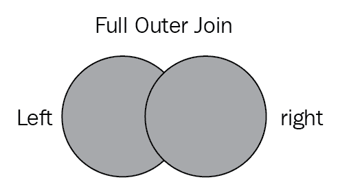

现在，我们准备执行完整的外部连接来连接元组的两个数据集，如以下代码所示:

```scala
cities2
    .fullOuterJoin(temp2)
    .where(0)
    .equalTo(0) {
        (x,y) => (if (x==null) (y._1,"unknown") else (x._1, x._2), 
                if (y==null) (x._1,0) else (y._1, y._2.toInt))
    }
    .map(x=> (x._1._2, x._2._2.toInt))
    .groupBy(0)
    .sum(1)
    .first(10).print()
```

该作业的输出如下所示，显示了两个数据集中的元组，其中 cityID 存在于一个或两个数据集中:

```scala
(Boston,111)
(Chicago,116)
(Las Vegas,0) // Las vegas has no records in temperatures DataSet so is assigned 0
(New York,119)
(Philadelphia,116)
(San Francisco,113)
(unknown,44) // note that only right hand side temperatures DataSet has id 6 which is not in cities DataSet
```

该工作可以在 flink UI 中看到:


`fullOuterJoin()`原料药定义如下:

```scala
/**
 * Initiates a Full Outer Join transformation.
 *
 * <p>An Outer Join transformation joins two elements of two
 * {@link DataSet DataSets} on key equality and provides multiple ways to combine
 * joining elements into one DataSet.
 *
 * <p>Elements of <b>both</b> DataSets that do not have a matching
 * element on the opposing side are joined with {@code null} and emitted to the
 * resulting DataSet.
 *
 * @param other The other DataSet with which this DataSet is joined.
 * @return A JoinOperatorSet to continue the definition of the Join transformation.
 *
 * @see org.apache.flink.api.java.operators.join.JoinOperatorSetsBase
 * @see DataSet
 */
 public <R> JoinOperatorSetsBase<T, R> fullOuterJoin(DataSet<R> other) {
 return new JoinOperatorSetsBase<>(this, other, JoinHint.OPTIMIZER_CHOOSES, JoinType.FULL_OUTER);
 }
```

# 写入文件

数据接收器使用数据集，并用于存储或返回它们。使用输出格式描述数据接收器操作。Flink 附带了各种内置的输出格式，这些格式封装在对数据集的操作之后:

*   `writeAsText()` / `TextOutputFormat`:将元素以字符串形式逐行写入。通过调用每个元素的`toString()`方法获得字符串。
*   `writeAsCsv(...)` / `CsvOutputFormat`:将元组写成逗号分隔的值文件。行和字段分隔符是可配置的。每个字段的值来自对象的`toString()`方法。
*   `print()` / `printToErr()`:在标准输出/标准误差流上打印每个元素的`toString()`值。
*   `write()` / `FileOutputFormat`:自定义文件输出的方法和基类。支持自定义对象到字节的转换。
*   `output()` / `OutputFormat`:最通用的输出方法，用于非基于文件的数据接收器(例如将结果存储在数据库中)。

让我们使用`writeAsText()`将城市和温度的内部连接结果写入文件。

No output will be seen until you call `benv.execute()`.

首先，为城市和温度的内部连接创建一个数据集:

```scala
val results = cities2
    .join(temp2)
    .where(0)
    .equalTo(0)
    .map(x=> (x._1._2, x._2._2.toInt))
    .groupBy(0)
    .sum(1)
```

然后在结果数据集上调用`writeAsText()`，在数据链上调用`execute()`，如下代码所示:

```scala
results.writeAsText("file:///Users/sridharalla/flink-1.4.2/results.txt").setParallelism(1)
benv.execute()
```

如果您打开刚刚创建的文件，您将看到连接操作的结果，如以下代码所示:

```scala
(Boston,111)
(Chicago,116)
(New York,119)
(Philadelphia,116)
(San Francisco,113)
```

该工作可以在 flink UI 中看到:


# 摘要

在本章中，我们讨论了 Apache Flink 以及如何使用 Flink 对大量数据执行批处理分析。我们探索了弗林克和弗林克的内部运作。然后，我们加载并分析执行转换和聚合操作的数据。然后我们探讨了如何对大数据执行 Join 操作。

在下一章中，我们将讨论使用 Apache Flink 的实时分析。