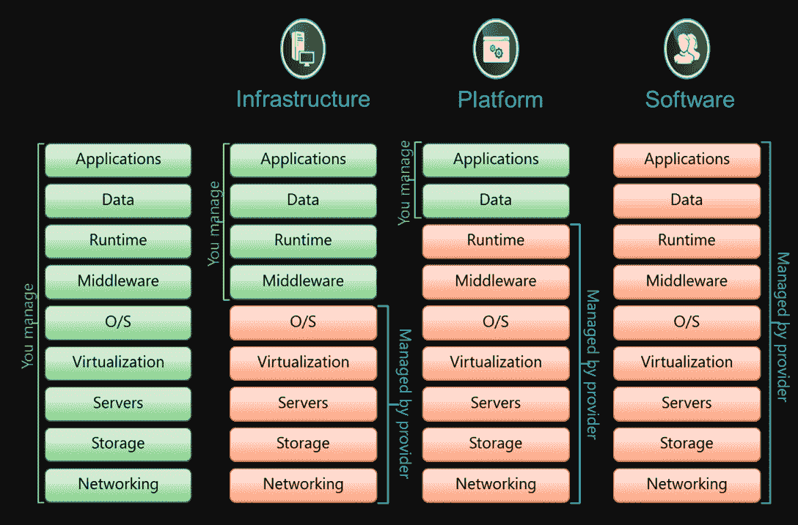
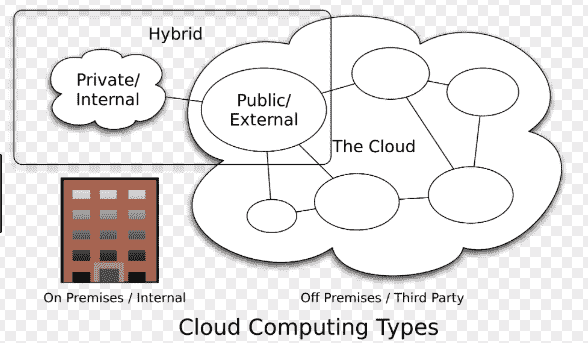

# 十一、云计算简介

本章介绍云计算、**基础设施即服务** ( **IaaS** )、**平台即服务** ( **PaaS** )和**软件即服务** ( **SaaS** )的概念。还简要讨论了顶级云提供商。

简而言之，本章将涵盖以下主题:

*   云计算基础知识
*   概念和术语
*   目标和益处
*   风险和挑战
*   角色和界限
*   云特征
*   云交付模型
*   云部署模型

无论您运行的应用程序能够在数百万移动用户之间共享照片，还是支持企业的关键运营，云服务平台都可以快速访问灵活且低成本的信息技术资源。借助云计算，您不需要在管理硬件上进行大量投资。相反，您可以调配合适的计算资源来支持您的想法或管理您的信息技术部门的运营。您可以立即访问所需的资源，并只根据使用情况付费。

云计算提供了一种通过互联网访问服务器、存储、数据库和一系列应用服务的简单方法。像**亚马逊网络服务** ( **AWS** )这样的云服务平台拥有并维护这些应用服务所需的网络连接硬件，同时您可以使用网络应用程序使用您需要的东西。

# 概念和术语

本节介绍云的基本概念及其构件。

# 云

云是指一个独特的信息技术环境，它是为远程配置可扩展和可测量的信息技术资源而设计的。该术语起源于对互联网的隐喻，用来描述提供对一组分散的信息技术资源的远程访问的网络网络。在云计算成为正式的信息技术领域之前，云符号通常用于在各种规范和基于网络的架构的主流文档中表示互联网。

# 信息技术资源

信息技术资源是与信息技术相关的物理或虚拟工件，可以是基于软件的，如虚拟服务器或自定义软件程序，也可以是基于硬件的，如物理服务器或网络设备。

# 内部

作为一个独特的可远程访问的环境，云代表了一种部署信息技术资源的选择。在组织边界内的传统 IT 企业中托管的 IT 资源(不具体表示云)被认为位于 IT 企业的场所或内部(内部意味着位于非基于云的受控 IT 环境的场所)。该术语用于将信息技术资源定义为基于云的替代物。内部部署的信息技术资源不能基于云，反之亦然。

# 云消费者和云提供商

提供基于云的信息技术资源的实体是**云提供商**。使用基于云的信息技术资源的实体是**云消费者**。

# 缩放比例

扩展表示信息技术资源处理使用需求的能力。

以下各节描述了缩放的类型。

# 缩放类型

*   **水平缩放**:向外缩放和向内缩放
*   **垂直缩放**:向上缩放和向下缩放

# 水平缩放

分配或释放同类型的 IT 资源称为**水平伸缩**。资源的横向分配称为**向外扩展**，资源的横向释放称为**向外扩展**。水平扩展是云环境中常见的扩展形式。

# 垂直缩放

**当一个现有的 IT 资源被另一个更高或更低容量的资源替代时，就会发生垂直扩展**。将一个 IT 资源替换为另一个容量更高的资源被称为**向上扩展**，将一个 IT 资源替换为一个容量更低的资源被称为**向下扩展**。由于更换造成的停机时间，垂直扩展在云环境中不太常见。

# 云服务

尽管云是一个可远程访问的环境，但并非云内的所有信息技术资源都可以远程访问。例如，部署在云中的数据库或物理服务器只能由同一云中的其他信息技术资源访问。可以专门部署具有已发布的应用编程接口的软件程序，以支持远程客户端的访问。

云服务是可以使用云远程访问的任何信息技术资源。与其他包含服务技术的信息技术领域不同，例如**面向服务的体系结构** ( **SOA** )，云计算环境中的术语**服务**是广义的。云服务可以作为简单的基于网络的软件程序存在，具有使用消息协议调用的技术界面，或者作为管理工具或更大环境的远程访问点。

# 云服务消费者

云服务消费者是软件程序在运行时访问云服务时承担的临时角色。

云服务消费者的常见类型可以包括能够通过已发布的服务合同远程访问云服务的软件程序和服务，以及运行能够远程访问作为云服务可用的其他信息技术资源的软件的工作站、笔记本电脑和移动设备。

# 目标和益处

与批发商类似，公共云提供商的业务模式基于大规模获取信息技术资源，这些资源以有吸引力的价格提供给云消费者。这有助于组织在没有任何基础架构成本的情况下访问强大的基础架构。

投资基于云的信息技术资源最常见的经济理由是减少初始信息技术投资，如硬件、软件购买和拥有成本。云的度量使用特性代表一个特性集，它允许度量的运营支出(与业务绩效直接相关)取代预期的资本支出。这也称为**比例成本**。

成本的降低让企业从小处着手，根据需要增加 IT 资源配置。此外，较低的初始支出允许资本被重新导向核心业务投资。降低成本的机会来自主要云提供商对大规模数据中心的部署和运营。此类数据中心通常位于能够以较低成本获得房地产、信息技术专业人员和网络带宽的区域，从而实现更高的运营成本节约。

同样的原理也适用于操作系统、中间件或平台软件以及应用软件。汇集的信息技术资源可以由多个云消费者共享，从而提高或优化利用率。通过使用经验证的做法来优化云架构、管理和治理，可以进一步降低运营成本和效率低下。

云消费者的优势:

*   短期按需访问现收现付计算资源(如按小时计算的处理器)，并在不需要时释放这些计算资源
*   对无限计算资源的访问，这些资源按需提供，无需准备资源调配
*   在初级水平上添加或删除 IT 资源的能力，例如以单个千兆字节的增量修改可用存储磁盘空间
*   基础架构的基础架构抽象，以便应用程序不会被锁定在设备或位置上，并且可以在需要时轻松移动

例如，一家拥有大量以批处理为中心的任务的公司可以像他们的应用软件一样快速地完成这些任务。使用 100 台服务器 1 小时的成本与使用 1 台服务器 100 小时的成本相同。在不需要大量初始投资来创建大规模计算基础架构的情况下，实现这种信息技术资源的弹性非常有吸引力。

尽管云计算的好处显而易见，但实际的经济性可能很难计算和评估。继续采用云计算战略的决定将不仅仅是简单地比较租赁成本和购买成本。

# 增强的可扩展性

通过提供信息技术资源池，以及旨在共同利用这些资源的工具和技术，云可以根据需要或使用云消费者的直接配置，立即动态地将信息技术资源分配给云消费者。这使云消费者能够自动或手动扩展其基于云的信息技术资源，以适应处理波动和峰值。同样，基于云的信息技术资源可以随着处理需求的减少而释放(自动或手动)。

云固有的内置特性为信息技术资源提供了灵活的可扩展性，这与前面提到的成比例的成本优势直接相关。除了自动缩减扩展带来的明显财务收益之外，IT 资源始终满足和满足不可预测的使用需求的能力避免了在达到使用阈值时可能发生的潜在业务损失。

# 提高可用性和可靠性

信息技术资源的可用性和可靠性与有形的业务利益直接相关。停机限制了信息技术资源为其客户开放业务的时间，从而限制了其使用和创收潜力。在大量使用期间，没有立即纠正的运行时故障可能会产生更大的影响。不仅信息技术资源无法响应客户的请求，而且其意外故障也会降低客户的整体信心。

典型云环境的一个标志是其固有的能力，即提供广泛的支持，以提高基于云的信息技术资源的可用性，从而最大限度地减少甚至消除中断，并提高其可靠性，从而最大限度地减少运行时故障条件的影响。

具体来说:

*   可用性提高的信息技术资源可以在更长的时间内访问(例如，24 小时中的 22 小时)。云提供商通常提供弹性的信息技术资源，能够保证高水平的可用性。
*   可靠性提高的信息技术资源能够更好地避免异常情况并从中恢复。云环境的模块化体系结构提供了广泛的故障转移支持，从而提高了可靠性。

组织在考虑租赁基于云的服务和信息技术资源时，仔细检查云提供商提供的服务级别协议非常重要。尽管许多云环境能够提供非常高的可用性和可靠性，但归根结底是服务级别协议中做出的保证，这些保证通常代表了他们的实际合同义务。

# 风险和挑战

介绍并研究了几个最关键的云计算挑战，主要涉及使用公共云中的信息技术资源的云消费者。

# 安全漏洞增加

将业务数据迁移到云意味着数据安全的责任将由云提供商分担。远程使用信息技术资源需要云消费者扩大信任边界，以包括外部云。由于第三方云提供商通常会在经济实惠或方便的地理位置建立数据中心，因此很难正确解决多区域合规性和法律问题。当由公共云托管时，云消费者通常不知道其信息技术资源和数据的物理位置。对于某些组织来说，这可能会对指定数据隐私和存储策略的行业或政府法规造成严重的法律问题。

多重边界的存在使得很难建立跨越这种信任边界而不引入漏洞的可行安全架构，除非云消费者和云提供商碰巧支持相同或兼容的安全框架。使用公共云实现这样的兼容性并不容易。

信任边界重叠的另一个后果与云提供商对云消费者数据的特权访问有关。数据的安全程度现在受到云消费者和云提供商应用的安全控制和策略的限制。此外，由于基于云的信息技术资源通常是共享的，因此不同云消费者的信任边界可能会重叠。

信任边界的重叠和数据暴露的增加会为恶意的云消费者(人工和自动化)提供更大的机会来攻击信息技术资源并窃取或损坏业务数据。想象一个场景，两个访问相同云服务的组织需要将各自的信任边界扩展到云，导致信任边界重叠。对于云提供商来说，提供满足云服务消费者安全需求的安全机制可能是一项挑战。

# 运营治理控制减少

云消费者通常被分配了比内部 IT 资源更低的治理控制级别。这可能会引入与云提供商如何运营其云相关的风险，以及云和云消费者之间通信所需的外部连接。

# 云提供商之间的可移植性有限

由于云计算行业缺乏既定的行业标准，公共云通常在不同程度上是专有的。对于拥有依赖于这些专有环境的定制解决方案的云消费者来说，从一个云提供商转移到另一个云提供商可能很有挑战性。

# 角色和界限

根据组织和人员与云及其托管的信息技术资源的关系和/或交互方式，他们可以承担不同类型的预定义角色。每个即将加入的角色都参与并履行与基于云的活动相关的职责。以下部分定义了这些角色，并确定了它们的主要交互。

# 云提供商

提供基于云的信息技术资源的组织是云提供商。当承担云提供商的角色时，组织负责根据商定的服务级别协议条款向云消费者提供云服务。云提供商还承担任何必要的管理和行政职责，以确保整个云基础架构的平稳持续运行。

云提供商通常拥有可供云消费者租赁的信息技术资源；但是，一些云提供商也转售从其他云提供商租赁的 IT 资源。

# 云消费者

一个**云消费者**是一个组织(或一个人)，它与云提供商有正式的合同或安排来使用云提供商提供的信息技术资源。具体来说，云消费者使用云服务消费者来访问云服务。

# 云服务所有者

合法拥有云服务的个人或组织称为**云服务所有者**。云服务所有者可以是云消费者，也可以是拥有云服务所在云的云提供商。

# 云资源管理员

云资源管理员是负责管理基于云的信息技术资源(包括云服务)的个人或组织。云资源管理员可以是(或属于)云服务所在云的云消费者或云提供商。或者，它可以是(或属于)签约管理基于云的信息技术资源的第三方组织。

# 其他角色

NIST 云计算参考体系结构定义了以下补充角色:

*   **云审计员**:对云环境进行独立评估的第三方(通常是认证的)承担云审计员的角色。与此角色相关的典型职责包括评估安全控制、隐私影响和性能。云审计员角色的主要目的是提供对云环境的公正评估(以及可能的认可)，以帮助加强云消费者和云提供商之间的信任关系。
*   **云经纪人**:这个角色由一方承担，该方负责管理和协商云消费者和云提供商之间的云服务使用。云经纪人提供的中介服务包括服务中介、聚合和套利。
*   **云运营商**:负责在云消费者和云提供商之间提供有线级连接的一方承担云运营商的角色。这一角色通常由网络和电信提供商承担。

# 组织边界

组织边界代表组织拥有和管理的一组信息技术资源的物理边界。

# 信任边界

当组织承担云消费者的角色来访问基于云的信息技术资源时，它需要将其信任扩展到组织的物理边界之外，以包括云环境的一部分。

# 云特征

信息技术环境需要一组特定的特征，以便能够以有效的方式远程配置可扩展和可测量的信息技术资源。这些特征需要存在到有意义的程度，信息技术环境才能被视为有效的云。

以下六个特定特征是大多数云环境共有的:

*   按需使用
*   无处不在的访问
*   多租户(和资源池)
*   弹性
*   计量使用
*   跳回

# 按需使用

云消费者可以单方面访问基于云的信息技术资源，让云消费者可以自由地自行调配这些信息技术资源。配置完成后，可以自动使用自行调配的信息技术资源，从而减少云消费者或云提供商的人力投入。这导致按需使用环境。也称为**按需自助使用**，这一特性支持主流 Clouds 中基于服务和使用驱动的功能。

# 无处不在的访问

无处不在的访问代表云服务被广泛访问的能力。为云服务建立无处不在的访问可能需要对一系列设备、传输协议、接口和安全技术的支持。启用这种级别的访问通常要求云服务架构针对不同云服务消费者的特定需求进行定制。

# 多租户(和资源池)

一个软件程序的特点是它的一个实例能够为不同的用户(租户)服务，因此每个用户都是相互隔离的，这种特点被称为多租户。云提供商通过使用经常依赖虚拟化技术的多租户模式，将其 IT 资源集中起来为多个云服务消费者提供服务。通过使用多租户技术，可以根据云服务消费者的需求动态分配和重新分配信息技术资源。

# 弹性

弹性是云的自动化能力，可根据运行时条件的需要或云消费者或云提供商的预先确定透明地扩展信息技术资源。弹性通常被认为是采用云计算的核心理由，主要是因为它与投资减少和成比例的成本收益密切相关。拥有大量信息技术资源的云提供商可以提供最大范围的弹性。

# 计量使用

衡量的使用特征代表云平台跟踪其信息技术资源使用情况的能力，主要是由云消费者跟踪。根据所测量的内容，云提供商只能根据实际使用的信息技术资源和/或获得信息技术资源访问权限的时间框架向云消费者收费。在这种情况下，计量使用与按需特性密切相关。

# 跳回

弹性计算是一种故障转移形式，它将信息技术资源的冗余实施分布在各个物理位置。可以预先配置信息技术资源，这样，如果一个资源不足，处理将自动移交给另一个冗余实现。在云计算中，弹性的特征可以指同一云中(但在不同的物理位置)或跨多个云的冗余信息技术资源。

# 云交付模型

云交付模型代表了由云提供商提供的特定的、预先打包的信息技术资源组合。三种常见的云交付模型已经广泛建立并正式化:

*   IaaS
*   PaaS
*   SaaS

# 基础设施即服务

IaaS 交付模型代表了一个独立的信息技术环境，包括以基础设施为中心的信息技术资源，这些资源可以使用基于云服务的界面和工具来访问和管理。这种环境可以包括硬件、网络、连接、操作系统和其他原始信息技术资源。与传统的托管或外包环境不同，借助 IaaS，IT 资源通常被虚拟化并打包成包，以简化基础架构的运行时扩展和定制。

IaaS 环境的一般目的是为云消费者提供对其配置和使用的高度控制和责任。IaaS 提供的信息技术资源通常没有预先配置，将管理责任直接放在云消费者身上。这种模式由云消费者使用，他们需要对他们打算创建的基于云的环境进行高度控制。

有时，云提供商会与其他云提供商签订 IaaS 产品合同，以扩展他们自己的云环境。不同云提供商提供的 IaaS 产品所提供的信息技术资源的类型和品牌可能会有所不同。通过 IaaS 环境提供的 IT 资源通常是作为新初始化的虚拟实例提供的。虚拟服务器是典型 IaaS 环境中的核心和主要 IT 资源。

# 平台即服务

平台即服务交付模型代表了一个预定义的、随时可用的环境，通常由已经部署和配置的信息技术资源组成。具体来说，平台即服务依赖于(主要由)现成环境的使用，该环境建立了一套预打包的产品和工具，用于支持定制应用程序的整个交付生命周期。

云消费者使用并投资于平台即服务环境的常见原因:

*   出于可扩展性和经济性的目的，云消费者希望将内部部署环境扩展到云中
*   云消费者使用现成的环境来完全替代内部环境
*   云消费者希望成为云提供商，并部署自己的云服务供其他外部云消费者使用

通过在现成的平台中工作，云消费者可以免除设置和维护使用 IaaS 模型提供的基础架构 IT 资源的管理负担。

# 软件即服务

定位为共享云服务并作为产品或通用工具提供的软件程序代表了 SaaS 产品的典型特征。SaaS 交付模式通常用于使一系列云消费者广泛获得可重用的云服务(通常是商业上的)。围绕 SaaS 产品存在一个完整的市场，可以租赁和用于不同的目的，并使用不同的条款。

云消费者通常被授予对 SaaS 实施非常有限的管理控制权。它通常由云提供商提供，但也可以由承担云服务所有者角色的任何实体合法拥有。例如，在使用和使用 PaaS 环境时充当云消费者的组织可以构建云服务，并决定将其部署在与 SaaS 产品相同的环境中。由于基于 SaaS 的云服务可供在使用云服务时充当云消费者的其他组织使用，因此同一组织实际上承担了云提供商的角色。

# 结合云交付模型

三个基本的云交付模型组成了一个自然的供应层次结构，允许探索模型组合应用的机会。接下来的章节将简要强调与两种常见组合相关的注意事项。

# IaaS + PaaS

平台即服务环境将建立在与物理和虚拟服务器以及 IaaS 环境中提供的其他 IT 资源相当的底层基础架构之上。

# 国际会计准则+部分会计准则+ SaaS

所有三种云交付模式都可以结合起来，建立相互依赖的信息技术资源层。例如，通过添加到前面的分层体系结构中，云消费者组织可以使用 PaaS 环境提供的现成环境来开发和部署自己的 SaaS 云服务，然后将其作为商业产品提供。

以下是 IaaS、PaaS 和 SaaS 中的所有层:

# 云部署模型

云部署模型代表特定类型的云环境，主要通过所有权、规模和访问权限来区分。

以下部分描述了四种常见的云部署模型:

*   公共云
*   社区云
*   私有云
*   混合云

# 公共云

公共云是由第三方云提供商拥有的可公开访问的云环境。公共云上的信息技术资源通常使用前面描述的云交付模型进行调配，通常以一定的成本提供给云消费者，或者使用其他途径(如广告)进行商业化。

云提供商负责创建和持续维护公共云及其信息技术资源。在接下来的章节中探讨的许多场景和架构都涉及公共云以及使用公共云的信息技术资源的提供者和消费者之间的关系。

# 社区云

社区云类似于公共云，只是它的访问仅限于特定的云消费者社区。社区云可能由社区成员共同拥有，也可能由第三方云提供商拥有，该提供商为公共云提供有限的访问权限。社区的成员云消费者通常分担定义和发展社区云的责任。

社区成员并不一定能保证访问或控制云的所有信息技术资源。除非得到社区的允许，否则社区之外的各方通常不会被授予访问权限。

# 私有云

私有云由单个组织拥有。私有云使组织能够使用云计算技术作为一种手段，集中组织的不同部分、位置或部门对信息技术资源的访问。当私有云作为受控环境存在时，在[第 3 章](03.html)、*利用 MapReduce 进行大数据处理*的*风险和挑战*一节中描述的问题往往不适用。

私有云的使用可以改变组织和信任边界的定义和应用方式。私有云环境的实际管理可能由内部或外包人员执行。

使用私有云，同一组织在技术上既是云消费者，也是云提供商。为了区分这些角色:

*   一个单独的组织部门通常承担调配云的责任(因此承担云提供商的角色)
*   需要访问私有云的部门承担云消费者的角色

A Cloud service consumer in the organization's on-premise environment accesses a Cloud service hosted on the same organization's private Cloud using a virtual private network.

在私有云环境中，正确使用内部部署和基于云这两个术语非常重要。即使私有云可能实际驻留在组织的场所，但只要云消费者可以远程访问它所承载的信息技术资源，它仍然被视为基于云的。因此，作为云消费者的部门在私有云之外托管的信息技术资源被视为与基于私有云的信息技术资源相关的本地资源。

# 混合云

混合云是由两个或多个不同的云部署模型组成的云环境。例如，云消费者可能会选择将处理敏感数据的云服务部署到私有云，将其他不太敏感的云服务部署到公共云。这种组合的结果是一种混合部署模式。

此处显示的是一个使用混合云架构的组织，该架构同时利用了私有云和公共云:

由于云环境中的潜在差异以及管理责任通常由私有云提供商和公共云提供商分担的事实，混合部署体系结构的创建和维护可能非常复杂和具有挑战性。

# 摘要

在本章中，我们讨论了云计算以及用于理解和实施云计算的关键术语。

在下一章中，我们将探索亚马逊最受欢迎的云提供商之一:AWS。