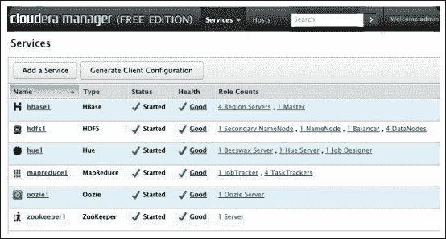

# 一、准备使用 R 和 Hadoop

第一章与关于 R 和 Hadoop 基础的几个主题捆绑在一起，如下所示:

*   安装、特性和数据建模
*   Hadoop 安装、功能和组件

在前言中，我们向您介绍了 R 和 Hadoop。本章将重点介绍如何使用这两种技术让你起床和跑步。到目前为止，R 主要用于统计分析，但由于功能和包的数量不断增加，在机器学习、可视化、数据操作等几个领域变得流行起来。r 不会将所有数据(大数据)加载到机器内存中。因此，可以选择 Hadoop 作为大数据加载数据。并不是所有的算法都在 Hadoop 上运行，并且这些算法通常不是 R 算法。尽管如此，使用 R 进行分析仍有几个与大数据相关的问题。为了分析数据集，R 将其加载到内存中，如果数据集很大，则会出现“无法分配大小为 x 的向量”等异常失败。因此，为了处理大型数据集，R 的处理能力可以通过将其与 Hadoop 集群的能力相结合来大大放大。Hadoop 是一个非常流行的框架，它提供了这样的并行处理能力。因此，我们可以在 Hadoop 集群上使用 R 算法或分析处理来完成工作。


如果我们考虑一个组合的 RHadoop 系统，R 将负责具有初步功能的数据分析操作，例如数据加载、探索、分析和可视化，Hadoop 将负责并行数据存储以及针对分布式数据的计算能力。

在经济实惠的大数据技术出现之前，分析通常在单台机器上的有限数据集上运行。当应用于大型数据集时，高级机器学习算法非常有效，这只有在大型集群中才有可能，在大型集群中，数据可以通过分布式数据存储系统进行存储和处理。在下一节中，我们将看到如何在不同的操作系统上安装 R 和 Hadoop，以及链接 R 和 Hadoop 的可能方式。

# 安装 R

你可以通过访问 R 官方网站下载合适的版本。

以下是为三种不同操作系统提供的步骤。我们考虑了 Windows、Linux、Mac OS 进行 R 安装。下载最新版本的 R，因为它将有所有最新的补丁和解决过去的错误。

对于 Windows，请遵循给定的步骤:

1.  导航至[www.r-project.org](http://www.r-project.org)。
2.  点击 **CRAN** 部分，选择 **CRAN 镜像**，选择你的 Windows OS(坚持 LinuxHadoop 几乎总是在 Linux 环境中使用)。
3.  从镜像下载最新的 R 版本。
4.  执行下载的`.exe`安装 r。

对于 Linux-Ubuntu，请遵循给定的步骤:

1.  导航至[www.r-project.org](http://www.r-project.org)。
2.  点击 **CRAN** 部分，选择 **CRAN 镜像**，选择你的操作系统。
3.  在`/etc/apt/sources.list`文件中，添加 CRAN `<mirror>`条目。
4.  使用`sudo apt-get update`命令从存储库中下载并更新包列表。
5.  使用`sudo apt-get install r-base`命令安装 R 系统。

对于 Linux-RHEL/CentOS，请遵循给定的步骤:

1.  导航至[www.r-project.org](http://www.r-project.org)。
2.  点击 **CRAN** ，选择 **CRAN 镜像**，选择红帽 OS。
3.  下载`R-*core-*.rpm`文件。
4.  使用`rpm -ivh R-*core-*.rpm`命令安装`.rpm`包。
5.  使用`sudo yum install R`安装 R 系统。

对于 Mac，请遵循给定的步骤:

1.  导航至[www.r-project.org](http://www.r-project.org)。
2.  点击 **CRAN** ，选择 **CRAN 镜像**，选择你的操作系统。
3.  下载以下文件:`pkg`、`gfortran-*.dmg`、`tcltk-*.dmg`。
4.  安装`R-*.pkg`文件。
5.  然后，安装`gfortran-*.dmg`和`tcltk-*.dmg`文件。

安装基础 R 包后，建议安装 RStudio，这是一个强大直观的 R**集成开发环境** ( **IDE** )

### 类型

我们可以使用革命分析的 R 分布作为统计计算和预测分析的现代数据分析工具，该工具有免费版本和高级版本。Hadoop 集成也可用于执行大数据分析。

# 安装 RStudio

要安装 RStudio，请执行以下步骤:

1.  导航至[http://www.rstudio.com/ide/download/desktop](http://www.rstudio.com/ide/download/desktop.)。
2.  为您的操作系统下载最新版本的 RStudio。
3.  执行安装程序文件并安装 RStudio。

RStudio 组织和用户社区已经开发了很多用于图形和可视化的 R 包，例如`ggplot2`、`plyr`、`Shiny`、`Rpubs`和`devtools`。

# 理解 R 语言的特点

有超过 3000 个 R 包，而且这个列表还在日益增长。甚至试图解释所有这些包都超出了任何一本书的范围。本书只关注R 的关键特性和最常用、最受欢迎的包。

## 使用 R 包

R 包是可以作为函数调用的独立的 R 功能单元。一个很好的类比是 Java 中的一个`.jar`文件。有一个庞大的 R 包库，可用于从统计操作和机器学习到丰富的图形可视化和绘图等非常广泛的操作。每个包将由一个或多个 R 函数组成。R 包是一个可重用的实体，可以被其他人共享和使用。r 用户可以安装包含他们正在寻找的功能的包，并开始调用包中的功能。这些包裹的综合清单可以在名为**综合 R 档案网** ( **CRAN** )的[http://cran.r-project.org/](http://cran.r-project.org/)找到。

## 执行数据操作

r 允许大范围的操作。统计运算，如均值、最小值、最大值、概率、分布、回归。机器学习操作，如线性回归、逻辑回归、分类和聚类。通用数据处理操作如下:

*   **数据清理**:这个选项是清理海量数据集
*   **数据探索**:这个选项是探索数据集所有可能的值
*   **数据分析**:这个选项是用描述性和预测性分析数据可视化对数据进行分析，也就是分析输出编程的可视化

为了构建一个有效的分析应用，有时我们需要使用在线的**应用编程接口** ( **API** )来挖掘数据，用权宜服务进行分析，并通过第三方服务进行可视化。此外，为了自动化数据分析过程，编程将是最有用的特性。

r 有自己的编程语言来操作数据。此外，可用的软件包可以帮助将 R 与其他编程功能集成在一起。r 支持面向对象编程概念。它还能够与其他编程语言集成，如 Java、PHP、C 和 C++。有几个包将作为中间层编程特性来帮助数据分析，它们类似于`sqldf`、`httr`、`RMongo`、`RgoogleMaps`、`RGoogleAnalytics`和`google-prediction-api-r-client`。

## 增加社区支持

随着 R 用户数量不断升级，与 R 相关的群体也在不断增加。因此，R 学习者或开发人员可以在几个 R 小组或社区的帮助下轻松连接并解决他们的不确定性。

以下是许多常见的有用信息来源:

*   **R 邮件列表**:这个是 R 项目业主创建的官方 R 群。
*   **R 博客** : R 有无数的博主在几个 R 应用上写文章。最受欢迎的博客网站之一是[http://www.r-bloggers.com/](http://www.r-bloggers.com/)，所有的博主都在这里投稿。
*   **栈溢出**:这个是一个很棒的技术知识共享平台，程序员可以在这里发布自己的技术查询，发烧友程序员建议解决方案。更多信息，请访问[http://stats.stackexchange.com/](http://stats.stackexchange.com/)。
*   **小组**:LinkedIn 和 Meetup 上还有许多其他小组，世界各地的专业人士聚集在一起讨论他们的问题和创新想法。
*   **书籍**:也有很多关于 R 的书籍，其中比较受欢迎的有 *R in Action* 、 *Rob Kabacoff* 、 *Manning Publications* 、*R in absolute*、 *Joseph Adler* 、 *O'Reilly Media* 、 *R and Data Mining* 、*颜长昭*、【t1t

## 在 R 中进行数据建模

数据建模是一种从历史数据集中识别隐藏模式的机器学习技术，这种模式将有助于对相同数据的未来值预测。这种技术高度关注过去的用户行为，并学习他们的品味。这些数据建模技术中的大多数已经被许多流行的组织所采用，以根据他们过去的交易来了解他们的客户的行为。这些技术将分析数据，并为客户预测他们在寻找什么。亚马逊、谷歌、脸书、易贝、领英、推特和许多其他组织正在使用数据挖掘来改变应用程序的定义。

最常见的数据挖掘技术如下:

*   **回归**:在统计学中，回归是通过在变量值上拟合状态线来识别两个或多个变量之间的标量关系的经典技术。这种关系将有助于预测未来事件的变量值。例如，任何变量 y 都可以用公式 *y = mx+c* 建模为另一个变量 x 的线性函数。这里，x 是预测变量，y 是响应变量，m 是直线的斜率，c 是截距。产品或服务的销售预测和股票价格预测可以通过这种回归来实现。r 通过`lm`方法提供这种回归特征，默认情况下在 r 中存在
*   **分类**:这是一种机器学习技术，用于标记为训练示例而提供的观察集。有了这个，我们可以将观察分类到一个或多个标签中。销售的可能性、在线欺诈检测和癌症分类(用于医学)是分类问题的常见应用。谷歌邮件使用这种技术将电子邮件分类为垃圾邮件。r 中的`glm`、`glmnet`、`ksvm`、`svm`和`randomForest`可以提供分类功能
*   **聚类**:这种技术是从给定的项目集合中将相似的项目组织成组。用户分割和图像压缩是聚类最常见的应用。市场细分、社会网络分析、组织计算机聚类和天文数据分析都是聚类的应用。谷歌新闻使用这些技术将相似的新闻项目归入同一类别。聚类可以通过 r 中的`knn`、`kmeans`、`dist`、`pvclust`和`Mclust`方法实现
*   **推荐**:推荐算法用于推荐系统，其中系统是目前使用的最容易识别的机器学习技术。网络内容推荐可能包括类似的网站、博客、视频或相关内容。此外，网上商品的推荐有助于交叉销售和追加销售。我们都见过网上购物门户网站试图根据用户过去的行为推荐书籍、手机或任何可以在网上出售的商品。亚马逊是一个著名的电子商务门户网站，通过推荐系统产生 29%的销售额。推荐器系统可以通过`Recommender()`用 r 中的`recommenderlab`包来实现

# 安装 Hadoop

现在，我们假设您知道 R，它是什么，如何安装它，它的关键功能是什么，以及为什么您可能想要使用它。现在我们需要知道 R 的局限性(这是对 Hadoop 更好的介绍)。在处理数据之前；r 需要将数据加载到**随机存储器** ( **RAM** )中。因此，数据需要小于可用的机器内存。对于大于机器内存的数据，我们将其视为大数据(仅在我们的情况下，因为大数据有许多其他定义)。

为了避免这个大数据问题，我们需要扩展硬件配置；然而，这是一个临时的解决方案。为了解决这个问题，我们需要一个 Hadoop 集群，能够存储它并在大型计算机集群上执行并行计算。Hadoop 是最受欢迎的解决方案。Hadoop 是一个开源的 Java 框架，是 Apache 软件基金会处理的顶级项目。Hadoop 的灵感来自谷歌文件系统和 MapReduce，主要设计用于通过分布式处理对大数据进行操作。

Hadoop 主要支持 Linux 操作系统。要在 Windows 上运行，我们需要使用 VMware 在 Windows 操作系统中托管 Ubuntu。使用和安装 Hadoop 的方法有很多，但这里我们会考虑最支持 R 的方式。在我们结合 R 和 Hadoop 之前，让我们先了解一下什么是 Hadoop。

### 类型

机器学习包含了所有可以通过网络链接[http://en.wikipedia.org/wiki/Machine_learning](http://en.wikipedia.org/wiki/Machine_learning)探索的数据建模技术。

Michael Noll 关于 Hadoop 安装的结构博客可以在[http://www . Michael-Noll . com/tutorials/running-Hadoop-on-Ubuntu-Linux-单节点-cluster/](http://www.michael-noll.com/tutorials/running-hadoop-on-ubuntu-linux-single-node-cluster/) 找到。

## 了解不同的 Hadoop 模式

Hadoop与三种不同的模式一起使用:

*   **独立模式**:在这个模式下，你不需要启动任何 Hadoop 守护程序。取而代之的是，只需调用`~/Hadoop-directory/bin/hadoop`，它将作为单个 Java 进程执行一个 Hadoop 操作。出于测试目的，建议这样做。这是默认模式，您不需要配置其他任何东西。所有守护程序，如名称节点、数据节点、作业跟踪器和任务跟踪器，都在一个 Java 进程中运行。
*   **伪模式**:在这个模式下，你为所有节点配置 Hadoop。一个单独的 **Java 虚拟机** ( **JVM** ) 是为每个 Hadoop 组件或守护程序(如单个主机上的迷你集群)生成的。
*   **全分布式模式**:在这种模式下，Hadoop 分布在多台机器上。专用主机是为 Hadoop 组件配置的。因此，所有守护程序都有单独的 JVM 进程。

## 了解 Hadoop 安装步骤

Hadoop 可以通过几种方式安装；我们将考虑更好地与 r 集成的方式，我们将选择 Ubuntu 操作系统，因为它易于安装和访问。

1.  在 Linux 上安装 Hadoop，Ubuntu 风格(单节点和多节点集群)。
2.  在 Ubuntu 上安装 Cloudera Hadoop。

### 在 Linux 上安装 Hadoop，Ubuntu 风味(单节点集群)

要以伪模式在 Ubuntu 操作系统上安装 Hadoop，我们需要满足以下先决条件:

*   Sun Java 6
*   专用 Hadoop 系统用户
*   配置 SSH
*   禁用 IPv6

### 类型

所提供的 Hadoop 安装将支持 Hadoop MRv1。

按照给定的步骤安装 Hadoop:

1.  从 Apache 软件基金会下载最新的 Hadoop 源代码。这里我们考虑了 Apache Hadoop 1.0.3，而最新版本是 1.1.x.

    ```r
    // Locate to Hadoop installation directory
    $ cd /usr/local

    // Extract the tar file of Hadoop distribution
    $ sudo tar xzf hadoop-1.0.3.tar.gz

    // To move Hadoop resources to hadoop folder 
    $ sudo mv hadoop-1.0.3 hadoop

    // Make user-hduser from group-hadoop as owner of hadoop directory
    $ sudo chown -R hduser:hadoop hadoop

    ```

2.  将`$JAVA_HOME`和`$HADOOP_HOME`变量添加到 Hadoop 系统用户的`.bashrc`文件中，更新后的`.bashrc`文件如下:

    ```r
    // Setting the environment variables for running Java and Hadoop commands
    export HADOOP_HOME=/usr/local/hadoop
    export JAVA_HOME=/usr/lib/jvm/java-6-sun

    // alias for Hadoop commands
    unalias fs &> /dev/null
    alias fs="hadoop fs"
    unalias hls &> /dev/null
    aliashls="fs -ls"

    // Defining the function for compressing the MapReduce job output by lzop command
    lzohead () {
    hadoopfs -cat $1 | lzop -dc | head -1000 | less
    }

    // Adding Hadoop_HoME variable to PATH 
    export PATH=$PATH:$HADOOP_HOME/bin

    ```

3.  用`conf/*-site.xml`格式更新Hadoop配置文件。

最后，这三个文件将如下所示:

*   `conf/core-site.xml` :

    ```r
    <property>
    <name>hadoop.tmp.dir</name>
    <value>/app/hadoop/tmp</value>
    <description>A base for other temporary directories.</description>
    </property>
    <property>
    <name>fs.default.name</name>
    <value>hdfs://localhost:54310</value>
    <description>The name of the default filesystem. A URI whose
    scheme and authority determine the FileSystem implementation. The
    uri's scheme determines the config property (fs.SCHEME.impl) naming
    theFileSystem implementation class. The uri's authority is used to
    determine the host, port, etc. for a filesystem.</description>
    </property>
    ```

*   `conf/mapred-site.xml` :

    ```r
    <property>
    <name>mapred.job.tracker</name>
    <value>localhost:54311</value>
    <description>The host and port that the MapReduce job tracker runs
    at. If "local", then jobs are run in-process as a single map
    and reduce task.
    </description>
    </property>
    ```

*   `conf/hdfs-site.xml` :

    ```r
    <property>
    <name>dfs.replication</name>
    <value>1</value>
    <description>Default block replication.
      The actual number of replications can be specified when the file is created.
      The default is used if replication is not specified in create time.
    </description>
    ```

在完成对这些配置文件的编辑后，我们需要跨 Hadoop 集群或节点设置分布式文件系统。

*   使用以下命令行通过名称节点格式化 **Hadoop 分布式文件系统** ( **HDFS** )
*   使用以下命令行启动单节点集群:

    ```r
    hduser@ubuntu:~$ /usr/local/hadoop/bin/start-all.sh

    ```

### 类型

**下载示例代码**

您可以在[http://www.packtpub.com](http://www.packtpub.com)从您的账户中下载您购买的所有 Packt 书籍的示例代码文件。如果您在其他地方购买了这本书，您可以访问[http://www.packtpub.com/support](http://www.packtpub.com/support)并注册，以便将文件直接通过电子邮件发送给您。

### 在 Linux 上安装 Hadoop，Ubuntu 风味(多节点集群)

我们学习了如何在单节点集群上安装 Hadoop。现在我们将看到如何在多节点集群(全分布式模式)上安装 Hadoop 。

为此，我们需要几个配置了单节点 Hadoop 集群的节点。要在多节点上安装 Hadoop，我们需要为该机器配置单节点 Hadoop 集群，如上一节所述。

安装单节点 Hadoop 集群后，我们需要执行以下步骤:

1.  在网络阶段，我们将使用两个节点来设置完全分布式 Hadoop 模式。为了相互通信，就软件和硬件配置而言，节点需要在同一网络中。
2.  在这两个节点中，一个节点将被视为主节点，另一个节点将被视为从节点。因此，为了执行 Hadoop 操作，主机需要连接到从机。我们将在主机中输入`192.168.0.1`，在从机中输入`192.168.0.2`。
3.  Update the `/etc/hosts` directory in both the nodes. It will look as `192.168.0.1 master` and `192.168.0.2 slave`.

    ### 类型

    您可以执行 **安全外壳** ( **SSH** )设置，类似于我们对单节点集群设置所做的。更多详情，请访问[http://www.michael-noll.com](http://www.michael-noll.com)。

4.  更新`conf/*-site.xml`:我们必须改变所有节点中的所有这些配置文件。
    *   `conf/core-site.xml`和`conf/mapred-site.xml`:在单节点设置中，我们已经更新了这些文件。所以，现在我们只需要在价值标签中将`localhost`替换为`master`。
    *   `conf/hdfs-site.xml`:在单节点设置中，我们已经将`dfs.replication`的值设置为`1`。现在我们需要更新为`2`。
5.  在格式化 HDFS 阶段，在我们开始多节点集群之前，我们需要使用以下命令格式化 HDFS(从主节点):

    ```r
    bin/hadoop namenode -format

    ```

现在，我们已经完成了安装多节点 Hadoop 集群的所有步骤。要启动 Hadoop 集群，我们需要遵循以下步骤:

1.  启动 HDFS 守护程序:

    ```r
    hduser@master:/usr/local/hadoop$ bin/start-dfs.sh

    ```

2.  启动 MapReduce 守护程序:

    ```r
    hduser@master:/usr/local/hadoop$ bin/start-mapred.sh

    ```

3.  或者，我们可以用一个命令启动所有守护进程:

    ```r
    hduser@master:/usr/local/hadoop$ bin/start-all.sh

    ```

4.  要停止所有这些守护程序，请激发:

    ```r
    hduser@master:/usr/local/hadoop$ bin/stop-all.sh

    ```

这些安装步骤是受欧洲瑞士研究员兼软件工程师迈克尔·诺尔的博客([http://www.michael-noll.com](http://www.michael-noll.com))启发后复制的。他在 VeriSign 担任 Apache Hadoop 堆栈上的大规模计算基础设施的技术主管。

现在，Hadoop 集群已经在您的机器上设置好了。要在具有扩展 Hadoop 组件的单节点或多节点上安装相同的 Hadoop 集群，请尝试 Cloudera 工具。

### 在 Ubuntu 上安装 Cloudera Hadoop

**Cloudera Hadoop**(**CDH**)是 Cloudera 的开源发行版，面向企业级部署的 Hadoop 技术。Cloudera 也是 Apache 软件基金会的赞助商。CDH 有两个版本:CDH3 和 CDH4。要安装其中的一个，您必须拥有带有 10.04 LTS 或 12.04 LTS 的 Ubuntu(此外，您还可以尝试 CentOS、Debian 和红帽系统)。如果您在计算机集群上安装 Hadoop，Cloudera manager 将使您的安装更加容易，该集群在整个集群上提供基于图形用户界面的 Hadoop 及其组件安装。这个工具非常适合大型集群。

我们需要满足以下前提条件:

*   配置 SSH
*   符合以下标准的操作系统:
    *   64 位 Ubuntu 10.04 LTS 或 12.04 LTS
    *   红帽企业版 Linux 5 或 6
    *   CentOS 5 或 6
    *   甲骨文企业版 Linux 5
    *   企业服务器 11 (SP1 或拉索)
    *   Debian 6.0

安装步骤如下:

1.  下载并运行 Cloudera manager 安装程序:要初始化 Cloudera manager 安装过程，我们需要首先从 Cloudera 网站的下载部分下载`cloudera-manager-installer.bin`文件。之后，将其存储在集群中，以便所有节点都可以访问它。允许用户拥有`cloudera-manager-installer.bin`的执行权限。运行以下命令开始执行。

    ```r
    $ sudo ./cloudera-manager-installer.bin

    ```

2.  阅读 Cloudera 管理器**自述文件**，然后点击**下一步**。
3.  启动 Cloudera 管理器管理控制台:Cloudera 管理器管理控制台允许您使用 Cloudera 管理器在集群上安装、管理和监控 Hadoop。接受 Cloudera 服务提供商的许可后，您需要通过在地址栏中输入`http://localhost:7180`来遍历您的本地网络浏览器。您也可以使用以下任何浏览器:
    *   Firefox 11 或更高版本
    *   谷歌 Chrome
    *   微软公司出品的 web 浏览器
    *   旅行队
4.  使用用户名和密码均为`admin`的默认凭据登录到 Cloudera 管理器控制台。以后你可以根据自己的选择改变它。
5.  使用 Cloudera 管理器通过浏览器自动安装和配置 CDH3:这一步将把 Cloudera 所需的大部分【Cloudera Hadoop 包安装到您的机器上。步骤如下:
    1.  如果您选择了完整版本的软件，请安装并验证您的 Cloudera manager 许可证密钥文件。
    2.  为您的 CDH 群集安装指定主机名或 IP 地址范围。
    3.  使用 SSH 连接到每台主机。
    4.  在每个集群主机上安装 **Java 开发工具包** ( **JDK** )(如果尚未安装)、Cloudera 管理器代理以及 CDH3 或 CDH4。
    5.  在每个节点上配置 Hadoop，并启动 Hadoop 服务。
6.  运行向导并使用 Cloudera 管理器后，您应该尽快更改默认管理员密码。要更改管理员密码，请按照下列步骤操作:
    1.  单击带有齿轮符号的图标，显示管理页面。
    2.  打开**密码**标签。
    3.  输入两次新密码，然后点击**更新**。
7.  Test the Cloudera Hadoop installation: You can check the Cloudera manager installation on your cluster by logging into the Cloudera manager admin console and by clicking on the **Services** tab. You should see something like the following screenshot:

    

    Cloudera 管理器管理控制台

8.  You can also click on each service to see more detailed information. For example, if you click on the **hdfs1** link, you might see something like the following screenshot:

    

    Cloudera 管理器管理控制台—HDFS 服务

    ### 类型

    要避免这些安装步骤，请使用带有 Amazon Elastic MapReduce 和 MapReduce 的预配置 Hadoop 实例。

    如果你想在视窗系统上使用 Hadoop，试试霍顿工程公司的 HDP 工具。这是 Hadoop 100%开源的企业级分布。您可以在[http://hortonworks.com/download/](http://hortonworks.com/download/)下载 HDP 工具。

# 了解 Hadoop 特性

Hadoop 是专门为两个核心概念设计的:HDFS 和 MapReduce。两者都与分布式计算有关。MapReduce 被认为是 Hadoop 的核心，它对分布式数据执行并行处理。

让我们看看关于 Hadoop 特性的更多细节:

*   HDFS
*   MapReduce

## 了解 HDFS

HDFS 是 Hadoop 自己的机架感知文件系统，这是 Hadoop 基于 UNIX 的数据存储层。HDFS 源于谷歌文件系统的概念。Hadoop 的一个重要特征是跨许多(数千)主机对数据和计算进行分区，并在接近其数据的情况下并行执行应用程序计算。在 HDFS，数据文件作为数据块序列在集群中复制。Hadoop 集群通过简单地添加商用服务器来扩展计算容量、存储容量和输入/输出带宽。可以通过许多不同的方式从应用程序访问 HDFS。HDFS 本地提供了一个 Java 应用编程接口供应用程序使用。

雅虎的 Hadoop 集群！跨越 40，000 台服务器并存储 40pb 的应用程序数据，最大的 Hadoop 集群为 4，000 台服务器。此外，全球还有 100 家其他组织使用 Hadoop。

### 了解 HDFS 的特点

让我们现在来看看 HDFS 的特点:

*   容错
*   使用商用硬件运行
*   能够处理大型数据集
*   主从范式
*   只写一次文件访问

## 理解 MapReduce

MapReduce 是一个编程模型，用于处理分布在大型集群上的大型数据集。MapReduce 是 Hadoop 的核心。它的编程范例允许在配置了 Hadoop 集群的数千台服务器上执行海量数据处理。这是来源于谷歌 MapReduce。

Hadoop MapReduce 是一个用于轻松编写应用程序的软件框架，它以可靠、容错的方式在大型集群(数千个节点)的商用硬件上并行处理大量数据(多万亿字节数据集)。这个 MapReduce 范例分为两个阶段，Map 和 Reduce，主要处理数据的键和值对。映射和缩减任务在集群中顺序运行；映射阶段的输出成为减少阶段的输入。这些阶段解释如下:

*   **地图阶段**:一旦被分割，数据集被分配给任务跟踪器来执行地图阶段。数据功能操作将在数据上执行，发出映射的键和值对作为映射阶段的输出。
*   **缩减阶段**:然后主节点收集所有子问题的答案，并以某种方式组合形成输出；它最初试图解决的问题的答案。

并行计算的五个常见步骤如下:

1.  准备`Map()`输入:这将逐行获取输入数据，并每行发出键值对，或者我们可以根据需要显式更改。
    *   地图输入:列表(k1，v1)
2.  运行用户提供的`Map()`代码
    *   地图输出:列表(k2，v2)
3.  将贴图输出混洗到缩小处理器。此外，洗牌相似的关键点(分组)并输入到相同的减速器。
4.  运行用户提供的`Reduce()`代码:这个阶段将运行开发者设计的自定义 reducer 代码，在混洗的数据上运行，并发出键和值。
    *   减少输入:(k2，list(v2))
    *   减少输出:(k3，v3)
5.  Produce the final output: Finally, the master node collects all reducer output and combines and writes them in a text file.

    ### 类型

    在谷歌文件系统上查看的参考链接可以在[http://research.google.com/archive/gfs.html](http://research.google.com/archive/gfs.html)找到，谷歌地图缩减可以在[http://research.google.com/archive/mapreduce.html](http://research.google.com/archive/mapreduce.html)找到。

# 学习 HDFS 和 MapReduce 架构

由于 HDFS 和 MapReduce 被认为是 Hadoop 框架的两个主要特性，我们将重点关注它们。那么，让我们首先从 HDFS 开始。

## 了解 HDFS 建筑

HDFS 可以呈现为主/从架构。HDFS 主机被命名为名称节点，而从机被命名为数据节点。名称节点是一个服务器管理文件系统名称空间，并调整客户端对文件的访问(打开、关闭、重命名等)。它将输入数据分成块，并宣布哪个数据块将存储在哪个数据节点中。数据节点是一个从属机器，它存储分区数据集的副本，并在请求到来时提供数据。它还执行块创建和删除。

HDFS 的内部机制将文件分成一个或多个块；这些块存储在一组数据节点中。在复制因素三的正常情况下，HDFS 策略是将第一个拷贝放在本地节点上，第二个拷贝放在具有不同节点的本地机架上，第三个拷贝放在具有不同节点的不同机架中。由于 HDFS 被设计为支持大文件，HDFS 块大小被定义为 64 MB。如果需要，这可以增加。

### 了解 HDFS 成分

HDFS 采用主从架构管理，包括以下组件:

*   **命名节点**:这是HDFS 体系的主宰。它维护目录、文件，并管理数据节点上存在的数据块。
*   **数据节点**:这些是从机，部署在每台机器上并提供实际存储。他们负责为客户端提供读写数据请求。
*   **辅助名称节点**:负责执行周期性检查点。因此，如果名称节点在任何时候出现故障，可以用由辅助名称节点检查点存储的快照映像替换它。

## 了解 MapReduce 架构

MapReduce 也是通过主从架构实现的。经典 MapReduce 包含作业提交、作业初始化、任务分配、任务执行、进度和状态更新、作业完成相关活动，主要由 JobTracker 节点管理，TaskTracker 执行。客户端应用程序向作业跟踪器提交作业。然后在集群中划分输入。然后，作业跟踪器计算要处理的映射和减速器的数量。它命令任务跟踪器开始执行作业。现在，任务跟踪器将资源复制到本地机器，并启动 JVM 来映射和减少数据上的程序。与此同时，任务跟踪器定期向作业跟踪器发送更新，这可以被视为有助于更新作业标识、作业状态和资源使用的心跳。

### 理解 MapReduce 组件

MapReduce 是用主从架构管理的，包含以下组件:

*   **作业跟踪器**:这个是 MapReduce 系统的主节点，管理集群中的作业和资源(TaskTrackers)。作业跟踪器试图将每个映射安排得尽可能接近任务跟踪器上正在处理的实际数据，任务跟踪器运行在与底层块相同的数据节点上。
*   **任务跟踪器**:这些是部署在每台机器上的从机。他们负责按照作业跟踪器的指示运行地图和减少任务。

## 通过剧情了解 HDFS 和 MapReduce 架构

在此图中，包含了 HDFS 和 MapReduce 主组件和从组件，其中 NameNode 和 DataNode 来自 HDFS，JobTracker 和 TaskTracker 来自 MapReduce 范例。

由主候选对象和从候选对象组成的两种范例都有自己特定的责任来处理 MapReduce 和 HDFS 操作。在下一个图中，有一个包含两个部分的图:前一个是 MapReduce 图层，后一个是 HDFS 图层。


HDFS 和 MapReduce 架构

Hadoop 是一个顶级的 Apache 项目，是一个非常复杂的 Java 框架。为了避免技术上的复杂，Hadoop 社区开发了许多 Java 框架，为 Hadoop 的特性增加了额外的价值。它们被视为 Hadoop 子项目。在这里，我们将讨论几个 Hadoop 组件，它们可以被认为是 HDFS 或 MapReduce 的抽象。

# 了解 Hadoop 子项目

**Mahout** 是一个流行的数据挖掘库。它采用最流行的数据挖掘可扩展机器学习算法来执行聚类、分类、回归和统计建模，以准备智能应用程序。此外，它是一个可扩展的机器学习库。

Apache Mahout 是根据商业友好的 Apache 软件许可证分发的。Apache Mahout 的目标是建立一个充满活力、响应迅速和多样化的社区，不仅促进对项目本身的讨论，也促进对潜在用例的讨论。

以下是一些使用 Mahout 的公司:

*   **亚马逊**:这是一个提供个性化推荐的购物门户
*   **AOL** :这是一个购物推荐的购物入口
*   **Drupal** :这是一个使用 Mahout 的 PHP 内容管理系统，用于提供基于开源内容的推荐
*   **iOffer** :这是一个购物门户，利用 Mahout 的频繁模式集挖掘和协同过滤向用户推荐商品
*   **LucidWorks 大数据**:这是一家受欢迎的分析公司，它使用 Mahout 进行聚类、重复文档检测、阶段提取和分类
*   **Radoop** :这为大数据分析提供了一个拖放界面，包括 Mahout 聚类和分类算法
*   **Twitter** :这是一个社交网站，使用 Mahout 的**潜在 Dirichlet 分配** ( **LDA** )实现进行用户兴趣建模，在 GitHub 上维护一个 Mahout 的分叉。
*   **Yahoo**!: This is the world's most popular web service provider, which uses Mahout's Frequent Pattern Set Mining for Yahoo! Mail

    ### 类型

    Hadoop 生态系统的参考链接可以在[http://www.revelytix.com/?q=content/hadoop-ecosystem](http://www.revelytix.com/?q=content/hadoop-ecosystem)找到。

**Apache HBase** 是一个面向 Hadoop 的分布式大数据存储。这允许对大数据进行随机、实时的读/写访问。这是受谷歌 BigTable 启发后创新的面向列的数据存储模型。

以下是使用 HBase 的公司:

*   **雅虎！**:这是全球最受欢迎的近乎重复文档检测网络服务提供商
*   **Twitter** :这是一个用于版本控制存储和检索的社交网站
*   **Mahalo** :这是一个类似内容推荐的知识共享服务
*   **NING** :这是一家提供实时分析和报告的社交网络服务提供商
*   **StumbleUpon** :这是一个通用的个性化推荐系统，实时数据存储，数据分析平台
*   **Veoh**: This is an online multimedia content sharing platform for user profiling system

    ### 类型

    谷歌大数据，结构化数据分布式存储系统，参考链接[http://research.google.com/archive/bigtable.html](http://research.google.com/archive/bigtable.html)。

**Hive** 是脸书开发的基于 Hadoop 的类数据仓库框架。它允许用户用类似 SQL 的语言发出查询，比如高度抽象为 Hadoop MapReduce 的 HiveQL。这允许没有 MapReduce 经验的 SQL 程序员使用仓库，并使其更容易与业务智能和可视化工具集成，以进行实时查询处理。

**Pig** 是一个基于 Hadoop 的开源平台，通过自己的类似 SQL 的语言:Pig Latin 来分析大规模数据集。这为大量复杂的数据并行计算提供了一个简单的操作和编程接口。这也更容易开发；它更加优化和可扩展。ApachePIG已经被雅虎开发出来了！。目前，雅虎！和推特是小PIG的主要用户。

对于开发人员来说，直接使用 Java APIs 可能会比较繁琐或者容易出错，同时也限制了 Java 程序员使用 Hadoop 编程的灵活性。因此，Hadoop 提供了两种解决方案，使 Hadoop 使用 MapReduce 进行数据集管理和数据集分析的编程变得更加容易——这两种解决方案是 Pig 和 Hive，它们总是令人困惑。

**Apache Sqoop** 提供 Hadoop 数据处理平台，关系数据库、数据仓库等非关系数据库以全新的方式快速传输大量数据。Apache Sqoop 是一个双向数据工具，用于将数据从关系数据库导入到 Hadoop HDFS，并将数据从 HDFS 导出到关系数据库。

它与大多数现代关系数据库(如 MySQL、PostgreSQL、Oracle、微软 SQL Server 和 IBM DB2)以及企业数据仓库一起工作。Sqoop 扩展 API 提供了一种为数据库系统创建新连接器的方法。此外，Sqoop 源代码提供了一些流行的数据库连接器。为了执行这个操作，Sqoop 首先用一些数据库模式创建和转换的逻辑将数据转换成 Hadoop MapReduce。

**Apache Zookeeper** 也是一个 Hadoop 子项目，用于管理 Hadoop、Hive、Pig、HBase、Solr 等项目。Zookeeper 是一个开源的分布式应用协调服务，它是用 Fast Paxos 基于算法的同步以及分布式应用的维护等配置和命名服务设计的。在编程中，Zookeeper 设计是一种非常简单的数据模型风格，很像系统目录树结构。

Zookeeper 分为两部分:服务器和客户端。对于 Zookeeper 服务器集群，只有一个服务器充当领导者，接受并协调所有权限。其余的服务器是主服务器的只读副本。如果领导服务器关闭，任何其他服务器都可以开始处理所有请求。动物园管理员客户端连接到动物园管理员服务上的服务器。客户端发送请求，接收响应，访问观察器事件，并通过与服务器的 TCP 连接发送心跳。

对于分布式应用程序的高性能协调服务，Zookeeper 是一个集中式服务，用于维护配置信息、命名以及提供分布式同步和组服务。分布式应用程序以某种形式使用所有这些类型的服务。每次实现它们时，都有大量的工作要做，以修复不可避免的错误和竞争条件。部署应用程序时，这些服务会导致管理复杂性。

Apache Solr 是来自 Apache 许可证项目的开源企业搜索平台。Apache Solr 具有高度的可扩展性，支持分布式搜索和索引复制引擎。这允许用强大的文本搜索、分面搜索、实时索引、动态聚类、数据库集成和丰富的文档处理来构建 web 应用程序。

Apache Solr 是用 Java 编写的，它作为一个独立的服务器运行，通过类似 REST 的 HTTP/XML 和 JSON APIs 提供搜索结果。因此，这个 Solr 服务器可以很容易地与用其他编程语言编写的应用程序集成在一起。由于所有这些功能，这个搜索服务器被网飞、美国在线、CNET 和 Zappos 使用。

**安巴里** 是非常专属于霍顿工厂的。Apache Ambari 是一个基于网络的工具，支持 Apache Hadoop 集群的供应、管理和监控。Ambari 处理大部分 Hadoop 组件，包括 HDFS、MapReduce、Hive、Pig、HBase、Zookeeper、Sqoop 和 HCatlog 作为集中管理。

此外，安巴里能够通过 Hadoop 集群安装基于 Kerberos 身份验证协议的安全性。此外，它还为用户提供基于角色的用户身份验证、授权和审核功能，以管理集成的 LDAP 和活动目录。

# 总结

在本章中，我们学习了什么是 R、Hadoop 及其功能，以及如何安装它们，然后继续使用 R 和 Hadoop 分析数据集。在下一章中，我们将学习什么是 MapReduce，以及如何使用 Apache Hadoop 开发 MapReduce 程序。