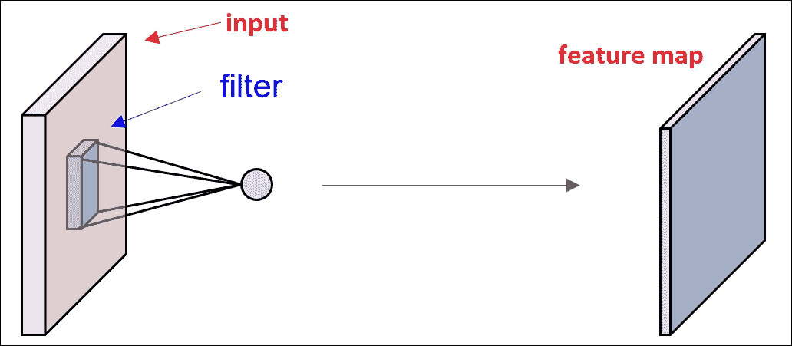
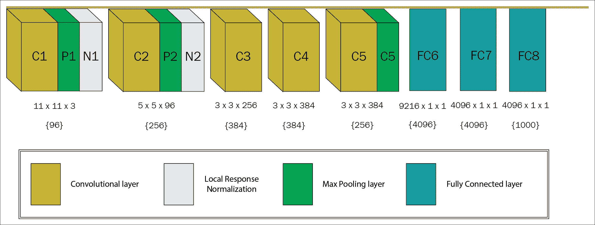
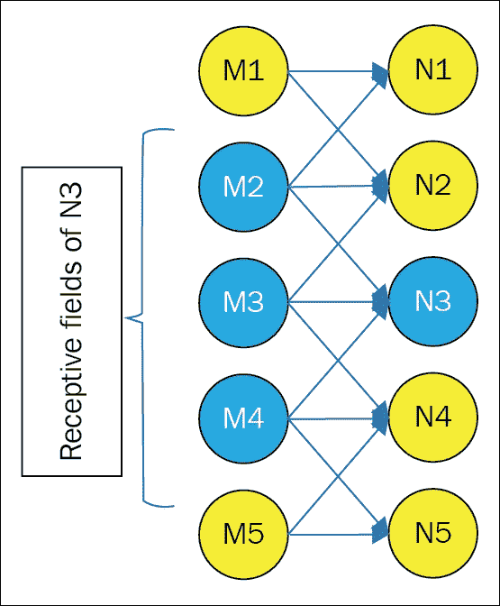
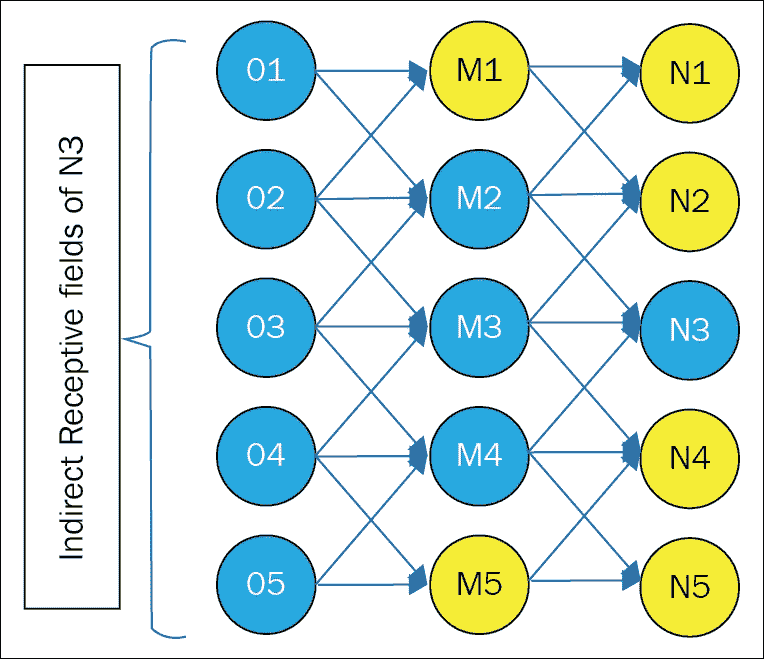
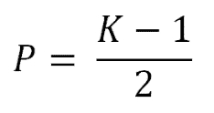

# 三、卷积神经网络

|   | *“电脑会不会思考的问题，并不比潜艇会不会游泳的问题更有趣。”* |   |
|   | *Edsger 中的一个。Dijkstra* 字首 |

**卷积神经网络(CNN)** -加入了一些可以忽略不计的计算机科学，难道没有给人一种数学和生物学结合的诡异感觉吗？然而，这些类型的网络已经成为计算机视觉领域中一些最主要和最强大的体系结构。CNN 在 2012 年之后开始获得知名度，当时分类的精度有了巨大的提高，这要归功于深度学习领域的一些先驱。从那以后，一堆高科技公司一直在使用深度 CNN 进行各种服务。亚马逊使用美国有线电视新闻网进行产品推荐，谷歌使用它进行照片搜索，脸书主要使用它进行自动标记算法。

美国有线电视新闻网[89]是一种前馈神经网络，由神经元组成，具有可学习的权重和偏差。这些类型的网络基本上用于处理数据，具有网格状的拓扑形式。顾名思义，中枢神经系统是一种神经网络，与一般的矩阵乘法不同，它是一种特殊类型的线性数学运算，即卷积，用于至少一个后续层。美国有线电视新闻网的架构旨在利用多维结构的输入。这些包括输入图像、语音信号甚至一维时间序列数据的 2D 结构。有了这些优势，美国有线电视新闻网在许多实际应用中取得了真正的成功。因此，美国有线电视新闻网非常成功，特别是在自然语言处理、推荐系统、图像识别和视频识别等领域。

### 注

偏置单元是一个额外的*神经元，其值为 1，并被添加到每个预输出层。这些单元没有连接到上一层，因此不代表任何真正意义上的*活动*。*

 *在这一章中，我们将深入讨论 CNN 的构建模块。我们将首先讨论什么是卷积，以及卷积运算在神经网络中的必要性。在这个主题下，我们还将讨论池操作，这是美国有线电视新闻网最重要的组成部分。本章的下一个主题将指出 CNN 在处理大规模数据时面临的主要挑战。本章的最后一部分将帮助读者学习如何使用 Deeplearning4j 设计 CNN。

本章的主要主题如下:

*   理解卷积
*   美国有线电视新闻网的背景
*   美国有线电视新闻网的基本层
*   分布式深层 CNN
*   深度学习的美国有线电视新闻网 4j

# 理解卷积

为了理解卷积的概念，让我们举一个例子，借助激光传感器来确定丢失手机的位置。假设手机在 *t* 时刻的当前位置可以由激光给出为 *f (t)* 。激光对 *t* 的所有数值给出不同的位置读数。激光传感器本质上通常是有噪声的，这对于这种情况是不希望的。因此，为了获得噪音较小的手机位置测量值，我们需要计算各种测量值的平均值。理想情况下，测量值越多，定位的精度就越高。因此，我们应该进行加权平均，为测量提供更多的权重。

加权函数可以由函数 *w (b)* 给出，其中 *b* 表示测量的年龄。为了推导出一个新的函数来更好地估计手机的位置，我们需要取每时每刻重量的平均值。

新函数可以如下给出:


前面的操作称为卷积。表示卷积的传统方法用星号或星号表示。


形式上，卷积可以定义为两个函数乘积的积分，其中一个函数被反转和移位。此外，取加权平均值，也可以用于其他目的。

就卷积网络术语而言，我们示例中的函数 *f* 被称为输入，函数 *w* 第二个参数被称为运算的内核。内核由多个过滤器组成，这些过滤器将用于输入以获得输出，称为*特征图*。以一种更方便的方式，内核可以被视为一个膜，它将只允许输入的期望特征通过它。*图 3.1* 显示了操作的示意图:



图 3.1:该图显示了卷积网络的简单表示，其中输入必须通过内核来提供特征图。

在实际场景中，如我们的示例所示，激光传感器无法真正提供每个给定时刻的测量值。理想情况下，当计算机处理数据时，它只在一些有规律的时间间隔内工作；因此，时间将是离散的。因此，传感器通常会在某个规定的时间间隔内提供结果。如果我们假设仪器每秒提供一次输出，那么参数 *t* 将只取整数值。有了这些假设，函数 *f* 和 *w* 将只为 *t* 的整数值定义。离散卷积的修正方程现在可以写成如下:


在机器学习或深度学习应用的情况下，输入通常是数据的多维数组，内核使用算法获取的不同参数的多维数组。基本假设是，函数的值仅在我们存储值的有限点集上非零，在其他地方为零。因此，无限求和可以表示为有限个数组元素范围的求和。例如，对于作为输入的 2D 图像 *I* 和对应的 2D 核 *K* ，卷积函数可以写成如下:


所以，有了这个，你已经有了卷积的一些背景。在本章的下一节，我们将讨论卷积在神经网络中的应用以及美国有线电视新闻网的组成部分。

# 美国有线电视新闻网的背景

CNN 作为深度学习模型的一种特殊形式，并不是一个新概念，长期以来被视觉社区广泛采用。该模型在 1998 年由 LeCun 等人提出的手写数字识别中运行良好[90]。但不幸的是，由于有线电视新闻网无法处理更高分辨率的图像，它的受欢迎程度随着时间的推移而下降。原因主要是硬件和内存限制，以及缺乏大规模训练数据集。随着计算能力随着时间的增加，主要是由于 CPU 和 GPU 的广泛可用性以及大数据的产生，各种大规模数据集，如 MIT Places 数据集(见周等，2014)，ImageNet [91]等。训练更大更复杂的模型成为可能。这最初由 Krizhevsky 等人[4]在他们的论文*中显示，使用深度卷积神经网络*进行 Imagenet 分类。在那篇论文中，他们用比传统方法低一半的方法降低了错误率。在接下来的几年里，他们的论文成为计算机视觉领域最具实质性的论文之一。这个由亚历克斯·克里哲夫斯基(Alex Krizhevsky)训练的流行网络，被称为 AlexNet，很可能是在计算机视觉领域使用深度网络的起点。

## 架构概述

我们假设读者已经熟悉了传统的神经网络。在这一部分，我们将看看美国有线电视新闻网的一般组成部分。

传统的神经网络接收单个向量作为输入，并通过一系列潜(隐)层达到中间状态。每个隐藏层由几个神经元组成，其中每个神经元都与前一层的所有其他神经元完全连接。最后一层称为“输出层”，是全连接的，负责班级成绩。由三层组成的规则神经网络如图*图 3.2* :


图 3.2:该图显示了三层规则神经网络的框图。每一层的神经元都与前一层的每一层完全相连。

常规神经网络在处理大规模图像时面临巨大挑战。例如，在 CIFAR-10 RGB 数据库中，图像的维数为 *32x32x3* ，因此，传统神经网络的第一隐藏层中的单个全连接神经元将具有 *32*32*3= 3072* 数量的权重。权重的数量，虽然在一开始看起来是合理的，但是随着维度数量的增加，这将是一个非常麻烦的任务。对于另一幅 RGB 图像，如果维数变为( *300x300x3* )，神经元的总权重数将产生 *300*300*3 = 270000* 权重。此外，随着层数的增加，这个数字也将急剧增加，并将很快导致过度拟合。此外，图像的可视化完全忽略了图像的复杂 2D 空间结构。因此，从初始阶段开始，神经网络的全连接概念似乎不适用于更大维度的数据集。因此，我们需要建立一个模型来克服这两个限制:


图 3.3:CNN 在 3D 中的排列(宽度、高度和深度)如图所示。每层将神经元激活的 3D 输入体积转换为相应的 3D 输出体积。红色输入层保留图像，因此，它的宽度和高度是图像的尺寸，深度是三(红色、绿色和蓝色)。图片来源于维基百科。

解决这个问题的一种方法是用卷积代替矩阵乘法。从一组卷积滤波器(核)中学习要比从整个矩阵( *300x300x3* )中学习容易得多。与传统的神经网络不同，美国有线电视新闻网的各层神经元排列在三个维度上:宽度、高度和深度。*图 3.3* 显示了这种情况的表现。例如，在前面的 CIFAR-10 示例中，图像的尺寸为 *32x32x3* ，分别为宽度、深度和高度。在美国有线电视新闻网中，一层中的神经元将只连接到前一层神经元的子集，而不是完全连接的神经元。这方面的细节将在本节的后续部分解释。此外，最终的输出层 CIFAR-10 图像将具有维度*1x 10*，因为 CNN 将把完整的图像缩小为类分数的单个向量，与深度维度一起放置。

# CNN 的基本层

有线电视新闻网由一系列层组成，网络的每一层都通过一个可微分的函数将自己从一个激活体转换到另一个激活体。四种主要类型的层用于构建有线电视新闻网:卷积层、校正线性单元层、汇集层和全连接层。所有这些层堆叠在一起，形成一个完整的 CNN。

一个普通的美国有线电视新闻网可以有以下架构:

[输入- CONV - RELU 池- FC]

但是，在深度 CNN 中，这五个基本层之间一般会穿插更多的层。

经典的深度神经网络将具有以下结构:

输入-> conv-> rel-> conv-> rel->池-> rel-> conv-> rel->池->完全连接

前面提到的 AlexNet 可以作为这种结构的完美例子。AlexNet 的架构如图*图 3.4* 所示。在每一层之后，都添加了一个隐式的 ReLU 非线性。我们将在下一节详细解释这一点。

有人可能会想，为什么我们需要在一个 CNN 中有多层？本章的下一节也将对此进行解释:



图 3.4:图中显示了 AlexNet 的深度和重量。大括号内的数字表示上面写有尺寸的过滤器的数量。

## 深度在美国有线电视新闻网的重要性

在论文[96]中，作者提出了一些统计数据，以显示深度网络如何帮助获得更高的输出精度。如前所述，克里哲夫斯基等人的架构模型使用八层，在 ImageNet 上进行训练。当完全连接的顶层(第 7 层)被移除时，它会丢弃大约 1600 万个参数，性能下降 1.1%。此外，当移除最上面的两层(第 6 层和第 7 层)时，近 5000 万个参数会随着性能下降 5.7%而减少。同样，当移除上部要素提取器图层(第 3 层和第 4 层)时，会导致约 100 万个参数下降，性能下降 3.0%。为了更好地了解场景，当移除上层要素提取器图层和完全连接的(第 3、第 4、第 6 和第 7)图层时，模型只剩下四个图层。在这种情况下，性能会下降 33.5%。

因此，很容易得出结论，我们需要深度卷积网络来提高模型的性能。然而，如前所述，由于内存和性能管理的限制，深度网络在集中式系统中极难管理。因此，需要一种分布式的方式来实现深度 CNN。在本章的后续章节中，我们将解释如何在 Deeplearning4j 的帮助下实现这一点，并将该处理与 Hadoop 的 SHARE 相集成。

## 卷积层

如架构概述所示，卷积的主要目的是允许模型在特定时间使用有限数量的输入。此外，卷积支持三个最重要的特征，这大大有助于提高深度学习模型的性能。功能如下:

*   稀疏连通性
*   参数共享
*   等变表示

我们现在将依次描述这些特性。

### 稀疏连通性

如已经解释的，传统网络层使用矩阵乘以参数矩阵，不同的参数描述每个输出单元和输入单元之间的交互。另一方面，中枢神经系统为此使用稀疏连接，有时称为稀疏交互或稀疏权重。这个想法是通过保持内核的大小小于输入来实现的，这有助于降低算法的时间复杂度。例如，对于大型图像数据集，图像可能有数千或数百万像素；然而，我们可以从核中识别图像的小而重要的特征，例如边缘和轮廓，这些特征只有数百或数十个完整的像素。因此，我们只需要保留少量参数，这反过来有助于降低模型和数据集的内存需求。这个想法还减少了操作的数量，这可以提高整体计算能力。这反过来又极大地降低了计算的运行时间复杂度，最终提高了效率。*图 3.5* 示意性地显示了如何使用稀疏连接方法，我们可以减少每个神经元的感受野数量。

### 注

卷积层中的每个神经元呈现前一层中应用的滤波器的响应。这些神经元的主要目的是通过一些非线性传递响应。应用该滤波器的前几层的总面积称为该神经元的感受野。所以，感受野总是相当于过滤器的大小。



图 3.5:该图显示了 M 的输入单位如何影响具有稀疏连通性的输出单位 N3。与矩阵乘法不同，稀疏连接方法中的感受野数量从五个减少到三个(M2、M3 和 M4)。箭头也表示参数共享方法。模型中一个神经元的连接被两个神经元共享

因此，利用稀疏连接方法，每一层的感受野比使用矩阵乘法方法的感受野小。然而，需要注意的是，对于深层中枢神经系统，单位的感受野实际上大于相应浅层网络的感受野。原因是深层网络中的所有单元都间接连接到网络的几乎所有神经元。*图 3.6* 展示了这样一个场景的可视化表示:



图 3.6:卷积神经网络深层稀疏连通性的表示。与图 3.5 不同，在图 3.5 中，单位 N3 有三个感受野，而在这里，N3 的感受野数量增加到了五个。

#### 时间复杂度提高

类似于上一节给出的例子，如果一层中有 *p* 输入和 *q* 输出，那么矩阵乘法将需要 *(p*q)* 个数的参数。算法的运行时间复杂度将变为 *O (p*q)* 。在稀疏连接方式下，如果我们将每个输出关联的上限连接数限制为 *n* ，那么它将只需要 *n*q* 个参数，运行时复杂度将降低到 *O (n*q)* 。对于许多实际应用，稀疏连接方法为深度学习任务提供了良好的性能，同时保持了 *n < < p* 的大小。

### 参数共享

参数共享可以定义为一个函数的相同参数可以用于模型中多个函数的过程。在常规神经网络中，当计算层的输出时，权重矩阵的每个元素仅应用一次。权重乘以输入的一个元素，但永远不会被重新访问。参数共享也可以称为绑定权重，因为用于一个输入的权重值与用于其他输入的权重值绑定在一起。*图 3.5* 也可以看做参数共享的例子。例如，来自 **M2** 的特定参数与 **N1** 和 **N3** 一起使用。

该操作的主要目的是控制卷积层中自由参数的数量。在有线电视新闻网中，内核的每个元素几乎都用在输入的每个位置。对此的一个逻辑假设是，如果其中一个特征在某个空间位置是所期望的，那么也应该有必要计算其他位置。

由于单个深度切片的所有元素共享相同类型的参数化，卷积层的每个深度切片中的前向通过可以被测量为具有神经元权重的输入体积的卷积。这种卷积的结果是激活图。这些激活图的集合与深度维度的关联堆叠在一起，以产生输出体积。尽管参数共享方法赋予了 CNN 体系结构的平移不变性，但它并没有增强前向传播的运行时间。

#### 提高空间复杂度

在参数共享中，模型的运行时间仍然保持 *O (n*q)* 。然而，它有助于显著降低整体空间复杂性，因为模型的存储需求减少到 n 个参数。由于 *p* 和 *q* 一般大小相似，因此 *n* 的值与 *p*q* 相比几乎可以忽略不计。

### 注

就时间复杂度和空间复杂度而言，卷积比传统的密集矩阵乘法要高效得多。

### 等变表示

在卷积层中，由于参数共享，层具有称为平移等方差的特性。等变函数被定义为其输出与输入变化方式相同的函数。

从数学上讲，如果 X 和 Y 都属于同一个组 G，那么如果中的 *f (g.x) = g.f(x)表示所有的*G*T7】T8】G*和所有的 *x* 在 *X* 中，那么函数*f:XY*就是等变的。

在卷积的情况下，如果我们取 *g* 为任意函数，该函数将输入移位相等的幅度，那么卷积函数与 *g* 等变。例如，让 *I* 成为给任意偶数坐标赋予图像颜色的函数。设 *h* 为另一个函数，将一个图像函数映射为另一个图像函数，由下式给出:


*I<sup>/</sup>T3】是将 *I* 的每个像素向右移动 5 个单位的图像功能。因此，我们有以下几点:*


现在，如果我们将此翻译应用于 *I* ，然后是卷积，当我们将卷积应用于 *I <sup>/</sup>* ，然后是变换函数 *h* 到输出时，结果将完全相同。

在图像的情况下，卷积运算生成输入中存在的所有确定特征的二维图。因此，类似于前面的例子，如果我们将输出中的对象移动某个固定的比例，输出表示也将以相同的比例移动。这个概念在某些情况下是有用的；例如，考虑两个不同队的板球运动员的合影。我们可以在图像中找到球衣的一些共同特征来检测一些球员。现在，类似的特征显然也会出现在其他人的 t 恤上。因此，在整个图像中共享参数是非常实用的。

卷积还有助于处理一些特殊类型的数据，用传统的固定形状矩阵乘法很难，甚至不可能。

## 选择卷积层的超参数

到目前为止，我们已经解释了卷积层中的每个神经元是如何连接到输入体积的。在本节中，我们将讨论控制输出音量大小的方法。换句话说，控制输出音量中神经元的数量，以及它们是如何排列的。

基本上，有三个超参数控制卷积层的输出体积的大小。它们是:深度、步幅和零填充。

我们如何知道我们应该使用多少卷积层，滤波器的大小应该是多少，或者步幅和填充的值是多少？这些都是非常主观的问题，它们的解决方案本质上一点也不琐碎。没有研究人员设置任何标准参数来选择这些超参数。神经网络通常在很大程度上取决于用于训练的数据类型。这些数据的大小、输入原始图像的复杂性、图像处理任务的类型以及许多其他标准都可能不同。通过查看大数据集，一个总的思路是，必须考虑如何选择超参数来推导正确的组合，从而以适当的比例创建图像的抽象。我们将在这一小节中讨论所有这些。

### 深度

在输出音量中，深度被认为是一个重要参数。深度对应于我们希望对输入中的一些变化的每次学习迭代应用的过滤器的数量。如果第一卷积层将原始图像作为输入，那么在存在各种颜色斑点或不同方向边缘的情况下，沿着深度维度的多个神经元可能会激活。同一输入区域中的神经元集合被称为深度列。

### 跨步

Stride 指定围绕空间维度(宽度和高度)分配深度列的策略。它基本上控制滤波器如何围绕输入音量进行卷积。步幅可以正式定义为卷积过程中滤波器移动的量。理想情况下，stride 的值应该是整数，而不是分数。从概念上来说，这个量有助于决定在进入下一层之前想要保留多少输入图像信息。步幅越大，为下一层保留的信息就越多。

例如，当步幅为 *1* 时，新的深度列被分配给空间位置，相隔一个空间单位。由于两列之间的感受野高度重叠，这就产生了大量的输出。另一方面，如果步幅值增加，感受野之间的重叠将减少，这导致空间上更小的维度输出体积。

我们将举一个例子来进一步简化这个概念。让我们想象一个 *7*7* 的输入音量和一个 *3*3* 的滤波器(为了简单起见，我们将忽略第三维度)，步幅为 *1* 。这种情况下的输出音量为尺寸 *5*5* ，如图 3.7 所示。然而，这看起来有些简单。现在，在步幅 *2* 的情况下，保持其他参数不变，输出音量将具有较少的顺序维度 *3*3* 。在这种情况下，感受野将移动 *2* 个单位，因此，体积将缩小到 *3*3* 的尺寸:


图 3.7:说明滤波器如何将 7x7 的输入音量与步幅 1 卷积，从而产生 5x5 的输出音量。

这在*图 3.8* 中有说明。所有这些计算都基于本节下一个主题中提到的一些公式。现在，如果我们想将步幅进一步增加到 *3* ，我们将很难确定间距并确保感受野适合输入音量。理想情况下，只有当需要较少的感受野重叠，并且需要较小的空间维度时，程序员才会提高步幅值:


图 3.8:说明滤波器如何将 7x7 的输入音量与步幅 2 卷积，从而产生 3×3 的输出音量。

### 零填充

我们已经获得了足够的信息来推断，随着我们不断对输入音量应用更多的卷积层，输出音量的大小会进一步减小。然而，在某些情况下，我们可能希望保留关于原始输入体积的几乎所有信息，以便我们也可以提取低级特征。在这种情况下，我们在输入体积的边界周围用零填充输入体积。

这种大小的零填充被认为是一个超参数。它可以定义为一个超参数，在我们希望精确保留输入体积的空间大小的场景中，它直接用于控制输出体积的空间大小。

例如，如果我们将 *5*5*3* 滤波器应用于 *32*32*3* 输入音量，输出音量将降低到 *28*28*3* 。但是，假设我们想要使用相同的卷积层，但是需要将输出音量保持在 *32*32*3* 。我们将使用尺寸为 *2* 的零填充来填充该层。这将给出 *36*36*3* 的输出音量，如下图所示。现在，如果我们用 *5*5*3* 滤波器应用三个卷积层，它将产生 *32*32*3* 的输出体积，从而保持输入体积的精确空间大小。*图 3.9* 为场景示意图:


图 3.9:输入体积的尺寸为 32*32*3。零的两个边框将生成 36*36*3 的输入体积。卷积层的进一步应用，具有三个尺寸为 5*5*3 的滤波器，步长为 1，将产生 32*32*3 的输出音量。

### 超参数的数学表达式

本章的这一部分将介绍一个公式，用于根据我们到目前为止讨论的超参数来计算输出体积的空间大小。这个方程对于为美国有线电视新闻网选择超参数非常有用，因为这些是“适合”网络中神经元的决定因素。输出音量的空间大小可以写成输入音量大小( *W* )、感受野大小或卷积层神经元的滤波器大小( *K* )、施加的步幅值( *S* )和边界上使用的零填充量( *P* )的函数。

计算输出体积空间大小的公式可以写成如下:


考虑到*图 3.7* 和*图 3.8* 中给出的例子，其中 *W=7* ， *K=3* ，无填充， *P =0* 。对于跨步 *1* ，我们有 *S=1* ，这将给出以下内容:


类似地，对于步幅 **2** ，等式将给出 **2** 的值:


因此，如图 3.7 中的*所示，我们将得到一个空间大小为 **3** 的输出。然而，在这种配置下，当应用 **3** 的步幅时，它将不适用于整个输入音量，因为该等式将为输出音量返回一个小数值 **2.333** :*

 *

这也意味着超参数的值具有相互约束。前面的示例返回一个小数值，因此，超参数将被认为是无效的。但是，我们可以通过在边框周围添加一些零填充来解决这个问题。

### 注

超参数的空间排列相互制约。

#### 补零效果

如零填充部分所述，它的主要目的是将输入音量的信息保留到下一层。为了确保输入和输出音量的空间大小相同，传统的零填充公式为:跨步 *S=1* :



以*图 3.9* 给出的例子，可以验证公式的真实性。在示例中， *W = 32* ， *K=5* ，以及 *S=1* 。因此，为了确保空间输出音量等于 32，我们选择零填充的数量如下:


因此，当 *P=2* 时，输出音量的空间大小如下:


因此，这个等式很好地保持了输入体积和输出体积的相同空间维度。

## ReLU(校正线性单位)层

在卷积层，系统基本上通过逐元素乘法和求和来计算线性运算。深度卷积通常执行卷积运算，然后在每一层之后进行非线性运算。这是必不可少的，因为级联线性运算会产生另一个线性系统。在层与层之间添加非线性证实了模型比线性模型更具表达性。

因此，在每个卷积层之后，激活层被应用于当前输出。因此，这个激活层的主要目的是给系统引入一些非线性。现代中枢神经系统使用**整流线性单元** ( **ReLu** )作为激活功能。

在人工神经网络中，激活函数整流器定义如下:


其中 *x* 是神经元的输入。

操作整流器的单元称为 ReLU。此前，网络中使用了许多非线性函数，如 *tan h* 、sigmoid 等，但在最近几年，研究人员发现 ReLU 层工作得更好，因为它们有助于网络更快地训练，而不会影响结果的准确性。计算效率的显著提高是一个主要因素。

此外，该层增强了模型和其他整体网络的非线性特性，而不会对卷积层的感受野产生任何影响。

最近，在 2013 年，Mass 等人[94]引入了非线性的一个新版本，称为泄漏-ReLU。泄漏-ReLU 可以定义如下:


其中*是预定参数。后来，在 2015 年，何等人[95]更新了这个方程，提出参数μ也可以训练，这导致了一个大大改进的模型。*

 *### ReLU 相对于乙状结肠功能的优势

ReLU 有助于缓解消失梯度问题，在[第 1 章](1.html "Chapter 1. Introduction to Deep Learning")、*深度学习入门*中有详细说明。ReLU 将上述功能 *f(x)* 应用于输入音量的所有值，并将所有负激活转换为 **0** 。对于最大函数，梯度定义如下:


然而，对于 Sigmoid 函数，当我们增加或减少 *x* 的值时，梯度趋于消失。

Sigmoid 函数如下所示:


Sigmoid 函数的范围为[ *0，1* ，而 ReLU 函数的范围为[ *0，﹍T4】。因此，应用 Sigmoid 函数对概率进行建模，而 ReLU 可以对所有正数进行建模。*

## 汇集层

这一层是 CNN 的第三阶段。稍后应用一些校正线性单元后，程序员可能会选择应用池层。该层也可以称为下采样层。

池功能基本上用于进一步修改图层的输出。该层的主要功能是用相邻输出的汇总统计数据替换某个位置的网络输出。这一层有多种选择，最大池是最受欢迎的一种。最大池操作[93]在矩形邻域内操作，并报告其最大输出。最大池基本上取一个过滤器(一般大小为 *2x2* )和相同长度的步幅，即 **2** 。然后将滤波器应用于输入音量，并在滤波器卷积的每个区域输出最大值。*图 3.10* 显示了同一事物的表现。汇集图层的其他流行选项包括矩形邻域的 *L2* 法线的平均值、矩形邻域的平均值或基于距中心像素距离的加权平均值:


图 3.10:具有 2*2 过滤器和跨距 2 的最大池示例。图片来源于维基百科。

### 注

如果我们感兴趣的是邻近的特征，而不是特征的确切位置，那么对局部平移的不变性是非常有益的。

### 哪里有用，哪里没有？

池层背后的直观原因是，一旦知道了原始输入卷的某个特定特征，与它相对于其他特征的位置相比，它的确切位置就变得微不足道了。在池的帮助下，对于输入的小翻译，表示变得几乎不变。对翻译的不变性意味着，对于输入端的少量翻译，大部分合并输出的值没有显著变化。

如果我们感兴趣的是邻近的特征而不是特征的确切位置，那么对于局部平移的不变性是非常有益的。但是，在处理计算机视觉任务时，需要谨慎使用 Pooling 层。尽管集中有助于降低模型的复杂性，但最终可能会失去模型的位置敏感性。

让我们举一个图像处理的例子，它包括识别图像中的一个框。在这种情况下，如果我们简单地以确定图像中框的存在为目标，池层将有所帮助。但是，如果问题陈述更关心定位盒子的确切位置，那么在使用 Pooling 层时，我们必须足够小心。作为另一个例子，假设我们正在研究一个语言模型，并且对识别两个单词之间的上下文相似性感兴趣。在这种情况下，使用池层是不可取的，因为它会损失一些有价值的特征信息。

因此可以得出结论，Pooling 层基本上是用来降低模型的计算复杂度的。池层更像是一个平均过程，我们对一组相邻要素更感兴趣。该层可以应用于我们可以放弃一些本地化信息的场景。

## 全连接层

全连接层是 CNN 的最后一层。该层的输入量来自前面的卷积层、ReLU 或池层的输出。完全连接的图层接受该输入并输出一个 *N* 维向量，其中 *N* 是初始输入数据集中存在的不同类别的数量。全连接层的基本思想是，它处理从前面一层接收到的输出，并识别与特定类最相关的特定特征。例如，如果模型正在预测图像是否包含猫或鸟，它将在激活图中具有高值，这将分别表示一些高级特征，例如四条腿或翅膀。

# 分布于美国有线电视新闻网深部

本章的这一部分将介绍一些极具侵略性的深度 CNN 架构，这些网络面临的相关挑战，以及需要更大规模的分布式计算来克服这些挑战。本节将解释 Hadoop 及其纱如何为这个问题提供足够的解决方案。

## 最流行的攻击性深度神经网络及其配置

近年来，中枢神经系统在图像识别方面取得了惊人的成果。然而，不幸的是，它们的训练成本极高。在顺序训练过程的情况下，卷积运算占用了总运行时间的大约 95%。对于大数据集，即使是小规模的分布式训练，训练过程也需要很多天才能完成。获奖的美国有线电视新闻网，2012 年的 AlexNet 和 ImageNet，用了将近一整周的时间来训练两个 GTX 580 3 GB 的图形处理器。下表显示了几个最流行的分布式深层中枢神经系统及其配置，以及完成培训过程所需的相应时间:

<colgroup><col> <col> <col> <col> <col></colgroup> 
| **车型** | **计算能力** | **数据集** | **深度数** | **训练过程所用时间** |
| 阿勒克斯网 | 两个英伟达 GTX 580 3 GB 图形处理器 | 对网络进行 ImageNet 数据培训，其中包含来自 22，000 多个类别的 1，500 多万张高分辨率图像。 | 八层 | 五到六天。 |
| ZFNet [97] | GTX 580 GPU | 130 万张图片，分布在 1000 个不同的班级。 | 八层 | 十二天。 |
| VGG Net [98] | 4 个英伟达泰坦黑色图形处理器 | 该数据集包括 1000 个类别的图像，并分为三个集合:训练(1.3 M 图像)、验证(50 K 图像)和测试(100 K 图像，带有伸出的类别标签)。 | 19 层 | 两到三周。 |
| GoogLeNet [99] | 一些高端图形处理器 | 一百二十万训练用图像。 | 当只计算带参数的层时，网络有 22 层深(如果我们也计算池，则为 27 层)。用于构建网络的总层数(独立构建模块)约为 100 层。 | 一周内。 |
| 微软 ResNet [100] | 8 GPU 机器 | 在 128 万张训练图像上进行训练，在 50k 张验证图像上进行评估。 | 152 层。 | 两到三周。 |

## 训练时间-与深度神经网络相关的主要挑战

从上表中，可以肯定地推断，研究人员已经做了大量的努力来提高结果的准确性。从表中得出的一个关键点是，层数已经成为提高精度的主要标准之一。微软的 Resnet 使用了一个深度达 152 层的神经网络，结果是一个极具攻击性的深度神经网络。这种架构在 2015 年通过深度 CNN 在分类、本地化和检测方面创造了许多新记录。除此之外，ResNet 还以令人难以置信的改进赢得了 ILSVRC 2015，错误率仅为 3.6%。

尽管深度卷积网络几乎即将达到预期的准确性，但几乎所有这些深度中枢神经系统中的主要问题是表中最右边的一列。因此，它表明，当前训练深度中枢神经系统的挑战是建立一个大规模的分布式框架，以在快速互联的网络上并行化多个中央处理器和图形处理器的训练。

## 深度中枢神经系统的 Hadoop

在本节中，我们将解释如何使用 Hadoop 来大规模分发深度模型，以加快处理速度。

氯化萘的运行时间可分为两大类:

*   网络中存在的所有卷积层消耗大约 90-95%的计算。它们使用大约 5%的参数，并且具有大的表示。[101]
*   其余的计算，大约 5-10%，由完全连接的层进行。它们使用了几乎 95%的参数，并且具有小的表示。

Alex Krizhevsky 在[101]中提出了一种使用分布式架构训练 CNN 的算法。在传统的 CNN 中，卷积运算本身消耗了整个过程几乎全部的运行时间；因此，数据并行应该用于更快的训练。但是，对于完全连接的层，建议使用模型并行方法。我们将在本章的这一部分解释使用 Hadoop 及其纱的算法。

在 Hadoop 中，分布式系统工作人员坐在 HDFS 的每个区块上，并行同步处理数据。我们将从原始输入图像中使用 1024 个示例的小批量大小，这些示例将被分成 N 个多个块 **Hadoop 分布式文件系统** ( **HDFS** )。所以，总的来说 *N* 工人将为每一小批数据工作。HDFS 的区块大小将保持为大小 *K* 。现在 *K* 应该多大？虽然小尺寸的 *K* 会增加块的数量，有助于使训练更快，但大量的 *N* 最终也会增加驻留在名称节点中的元数据的数量。这种情况下的一个主要缺点是 Hadoop [81]的**单点故障** ( **SPOF** )，这更容易导致 NameNode 的主内存变小。但是 *K* 值越大，我们得到的 HDFS 街区数量就越少，因此并行工作的工人数量就越少。这将再次使训练过程变慢。因此，选择 *K* 尺寸的更好方法主要取决于以下三个因素:

*   名称节点的主内存大小的可用性。
*   输入批处理的大小和对每个数据块执行的操作的复杂性。
*   数据的中间结果有多重要或有价值。基于这些标准，我们可以设置复制因子。但是，复制因子越高，名称节点的负载就越高。

HDFS 的数据块分布在 Hadoop 的所有数据节点上，纱将直接在这些数据节点上并行操作。

卷积层的分布式训练步骤如下:

1.  每个 *N* 块从原始输入图像中被给予不同的 1024 个例子的小数据批次。
2.  对 N 个块中的每一个应用相同大小的滤波器和步长，这导致基于输入值的单独空间输出。
3.  ReLU 被同步地、并行地应用于所有这些，以在结果中获得一些非线性。
4.  如果需要，最大池或任何其他下采样算法将根据结果的必要性应用于这些单独的数据块。
5.  *N* 块的每次迭代的输出(变换参数)被发送回称为资源管理器的主节点，在那里它们的参数被平均。新更新的参数被发送回每个 *N* 块以再次执行动作。
6.  对预定数量的时期重复步骤 2 至 5。

对于完全连接的层，在小批量输入图像的任何一个 *N* 数据块上工作的一个 *N* 数量的工人将把最后阶段的卷积活动发送给所有其他( *N-1* )数量的工人。然后，工作人员将对这批 1024 个示例执行完全连接操作，然后开始反向传播这 1024 个示例的梯度。与此操作并行的下一个工作器将把它的最后一级卷积层活动发送给其他工作器，类似于前面的情况。工人们将再次进行第二批 1024 个例子的全连接活动。这个过程将反复进行，直到我们以期望的最小误差得到结果。

在这种方法中，工人将他们最后一级卷积层的信息广播给所有其他工人。这种方法的主要好处是可以抑制很大比例( *(N-1)/N* )的通信，并且可以与全连接层的计算并行运行。该方法在网络通信方面非常有利。

因此，很明显，借助 HDFS 和 Hadoop 纱，Hadoop 可以为美国有线电视新闻网提供一个分布式环境。

现在，我们已经熟悉了用 Hadoop 并行分发模型的方法，下一部分将讨论每个工人在 HDFS 的每个区块上操作的编码部分。

# 使用深度学习的卷积层 4j

本章的这一部分将提供如何使用 Deeplearning4j 为 CNN 编写代码的基本思路。您将能够学习使用本章中提到的各种超参数的语法。

为了使用 Deeplearning4j 实现 CNN，整个想法可以分为三个核心阶段:加载数据或准备数据、网络配置以及模型的训练和评估。

## 加载数据

对于中枢神经系统，通常我们只处理图像数据来训练模型。在深度学习 4j 中，可以使用`ImageRecordReader`读取图像。以下代码片段显示了如何为模型加载*16° 16*彩色图像:

```scala
RecordReader imageReader = new ImageRecordReader(16, 16, false);
imageReader.initialize(new FileSplit(new      
File(System.getProperty("user.home"), "image_location")));
```

之后，使用`CSVRecordReader`，我们可以从输入的 CSV 文件中加载所有的图像标签，如下所示:

```scala
int numLinesToSkip = 0;
String delimiter = ",";
RecordReader labelsReader = new    
CSVRecordReader((numLinesToSkip,delimiter);
labelsReader.initialize(new FileSplit(new   
File(System.getProperty("user.home"),"labels.csv_file_location"))
```

为了组合图像和标签数据，我们可以使用`ComposableRecordReader`。`ComposableRecordReader`在我们需要合并来自多个来源的数据的情况下也是有益的:

```scala
ComposableRecordReader(imageReader,labelsReader);

```

类似地，在某些情况下，如果有人需要将 MNIST 数据集加载到模型中，而不是 imageset 为此，我们可以使用以下部分。本例使用`12345`的随机数种子:

```scala
DataSetIterator mnistTrain = new      
MnistDataSetIterator(batchSize,true,12345);
DataSetIterator mnistTest = new     
MnistDataSetIterator(batchSize,false,12345);
```

## 车型配置

操作的下一部分是配置 CNN。Deeplearning4j 提供了一个简单的构建器来逐层定义深度神经网络，设置不同的所需超参数:

```scala
MultiLayerConfiguration conf = new NeuralNetConfiguration.Builder() MultiLayerConfiguration.Builder builder = new  
NeuralNetConfiguration.Builder() 
.seed(seed) 
.iterations(iterations)
.regularization(true)
.l2(0.0005) 
.learningRate(0.01)

```

第一层，卷积层，可以使用`ConvolutionLayer.Builder`方法调用。`.build()`功能用于构建图层。`.stride()`用于设置卷积层的步距:

```scala
.layer(0, new ConvolutionLayer.Builder(5, 5)

```

`nIn`和`nOut`表示深度。`nIn`这里是`nChannels`，`nOut`是卷积要应用的滤波器数量:

```scala
.nIn(nChannels)
.stride(1, 1)
.nOut(20)

```

要将身份函数添加为激活函数，我们将以这种方式定义它:

```scala
.activation("identity")
.build())

```

要添加最大池类型的池层，我们将在第一层之后调用`SubsamplingLayer.Builder()`方法:

```scala
.layer(1, new SubsamplingLayer.Builder(SubsamplingLayer.PoolingType
.MAX)
.kernelSize(2,2)
.stride(2,2)
.build())
```

通过调用新的`DenseLayer.Builder().activation("relu")`可以添加**整流器线性单元** ( **ReLU** )层:

```scala
.layer(4, new DenseLayer.Builder().activation("relu")
.nOut(500).build())
```

模型可以通过调用`init()`方法进行初始化，如下所示:

```scala
MultiLayerNetwork model = new MultiLayerNetwork(getConfiguration());
model.init();

```

## 培训和评估

如前一节所述，对于训练部分，我们需要将整个大数据集分成多个批次。然后，该模型将在 Hadoop 中逐个处理这些批次。假设我们将数据集分成 5，000 个批次，每个批次的大小为 1024 个示例。然后，这 1024 个例子将被分成多个区块，工人们将在这些区块中并行工作。大数据集的拆分操作使用`RecordReaderDataSetIterator()`方法完成。让我们首先初始化调用方法所需的参数，如下所示:

```scala
int batchSize = 1024; 
int seed = 123;
int labelIndex = 4; 
int iterations = 1

```

让图像中的类总数为`10`:

```scala
int numClasses = 10;

```

现在，由于我们已经设置了`RecordReaderDataSetIterator()`的参数数量，我们可以调用方法来设置训练平台:

```scala
DataSetIterator iterator = new RecordReaderDataSetIterator(recordReader,batchSize,labelIndex,numClasses);
DataSet batchData= iterator.next();
batchData.shuffle();

```

在训练阶段，我们可以将批次随机分成训练和测试数据集。如果我们想要 70 个样本用于训练集，其余 30 个样本用于测试集，我们可以使用以下方法设置此配置:

```scala
SplitTestAndTrain testAndTrain = batchData.splitTestAndTrain(0.70); 
DataSet trainingData = testAndTrain.getTrain();
DataSet testData = testAndTrain.getTest();

trainAndTest =batchData.splitTestAndTrain(0.70);
trainInput = trainAndTest.getTrain();                

testInput.add(trainAndTest.getTest().getFeatureMatrix());
```

当模型被完全训练后，对于每个批次，可以保存测试数据，以便验证模型。因此，通过只定义`Evaluation`类的一个对象，我们将能够收集整个数据集的统计数据:

```scala
Evaluation eval = new Evaluation(numOfClasses);
for (int i = 0; i < testInput.size(); i++) 
{
 INDArray output = model.output(testInput.get(i));
 eval.eval(testLabels.get(i), output);
}

```

这个模型现在已经完全可以训练了。这可以通过调用`fit()`方法来完成，如下所示:

```scala
model.fit(trainInput);

```

# 总结

有线电视新闻网虽然不是一个新概念，但在过去五年里获得了巨大的普及。该网络主要应用于视觉领域。在过去的几年里，谷歌、微软、苹果等各种科技公司以及各种知名研究人员对美国有线电视新闻网进行了一些重大研究。本章从一开始就讲了卷积的概念，卷积是这类网络的主干。接下来，本章将介绍该网络的各个层。然后它为深层 CNN 的每一个相关层提供了深入的解释。然后，从理论和数学上解释了各种超参数及其与网络的关系。随后，本章讲述了如何借助 Hadoop 及其纱线在各种机器上分发深度有线电视新闻网的方法。最后一部分讨论了如何使用 Deeplearning4j 为每个工作在 Hadoop 每个块上的工作人员实现这个网络。

在下一章中，我们将讨论另一种流行的深度神经网络，称为循环神经网络。循环神经网络最近获得了巨大的普及，主要是因为它能够对可变长度的序列进行建模。到目前为止，该网络已成功应用于语言建模、手写识别、语音识别等不同领域。***