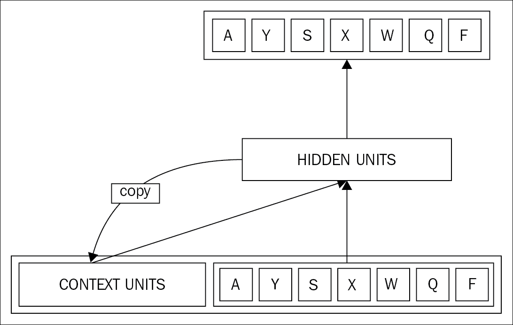
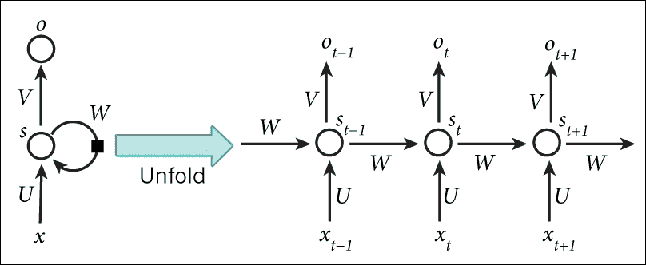
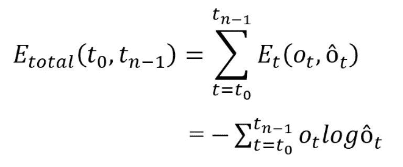
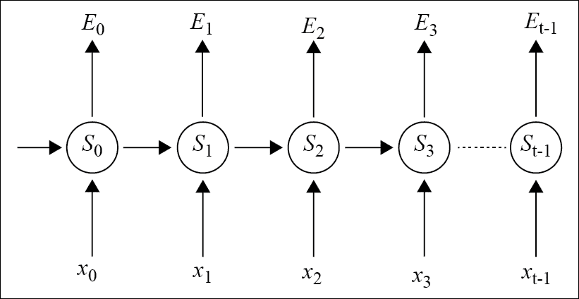
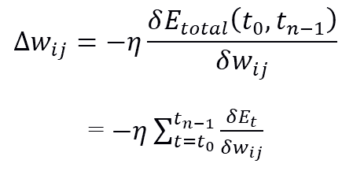

# 第四章。递归神经网络

|   | *我认为大脑本质上是一台计算机，意识就像一个计算机程序。当计算机关闭时，它将停止运行。理论上，它可以在神经网络上重建，但这将非常困难，因为它需要一个人的所有记忆。* |   |
|   | - *斯蒂芬·霍金* |

为了解决每一个问题，人们不会从头开始思考。我们的思想是非易失性的，它就像电脑的**只读存储器** ( **ROM** )一样持久。当我们阅读一篇文章时，我们从对句子中较早单词的理解中理解每个单词的意思。

让我们用一个真实的例子来解释一下这个背景。假设我们想根据视频中每一点发生的事件进行分类。由于我们没有视频早期事件的信息，对于传统的深度神经网络来说，找到一些有区别的原因来对这些事件进行分类将是一项麻烦的任务。传统的深度神经网络不能执行这种操作，因此，它一直是它们的主要限制之一。

**递归神经网络**(**RNN**)【103】是一种特殊类型的神经网络，它为这些困难的机器学习和深度学习问题提供了许多谜一样的解决方案。在最后一章中，我们讨论了卷积神经网络，它专门处理一组值 *X* (例如，图像)。同样，rnn 在处理一系列值时也很神奇， *x (0)* 、 *x (1)* 、 *x(2)* 、*...*， *x(τ-1)* 。在本章中，首先让我们将这个网络放在卷积神经网络旁边，这样您就可以了解它的基本功能，并基本了解这个网络。

卷积神经网络可以很容易地缩放到具有大宽度、高度和深度的图像。此外，一些卷积神经网络也可以处理不同大小的图像。

相比之下，递归网络可以很容易地扩展到长序列；此外，其中大多数也可以处理可变长度序列。为了处理这些任意的输入序列，RNN 使用了它们的内部记忆。

rnn 通常对小批量序列进行操作，并且包含向量 *x (t)* ，时间步长指数 *t* 的范围从 *0* 到 *(τ-1)* 。序列长度 *τ* 对于小批量的每个成员也可以变化。这个时间步长索引不应该总是指现实世界中的时间间隔，也可以指序列内部的位置。

一个 RNN，当及时展开时，可以被看作是一个具有无限层数的深层神经网络。然而，与普通的深度神经网络相比，神经网络的基本功能和体系结构有些不同。对于 RNNs，层的主要功能是引入内存，而不是分层处理。对于其他深度神经网络，输入仅在第一层提供，输出在最后一层产生。然而，在无线网络中，输入通常在每个时间步长接收，相应的输出在这些时间间隔计算。随着每一次网络迭代，新的信息被集成到每一层中，网络可以随着这些信息进行无限次数的网络更新。然而，在训练阶段，反复出现的权重需要学习他们应该向前传递哪些信息，以及他们必须拒绝什么。这个特征产生了一种特殊形式的 RNN 的主要动机，叫做**长短期记忆** ( **LSTM** )。

RNNs 在几十年前就开始了它的旅程[104]，但是最近，它已经明显成为建模可变长度序列的流行选择。截至目前，RNN 已经成功实现在各种问题中，如学习单词嵌入[105]、语言建模[106] [107] [108]、语音识别[109]和在线手写识别[110]。

在本章中，我们将讨论您需要了解的关于 RNN 和相关核心组件的一切。我们将在本章后面介绍龙的短时记忆，它是的一种特殊类型。

本章的主题组织如下:

*   是什么让循环网络与众不同？
*   递归神经网络
*   穿越时间的反向传播(BPTT)
*   长短期记忆(LSTM)
*   双向无线网络
*   分布式深层 RNNs
*   深度学习的无线网络 4j

# 是什么让递归网络与众不同？

你可能很想知道 RNNs 的专业。本章的这一节将讨论这些事情，从下一节开始，我们将讨论这种网络的构建模块。

从[第三章](3.html "Chapter 3.  Convolutional Neural Network")、*卷积神经网络*中，你大概已经感受到了卷积网络的苛刻限制，以及它们的 API 过于受限；网络只能接受固定大小向量的输入，并且还会生成固定大小的输出。此外，这些操作通过预定数量的中间层来执行。RNNs 区别于其他 RNNs 的主要原因是它们能够操作长序列的向量，并产生不同序列的向量作为输出。

|   | *“如果训练普通神经网络是对函数的优化，那么训练递归网络就是对程序的优化”* |   |
|   | - *亚历克斯·勒布朗* |

我们在*图 4.1* 中展示了不同类型的神经网络的输入输出关系，以描述差异。我们展示了如下五种类型的投入产出关系:

*   **一对一**:这种输入输出关系是针对传统的神经网络处理，没有 RNN 的参与。主要用于图像分类，其中映射是从固定大小的输入到固定大小的输出。
*   **一对多**:在这种关系中，输入和输出保持一对多的关系。该模型用一个固定大小的输入生成一系列输出。经常观察模型拍摄图像(图像标题)，并产生一句话。
*   **多对一**:在这种类型的关系中，模型取一个输入序列，输出一个单一的观测值。例如，在情感分析的情况下，向模型提供一个句子或评论；它将句子分为积极情绪或消极情绪。
*   **多对多(可变中间状态)**:模型接收一系列输入，生成相应的一系列输出。在这种类型中，RNN 读一个英语句子，然后翻译并输出一个德语句子。用于机器翻译的情况。
*   **多对多(中间状态的固定数量)**:模型接收同步的输入序列，并生成输出序列。例如，在视频分类中，我们可能希望对电影的每个事件进行分类。


图 4.1:图中的矩形表示序列向量的每个元素，箭头表示函数。输入向量以红色显示，输出向量以蓝色显示。绿色代表中间的 RNN 状态。图片取自[111]。

涉及序列的操作通常比具有固定大小的输入和输出的网络更强大和更有吸引力。这些模型用于构建更智能的系统。在接下来的部分中，我们将看到 RNNs 是如何构建的，以及网络如何将输入向量及其状态向量与定义的函数结合起来，以生成新的状态向量。

# 递归神经网络

在这一节中，我们将讨论 RNN 的建筑。我们将讨论递归关系的时间是如何展开的，并用于在 RNNs 中执行计算。

## 展开循环计算

本节将解释展开递归关系如何导致在深层网络结构中共享参数，并将其转换为计算模型。

让我们考虑一个简单的动力系统的循环形式:


在上式中， *s <sup>(t)</sup>* 代表系统在时间 *t* 的状态， *θ* 是所有迭代中共享的相同参数。

这个方程叫做递归方程，因为 *s <sup>(t)</sup>* 的计算需要 *s <sup>(t-1)</sup>* 返回的值， *s <sup>(t-1)</sup>* 的值将需要 *s <sup>(t-2)</sup>* 的值，以此类推。

出于理解的目的，这是动态系统的简单表示。再举一个例子，动力系统由外部信号 *x <sup>(t)</sup>* 驱动，产生输出 *y <sup>(t)</sup>* :


理想情况下，RNNs 遵循第二类方程，其中中间状态保留了整个过去序列的信息。然而，任何涉及递归的方程都可以用来模拟 RNN。

因此，类似于前馈神经网络，可以使用变量 *h* 在时间 *t* 定义 RNNs 的隐藏(中间)层的状态，如下所示:


在本节的下一部分，我们将在 RNN 中解释前面这个等式的功能。到目前为止，为了说明这个隐藏层的功能，*图 4.2* 显示了一个没有输出的简单递归网络。图的左侧显示了当前状态影响下一个状态的网络。循环中间的方框表示两个连续时间步长之间的延迟。

如前面的循环方程所示，我们可以及时展开或展开隐藏的状态。图像的右侧显示了循环网络的展开结构。在那里，随着时间的推移，网络可以被转换成前馈网络。

在展开的网络中，每个时间步长的每个变量都可以显示为网络的一个独立节点。


图 4.2:图的左半部分显示了信息通过隐藏层以每个时间步长多次传递的循环网络。右边是同一个网络的展开结构。该网络的每个节点都与一个时间戳相关联。

因此，从*图 4.2* 中，展开操作可以定义为执行左侧电路到右侧分割成多个状态的计算模型的映射的操作。

### 模型的优势及时展现

及时展开网络有以下几个主要优势:

*   一个没有参数的模型将需要许多用于学习目的的训练例子。然而，学习一个共享的单一模型有助于概括序列长度，甚至是那些不在训练集中的序列长度。这允许模型用较少的训练例子来估计即将到来的序列数据。
*   不管序列的长度如何，模型的输入大小将始终保持不变。展开模型中的输入大小是根据从隐藏状态到其他状态的转换来指定的。然而，对于其他情况，它是根据未定义的国家历史长度来规定的。
*   由于参数共享，每个时间步长都可以使用相同的过渡函数 *f* ，参数相同。

## RNNs 的记忆

到目前为止，你可能已经知道前馈神经网络和递归网络之间的主要区别是反馈回路。反馈回路被吸收到它自己的中间结果中，作为下一个状态的输入。对输入序列的每个元素执行相同的任务。因此，每个隐藏状态的输出取决于之前的计算。在实际情况中，每个隐藏状态不仅关心当前正在运行的输入序列，还关心他们在时间上感知到的后退一步。因此，理想情况下，每个隐藏状态都必须包含上一步结果的所有信息。

由于这种对持久信息的要求，据说 rnn 有自己的*内存*。在循环网络的隐藏状态下，顺序信息被保存为内存。这有助于在网络向前级联时处理即将到来的时间步骤，以便用每个新序列更新处理。

*图 4.3* 展示了 Elman 早在 1990 年提出的*简单递归神经网络*的概念[112]；它展示了 RNN 的持久记忆。

在下图中，底部单词序列 AYSXWQF 的一部分表示当前正在考虑的输入示例。这个输入示例的每个框代表一个单元池。向前箭头显示了下一时间步从每个发送输入单元到每个输出单元的整套可训练映射。上下文单元可以被认为是持久存储单元，它保存前面步骤的输出。从隐藏层指向上下文单元的向后箭头显示了输出的复制操作，用于评估下一个时间步骤的结果。

RNN 在时间步长 *t* 到达的决定主要取决于其在时间步长 *(t-1)* 的最后决定。因此，可以推断，与传统的神经网络不同，神经网络有两个输入源。

一个是当前正在考虑的输入单元，如下图中的 *X* ，另一个是从最近的过去接收的信息，取自图中的上下文单元。这两个源组合起来决定了当前时间步长的输出。关于这一点的更多内容将在下一节中讨论。



图 4.3:一个简单的具有 RNN 记忆概念的递归神经网络如图所示。

## 建筑

因此，我们已经知道，神经网络有自己的记忆，可以收集到目前为止计算出的信息。在本节中，我们将讨论无线网络的一般架构及其功能。

在正向计算中涉及的计算时，典型的 RNN 展开(或展开)如图 4.4 所示。

展开或展开网络意味着写出完整输入序列的网络。在开始解释架构之前，让我们举个例子。如果我们有一个 10 个单词的序列，那么 RNN 将被展开成一个 10 层的深度神经网络，每个单词一层，如下图所示:



图 4.4:该图显示了展开或展开成完整网络的 RNN。

从输入 *x* 到输出 *o* 的时间段被分成由 *(t-1)* 、 *t* 、 *(t+1)* 等给出的多个时间戳。

RNN 的计算步骤和公式如下:

*   在上图中， *x <sub>t</sub>* 是时间步长 *t* 的输入。图为三个时间戳 *(t-1)* 、 *t* 、 *(t+1)* 的计算，其中输入分别为 *x <sub>(t-1)</sub>* 、 *x <sub>t</sub>* 、 *x <sub>(t+1)</sub> 、*。例如 *x <sub>1</sub>* 和 *x <sub>2</sub>* 是对应于序列第二个和第三个字的向量。
*   *s<sub>t</sub>T3】代表时间步 *t* 的隐藏状态。从概念上讲，这种状态定义了神经网络的记忆。数学上 *s <sub>t</sub>* 的公式或携带记忆的过程可以写成如下:*


所以，隐藏状态是时间步长 *x <sub>t</sub>* 的输入，乘以权重 *U* ，加上最后时间步长 *s <sub>t-1</sub>* 的隐藏状态，再乘以自身的隐藏状态到隐藏状态矩阵 *W* 的函数。这种隐藏状态到隐藏状态的转换通常被称为转移矩阵，类似于马尔可夫链。权重矩阵表现为过滤器，主要决定过去的隐藏状态和当前输入的重要性。为当前状态生成的误差将通过反向传播被发送回来，以更新这些权重，直到误差被最小化到期望值。

### 注

为了计算第一个隐藏状态，我们需要确定值 *s-1* ，它通常被初始化为全零。

与传统的深度神经网络不同，在传统的深度神经网络中，不同的参数用于每一层的计算，RNN 在所有的时间步长中共享相同的参数(这里， *U* 、 *V* 和 *W* )来计算隐藏层的值。这使得神经网络的生命变得更加容易，因为我们需要学习的参数数量更少。

权重输入和隐藏状态的总和被函数 *f* 压缩，该函数通常是一个非线性函数，如逻辑 sigmoid 函数， *tan h* ，或 ReLU:

*   在最后一个图中， *o <sub>t</sub>* 被表示为时间步长 t 的输出。步骤 *o <sub>t</sub>* 的输出完全是基于时间步长 t 时网络可用的内存来计算的。理论上，虽然 RNNs 可以为任意长的序列保留内存，但实际上，这有点复杂，并且它们仅限于回顾几个时间步长。从数学上讲，这可以表示如下:


下一节将讨论如何通过反向传播训练 RNN。

# 穿越时间的反向传播(BPTT)

您已经了解到，RNNs 的主要要求是对顺序输入进行清晰的分类。误差反向传播和梯度下降主要有助于执行这些任务。

在前馈神经网络的情况下，反向传播从每个隐藏层的最终误差输出、权重和输入向后移动。反向传播通过计算它们的偏导数来分配产生误差的权重:其中 *E* 表示误差， *w* 是各自的权重。对学习率应用导数，梯度减小以更新权重，从而最小化错误率。

然而，RNN 没有直接使用反向传播，而是使用了它的扩展，称为**通过时间** ( **BPTT** )反向传播。在本节中，我们将讨论 BPTT，以解释培训如何为无线网络服务。

## 误差计算

穿越时间的**反向传播** ( **BPTT** )学习算法是传统反向传播方法的自然延伸，传统反向传播方法在完全展开的神经网络上计算梯度下降。

*图 4.5* 显示了与展开的 RNN 的每个隐藏状态相关的错误。数学上，与每种状态相关的误差可以如下给出:


其中*o<sub>t</sub>T3】代表正确输出，*o<sub>t</sub>T7】代表时间步长 *t* 的预测词。整个网络的总误差(成本函数)计算为每个时间步长所有中间误差的总和。**

如果将 RNN 展开成多个时间步长，从*t<sub>0</sub>T3】到 *t <sub>n-1</sub>* 开始，总误差可以写成:*





图 4.5:该图显示了与 RNN 的每个时间步长相关的误差。

在时间反向传播方法中，不同于传统方法，梯度下降权值在每个时间步长内更新。

让*w<sub>ij</sub>T3】表示从神经元 *i* 到神经元 *j* 的权重连接。 *η* 表示网络的学习速率。因此，在数学上，每个时间步长的梯度下降权重更新由以下等式给出:*



# 长时间短时记忆

本节我们将讨论一个名为**长短期记忆**(**【LSTM】**)的特殊单位，它被整合到 RNN。LSTM 的主要目的是防止 RNN 的一个重大问题，称为消失梯度问题。

## 随时间深度反向传播的问题

与传统的前馈网络不同，由于 RNN 展开的时间步长很窄，以这种方式生成的前馈网络可能会非常深。这有时使得通过时间过程的反向传播进行训练变得极其困难。

在第一章中，我们讨论了消失梯度问题。展开的 RNN 遭受爆炸的消失梯度问题，同时执行穿越时间的反向传播。

RNN 的每个状态都依赖于它的输入和先前的输出乘以当前的隐藏状态向量。在时间反向传播期间，相同的操作发生在相反方向的梯度上。展开的 RNN 的层次和无数时间步长通过乘法相互关联，因此导数很容易随着每次通过而消失。

另一方面，小的梯度趋于变小，而大的梯度在通过每个时间步长时变得更大。这分别为 RNN 创建了消失或爆炸渐变问题。

## 长时间短时记忆

在 90 年代中期，德国研究人员 Sepp Hochreiter 和 Juergen Schmidhuber [116]提出了一个更新版本的 RNNs，它带有一个特殊的单位，称为**长短期记忆**(**【LSTM】**)单位，以防止爆炸或消失的梯度问题。

LSTM 有助于保持恒定的误差，该误差可以通过时间和网络的每一层传播。这种对恒定误差的保留允许展开的递归网络在一个激进的深度网络上学习，甚至以一千个时间步长展开。这最终打开了一个渠道，远程链接影响的原因。

LSTM 体系结构通过特殊存储单元的内部状态保持恒定的错误流。下图(*图 4.6* )为了便于理解，显示了一个 LSTM 的基本框图:


图 4.6:该图显示了长期-短期记忆的基本模型

如上图所示，LSTM 单元由主要长时间存储信息的存储单元组成。三个专门的门神经元-写门、读门和忘记门-保护对这个存储单元的访问。与计算机的数字存储不同，这些门本质上是模拟的，范围从 0 到 1。与数字器件相比，模拟器件还有一个额外的优势，因为它们是可微分的，因此可以用于反向传播方法。LSTM 的门单元不是将信息作为输入转发给下一个神经元，而是设置将神经网络的其余部分连接到存储单元的相关权重。记忆细胞基本上是一个自连接的线性神经元。当遗忘单元复位(变为 **0** )时，存储单元将其内容写入自身，并记住存储器的最后内容。但是对于存储器写操作，应该设置忘记门和写获取(关闭 **1** )。此外，当遗忘门输出接近于 **1** 的东西时，存储单元实际上忘记了它已经存储的所有先前的内容。现在，当写门被设置时，它允许任何信息写入其存储单元。类似地，当读取门输出 **1** 时，它将允许网络的其余部分从其存储单元读取。

如前所述，计算传统无线网络的梯度下降的问题是，误差梯度在展开的网络中通过时间步长传播时迅速消失。加上 LSTM 单元，从输出反向传播时的误差值被收集在 LSTM 单元的存储单元中。这种现象也被称为*错误转盘*。我们将使用以下示例来描述 LSTM 如何克服神经网络的消失梯度问题:


图 4.7:该图显示了长短期记忆在时间上的展开。它还描述了如何借助三个门来保护存储单元的内容。

*图 4.7* 显示了随着时间展开的长短期记忆单元。我们首先将忘记门的值初始化为 **1** 并将门写入 **1** 。如上图所示，这将把信息 **K** 写入存储单元。写入后，通过将遗忘门的值设置为 **0** ，该值被保留在存储单元中。然后，我们将读取门的值设置为 **1** ，它从存储单元读取并输出值 **K** 。从将 **K** 加载到存储单元中到从存储单元中读取该存储单元，随后是时间的反向传播。

从读取点接收的误差导数通过网络反向传播，并有一些名义变化，直到写入点。这是因为记忆神经元的线性特性。因此，通过这种操作，我们可以在数百步内保持误差导数，而不会陷入消失梯度问题的陷阱。

所以为什么 Long 短时记忆优于标准 RNNs 有很多原因。LSTM 能够在非分段连接手写识别中获得最著名的结果[117]；此外，它同样成功地应用于自动语音识别。截至目前，苹果、微软、谷歌、百度等主要科技公司已开始广泛使用 LSTM 网络作为其最新产品的主要组件[118]。

# 双向 rnn

本章的这一节将讨论无线网络的主要限制，以及双向 RNN(一种特殊的 RNN)如何帮助克服这些不足。双向神经网络除了从过去获取输入外，还从未来环境中获取所需预测的信息。

## rnn 的不足

标准或单向无线网络的计算能力受到限制，因为当前状态无法到达其未来的输入信息。在许多情况下，以后出现的未来输入信息对序列预测非常有用。例如，在语音识别中，由于语言的依赖性，语音作为音素的适当解释可能取决于接下来的几个口语单词。手写识别也可能出现同样的情况。

在 RNN 的一些修改版本中，通过在输出中插入一定量( *N* )时间步长的延迟来部分实现该特征。这种延迟有助于捕获未来信息以预测数据。虽然理论上，为了捕捉大部分可用的未来信息， *N* 的值可以设置为非常大，但是在实际场景中，模型的预测能力实际上随着 *N* 的大值而降低。论文[113]对这一推论提出了一些合乎逻辑的解释。随着 *N* 值的增加，RNN 的大部分计算能力只集中在记住(来自*图 4.8* )的输入信息来预测结果， *y <sub> tc </sub>* 。(图中 *t <sub> c </sub>* 表示所考虑的当前时间步长)。因此，该模型将具有较少的处理能力来组合从不同输入向量接收的预测知识。下图*图 4.8* 显示了不同类型的无线网络所需的输入信息量:


图 4.8:该图显示了不同类型的网络节点使用的输入信息的可视化。[113]

## 需要克服的解决方案

为了克服上一节解释的单向 RNN 的局限性，1997 年发明了**双向递归网络** ( **BRNN** )。

双向 RNN 背后的基本思想是将普通 RNN 的隐藏状态分成两部分。一部分负责正向状态(正时间方向)，另一部分负责反向状态(负时间方向)。前向状态产生的输出不连接到后向状态的输入，反之亦然。双向 RNN 的一个简单版本，在三个时间步骤中展开，如图 4.9 所示。

利用这种结构，由于时间方向都被考虑，当前评估的时间框架可以容易地使用来自过去和未来的输入信息。因此，当前输出的目标函数最终将最小化，因为我们不需要再增加延迟来包含未来的信息。正如上一节所述，这对于常规 rnn 是必要的。


图 4.9:该图显示了在三个时间步骤中展开的双向神经网络的传统结构。

到目前为止，已经发现双向 RNNs 在语音识别[114]、手写识别、生物信息学[115]等应用中极其有用。

# 分布式深层神经网络

现在，您已经了解了 RNN、它的应用程序、特性和体系结构，我们可以继续讨论如何将这个网络用作分布式体系结构。分发 RNN 不是一项容易的任务，因此，过去只有少数研究人员从事过这项工作。虽然所有网络的数据并行性的主要概念是相似的，但是在多台服务器之间分配无线网络需要一些头脑风暴和一些繁琐的工作。

最近，谷歌[119]的一项工作试图在语音识别任务中在许多服务器中分发循环网络。在本节中，我们将借助 Hadoop 在分布式 RNNs 上讨论这项工作。

**异步随机梯度下降** ( **ASGD** )可用于一个 RNN 的大规模训练。ASGD 在深度神经网络的序列鉴别训练中特别成功。

一个两层深的长短期记忆被用来建立长短期记忆网络。每个长短期记忆由 800 个记忆单元组成。该论文使用了 1300 万个 LSTM 网络参数。对于单元输入和输出单元，使用 tan h(双曲正切激活)，对于写、读和遗忘门，使用逻辑 sigmoid 函数。

出于训练目的，输入语音训练数据可以在 Hadoop 框架的多个数据节点上被分割和随机混合。长短期内存放在所有这些数据节点上，并在这些数据集上并行执行分布式训练。异步随机梯度下降用于这种分布式训练。使用一个参数服务器，专用于维护所有模型参数的当前状态。

为了在 Hadoop 上实现这个过程，每个数据节点必须对分区数据执行异步随机梯度下降操作。运行在每个数据块上的每个工作人员都在分区上工作，一次一句话。对于语音的每一次发声，模型参数 *P* 从前面提到的参数服务器中获取。工人计算每一帧的当前状态；破译语音话语以计算最终的外部梯度。然后，更新后的参数被发送回参数服务器。然后，工作人员反复请求参数服务器提供最新的参数。然后执行时间反向传播，以计算下一组帧的更新参数梯度，该梯度再次被发送回参数服务器。

# 深度学习的神经网络 4j

训练一个 RNN 不是一个简单的任务，它有时会非常需要计算。由于长序列的训练数据涉及许多时间步骤，训练有时变得极其困难。到目前为止，你已经从理论上更好地理解了穿越时间的反向传播是如何以及为什么主要用于训练 RNN 的。在本节中，我们将考虑一个使用 RNN 及其使用深度学习 4j 实现的实际例子。

我们现在举一个例子来说明如何使用 RNN 对电影评论数据集进行情感分析。该网络的主要问题陈述是将电影评论的一些原始文本作为输入，并基于呈现的内容将电影评论分类为正面或负面。原始评论文本中的每个单词都使用 Word2Vec 模型转换成向量，然后输入 RNN。该示例使用了取自 http://ai.stanford.edu/~amaas/data/sentiment/的原始电影评论的大规模数据集。

使用 DL4J 实现该模型的整个过程可以分为以下几个步骤:

1.  下载并提取原始电影评论数据。
2.  配置培训所需的网络配置，并评估性能。
3.  加载每篇评论，并使用 Word2Vec 模型将单词转换为向量。
4.  为多个预定义的时期执行培训。对于每个时期，在测试集上评估性能。
5.  要下载和提取电影评论的数据，我们需要首先设置下载配置。下面的代码片段设置了这样做所需的所有内容:

    ```scala
            public static final String DATA_URL = 
            "http://ai.stanford.edu/~amaas/data/sentiment/*"; 

    ```

6.  本地文件路径中保存和提取训练和测试数据的位置设置如下:

    ```scala
            public static final String DATA_PATH = FilenameUtils.concat
            (System.getProperty("java.io.tmpdir"),local_file_path); 

    ```

7.  谷歌新闻向量的本地文件系统的位置如下所示:

    ```scala
            public static final String WORD_VECTORS_PATH =    
            "/PATH_TO_YOUR_VECTORS/GoogleNews-vectors-negative300.bin"; 

    ```

8.  以下代码有助于将数据从网址下载到本地文件路径:

    ```scala
            if( !archiveFile.exists() )
            { 
             System.out.println("Starting data download (80MB)..."); 
             FileUtils.copyURLToFile(new URL(DATA_URL), archiveFile); 
             System.out.println("Data (.tar.gz file) downloaded to " +  
             archiveFile.getAbsolutePath()); 

             extractTarGz(archizePath, DATA_PATH); 
            }
            else 
            {       
             System.out.println("Data (.tar.gz file) already exists at " +  
             archiveFile.getAbsolutePath()); 
             if( !extractedFile.exists())
               { 
                extractTarGz(archizePath, DATA_PATH); 
               } 
             else 
               { 
                System.out.println("Data (extracted) already exists at " +   
                extractedFile.getAbsolutePath()); 
               } 
             } 
             } 

    ```

9.  现在，由于我们已经下载了原始电影评论的数据，我们现在可以开始设置我们的 RNN 来执行这些数据的训练。下载的数据被分割成多个示例，用于每个小批量中，在每个 Hadoop 工作人员上进行分布式训练。为此，我们需要声明一个变量`batchSize`。这里，作为一个示例，我们使用每批 50 个示例，这些示例将被分割到 Hadoop 的多个块中，工作人员将在这些块中并行运行:

    ```scala
          int batchSize = 50;      
          int vectorSize = 300; 
          int nEpochs = 5;  
          int truncateReviewsToLength = 300; 
     MultiLayerConfiguration conf = new             
          NeuralNetConfiguration.Builder()
     .optimizationAlgo(OptimizationAlgorithm.STOCHASTIC_GRADIENT_
             DESCENT)
     .iterations(1)
            .updater(Updater.RMSPROP) 
            .regularization(true).l2(1e-5) 
            .weightInit(WeightInit.XAVIER) 
            .gradientNormalization(GradientNormalization
            .ClipElementWiseAbsoluteValue).gradientNormalizationThreshold
            (1.0) 
            .learningRate(0.0018) 
            .list() 
            .layer(0, new GravesLSTM.Builder()
                  .nIn(vectorSize)
                  .nOut(200) 
                  .activation("softsign")
                  .build()) 
            .layer(1, new RnnOutputLayer.Builder()
                  .activation("softmax") 
                  .lossFunction(LossFunctions.LossFunction.MCXENT)
                  .nIn(200)
                  .nOut(2)
                  .build()) 
            .pretrain(false)
            .backprop(true)
            .build(); 

          MultiLayerNetwork net = new MultiLayerNetwork(conf); 
          net.init(); 
          net.setListeners(new ScoreIterationListener(1)); 

    ```

10.  As we set the network configuration for a RNN, we can now move on to the training operation as follows:

    ```scala
          DataSetIterator train = new AsyncDataSetIterator(new    
          SentimentExampleIterator(DATA_PATH,wordVectors,
          batchSize,truncateReviewsToLength,true),1);
          DataSetIterator test = new AsyncDataSetIterator(new          
          SentimentExampleIterator(DATA_PATH,wordVectors,100,
          truncateReviewsToLength,false),1); 
          for( int i=0; i<nEpochs; i++ )
          { 
            net.fit(train); 
            train.reset(); 
            System.out.println("Epoch " + i + " complete. Starting    
            evaluation:"); 

    ```

    网络测试通过创建`Evaluation`类的对象来执行，如下所示:

    ```scala
            Evaluation evaluation = new Evaluation(); 
            while(test.hasNext())
            { 
              DataSet t = test.next(); 
              INDArray features = t.getFeatureMatrix(); 
              INDArray lables = t.getLabels(); 
              INDArray inMask = t.getFeaturesMaskArray(); 
              INDArray outMask = t.getLabelsMaskArray(); 
              INDArray predicted =  
              net.output(features,false,inMask,outMask); 
              evaluation.evalTimeSeries(lables,predicted,outMask); 
            } 
          test.reset(); 

          System.out.println(evaluation.stats()); 
          } 

    ```

# 总结

与其他传统的深度神经网络相比，神经网络是特殊的，因为它们能够处理长序列的向量，并输出不同序列的向量。神经网络随着时间的推移而展开，像前馈神经网络一样工作。神经网络的训练是在时间反向传播的基础上进行的，是传统反向传播算法的扩展。RNNs 的一个特殊单位，称为长短期记忆，有助于克服时间算法反向传播的局限性。

我们还谈到了双向 RNN，这是单向 RNN 的更新版本。由于缺乏未来的输入信息，单向神经网络有时无法正确预测。稍后，我们讨论了深度神经网络的分布以及它们在深度学习 4j 中的实现。异步随机梯度下降可用于分布式 RNN 的训练。在下一章中，我们将讨论另一种深度神经网络模型，称为受限玻尔兹曼机。