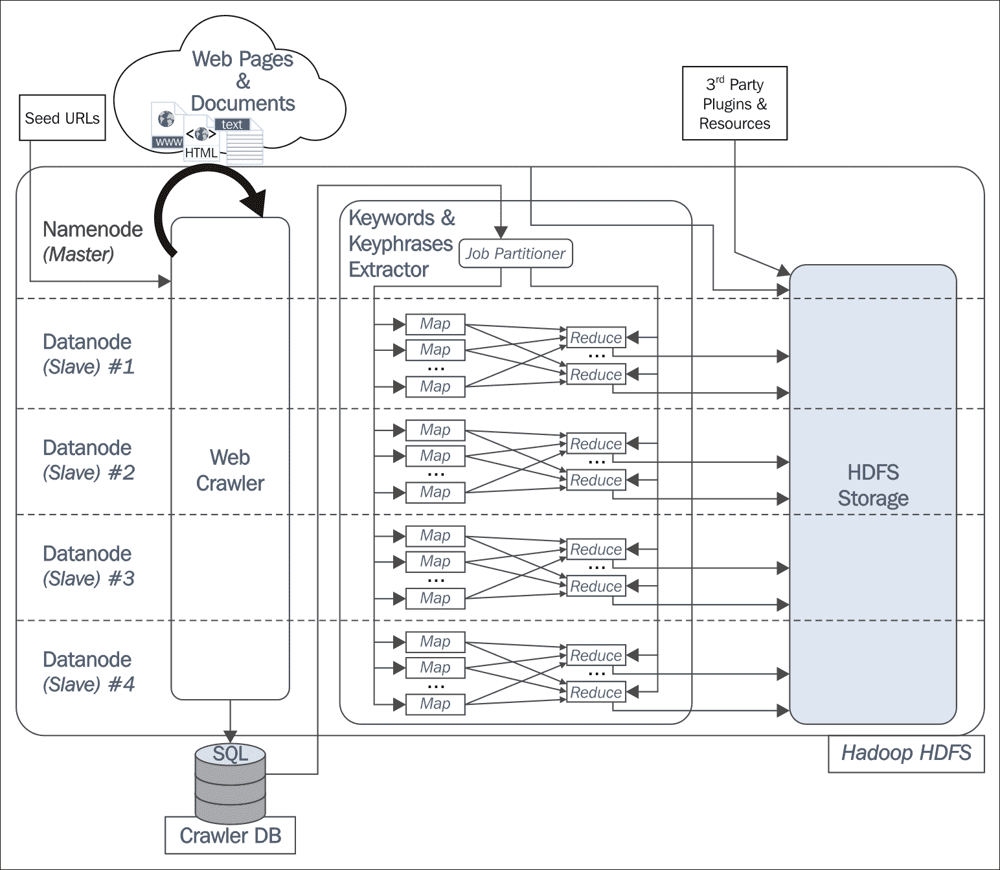

# 七、使用 Hadoop 的其他深度学习操作

|   | *“在拓荒者时代，他们用牛来拉重物，当一头牛拉不动一根木头时，他们不会试图长出更大的牛。我们不应该尝试更大的计算机，而应该尝试更多的计算机系统。”* |   |
|   | - *格蕾丝·赫柏* |

到目前为止，在本书中，我们讨论了各种深度神经网络模型及其概念、应用以及分布式环境中模型的实现。我们还解释了为什么集中式计算机很难使用这些模型存储和处理大量数据并提取信息。Hadoop 已经被用来克服大规模数据带来的限制。

由于我们现在已经到了本书的最后一章，我们将主要讨论三个最常用的机器学习应用程序的设计。我们将使用 Hadoop 框架解释大规模视频处理、大规模图像处理和自然语言处理的一般概念。

本章的组织如下:

*   基于 Hadoop 的大规模分布式视频处理
*   基于 Hadoop 的大规模图像处理
*   使用 Hadoop 的自然语言处理

数字世界中大量可用的视频在最近几天生成的大数据中占据了很大份额。在[第二章](2.html "Chapter 2.  Distributed Deep Learning for Large-Scale Data")*大规模数据分布式深度学习*中，我们讨论了数百万视频是如何上传到 YouTube、脸书等各种社交媒体网站的。除此之外，出于安全目的安装在各种商场、机场或政府机构的监控摄像头每天都会生成大量视频。由于这些视频的巨大存储消耗，它们大多数通常存储为压缩视频文件。在这些企业中，大部分都是安全摄像头全天运行，后期存储重要视频，以备日后调查。

这些视频包含隐藏的“热点数据”或信息，需要快速处理和提取。因此，处理和分析这些大规模视频的需求已经成为数据爱好者的首要任务之一。此外，在许多不同的研究领域，如生物医学工程、地质学和教育研究，需要处理这些大规模的视频，并使它们在不同的位置可供详细分析。

在本节中，我们将研究使用 Hadoop 框架处理大规模视频数据集。大规模视频处理的主要挑战是将视频从压缩格式转码为非压缩格式。为此，我们需要一个分布式视频转码器，将视频写入 **Hadoop 分布式文件系统** ( **HDFS** )中，并行解码比特流组块，生成序列文件。

当在 HDFS 处理一个输入数据块时，每个映射器进程分别访问每个拆分中的行。然而，在大规模视频数据集的情况下，当它被分割成多个预定义大小的块时，每个映射器进程应该分别解释比特流的块。然后，映射器过程将提供对解码视频帧的访问，用于后续分析。在下面的小节中，我们将讨论如何将包含视频比特流的 HDFS 的每个块转码为图像集，以进行进一步分析。

# Hadoop 中的分布式视频解码

大多数流行的视频压缩格式，如 MPEG-2 和 MPEG-4，在比特流中遵循分层结构。在本小节中，我们将假设所使用的压缩格式的比特流具有分层结构。为简单起见，我们将解码任务分为两个不同的地图缩减作业:

1.  **Extraction of video sequence level information**: From the outset, it can be easily predicted that the header information of all the video dataset can be found in the first block of the dataset. In this phase, the aim of the map-reduce job is to collect the sequence level information from the first block of the video dataset and output the result as a text file in the HDFS. The sequence header information is needed to set the format for the decoder object.

    对于视频文件，新的`FileInputFormat`应该用它自己的记录阅读器来实现。然后，每个记录阅读器将以这种格式向每个地图进程提供一对:`<LongWritable, BytesWritable>`。输入键表示文件中的字节偏移量；对应于`BytesWritable`的值是包含整个数据块的视频比特流的字节数组。

    对于每个映射过程，键值与`0`进行比较，以识别它是否是视频文件的第一个块。一旦第一块被识别，比特流被解析以确定序列级别信息。然后，这些信息被转储到一个`.txt`文件中，写入 HDFS。让我们将`.txt`文件的名称表示为`input_filename_sequence_level_header_information.txt`。由于只有 map 过程可以为我们提供所需的输出，因此该方法的 reducer count 被设置为`0`。

    ### 注

    假设一个包含以下数据的文本文件:**深度学习** **配合 Hadoop** 现在第一行的偏移量为`0`，Hadoop 作业的输入为`<0,Deep Learning>`，第二行的偏移量为`<14,with Hadoop>`。每当我们将文本文件传递给 Hadoop 作业时，它都会在内部计算字节偏移量。

2.  **Decode and convert the blocks of videos into sequence files**: The aim of this Map-reduce job is to decode  each block  of the video datasets and generate a corresponding sequence file. The sequence file will contain the decoded video frames of each block of data in JPEG format. The `InputFileFormat` file and record reader should be kept same as the first Map-reduce job. Therefore, the `<key, value>` pairs of the mapper input is `<LongWritable, BytesWritable>`.

    

    图 7.1:使用 Hadoop 进行视频解码的整体表示

    *   在第二阶段，第一个作业的输出被视为第二个地图缩减作业的输入。因此，该作业的每个映射器将读取 HDFS 中的序列信息文件，并将该信息与作为`BytesWritable`输入的比特流缓冲区一起传递。
    *   映射过程基本上将解码后的视频帧转换为 JPEG 图像，并生成一个`<key, value>`对作为映射过程的输出。地图处理输出的键将输入的视频文件名和块号编码为`video_filename_block_number`。与该键对应的输出值是`BytesWritable`，它存储解码视频块的 JPEG 比特流。
    *   然后，缩减器会将数据块作为输入，并将解码后的帧简单地写入包含 JPEG 图像的序列文件，作为进一步处理的输出格式。整个过程的简单格式和概述见*图 7.1* 。出于说明目的，我们拍摄了一段输入视频`sample.m2v`。此外，在本章中，我们将讨论如何用 HDFS 处理大规模图像文件(来自序列文件)。

    ### 注

    映射器输入`<key,value>`:`<LongWritable, BytesWritable>`

    例如:`<17308965, BytesWritable>` 从映射器输出`<key,value>`:`<Text, BytesWritable>` 例如:`<sample.m2v_3, BytesWritable>`

# 利用 Hadoop 进行大规模图像处理

我们在前面的章节中已经提到了图像的大小和体积是如何日益增大的；对于集中式计算机来说，存储和处理这些海量图像的需求是很困难的。让我们考虑一个例子来获得这种情况的实际想法。让我们拍一张 81025 像素乘 86273 像素的大规模图像。每个像素由三个值组成:红色、绿色和蓝色。考虑一下，要存储这些值，需要一个 32 位精度浮点数。因此，该图像的总内存消耗可以计算如下:

*86273 * 8125 * 3 * 32 位元= 78.12 GB*

抛开对这张图像的任何后期处理不谈，因为可以清楚地得出结论，传统计算机甚至不可能将这么多数据存储在其主存储器中。尽管一些先进的计算机配置更高，但考虑到投资回报，大多数公司不会选择这些计算机，因为它们太贵，无法购买和维护。因此，正确的解决方案应该是在商品硬件中运行图像，以便图像可以存储在它们的内存中。在本节中，我们将解释如何使用 Hadoop 以分布式方式处理这些海量图像。

## 地图缩减作业的应用

在本节中，我们将讨论如何使用 Hadoop 的地图缩减作业来处理大型图像文件。在作业开始之前，所有要处理的输入图像都被加载到 HDFS。在操作过程中，客户端发送一个作业请求，该请求通过名称节点。名称节点从客户端收集该请求，搜索其元数据映射，然后将文件系统的数据块信息以及数据块的位置发送回客户端。一旦客户端获得数据块的元数据，它就会自动访问所请求的数据块所在的数据节点，然后通过适用的命令处理这些数据。

用于大规模图像处理的地图缩减作业主要负责控制整个任务。基本上，这里我们解释了可执行 shell 脚本文件的概念，它负责从 HDFS 收集可执行文件的输入数据。

使用 Map-reduce 编程模型的最佳方式是设计我们自己的 Hadoop 数据类型，用于直接处理大量图像文件。该系统将使用 Hadoop Streaming 技术，帮助用户创建和运行特殊类型的地图缩减作业。这些特殊类型的作业可以通过前面提到的可执行文件来执行，该文件将充当映射器或缩减器。程序的映射器实现将使用 shell 脚本来执行必要的操作。shell 脚本负责调用图像处理的可执行文件。图像文件列表被作为这些可执行文件的输入，用于进一步处理。这种处理或输出的结果随后被写回到 HDFS。

因此，输入图像文件应该首先写入 HDFS，然后在 Hadoop Streaming 输入的特定目录中生成一个文件列表。该目录将存储文件列表的集合。文件列表的每一行都将包含要处理的图像文件的 HDFS 地址。映射器的输入将是`Inputsplit`类，这是一个文本文件。shell 脚本管理器逐行读取文件，并从元数据中检索图像。然后，它调用图像处理可执行文件来进一步处理图像，然后将结果写回 HDFS。因此，映射器的输出是最终期望的结果。因此，映射器完成所有工作，从 HDFS 检索图像文件，进行图像处理，然后将其写回 HDFS。该过程中的减压器数量可以设置为零。

这是一个如何利用 Hadoop 通过二值图像处理方法处理大量图像的简单设计。也可以部署其他复杂的图像处理方法来处理大规模图像数据集。

# 使用 Hadoop 的自然语言处理

网络中信息的指数级增长增加了大规模非结构化自然语言文本资源的扩散强度。因此，在过去的几年里，人们对提取、处理和共享这些信息的兴趣大大增加了。在规定的时间框架内处理这些知识来源已被证明是各种研究和商业行业的一项重大挑战。在本节中，我们将描述使用 Hadoop 以分布式方式抓取网络文档、发现信息和运行自然语言处理的过程。

要设计**自然语言处理** ( **NLP** )的架构，首先要执行的任务是从大规模非结构化数据中提取带注释的关键词和关键短语。为了在分布式体系结构上执行自然语言处理，可以选择 Apache Hadoop 框架，因为它具有高效和可扩展的解决方案，并且还可以提高故障处理和数据完整性。大规模的网络爬虫可以设置为从网络中提取所有非结构化数据，并将其写入 Hadoop 分布式文件系统中进行进一步处理。为了执行特定的自然语言处理任务，我们可以使用开源的 GATE 应用程序，如论文[136]所示。*图 7.2* 中显示了分布式自然语言处理架构的初步设计概述。

为了分配网络爬虫的工作，可以使用 map-reduce 并在多个节点上运行。NLP 任务的执行以及最终输出的写入都是通过 Map-reduce 来执行的。整个体系结构将依赖于两个输入文件:I)为抓取存储在`seed_urls.txt`中的特定网页而给出的`seedurls`和 ii)NLP 应用程序的路径位置(例如安装 GATE 的位置)。网络爬虫将从`.txt`文件中获取`seedurls`，并为那些并行的文件运行爬虫。异步地，一个提取插件在被抓取的网页上搜索关键词和关键短语，并与被抓取的网页一起独立执行。最后一步，一个专门的程序根据需要将提取的关键词和关键短语存储在外部的 SQL 数据库或 NoSQL 数据库中，如`Elasticsearch`。架构中提到的所有这些模块将在以下小节中描述。

## 网络爬虫

为了解释这个阶段，我们不会深入解释，因为它几乎超出了本书的范围。网络爬行有几个不同的阶段。第一个阶段是 URL 发现阶段，该过程将每个种子 URL 作为`seed_urls.txt`文件的输入，并在分页 URL 中导航以发现相关 URL。这个阶段定义了将在下一阶段获取的一组 URL。

下一个阶段是获取网址的页面内容并保存在磁盘中。该操作是逐段完成的，其中每个段将包含一些预定义数量的网址。该操作将在不同的`DataNodes`上并行运行。这些阶段的最终结果存储在 Hadoop 分布式文件系统中。关键字提取器将在下一阶段处理这些保存的页面内容。

图 7.2:自然语言处理如何在 Hadoop 中执行的表示，将在下一阶段获取。下一个阶段是获取网址的页面内容并保存在磁盘中。操作是分段进行的，每个分段将包含一些预定义数量的网址。该操作将在不同的数据节点上并行运行。这些阶段的最终结果存储在 Hadoop 分布式文件系统中。关键字提取器将在下一阶段处理这些保存的页面内容。

## 用于自然语言处理的关键词和模块的提取

对于每个网址的页面内容，创建一个**文档对象模型** ( **DOM** )并存储回 HDFS。在 *DOM* 中，文档有一个像树一样的逻辑结构。使用 DOM，可以编写`xpath`在自然语言处理阶段收集所需的关键词和短语。在本模块中，我们将为下一阶段执行自然语言处理应用程序定义 Map-reduce 作业。定义为`<key, value>`对键的映射函数是网址，值是该网址对应的 DOM。 *reduce* 功能将执行自然语言处理部分的配置和执行。在网络域级别对提取的关键词和短语的后续估计将在`reduce`方法中执行。为此，我们可以编写一个自定义插件来生成规则文件，以执行各种字符串操作，从提取的文本中过滤掉有噪声的、不需要的单词。规则文件可以是 JSON 文件，也可以是基于用例的任何其他易于加载和解释的文件。优选地，共同的名词和形容词被识别为来自文本的共同关键词。

## 对页面相关关键词的估计

论文[136]提出了一个非常重要的公式来从网络文档中找到相关的关键词和关键短语。他们提供了**术语频率-反向文档频率** ( **TF-IDF** )度量来估计整个语料库的相关信息，该语料库由属于单个网络域的所有文档和页面组成。计算 *TD-IDF* 的值，并为其分配一个丢弃其他关键词的阈值，可以让我们从语料库中生成最相关的单词。换句话说，它丢弃了在文本中可能出现频率较高，但通常不具备任何有意义信息的常见冠词和连词。 *TF-IDF* 指标基本上是两个函数的乘积， *TF* 和 *IDF* 。

*TF* 提供语料库中每个词的出现频率，即一个词在语料库中出现的次数。而 *IDF* 表现为一个平衡项，表示在整个语料库中具有较低频率的项的较高值。

数学上，包含在文档 *D* 中的文档 *d* 中的关键词或关键短语 *i* 的度量 *TF-IDF* 由以下等式给出:

*(TF-IDF)【I】= TF【I】。IDF 【我】*

此处TF【I】= f【I】/n【d】和*【IDF】【I】= log n【d】*

这里*fIT3】是文档 *d* 中候选关键词或关键短语 *i* 的出现频率，ndT11】是文档 *d* 中术语的总数。在 *IDF* 中， *N D* 表示语料库中存在的文档总数 *D* ，而 *N i* 表示关键词或关键短语 *i* 存在的文档数。*

基于用例，应该为 *TF-IDF* 定义一个通用的阈值频率。对于关键字或关键短语 *i* 如果 *TF-IDF* 的值变得高于阈值，则该关键字或关键短语作为最终结果被接受，并直接写入 HDFS。另一方面，如果相应的值小于阈值，则从最终集合中删除该关键字。这样，最后，所有想要的关键词都会被写到 HDFS。

# 总结

本章讨论了机器学习最广泛使用的应用，以及如何在 Hadoop 框架中设计它们。首先，我们从一个大型视频集开始，展示了如何在 HDFS 解码视频，然后将其转换为包含图像的序列文件，以供后续处理。本章接下来讨论大规模图像处理。用于此目的的映射器有一个执行所有必要任务的 shell 脚本。因此，不需要减速器来执行该操作。最后，我们讨论了如何在 Hadoop 中部署自然语言处理模型。