# 二、启动和运行 Hadoop

*既然我们已经探讨了大规模数据处理带来的机遇和挑战，以及为什么 Hadoop 是一个令人信服的选择，是时候让它建立并运行起来了。*

在本章中，我们将执行以下操作：

*   了解如何在本地 Ubuntu 主机上安装和运行 Hadoop
*   运行一些示例 Hadoop 程序并熟悉系统
*   设置使用 EMR 等 Amazon Web 服务产品所需的帐户
*   在 Elastic MapReduce 上创建按需 Hadoop 集群
*   了解本地 Hadoop 群集和托管 Hadoop 群集之间的主要区别

# 本地 Ubuntu 主机上的 Hadoop

为了在云之外探索 Hadoop，我们将使用一个或多个 Ubuntu 主机进行示例。 一台机器(无论是物理计算机还是虚拟机)就足以运行 Hadoop 的所有部分并探索 MapReduce。 然而，生产集群很可能会涉及更多的机器，因此即使在多台主机上部署一个开发 Hadoop 集群也会是一种不错的体验。 但是，对于入门来说，一台主机就足够了。

我们讨论的任何东西都不是 Ubuntu 独有的，Hadoop 应该可以在任何 Linux 发行版上运行。 显然，如果您使用的不是 Ubuntu 发行版，那么您可能必须改变环境的配置方式，但差别应该很小。

## 其他操作系统

Hadoop 确实可以在其他平台上很好地运行。 Windows 和 MacOSX 是开发人员的热门选择。 Windows 仅支持作为开发平台，而 Mac OS X 则完全不受正式支持。

如果您选择使用这样的平台，一般情况将类似于其他 Linux 发行版；如何在两个平台上使用 Hadoop 的所有方面都是相同的，但是您需要使用特定于操作系统的机制来设置环境变量和类似的任务。 Hadoop 常见问题包含一些关于替代平台的信息，如果您正在考虑这样的方法，应该是您的第一站。 Hadoop 常见问题解答可以在[http://wiki.apache.org/hadoop/FAQ](http://wiki.apache.org/hadoop/FAQ)上找到。

# 行动时间-检查先决条件

Hadoop 是用 Java 编写的，因此您需要在 Ubuntu 主机上安装最新的**Java 开发工具包**(**JDK**)。 执行以下步骤以检查前提条件：

1.  首先，打开终端并键入以下命令，查看已有的内容：

    ```scala
    $ javac
    $ java -version

    ```

2.  如果这两个命令中的任何一个出现`no such file or directory`或类似的错误，或者如果后者提到“Open JDK”，那么您很可能需要下载完整的 JDK。 请从[http://www.oracle.com/technetwork/java/javase/downloads/index.html](http://www.oracle.com/technetwork/java/javase/downloads/index.html)的 Oracle 下载页面获取此文档；您应该可以获得最新版本。
3.  安装 Java 后，将`JDK/bin`目录添加到您的 PATH 中，并使用以下命令设置`JAVA_HOME`环境变量，这些命令针对您的特定 Java 版本进行了修改：

    ```scala
    $ export JAVA_HOME=/opt/jdk1.6.0_24
    $ export PATH=$JAVA_HOME/bin:${PATH}

    ```

## *刚刚发生了什么？*

这些步骤确保安装了正确版本的 Java，并且可以从命令行使用，而不必使用冗长的路径名来引用安装位置。

请记住，上述命令仅影响当前运行的 shell，在您注销、关闭 shell 或重新引导后，设置将丢失。 为了确保相同的设置始终可用，您可以将这些文件添加到您选择的 Shell 的启动文件中，例如，在 Bash Shell 的`.bash_profile`文件或 TCSH 的`.cshrc`文件中。

我喜欢的另一种方法是将所有必需的配置设置放入一个独立文件中，然后从命令行显式调用；例如：

```scala
$ source Hadoop_config.sh

```

这项技术允许您将多个安装文件放在同一个帐户中，而不会使 Shell 启动过于复杂；更不用说，几个应用所需的配置实际上可能不兼容。 只要记住在每次会话开始时加载文件就可以了！

## 设置 Hadoop

对于新手来说，Hadoop 最令人困惑的方面之一是它的各种组件、项目、子项目以及它们之间的相互关系。 事实是，这些都是随着时间的推移而演变的，这并没有让理解这一切的任务变得更容易。 不过，现在转到[http://hadoop.apache.org](http://hadoop.apache.org)，您会看到上面提到了三个重要的项目：

*   常见的 / 共同的 / 普通的 / 通常的
*   HDFS
*   MapReduce

从[第 1 章](01.html "Chapter 1. What It's All About")，*中的解释应该对后两个问题很熟悉*，公共项目包括一组帮助 Hadoop 产品在现实世界中工作的库和工具。 就目前而言，重要的是标准 Hadoop 发行版捆绑了所有这三个项目的最新版本，而这三个项目的组合正是您需要开始使用的。

### 版本说明

Hadoop 在从 0.19 到 0.20 版本的过渡中经历了重大变化，最引人注目的是迁移到一组用于开发 MapReduce 应用的新 API。 我们将在本书中主要使用新的 API，尽管我们在后面的章节中确实包括了一些旧的 API 的例子，因为并不是所有现有的功能都已经移植到新的 API 中。

当 0.20 分支被重命名为 1.0 时，Hadoop 版本控制也变得复杂起来。 0.22 和 0.23 分支仍然存在，实际上包含了 1.0 分支中没有包含的特性。 在撰写本文时，随着 1.1 和 2.0 分支被用于未来的开发版本，事情变得更加清晰。 由于大多数现有系统和第三方工具都是针对 0.20 分支构建的，因此我们将使用 Hadoop1.0 作为本书中的示例。

# 行动时间-下载 Hadoop

执行以下步骤下载 Hadoop：

1.  访问 Hadoop 下载页面[http://hadoop.apache.org/common/releases.html](http://hadoop.apache.org/common/releases.html)，检索 1.0.x 分支的最新稳定版本；在撰写本文时，版本是 1.0.4。
2.  系统将要求您选择一个本地镜像；之后，您需要下载名称为`hadoop-1.0.4``-bin.tar.gz`的文件。
3.  使用以下命令将此文件复制到您希望安装 Hadoop 的目录(例如，`/usr/local`)：

    ```scala
    $ cp Hadoop-1.0.4.bin.tar.gz /usr/local

    ```

4.  使用以下命令解压缩文件：

    ```scala
    $ tar –xf hadoop-1.0.4-bin.tar.gz

    ```

5.  向 Hadoop 安装目录添加一个方便的符号链接。

    ```scala
    $ ln -s /usr/local/hadoop-1.0.4 /opt/hadoop

    ```

6.  现在，您需要将 Hadoop 二进制目录添加到您的 PATH 中，并设置`HADOOP_HOME`环境变量，就像我们之前对 Java 所做的那样。

    ```scala
    $ export HADOOP_HOME=/usr/local/Hadoop
    $ export PATH=$HADOOP_HOME/bin:$PATH

    ```

7.  进入 Hadoop 安装中的`conf`目录并编辑`Hadoop-env.sh`文件。 搜索`JAVA_HOME`并取消该行的注释，将位置修改为指向您的 JDK 安装，如前所述。

## *刚刚发生了什么？*

这些步骤确保了 Hadoop 已安装并且可以从命令行使用。 通过设置 PATH 和配置变量，我们可以使用 Hadoop 命令行工具。 修改 Hadoop 配置文件是与主机设置集成所需的唯一设置更改。

如前所述，您应该将导出命令放入 shell 启动文件或在会话开始时指定的独立配置脚本中。

不要担心这里的一些细节；我们将在稍后介绍 Hadoop 的设置和使用。

# 操作时间-设置 SSH

执行以下步骤设置 SSH：

1.  使用以下命令创建新的 OpenSSL 密钥对：

    ```scala
    $ ssh-keygen
    Generating public/private rsa key pair.
    Enter file in which to save the key (/home/hadoop/.ssh/id_rsa): 
    Created directory '/home/hadoop/.ssh'.
    Enter passphrase (empty for no passphrase): 
    Enter same passphrase again: 
    Your identification has been saved in /home/hadoop/.ssh/id_rsa.
    Your public key has been saved in /home/hadoop/.ssh/id_rsa.pub.
    …

    ```

2.  使用以下命令将新公钥复制到授权密钥列表中：

    ```scala
    $ cp .ssh/id _rsa.pub  .ssh/authorized_keys 

    ```

3.  将连接到本地主机。

    ```scala
    $ ssh localhost
    The authenticity of host 'localhost (127.0.0.1)' can't be established.
    RSA key fingerprint is b6:0c:bd:57:32:b6:66:7c:33:7b:62:92:61:fd:ca:2a.
    Are you sure you want to continue connecting (yes/no)? yes
    Warning: Permanently added 'localhost' (RSA) to the list of known hosts.

    ```

4.  确认无密码 SSH 工作正常。

    ```scala
    $ ssh localhost
    $ ssh localhost

    ```

## *刚刚发生了什么？*

因为 Hadoop 需要在一台或多台机器上的多个进程之间进行通信，所以我们需要确保我们用于 Hadoop 的用户可以连接到每个所需的主机，而不需要密码。 我们通过创建具有空密码的**安全外壳**(**SSH**)密钥对来实现这一点。 我们使用`ssh-keygen`命令启动此过程并接受提供的默认值。

创建密钥对后，我们需要将新的公钥添加到存储的可信密钥列表中；这意味着当尝试连接到这台计算机时，公钥将是可信的。 这样做之后，我们使用`ssh`命令连接到本地计算机，应该会收到一条有关信任主机证书的警告，如图所示。 确认这一点后，我们应该能够在没有进一步密码或提示的情况下进行连接。

### 备注

请注意，当我们稍后使用完全分布式集群时，我们需要确保 Hadoop 用户帐户在集群中的每台主机上都设置了相同的密钥。

## 配置和运行 Hadoop

到目前为止，这个都非常简单，只需要下载和系统管理。 现在我们可以直接处理 Hadoop 了。 终于来了！ 我们将运行一个快速示例来展示 Hadoop 的运行情况。 还需要执行其他配置和设置，但下一步将有助于确保到目前为止安装和配置正确。

# 行动时间-使用 Hadoop 计算 PI

现在，我们将使用一个示例 Hadoop 程序来计算 PI 的值。 目前，这主要是为了验证安装，并展示执行 MapReduce 作业有多快。 假设`HADOOP_HOME/bin`目录位于您的路径中，请键入以下命令：

```scala
$ Hadoop jar hadoop/hadoop-examples-1.0.4.jar  pi 4 1000
Number of Maps  = 4
Samples per Map = 1000
Wrote input for Map #0
Wrote input for Map #1
Wrote input for Map #2
Wrote input for Map #3
Starting Job
12/10/26 22:56:11 INFO jvm.JvmMetrics: Initializing JVM Metrics with processName=JobTracker, sessionId=
12/10/26 22:56:11 INFO mapred.FileInputFormat: Total input paths to process : 4
12/10/26 22:56:12 INFO mapred.JobClient: Running job: job_local_0001
12/10/26 22:56:12 INFO mapred.FileInputFormat: Total input paths to process : 4
12/10/26 22:56:12 INFO mapred.MapTask: numReduceTasks: 1
…
12/10/26 22:56:14 INFO mapred.JobClient:  map 100% reduce 100%
12/10/26 22:56:14 INFO mapred.JobClient: Job complete: job_local_0001
12/10/26 22:56:14 INFO mapred.JobClient: Counters: 13
12/10/26 22:56:14 INFO mapred.JobClient:   FileSystemCounters
…
Job Finished in 2.904 seconds
Estimated value of Pi is 3.14000000000000000000
$

```

## *刚刚发生了什么？*

这里有很多信息；当您在屏幕上获得完整输出时更是如此。 现在，让我们解开基础知识，在本书后面部分之前不要担心 Hadoop 的状态输出。 首先要澄清的是一些术语；每个 Hadoop 程序都作为一个作业运行，该作业创建多个任务来完成其工作。

查看输出，我们可以看到它大致分为三个部分：

*   这项工作的开始
*   作业执行时的状态
*   作业的输出

在我们的示例中，我们可以看到作业创建了四个任务来计算 PI，而整个作业结果将是这些子结果的组合。 这个模式听起来应该与我们在[第 1 章](01.html "Chapter 1. What It's All About")，*中遇到的*相似；该模型用于将较大的作业拆分成较小的部分，然后将结果组合在一起。

大部分输出将在作业执行时显示，并提供显示进度的状态消息。 成功完成后，作业将打印出许多计数器和其他统计数据。 前面的示例实际上是不寻常的，因为很少在控制台上看到 MapReduce 作业的结果。 这不是 Hadoop 的限制，而是因为处理大型数据集的作业通常会产生大量的输出数据，而这些数据不太适合在屏幕上进行简单的回显。

祝贺您首次成功执行 MapReduce 作业！

## 三种模式

为了让在 Hadoop 上运行，我们回避了一个重要问题：我们应该在哪种模式下运行 Hadoop？ 有三种可能会改变各种 Hadoop 组件的执行位置。 回想一下，HDFS 由单个 NameNode 组成，该 NameNode 充当集群协调器，并且是存储数据的一个或多个 DataNode 的主节点。 对于 MapReduce，JobTracker 是集群主机，它协调一个或多个 TaskTracker 进程执行的工作。 Hadoop 模式按如下方式部署这些组件：

*   **本地独立模式**：如果与前面的PI 示例一样，不配置任何其他内容，则这是默认模式。 在这种模式下，Hadoop 的所有组件(如 NameNode、DataNode、JobTracker 和 TaskTracker)都在单个 Java 进程中运行。
*   **伪分布式模式**：在此模式下，将为每个 Hadoop 组件生成一个单独的 JVM，它们通过网络套接字进行通信，从而有效地在单个主机上提供一个功能齐全的微集群。
*   **完全分布式模式**：在这种模式下，Hadoop 分布在台机器上，其中一些机器是通用工作者，另一些机器则是组件的专用主机，比如 NameNode 和 JobTracker。

每种模式都有其优点和缺点。 完全分布式模式显然是唯一可以跨机器集群扩展 Hadoop 的模式，但它需要更多的配置工作，更不用说机器集群了。 本地或独立模式最容易设置，但您与其交互的方式与完全分布式模式不同。 在本书中，我们通常更喜欢伪分布式模式，即使在单个主机上使用示例时也是如此，因为伪分布式模式中完成的所有操作几乎与它在更大的集群上的工作方式相同。

# 操作时间-配置伪分布式模式

看看Hadoop 发行版中的`conf`目录。 有很多配置文件，但我们需要修改的是`core-site.xml`、`hdfs-site.xml`和`mapred-site.xml`。

1.  将`core-site.xml`修改为如下代码：

    ```scala
    <?xml version="1.0"?>
    <?xml-stylesheet type="text/xsl" href="configuration.xsl"?>

    <!-- Put site-specific property overrides in this file. -->

    <configuration>
    <property>
    <name>fs.default.name</name>
    <value>hdfs://localhost:9000</value>
    </property>
    </configuration>
    ```

2.  将`hdfs-site.xml`修改为如下代码：

    ```scala
    <?xml version="1.0"?>
    <?xml-stylesheet type="text/xsl" href="configuration.xsl"?>

    <!-- Put site-specific property overrides in this file. -->

    <configuration>
    <property>
    <name>dfs.replication</name>
    <value>1</value>
    </property>
    </configuration>
    ```

3.  将`mapred-site.xml`修改为，如以下代码所示：

    ```scala
    <?xml version="1.0"?>
    <?xml-stylesheet type="text/xsl" href="configuration.xsl"?>

    <!-- Put site-specific property overrides in this file. -->

    <configuration>
    <property>
    <name>mapred.job.tracker</name>
    <value>localhost:9001</value>
    </property>
    </configuration>
    ```

## *刚刚发生了什么？*

首先要注意的是这些配置文件的一般格式。 它们显然是 XML，并且在单个配置元素中包含多个属性规范。

属性规范始终包含 name 和 value 元素，并且可能包含前面代码中未显示的可选注释。

我们在这里设置了三个配置变量：

*   变量`dfs.default.name`保存 NameNode 的位置，HDFS 和 MapReduce 组件都需要它，这解释了为什么它在`core-site.xml`而不是`hdfs-site.xml`中。
*   变量`dfs.replication`指定每个 HDFS 块应该复制多少次。 回想一下[第 1 章](01.html "Chapter 1. What It's All About")，*的全部内容，HDFS 通过确保将每个文件系统数据块复制到多个不同的主机(通常是 3 个)来处理故障。由于我们在伪分布式模式下只有一个主机和一个 DataNode，因此我们将此值更改为`1`。*
**   变量`mapred.job.tracker`保存 JobTracker 的位置，就像`dfs.default.name`保存 NameNode 的位置一样。 因为只有 MapReduce 组件需要知道这个位置，所以它在`mapred-site.xml`中。*

 *### 备注

当然，您可以自由更改所使用的端口号，尽管 9000 和 9001 是 Hadoop 中的常见约定。

NameNode 和 JobTracker 的网络地址指定实际系统请求应该定向到的端口。 这些都不是面向用户的位置，所以不用费心把你的网络浏览器指向它们。 我们很快就会看到一些 Web 界面。

## 配置基本目录并格式化文件系统

如果选择伪分布式或完全分布式模式，则在启动第一个 Hadoop 集群之前，需要执行两个步骤。

1.  设置存储 Hadoop 文件的基本目录。
2.  格式化 HDFS 文件系统。

### 备注

准确地说，我们不需要更改默认目录；但是，正如后面看到的，现在考虑一下是一件好事。

# 执行操作的时间-更改基本 HDFS 目录

让我们首先设置基本目录，该目录指定 Hadoop 将在其下保存所有数据的本地文件系统上的位置。 执行以下步骤：

1.  创建 Hadoop 将在其中存储其数据的目录：

    ```scala
    $ mkdir /var/lib/hadoop

    ```

2.  确保该目录可由任何用户写入：

    ```scala
    $ chmod 777 /var/lib/hadoop

    ```

3.  再次修改`core-site.xml`以添加以下属性：

    ```scala
    <property>
    <name>hadoop.tmp.dir</name>
    <value>/var/lib/hadoop</value>
    </property>
    ```

## *刚刚发生了什么？*

由于我们将在 Hadoop 中存储数据，并且所有各种组件都在本地主机上运行，因此这些数据需要存储在本地文件系统的某个位置。 无论采用哪种模式，Hadoop 默认使用`hadoop.tmp.dir`属性作为写入所有文件和数据的基目录。

例如，MapReduce 使用此基本目录下的`/mapred`目录；HDFS 使用`/dfs`。 危险在于，`hadoop.tmp.dir`的默认值是`/tmp`，一些 Linux 发行版在每次重新启动时都会删除`/tmp`的内容。 因此，显式声明将数据保存在何处更为安全。

# 操作时间-格式化 NameNode

在首次以伪分布式或完全分布式模式启动Hadoop之前，我们需要格式化它将使用的 HDFS 文件系统。 键入以下内容：

```scala
$  hadoop namenode -format

```

此命令的输出应如下所示：

```scala
$ hadoop namenode -format
12/10/26 22:45:25 INFO namenode.NameNode: STARTUP_MSG: 
/************************************************************
STARTUP_MSG: Starting NameNode
STARTUP_MSG:   host = vm193/10.0.0.193
STARTUP_MSG:   args = [-format]
…
12/10/26 22:45:25 INFO namenode.FSNamesystem: fsOwner=hadoop,hadoop
12/10/26 22:45:25 INFO namenode.FSNamesystem: supergroup=supergroup
12/10/26 22:45:25 INFO namenode.FSNamesystem: isPermissionEnabled=true
12/10/26 22:45:25 INFO common.Storage: Image file of size 96 saved in 0 seconds.
12/10/26 22:45:25 INFO common.Storage: Storage directory /var/lib/hadoop-hadoop/dfs/name has been successfully formatted.
12/10/26 22:45:26 INFO namenode.NameNode: SHUTDOWN_MSG: 
/************************************************************
SHUTDOWN_MSG: Shutting down NameNode at vm193/10.0.0.193
$ 

```

## *刚刚发生了什么？*

这不是一个非常令人兴奋的输出，因为该步骤只是为我们将来使用 HDFS 提供支持。 但是，它确实帮助我们将 HDFS 看作一个文件系统；就像任何操作系统上的任何新存储设备一样，我们需要格式化设备才能使用它。 HDFS 也是如此；最初，文件系统数据有一个默认位置，但没有对应的文件系统索引的实际数据。

### 备注

每次都这么做！

如果您使用 Hadoop 的经历与我类似，那么在设置新安装时会经常犯一系列简单的错误。 很容易忘记 NameNode 的格式化，然后在尝试第一个 Hadoop 活动时收到一系列失败消息。

但是只做一次！

格式化 NameNode 的命令可以执行多次，但这样做将销毁所有现有的文件系统数据。 它只能在 Hadoop 集群关闭时执行，有时您会想要这样做，但在大多数其他情况下，它是不可撤销地删除 HDFS 上的每一条数据的快捷方法；在大型集群上需要的时间要长得多。 所以要小心！

## 启动和使用 Hadoop

在完成所有配置和设置之后，现在让我们启动我们的集群，并实际对其执行一些操作。

# 启动 Hadoop 行动的时间到了

与Hadoop 的本地模式不同，在本地模式下，所有组件仅在提交的作业的生命周期内运行，而在 Hadoop 的伪分布式或完全分布式模式下，集群组件作为长时间运行的进程存在。 在使用 HDFS 或 MapReduce 之前，我们需要启动所需的组件。 键入以下命令；输出应如下所示，其中命令包含在以`$`为前缀的行中：

1.  键入第一个命令：

    ```scala
    $ start-dfs.sh
    starting namenode, logging to /home/hadoop/hadoop/bin/../logs/hadoop-hadoop-namenode-vm193.out
    localhost: starting datanode, logging to /home/hadoop/hadoop/bin/../logs/hadoop-hadoop-datanode-vm193.out
    localhost: starting secondarynamenode, logging to /home/hadoop/hadoop/bin/../logs/hadoop-hadoop-secondarynamenode-vm193.out

    ```

2.  键入第二个命令：

    ```scala
    $ jps
    9550 DataNode
    9687 Jps
    9638 SecondaryNameNode
    9471 NameNode

    ```

3.  键入第三个命令：

    ```scala
    $ hadoop dfs -ls /
    Found 2 items
    drwxr-xr-x   - hadoop supergroup          0 2012-10-26 23:03 /tmp
    drwxr-xr-x   - hadoop supergroup          0 2012-10-26 23:06 /user

    ```

4.  键入第四个命令：

    ```scala
    $ start-mapred.sh 
    starting jobtracker, logging to /home/hadoop/hadoop/bin/../logs/hadoop-hadoop-jobtracker-vm193.out
    localhost: starting tasktracker, logging to /home/hadoop/hadoop/bin/../logs/hadoop-hadoop-tasktracker-vm193.out

    ```

5.  键入第五个命令：

    ```scala
    $ jps
    9550 DataNode
    9877 TaskTracker
    9638 SecondaryNameNode
    9471 NameNode
    9798 JobTracker
    9913 Jps

    ```

## *刚刚发生了什么？*

顾名思义，`start-dfs.sh`命令启动 HDFS 所需的组件。 这是用于管理文件系统的 NameNode 和用于保存数据的单个 DataNode。 Second daryNameNode 是一个可用性辅助工具，我们将在后面的章节中讨论。

在启动这些组件之后，我们使用 JDK 的`jps`实用程序来查看哪些 Java 进程正在运行，如果输出看起来不错，那么我们就可以使用 Hadoop 的`dfs`实用程序来列出 HDFS 文件系统的根目录。

在此之后，我们使用`start-mapred.sh`启动 MapReduce 组件-这次是 JobTracker 和单个 TaskTracker-然后再次使用`jps`验证结果。

还有一个组合的`start-all.sh`文件，我们将在稍后阶段使用它，但在早期，执行两个阶段的启动会更容易地验证集群配置，这是很有用的。

# 行动时间-使用 HDFS

如前面的示例所示，HDFS 有一个看起来很熟悉的界面，它允许我们使用与 Unix 中的命令类似的命令来操作文件系统上的文件和目录。 让我们通过键入以下命令来试用一下：

键入以下命令：

```scala
$ hadoop -mkdir /user
$ hadoop -mkdir /user/hadoop
$ hadoop fs -ls /user
Found 1 items
drwxr-xr-x   - hadoop supergroup          0 2012-10-26 23:09 /user/Hadoop
$ echo "This is a test." >> test.txt
$ cat test.txt
This is a test.
$ hadoop dfs -copyFromLocal test.txt  .
$ hadoop dfs -ls
Found 1 items
-rw-r--r--   1 hadoop supergroup         16 2012-10-26 23:19/user/hadoop/test.txt
$ hadoop dfs -cat test.txt
This is a test.
$ rm test.txt 
$ hadoop dfs -cat test.txt
This is a test.
$ hadoop fs -copyToLocal test.txt
$ cat test.txt
This is a test.

```

## *刚刚发生了什么？*

本例显示了 Hadoop 实用程序的`fs`子命令的用法。 请注意，`dfs`和`fs`命令都是等效的)。 与大多数文件系统一样，Hadoop 为每个用户提供了主目录的概念。 这些主目录存储在 HDFS 上的`/user`目录下，如果主目录尚不存在，则在进一步操作之前先创建它。

然后，我们在本地文件系统上创建一个简单的文本文件，并使用`copyFromLocal`命令将其复制到 HDFS，然后使用`-ls`和`-cat`实用程序检查其存在和内容。 可以看到，用户主目录别名为`.`，因为在 Unix 中，假定未指定路径的`-ls`命令引用该位置，而相对路径(不是以`/`开头)将从该位置开始。

然后，我们从本地文件系统中删除该文件，使用`-copyToLocal`命令将其从 HDFS 复制回来，并使用本地`cat`实用程序检查其内容。

### 备注

如上例所示，混合使用 HDFS 和本地文件系统命令是一种强大的组合，可以非常容易地在用于本地文件系统的 HDFS 命令上执行，反之亦然。 所以要小心，特别是在删除的时候。

还有其他 HDFS 操作命令；有关详细列表，请尝试`Hadoop fs -help`。

# 行动字数时间到了，MapReduce 的 Hello World

随着时间的推移，许多应用()都获得了一个规范的示例，这是任何初学者指南都不应该缺少的。 对于 Hadoop，这是 wordcount-与 Hadoop 捆绑在一起的一个示例，用于统计输入文本文件中的单词频率。

1.  首先执行以下命令：

    ```scala
    $ hadoop dfs -mkdir data
    $ hadoop dfs -cp test.txt data
    $ hadoop dfs -ls data
    Found 1 items
    -rw-r--r--   1 hadoop supergroup         16 2012-10-26 23:20 /user/hadoop/data/test.txt

    ```

2.  现在执行以下命令：

    ```scala
    $ Hadoop Hadoop/hadoop-examples-1.0.4.jar  wordcount data out
    12/10/26 23:22:49 INFO input.FileInputFormat: Total input paths to process : 1
    12/10/26 23:22:50 INFO mapred.JobClient: Running job: job_201210262315_0002
    12/10/26 23:22:51 INFO mapred.JobClient:  map 0% reduce 0%
    12/10/26 23:23:03 INFO mapred.JobClient:  map 100% reduce 0%
    12/10/26 23:23:15 INFO mapred.JobClient:  map 100% reduce 100%
    12/10/26 23:23:17 INFO mapred.JobClient: Job complete: job_201210262315_0002
    12/10/26 23:23:17 INFO mapred.JobClient: Counters: 17
    12/10/26 23:23:17 INFO mapred.JobClient:   Job Counters 
    12/10/26 23:23:17 INFO mapred.JobClient:     Launched reduce tasks=1
    12/10/26 23:23:17 INFO mapred.JobClient:     Launched map tasks=1
    12/10/26 23:23:17 INFO mapred.JobClient:     Data-local map tasks=1
    12/10/26 23:23:17 INFO mapred.JobClient:   FileSystemCounters
    12/10/26 23:23:17 INFO mapred.JobClient:     FILE_BYTES_READ=46
    12/10/26 23:23:17 INFO mapred.JobClient:     HDFS_BYTES_READ=16
    12/10/26 23:23:17 INFO mapred.JobClient:     FILE_BYTES_WRITTEN=124
    12/10/26 23:23:17 INFO mapred.JobClient:     HDFS_BYTES_WRITTEN=24
    12/10/26 23:23:17 INFO mapred.JobClient:   Map-Reduce Framework
    12/10/26 23:23:17 INFO mapred.JobClient:     Reduce input groups=4
    12/10/26 23:23:17 INFO mapred.JobClient:     Combine output records=4
    12/10/26 23:23:17 INFO mapred.JobClient:     Map input records=1
    12/10/26 23:23:17 INFO mapred.JobClient:     Reduce shuffle bytes=46
    12/10/26 23:23:17 INFO mapred.JobClient:     Reduce output records=4
    12/10/26 23:23:17 INFO mapred.JobClient:     Spilled Records=8
    12/10/26 23:23:17 INFO mapred.JobClient:     Map output bytes=32
    12/10/26 23:23:17 INFO mapred.JobClient:     Combine input records=4
    12/10/26 23:23:17 INFO mapred.JobClient:     Map output records=4
    12/10/26 23:23:17 INFO mapred.JobClient:     Reduce input records=4

    ```

3.  执行以下命令：

    ```scala
    $ hadoop fs -ls out
    Found 2 items
    drwxr-xr-x   - hadoop supergroup          0 2012-10-26 23:22 /user/hadoop/out/_logs
    -rw-r--r--   1 hadoop supergroup         24 2012-10-26 23:23 /user/hadoop/out/part-r-00000

    ```

4.  现在执行此命令：

    ```scala
    $ hadoop fs -cat out/part-0-00000
    This  1
    a  1
    is  1
    test.  1

    ```

## *刚刚发生了什么？*

我们在这里做了三件事，具体如下：

*   已将先前创建的文本文件移动到 HDFS 上的新目录中
*   运行示例 WordCount 作业，将此新目录和不存在的输出目录指定为参数
*   使用`fs`实用程序检查 MapReduce 作业的输出

正如我们前面所说的，伪分布式模式有更多的 Java 进程，因此作业输出比独立 PI 短得多似乎很奇怪。 原因是本地独立模式将有关每个单独任务执行的信息打印到屏幕上，而在其他模式中，此信息仅写入正在运行的主机上的日志文件。

输出目录是由 Hadoop 自己创建的，实际的结果文件遵循这里所示的 part-*nnnnn*约定；尽管给出了我们的设置，但只有一个结果文件。 我们使用`fs -cat`命令检查该文件，结果与预期一致。

### 备注

如果将现有目录指定为 Hadoop 作业的输出源，则该作业将无法运行，并将抛出异常，抱怨已存在的目录。 如果希望 Hadoop 将输出存储到某个目录，则该目录不能存在。 将其视为一种安全机制，可以阻止 Hadoop 重写以前有价值的作业运行以及您经常忘记确定的内容。 如果您有信心，您可以重写此行为，我们稍后将看到这一点。

PI 和 Wordcount 程序只是 Hadoop 附带的一些示例。 下面是如何获取所有这些内容的列表。 看看你能不能弄清楚其中的一些。

```scala
$ hadoop jar hadoop/hadoop-examples-1.0.4.jar 

```

## 在更大的正文上做个围棋英雄字数

运行像 Hadoop 这样复杂的框架，使用5 个离散的 Java 进程来计算单行文本文件中的单词并不令人印象深刻。 强大的功能来自这样一个事实，即我们可以使用完全相同的程序对更大的文件，甚至是分布在多节点 Hadoop 集群中的海量文本语料库运行 WordCount。 如果我们有这样的设置，我们将通过运行程序并简单地指定源和输出数据的目录位置来执行与刚才完全相同的命令。

找到一个大型在线文本文件-[http://www.gutenberg.org](http://www.gutenberg.org)处的 Project Gutenberg是一个很好的起点-并通过将其复制到 HDFS 并执行 wordcount 示例来对其运行 wordcount。 输出可能与您预期的不同，因为在大量文本中，需要解决脏数据、标点符号和格式化问题。 考虑如何改进字数统计；我们将在下一章研究如何将其扩展为更复杂的处理链。

## 从浏览器监控 Hadoop

到目前为止，我们一直依赖命令行工具和直接命令输出来查看我们的系统在做什么。 Hadoop 提供了两个您应该熟悉的 Web 界面，一个用于 HDFS，另一个用于 MapReduce。 这两个工具在伪分布式模式下都很有用，并且在完全分布式安装时都是关键工具。

### HDFS Web 用户界面

将您的Web 浏览器指向运行 Hadoop 的主机上的端口 50030。 默认情况下，本地主机和任何其他可以访问网络的计算机都应该可以使用 Web 接口。 以下是示例屏幕截图：

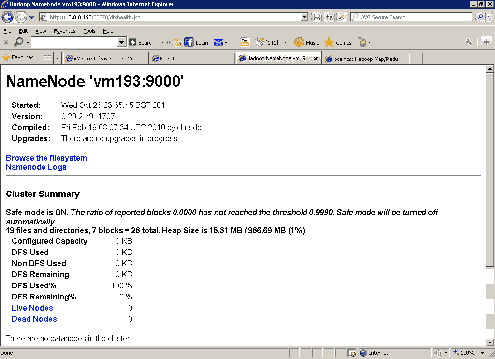

这里发生了很多事情，但紧随其后的关键数据告诉我们集群中的节点数、文件系统大小、已用空间和链接，以便深入了解更多信息，甚至浏览文件系统。

花点时间操作这个界面；它需要熟悉。 对于多节点群集，有关活动节点和死节点的信息以及有关其状态历史的详细信息对于调试群集问题至关重要。

#### MapReduce Web 用户界面

默认情况下，JobTracker UI在端口 50070 上可用，并且适用前面所述的相同访问规则。 以下是示例屏幕截图：


这比 HDFS 接口更复杂！ 除了活节点数/死节点数的类似计数外，还有自启动以来执行的作业数的历史记录及其单个任务计数的细目。

正在执行的作业和历史作业列表是获取更多信息的入口；对于每个作业，我们可以访问每个节点上的每个任务尝试的历史记录，并访问日志以获取详细信息。 现在，我们将介绍使用任何分布式系统时最痛苦的部分之一：调试。 这可能真的很难。

假设您有一个由 100 台机器组成的集群，试图处理一个海量数据集，其中完整的作业需要每台主机执行数百个 map 和 Reduce 任务。 如果作业开始运行非常慢或明显失败，问题所在并不总是显而易见。 查看 MapReduce web 用户界面可能是第一站，因为它为调查运行和历史作业的健康状况提供了丰富的起点。

# 使用弹性 MapReduce

我们现在将转向云中的Hadoop，这是 Amazon Web Services 提供的 Elastic MapReduce 服务。 访问 EMR 的方式有多种，但现在我们将重点放在提供的 Web 控制台上，将 Hadoop 的完整点击式方法与前面的命令行驱动示例进行对比。

## 在 Amazon Web Services 中设置帐户

在使用 Elastic MapReduce 之前，我们需要设置一个 Amazon Web Services 帐户，并将其注册到必要的服务。

### 创建 AWS 帐户

Amazon已将其普通帐户与 AWS 集成，这意味着如果您已经拥有任何 Amazon 零售网站的帐户，则这是您使用 AWS 服务所需的唯一帐户。

请注意，AWS 服务是有费用的；您需要一张与可以收费的账户相关联的活动信用卡。

如果您需要一个新的亚马逊帐户，请转到[http://aws.amazon.com](http://aws.amazon.com)，选择**创建一个新的亚马逊帐户**，然后按照提示操作。 Amazon 为一些服务添加了免费级别，因此您可能会发现，在测试和探索的早期阶段，您的许多活动都是在免费级别内进行的。 免费级别的范围一直在扩大，所以要确保你知道什么会收费，什么不会收费。

### 注册必要的服务

一旦您拥有Amazon 帐户，您将需要注册该帐户以使用所需的 AWS 服务，即**Simple Storage Service**(**S3**)、**Elastic Compute Cloud**(**EC2**)和**Elastic MapReduce**(**EMR**)。 只需注册任何 AWS 服务即可免费使用；该流程只需将该服务提供给您的帐户即可。

转到从[http://aws.amazon.com](http://aws.amazon.com)链接的 S3、EC2 和 EMR 页面，单击每页上的**Sign Up**按钮；然后按照提示操作。

### 备注

小心！ 这可真花了不少钱啊！

在进一步了解之前，请务必了解使用 AWS 服务将会产生与您的 Amazon 帐户关联的信用卡上显示的费用。 大多数费用都很低，并且会随着基础设施使用量的增加而增加；在 S3 中存储 10 GB 数据的成本是 1 GB 的 10 倍，运行 20 个 EC2 实例的成本是单个 EC2 实例的 20 倍。 由于存在分层成本模型，因此实际成本往往在较高的水平上有较小的边际增长。 但在使用任何一项服务之前，您都应该仔细阅读每项服务的定价部分。 另请注意，目前从 AWS 服务(如 EC2 和 S3)传出的数据是收费的，但服务之间的数据传输是不收费的。 这意味着，仔细设计 AWS 的使用，通过尽可能多的数据处理将数据保留在 AWS 中通常是最具成本效益的。

# 使用管理控制台对电子病历进行操作字数统计的时间

让我们使用提供的一些示例代码直接跳到关于 EMR 的示例。 执行以下步骤：

1.  Browse to [http://aws.amazon.com](http://aws.amazon.com), go to **Developers** | **AWS Management Console**, and then click on the **Sign in to the AWS Console** button. The default view should look like the following screenshot. If it does not, click on **Amazon S3** from within the console.

    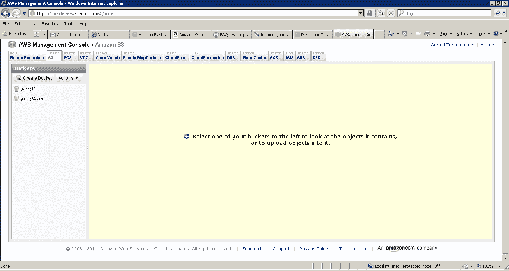

2.  如前面的屏幕截图所示，单击**创建存储桶**按钮，然后输入新存储桶的名称。 存储桶名称在所有 AWS 用户中必须是全局唯一的，因此不要期望`mybucket`或`s3test`等明显的存储桶名称可用。
3.  Click on the **Region** drop-down menu and select the geographic area nearest to you.

    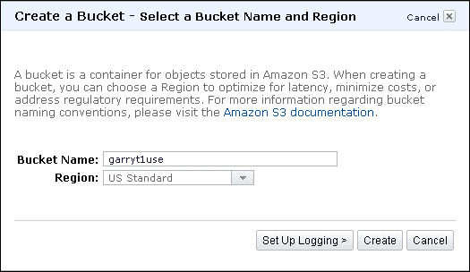

4.  Click on the **Elastic MapReduce** link and click on the **Create a new Job Flow** button. You should see a screen like the following screenshot:

    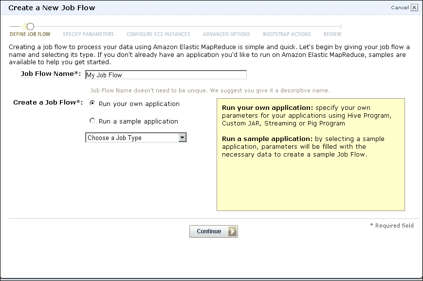

5.  You should now see a screen like the preceding screenshot. Select the **Run a sample application** radio button and the **Word Count (Streaming)** menu item from the sample application drop-down box and click on the **Continue** button.

    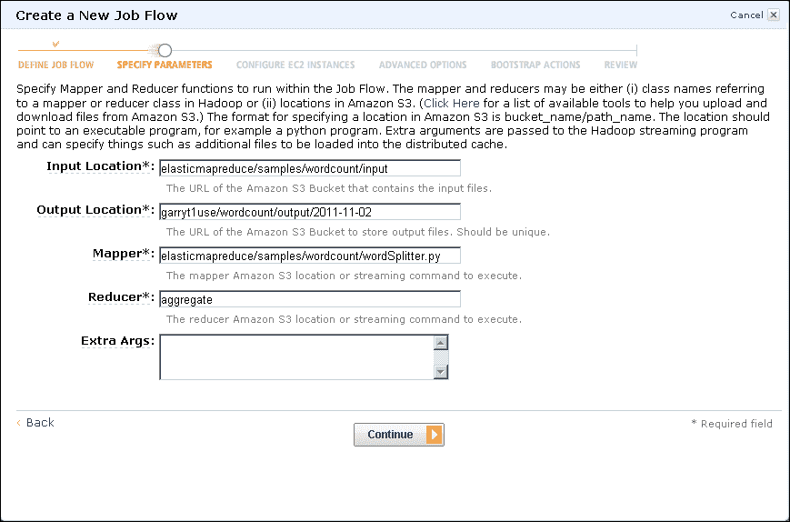

6.  The next screen, shown in the preceding screenshot, allows us to specify the location of the output produced by running the job. In the edit box for the output location, enter the name of the bucket created in step 1 (`garryt1use` is the bucket we are using here); then click on the **Continue** button.

    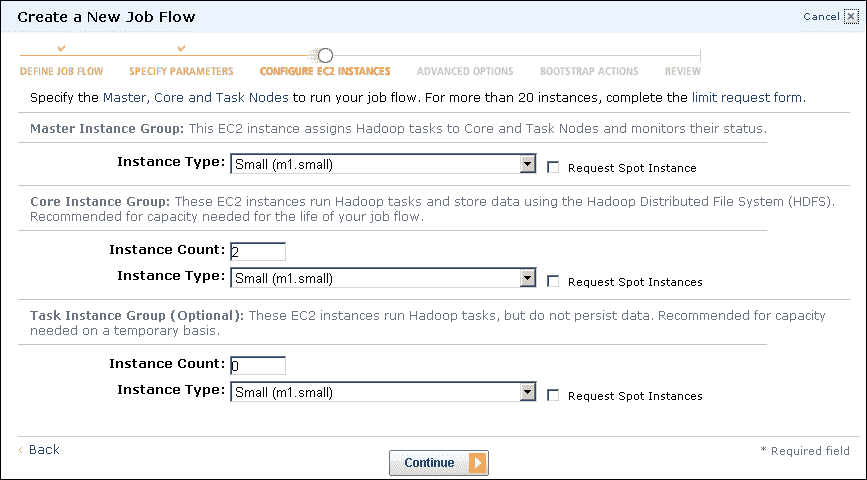

7.  The next screenshot shows the page where we can modify the number and size of the virtual hosts utilized by our job. Confirm that the instance type for each combo box is **Small (m1.small)**, and the number of nodes for the Core group is **2** and for the Task group it is **0**. Then click on the **Continue** button.

    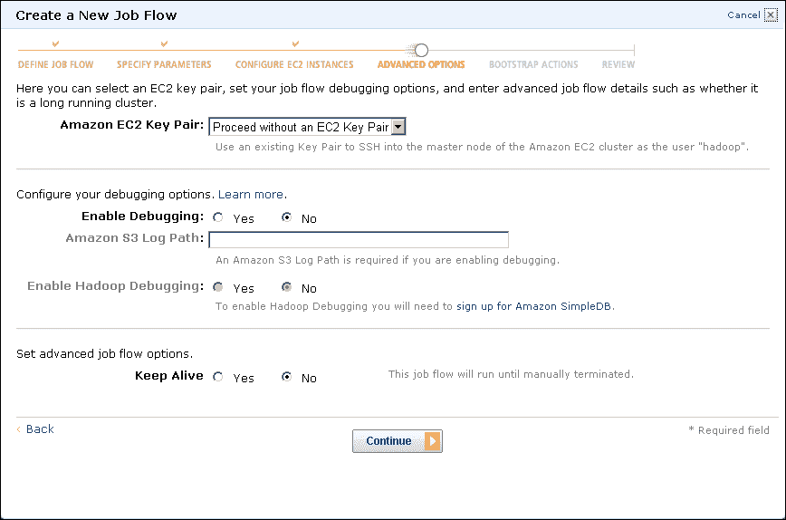

8.  This next screenshot involves options we will not be using in this example. For the **Amazon EC2 key pair** field, select the **Proceed without key pair** menu item and click on the **No** radio button for the **Enable Debugging** field. Ensure that the **Keep Alive** radio button is set to **No** and click on the **Continue** button.

    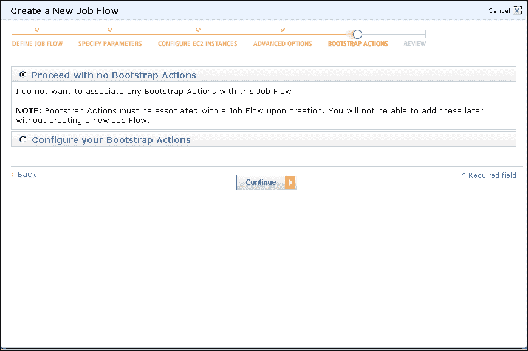

9.  The next screen, shown in the preceding screenshot, is one we will not be doing much with right now. Confirm that the **Proceed with no Bootstrap Actions** radio button is selected and click on the **Continue** button.

    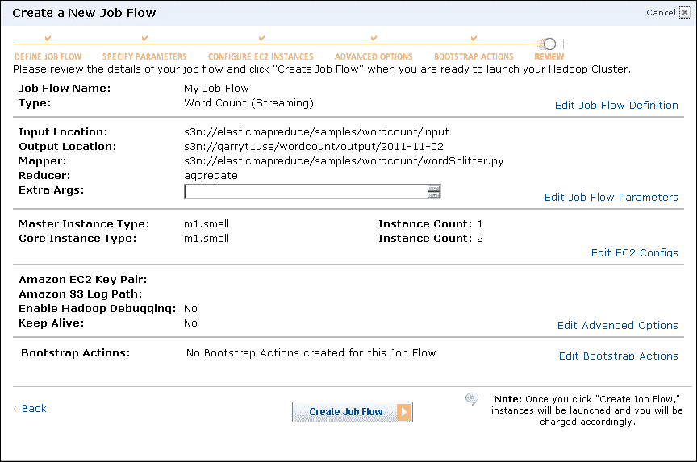

10.  Confirm the job flow specifications are as expected and click on the **Create Job Flow** button. Then click on the **View my Job Flows** and **check status** buttons. This will give a list of your job flows; you can filter to show only running or completed jobs. The default is to show all, as in the example shown in the following screenshot:

    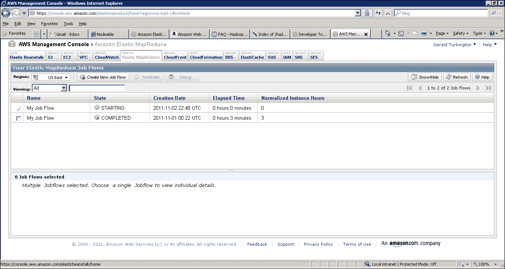

11.  Occasionally hit the **Refresh** button until the status of the listed job, **Running** or **Starting**, changes to **Complete**; then click its checkbox to see details of the job flow, as shown in the following screenshot:

    

12.  Click the **S3** tab and select the bucket you created for the output location. You will see it has a single entry called **wordcount**, which is a directory. Right-click on that and select **Open**. Then do the same until you see a list of actual files following the familiar Hadoop part-*nnnnn* naming scheme, as shown in the following screenshot:

    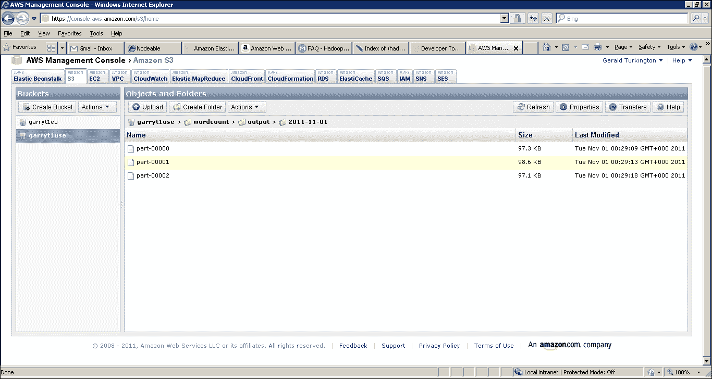

    右键单击**Part-00000**并打开它。 它应该看起来像这样：

    ```scala
    a              14716
    aa             52
    aakar          3
    aargau         3
    abad           3
    abandoned      46
    abandonment    6
    abate          9
    abauj          3
    abbassid       4
    abbes          3
    abbl           3
    …
    ```

    这种类型的输出看起来熟悉吗？

## *刚刚发生了什么？*

第一步是处理 S3，而不是 EMR。 S3 是一种可伸缩的存储服务，允许您将文件(称为对象)存储在称为存储桶的容器中，并通过存储桶和对象键(即名称)访问对象。 该模型类似于文件系统的使用，尽管存在潜在的差异，但在本书中它们不太可能是重要的。

S3 是放置想要在 EMR 中处理的 MapReduce 程序和源数据的地方，也是存储 EMR Hadoop 作业的输出和日志的地方。 有太多第三方工具可以访问 S3，但这里我们使用的是 AWS 管理控制台，这是大多数 AWS 服务的浏览器界面。

虽然我们建议您为 S3 选择最近的地理区域，但这不是必需的；非美国位置通常会为距离他们较近的客户提供更好的延迟，但它们的成本也往往略高。 在考虑所有这些因素之后，您需要决定在哪里托管数据和应用。

在创建 S3 存储桶之后，我们移动到 EMR 控制台并创建了一个新的作业流。 此术语在电子病历中用于指代数据处理任务。 正如我们将看到的，这可以是一次性交易，其中底层 Hadoop 集群是按需创建和销毁的，也可以是在其上执行多个作业的长期运行的集群。

我们保留了默认的作业流名称，然后选择使用示例应用，在本例中是 wordcount 的 Python 实现。 术语 Hadoop Streaming 指的是一种允许使用脚本语言编写映射和减少任务的机制，但其功能与我们之前使用的 Java 字数相同。

指定作业流的表单需要源数据、程序、映射和还原类的位置，以及输出数据的所需位置。 对于我们刚才看到的示例，大多数字段都是预先填充的；可以看到，与从命令行运行本地 Hadoop 时所需的内容有明显的相似之处。

通过不选择**Keep Alive**选项，我们选择了专门为执行此作业而创建的 Hadoop 集群，然后销毁该集群。 这样的群集将具有更长的启动时间，但会将成本降至最低。 如果您选择保持作业流处于活动状态，您将看到额外的作业执行得更快，因为您不必等待集群启动。 但是，在您显式终止作业流之前，您将被收取底层 EC2 资源的费用。

确认之后，我们不需要添加任何额外的引导选项；我们选择了要部署到 Hadoop 集群中的主机数量和类型。 EMR 区分三个不同的主机组：

*   **主组**：这是托管 NameNode 和 JobTracker 的控制节点。 这些只有 1 个。
*   **核心组**：这些节点同时运行 HDFS DataNodes 和 MapReduce TaskTracker。 主机数量是可配置的。
*   **任务组**：这些主机不保存 HDFS 数据，但运行 TaskTracker，可以提供更强的处理能力。 主机数量是可配置的。

主机类型指的是不同级别的硬件功能，详细信息可以在 EC2 页面上找到。 较大的主机功能更强大，但成本更高。 目前，默认情况下，一个作业流中的主机总数必须在 20 个或更少，尽管亚马逊有一个简单的表单来请求更高的限制。

确认后，一切正常-我们启动作业流并在控制台上监视它，直到状态更改为**已完成**。 此时，我们返回 S3，查看我们指定为输出目的地的存储桶内部，并检查我们的 wordcount 作业的输出，它看起来应该与本地 Hadoop wordcount 的输出非常相似。

一个显而易见的问题是，源数据从何而来？ 这是我们在创建过程中看到的作业流规范中预先填充的字段之一。 对于非持久性作业流，最常见的模型是从指定的 S3 源位置读取源数据，并将结果数据写入指定的结果 S3 存储桶。

就是这样！ AWS 管理控制台允许从浏览器对 S3 和 EMR 等服务进行细粒度控制。 只需一个浏览器和一张信用卡，我们就可以启动 Hadoop 作业来处理数据，而不必担心安装、运行或管理 Hadoop 的任何技术问题。

## 来个围棋英雄--其他电子病历示例应用

EMR 提供了其他几个示例应用。 为什么不试一试呢？

## 电子病历的其他使用方式

尽管 AWS 管理控制台是一款功能强大且令人印象深刻的工具，但它并不总是我们想要访问 S3 和运行 EMR 作业的方式。 与所有 AWS 服务一样，可以使用编程工具和命令行工具来使用这些服务。

### AWS 凭据

但是，在使用编程工具或命令行工具之前，我们需要了解帐户持有人如何验证 AWS 发出此类请求。 由於这些都是收费的服务，我们真的不希望别人代我们提出要求。 请注意，由于我们在前面的示例中使用我们的 AWS 帐户直接登录到 AWS 管理控制台，因此我们不必担心这一点。

每个 AWS 帐户都有几个在访问各种服务时使用的标识符：

*   **帐户 ID**：每个AWS 帐户都有一个数字 ID。
*   **访问密钥**：每个帐户都有一个关联的访问密钥，用于标识发出请求的帐户。
*   **秘密访问密钥**：访问密钥的伙伴是秘密访问密钥。 访问密钥不是秘密，可以在服务请求中公开，但是秘密访问密钥是您用来验证自己是否为帐户所有者的密钥。
*   **密钥对**：这些是用于登录 EC2 主机的密钥对。 可以在 EC2 内生成公钥/私钥对，也可以将外部生成的密钥导入系统。

如果这听起来令人困惑，那是因为事实的确如此。 至少一开始是这样。 然而，在使用工具访问 AWS 服务时，通常只需先将正确的凭据添加到已配置的文件中，然后一切就可以正常工作了。 但是，如果您确实决定探索编程工具或命令行工具，那么花点时间阅读每个服务的文档以了解其安全性是如何工作的，这将是值得的。

### 电子病历命令行工具

在本书中，我们不会对 S3 和 EMR 执行任何无法从 AWS 管理控制台执行的操作。 但是，在处理运营工作负载、希望集成到其他工作流中或自动化服务访问时，基于浏览器的工具无论功能有多强大，都不合适。 使用服务的直接编程接口提供了最精细的控制，但需要最大的努力。

Amazon 为许多服务提供了一组命令行工具，这些工具提供了自动访问 AWS 服务的有用方式，从而最大限度地减少了所需的开发量。 如果您想要一个更基于 CLI 的 EMR 界面，但还不想编写定制代码，那么从 EMR 主页链接的 Elastic MapReduce 命令行工具值得一看。

## AWS 生态系统

每个AWS 服务还拥有过多的第三方工具、服务和库，这些工具、服务和库可以提供不同的服务访问方式、提供其他功能或提供新的实用程序。 请查看位于[http://aws.amazon.com/developertools](http://aws.amazon.com/developertools)的开发人员工具中心，作为起点。

# 本地 Hadoop 与 EMR Hadoop 的比较

在我们第一次体验了本地 Hadoop 集群及其在 EMR 中的等价物之后，这是我们考虑两种方法差异的好时机。

很明显，关键区别并不在于功能；如果我们想要的只是一个运行 MapReduce 作业的环境，那么这两种方法都完全适合。 相反，区别特征围绕着我们在[第 1 章](01.html "Chapter 1. What It's All About")，*中提到的一个主题，即您是否更喜欢涉及前期基础设施成本和持续维护工作的成本模型，而不是维护负担更低、概念上具有无限可伸缩性的现收现付模式。 除了成本决定之外，还有几件事需要牢记：*

 **   EMR 支持特定版本的 Hadoop，并有随时间升级的策略。 如果您需要特定的版本，特别是在发布后立即需要最新最好的版本，那么在 EMR 上线之前的延迟可能是不可接受的。
*   您可以启动一个持久的 EMR 作业流，并像对待本地 Hadoop 集群一样对待它，登录到托管节点并调整它们的配置。 如果您发现自己在这么做，那么是否真的需要这种级别的控制值得一问，如果需要，是否会阻止您获得迁移到 EMR 所带来的所有成本模型好处？
*   如果这确实归结为成本考虑，请记住将本地群集的所有隐藏成本考虑在内，这些成本经常被遗忘。 考虑一下电力、空间、冷却和设施的成本。 更不用说管理开销了，如果事情在凌晨开始中断，这可能不是微不足道的。

# 摘要

我们在本章中介绍了很多关于 Hadoop 集群的启动和运行以及在其上执行 MapReduce 程序的内容。

具体地说，我们介绍了在本地 Ubuntu 主机上运行 Hadoop 的前提条件。 我们还了解了如何在独立或伪分布式模式下安装和配置本地 Hadoop 集群。 然后，我们了解了如何访问 HDFS 文件系统和提交 MapReduce 作业。 然后，我们继续学习访问 Elastic MapReduce 和其他 AWS 服务需要哪些帐户。

我们了解了如何使用 AWS 管理控制台浏览和创建 S3 存储桶和对象，以及如何创建作业流并使用它在 EMR 托管的 Hadoop 群集上执行 MapReduce 作业。 我们还讨论了访问 AWS 服务的其他方式，并研究了本地 Hadoop 和 EMR 托管 Hadoop 之间的差异。

既然我们已经了解了如何在本地或在 EMR 上运行 Hadoop，我们就可以开始编写我们自己的 MapReduce 程序了，这将是下一章的主题。**