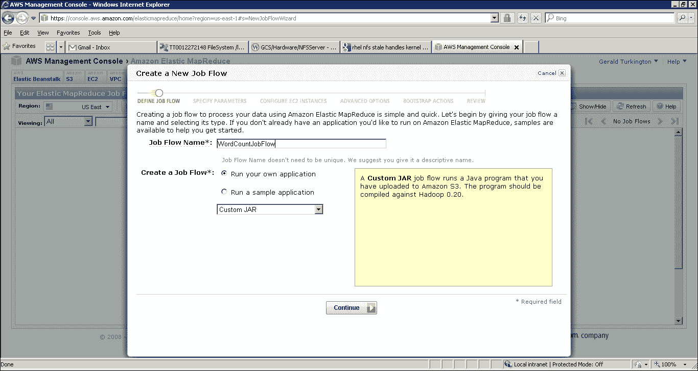
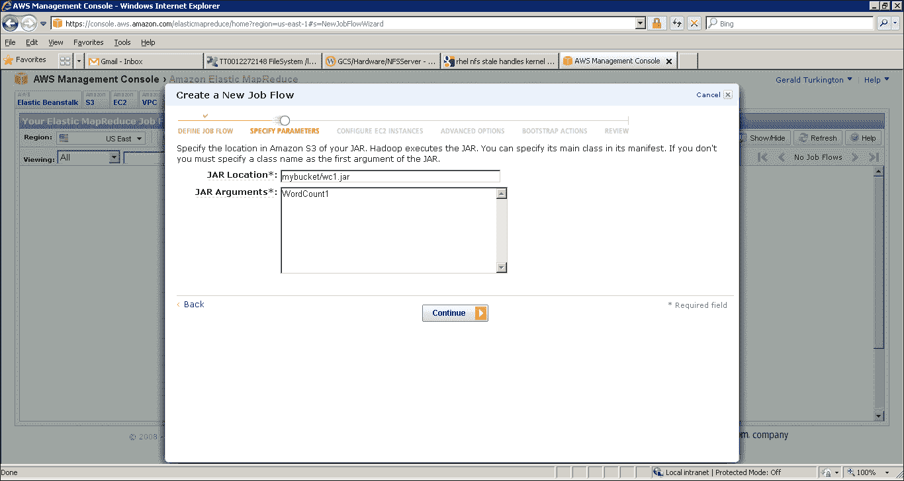
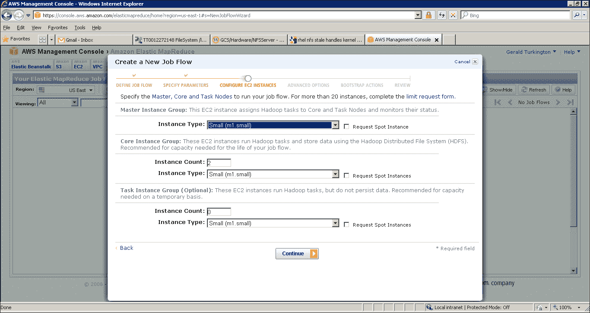

# 第三章了解 MapReduce

*前两章讨论了 Hadoop 允许我们解决的问题，并提供了一些运行示例 MapReduce 作业的实践经验。 有了这个基础，我们现在将更深入一些。*

在本章中，我们将介绍：

*   了解键/值对如何成为 Hadoop 任务的基础
*   了解 MapReduce 作业的各个阶段
*   详细检查 MAP、RECESS 和可选组合阶段的工作原理
*   查看用于 Hadoop 的 Java API，并使用它开发一些简单的 MapReduce 作业
*   了解 Hadoop 输入和输出

# 键/值对

从[第 1 章](01.html "Chapter 1. What It's All About")、*的全部内容开始，我们一直在讨论以键/值对的形式处理和提供输出的操作，但没有解释原因。 现在是解决这个问题的时候了。*

 *## 这意味着什么

首先，我们将通过强调 Java 标准库中的类似概念来阐明我们所说的键/值对是什么意思。 `java.util.Map`接口是常用类的父类，比如`HashMap`，甚至是原始的`Hashtable`类(通过一些库的向后重新设计)。

对于任何 Java`Map`对象，其内容是从指定类型的给定键到潜在不同类型的相关值的一组映射。 例如，`HashMap`对象可以包含从人名(`String`)到其生日(`Date`)的映射。

在 Hadoop 上下文中，我们指的是还包含与关联值相关的键的数据。 该数据以这样一种方式存储，即可以跨一组键对数据集中的各种值进行排序和重新排列。 如果我们使用键/值数据，那么提出如下问题将是有意义的：

*   给定键在数据集中是否有映射？
*   与给定键关联的值是什么？
*   全套钥匙是什么？

回想上一章的字数。 我们稍后将对其进行更详细的介绍，但是该程序的输出显然是一组键/值关系；对于每个单词(键)，都有其出现次数的计数(值)。 考虑这个简单的例子，键/值数据的一些重要特性将变得显而易见，如下所示：

*   键必须是唯一的，但值不必是
*   每个值都必须与一个键相关联，但是一个键可以没有值(尽管在本例中不是这样)
*   仔细定义键很重要；决定计数是否区分大小写将产生不同的结果

### 备注

请注意，我们需要仔细定义这里的键是唯一的是什么意思。 这并不意味着键只出现一次；在我们的数据集中，我们可能会看到一个键出现多次，正如我们将看到的，MapReduce 模型有一个阶段，其中与每个键相关联的所有值都被收集在一起。 键的唯一性保证了如果我们将任何给定键的每个值收集在一起，结果将是从键的单个实例到以这种方式映射的每个值的关联，并且不会遗漏任何值。

## 为什么选择键/值数据？

使用键/值数据作为 MapReduce 操作的基础，可以实现一个功能强大的编程模型，该模型具有惊人的广泛适用性，这可以从 Hadoop 和 MapReduce 在各种行业和问题场景中的采用中看出。 许多数据本质上要么是键/值，要么可以用这种方式表示。 它是一个简单的模型，具有广泛的适用性和足够直接的语义，根据它定义的程序可以由 Hadoop 这样的框架应用。

当然，数据模型本身并不是使 Hadoop 变得有用的唯一因素；它的真正威力在于它如何使用并行执行技术，并在[第 1 章](01.html "Chapter 1. What It's All About")、*中讨论了它到底是什么*。 我们可以拥有大量的主机，在这些主机上我们可以存储和执行数据，甚至可以使用一个框架来管理将较大的任务划分为较小的块，以及将部分结果组合成整体答案。 但是我们需要这个框架来为我们提供一种表达问题的方式，而不需要我们成为执行机制方面的专家；我们希望表达数据所需的转换，然后让框架来完成其余的工作。 MapReduce 及其键/值接口提供了这样一个抽象级别，程序员只需指定这些转换，Hadoop 就可以处理将其应用于任意大型数据集的复杂过程。

### 一些真实世界的例子

为了使不那么抽象，让我们考虑一些实际数据，它是键/值对：

*   地址簿将姓名(关键字)与联系信息(值)相关联
*   银行帐户使用帐号(密钥)与帐户详细信息(值)相关联
*   一本书的索引将一个单词(关键字)与它出现的页面(值)联系起来
*   在计算机文件系统中，文件名(键)允许访问任何类型的数据，如文本、图像和声音(值)

这些示例有意扩大范围，以帮助和鼓励您认为键/值数据不是仅在高端数据挖掘中使用的受限制的模型，而是我们周围的一个非常常见的模型。

如果这对 Hadoop 不重要，我们就不会进行这个讨论。 底线是，如果数据可以表示为键/值对，那么它就可以由 MapReduce 处理。

## MapReduce 作为一系列键/值转换

您可能已经见过中键/值转换方面描述的 MapReduce，特别是看起来像这样的令人生畏的 MapReduce：

```scala
{K1,V1} -> {K2, List<V2>} -> {K3,V3}
```

我们现在能够理解这意味着什么：

*   MapReduce 作业的`map`方法的输入是一系列键/值对，我们称之为`K1`和`V1`。
*   `map`方法的输出(因此也是`reduce`方法的输入)是一系列键和相关的值列表，称为`K2`和`V2`。 请注意，每个映射器只输出一系列单独的键/值输出；在`shuffle`方法中，这些输出组合为键和值列表。
*   MapReduce 作业的最终输出是另一系列键/值对，称为`K3`和`V3`。

这组键/值对不必不同；很可能输入(比方说)姓名和联系方式，然后输出相同的内容，可能会使用一些中间格式来整理信息。 在我们接下来探索用于 MapReduce 的 Java API 时，请记住这个三阶段模型。 我们将首先介绍您需要的 API 的主要部分，然后系统地检查 MapReduce 作业的执行情况。

## 弹出测验-键/值对

问题 1.。 键/值对的概念是…

1.  由 Hadoop 创建并特定于 Hadoop 的东西。
2.  一种表达我们经常看到但没有想到的关系的方式。
3.  来自计算机科学的学术概念。

Q2.。 用户名/密码组合是密钥/值数据的示例吗？

1.  是的，这是一个很明显的例子，一个值与另一个值相关联。
2.  不，密码更像是用户名的属性，没有索引型关系。
3.  我们通常不会这样认为，但 Hadoop 仍然可以将一系列用户名/密码组合处理为键/值对。

# Hadoop Java API for MapReduce

Hadoop 在其 0.20 版本中经历了重大的 API 更改，这是我们在本书中使用的 1.0 版本中的主要接口。 尽管之前的 API 当然是有效的，但社区觉得它在某些方面很笨拙和不必要的复杂。

新的 API(有时通常称为上下文对象)是 Java MapReduce 开发的未来，因此我们将在本书中尽可能地使用它。 请注意，注意：0.20 之前的 MapReduce 库的某些部分尚未移植到新 API，因此当我们需要检查其中任何一个时，我们将使用旧接口。

## 0.20 MapReduce Java API

以上版本的 MapReduce API的 0.20 和在`org.apache.hadoop.mapreduce`包或其子包中包含大多数关键类和接口。

在大多数情况下，MapReduce 作业的实现将提供该包中的`Mapper`和`Reducer`基类的特定于作业的子类。

### 备注

我们将坚持使用常用的`K1`/`K2`/`K3`/等术语，尽管最近 Hadoop API 在某些地方使用了`KEYIN`/`VALUEIN`和`KEYOUT`/`VALUEOUT`等术语。 目前，我们将继续使用`K1`/`K2`/`K3`，因为它有助于理解端到端数据流。

### Mapper 类

这是 Hadoop 提供的基础`Mapper`类的简化视图。 对于我们自己的映射器实现，我们将子类这个基类并覆盖指定的方法，如下所示：

```scala
class Mapper<K1, V1, K2, V2>
{
      void map(K1 key, V1 value Mapper.Context context) 
            throws IOException, InterruptedException 
{..}
}
```

尽管 Java 泛型的使用一开始可能会让这看起来有点不透明，但实际上并没有那么多事情发生。 该类是根据键/值输入和输出类型定义的，然后`map`方法在其参数中接受输入键/值对。 另一个参数是`Context`类的实例，它提供了与 Hadoop 框架通信的各种机制，其中之一是输出`map`或`reduce`方法的结果。

### 提示

请注意，`map`方法仅引用`K1`和`V1`键/值对的单个实例。 这是 MapReduce 范例的一个关键方面，在 MapReduce 范例中，您编写处理单个记录的类，框架负责将大量数据集转换为键/值对流所需的所有工作。 您永远不需要编写`map`或`reduce`类来尝试处理完整的数据集。 Hadoop 还通过其`InputFormat`和`OutputFormat`类提供了一些机制，这些机制提供了通用文件格式的实现，并且同样消除了必须为除自定义文件类型之外的任何文件类型编写文件解析器的需要。

有时可能需要重写三个附加方法。

```scala
protected void setup( Mapper.Context context) 
      throws IOException, Interrupted Exception
```

此方法在将任何键/值对呈现给`map`方法之前被调用一次。 默认实现不执行任何操作。

```scala
protected void cleanup( Mapper.Context context) 
      throws IOException, Interrupted Exception
```

此方法在所有键/值对都已呈现给`map`方法后调用一次。 默认实现不执行任何操作。

```scala
protected void run( Mapper.Context context) 
      throws IOException, Interrupted Exception
```

此方法控制 JVM 中任务处理的整体流程。 默认实现在为拆分中的每个键/值对重复调用`map`方法之前调用`setup`方法一次，然后最后调用`cleanup`方法。

### 提示

**下载示例代码**

您可以从您的帐户[http://www.packtpub.com](http://www.packtpub.com)下载购买的所有 Packt 图书的示例代码文件。 如果您在其他地方购买了本书，您可以访问[http://www.packtpub.com/support](http://www.packtpub.com/support)并注册，以便将文件通过电子邮件直接发送给您。

### Reducer 类

`Reducer`基类的工作方式与`Mapper`类非常相似，通常只需要子类覆盖单个`reduce`方法。 下面是精简的类定义：

```scala
public class Reducer<K2, V2, K3, V3>
{
void reduce(K1 key, Iterable<V2> values, 
      Reducer.Context context) 
        throws IOException, InterruptedException
{..}
}
```

同样，请注意在更广泛的数据流方面的类定义(`reduce`方法接受`K2`/`V2`作为输入，并提供`K3`/`V3`作为输出)，而实际的 Reduce 方法只接受单个键及其关联的值列表。 `Context`对象也是输出方法结果的机制。

该类还有`setup`、`run`和`cleanup`方法，它们的默认实现与相似，`Mapper`类可以选择性地覆盖：

```scala
protected void setup( Reduce.Context context) 
throws IOException, InterruptedException
```

此方法在将任何键/值列表呈现给`reduce`方法之前调用一次。 默认的实现不执行任何操作。

```scala
protected void cleanup( Reducer.Context context) 
throws IOException, InterruptedException
```

此方法在所有键/值列表都已呈现给`reduce`方法之后调用一次。 默认实现不执行任何操作。

```scala
protected void run( Reducer.Context context) 
throws IOException, InterruptedException
```

此方法控制 JVM 中处理任务的总体流程。 默认实现在为提供给`Reducer`类的所有键/值重复调用`reduce`方法之前调用`setup`方法，然后最后调用`cleanup`方法。

### 驱动程序类

尽管我们的映射器和 Reducer 实现是我们执行 MapReduce 作业所需的全部，但是还需要另外一段代码：与 Hadoop 框架通信并指定运行 MapReduce 作业所需的配置元素的驱动程序。 这涉及到一些方面，比如告诉 Hadoop 使用哪个`Mapper`和`Reducer`类、在哪里查找输入数据以及以什么格式查找输入数据、在哪里放置输出数据以及如何格式化输出数据。 还可以设置多种其他配置选项，我们将在本书中看到这些选项。

没有默认的父驱动程序类作为子类；驱动程序逻辑通常存在于为封装 MapReduce 作业而编写的类的 Main 方法中。 请看下面的代码片段作为示例驱动程序。 不要担心每一行是如何工作的，尽管您应该能够大致了解每行都在做什么：

```scala
public class ExampleDriver
{
...
public static void main(String[] args) throws Exception
{
// Create a Configuration object that is used to set other options
    Configuration conf = new Configuration() ;
// Create the object representing the job
Job job = new Job(conf, "ExampleJob") ;
// Set the name of the main class in the job jarfile
    job.setJarByClass(ExampleDriver.class) ;
// Set the mapper class
    job.setMapperClass(ExampleMapper.class) ;
// Set the reducer class
    job.setReducerClass(ExampleReducer.class) ;
// Set the types for the final output key and value
    job.setOutputKeyClass(Text.class) ; 
    job.setOutputValueClass(IntWritable.class) ; 
// Set input and output file paths
FileInputFormat.addInputPath(job, new Path(args[0])) ;
FileOutputFormat.setOutputPath(job, new Path(args[1])) 
// Execute the job and wait for it to complete
 System.exit(job.waitForCompletion(true) ? 0 : 1);
}
}}
```

考虑到我们之前讨论的作业，很多设置都涉及对`Job`对象的操作也就不足为奇了。 这包括设置作业名称和指定要用于映射器和减少器实现的类。

设置特定的输入/输出配置，最后，传递给 main 方法的参数用于指定作业的输入和输出位置。 这是你会经常看到的一种非常常见的模式。

配置选项有许多默认值，我们在前面的类中隐式使用了其中一些。 最值得注意的是，我们没有说任何关于输入文件的文件格式或如何编写输出文件的内容。 这些是通过前面提到的`InputFormat`和`OutputFormat`类定义的；我们稍后将详细探讨它们。 默认的输入和输出格式是适合我们的单词计数示例的文本文件。 除了特别优化的二进制格式之外，还有多种在文本文件中表示格式的方式。

对于不太复杂的 MapReduce 作业，一种常见的模型是将`Mapper`和`Reducer`类作为驱动程序中的内部类。 这允许将所有内容保存在单个文件中，从而简化了代码分发。

# 编写 MapReduce 程序

我们使用和谈论单词计数已经有很长一段时间了；让我们实际编写一个实现，编译并运行它，然后探索一些修改。

# 执行操作的时间-设置类路径

要编译任何与Hadoop 相关的代码，我们需要引用标准的 Hadoop 捆绑类。

将`Hadoop-1.0.4.core.jar`文件从发行版添加到 Java 类路径，如下所示：

```scala
$ export CLASSPATH=.:${HADOOP_HOME}/Hadoop-1.0.4.core.jar:${CLASSPATH}

```

## *刚刚发生了什么？*

这会将`Hadoop-1.0.4.core.jar`文件显式添加到类路径中，与当前目录和 CLASSPATH 环境变量以前的内容并列。

同样，最好将其放入您的 shell 启动文件或一个独立的源文件中。

### 备注

稍后，我们还需要在类路径上拥有许多随 Hadoop 一起提供的第三方库，实现这一点有一条捷径。 目前，显式添加核心 JAR 文件就足够了。

# 动作执行字数时间

我们已经在[第 2 章](02.html "Chapter 2. Getting Hadoop Up and Running")，*启动和运行 Hadoop*中看到了 Wordcount 示例程序的使用。 现在，我们将通过执行以下步骤来探索我们自己的 Java 实现：

1.  在`WordCount1.java`文件中输入以下代码：

    ```scala
    Import java.io.* ;
    import org.apache.hadoop.conf.Configuration ;
    import org.apache.hadoop.fs.Path;
    import org.apache.hadoop.io.IntWritable;
    import org.apache.hadoop.io.Text;
    import org.apache.hadoop.mapreduce.Job;
    import org.apache.hadoop.mapreduce.Mapper;
    import org.apache.hadoop.mapreduce.Reducer;
    import org.apache.hadoop.mapreduce.lib.input.FileInputFormat;
    import org.apache.hadoop.mapreduce.lib.output.FileOutputFormat; 

    public class WordCount1 
    {

        public static class WordCountMapper
        extends Mapper<Object, Text, Text, IntWritable>
    {

            private final static IntWritable one = new IntWritable(1);
            private Text word = new Text();

            public void map(Object key, Text value, Context context
            ) throws IOException, InterruptedException {
                String[] words = value.toString().split(" ") ;

                for (String str: words)
                {
                    word.set(str);
                    context.write(word, one);
                }
            }
        }

        public static class WordCountReducer
        extends Reducer<Text,IntWritable,Text,IntWritable> {
            public void reduce(Text key, Iterable<IntWritable> values,
                Context context
                ) throws IOException, InterruptedException {
                    int total = 0;
                for (IntWritable val : values) {
                    total++ ;
                }
                context.write(key, new IntWritable(total));
            }
        }

        public static void main(String[] args) throws Exception {
            Configuration conf = new Configuration();
            Job job = new Job(conf, "word count");
            job.setJarByClass(WordCount1.class);
            job.setMapperClass(WordCountMapper.class);
            job.setReducerClass(WordCountReducer.class);
            job.setOutputKeyClass(Text.class);
            job.setOutputValueClass(IntWritable.class);
            FileInputFormat.addInputPath(job, new Path(args[0]));
            FileOutputFormat.setOutputPath(job, new Path(args[1]));
            System.exit(job.waitForCompletion(true) ? 0 : 1);
        }
    }
    ```

2.  现在通过执行以下命令编译它：

    ```scala
    $ javac WordCount1.java

    ```

## *刚刚发生了什么？*

这是我们第一个完整的 MapReduce 作业。 看一下结构，您应该能认出我们之前讨论过的元素：整个`Job`类，在其 Main 方法中包含驱动程序配置，以及定义为内部类的`Mapper`和`Reducer`实现。

在下一节中，我们将更详细地演练 MapReduce 的机制，但现在让我们看一下前面的代码，并考虑一下它是如何实现我们前面谈到的键/值转换的。

可以说，`Mapper`类的输入是最难理解的，因为实际上并没有使用键。 作业将 TextInputFormat 指定为输入数据的格式，默认情况下，这将向映射器传递数据，其中键是文件中的行号，值是该行的文本。 实际上，您可能从未真正看到过使用该行号键的映射器，但它是提供的。

映射器对输入源中的每一行文本执行一次，每次它获取该行并将其拆分成单词。 然后，它使用`Context`对象输出(通常称为发出)表单`<word, 1>`的每个新键/值。 这些是我们的`K2`/`V2`值。

我们在前面说过，减法器的输入是一个键和相应的值列表，在`map`和`reduce`方法之间有一些魔力，可以收集每个键的值来帮助实现这一点，我们现在不会描述这一点。 Hadoop 为每个键执行一次 Reducer，前面的 Reducer 实现只计算`Iterable`对象中的数字，并以`<word, count>`的形式给出每个单词的输出。 这是我们的`K3`/`V3`值。

看看我们的`mapper`和`reducer`类的签名：`WordCountMapper`类给出`IntWritable`和`Text`作为输入，给出`Text`和`IntWritable`作为输出。 `WordCountReducer`类将`Text`和`IntWritable`作为输入和输出。 这也是一种非常常见的模式，在这种模式下，`map`方法对键和值执行反转，而是发出一系列数据对，Reducer 对这些数据对执行聚合。

驱动程序在这里更有意义，因为我们有实际的参数值。 我们使用传递给类的参数来指定输入和输出位置。

# 执行操作的时间-构建一个 JAR 文件

在 Hadoop 中运行作业之前，我们必须将所需的类文件收集到单个 JAR 文件中，然后提交给系统。

从生成的类文件创建一个 JAR 文件。

```scala
$ jar cvf wc1.jar WordCount1*class

```

## *刚刚发生了什么？*

在提交到 Hadoop 之前，我们必须始终将我们的类文件打包到 JAR 文件中，无论它是本地的还是 Elastic MapReduce 上的。

### 提示

注意 JAR 命令和文件路径。 如果将子目录中的文件包括在 JAR 文件类中，则该类可能不会以预期的路径存储。 在使用所有源数据都被编译的 Catch-all 类目录时，这种情况尤其常见。 编写脚本以切换到目录、将所需文件转换为 JAR 文件并将 JAR 文件移动到所需位置可能很有用。

# 在本地 Hadoop 群集上运行操作字数的时间

现在我们已经生成了类文件并将它们收集到一个 JAR 文件中，我们可以通过执行以下步骤来运行应用程序：

1.  将新的 JAR 文件提交给 Hadoop 以供执行。

    ```scala
    $ hadoop jar wc1.jar WordCount1 test.txt output

    ```

2.  如果成功，您应该看到输出与我们在上一章中运行 Hadoop 提供的示例字数计数时获得的输出非常相似。 检查输出文件，应如下所示：

    ```scala
    $ Hadoop fs –cat output/part-r-00000
    This 1
    yes 1
    a 1
    is 2
    test 1
    this 1

    ```

## *刚刚发生了什么？*

这是我们第一次在自己的代码中使用 Hadoop jar 命令。 有四个论点：

1.  JAR 文件的名称。
2.  JAR 文件中驱动程序类的名称。
3.  输入文件在 HDFS 上的位置(在本例中是对`/user/Hadoop home`文件夹的相对引用)。
4.  输出文件夹的所需位置(同样是相对路径)。

### 提示

只有在 JAR 文件清单中未指定主类(如本例所示)时，才需要驱动程序类的名称。

# 电子病历动作运行字数时间

现在我们将向您展示如何在 EMR 上运行相同的 JAR 文件。 一如既往地记住，这是要花钱的！

1.  转到位于[http://aws.amazon.com/console](http://aws.amazon.com/console)的亚马逊网络服务控制台，登录，然后选择**S3**。
2.  您需要两个存储桶：一个用于存放 JAR 文件，另一个用于作业输出。 您可以使用现有的存储桶，也可以创建新的存储桶。
3.  打开要存储作业文件的存储桶，单击**Upload**，然后添加前面创建的`wc1.jar`文件。
4.  返回控制台主页，然后通过选择**Elastic MapReduce**转到控制台的 EMR 部分。
5.  Click on the **Create a New Job Flow** button and you'll see a familiar screen as shown in the following screenshot:

    

6.  之前，我们使用了一个示例应用程序；要运行我们的代码，我们需要执行不同的步骤。 首先，选择**运行您自己的应用程序**单选按钮。
7.  在**选择作业类型**组合框中，选择**自定义 JAR**。
8.  Click on the **Continue** button and you'll see a new form, as shown in the following screenshot:

    

现在我们指定作业的参数。 在我们上传的 JAR 文件中，我们的代码--特别是驱动程序类--指定了诸如`Mapper`和`Reducer`类等方面。

我们需要提供的是 JAR 文件的路径以及作业的输入和输出路径。 在**JAR Location**字段中，输入您上传 JAR 文件的位置。 如果 JAR 文件名为`wc1.jar`，并且您将其上传到名为`mybucket`的存储桶中，则路径将为`mybucket/wc1.jar`。

在**JAR 参数**字段中，您需要输入主类的名称以及作业的输入和输出位置。 对于**S3**上的文件，我们可以使用`s3://bucketname/objectname`形式的 URL。 单击**继续**，将出现熟悉的屏幕以指定作业流的虚拟机，如以下屏幕截图所示：



现在继续执行作业流设置和执行，就像我们在[第 2 章](02.html "Chapter 2. Getting Hadoop Up and Running")，*启动并运行 Hadoop*中所做的那样。

## *刚刚发生了什么？*

这里的重要经验是，我们可以在 EMR 中重用在本地 Hadoop 集群上编写的代码，并将其用于本地 Hadoop 集群。 此外，除了前几个步骤之外，无论要执行的作业代码的来源是什么，EMR 控制台的大部分都是相同的。

在本章的其余部分中，我们将不会显式地展示在 EMR 上执行的代码，而是更多地关注本地集群，因为在 EMR 上运行 JAR 文件非常容易。

## 0.20 版本之前的 Java MapReduce API

我们在本书中的首选适用于 MapReduce Java API 的 0.20 和更高版本，但我们需要快速了解一下较旧的 API，原因有两个：

1.  许多在线示例和其他参考资料都是为较旧的 API 编写的。
2.  MapReduce 框架中的几个方面还没有移植到新的 API，我们需要使用旧的 API 来探索它们。

旧版 API 的类主要在`org.apache.hadoop.mapred`包中找到。

新的 API 类使用具体的`Mapper`和`Reducer`类，而旧的 API 将此职责分散到抽象类和接口上。

`Mapper`类的实现将继承抽象`MapReduceBase`类并实现`Mapper`接口，而自定义的`Reducer`类将继承相同的`MapReduceBase`抽象类但实现`Reducer`接口。

我们不会详细探究`MapReduceBase`，因为它的功能涉及作业设置和配置，而这并不是理解`MapReduce`模型的真正核心。 但是 0.20 之前的`Mapper`和`Reducer`的接口值得一看：

```scala
public interface Mapper<K1, V1, K2, V2>
{
void map( K1 key, V1 value, OutputCollector< K2, V2> output, Reporter reporter) throws IOException ;
}

public interface Reducer<K2, V2, K3, V3>
{
void reduce( K2 key, Iterator<V2> values, 
OutputCollector<K3, V3> output, Reporter reporter) 
throws IOException ;
}
```

这里有几点需要理解：

*   `OutputCollector`类的泛型参数更明确地显示了方法的结果是如何显示为输出的。
*   旧的 API 使用`OutputCollector`类实现此目的，并使用`Reporter`类将状态和指标信息写入 Hadoop 框架。 0.20API 在`Context`类中结合了这些职责。
*   `Reducer`接口使用`Iterator`对象而不是`Iterable`对象；这一点有所改变，因为后者使用 Java 来处理每种语法，从而使代码更加简洁。
*   `map`和`reduce`方法都不能在旧 API 中抛出`InterruptedException`。

如您所见，API 之间的更改改变了 MapReduce 程序的编写方式，但不改变映射器或减少器的用途或职责。 除非需要，否则不要觉得有必要成为这两个 API 的专家；熟悉这两个 API 中的任何一个应该会让您了解本书的其余部分。

## Hadoop 提供的映射器和减少器实现

我们不必总是从头开始编写我们自己的`Mapper`和`Reducer`类。 Hadoop 提供了几个常见的`Mapper`和`Reducer`实现，可以在我们的工作中使用。 如果我们不覆盖新 API 中的`Mapper`和`Reducer`类中的任何方法，则默认实现是 Identity`Mapper`和`Reducer`类，它们只是不加更改地输出输入。

请注意，随着时间的推移，可能会添加更多这样的预写`Mapper`和`Reducer`实现，目前新 API 没有旧 API 那么多。

这些映射器位于`org.apache.hadoop.mapreduce.lib.mapper`，包括以下内容：

*   InverseMapper：此输出(value，key)
*   TokenCounterMapper：统计每行输入中的离散令牌数

减速器位于`org.apache.hadoop.mapreduce.lib.reduce`，目前包括以下内容：

*   IntSumReducer：这将输出每个键的整数值列表的总和
*   LongSumReducer：这将输出每个键的长值列表的总和

# 是时候行动了--用简单的方法数字数

让我们回顾一下wordcount，但这一次使用一些预定义的`map`和`reduce`实现：

1.  创建包含以下代码的新`WordCountPredefined.java`文件：

    ```scala
    import org.apache.hadoop.conf.Configuration ;
    import org.apache.hadoop.fs.Path;
    import org.apache.hadoop.io.IntWritable;
    import org.apache.hadoop.io.Text;
    import org.apache.hadoop.mapreduce.Job;
    import org.apache.hadoop.mapreduce.lib.input.FileInputFormat;
    import org.apache.hadoop.mapreduce.lib.output.FileOutputFormat;
    import org.apache.hadoop.mapreduce.lib.map.TokenCounterMapper ;
    import org.apache.hadoop.mapreduce.lib.reduce.IntSumReducer ;

    public class WordCountPredefined
    {   
        public static void main(String[] args) throws Exception
        {
            Configuration conf = new Configuration();
            Job job = new Job(conf, "word count1");
            job.setJarByClass(WordCountPredefined.class);
            job.setMapperClass(TokenCounterMapper.class);
            job.setReducerClass(IntSumReducer.class);
            job.setOutputKeyClass(Text.class);
            job.setOutputValueClass(IntWritable.class);
            FileInputFormat.addInputPath(job, new Path(args[0]));
            FileOutputFormat.setOutputPath(job, new Path(args[1]));
            System.exit(job.waitForCompletion(true) ? 0 : 1);
        }
    }
    ```

2.  现在编译、创建 JAR 文件，并像以前一样运行它。
3.  如果您希望使用相同的位置，请不要忘记在运行作业之前删除输出目录。 例如，使用`hadoop fs -rmr`输出。

## *刚刚发生了什么？*

考虑到在 MapReduce 世界中普遍存在的 Wordcount 示例，预定义的`Mapper`和`Reducer`实现一起实现整个 Wordcount 解决方案可能并不完全令人惊讶。 `TokenCounterMapper`类简单地将每个输入行分成一系列`(token, 1)`对，`IntSumReducer`类通过对每个键的值数求和来提供最终计数。

这里有两件重要的事情值得欣赏：

*   尽管 Wordcount 无疑是这些实现的灵感来源，但它们绝不是特定于它的，可以广泛应用
*   这种拥有可重用的映射器和减少器实现的模型是需要记住的一件事，特别是考虑到新的 MapReduce 作业实现的最佳起点通常是现有的

# 浏览一系列字数统计

为了更详细地探索映射器和 Reducer 之间的关系，并公开 Hadoop 的一些内部工作，我们现在将了解 Wordcount(或者实际上任何 MapReduce 作业)是如何执行的。

## 启动

驱动程序中对`Job.waitForCompletion()`的调用是所有操作开始的地方。 该驱动程序是在我们的本地机器上运行的唯一一段代码，该调用启动了与 JobTracker 的通信。 请记住，JobTracker 负责作业调度和执行的所有方面，因此在执行任何与作业管理相关的任务时，它成为我们的主要界面。 JobTracker 代表我们与 NameNode 通信，并管理与存储在 HDFS 上的数据相关的所有交互。

## 拆分输入

这些交互中的第一个发生在 JobTracker 查看输入数据并确定如何将其分配给映射任务时。 回想一下，HDFS 文件通常被分割成至少 64MB 的块，JobTracker 会将每个块分配给一个映射任务。

当然，我们的字数统计示例使用了很少的数据量，这些数据完全在单个块内。 假设有一个更大的输入文件(以 TB 为单位)，那么拆分模型就更有意义了。 文件的每个段-或者在 MapReduce 术语中称为**Split**-由一个映射任务唯一地处理。

一旦计算出拆分，JobTracker 就会将拆分和包含`Mapper`和`Reducer`类的 JAR 文件放入 HDFS 上特定于作业的目录中，该目录的路径将在任务启动时传递给每个任务。

## 任务分配

一旦JobTracker 确定需要多少映射任务，它就会查看群集中的主机数量、有多少 TaskTracker 在工作，以及每个任务可以同时执行多少映射任务(用户可定义的配置变量)。 JobTracker 还会查看各个输入数据块在群集中的位置，并尝试定义一个执行计划，以最大限度地减少 TaskTracker 处理位于同一物理主机上的拆分/数据块的情况，如果失败，它将处理同一硬件机架中的至少一个数据块。

这种数据局部性优化是 Hadoop 能够高效处理如此大型数据集的一个重要原因。 还请记住，默认情况下，每个数据块跨三个不同的主机进行复制，因此生成任务/主机计划以查看大多数数据块在本地处理的可能性比最初看起来要高。

## 任务启动

然后，每个TaskTracker 启动一个单独的 Java 虚拟机来执行任务。 这确实增加了启动时间损失，但它将 TaskTracker 与映射或减少任务行为不当导致的问题隔离开来，并且可以将其配置为在后续执行的任务之间共享。

如果集群有足够的容量一次执行所有映射任务，那么它们都将被启动，并被赋予要处理的拆分和作业 JAR 文件的引用。 然后，每个 TaskTracker 将拆分复制到本地文件系统。

如果任务数量超过集群容量，JobTracker 将保留挂起任务队列，并在节点完成初始分配的 MAP 任务时将其分配给节点。

现在我们可以查看 MAP 任务的执行数据了。 如果这一切听起来像是大量的工作，那么的确如此；它解释了为什么在运行任何 MapReduce 作业时，系统启动并执行所有这些步骤时总是要花费大量的时间。

## 持续的 JobTracker 监控

JobTracker 现在不仅仅是停止工作，等待 TaskTracker 执行所有的映射器和减少器。 它不断地与 TaskTracker 交换心跳和状态消息，寻找进展或问题的证据。 它还从整个作业执行过程中的任务收集指标，其中一些指标由 Hadoop 提供，其他指标由 map 和 Reduce 任务的开发人员指定，尽管我们在本例中没有使用任何指标。

## 发帖主题：Re：Колибри0.7.0

在[第 2 章](02.html "Chapter 2. Getting Hadoop Up and Running")，*启动和运行 Hadoop*中，我们的单词数输入是一个简单的一行文本文件。 在本演练的其余部分，我们假设它是一个同样普通的两行文本文件：

```scala
This is a test
Yes this is
```

Driver 类通过使用 TextInputFormat 指定输入文件的格式和结构，因此 Hadoop 知道将其视为以行号为键、以行内容为值的文本。 因此，将为映射器的两次调用提供以下输入：

```scala
1 This is a test
2 Yes it is.
```

## 映射器执行

由于作业的配置方式，映射器接收的键/值对分别是行和行内容文件中的偏移量。 我们在`WordCountMapper`中实现的`map`方法丢弃了键，因为我们不关心每一行在文件中出现的位置，并使用标准 Java String 类上的`split`方法将提供的值分割成单词。 请注意，使用正则表达式或`StringTokenizer`类可以提供更好的标记化，但对于我们的目的来说，这种简单的方法就足够了。

然后，对于每个单独的单词，映射器都会发出一个由实际单词本身和值 1 组成的键。

### 提示

我们添加了几个我们将在这里提到的优化，但在这一点上不要太担心它们。 您将看到，我们不是每次都创建包含值 1 的`IntWritable`对象，而是将其创建为静态变量，并在每次调用中重用它。 类似地，我们使用单个`Text`对象，并在每次执行该方法时重置其内容。 这样做的原因是，尽管它对我们的小输入文件帮助不大，但在处理庞大的数据集时，可能会看到映射器被调用数千次或数百万次。 如果每次调用都可能为键和值输出创建一个新对象，这将成为一个资源问题，并可能由于垃圾收集而导致更频繁的暂停。 我们使用这个值，并且知道`Context.write`方法不会改变它。

## 映射器输出和减少输入

映射器的输出是一系列形式为`(word, 1)`的对；在我们的示例中，这些对将是：

```scala
(This,1), (is, 1), (a, 1), (test., 1), (Yes, 1), (it, 1), (is, 1)
```

来自映射器的这些输出对不会直接传递到减速器。 映射和还原之间是混洗阶段，MapReduce 的大部分魔力都发生在这里。

## 分区

`Reduce`接口的隐式保证之一是，单个减法器将被赋予与给定键相关联的所有值。 由于一个集群上运行多个 Reduce 任务，因此必须将每个映射器输出划分为发往每个 Reducer 的单独输出。 这些分区文件存储在本地节点文件系统上。

整个集群中的 Reduce 任务的数量不像映射器的数量那样动态，实际上我们可以指定该值作为作业提交的一部分。 因此，每个 TaskTracker 都知道集群中有多少减少器，并由此知道映射器输出应该拆分成多少个分区。

### 备注

我们将在后面的章节中讨论容错问题，但在这一点上，一个明显的问题是，如果减速器发生故障，这个计算会发生什么情况。 答案是，JobTracker 将确保重新执行任何失败的 Reduce 任务，可能是在不同的节点上，因此暂时性故障不会成为问题。 更严重的问题，如数据敏感错误或拆分中严重损坏的数据，除非采取某些步骤，否则将导致整个作业失败。

## 可选分区函数

在中，`org.apache.hadoop.mapreduce`包是`Partitioner`类，这是一个具有以下签名的抽象类：

```scala
public abstract class Partitioner<Key, Value>
{
public abstract int getPartition( Key key, Value value, 
int numPartitions) ;
}
```

默认情况下，Hadoop 将使用散列输出键的策略来执行分区。 此功能由`org.apache.hadoop.mapreduce.lib.partition`包中的`HashPartitioner`类提供，但在某些情况下需要为`Partitioner`的自定义子类提供特定于应用程序的分区逻辑。 例如，如果在应用标准散列函数时数据提供了非常不均匀的分布，则尤其如此。

## 减速器输入

ReducerTaskTracker 从 JobTracker 接收更新，这些更新告诉它集群中的哪些节点持有需要由其本地 Reduce 任务处理的映射输出分区。 然后，它从各个节点检索这些内容，并将它们合并到单个文件中，该文件将提供给 Reduce 任务。

## 减速器执行

我们的`WordCountReducer`类非常简单；对于每个单词，它只计算数组中元素的数量，并为每个单词发出最终的`(Word, count)`输出。

### 提示

我们不担心任何形式的优化，以避免在这里创建过多的对象。 Reduce 调用的数量通常小于映射器的数量，因此开销不是问题。 但是，如果您发现自己的性能要求非常苛刻，请随意这样做。

对于我们在样例输入上调用 wordcount 的，除了一个单词之外，所有单词在值列表中只有一个值；`is`有两个值。

### 备注

请注意，单词`this`和`This`具有离散计数，因为我们没有尝试忽略区分大小写。 类似地，以句点结束每个句子会使`is`停止计数为 2，因为`is`将不同于`is.`。 在处理文本数据(如大写、标点符号、连字符、分页和其他方面)时一定要小心，因为它们可能会歪曲数据的感知方式。 在这种情况下，通常会有一个前身 MapReduce 作业对数据集应用标准化或清理策略。

## 减速机输出

因此，我们示例的组减速器输出为：

```scala
(This, 1), (is, 2), (a, 1), (test, 1), (Yes, 1), (this, 1)
```

此数据将输出到驱动程序中指定的输出目录中的分区文件，该目录将使用指定的 OutputFormat 实现进行格式化。 每个 Reduce 任务都写入一个文件名为`part-r-nnnnn`的文件，其中`nnnnn`从`00000`开始并递增。 当然，这就是我们在[第 2 章](02.html "Chapter 2. Getting Hadoop Up and Running")，*让 Hadoop 启动并运行*中看到的；希望`part`前缀现在更有意义一些。

## 停机

一旦所有任务都成功完成，JobTracker 就会向客户端输出作业的最终状态，以及它在此过程中聚合的一些更重要的计数器的最终聚合。 完整的作业和任务历史记录可以在每个节点的日志目录中找到，或者更方便地通过 JobTracker web UI 获得；将浏览器指向 JobTracker 节点上的端口 50030。

## 仅此而已！

正如您所看到的，每个 MapReduce 程序都位于 Hadoop 提供的大量机器之上，所提供的草图在很多方面都是一种简化。 和以前一样，对于这样一个小的例子来说，其中的很多内容都没有太大的价值，但是不要忘记，我们可以使用相同的软件和映射器/减少器实现来对一个庞大的集群(无论是本地集群还是 EMR 集群)中的更大的数据集进行字数统计。 Hadoop 在这一点上为您做的工作是巨大的，这使得对这样的数据集执行数据分析成为可能；否则，手动实现代码的分发、同步和并行化的工作将是巨大的。

## 除了组合器…。 也许吧

前面省略了一个额外的、可选的步骤。 Hadoop 允许使用组合器类在还原器检索输出之前对`map`方法的输出执行一些早期排序。

### 为什么要有合并器？

Hadoop 的许多设计都是基于减少通常等同于磁盘和网络 I/O 的作业的昂贵部分。映射器的输出通常很大；看到它是原始输入的许多倍大小的情况并不少见。 Hadoop 确实允许配置选项来帮助降低减速器通过网络传输如此大的数据块的影响。 组合器采用了一种不同的方法，可以提前执行聚合，从而首先需要传输较少的数据。

合并器没有自己的接口；合并器必须具有与减法器相同的签名，因此还可以从`org.apache.hadoop.mapreduce`包中子类化`Reduce`类。 这样做的效果基本上是对指定给每个减少器的输出的映射器执行一个小型缩减。

Hadoop 不保证合并器是否会被执行。 有时可能根本不执行，而有时可能使用一次、两次或多次，具体取决于映射器为每个减速器生成的输出文件的大小和数量。

# 使用合并器进行动作词计数的时间

让我们在第一个单词计数示例中添加一个合并器。 事实上，让我们使用我们的减速器作为合并器。 由于合并器必须与减法器具有相同的接口，这是您经常看到的，不过请注意，减法器中涉及的处理类型将决定它是否是合并器的真正候选者；我们稍后将讨论这一点。 因为我们要计算单词的出现次数，所以可以对 map 节点进行部分计数，并将这些小计传递给减法器。

1.  将`WordCount1.java`复制到`WordCount2.java`并更改驱动程序类，以便在`Mapper`和`Reducer`类的定义之间添加以下行：

    ```scala
            job.setCombinerClass(WordCountReducer.class);
    ```

2.  同样，将类名更改为`WordCount2`，然后编译它。

    ```scala
    $ javac WordCount2.java
    ```

3.  创建 JAR 文件。

    ```scala
    $ jar cvf wc2.jar WordCount2*class
    ```

4.  在 Hadoop 上运行作业。

    ```scala
    $ hadoop jar wc2.jar WordCount2 test.txt output
    ```

5.  检查输出。

    ```scala
    $ hadoop fs -cat output/part-r-00000
    ```

## *刚刚发生了什么？*

此输出可能与您预期的不同，因为单词`is`的值现在被错误地指定为 1 而不是 2。

问题在于合并器和减速器将如何相互作用。 提供给减法器的值以前是`(is, 1, 1)`，现在是`(is, 2)`，因为我们的组合器对每个单词的元素数进行了自己的求和。 但是，我们的减少器并不查看`Iterable`对象中的实际值，它只是计算有多少个值。

### 何时可以将减速机用作组合器

编写组合器时需要小心。 请记住，Hadoop 不保证它可以应用于映射输出的次数，它可以是 0、1 或更多。 因此，能够以这种方式有效地应用由组合器执行的操作是至关重要的。 诸如求和、加法等分布式操作通常是安全的，但如前所述，请确保 Reduce 逻辑不会做出可能破坏此属性的隐式假设。

# 使用组合器操作固定字数的时间

让我们对 wordcount 进行必要的修改，以正确使用组合器。

将`WordCount2.java`复制到名为`WordCount3.java`的新文件中，并按如下方式更改`reduce`方法：

```scala
public void reduce(Text key, Iterable<IntWritable> values,            
Context context) throws IOException, InterruptedException 
{
int total = 0 ;
for (IntWritable val : values))
{
total+= val.get() ;
}
            context.write(key, new IntWritable(total));
}
```

还要记住将类名更改为`WordCount3`，然后编译、创建 JAR 文件，然后像以前一样运行作业。

## *刚刚发生了什么？*

现在的产量与预期不谋而合。 组合器的任何映射端调用都会成功执行，并且减法器正确地生成总输出值。

### 提示

如果将原来的 Reducer 用作合并器，并将新的 Reduce 实现用作 Reducer，这会起作用吗？ 答案是否定的，尽管我们的测试示例不会演示它。 由于组合器可能会在地图输出数据上被多次调用，因此如果数据集足够大，地图输出中将出现相同的错误，但由于输入大小较小，此处不会出现相同的错误。 从根本上说，最初的还原器是不正确的，但这并不是立竿见影的；要小心这些微妙的逻辑缺陷。 这类问题可能真的很难调试，因为代码将可靠地在包含数据集的子集的开发箱上工作，而在更大的操作集群上失败。 仔细设计您的组合器类，不要依赖于只处理一小部分数据样本的测试。

## 重用是您的朋友

在上一节中，我们获取了现有的作业类文件并对其进行了更改。 这是一个非常常见的 Hadoop 开发工作流的小示例；使用现有作业文件作为新作业文件的起点。 即使实际的映射器和减少器逻辑非常不同，接受现有的工作通常也是省时的，因为这可以帮助您记住映射器、减少器和驱动程序实现的所有必需元素。

## 弹出式测验-MapReduce 机制

问题 1.。 对于 MapReduce 作业，您总是需要指定什么？

1.  映射器和缩减器的类。
2.  映射器、缩减器和合并器的类。
3.  映射器、缩减器、分割器和合并器的类。
4.  无；所有类都有默认实现。

Q2.。 一个组合器要执行多少次？

1.  至少一次。
2.  零次或一次。
3.  零次、一次或多次。
4.  它是可配置的。

第三季度。 您有一个映射器，它为每个关键点生成一个整数值和以下一组 Reduce 操作：

*   减法器 A：输出整数值集合的总和。
*   减法器 B：输出该组值中的最大值。
*   减数 C：输出值集合的平均值。
*   缩减器 D：输出集合中最大值和最小值之间的差值。

这些 Reduce 操作中的哪些可以安全地用作组合器？

1.  他们所有人。
2.  A 和 B。
3.  A、B 和 D。
4.  C 和 D。
5.  他们一个也没有。

# Hadoop 特定的数据类型

到目前为止点，我们已经美化了用作 map 和 Reduce 类的输入和输出的实际数据类型。 我们现在来看一看。

## Writable 和 WritableCompanable 接口

如果您浏览Hadoop API 中的`org.apache.hadoop.io`包，您将看到一些熟悉的类，如`Text`和`IntWritable`，以及其他带有`Writable`后缀的类。

该软件包还包含如下指定的`Writable`接口：

```scala
import java.io.DataInput ;
import java.io.DataOutput ;
import java.io.IOException ;

public interface Writable
{
void write(DataOutput out) throws IOException ;
void readFields(DataInput in) throws IOException ;
}
```

此接口的主要用途是提供在通过网络传递数据或从磁盘读取和写入数据时对数据进行序列化和反序列化的机制。 要用作映射器或减少器(即`V1`、`V2`或`V3`)的值输入或输出值的每个数据类型都必须实现此接口。

要用作键的数据(`K1`、`K2`、`K3`)有更严格的要求：除了`Writable`之外，它还必须提供标准 Java`Comparable`接口的实现。 它有以下规格：

```scala
public interface Comparable
{
public int compareTO( Object obj) ;
}
```

Compare 方法返回`-1`、`0`或`1`，具体取决于所比较的对象是小于、等于还是大于当前对象。

作为一个方便的接口，Hadoop 在`org.apache.hadoop.io`包中提供了`WritableComparable`接口。

```scala
public interface WritableComparable extends Writable, Comparable
{}
```

## 介绍包装器类

幸运的是，您不必从头开始；正如您已经看到的，Hadoop 提供了包装 Java 原语类型并实现`WritableComparable`的类。 它们在`org.apache.hadoop.io`包中提供。

### 原始包装类

这些类在概念上类似于原始包装类，如`java.lang`中的`Integer`和`Long`。 它们保存单个原始值，可以在构造时设置，也可以通过 setter 方法设置。

*   布尔可写
*   可写字节
*   可双写
*   FloatWritable
*   IntWritable
*   可长写入
*   VIntWritable-可变长度整数类型
*   VLongWritable-可变长度的长类型

### 数组包装类

这些类为其他`Writable`对象的数组提供了可写包装。 例如，任何一个的实例可以保存`IntWritable`或`DoubleWritable`的数组，但不能保存原始 int 或 Float 类型的数组。 需要为所需的`Writable`类指定一个子类。 这些建议如下：

*   ArrayWritable
*   TwoDArrayWritable

### 地图包装类

这些类允许将`java.util.Map`接口的实现用作键或值。 请注意，它们被定义为`Map<Writable, Writable>`，并有效地管理一定程度的内部运行时类型检查。 这确实意味着编译类型检查被削弱了，所以要小心。

*   `AbstractMapWritable`：这是其他具体`Writable`映射实现的基类
*   `MapWritable`：这是将`Writable`键映射到`Writable`值的通用映射
*   `SortedMapWritable`：此是也实现`SortedMap`接口的`MapWritable`类的专门化

# 该执行操作了-使用可写包装类

让我们编写一个类来显示其中一些包装类的运行情况：

1.  将以下内容创建为`WritablesTest.java`：

    ```scala
    import org.apache.hadoop.io.* ;
    import java.util.* ;

    public class WritablesTest
    {
        public static class IntArrayWritable extends ArrayWritable
        {
            public IntArrayWritable()
            {
                super(IntWritable.class) ;
            }
        }

        public static void main(String[] args)
        {
    System.out.println("*** Primitive Writables ***") ;
            BooleanWritable bool1 = new BooleanWritable(true) ;
            ByteWritable byte1 = new ByteWritable( (byte)3) ;
            System.out.printf("Boolean:%s Byte:%d\n", bool1, byte1.get()) ;

            IntWritable i1 = new IntWritable(5) ;
            IntWritable i2 = new IntWritable( 17) ;
            System.out.printf("I1:%d I2:%d\n", i1.get(), i2.get()) ;
            i1.set(i2.get()) ;
            System.out.printf("I1:%d I2:%d\n", i1.get(), i2.get()) ;
            Integer i3 = new Integer( 23) ;
            i1.set( i3) ;
            System.out.printf("I1:%d I2:%d\n", i1.get(), i2.get()) ;

    System.out.println("*** Array Writables ***") ;       
            ArrayWritable a = new ArrayWritable( IntWritable.class) ;
            a.set( new IntWritable[]{ new IntWritable(1), new IntWritable(3), new IntWritable(5)}) ;

            IntWritable[] values = (IntWritable[])a.get() ;

            for (IntWritable i: values)
            System.out.println(i) ;

            IntArrayWritable ia = new IntArrayWritable() ;
            ia.set( new IntWritable[]{ new IntWritable(1), new IntWritable(3), new IntWritable(5)}) ;

            IntWritable[] ivalues = (IntWritable[])ia.get() ;

            ia.set(new LongWritable[]{new LongWritable(1000l)}) ;

    System.out.println("*** Map Writables ***") ;       
            MapWritable m = new MapWritable() ;
            IntWritable key1 = new IntWritable(5) ;
            NullWritable value1 = NullWritable.get() ;
            m.put(key1, value1) ;
            System.out.println(m.containsKey(key1)) ;
            System.out.println(m.get(key1)) ;
            m.put(new LongWritable(1000000000), key1) ;
            Set<Writable> keys = m.keySet() ;

            for(Writable w: keys)
            System.out.println(w.getClass()) ;
        }
    }
    ```

2.  编译和运行类，您应该会得到以下输出：

    ```scala
    *** Primitive Writables ***
    Boolean:true Byte:3
    I1:5 I2:17
    I1:17 I2:17
    I1:23 I2:17
    *** Array Writables ***
    1
    3
    5
    *** Map Writables ***
    true
    (null)
    class org.apache.hadoop.io.LongWritable
    class org.apache.hadoop.io.IntWritable

    ```

## *刚刚发生了什么？*

这个输出在很大程度上应该是不言而喻的。 我们创建各种`Writable`包装器对象，并显示它们的一般用法。 有几个关键点：

*   如前所述，除了`Writable`本身之外没有类型安全。 因此，可以有一个包含多种类型的数组或映射，如前所述。
*   例如，我们可以通过向`IntWritable`上需要`int`变量的方法提供一个`Integer`对象来使用自动装箱。
*   内部类演示了如果要将`ArrayWritable`类用作`reduce`函数的输入需要什么；必须定义具有这种默认构造函数的子类。

### 其他包装类

*   `CompressedWritable`：此是一个基类，允许在显式访问其属性之前保持压缩状态的大型对象
*   `ObjectWritable`：此是通用的通用对象包装器
*   `NullWritable`：this是空值的单个对象表示形式
*   `VersionedWritable`：此是一个基本实现，允许可写类随时间跟踪版本

## 来个围棋英雄--玩写字游戏

编写一个使用`NullWritable`和`ObjectWritable`类的类，其方式与前面的示例相同。

### 自己做

正如您从`Writable`和`Comparable`接口中看到的，所需的方法非常简单；如果您希望在 MapReduce 作业中将您自己的自定义类用作键或值，请不要害怕添加此功能。

# 输入/输出

我们已经多次提到驱动程序类的一个方面，但没有详细解释：输入到 MapReduce 作业和从 MapReduce 作业输出的数据的格式和结构。

## 文件、拆分和记录

我们已经讨论了文件作为作业启动的一部分被拆分，拆分中的数据被发送到映射器实现。 但是，这忽略了两个方面：如何将数据存储在文件中，以及如何将各个键和值传递给映射器结构。

## InputFormat 和 RecordReader

Hadoop 的第一个职责是**InputFormat**。 `org.apache.hadoop.mapreduce`包中的`InputFormat`抽象类提供了两个方法，如以下代码所示：

```scala
public abstract class InputFormat<K, V>
{
public abstract List<InputSplit> getSplits( JobContext context) ;
RecordReader<K, V> createRecordReader(InputSplit split, TaskAttemptContext context) ;
}
```

这些方法显示`InputFormat`类的两个职责：

*   要提供有关如何将输入文件拆分为地图处理所需的拆分的详细信息，请执行以下操作
*   创建将从拆分生成一系列键/值对的`RecordReader`类

`RecordReader`类也是`org.apache.hadoop.mapreduce`包中的抽象类：

```scala
public abstract class RecordReader<Key, Value> implements Closeable
{
public abstract void initialize(InputSplit split, TaskAttemptContext context) ;
  public abstract boolean nextKeyValue() 
throws IOException, InterruptedException ;
public abstract Key getCurrentKey() 
throws IOException, InterruptedException ;
public abstract Value getCurrentValue() 
throws IOException, InterruptedException ;
public abstract float getProgress() 
throws IOException, InterruptedException ;
public abstract close() throws IOException ;
}
```

为每个拆分创建一个`RecordReader`实例，并调用`getNextKeyValue`返回一个布尔值，指示是否有另一个键/值对可用，如果可用，则使用`getKey`和`getValue`方法分别访问键和值。

因此，`InputFormat`和`RecordReader`类的组合是在任何类型的输入数据和 MapReduce 所需的键/值对之间桥接所需的全部。

## Hadoop 提供的 InputFormat

在`org.apache.hadoop.mapreduce.lib.input`包中有一些Hadoop 提供的`InputFormat`实现：

*   `FileInputFormat`：此是一个抽象基类，它可以是任何基于文件的输入的父类
*   `SequenceFileInputFormat`：此是一种高效的二进制文件格式，将在下一节中讨论
*   `TextInputFormat`：此用于纯文本文件

### 提示

0.20 之前的 API 在`org.apache.hadoop.mapred`包中定义了额外的 InputFormats。

请注意，`InputFormats`不限于从文件读取；`FileInputFormat`本身就是`InputFormat`的子类。 Hadoop 可以使用不基于文件的数据作为 MapReduce 作业的输入；常见的源是关系数据库或 HBase。

## Hadoop 提供的 RecordReader

同样，Hadoop 提供了一些常见的`RecordReader`实现，这些实现也存在于`org.apache.hadoop.mapreduce.lib.input`包中：

*   `LineRecordReader`：此实现是文本文件的默认`RecordReader`类，它将行号表示为键，将行内容表示为值
*   `SequenceFileRecordReader`：此实现从二进制`SequenceFile`容器读取键/值

同样，0.20 之前的 API 在`org.apache.hadoop.mapred`包中还有额外的`RecordReader`类，比如`KeyValueRecordReader`，这些类还没有移植到新的 API 中。

## OutputFormat 和 RecordWriter

编写由来自`org.apache.hadoop.mapreduce`包的`OutputFormat`和`RecordWriter`的子类协调的作业输出也有类似的模式。 我们在这里不会详细讨论这些，但是一般的方法是相似的，尽管`OutputFormat`确实有一个更复杂的 API，因为它有用于验证输出规范等任务的方法。

### 提示

如果指定的输出目录已存在，则此步骤会导致作业失败。 如果您想要不同的行为，则需要`OutputFormat`的子类来覆盖此方法。

## Hadoop 提供的 OutputFormat

`org.apache.hadoop.mapreduce.output`包中提供了以下个个 OutputFormats：

*   `FileOutputFormat`：此是所有基于文件的 OutputFormats 的基类
*   `NullOutputFormat`：此是一个虚拟实现，它丢弃输出，不向文件写入任何内容
*   `SequenceFileOutputFormat`：此将写入二进制`SequenceFile`格式
*   `TextOutputFormat`：这个写入一个纯文本文件

请注意，这些类将其所需的`RecordWriter`实现定义为内部类，因此没有单独提供的`RecordWriter`实现。

## 别忘了序列文件

`org.apache.hadoop.io`包中的`SequenceFile`类提供了一种高效的二进制文件格式，该格式通常用作MapReduce 作业的输出。 如果作业的输出被处理为另一个作业的输入，情况尤其如此。 `Sequence`文件有几个优点，如下所示：

*   作为二进制文件，它们本质上比文本文件更紧凑
*   它们还支持可选压缩，也可以应用于不同级别，即压缩每条记录或整个拆分
*   该文件可以被拆分并并行处理

最后一个特征很重要，因为大多数二进制格式-特别是那些压缩或加密的格式-不能拆分，必须作为单个线性数据流读取。 使用此类文件作为 MapReduce 作业的输入意味着将使用单个映射器来处理整个文件，这可能会导致较大的性能影响。 在这种情况下，最好使用可拆分格式(如`SequenceFile`)，或者，如果无法避免接收另一种格式的文件，则执行预处理步骤，将其转换为可拆分格式。 这将是一种权衡，因为转换将需要时间；但在许多情况下-特别是对于复杂的地图任务-节省的时间将超过这一点。

# 摘要

我们在本章已经涵盖了很多内容，现在我们有了更详细地研究 MapReduce 的基础。 具体地说，我们了解了键/值对是如何成为非常适合 MapReduce 处理的广泛适用的数据模型的。 我们还学习了如何使用 Java API 的 0.20 和更高版本编写映射器和减少器实现。

然后，我们了解了 MapReduce 作业是如何处理的，以及`map`和`reduce`方法是如何通过重要的协调和任务调度机制绑定在一起的。 我们还看到了某些 MapReduce 作业如何需要以自定义分区程序或组合器的形式进行专门化。

我们还了解了 Hadoop 如何向文件系统读取数据以及如何从文件系统读取数据。 它使用`InputFormat`和`OutputFormat`的概念将文件作为一个整体处理，使用`RecordReader`和`RecordWriter`将格式与键/值对相互转换。

有了这些知识，我们现在将进入下一章的案例研究，它展示了处理大数据集的 MapReduce 应用程序的持续开发和增强。*