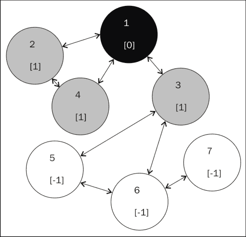
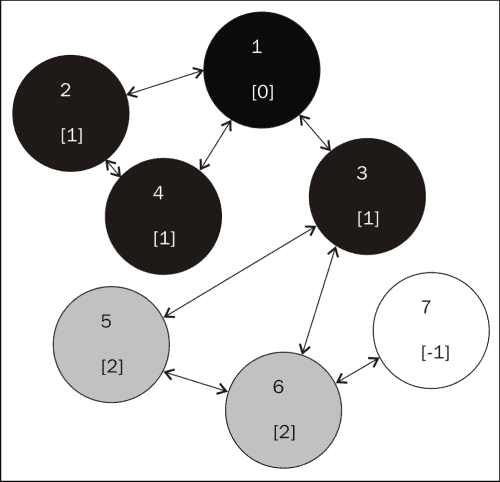
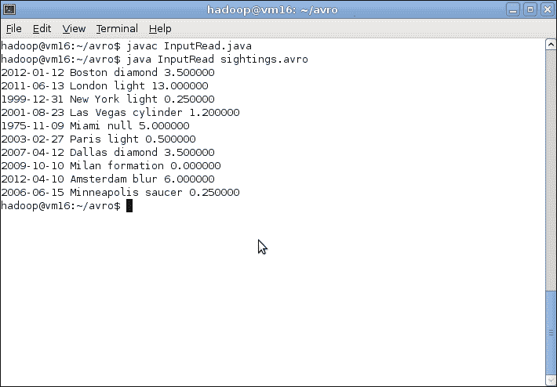

# 五、高级 MapReduce 技术

既然我们已经了解了 MapReduce 的基本原理及其用法的一些细节，接下来是研究 MapReduce 中涉及的更多技术和概念的时候了。 本章将介绍以下主题：

*   对数据执行连接
*   在 MapReduce 中实现图形算法
*   如何以独立于语言的方式表示复杂数据类型

在此过程中，我们将使用案例研究作为示例，以突出其他方面，如提示和技巧，并确定最佳实践的一些领域。

# 简单、高级、介于两者之间

在章节标题中加入这个词“高级”有点危险，因为复杂性是一个主观概念。 所以让我们非常清楚这里讨论的材料。 我们丝毫不认为这是精炼智慧的巅峰，否则这些智慧将需要数年时间才能获得。 相反，我们也不认为本章介绍的一些技术和问题会出现在对 Hadoop 世界不熟悉的人身上。

因此，出于本章的目的，我们使用“高级”一词来涵盖您在最初的几天或几周内看不到的东西，或者如果您看到了也不一定会欣赏的东西。 这些技术既能为特定问题提供特定的解决方案，又能突出显示使用标准 Hadoop 和相关 API 来解决显然不适合 MapReduce 处理模型的问题的方法。 在此过程中，我们还将指出一些替代方法，这些方法我们在这里没有实现，但它们可能是进一步研究的有用资源。

我们的第一个案例研究是后一种情况的一个非常常见的示例；在 MapReduce 中执行联接类型的操作。

# 加入

很少有问题使用单一数据集。 在许多情况下，有一些简单的方法可以消除在 MapReduce 框架内尝试和处理大量离散但相关的数据集的需要。

当然，这里的类比与关系数据库中的**JOIN**概念类似。 将数据分割成多个表，然后使用将表连接在一起的 SQL 语句从多个源检索数据，这是非常自然的。 典型的例子是，主表只有特定事实的 ID 号，而针对其他表的联接用于提取有关唯一 ID 引用的信息的数据。

## 当这不是一个好主意的时候

在 MapReduce 中实现联接是可能的。 事实上，正如我们将看到的，问题与其说是做这件事的能力，不如说是在众多潜在战略中选择哪种战略。

但是，MapReduce 连接通常很难编写，而且很容易使效率低下。 无论使用 Hadoop 的时间长短，您都会遇到需要这样做的情况。 但是，如果您非常频繁地需要执行 MapReduce 连接，那么您可能需要问问自己，您的数据结构是否良好，本质上是否比您最初假设的更具关联性。 如果是这样的话，您可能需要考虑**Apache Have**([第 8 章](08.html "Chapter 8. A Relational View on Data with Hive")，*关于数据与配置单元的关系视图*的主要主题)或**Apache Pig**(在同一章中简要提到)。 两者都在 Hadoop 之上提供了额外的层，允许用高级语言表示数据处理操作；在配置单元中，通过 SQL 的变体。

## 地图侧连接与减少侧连接

请注意，在 Hadoop 中有两种连接数据的基本方法，它们的名称取决于作业执行中连接发生的位置。 在这两种情况下，我们都需要将多个数据流放在一起，并通过某些逻辑执行连接。 这两种方法之间的基本区别在于多个数据流是在映射器函数中组合还是在减少器函数中组合。

**映射端联接**，顾名思义是，将数据流读入映射器，并使用映射器函数中的逻辑来执行联接。 映射端联接的最大优势在于，通过在映射器中执行所有联接(更重要的是减少数据量)，传输到 Reduce 阶段的数据量大大减少。 地图端连接的缺点是，您要么需要找到一种方法来确保其中一个数据源非常小，要么需要定义作业输入以遵循非常具体的标准。 通常，要做到这一点，唯一的方法是使用另一个 MapReduce 作业对数据进行预处理，该作业的唯一目的是使数据为地图端连接做好准备。

相反，**Reduce-Side Join**在不执行任何连接逻辑的情况下通过映射阶段处理多个数据流，并在 Reduce 阶段进行连接。 这种方法的潜在缺点是，来自每个源的所有数据都被拉过混洗阶段，并被传递到还原器，在那里，大部分数据可能会被联接操作丢弃。 对于大型数据集，这可能会成为非常重要的开销。

Reduce-Side Join 的主要优势是它的简单性；您在很大程度上负责作业的结构，并且为相关数据集定义 Reduce-Side JOIN 方法通常非常简单。 让我们来看一个例子。

## 匹配客户和销售信息

许多公司的常见情况是销售记录与客户数据分开保存。 当然，这两者之间存在关系；通常，销售记录包含执行销售的用户帐户的唯一 ID。

在 Hadoop 世界中，这些数据文件由两种类型的数据文件表示：一种包含用户 ID 和销售信息的记录，另一种包含每个用户帐户的完整数据。

频繁的任务需要使用这两个来源的数据的报告；例如，我们希望看到每个用户的销售总数和总价值，但不希望将其与匿名 ID 号关联，而是与姓名关联。 当客户服务代表希望呼叫最频繁的客户(来自销售记录的数据)，但又希望能够用名字而不只是一个号码来指代该人时，这可能是很有价值的。

# 使用 MultipleInput 进行操作减少端连接的时间

通过执行以下步骤，我们可以使用 Reduce-Side 联接执行上一节中说明的报告：

1.  创建以下以制表符分隔的文件，并将其命名为`sales.txt`：

    ```scala
    00135.992012-03-15
    00212.492004-07-02
    00413.422005-12-20
    003499.992010-12-20
    00178.952012-04-02
    00221.992006-11-30
    00293.452008-09-10
    0019.992012-05-17
    ```

2.  创建以下以制表符分隔的文件，并将其命名为`accounts.txt`：

    ```scala
    001John AllenStandard2012-03-15
    002Abigail SmithPremium2004-07-13
    003April StevensStandard2010-12-20
    004Nasser HafezPremium2001-04-23
    ```

3.  将数据文件拷贝到 HDFS。

    ```scala
    $ hadoop fs -mkdir sales
    $ hadoop fs -put sales.txt sales/sales.txt
    $ hadoop fs -mkdir accounts
    $ hadoop fs -put accounts/accounts.txt

    ```

4.  创建以下文件并将其命名为`ReduceJoin.java`：

    ```scala
    import java.io.* ;

    import org.apache.hadoop.conf.Configuration;
    import org.apache.hadoop.fs.Path;
    import org.apache.hadoop.io.Text;
    import org.apache.hadoop.mapreduce.*;
    import org.apache.hadoop.mapreduce.lib.input.*;
    import org.apache.hadoop.mapreduce.lib.input.*;

    public class ReduceJoin
    {

        public static class SalesRecordMapper
    extends Mapper<Object, Text, Text, Text>
    {

            public void map(Object key, Text value, Context context)
    throws IOException, InterruptedException
            {
                String record = value.toString() ;
                String[] parts = record.split("\t") ;

                context.write(new Text(parts[0]), new 
    Text("sales\t"+parts[1])) ;
            }
        }

        public static class AccountRecordMapper
    extends Mapper<Object, Text, Text, Text>
    {
            public void map(Object key, Text value, Context context)
    throws IOException, InterruptedException
            {
                String record = value.toString() ;
                String[] parts = record.split("\t") ;

                context.write(new Text(parts[0]), new 
    Text("accounts\t"+parts[1])) ;
           }
        }

        public static class ReduceJoinReducer
        extends Reducer<Text, Text, Text, Text>
        {

            public void reduce(Text key, Iterable<Text> values,
                Context context)
                throws IOException, InterruptedException
            {
                String name = "" ;
    double total = 0.0 ;
                int count = 0 ;

                for(Text t: values)
                {
                    String parts[] = t.toString().split("\t") ;

                    if (parts[0].equals("sales"))
                    {
                        count++ ;
                        total+= Float.parseFloat(parts[1]) ;
                    }
                    else if (parts[0].equals("accounts"))
                    {
                        name = parts[1] ;
                    }
                }

                String str = String.format("%d\t%f", count, total) ;
                context.write(new Text(name), new Text(str)) ;
            }
        }

        public static void main(String[] args) throws Exception 
    {
            Configuration conf = new Configuration();
            Job job = new Job(conf, "Reduce-side join");
            job.setJarByClass(ReduceJoin.class);
            job.setReducerClass(ReduceJoinReducer.class);
            job.setOutputKeyClass(Text.class);
            job.setOutputValueClass(Text.class);
    MultipleInputs.addInputPath(job, new Path(args[0]), 
    TextInputFormat.class, SalesRecordMapper.class) ;
    MultipleInputs.addInputPath(job, new Path(args[1]), 
    TextInputFormat.class, AccountRecordMapper.class) ;
            Path outputPath = new Path(args[2]);
            FileOutputFormat.setOutputPath(job, outputPath);
    outputPath.getFileSystem(conf).delete(outputPath);

            System.exit(job.waitForCompletion(true) ? 0 : 1);
        }
    }
    ```

5.  编译文件并将其添加到 JAR 文件。

    ```scala
    $ javac ReduceJoin.java
    $ jar -cvf join.jar *.class

    ```

6.  通过执行以下命令运行作业：

    ```scala
    $ hadoop jar join.jarReduceJoin sales accounts outputs

    ```

7.  检查结果文件。

    ```scala
    $ hadoop fs -cat /user/garry/outputs/part-r-00000
    John Allen3124.929998
    Abigail Smith3127.929996
    April Stevens1499.989990
    Nasser Hafez113.420000

    ```

## *刚刚发生了什么？*

首先，我们创建了要在本例中使用的数据文件。 我们创建了两个较小的数据集，因为这样可以更容易地跟踪结果输出。 我们定义的第一个数据集是具有四列的帐户详细信息，如下所示：

*   帐户 ID
*   客户端名称
*   帐户类型
*   开户日期

然后，我们创建了一个包含三列的销售记录：

*   购买者的帐户 ID
*   这笔交易的价值
*   销售日期

当然，真实的帐目和销售记录中的字段会比这里提到的字段多得多。 创建文件后，我们将它们放到 HDFS 上。

然后，我们创建了`ReduceJoin.java`文件，该文件看起来与我们以前使用的 MapReduce 作业非常相似。 这项工作有几个方面让它变得特别，并允许我们实现联接。

首先，该类有两个已定义的映射器。 正如我们以前看到的，作业可以在一个链中执行多个映射器；但在本例中，我们希望对每个输入位置应用不同的映射器。 因此，我们将销售和帐户数据定义到`SalesRecordMapper`和`AccountRecordMapper`类ES 中。 我们使用了`org.apache.hadoop.mapreduce.lib.io`包中的`MultipleInputs`类，如下所示：

```scala
MultipleInputs.addInputPath(job, new Path(args[0]), 
TextInputFormat.class, SalesRecordMapper.class) ;
MultipleInputs.addInputPath(job, new Path(args[1]), 
TextInputFormat.class, AccountRecordMapper.class) ;
```

如您所见，与前面添加单个输入位置的示例不同，`MultipleInputs`类允许我们添加多个源，并将每个源与不同的输入格式和映射器相关联。

映射器非常简单；`SalesRecordMapper`类发出形式`<account number>, <sales value>`的输出，而`AccountRecordMapper`类发出形式`<account number>, <client name>`的输出。 因此，我们将每个销售的订单值和客户名称传递到将进行实际联接的 Reducer。

请注意，这两个映射器实际上发出的值都超过了所需的值。 `SalesRecordMapper`类以`sales`作为其值输出的前缀，而`AccountRecordMapper`类使用标记`account`。

如果我们看看减速器，就会明白为什么会这样。 Reducer 检索给定键的每条记录，但是如果没有这些显式标记，我们就不知道给定值是来自 Sales 还是 Account 映射器，因此无法理解如何处理数据值。

因此，`ReduceJoinReducer`类根据它们来自哪个映射器，以不同方式处理`Iterator`对象中的值。 `AccountRecordMapper`类中的值(应该只有一个)用于填充最终输出中的客户端名称。 对于每个销售记录-可能是多个，因为大多数客户购买的商品不止一个-订单总数被算作总价值。 因此，减少器的输出是账户持有人姓名的关键字，以及包含订单数和总订单值的值字符串。

我们编译并执行该类；注意我们如何提供表示两个输入目录和单个输出源的三个参数。 由于`MultipleInputs`类的配置方式，我们还必须确保以正确的顺序指定目录；没有动态机制来确定哪种类型的文件位于哪个位置。

执行后，我们检查输出文件并确认它确实如预期的那样包含指定客户端的总数。

### DataJoinMapper 和 TaggedMapperOutput

有一种方法可以以更复杂和面向对象的方式实现减少端联接。 在`org.apache.hadoop.contrib.join`包中有像`DataJoinMapperBase`和`TaggedMapOutput`这样的类，它们提供了一种封装的方法来派生标签用于映射输出，并在还原器上对其进行处理。 这种机制意味着您不必像我们以前那样定义显式的 Tag字符串，然后仔细解析在 Reducer 接收到的数据以确定数据来自哪个映射器；提供的类中有封装此功能的方法。

当使用数字或其他非文本数据时，此功能特别有价值。 要创建我们自己的显式标记(如上例所示)，我们必须将整数等类型转换为字符串，以便添加所需的前缀标记。 这将比使用标准形式的数值类型并依赖额外的类来实现标记的效率更低。

该框架允许非常复杂的标签生成，以及我们之前没有实现的标签分组等概念。 使用这种机制需要额外的工作，包括覆盖其他方法和使用不同的映射基类。 对于像上一个示例中这样简单的连接，这个框架可能有些夸张，但是如果您发现自己实现了非常复杂的标记逻辑，那么它可能值得一看。

## 实现地图端连接

要在给定点连接到，我们必须有权访问该点每个数据集中的相应记录。 这就是 Reduce 端联接的简单性发挥作用的地方；尽管它会导致额外的网络流量开销，但根据定义处理它可以确保 Reducer 具有与联接键相关联的所有记录。

如果我们希望在映射器中执行连接，那么要使该条件成立就不那么容易了。 我们不能假设我们的输入数据的结构足够好，可以同时读取相关记录。 我们通常有两类方法：消除从多个外部源读取数据的需要，或者对数据进行预处理，使其可用于地图端连接。

### 使用分布式缓存

实现第一种方法的最简单方法是获取除一个数据集之外的所有数据集，并使其在我们在上一章中使用的分布式缓存中可用。 该方法可以用于多个数据源，但为简单起见，我们只讨论两个。

如果我们有一个较大的数据集和一个较小的数据集，例如前面的销售和客户信息，一种选择是将客户信息打包并将其推送到 Distributed Cache 中。 然后，每个映射器将该数据读取到一个高效的数据结构中，例如使用连接键作为散列键的散列表。 然后处理销售记录，并且在处理每个记录期间，可以从哈希表中检索所需的帐户信息。

这种机制非常有效，当一个较小的数据集可以很容易地装入内存时，这是一个很好的方法。 然而，我们并不总是那么幸运，有时最小的数据集仍然太大，无法复制到每台工人机器上并保存在内存中。

## 拥有围棋英雄-实现地图侧连接

以前面的销售/客户记录示例为例，使用 Distributed Cache 实现映射端联接。 如果将帐户记录加载到将帐户 ID 号映射到客户名称的哈希表中，则可以使用帐户 ID 检索客户名称。 在处理销售记录时，在映射器中执行此操作。

### 修剪数据以适合缓存

如果最小的数据集合仍然太大，无法在分布式缓存中使用，则不一定会丢失所有数据。 例如，我们前面的例子只从每个记录中提取了两个字段，而丢弃了作业不需要的其他字段。 在现实中，帐户将由许多属性描述，这种缩减将极大地限制数据大小。 Hadoop 可用的数据通常是完整的数据集，但我们需要的只是字段的一个子集。

因此，在这种情况下，可以从完整数据集中仅提取 MapReduce 作业期间需要的字段，并在这样做时创建足够小以用于缓存的修剪后的数据集。

### 备注

这是一个与底层的**面向列的数据库**非常相似的概念。 传统的关系数据库每次存储一行数据，这意味着需要读取整行才能提取单个列。 基于列的数据库改为单独存储每列，从而允许查询只读取它感兴趣的列。

如果您采用这种方法，您需要考虑将使用什么机制来生成数据子集，以及生成数据子集的频率。 显而易见的方法是编写另一个 MapReduce 作业，该作业执行必要的过滤，然后该输出在分布式缓存中用于后续作业。 如果较小的数据集只有很少的更改，那么您可以按计划生成修剪后的数据集；例如，每晚刷新它。 否则，您将需要创建两个 MapReduce 作业链：一个用于生成修剪后的数据集，另一个用于使用大集和分布式缓存中的数据执行连接操作。

### 使用数据表示而不是原始数据

有时，其中一个数据源不用于检索其他数据，而是用于派生一些事实，然后在决策过程中使用这些事实。 例如，我们可能希望筛选销售记录，以便仅提取发货地址位于特定区域的记录。

在这种情况下，我们可以将所需的数据大小减少到可能更容易放入缓存中的适用销售记录的列表。 我们可以再次将其存储为哈希表，在哈希表中，我们只是记录记录有效的事实，甚至可以使用排序列表或树之类的东西。 在我们可以接受一些假阳性的情况下，仍然保证没有假阴性，**Bloom filter**提供了一种非常紧凑的方式来表示这样的信息。

可以看出，应用这种方法来启用地图端连接需要创造力，而且在数据集的性质和手头的问题上需要相当大的运气。 但请记住，最好的关系数据库管理员会花费大量时间优化查询以删除不必要的数据处理；因此，询问您是否真的需要处理所有这些数据并不是一个坏主意。

### 使用多个映射器

从根本上说，之前的技术试图消除完全交叉数据集联接的需要。 但有时这是您必须要做的；您可能只是拥有非常大的数据集，而这些数据集不能以任何一种聪明的方式组合在一起。

`org.apache.hadoop.mapreduce.lib.join`包中有支持这种情况的类。 主要感兴趣的类是`CompositeInputFormat`，它应用一个用户定义的函数来组合来自多个数据源的记录。

这种方法的主要限制是，除了以相同的方式对数据源进行排序和分区之外，还必须已经基于公用键对数据源进行索引。 原因很简单：当从每个源读取数据时，框架需要知道每个位置是否存在给定键。 如果我们知道每个分区都经过排序并且包含相同的键范围，那么简单的迭代逻辑就可以完成所需的匹配。

这种情况显然不会偶然发生，因此您可能再次发现自己编写预处理作业来将所有输入数据源转换为正确的排序和分区结构。

### 备注

本讨论开始涉及分布式和并行连接算法；这两个主题都有广泛的学术和商业研究。 如果您对这些想法感兴趣，并且想要了解更多的基本理论，请到[http://scholar.google.com](http://scholar.google.com)上搜索。

## 加入或不加入...

在我们了解了MapReduce 世界的连接之后，让我们回到最初的问题：您真的确定要这样做吗？ 通常在相对容易实现但效率低下的减端连接和更高效但更复杂的映射端替代方案之间进行选择。 我们已经看到，连接确实可以在 MapReduce 中实现，但它们并不总是美观的。 这就是为什么我们建议使用蜂巢或猪之类的东西，如果这些类型的问题构成了你的工作量的很大一部分。 显然，我们可以使用那些在幕后自行转换为 MapReduce 代码并直接实现映射端和 Reduce 端连接的工具，但对于此类工作负载，通常最好使用设计良好、优化良好的库，而不是构建自己的库。 毕竟，这就是您使用 Hadoop 而不是编写自己的分布式处理框架的原因！

# 图算法

任何优秀的计算机科学家都会告诉你，图形数据结构是最强大的工具之一。 许多复杂的系统最好用图形来表示，至少几十年(如果你对它有更多的数学知识，可以追溯到几个世纪)的知识体系提供了非常强大的算法来解决各种各样的图形问题。 但就其本质而言，图及其算法在 MapReduce 范例中通常是很难想象的。

## 图表 101

让我们后退一步，定义一些术语。 图是由节点(也称为顶点)组成的结构，这些节点(也称为顶点)通过称为**边**的链接相连。 根据图形的类型，边可以是双向的，也可以是单向的，并且可能具有与其关联的权重。 例如，城市道路网可以看作是一个图形，其中道路是边，交叉点和兴趣点是节点。 有些街道是单程的，有些不是，有些是收费的，有些是在一天中的某些时间封闭的，等等。

对于运输公司来说，通过优化从一个点到另一个点的路线可以赚很多钱。 不同的图形算法可以通过考虑诸如单行道之类的属性以及表示为使给定道路更具吸引力或更不吸引人的权重的其他成本来导出这样的路线。

举一个更新的例子，想一想 Facebook 等网站所普及的社交图，其中节点是人，边是他们之间的关系。

## 图表和 MapReduce-在某处匹配

图形看起来不像许多其他 MapReduce 问题的主要原因是图形处理的有状态特性，这可以在元素之间以及通常在为单一算法一起处理的大量节点之间的基于路径的关系中看到。 图形算法倾向于使用全局状态的概念来确定下一步要处理哪些元素，并在每一步修改这样的全局知识。

具体地说，大多数众所周知的算法通常以增量或重入的方式执行，构建表示已处理节点和挂起节点的结构，并在减少前者的同时处理后者。

另一方面，MapReduce 问题在概念上是无状态的，通常基于分而治之的方法，其中每个 Hadoop 工作线程主机处理一小部分数据，写出最终结果的一部分，其中总作业输出被视为这些较小输出的简单集合。 因此，在 Hadoop 中实现图形算法时，我们需要在无状态并行和分布式框架中表达从根本上是有状态的和概念性单线程的算法。 这就是挑战！

大多数众所周知的图算法都是基于对图的搜索或遍历，通常是为了找到节点之间的路由-通常按某种成本概念进行排序。 最基本的图遍历算法有**深度优先搜索**(**DFS**)和**广度优先搜索**(**BFS**)。 算法之间的区别在于节点相对于其邻居的处理顺序不同。

我们将介绍实现这种遍历的特殊形式的算法；对于图中给定的起始节点，确定它与图中所有其他节点之间的距离。

### 备注

可以看出，图形算法和理论领域是一个巨大的领域，我们在这里几乎没有触及到它的皮毛。 如果您想了解更多，图表上的维基百科条目是一个很好的起点；它可以在[http://en.wikipedia.org/wiki/Graph_(abstract_data_type)](http://en.wikipedia.org/wiki/Graph_(abstract_data_type))找到。

## 表示图

我们面临的第一个问题是如何用一种我们可以使用 MapReduce 高效处理的方式来表示图形。 有几种众所周知的图表示，称为基于指针的、邻接矩阵和邻接列表。 在大多数实现中，这些表示通常假定单个进程空间具有整个图的全局视图；我们需要修改表示以允许在离散映射和 Reduce 任务中处理单个节点。

我们将在下面的示例中使用此处所示的图表。 该图表确实有一些额外的信息，稍后将对其进行解释。


我们的图非常简单；它只有 7 个节点，除了一条边之外，所有的边都是双向的。 我们还使用标准图形算法中使用的常用着色技术，如下所示：

*   白色节点尚未处理
*   当前正在处理灰色节点
*   已处理黑色节点

当我们在以下步骤中处理图形时，我们预计会看到节点经过这些阶段。

# 动作时间-表示图形

让我们定义将在以下示例中使用的图形的文本表示形式。

将以下内容创建为`graph.txt`：

```scala
12,3,40C
21,4
31,5,6
41,2
53,6
63,5
76
```

## *刚刚发生了什么？*

我们定义了一个文件结构来表示我们的图形，这在一定程度上基于邻接列表方法。 我们假设每个节点都有一个唯一的 ID，文件结构有四个字段，如下所示：

*   节点 ID
*   以逗号分隔的邻居列表
*   到起始节点的距离
*   节点状态

在初始表示中，只有起始节点具有第三列和第四列的值：它与自身的距离是 0，它的状态是“C”，这将在后面解释。

我们的图是有向图-更正式地称为有向图-也就是说，如果节点 1 将节点 2 列为邻居，则如果节点 2 也将节点 1 列为其邻居，则只有一条返回路径。 我们在图形表示中看到了这一点，除了一条边之外，所有边的两端都有一个箭头。

## 算法概述

因为该算法和相应的 MapReduce 作业非常复杂，所以我们将在显示代码之前对其进行解释，然后在稍后的使用中进行演示。

根据前面的表示，我们将定义一个 MapReduce 作业，该作业将多次执行以获得最终输出；该作业的给定执行的输入将是上一次执行的输出。

根据上一节中描述的颜色代码，我们将为节点定义三种状态：

*   **Pending**：节点尚待处理，处于默认状态(白色)
*   **当前正在处理**：节点正在处理中(灰色)
*   **完成**：节点的最终距离已确定(黑色)

### 映射器

映射器将读入图形的当前表示，并按如下方式处理每个节点：

*   如果该节点被标记为完成，它将提供不带任何更改的输出。
*   如果节点被标记为当前正在处理，则其状态将更改为 Done，并在不进行其他更改的情况下提供输出。 它的每个邻居按照当前记录给出输出，其距离递增 1，但是没有邻居；例如，节点 1 不知道节点 2 的邻居。
*   如果节点被标记为挂起，则其状态将更改为当前正在处理，并且它会在不做进一步更改的情况下提供输出。

### 减速机

减法器将接收每个节点 ID 的一条或多条记录，并将它们的值合并到该阶段的最终输出节点记录中。

减速器的通用算法如下：

*   完成记录是最终输出，不会执行值的进一步处理
*   对于其他节点，通过获取邻居列表、找到该节点的位置以及最高距离和状态来构建最终输出

### 迭代应用

如果我们应用一次这个算法，我们将使节点 1 被标记为完成，几个节点(它的直接邻居)被标记为当前节点，其他几个节点被标记为挂起。 该算法的连续应用将看到所有节点移动到其最终状态；当遇到每个节点时，其邻居被带入处理流水线。 我们稍后会展示这一点。

# 行动时间-创建源代码

现在我们将查看实现图形遍历的源代码。 因为代码很长，我们将把它分成多个步骤；显然，它们都应该放在一个源文件中。

1.  使用这些导入将以下内容创建为`GraphPath.java`：

    ```scala
    import java.io.* ;

    import org.apache.hadoop.conf.Configuration;
    import org.apache.hadoop.fs.Path;
    import org.apache.hadoop.io.Text;
    import org.apache.hadoop.mapreduce.Job;
    import org.apache.hadoop.mapreduce.*;
    import org.apache.hadoop.mapreduce.lib.input.*;
    import org.apache.hadoop.mapreduce.lib.output.*;

    public class GraphPath
    {
    ```

2.  创建内部类以保存节点的面向对象表示：

    ```scala
    // Inner class to represent a node
        public static class Node
        {
    // The integer node id
            private String id ;
    // The ids of all nodes this node has a path to
            private String neighbours ;
    // The distance of this node to the starting node
            private int distance ;
    // The current node state
            private String state ;

    // Parse the text file representation into a Node object
            Node( Text t)
            {
                String[] parts = t.toString().split("\t") ;
    this.id = parts[0] ;
    this.neighbours = parts[1] ;
                if (parts.length<3 || parts[2].equals(""))
    this.distance = -1 ;
                else
    this.distance = Integer.parseInt(parts[2]) ;

                if (parts.length< 4 || parts[3].equals(""))
    this.stae = "P" ;
                else
    this.state = parts[3] ;
            }

    // Create a node from a key and value object pair
            Node(Text key, Text value)
            {
                this(new Text(key.toString()+"\t"+value.toString())) ;
            }

            Public String getId()
            {return this.id ;
            }

            public String getNeighbours()
            {
                return this.neighbours ;
            }

            public int getDistance()
            {
                return this.distance ;
            }

            public String getState()
            {
                return this.state ;
            }
        }
    ```

3.  为作业创建映射器。 映射器将为其输入创建一个新的`Node`对象，然后对其进行检查，并根据其状态进行适当的处理。

    ```scala
        public static class GraphPathMapper
    extends Mapper<Object, Text, Text, Text>
    {

           public void map(Object key, Text value, Context context)
    throws IOException, InterruptedException 
    {
             Node n = new Node(value) ;

             if (n.getState().equals("C"))
             {
    //  Output the node with its state changed to Done
                context.write(new Text(n.getId()), new Text(n.getNeighbours()+"\t"+n.getDistance()+"\t"+"D")) ;

                    for (String neighbour:n.getNeighbours().split(","))
                    {
    // Output each neighbour as a Currently processing node
    // Increment the distance by 1; it is one link further away
                        context.write(new Text(neighbour), new 
    Text("\t"+(n.getDistance()+1)+"\tC")) ;
                    }
                }
                else
                {
    // Output a pending node unchanged
                    context.write(new Text(n.getId()), new 
    Text(n.getNeighbours()+"\t"+n.getDistance()
    +"\t"+n.getState())) ;
                }

            }
        }
    ```

4.  为作业创建减速机。 与映射器一样，这将读入节点的表示形式，并根据节点的状态提供不同的值作为输出。 基本方法是从输入中收集状态和距离列的最大值，并通过此方法收敛到最终解决方案。

    ```scala
        public static class GraphPathReducer
    extends Reducer<Text, Text, Text, Text>
    {

            public void reduce(Text key, Iterable<Text> values,
                Context context)
                throws IOException, InterruptedException 
    {
    // Set some default values for the final output
                String neighbours = null ;
    int distance = -1 ;
    String state = "P" ;

                for(Text t: values)
    {
                    Node n = new Node(key, t) ;

                    if (n.getState().equals("D"))
                    {
    // A done node should be the final output; ignore the remaining 
    // values
    neighbours = n.getNeighbours() ;
                        distance = n.getDistance() ;
                        state = n.getState() ;
                        break ;
                    }

    // Select the list of neighbours when found                
                    if (n.getNeighbours() != null)
    neighbours = n.getNeighbours() ;

    // Select the largest distance
                    if (n.getDistance() > distance)
    distance = n.getDistance() ;

    // Select the highest remaining state
                    if (n.getState().equals("D") || 
    (n.getState().equals("C") &&state.equals("P")))
    state=n.getState() ;
                }

    // Output a new node representation from the collected parts        
                context.write(key, new 
    Text(neighbours+"\t"+distance+"\t"+state)) ;
            }
        }
    ```

5.  创建作业驱动程序：

    ```scala
        public static void main(String[] args) throws Exception 
    {
            Configuration conf = new Configuration();
            Job job = new Job(conf, "graph path");
            job.setJarByClass(GraphPath.class);
            job.setMapperClass(GraphPathMapper.class);
            job.setReducerClass(GraphPathReducer.class);
            job.setOutputKeyClass(Text.class);
            job.setOutputValueClass(Text.class);
            FileInputFormat.addInputPath(job, new Path(args[0]));
            FileOutputFormat.setOutputPath(job, new Path(args[1]));
            System.exit(job.waitForCompletion(true) ? 0 : 1);
        }
    }
    ```

## *刚刚发生了什么？*

这里的作业实现了前面描述的算法，我们将在下面几节中执行该算法。 作业设置非常标准，除了算法定义之外，这里唯一的新功能是使用内部类来表示节点。

映射器或缩减器的输入通常是更复杂结构或对象的展平表示。 我们可以只使用该表示，但在这种情况下，这将导致映射器和减简器主体充满文本和字符串操作代码，从而使实际算法变得模糊。

使用`Node`内部类允许从平面文件到对象表示的映射，该对象表示将被封装在一个在业务领域方面有意义的对象中。 这也使得映射器和缩减器逻辑更加清晰，因为对象属性之间的比较比与仅由绝对索引位置标识的字符串片段的比较在语义上更有意义。

# 行动时间-第一次运行

现在，让我们对图形的起始表示执行此算法的初始执行：

1.  将先前创建的`graph.txt`文件放入 HDFS：

    ```scala
    $ hadoop fs -mkdirgraphin
    $ hadoop fs -put graph.txtgraphin/graph.txt

    ```

2.  编译作业并创建 JAR 文件：

    ```scala
    $ javac GraphPath.java
    $ jar -cvf graph.jar *.class

    ```

3.  执行 MapReduce 作业：

    ```scala
    $ hadoop jar graph.jarGraphPathgraphingraphout1

    ```

4.  检查输出文件：

    ```scala
    $ hadoop fs –cat /home/user/hadoop/graphout1/part-r00000
    12,3,40D
    21,41C
    31,5,61C
    41,21C
    53,6-1P
    63,5-1P
    76-1P

    ```

## *刚刚发生了什么？*

将源文件放到 HDFS 上并创建作业 JAR 文件后，我们在 Hadoop 中执行该作业。 图形的输出表示形式显示了一些更改，如下所示：

*   节点 1 现在被标记为完成；它与自身的距离显然为 0
*   节点 2、3 和 4-节点 1 的邻居-被标记为当前正在处理
*   所有其他节点都处于挂起状态

我们的图表现在看起来如下图所示：



在给定算法的情况下，这是意料之中的；第一个节点已完成，其通过映射器提取的相邻节点正在进行中。 所有其他节点尚未开始处理。

# 行动时间-第二次运行

如果我们将这个表示作为作业的另一次运行的输入，我们预计节点 2、3 和 4 现在应该是完整的，并且它们的邻居现在处于当前状态。 让我们看看，执行以下步骤：

1.  通过执行以下命令执行 MapReduce 作业：

    ```scala
    $ hadoop jar graph.jarGraphPathgraphout1graphout2

    ```

2.  检查输出文件：

    ```scala
    $ hadoop fs -cat /home/user/hadoop/graphout2/part-r000000
    12,3,40D
    21,41D
    31,5,61D
    41,21D
    53,62C
    63,52C
    76-1P

    ```

## *刚刚发生了什么？*

不出所料，节点 1 到 4 已完成，节点 5 和 6 正在进行中，节点 7 仍处于挂起状态，如下图中的所示：



如果我们再次运行该作业，我们应该预期节点 5 和 6 已经完成，并且任何未处理的邻居都将成为当前节点。

# 行动时间-第三次运行

让我们通过第三次运行该算法来验证该假设。

1.  执行 MapReduce 作业：

    ```scala
    $ hadoop jar graph.jarGraphPathgraphout2graphout3

    ```

2.  检查输出文件：

    ```scala
    $ hadoop fs -cat /user/hadoop/graphout3/part-r-00000
    12,3,40D
    21,41D
    31,5,61D
    41,21D
    53,62D
    63,52D
    76-1P

    ```

## *刚刚发生了什么？*

我们现在看到节点 1到节点 6 是完整的。 但节点 7 仍处于挂起状态，当前没有节点在处理中，如下图所示：


这种状态的原因是，虽然节点 7 具有到节点 6 的链路，但在相反方向上没有边。 因此，实际上无法从节点 1 到达节点 7。如果我们最后一次运行该算法，我们应该会看到该图没有变化。

# 行动时间-第四次也是最后一次运行

让我们执行第四次执行，以验证输出现在已达到其最终稳定状态。

1.  执行 MapReduce 作业：

    ```scala
    $ hadoop jar graph.jarGraphPathgraphout3graphout4

    ```

2.  检查输出文件：

    ```scala
    $ hadoop fs -cat /user/hadoop/graphout4/part-r-00000
    12,3,40D
    21,41D
    31,5,61D
    41,21D
    53,62D
    63,52D
    76-1P

    ```

## *刚刚发生了什么？*

输出与预期不谋而合；由于节点 1 或其任何邻居都无法到达节点 7，因此它将保持挂起状态，并且永远不会被进一步处理。 因此，我们的图形保持不变，如下图所示：


我们没有构建到算法中的一件事就是了解终止条件；如果运行没有创建任何新的 D 或 C 节点，那么这个过程就完成了。

我们在这里使用的机制是手动的，也就是说，我们通过检查知道图形表示已经达到了它的最终稳定状态。 不过，有几种方法可以通过编程实现这一点。 在后面的章节中，我们将讨论自定义作业计数器；例如，我们可以在每次创建新的 D 或 C 节点时递增计数器，并且只有在运行后该计数器大于零时才重新执行作业。

## 运行多个作业

前面的算法是我们第一次显式使用一个 MapReduce 作业的输出作为另一个作业的输入。 在大多数情况下，作业是不同的；但是，正如我们已经看到的，重复应用一种算法直到输出达到稳定状态是有价值的。

## 关于图形的最后思考

对于熟悉图形算法的任何人来说，前面的过程似乎非常陌生。 这仅仅是因为我们将有状态且可能递归的全局和可重入算法实现为一系列连续的无状态 MapReduce 作业。 重要的事实不在于所使用的特定算法；教训在于我们如何获取平面文本结构和一系列 MapReduce 作业，并由此实现类似于图形遍历的东西。 您可能会遇到一些问题，这些问题一开始似乎无法在 MapReduce 范例中实现；请考虑这里使用的一些技术，并记住许多算法都可以在 MapReduce 中建模。 它们看起来可能与传统方法有很大不同，但目标是正确的输出，而不是已知算法的实现。

# 使用独立于语言的数据结构

经常有人批评 Hadoop，社区一直在努力解决这一问题，那就是它非常以 Java 为中心。 指责一个完全用 Java 实现的项目是以 Java 为中心似乎有些奇怪，但这是从客户的角度考虑的。

我们已经展示了 Hadoop Streaming 如何允许使用脚本语言来实现映射和减少任务，以及管道如何为 C++提供类似的机制。 但是，Hadoop MapReduce 支持的输入格式的性质仍然是 Java 独有的。 最有效的格式是 SequenceFile，这是一种支持压缩的二进制可拆分容器。 但是，SequenceFiles 只有一个 Java API；它们不能用任何其他语言写入或读取。

我们可以让一个外部进程创建数据，以便将其摄取到 Hadoop 中以进行 MapReduce 处理，而最好的方法是将其简单地作为文本类型的输出，或者进行一些预处理以将输出格式转换为 SequenceFiles，然后将其推送到 HDFS 上。 在这里，我们还很难轻松地表示复杂的数据类型；我们要么必须将它们扁平化为文本格式，要么必须编写跨两种二进制格式的转换器，这两种格式都不是一个有吸引力的选择。

## 候选技术

幸运的是，近年来发布了几种技术，它们解决了跨语言数据表示的问题。 它们是**协议缓冲区**(由谷歌创建并托管在[http://code.google.com/p/protobuf](http://code.google.com/p/protobuf))、**Thrift**(最初由 Facebook 创建，现在是[http://thrift.apache.org](http://thrift.apache.org)的一个 Apache 项目)， 和**Avro**(由 Hadoop 的原始创建者 Doug Cutting 创建)。 考虑到它的传统和与 Hadoop 的紧密集成，我们将使用 Avro 来探讨这个主题。 我们不会在本书中介绍 Thrift 或 Protocol Buffers，但它们都是可靠的技术；如果您对数据序列化这一主题感兴趣，请查看它们的主页以获取更多信息。

## 介绍 Avro

AVRO的主页是[http://avro.apache.org](http://avro.apache.org)，它是一个绑定了许多编程语言的数据持久化框架。 它创建了一种既可压缩又可拆分的二进制结构化格式，这意味着可以有效地将其用作 MapReduce 作业的输入。

Avro 允许定义分层数据结构；例如，我们可以创建包含数组、枚举类型和子记录的记录。 我们可以用任何编程语言创建这些文件，在 Hadoop 中处理它们，然后用第三种语言读取结果。

我们将在接下来的小节中讨论语言独立性的这些方面，但这种表达复杂结构化类型的能力也非常有价值。 即使我们只使用 Java，我们也可以使用 Avro 来允许我们将复杂的数据结构传入和传出映射器和减法器。 甚至像图形节点这样的东西！

# 该行动了-获取并安装 Avro

让我们下载 Avro并将其安装到我们的系统上。

1.  从[http://avro.apache.org/releases.html](http://avro.apache.org/releases.html)下载 AVRO 的最新稳定版本。
2.  从[http://paranamer.codehaus.org](http://paranamer.codehaus.org)下载最新版本的 ParaNamer 库。
3.  将类添加到 Java 编译器使用的构建类路径中。

    ```scala
    $ export CLASSPATH=avro-1.7.2.jar:${CLASSPATH}
    $ export CLASSPATH=avro-mapred-1.7.2.jar:${CLASSPATH}
    $ export CLASSPATH=paranamer-2.5.jar:${CLASSPATH

    ```

4.  将 Hadoop 发行版中现有的JAR 文件添加到`build`类路径。

    ```scala
    Export CLASSPATH=${HADOOP_HOME}/lib/Jackson-core-asl-1.8.jar:${CLASSPATH}
    Export CLASSPATH=${HADOOP_HOME}/lib/Jackson-mapred-asl-1.8.jar:${CLASSPATH}
    Export CLASSPATH=${HADOOP_HOME}/lib/commons-cli-1.2.jar:${CLASSPATH}

    ```

5.  将新的 JAR 文件添加到 Hadoop`lib`目录。

    ```scala
    $cpavro-1.7.2.jar ${HADOOP_HOME}/lib
    $cpavro-1.7.2.jar ${HADOOP_HOME}/lib
    $cpavro-mapred-1.7.2.jar ${HADOOP_HOME}/lib

    ```

## *刚刚发生了什么？*

设置Avro 有点复杂；与我们将要使用的其他 Apache 工具相比，它是一个新得多的项目，因此它需要多次下载 tarball。

我们从 Apache 网站下载 avro 和 avro 映射的 JAR 文件。 还有一个对 ParaNamer 的依赖，我们从它的主页[http://codehaus.org](http://codehaus.org)下载。

### 备注

在撰写本文时，ParaNamer 主页的下载链接已损坏；作为替代方案，请尝试以下链接：

[http：//search.maven.org/remotecontent？filepath=com/thoughtworks/paranamer/paranamer/2.5/paranamer-2.5.jar](http://search.maven.org/remotecontent?filepath=com/thoughtworks/paranamer/paranamer/2.5/paranamer-2.5.jar)

下载这些 JAR 文件后，我们需要将它们添加到我们的环境使用的类路径中；主要用于 Java 编译器。 我们添加这些文件，但我们还需要将 Hadoop 附带的几个包添加到`build`类路径中，因为它们是编译和运行 Avro 代码所必需的。

最后，我们将三个新的 JAR 文件复制到集群中每个主机上的 Hadoop`lib`目录中，以使类在运行时可用于 map 和 Reduce 任务。 我们可以通过其他机制分发这些 JAR 文件，但这是最直接的方法。

## Avro 和模式

与 Thrift 和 Protocol Buffers 等工具相比，Avro 的一个优势在于它接近描述 Avro 数据文件的模式。 虽然其他工具总是要求模式作为不同的资源可用，但 AVRO 数据文件将模式编码在它们的头中，这允许代码解析文件，而不需要看到单独的模式文件。

Avro 支持(但不需要)生成针对特定数据架构定制的代码的代码生成。 这是一种优化，在可能的情况下是有价值的，但不是必需的。

因此，我们可以编写一系列从未实际使用数据文件模式的 Avro 示例，但我们将只对流程的一部分执行此操作。 在下面的示例中，我们将定义一个模式，该模式表示我们以前使用的 UFO 目击记录的简化版本。

# 执行操作的时间-定义模式

现在让我们在单个 Avro 模式文件中创建这个简化 UFO 模式。

将以下内容创建为`ufo.avsc`：

```scala
{ "type": "record",
  "name": "UFO_Sighting_Record",
  "fields" : [
    {"name": "sighting_date", "type": "string"},
    {"name": "city", "type": "string"},
    {"name": "shape", "type": ["null", "string"]}, 
    {"name": "duration", "type": "float"}
] 
}
```

## *刚刚发生了什么？*

可以看到，Avro 在其模式中使用 JSON，这些模式通常使用`.avsc`扩展名保存。 我们在这里为具有四个字段的格式创建模式，如下所示：

*   字符串类型的**SISTETING_DATE**字段，用于保存格式为`yyyy-mm-dd`的日期
*   字符串类型的**City**字段，它将包含目击事件发生的城市名称
*   **Shape**字段，字符串类型的可选字段，表示 UFO 的形状
*   **持续时间**字段以分数分钟为单位表示观察持续时间

定义了模式之后，我们现在将创建一些示例数据。

# 该行动了-使用 Ruby 创建源 Avro 数据

让我们使用 Ruby 创建示例数据，以演示 Avro 的跨语言功能。

1.  添加`rubygems`包：

    ```scala
    $ sudo apt-get install rubygems

    ```

2.  安装 Avro gem：

    ```scala
    $ gem install avro

    ```

3.  将以下内容创建为`generate.rb`：

    ```scala
    require 'rubygems'
    require 'avro'

    file = File.open('sightings.avro', 'wb')
    schema = Avro::Schema.parse(
    File.open("ufo.avsc", "rb").read)

    writer = Avro::IO::DatumWriter.new(schema)
    dw = Avro::DataFile::Writer.new(file, writer, schema)
    dw<< {"sighting_date" => "2012-01-12", "city" => "Boston", "shape" => "diamond", "duration" => 3.5}
    dw<< {"sighting_date" => "2011-06-13", "city" => "London", "shape" => "light", "duration" => 13}
    dw<< {"sighting_date" => "1999-12-31", "city" => "New York", "shape" => "light", "duration" => 0.25}
    dw<< {"sighting_date" => "2001-08-23", "city" => "Las Vegas", "shape" => "cylinder", "duration" => 1.2}
    dw<< {"sighting_date" => "1975-11-09", "city" => "Miami", "duration" => 5}
    dw<< {"sighting_date" => "2003-02-27", "city" => "Paris", "shape" => "light", "duration" => 0.5}
    dw<< {"sighting_date" => "2007-04-12", "city" => "Dallas", "shape" => "diamond", "duration" => 3.5}
    dw<< {"sighting_date" => "2009-10-10", "city" => "Milan", "shape" => "formation", "duration" => 0}
    dw<< {"sighting_date" => "2012-04-10", "city" => "Amsterdam", "shape" => "blur", "duration" => 6}
    dw<< {"sighting_date" => "2006-06-15", "city" => "Minneapolis", "shape" => "saucer", "duration" => 0.25}
    dw.close
    ```

4.  运行程序并创建数据文件：

    ```scala
    $ ruby generate.rb

    ```

## *刚刚发生了什么？*

在使用 Ruby 之前，我们确保在我们的 Ubuntu 主机上安装了`rubygems`包。 然后我们安装预先存在的用于 Ruby 的 Avro gem。 这提供了在 Ruby 语言中读写 avro 文件所需的库。

Ruby 脚本本身只是读取前面创建的模式，并创建一个包含 10 条测试记录的数据文件。 然后我们运行该程序来创建数据。

这不是 Ruby 教程，所以我将把 Ruby API 的分析留给读者作为练习；它的文档可以在[http://rubygems.org/gems/avro](http://rubygems.org/gems/avro)找到。

# Java 操作消耗 Avro 数据的时间

现在我们已经有了个 Avro 数据，现在让我们编写一些 Java 代码来使用它：

1.  将以下内容创建为`InputRead.java`：

    ```scala
    import java.io.File;
    import java.io.IOException;

    import org.apache.avro.file.DataFileReader;
    import org.apache.avro.generic.GenericData;
    import org.apache.avro. generic.GenericDatumReader;
    import org.apache.avro.generic.GenericRecord;
    import org.apache.avro.io.DatumReader;

    public class InputRead
    {
        public static void main(String[] args) throws IOException
        {
            String filename = args[0] ;

            File file=new File(filename) ;
    DatumReader<GenericRecord> reader= new 
    GenericDatumReader<GenericRecord>();
    DataFileReader<GenericRecord>dataFileReader=new 
    DataFileReader<GenericRecord>(file,reader);

            while (dataFileReader.hasNext())
            {
    GenericRecord result=dataFileReader.next();
                String output = String.format("%s %s %s %f",
    result.get("sighting_date"), result.get("city"), 
    result.get("shape"), result.get("duration")) ;
    System.out.println(output) ;
            }
        }
    }
    ```

2.  Compile and run the program:

    ```scala
    $ javacInputRead.java
    $ java InputReadsightings.avro

    ```

    输出将如以下屏幕截图所示：

    

## *刚刚发生了什么？*

我们创建了 Java 类`InputRead`，它接受作为命令行参数传递的文件名，并将其解析为 avro 数据文件。 当 Avro 从数据文件中读取时，每个单独的元素被称为**数据**，并且每个数据将遵循模式中定义的结构。

在本例中，我们不使用显式模式；相反，我们将每个数据读入`GenericRecord`类，然后通过按名称显式检索每个字段来从中提取每个字段。

`GenericRecord`类在 Avro 中是一个非常灵活的类；它可以用来包装任何记录结构，比如我们的 UFO 目击类型。 Avro 还支持基元类型(如整数、浮点数和布尔值)以及其他结构化类型(如数组和枚举)。 在这些示例中，我们将使用记录作为最常见的结构，但这只是为了方便起见。

## 在 MapReduce 中使用 Avro

Avro 对MapReduce 的支持围绕着其他熟悉类的几个特定于 Avro 的变体，而我们通常期望 Hadoop 通过新的`InputFormat`和`OutputFormat`类支持新的数据文件格式，我们将使用**AvroJob**、**AvroMapper**和**AvroReducer**，而不是使用**AvroJob**、**AvroMapper**和**AvroReducer**，而不是。 AvroJob 希望将 Avro 数据文件作为其输入和输出，因此我们不指定输入和输出格式类型，而是使用输入和输出 Avro 模式的详细信息对其进行配置。

我们的映射器和减少器实现的主要区别在于使用的类型。 默认情况下，avro 只有一个输入和输出，而我们习惯了`Mapper`和`Reducer`类有一个键/值输入和一个键/值输出。 Avro 还引入了`Pair`类，它通常用于发出中间键/值数据。

Avro 还支持**AvroKey**和**AvroValue**，它们可以包装其他类型，但我们不会在下面的示例中使用它们。

# 在 MapReduce 中生成形状摘要的时间

在本节中，我们将编写一个映射器，该映射器接受我们先前定义的 UFO 目击记录作为输入。 它将输出形状和计数`1`，缩减器将采用此形状和计数记录，并生成一个新的结构化 Avro 数据文件类型，其中包含每个 UFO 形状的最终计数。 执行以下步骤：

1.  将`sightings.avro`文件复制到 HDFS。

    ```scala
    $ hadoopfs -mkdiravroin
    $ hadoopfs -put sightings.avroavroin/sightings.avro

    ```

2.  将以下内容创建为`AvroMR.java`：

    ```scala
    import java.io.IOException;
    import org.apache.avro.Schema;
    import org.apache.avro.generic.*;
    import org.apache.avro.Schema.Type;
    import org.apache.avro.mapred.*;
    import org.apache.avro.reflect.ReflectData;
    import org.apache.avro.util.Utf8;
    import org.apache.hadoop.conf.*;
    import org.apache.hadoop.fs.Path;
    import org.apache.hadoop.mapred.*;
    import org.apache.hadoop.mapreduce.Job;
    import org.apache.hadoop.io.* ;
    import org.apache.hadoop.util.*;

    // Output record definition
    class UFORecord
    {
    UFORecord()
        {
        }

        public String shape ;
        public long count ;
    }

    public class AvroMR extends Configured  implements Tool
    {
    // Create schema for map output
        public static final Schema PAIR_SCHEMA =         
    Pair.getPairSchema(Schema.create(Schema.Type.STRING), 
    Schema.create(Schema.Type.LONG));
    // Create schema for reduce output
        public final static Schema OUTPUT_SCHEMA = 
    ReflectData.get().getSchema(UFORecord.class);

        @Override
        public int run(String[] args) throws Exception
        {
    JobConfconf = new JobConf(getConf(), getClass());
    conf.setJobName("UFO count");

            String[] otherArgs = new GenericOptionsParser(conf, args).getRemainingArgs();
            if (otherArgs.length != 2)
            {
    System.err.println("Usage: avro UFO counter <in><out>");
    System.exit(2);

            }

    FileInputFormat.addInputPath(conf, new Path(otherArgs[0]));
            Path outputPath = new Path(otherArgs[1]);
    FileOutputFormat.setOutputPath(conf, outputPath);
    outputPath.getFileSystem(conf).delete(outputPath);
            Schema input_schema = 
    Schema.parse(getClass().getResourceAsStream("ufo.avsc"));
    AvroJob.setInputSchema(conf, input_schema);
    AvroJob.setMapOutputSchema(conf,           
    Pair.getPairSchema(Schema.create(Schema.Type.STRING), 
    Schema.create(Schema.Type.LONG)));

    AvroJob.setOutputSchema(conf, OUTPUT_SCHEMA);
    AvroJob.setMapperClass(conf, AvroRecordMapper.class);
    AvroJob.setReducerClass(conf, AvroRecordReducer.class);
    conf.setInputFormat(AvroInputFormat.class) ;
    JobClient.runJob(conf);

            return 0 ;
        }

        public static class AvroRecordMapper extends 
    AvroMapper<GenericRecord, Pair<Utf8, Long>>
        {
            @Override
            public void map(GenericRecord in, AvroCollector<Pair<Utf8, 
    Long>> collector, Reporter reporter) throws IOException
            {
                Pair<Utf8,Long> p = new Pair<Utf8,Long>(PAIR_SCHEMA) ;
    Utf8 shape = (Utf8)in.get("shape") ;
                if (shape != null)
                {
    p.set(shape, 1L) ;
    collector.collect(p);
                }
            }
        }

        public static class AvroRecordReducer extends AvroReducer<Utf8, 
    Long, GenericRecord>
        {
            public void reduce(Utf8 key, Iterable<Long> values, 
    AvroCollector<GenericRecord> collector,  
                Reporter reporter) throws IOException
            {
                long sum = 0;
                for (Long val : values)
                {
                    sum += val;
                }

    GenericRecord value = new 
    GenericData.Record(OUTPUT_SCHEMA);
    value.put("shape", key);
    value.put("count", sum);

    collector.collect(value);
            }
        }

        public static void main(String[] args) throws Exception
        {
    int res = ToolRunner.run(new Configuration(), new AvroMR(),
    args);
    System.exit(res);
        } 
    }
    ```

3.  编译并运行作业：

    ```scala
    $ javacAvroMR.java
    $ jar -cvfavroufo.jar *.class ufo.avsc
     $ hadoop jar ~/classes/avroufo.jarAvroMRavroinavroout

    ```

4.  检查输出目录：

    ```scala
    $ hadoopfs -lsavroout
    Found 3 items
    -rw-r--r--   1 … /user/hadoop/avroout/_SUCCESS
    drwxr-xr-x   - hadoopsupergroup          0 … /user/hadoop/avroout/_logs
    -rw-r--r--   1 …  /user/hadoop/avroout/part-00000.avro

    ```

5.  将输出文件复制到本地文件系统：

    ```scala
    $ hadoopfs -get /user/hadoop/avroout/part-00000.avroresult.avro

    ```

## *刚刚发生了什么？*

我们创建了`Job`类并检查了它的各种组件。 `Mapper`和`Reducer`类中的实际逻辑相对简单：`Mapper`类只提取 Shape列并发出计数为`1`的列；然后减法器计算每个 Shape 的条目总数。 有趣的方面是定义了`Mapper`和`Reducer`类的输入和输出类型，以及作业是如何配置的。

`Mapper`类的输入类型为`GenericRecord`，输出类型为`Pair`。 `Reducer`类具有对应的输入类型`Pair`和输出类型`GenericRecord`。

传递给`Mapper`类的`GenericRecord`类包装了一个数据，该数据是输入文件中表示的 UFO 目击记录。 这就是`Mapper`类能够按名称检索**Shape**字段的方式。

回想一下，`GenericRecords`可能是使用模式显式创建的，也可能不是使用模式显式创建的，在任何一种情况下，结构都可以从数据文件中确定。 对于`Reducer`类的`GenericRecord`输出，我们确实传递了一个模式，但使用了一种新的机制来创建它。

在前面提到的代码中，我们创建了额外的`UFORecord`类，并使用 Avro 反射在运行时动态生成其模式。 然后，我们可以使用此模式创建专门包装该特定记录类型的`GenericRecord`类。

在`Mapper`和`Reducer`类之间，我们使用 avro`Pair`类型来保存键和值对。 这允许我们为`Mapper`和`Reducer`类表达与我们在[第 2 章](02.html "Chapter 2. Getting Hadoop Up and Running")，*启动并运行 Hadoop*中的原始 wordcount 示例中使用的相同逻辑；Mapper 类为每个值发出单个计数，减法器将这些计数相加为每个形状的总计数。

除了`Mapper`和`Reducer`类的输入和输出之外，还有一些处理 Avro 数据的作业所特有的配置：

```scala
Schema input_schema = Schema.parse(getClass().getResourceAsStream("ufo.avsc")) ;
AvroJob.setInputSchema(conf, input_schema);
AvroJob.setMapOutputSchema(conf,           Pair.getPairSchema(Schema.create(Schema.Type.STRING), Schema.create(Schema.Type.LONG)));

AvroJob.setOutputSchema(conf, OUTPUT_SCHEMA);
AvroJob.setMapperClass(conf, AvroRecordMapper.class);
AvroJob.setReducerClass(conf, AvroRecordReducer.class);
```

这些配置元素向 Avro 演示了模式定义的重要性；尽管我们可以没有它，但我们必须设置预期的输入和输出模式类型。 Avro 将根据指定的架构验证输入和输出，因此存在一定程度的数据类型安全。 对于其他元素，比如设置`Mapper`和`Reducer`类，我们只需在 AvroJob 上设置这些元素，而不是设置更通用的类，一旦完成，MapReduce 框架就会正常运行。

这个示例也是我们第一次显式实现`Tool`接口。 在运行 Hadoop 命令行程序时，有一系列参数(如`-D`)在所有多个子命令中是通用的。 如果作业类实现了上一节提到的`Tool`接口，它将自动访问在命令行上传递的这些标准选项中的任何一个。 这是一种防止大量代码重复的有用机制。

# 该行动了-用 Ruby 检查输出数据

现在我们已经有了作业的输出数据，让我们使用 Ruby 再次检查它。

1.  将以下内容创建为`read.rb`：

    ```scala
    require 'rubygems'
    require 'avro'

    file = File.open('res.avro', 'rb')
    reader = Avro::IO::DatumReader.new()
    dr = Avro::DataFile::Reader.new(file, reader)

    dr.each {|record|  
    print record["shape"]," ",record["count"],"\n"
    }
    dr.close
    ```

2.  检查创建的结果文件。

    ```scala
    $ ruby read.rb
    blur 1
    cylinder 1
    diamond 2
    formation 1
    light 3
    saucer 1

    ```

## *刚刚发生了什么？*

和以前一样，我们不会分析 Ruby Avro API。 该示例创建了一个 Ruby 脚本，该脚本打开一个 avro 数据文件，遍历每个数据，并根据显式命名的字段显示它。 请注意，该脚本不能访问数据文件的架构；标题中的信息提供了足够的数据来检索每个字段。

# 行动时间-用 Java 检查输出数据

为了说明可以从多种语言访问数据，我们还使用 Java 显示作业输出。

1.  将以下内容创建为`OutputRead.java`：

    ```scala
    import java.io.File;
    import java.io.IOException;

    import org.apache.avro.file.DataFileReader;
    import org.apache.avro.generic.GenericData;
    import org.apache.avro. generic.GenericDatumReader;
    import org.apache.avro.generic.GenericRecord;
    import org.apache.avro.io.DatumReader;

    public class OutputRead
    {
        public static void main(String[] args) throws IOException
        {
            String filename = args[0] ;

            File file=new File(filename) ;
    DatumReader<GenericRecord> reader= new 
    GenericDatumReader<GenericRecord>();
    DataFileReader<GenericRecord>dataFileReader=new 
    DataFileReader<GenericRecord>(file,reader);

            while (dataFileReader.hasNext())
            {
    GenericRecord result=dataFileReader.next();
                String output = String.format("%s %d",
    result.get("shape"), result.get("count")) ;
    System.out.println(output) ;
            }
        }
    }
    ```

2.  编译并运行程序：

    ```scala
    $ javacOutputResult.java
    $ java OutputResultresult.avro
    blur 1
    cylinder 1
    diamond 2
    formation 1
    light 3
    saucer 1

    ```

## *刚刚发生了什么？*

我们添加了这个示例，以显示多种语言正在读取的 Avro 数据。 代码与前面的`InputRead`类非常相似；唯一的区别是命名字段用于显示从数据文件中读取的每个数据。

## 在 Avro 中玩一玩英雄图

正如前面提到的，我们努力在我们的`GraphPath`类中降低与表示相关的复杂性。 但是，对于与文本和对象的平面行之间的映射，管理这些转换需要额外的开销。

凭借对嵌套复杂类型的支持，Avro 可以本机支持更接近运行时对象的节点表示。 修改`GraphPath`类作业，以读取图形表示并将其写入由每个节点的数据组成的 Avro 数据文件。 下面的示例架构可能是一个很好的起点，但您可以随时对其进行改进：

```scala
{ "type": "record",
  "name": "Graph_representation",
  "fields" : [
{"name": "node_id", "type": "int"},
    {"name": "neighbors", "type": "array", "items:"int" },
    {"name": "distance", "type": "int"},
  {"name": "status", "type": "enum", 
"symbols": ["PENDING", "CURRENT", "DONE"
},]
] 
}
```

## Avro 继续前进

我们在本案例研究中没有介绍 Avro 的许多特性。 我们只关注它作为静态数据表示的价值。 它还可以在**远程过程调用**(**RPC**)框架中使用，并且可以选择性地用作 Hadoop2.0 中的默认 RPC 格式。 我们没有使用 Avro 的代码生成工具来生成更加专注于领域的 API。 我们也没有讨论诸如 Avro 支持模式演变的能力等问题，例如，允许在不使旧数据无效或中断现有客户端的情况下将新字段添加到最近的记录中。 这是一项你很有可能在未来看到更多的技术。

# 摘要

本章使用了三个案例研究来突出 Hadoop 及其更广泛的生态系统的一些更高级的方面。 特别地，我们介绍了联接类型问题的性质及其出现的位置，如何相对轻松地实现减少端联接但会降低效率，以及如何通过将数据推送到分布式缓存来使用优化来避免映射端的完全联接。

然后，我们了解了如何实现完整的映射端联接，但需要大量的输入数据处理；如果联接是经常遇到的用例，应该如何研究其他工具(如配置单元和 Pig)；以及如何考虑图形等复杂类型，以及如何以可以在 MapReduce 中使用的方式表示它们。

我们还了解了将图形算法分解为多阶段 MapReduce 作业的技术、独立于语言的数据类型的重要性、如何将 Avro 用于语言独立以及复杂的 Java 使用的类型，以及对 MapReduce API 的 Avro 扩展(允许将结构化类型用作 MapReduce 作业的输入和输出)。

现在，我们对 Hadoop MapReduce 框架的编程方面的介绍到此为止。 我们现在将在接下来的两章中继续探索如何管理和扩展 Hadoop 环境。