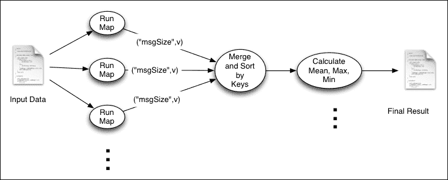
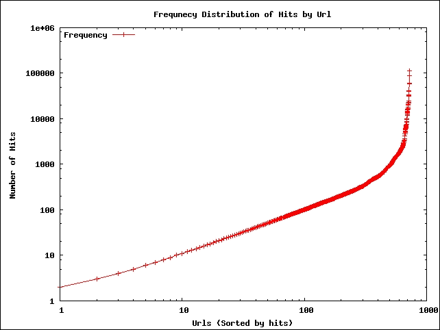
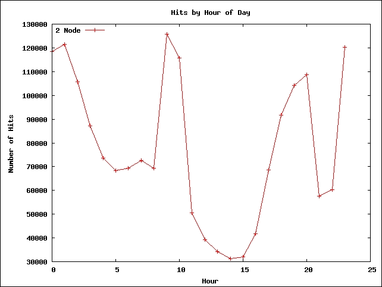
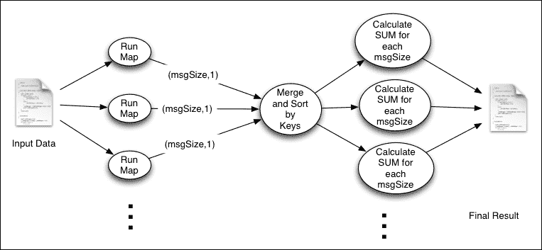
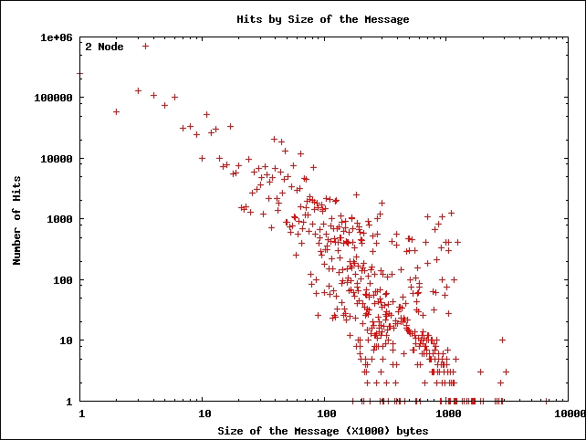
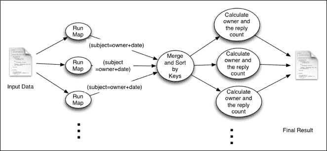
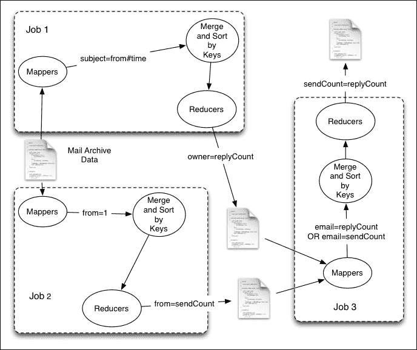
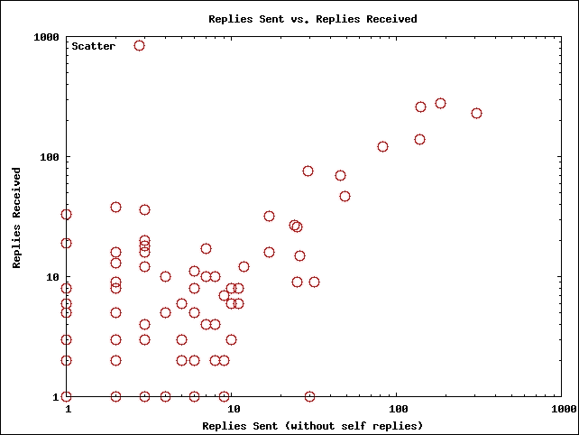

# 第五章分析

在本章中，我们将介绍以下食谱：

*   使用 MapReduce 进行简单分析
*   使用 MapReduce 执行分组
*   使用 MapReduce 计算频率分布和排序
*   使用 gnplot 绘制 Hadoop MapReduce 结果
*   使用 MapReduce 计算直方图
*   使用 MapReduce 计算散点图
*   使用 Hadoop 解析复杂数据集
*   使用 MapReduce 连接两个数据集

# 简介

在本章中，我们将讨论如何使用 Hadoop 处理数据集并了解其基本特征。 在后面的章节中，我们将介绍更复杂的方法，如数据挖掘、分类、聚类等等。

本章将介绍如何使用给定的数据集计算基本分析。 对于本章中的食谱，我们将使用两个数据集：

*   可在[http://ita.ee.lbl.gov/html/contrib/NASA-HTTP.html](http://ita.ee.lbl.gov/html/contrib/NASA-HTTP.html)获得的NASA 网络日志数据集是使用 NASA 网络服务器收到的请求收集的真实数据集。 您可以在此链接中找到此数据结构的说明。 在代码存储库的`chapter5/resources`文件夹中提供了可用于测试的该数据集的一个小摘录。
*   可从[http://tomcat.apache.org/mail/dev/](http://tomcat.apache.org/mail/dev/)获得的 Apache Tomcat 开发人员电子邮件归档列表。 这些档案是 mbox 格式的。

### 备注

本章的内容基于本书的上一版 Hadoop MapReduce Cookbook 的[章](06.html "Chapter 6. Hadoop Ecosystem – Apache Hive")，*分析*。 这一章是由合著者斯里纳特·佩雷拉(Srinath Perera)贡献的。

### 提示

**示例代码**

本书的示例代码文件位于 gihub 的[https://github.com/thilg/hcb-v2](https://github.com/thilg/hcb-v2)。 代码库的`chapter5`文件夹包含本章的示例源代码文件。

可以通过在代码库的`chapter5`文件夹中发出`gradle build`命令来编译示例代码。 Eclipse IDE 的项目文件可以通过在代码库的主文件夹中运行`gradle eclipse`命令来生成。 IntelliJ IDEA IDE 的项目文件可以通过在代码存储库的主文件夹中运行`gradle idea`命令来生成。

# 使用 MapReduce 进行简单分析

聚合指标(如平均值、最大值、最小值、标准偏差等)可提供数据集的基本概况。 您可以对整个数据集、数据集的子集或样本执行这些计算。

在本食谱中，我们将使用 Hadoop MapReduce 通过处理 Web 服务器的日志来计算 Web 服务器提供的文件的最小、最大和平均大小。 下图显示了此计算的执行流程：



如图所示，**Map**函数发出文件大小作为值，字符串`msgSize`作为键。 我们使用单个 Reduce 任务，所有中间键-值对都将发送到该 Reduce 任务。 然后，**Reduce**函数使用 Map 任务发出的信息计算聚合值。

## 做好准备

本配方假定您对 Hadoop MapReduce 的处理工作方式有基本的理解。 如果没有，请按照[第 1 章](01.html "Chapter 1. Getting Started with Hadoop v2")*《Hadoop v2*入门》中的*编写字数 MapReduce 应用程序、捆绑它并使用 Hadoop 本地模式*和*在分布式集群环境中使用 Hadoop v2*食谱设置 Hadoop 纱线。 您还需要安装可以正常工作的 Hadoop。

## 怎么做……

以下步骤介绍如何使用 MapReduce 计算有关博客数据集的简单聚合指标：

1.  从[ftp://ita.ee.lbl.gov/traces/NASA_access_log_Jul95.gz](ftp://ita.ee.lbl.gov/traces/NASA_access_log_Jul95.gz)下载博客数据集并将其解压缩。 让我们将提取的位置称为`<DATA_DIR>`。
2.  通过运行以下命令将提取的数据上传到 HDFS：

    ```scala
    $ hdfs dfs -mkdir data
    $ hdfs dfs -mkdir data/weblogs
    $ hdfs dfs –copyFromLocal \
    <DATA_DIR>/NASA_access_log_Jul95 \
    data/weblogs

    ```

3.  通过从源代码存储库的`chapter5`文件夹运行`gradle build`命令，编译本章的示例源代码。
4.  使用以下命令运行 MapReduce 作业：

    ```scala
    $ hadoop jar hcb-c5-samples.jar \
    chapter5.weblog.MsgSizeAggregateMapReduce \
    data/weblogs data/msgsize-out

    ```

5.  通过运行以下命令读取结果：

    ```scala
    $ hdfs dfs -cat data/msgsize-out/part*
    ….
    Mean    1150
    Max     6823936
    Min     0

    ```

## 它是如何工作的.

您可以从`chapter5/src/chapter5/weblog/MsgSizeAggregateMapReduce.java`中找到此配方的源文件。

HTTP 日志遵循如下标准模式。 最后一个标记是提供的网页的大小：

```scala
205.212.115.106 - - [01/Jul/1995:00:00:12 -0400] "GET /shuttle/countdown/countdown.html HTTP/1.0" 200 3985

```

我们将使用 Java 正则表达式来解析日志行，类顶部的`Pattern.compile()`方法定义正则表达式。 在编写文本处理 Hadoop 计算时，正则表达式是一个非常有用的工具：

```scala
public void map(Object key, Text value, Context context) … {
  Matcher matcher = httplogPattern.matcher(value.toString());
  if (matcher.matches()) {
    int size = Integer.parseInt(matcher.group(5));
    context.write(new Text("msgSize"), new IntWritable(size));
  }
}
```

映射任务将日志文件中的每一行作为不同的键-值对接收。 它使用正则表达式解析行，并发出以`msgSize`为键的值的文件大小。

然后，Hadoop 收集来自 Map 任务的所有输出键-值对，并调用 Reduce 任务。 Reducer 迭代所有值并计算从 Web 服务器提供的文件的最小、最大和平均大小。 值得注意的是，通过将值作为迭代器提供，Hadoop 允许我们在不将数据存储在内存中的情况下处理数据，从而允许减法器扩展到大型数据集。 只要有可能，您就应该处理`reduce`函数输入值，而不将它们存储在内存中：

```scala
public void reduce(Text key, Iterable<IntWritable> values,…{
  double total = 0;
  int count = 0;
  int min = Integer.MAX_VALUE;
  int max = 0;

  Iterator<IntWritable> iterator = values.iterator();
  while (iterator.hasNext()) {
    int value = iterator.next().get();
    total = total + value;
    count++;
    if (value < min)
      min = value;

    if (value > max)
      max = value;
  }
  context.write(new Text("Mean"),
    new IntWritable((int) total / count));
  context.write(new Text("Max"), new IntWritable(max));
  context.write(new Text("Min"), new IntWritable(min));
}
```

作业的`main()`方法与 wordcount 示例类似，不同之处在于突出显示的行已更改为以容纳输出数据类型：

```scala
job.setOutputKeyClass(Text.class);
job.setOutputValueClass(IntWritable.class);
```

## 还有更多...

您可以从 Java 教程[http://docs.oracle.com/javase/tutorial/essential/regex/](http://docs.oracle.com/javase/tutorial/essential/regex/)了解更多关于 Java 正则表达式的信息。

# 使用 MapReduce 执行分组

这个配方展示了如何使用 MapReduce将数据分组到简单的组中，并计算每个组的指标。 我们还将在此食谱中使用 Web 服务器的日志数据集。 此计算类似于`select page, count(*) from weblog_table group by page`SQL 语句。 下图显示了此计算的执行流程：


如图所示，**Map**任务发送请求的 URL 路径作为关键字。 然后，Hadoop 根据键对中间数据进行排序和分组。 给定键的所有值将被提供给单个 Reduce 函数调用，该函数将计算该 URL 路径的出现次数。

## 做好准备

本食谱假设您对 Hadoop MapReduce 处理的工作方式有基本的了解。

## 怎么做……

以下步骤显示了如何对 Web 服务器日志数据进行分组并计算分析：

1.  从[ftp://ita.ee.lbl.gov/traces/NASA_access_log_Jul95.gz](ftp://ita.ee.lbl.gov/traces/NASA_access_log_Jul95.gz)下载博客数据集并将其解压缩。 让我们将提取的位置称为`<DATA_DIR>`
2.  通过运行以下命令将提取的数据上传到 HDFS：

    ```scala
    $ hdfs dfs -mkdir data
    $ hdfs dfs -mkdir data/weblogs
    $ hdfs dfs –copyFromLocal \
    <DATA_DIR>/NASA_access_log_Jul95 \
    data/weblogs

    ```

3.  通过从源代码存储库的`chapter5`文件夹运行`gradle build`命令，编译本章的示例源代码。
4.  使用以下命令运行MapReduce 作业：

    ```scala
    $ hadoop jar hcb-c5-samples.jar \
    chapter5.weblog.HitCountMapReduce \
    data/weblogs data/hit-count-out

    ```

5.  Read the results by running the following command:

    ```scala
    $ hdfs dfs -cat data/hit-count-out/part*

    ```

    您将看到它将按如下方式打印结果：

    ```scala
    /base-ops/procurement/procurement.html  28
    /biomed/                                1
    /biomed/bibliography/biblio.html        7
    /biomed/climate/airqual.html            4
    /biomed/climate/climate.html            5
    /biomed/climate/gif/f16pcfinmed.gif     4
    /biomed/climate/gif/f22pcfinmed.gif     3
    /biomed/climate/gif/f23pcfinmed.gif     3
    /biomed/climate/gif/ozonehrlyfin.gif    3

    ```

## 它是如何工作的.

您可以从`chapter5/src/chapter5/HitCountMapReduce.java`中找到此食谱的来源。

如前面的食谱所述，我们将使用正则表达式来解析 Web 服务器日志并提取请求的 URL 路径。 例如，`/shuttle/countdown/countdown.html`将从以下示例日志条目中提取：

```scala
205.212.115.106 - - [01/Jul/1995:00:00:12 -0400] "GET /shuttle/countdown/countdown.html HTTP/1.0" 200 3985

```

以下代码段显示了映射器：

```scala
private final static IntWritable one = new IntWritable(1);
private Text word = new Text();
public void map(Object key, Text value, Context context) …… {
  Matcher matcher = httplogPattern.matcher(value.toString());
  if (matcher.matches()) {
    String linkUrl = matcher.group(4);
    word.set(linkUrl);
    context.write(word, one);
  }
}
```

Map任务将日志文件中的每一行作为个不同的键-值对接收。 映射任务使用正则表达式解析行，并发出链接作为键，数字`one`作为值。

然后，Hadoop 收集不同键(链接)的所有值，并为每个链接调用一次 Reducer。 然后，每个 Reducer 计算每个链接的点击数：

```scala
private IntWritable result = new IntWritable();
public void reduce(Text key, Iterable<IntWritable> values,… {
  int sum = 0;
  for (IntWritable val : values) {
    sum += val.get();
  }
  result.set(sum);
  context.write(key, result);
}
```

# 使用 MapReduce 计算频率分布和排序

**频率分布**是按升序排序的每个 URL 收到的命中数。 我们已经计算了前面配方中每个 URL 的点击数。 该配方将根据命中次数对该列表进行排序。

## 做好准备

本食谱假设您已经安装了可以正常工作的 Hadoop。 此配方将通过使用本章的 MapReduce 配方使用*执行组的结果。 如果你还没有这样做，那就遵循这个食谱。*

## 怎么做……

以下步骤说明如何使用 MapReduce 计算频率分布：

1.  使用以下命令运行 MapReduce 作业。 我们假设`data/hit-count-out`路径包含上一个配方

    ```scala
    $ bin/hadoop jar hcb-c5-samples.jar \
    chapter5.weblog.FrequencyDistributionMapReduce \
    data/hit-count-out data/freq-dist-out

    ```

    的`HitCountMapReduce`计算的输出
2.  Read the results by running the following command:

    ```scala
    $ hdfs dfs -cat data/freq-dist-out/part*

    ```

    您将看到它将打印类似于以下内容的结果：

    ```scala
    /cgi-bin/imagemap/countdown?91,175      12
    /cgi-bin/imagemap/countdown?105,143     13
    /cgi-bin/imagemap/countdown70?177,284   14

    ```

## 它是如何工作的.

本章的*执行组使用 MapReduce*配方计算每个 URL 路径收到的命中数。 MapReduce 在调用`reduce`函数之前按键对 Map 输出的中间键-值对进行排序。 在本菜谱中，我们使用此排序功能根据命中次数对数据进行排序。

您可以从`chapter5/src/chapter5/FrequencyDistributionMapReduce.java`中找到此食谱的来源。

映射任务输出命中次数作为键，输出 URL 路径作为值：

```scala
public void map(Object key, Text value, Context context) …… {
  String[] tokens = value.toString().split("\\s");
  context.write(new IntWritable(Integer.parseInt(tokens[1])),
  new Text(tokens[0]));
}
```

Reduce 任务接收按键(命中次数)排序的键-值对：

```scala
public void reduce(IntWritable key, Iterable<Text> values, …… {
  Iterator<Text> iterator = values.iterator();
  while (iterator.hasNext()) {
  context.write(iterator.next(), key);
  }
}
```

为了确保结果的全局排序，我们在此计算中只使用了一个 Reduce 任务。

## 还有更多...

通过利用 Hadoop`TotalOrderPartitioner`，即使使用多个 Reduce 任务，也可以实现全局排序。 有关`TotalOrderPartitioner`的更多信息，请参考[章](04.html "Chapter 4. Developing Complex Hadoop MapReduce Applications")，*开发复杂 Hadoop MapReduce 应用程序的*Hadoop 中间数据分区*配方。*

# 使用 gnplot 绘制 Hadoop MapReduce 结果

虽然Hadoop MapReduce 作业可以生成有趣的分析，但理解这些结果并详细了解数据通常需要我们看到数据的总体趋势。 人眼非常擅长检测模式，绘制数据往往能加深对数据的理解。 因此，我们经常使用绘图程序来绘制 Hadoop 作业的结果。

本食谱解释了如何使用 gnplot，这是一个免费且功能强大的绘图程序，用于绘制 Hadoop 结果。

## 做好准备

本方法假定您遵循了前面的方法，即*计算频率分布并使用 MapReduce*进行排序。 如果你还没有做到这一点，请遵循下面的食谱。 按照[http://www.gnuplot.info/](http://www.gnuplot.info/)中的说明安装 GNOUPLOT 绘图程序。

## 怎么做……

以下步骤显示了如何使用 gnplot 绘制 Hadoop 作业结果：

1.  通过运行以下命令将上一个配方的结果下载到本地计算机：

    ```scala
    $ hdfs dfs -copyToLocal data/freq-dist-out/part-r-00000 2.data

    ```

2.  将`chapter5/plots`文件夹中的所有`*.plot`文件复制到下载数据的位置。
3.  通过运行以下命令生成绘图：

    ```scala
    $ gnuplot httpfreqdist.plot

    ```

4.  It will generate a file called `freqdist.png`, which will look like the following:

    

前面的图是以对数-对数比例绘制的，分布的第一部分遵循**Zipf**(幂律)分布，这是 Web 中常见的分布。 最后几个最受欢迎的链接的费率比 Zipf 发行版的预期要高得多。

有关此发行版的更多细节的讨论超出了本书的范围。 然而，这个曲线图展示了我们通过绘制分析结果可以获得的洞察力。 在未来的大多数食谱中，我们将使用 gnplot 来绘制和分析结果。

## 它是如何工作的.

以下步骤描述了使用 gnplot 进行绘图的工作原理：

*   您可以从`chapter5/plots/httpfreqdist.plot`找到 gnplot 文件的源代码。 绘图的来源如下所示：

    ```scala
    set terminal png
    set output "freqdist.png"

    set title "Frequnecy Distribution of Hits by Url";
    set ylabel "Number of Hits";
    set xlabel "Urls (Sorted by hits)";
    set key left top
    set log y
    set log x

    plot"2.data" using 2 title "Frequency" with linespoints
    ```

*   这里，前两行定义了输出格式。 本例使用 PNG，但 gnplot 支持许多其他终端，如 Screen、PDF、EPS 等。
*   接下来的四行定义了轴标签和标题。
*   接下来的两条线定义了每个轴的比例，此图对两个轴都使用对数比例。
*   最后一行定义了情节。 这里，它要求 gnplot 从`2.data`文件中读取数据，通过`using 2`使用文件第二列中的数据，并使用线条绘制它。 列之间必须用空格分隔。
*   在这里，如果您想要绘制一列与另一列的关系图，例如，列`1`中的数据与列`2`之间的关系，则应编写`using 1:2`而不是`using 2`。

## 还有更多...

您可以从[http://www.gnuplot.info/](http://www.gnuplot.info/)了解有关 gnplot 的更多信息。

# 使用 MapReduce 计算直方图

数据集的另一个有趣的视图是**直方图**。 直方图仅在连续维度(例如，访问时间和文件大小)下的有意义。 它将事件的发生次数分组到维度中的多个组中。 例如，在这个食谱中，如果我们将访问时间作为维度，那么我们将按小时对访问时间进行分组。

下图显示了此计算的执行摘要。 映射器发出访问小时作为键，**1**作为值。 然后，每个`reduce`函数调用接收一天中个特定小时的所有事件，并计算该小时的总事件数。


## 做好准备

本食谱假设您已经安装了可以正常工作的 Hadoop。 安装 gnplot。

## 怎么做……

以下步骤显示如何计算和绘制直方图：

1.  从[ftp://ita.ee.lbl.gov/traces/NASA_access_log_Jul95.gz](ftp://ita.ee.lbl.gov/traces/NASA_access_log_Jul95.gz)下载博客数据集并将其解压。
2.  通过运行以下命令将提取的数据上传到 HDFS：

    ```scala
    $ hdfs dfs -mkdir data
    $ hdfs dfs -mkdir data/weblogs
    $ hdfs dfs –copyFromLocal \
    <DATA_DIR>/NASA_access_log_Jul95 \
    data/weblogs

    ```

3.  通过从源代码存储库的`chapter5`文件夹运行`gradle build`命令，编译本章的示例源代码。
4.  使用以下命令运行 MapReduce 作业：

    ```scala
    $ hadoop jar hcb-c5-samples.jar \
    chapter5.weblog.HistogramGenerationMapReduce \
    data/weblogs data/histogram-out

    ```

5.  通过运行以下命令检查结果：

    ```scala
    $ hdfs dfs -cat data/histogram-out/part*

    ```

6.  通过运行以下命令将结果下载到本地计算机：

    ```scala
    $ hdfs dfs -copyToLocal data/histogram-out/part-r-00000 3.data

    ```

7.  将`chapter5/plots`文件夹中的所有`*.plot`文件复制到下载数据的位置。
8.  通过运行以下命令生成绘图：

    ```scala
    $gnuplot httphistbyhour.plot

    ```

9.  It will generate a file called `hitsbyHour.png`, which will look like the following:

    

## 它是如何工作的.

您可以从`chapter5/src/chapter5/weblog/HistogramGenerationMapReduce.java`中找到此食谱的源代码。 与本章前面的配方类似，我们使用正则表达式来解析日志文件，并从日志文件中提取访问时间。

下面的代码段显示了`map`函数：

```scala
public void map(Object key, Text value, Context context) … {
  try {
    Matcher matcher = httplogPattern.matcher(value.toString());
    if (matcher.matches()) {
      String timeAsStr = matcher.group(2);
      Date time = dateFormatter.parse(timeAsStr);
      Calendar calendar = GregorianCalendar.getInstance();
      calendar.setTime(time);
      int hour = calendar.get(Calendar.HOUR_OF_DAY);
      context.write(new IntWritable(hour), one);
    }
  } ……
}
```

`map`函数提取每个网页访问的访问时间，并从访问时间中提取一天中的小时数。 它发出一天中的小时作为键，`one`作为值。

然后，Hadoop 收集所有键-值对，对它们进行排序，然后为每个键调用一次 Reduce 函数。 减少任务计算每小时的总页面浏览量：

```scala
public void reduce(IntWritable key, Iterable<IntWritable> values,..{
  int sum = 0;
  for (IntWritable val : values) {
    sum += val.get();
  }
  context.write(key, new IntWritable(sum));
}
```

# 使用 MapReduce 计算散点图

分析数据时的另一个有用工具是**散点图**，它可用于查找两个测量(尺寸)之间的关系。 它将这两个维度相互对比。

例如，此配方分析数据以找出网页大小和网页接收到的点击量之间的关系。

下图显示了此计算的执行摘要。 这里，`map`函数计算并发出消息大小(四舍五入为 1024 字节)作为键，`one`作为值。 然后，Reducer 计算每个邮件大小的出现次数：



## 做好准备

本食谱假设您已经安装了可以正常工作的 Hadoop。 安装 gnplot。

## 怎么做……

以下步骤说明如何使用 MapReduce 计算两个数据集之间的相关性：

1.  从[ftp://ita.ee.lbl.gov/traces/NASA_access_log_Jul95.gz](ftp://ita.ee.lbl.gov/traces/NASA_access_log_Jul95.gz)下载博客数据集并将其解压。
2.  通过运行以下命令将提取的数据上传到 HDFS：

    ```scala
    $ hdfs dfs -mkdir data
    $ hdfs dfs -mkdir data/weblogs
    $ hdfs dfs –copyFromLocal \
    <DATA_DIR>/NASA_access_log_Jul95 \
    data/weblogs

    ```

3.  通过从源代码存储库的`chapter5`文件夹运行`gradle build`命令，编译本章的示例源代码。
4.  使用以下命令运行MapReduce 作业：

    ```scala
    $ hadoop jar hcb-c5-samples.jar \
    chapter5.weblog.MsgSizeScatterMapReduce \
    data/weblogs data/scatter-out

    ```

5.  通过运行以下命令检查结果：

    ```scala
    $ hdfs dfs -cat data/scatter-out/part*

    ```

6.  通过从`HADOOP_HOME`运行以下命令将上一个配方的结果下载到本地计算机：

    ```scala
    $ hdfs dfs –copyToLocal data/scatter-out/part-r-00000 5.data

    ```

7.  将`chapter5/plots`文件夹中的所有`*.plot`文件复制到下载数据的位置。
8.  通过运行以下命令生成绘图：

    ```scala
    $ gnuplot httphitsvsmsgsize.plot

    ```

9.  It will generate a file called `hitsbymsgSize.png`, which will look like the following image:

    

图显示命中次数与日志范围中消息大小之间的负相关关系。

## 它是如何工作的.

您可以从`chapter5/src/chapter5/MsgSizeScatterMapReduce.java`中找到食谱的来源。

以下代码段显示了`map`函数：

```scala
public void map(Object key, Text value, Context context) …… {
  Matcher matcher = httplogPattern.matcher(value.toString());
  if (matcher.matches()) {
    int size = Integer.parseInt(matcher.group(5));
    context.write(new IntWritable(size / 1024), one);
  }
}
```

映射任务解析日志条目，并发出以千字节为关键字、以`one`为值的文件大小。

每个Reducer 遍历值，并计算每个文件大小的页面访问次数：

```scala
public void reduce(IntWritable key, Iterable<IntWritable> values,……{
  int sum = 0;
  for (IntWritable val : values) {
    sum += val.get();
  }
  context.write(key, new IntWritable(sum));
}
```

# 使用 Hadoop 解析复杂数据集

到目前为止，我们使用的个数据集在行中包含一个数据项，这使得我们可以使用 Hadoop 默认解析支持来解析这些数据集。 但是，某些数据集具有更复杂的格式，其中单个数据项可能跨越多行。 在本食谱中，我们将分析 Tomcat 开发人员的邮件列表归档。 在存档中，每封电子邮件都由多行存档文件组成。 因此，我们将编写一个自定义 Hadoop InputFormat 来处理电子邮件归档。

此配方解析复杂的电子邮件列表归档，并找到所有者(启动该线程的人)和每个电子邮件线程收到的回复数量。

下图显示了此计算的执行摘要。 **Map**函数发出邮件主题作为关键字，将发送者的电子邮件地址与日期相结合作为值。 然后，Hadoop 按照电子邮件主题对数据进行分组，并将与该线程相关的所有数据发送到同一 Reducer。



然后，Reduce 任务标识每个电子邮件线程的创建者以及每个线程接收的回复数量。

## 做好准备

本食谱假设您已经安装了可以正常工作的 Hadoop。

## 怎么做……

以下步骤介绍如何通过编写输入格式化程序，使用 Hadoop 解析数据格式复杂的 Tomcat 电子邮件列表数据集：

1.  从[http://tomcat.apache.org/mail/dev/](http://tomcat.apache.org/mail/dev/)下载并解压缩 2012 年的 Apache Tomcat 开发人员列表电子邮件存档。 我们将目标文件夹称为`DATA_DIR`。
2.  通过运行以下命令将提取的数据上传到 HDFS：

    ```scala
    $ hdfs dfs -mkdir data
    $ hdfs dfs -mkdir data/mbox
    $ hdfs dfs –copyFromLocal \
    <DATA_DIR>/* \
    data/mbox

    ```

3.  通过从源代码存储库的`chapter5`文件夹运行`gradle build`命令，编译本章的示例源代码。
4.  使用以下命令运行 MapReduce 作业：

    ```scala
    $ hadoop jar hcb-c5-samples.jar \
    chapter5.mbox.CountReceivedRepliesMapReduce \
    data/mbox data/count-replies-out

    ```

5.  通过运行以下命令检查结果：

    ```scala
    $ hdfs dfs -cat data/count-replies-out/part*

    ```

## 它是如何工作的.

正如前面解释的那样，此数据集具有跨多行的数据项。 因此，我们必须编写自定义 InputFormat 和自定义 RecordReader 来解析数据。 此配方的源代码文件是源代码存档的`chapter5/src/chapter5/mbox`目录中的`CountReceivedRepliesMapReduce.java`、`MBoxFileInputFormat.java`和 `MBoxFileReader.java`文件。

我们通过 Hadoop 驱动程序将新的 InputFormat 添加到 Hadoop 作业中，如以下代码片段中突出显示的那样：

```scala
Job job = Job.getInstance(getConf(), "MLReceiveReplyProcessor");
job.setJarByClass(CountReceivedRepliesMapReduce.class);
job.setMapperClass(AMapper.class);
job.setReducerClass(AReducer.class);
job.setNumReduceTasks(numReduce);

job.setOutputKeyClass(Text.class);
job.setOutputValueClass(Text.class);
job.setInputFormatClass(MBoxFileInputFormat.class);
FileInputFormat.setInputPaths(job, new Path(inputPath));
FileOutputFormat.setOutputPath(job, new Path(outputPath));

int exitStatus = job.waitForCompletion(true) ? 0 : 1;
```

如以下代码所示，新的格式化程序创建了一个 RecordReader，Hadoop 使用它来读取 Map 任务的键-值对输入：

```scala
public class MboxFileFormat extends FileInputFormat<Text, Text>{
  private MBoxFileReaderboxFileReader = null;
  public RecordReader<Text, Text> createRecordReader(
  InputSplit inputSplit, TaskAttemptContext attempt) …{
    fileReader = new MBoxFileReader();
    fileReader.initialize(inputSplit, attempt);
    return fileReader;
  }
}
```

下面的代码片段显示了 RecordReader 的功能：

```scala
public class MBoxFileReader extends RecordReader<Text, Text> {

  public void initialize(InputSplitinputSplit, … {
    Path path = ((FileSplit) inputSplit).getPath();
    FileSystem fs = FileSystem.get(attempt.getConfiguration());
    FSDataInputStream fsStream = fs.open(path);
    reader = new BufferedReader(new InputStreamReader(fsStream));
  }
  public Boolean nextKeyValue() ……{
    if (email == null) {
    return false;
  }
  count++;
  while ((line = reader.readLine()) != null) {
    Matcher matcher = pattern1.matcher(line);
    if (!matcher.matches()) {
      email.append(line).append("\n");
    } else {
      parseEmail(email.toString());
      email = new StringBuffer();
      email.append(line).append("\n");
      return true;
    }
  }
  parseEmail(email.toString());
  email = null;
  return true;
}
………
```

RecordReader 的`nextKeyValue()`方法解析文件，并生成键-值对以供 Map 任务使用。 每个值具有由`#`字符分隔的每个电子邮件的、*主题*和*时间*的*。*

以下代码片段显示了 Map 任务源代码：

```scala
public void map(Object key, Text value, Context context) …… {
  String[] tokens = value.toString().split("#");
  String from = tokens[0];
  String subject = tokens[1];
  String date = tokens[2].replaceAll(",", "");
  subject = subject.replaceAll("Re:", "");
  context.write(new Text(subject), new Text(date + "#" + from));
}
```

映射任务将存档文件中的每封电子邮件作为单独的键-值对接收。 它通过用`#`打断行来解析它，并发出`subject`作为键，`time`和`from`作为值。

然后，Hadoop 收集所有键-值对，对它们进行排序，然后为每个键调用 Reducer 一次。 由于我们使用电子邮件主题作为键，因此每次 Reduce 函数调用都将接收有关单个电子邮件线程的所有信息。 然后，Reduce 功能将分析一个线程的所有电子邮件，并找出谁发送了第一封电子邮件，每个邮件线程收到了多少回复，如下所示：

```scala
public void reduce(Text key, Iterable<Text> values, …{
  TreeMap<Long, String>replyData = new TreeMap<Long, String>();

  for (Text val : values) {
    String[] tokens = val.toString().split("#");
    if(tokens.length != 2)
    throw new IOException("Unexpected token "+ val.toString());

    String from = tokens[1];
    Date date = dateFormatter.parse(tokens[0]);
    replyData.put(date.getTime(), from);
  }

  String owner = replyData.get(replyData.firstKey());
  Int replyCount = replyData.size();

  Int selfReplies = 0;
  for(String from: replyData.values()){
    if(owner.equals(from)){
      selfReplies++;
    }
  }
  replyCount = replyCount - selfReplies;
  context.write(new Text(owner),
  new Text(replyCount+"#" + selfReplies));
}
```

## 还有更多...

有关实现自定义 InputFormats 的更多信息，请参考[第 4 章](04.html "Chapter 4. Developing Complex Hadoop MapReduce Applications")，*开发复杂 Hadoop MapReduce 应用程序*的*添加对新输入数据格式的支持-实现自定义 InputFormat*配方。

# 使用 MapReduce 连接两个数据集

正如我们已经观察到的，Hadoop 在读取数据集和计算分析方面非常擅长。 但是，我们经常需要合并两个数据集来分析数据。 本食谱将解释如何使用 Hadoop 连接两个数据集。

例如，本食谱将使用 Tomcat 开发人员档案数据集。 开放源码社区中的一个共同信念是，开发人员参与社区的程度越高(例如，通过回复项目邮件列表中的电子邮件线程和帮助他人等等)，他们就会越快地收到对他们的查询的响应。 在本食谱中，我们将使用 Tomcat 开发人员邮件列表来验证这一假设。

为了验证这一假设，我们将运行 MapReduce 作业，如下图所述：



我们将使用 Mbox 格式的电子邮件存档，并使用前面菜谱中解释的自定义 InputFormat 和 RecordReader 来解析它们。 映射任务将接收电子邮件发件人(发件人)、电子邮件主题和电子邮件发送时间作为输入。

1.  在第一个作业中，`map`函数将发出主题作为键，发送者的电子邮件地址和时间作为值。 然后，Reducer 步骤将接收具有相同主题的所有值，并输出主题作为键，所有者和回复计数作为值。 我们在上一份食谱中执行了这项工作。
2.  在第二个作业中，`map`函数发出发送者的电子邮件地址作为键，`one`作为值。 然后，Reducer 步骤将接收从同一地址发送到同一 Reducer 的所有电子邮件。 使用此数据，每个 Reducer 将发出电子邮件地址作为关键字，并将从该电子邮件地址发送的电子邮件数量作为值。
3.  最后，第三个作业读取前两个作业的输出，连接结果，并发出每个电子邮件地址发送的电子邮件数和每个电子邮件地址接收的回复数作为输出。

## 做好准备

本食谱假设您已经安装了可以正常工作的 Hadoop。 遵循*使用 Hadoop*配方解析复杂数据集。 我们将在以下步骤中使用该配方的输入数据和输出数据。

## 怎么做……

以下步骤显示如何使用 MapReduce 连接两个数据集：

1.  按照*使用 Hadoop*配方解析复杂数据集来运行`CountReceivedRepliesMapReduce`计算。
2.  使用以下命令运行第二个 MapReduce 作业：

    ```scala
    $ hadoop jar hcb-c5-samples.jar \
    chapter5.mbox.CountSentRepliesMapReduce \
    data/mbox data/count-emails-out

    ```

3.  使用以下命令检查结果：

    ```scala
    $ hdfs dfs -cat data/count-emails-out/part*

    ```

4.  创建一个新文件夹`join-input`，并将早期作业的两个结果复制到 HDFS 中的该文件夹：

    ```scala
    $ hdfs dfs -mkdir data/join-input
    $ hdfs dfs -cp \
    data/count-replies-out/part-r-00000 \
    data/join-input/1.data
    $ hdfs dfs -cp \
    data/count-emails-out/part-r-00000 \
    data/join-input/2.data

    ```

5.  使用以下命令运行第三个 MapReduce 作业：

    ```scala
    $ hadoop jar hcb-c5-samples.jar \
    chapter5.mbox.JoinSentReceivedReplies \
    data/join-input data/join-out

    ```

6.  通过运行以下命令将步骤 5 的结果下载到本地计算机：

    ```scala
    $ hdfs dfs -copyToLocal data/join-out/part-r-00000 8.data

    ```

7.  将`chapter5/plots`文件夹中的所有`*.plot`文件复制到下载数据的位置。
8.  通过运行以下命令生成绘图：

    ```scala
    $ gnuplot sendvsreceive.plot

    ```

9.  It will generate a file called `sendreceive.png`, which will look like the following:

    

图证实了我们的假设，和前面的一样，数据近似遵循幂律分布。

## 它是如何工作的.

您可以在`chapter5/src/chapter5/mbox/CountSentRepliesMapReduce.java`和`chapter5/src/chapter5/mbox/JoinSentReceivedReplies.java`中找到此食谱的源代码。 我们已经讨论了前面食谱中的第一项工作。

下面的代码片段显示了第二个作业的`map`函数。 它接收发件人的电子邮件、主题和时间(以`#`分隔)作为输入，解析输入并输出发件人的电子邮件作为关键字，将电子邮件发送的时间作为值：

```scala
public void map(Object key, Text value, Context context) ……{
  String[] tokens = value.toString().split("#");
  String from = tokens[0];
  String date = tokens[2];
  context.write(new Text(from), new Text(date));
}
```

下面的代码片段显示了第二个作业的`reduce`函数。 每个`reduce`函数调用接收一个发送者发送的所有电子邮件的时间。 Reducer 计算每个发送者发送的回复数，输出发送者的名称作为关键字，并输出发送的回复数作为值：

```scala
public void reduce(Text key, Iterable<Text> values, ……{
  int sum = 0;
  for (Text val : values) {
    sum = sum +1;
  }
  context.write(key, new IntWritable(sum));
}
```

下面的代码片段显示了第三个作业的`map`函数。 它读取第一个和第二个作业的输出，并将它们输出为键-值对：

```scala
public void map(Object key, Text value, …… {
  String[] tokens = value.toString().split("\\s");
  String from = tokens[0];
  String replyData = tokens[1];
  context.write(new Text(from), new Text(replyData));
}
```

下面的代码片段显示了第三个作业的`reduce`函数。 由于第一个和第二个作业的输出具有相同的键，因此给定用户发送的回复数和接收的回复数将由同一 Reducer 处理。 `reduce`函数删除自回复，并将发送的回复数和接收的回复数作为键和值输出，从而连接两个数据集：

```scala
public void reduce(Text key, Iterable<Text> values, …… {
  StringBuffer buf = new StringBuffer("[");
  try {
    int sendReplyCount = 0;
    int receiveReplyCount = 0;
    for (Text val : values) {
      String strVal = val.toString();
      if(strVal.contains("#")){
        String[] tokens = strVal.split("#");
        int repliesOnThisThread =Integer.parseInt(tokens[0]);
        int selfRepliesOnThisThread = Integer.parseInt(tokens[1]);
        receiveReplyCount = receiveReplyCount + repliesOnThisThread;
        sendReplyCount = sendReplyCount–selfRepliesOnThisThread;
      }else{
        sendReplyCount = sendReplyCount + Integer.parseInt(strVal);
      }
    }

    context.write(new IntWritable(sendReplyCount),
    new IntWritable(receiveReplyCount));
    buf.append("]");
  } …
}
```

最后一个作业是使用 MapReduce连接两个数据集的示例。 其思想是将需要在同一关键字下联接的所有值发送到同一 Reducer，并在那里联接数据。