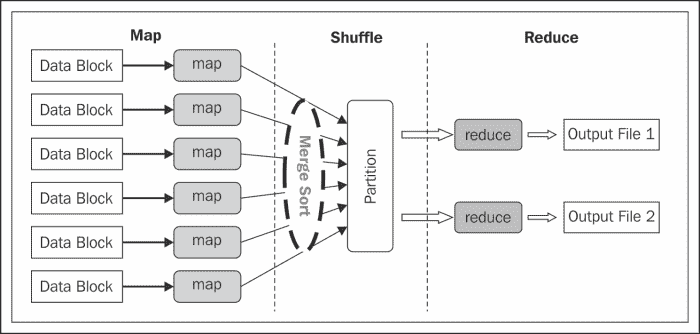

# 一、大数据和 Hadoop

在本章中，我们将介绍：

*   定义大数据问题
*   构建基于 Hadoop 的大数据平台
*   从 Hadoop 备选方案中选择

# 简介

如今，许多组织都面临着**大数据**问题。 管理和处理大数据可能会给关系数据库系统等传统数据处理平台带来很多挑战。 Hadoop 被设计为**分布式**和**可伸缩**系统，用于处理大数据问题。

大数据平台的设计、实施和部署需要系统架构师和管理员明确定义大数据问题。 基于 Hadoop 的大数据平台使用 Hadoop 作为数据存储和处理引擎。 它通过将大数据输入转换为预期输出来解决问题。 一方面，大数据问题决定了应该如何设计大数据平台，比如应该将哪些模块或子系统集成到平台中等等。 另一方面，平台的架构设计决定了平台的复杂度和效率。

不同的大数据问题具有不同的属性。 基于 Hadoop 的大数据平台能够处理大多数大数据问题，但可能不适合其他平台。 由于这些和许多其他原因，我们需要从 Hadoop 替代方案中进行选择。

# 定义大数据问题

通常，大数据的定义是大型数据，超出了常用软件工具在可容忍的运行时间内**收集**、**管理**和**处理**的能力。 更正式地说，大数据的定义应该超越数据的大小，包括其他属性。 在本食谱中，我们将以正式的方式概述定义大数据的属性。

## 做好准备

理想情况下，数据具有以下三个重要属性：**体积**、**速度**和**变化**。 在本书中，我们将大数据的**值**属性视为第四个重要属性。 而且，Value 属性也解释了大数据问题存在的原因。

## How to Do It…

定义大数据问题涉及以下步骤：

1.  Estimate the volume of data. The volume should not only include the current data volume, for example in gigabytes or terabytes, but also should include the expected volume in the future.

    现实世界中有两种类型的数据：**静态**和**非静态**数据。 静态数据的数量，例如国家人口普查数据和人类基因组数据，不会随着时间的推移而改变。 而对于非静态数据，例如流式日志数据和社交网络流式数据，容量会随着时间的推移而增加。

2.  Estimate the velocity of data. The velocity estimate should include how much data can be generated within a certain amount of time, for example during a day. For static data, the velocity is zero.

    大数据的速度属性定义了可以生成数据的速度。 此属性不仅会影响数据量，还会决定数据处理系统处理数据的速度。

3.  Identify the data variety. In other words, the data variety means the different sources of data, such as web click data, social network data, data in relational databases, and so on.

    多样性意味着数据在语法或语义上是不同的。 不同之处在于需要将针对每种数据类型专门设计的模块集成到大数据平台中。 例如，从 Web 获取数据需要网络爬虫，需要数据转换模块将数据从关系型数据库传输到非关系型大数据平台。

4.  Define the expected value of data.

    大数据的价值属性定义了我们可以从中获得什么以及如何使用大数据。 例如，可以从在线点击数据中挖掘频繁项目集，以便更好地营销和更有效地部署广告。

## …的工作原理

大数据平台可以用 IPO([http://en.wikipedia.org/wiki/IPO_Model](http://en.wikipedia.org/wiki/IPO_Model))模型来描述，该模型包括三个组件：**输入**、**流程**、**输出**。 对于大数据问题，体积、速度和种类属性一起定义系统的输入，值属性定义输出。

## 另请参阅

*   *构建基于 Hadoop 的大数据平台*秘诀

# 构建基于 Hadoop 的大数据平台

**Hadoop**于 2006 年在雅虎首次作为大数据处理系统开发。 这个想法是基于 Google 的 MapReduce，它最初是由 Google 基于其专有的 MapReduce 实现发布的。 在过去的几年中，Hadoop 已经成为部署大数据应用的广泛使用的平台和运行时环境。 在本食谱中，我们将概述构建基于 Hadoop 的大数据平台的步骤。

## 做好准备

Hadoop 被设计为**并行**和**弹性**。 它通过利用由商用硬件组成的计算资源的强大功能，重新定义了管理和处理数据的方式。 并且它可以自动从故障中恢复。

## How to Do It…

使用以下步骤构建基于 Hadoop 的大数据平台：

1.  Design, implement, and deploy **data collection** or **aggregation** subsystems. The subsystems should transfer data from different data sources to Hadoop-compatible data storage systems such as **HDFS** and **HBase**.

    子系统需要根据大数据问题的输入属性(包括数量、速度和种类)进行设计。

2.  设计、实施和部署 Hadoop 大数据处理平台。 平台应使用 HDFS 或 HBase 上的大数据，并产生预期且有价值的输出。
3.  设计、实施和部署结果交付子系统。 交付子系统应将分析结果从与 Hadoop 兼容的格式转换为适合最终用户的格式。 例如，我们可以将 Web 应用设计为使用图表、图形或其他类型的动态 Web 应用来可视化分析结果。

## …的工作原理

下图描述了基于 Hadoop 的大数据系统的体系结构：

虽然 Hadoop 借鉴了 Google 的 MapReduce 的想法，但它不仅仅是 MapReduce。 典型的基于 Hadoop 的大数据平台包括**Hadoop 分布式文件系统**(**HDFS**)、并行计算框架(**MapReduce**)、通用实用程序、面向列的数据存储表(**HBase**)、高级数据管理系统(**Pig**和**Hie**)、大数据分析库(**Mah.。 分布式协调系统(**ZooKeeper**)、工作流管理模块(**Oozie**)、诸如**Sqoop**的数据传输模块、诸如**Flume**的数据聚集模块以及诸如**Avro**的数据串行化模块。**

HDFS 是 Hadoop 的默认文件系统。 它被设计为提供对应用数据的高吞吐量访问的分布式文件系统。 HDFS 上的数据存储为数据块。 在几个计算节点上复制数据块，并计算它们的校验和。 如果出现校验和错误或系统故障，可以从位于其他节点上的备份块恢复错误或丢失的数据块。

MapReduce 提供了一个编程模型，可以将复杂的计算转换为一组**键-值**对上的计算。 它通过调度作业、监视活动和重新执行失败的任务来协调节点集群上的任务处理。

在典型的 MapReduce 作业中，从节点上的多个映射任务并行执行，生成在本地计算机上缓冲的结果。 一旦部分或全部映射任务完成，**Shuffle**过程就开始了，该过程通过基于键排序和组合键-值对来聚合映射任务输出。 然后，最常见的是通过网络将洗牌后的数据分区复制到减速机。 然后，Reduce 任务将在混洗后的数据上运行，并生成最终结果(如果多个连续的 MapReduce 作业是流水线的，则为中间结果)。 作业完成后，最终结果将存储在多个文件中，具体取决于作业中使用的减速机数量。 工作流程的剖析可以在下面的图表中描述：

## 还有更多...

HDFS 有两种类型的节点：**NameNode**和**DataNode**。 NameNode 跟踪文件系统元数据，如数据块的位置。 出于效率原因，元数据保存在主机器的主存储器中。 DataNode 保存物理数据块，并与客户端通信以读取和写入数据。 此外，它还定期向集群中的 NameNode 报告其主存数据块的列表，以进行验证和验证。

MapReduce 框架有两种类型的节点，**主**节点和**从**节点。 **JobTracker**是主节点上的守护进程，**TaskTracker**是从节点上的守护进程。 主节点是 MapReduce 作业的管理器节点。 它将作业拆分成较小的任务，这些任务将由 JobTracker 分配给从节点上的 TaskTracker 运行。 当从节点接收到任务时，其 TaskTracker 将派生一个 Java 进程来运行该任务。 同时，TaskTracker 还负责跟踪和报告个别任务的进度。

### Hadoop 公共

Hadoop Common是用于基于 Hadoop 的大数据平台基础的组件和接口的集合。 它提供以下组件：

*   分布式文件系统和 I/O 操作接口
*   通用并行计算接口
*   （木材）采运作业
*   安全管理

### Apache HBase

Apache HBase是一个开源、分布式、版本化和面向列的数据存储。 它构建在 Hadoop 和 HDFS 之上。 HBase 支持随机、实时访问大数据。 它可以扩展到托管非常大的表，包含数十亿行和数百万列。 有关 HBase 的更多文档可以从[http://hbase.apache.org](http://hbase.apache.org)获得。

### Apache Mahout

Apache Mahout 是一个基于 Hadoop 的开源可伸缩机器学习库。 它有一个非常活跃的社区，而且还在发展中。 目前，该库支持四种用例：**推荐挖掘**、**聚类**、**分类**和**频繁项集挖掘**。 有关 Mahout 的更多文档可以从[http://mahout.apache.org](http://mahout.apache.org)获取。

### ApachePIG

Apache Pig是一个表达大数据分析程序的高级系统。 它通过将 Pig 语句编译成一系列 MapReduce 作业来支持大数据。 Pigg 使用**Pig****拉丁语**作为编程语言，可扩展且易于使用。 有关PIG的更多文档，请参阅[http://pig.apache.org](http://pig.apache.org)。

### ApacheHive

Apache Have是一个高级系统，用于管理和分析存储在基于 Hadoop 的系统中的大数据。 它使用一种类似 SQL 的语言，称为**HiveQL**。 与 Apache Pig 类似，配置单元运行时引擎将 HiveQL 语句转换为一系列 MapReduce 作业以供执行。 有关Hive的更多信息，请参阅[http://hive.apache.org](http://hive.apache.org)。

### Apache动物园管理员

Apache zooKeeper是一个用于大规模分布式系统的集中式协调服务。 它维护配置和命名信息，并为分布式系统中的应用提供分布式同步和组服务。 有关 ZooKeeper 的更多文档可以从[http://zookeeper.apache.org](http://zookeeper.apache.org)获得。

### Apache Oozie

Apache oozie是一个可伸缩的**工作流****管理**和**协调****服务**，用于 Hadoop 作业。 它具有数据感知能力，并根据作业的依赖关系协调作业。 此外，Oozie 已经与 Hadoop 集成，可以支持所有类型的 Hadoop 作业。 有关 Oozie 的更多信息可以从[http://oozie.apache.org](http://oozie.apache.org)获得。

### ====___ApacheSqop

Apache Sqoop是用于在 Apache Hadoop 和结构化数据存储(如关系数据库)之间移动数据的工具。 它提供命令行套件来将数据从关系数据库传输到 HDFS，反之亦然。 有关 Apache Sqoop的更多信息，请参阅[http://sqoop.apache.org](http://sqoop.apache.org)。

### ApacheFlume

Apache Flume是用于在分布式系统中收集日志数据的工具。 它具有灵活而健壮的容错体系结构，可以将数据从日志服务器流式传输到 Hadoop。 更多信息可以从[http://flume.apache.org](http://flume.apache.org)获得。

### _>Apache Avro

Apache Avro是一个用于 Hadoop 的快速、功能丰富的数据序列化系统。 串行化数据与数据模式耦合，这便于其使用不同的编程语言进行处理。 有关 Apache Avro 的更多信息可以在[http://avro.apache.org](http://avro.apache.org)上找到。

# 从 Hadoop 备选方案中选择

尽管 Hadoop非常成功地解决了大多数大数据问题，但在许多情况下它并不是最佳选择。 在本食谱中，我们将介绍几个 Hadoop 替代方案。

## 做好准备

Hadoop 作为大数据平台有以下缺点：

*   作为一个开源软件，Hadoop 很难配置和管理，主要原因是软件的不稳定，以及缺乏适当维护的文档和技术支持
*   Hadoop 不是实时、响应迅速的大数据应用的最佳选择
*   Hadoop 不太适合大型图表数据集

由于上述缺点以及其他原因，如特殊的数据处理要求，我们需要做出另一种选择。

### 提示

对于未归类为大数据的数据，Hadoop 不是一个很好的选择；例如，具有以下属性的数据：小型数据集和需要事务和同步处理的数据集。

## How to Do It…

我们可以使用以下指导原则选择 Hadoop 替代方案：

1.  如果没有合格的 Hadoop 管理员并且有足够的预算部署大数据平台，请选择 Enterprise Hadoop。
2.  如果应用需要实时数据处理，请选择 Spark 或 Storm。
3.  如果应用需要处理大型图形数据集，请选择 GraphLab。

## …的工作原理

Enterprise Hadoop指的是一些面向 Hadoop 的公司发布的 Hadoop。 与社区 Hadoop 发行版相比，Enterprise Hadoop 发行版是企业级的，易于配置，有时还会添加新功能。 此外，这些公司提供的培训和支持服务使组织更容易采用 Hadoop 大数据平台。 著名的面向 Hadoop 的公司包括：**Cloudera**、**Horntonworks**、**MapR**、**HAdapt**等。

*   **Cloudera**是提供企业级 Hadoop 大数据解决方案的最著名公司之一。 它提供 Hadoop 咨询、培训和认证服务。 它也是 Hadoop 代码库的最大贡献者之一。 他们的大数据解决方案使用 Cloudera Desktop 作为集群管理界面。 您可以从[www.cloudera.com](http://www.cloudera.com)了解更多信息。
*   **Hortonworks**和**MapR**都提供了特色 Hadoop 发行版和基于 Hadoop 的大数据解决方案。 您可以从[www.hortonworks.com](http://www.hortonworks.com)和[www.mapr.com](http://www.mapr.com)获取更多详细信息。
*   **HAdapt**将结构化、半结构化和非结构化数据集成到统一的数据操作平台的目标使有别于其他面向 Hadoop 的公司。 HAdapt 统一了 SQL 和 Hadoop，使得处理不同种类的数据变得容易。 您可以在[http://hadapt.com/](http://hadapt.com/)了解更多信息。
*   **Spark**是一个实时内存大数据处理平台。 它可以比 Hadoop 快 40 倍。 因此，它是迭代式和响应式大数据应用的理想之选。 此外，Spark 可以与 Hadoop 集成，并且与 Hadoop 兼容的存储 API 使其能够访问任何 Hadoop 支持的系统。 有关 Spark 的更多信息可以从[http://spark-project.org/](http://spark-project.org/)了解。
*   **Storm**是另一个著名的实时大数据处理平台。 它是由 Twitter 开发并开源的。 详情请查看[http://storm-project.net/](http://storm-project.net/)。
*   **GraphLab** is an open source distributed system developed at *Carnegie Mellon University*. It was targeted for handling **sparse** **iterative** graph algorithms. For more information, please visit: [http://graphlab.org/](http://graphlab.org/).

    ### 提示

    MapReduce 框架通过将数据拆分成多个分布式节点来并行计算。 一些大型的自然图形数据，如社交网络数据，存在难以划分的问题，因此很难进行 Hadoop 并行处理。 如果使用 Hadoop，可能会严重影响性能。

*   Other Hadoop-like implementations include **Phoenix** ([http://mapreduce.stanford.edu/](http://mapreduce.stanford.edu/)), which is a shared memory implementation of the MapReduce data processing framework, and **Haloop** ([http://code.google.com/p/haloop/](http://code.google.com/p/haloop/)), which is a modified version of Hadoop for iterative data processing.

    ### 提示

    Phoenix 和 Haloop 没有一个活跃的社区，不建议将它们用于生产部署。

## 还有更多...

随着大数据问题席卷全球，人们设计了许多系统来应对这一问题。 两个不遵循 MapReduce 路线的著名系统是**消息传递接口**(**MPI**)和**高性能集群计算**(**HPCC**)。

### MPI

MPI 是用于消息传递的库规范。 与 Hadoop 不同，MPI 是为在大规模并行机和工作站集群上实现高性能而设计的。 此外，MPI 缺乏容错能力，当数据变大时性能会受到限制。 有关 mpi 的更多文档，请参阅[http://www.mpi-forum.org/](http://www.mpi-forum.org/)。

### HPCC

HPCC 是 HPCC Systems 开发的开源大数据平台，被 LexisNexis Risk Solutions 收购。 它通过对商用硬件进行集群来实现高性能。 该系统包括使用索引数据文件的并行批处理和高性能在线查询应用的配置。 HPCC 平台包含两个集群处理子系统：**Data Refinery**子系统和**Data Delivery**子系统。 数据精炼子系统负责海量原始数据的综合处理，数据交付子系统负责交付干净的数据进行在线查询和分析。 有关 HPCC 的更多信息可在[http://hpccsystems.com/](http://hpccsystems.com/)上找到。