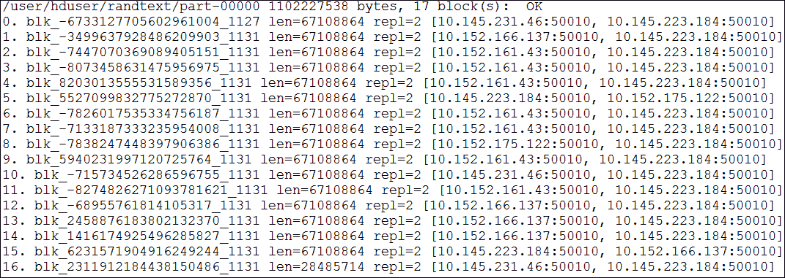
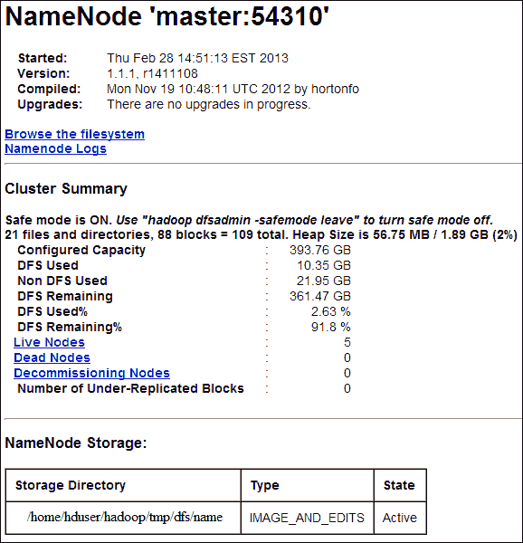
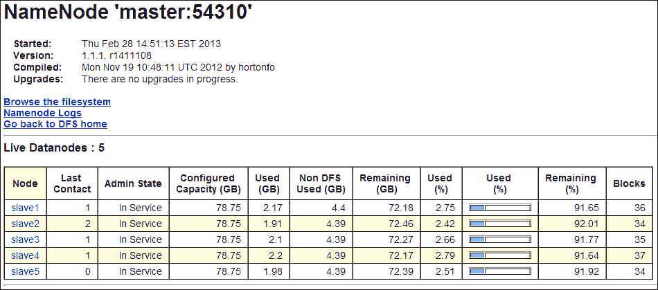
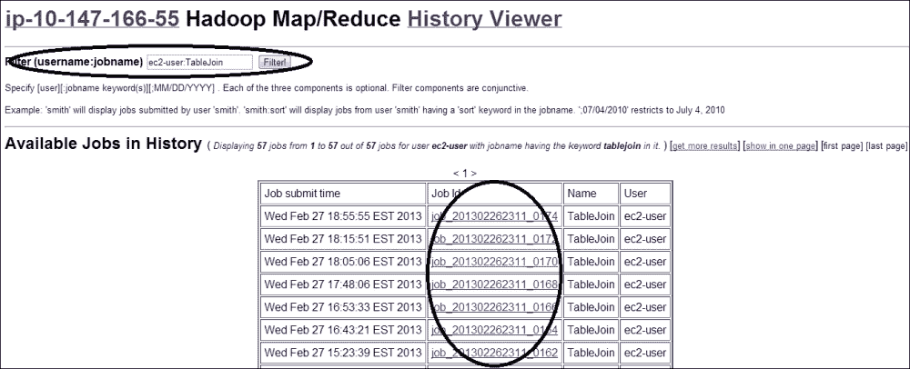
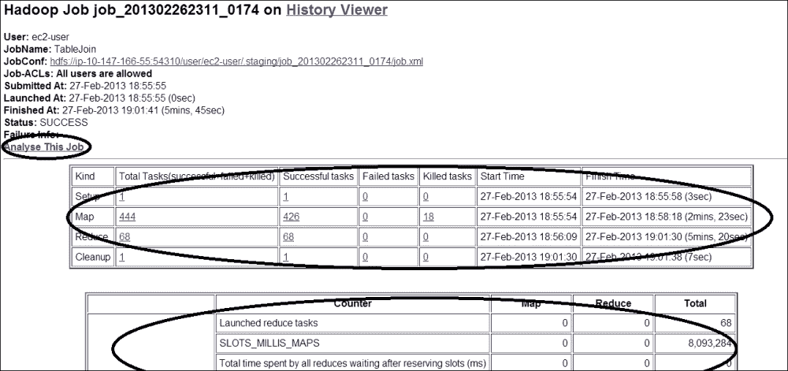
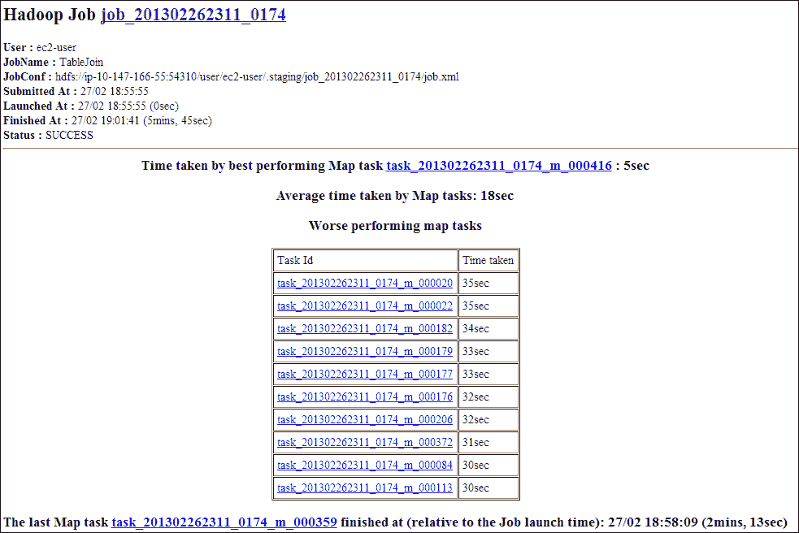
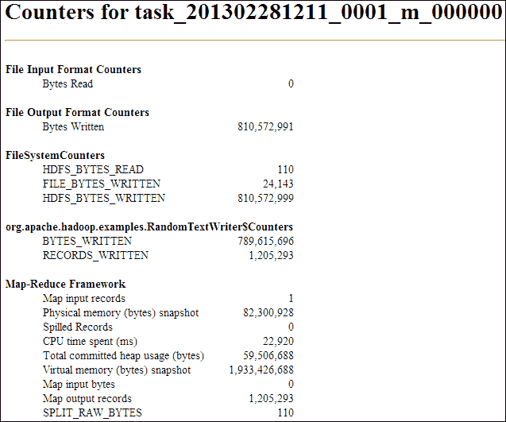
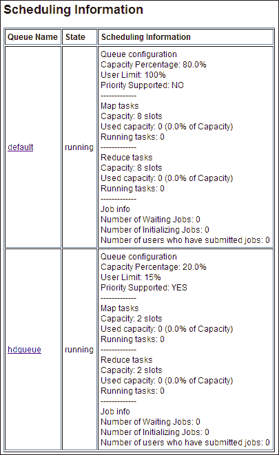
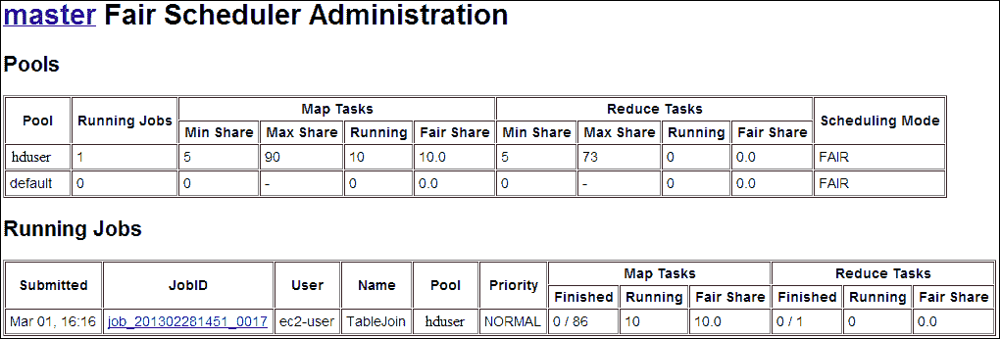

# 四、管理 Hadoop 集群

在本章中，我们将介绍：

*   管理 HDFS 集群
*   配置 Second DaryNameNode
*   管理 MapReduce 集群
*   管理 TaskTracker
*   停用数据节点
*   更换从节点
*   管理 MapReduce 作业
*   从 Web 用户界面检查作业历史记录
*   将数据导入 HDFS
*   在 HDFS 上操作文件
*   配置 HDFS 配额
*   配置 CapacityScheduler
*   配置公平调度程序
*   配置 Hadoop 守护程序日志记录
*   配置 Hadoop 审核日志记录
*   升级 Hadoop

# 简介

从功能的角度来看，Hadoop 集群由**HDFS**集群和**MapReduce**集群组成。 HDFS 集群由 Hadoop 的默认文件系统组成。 它有一个或多个**NameNodes**来跟踪文件系统元数据，而实际数据块存储在由**DataNode**管理的分布式从节点上。 同样，**MapReduce**集群在主节点上有一个**JobTracker**守护进程，在从节点上有多个**TaskTracker**。 JobTracker 管理 MapReduce 作业的生命周期。 它将作业拆分成较小的任务，并安排任务由 TaskTracker 运行。 TaskTracker 通过分叉一个或多个 JVM 进程并行执行 JobTracker 分配的任务。 作为 Hadoop 集群管理员，您将负责管理 HDFS 集群和 MapReduce 集群。

通常，系统管理员应该维护集群的运行状况和可用性。 更具体地说，对于 HDFS 集群，这意味着管理 NameNode 和 DataNode，以及管理用于 MapReduce 的 JobTracker 和 TaskTracker。 其他管理任务包括管理 Hadoop 作业，例如使用调度器配置作业调度策略。

在本章结束时，我们将介绍配置 Hadoop 日志记录和进行系统升级的主题。 日志记录为诊断集群故障或性能问题提供了洞察力，而系统升级在保持软件最新方面起着重要作用。

# 管理 HDFS 集群

HDFS 的运行状况对于基于 Hadoop 的大数据平台至关重要。 HDFS 问题可能会对集群的效率产生负面影响。 更糟糕的是，它可能会使集群无法正常运行。 例如，网络分段导致的 DataNode 不可用可能会导致一些复制不足的数据块。 当这种情况发生时，HDFS 会自动复制这些数据块，这会给集群带来大量开销，并导致集群太不稳定而无法使用。 在本菜谱中，我们将展示管理 HDFS 集群的命令。

## 做好准备

在开始之前，我们假设我们的 Hadoop 集群已经正确配置，并且所有守护进程都在运行，没有任何问题。

使用以下命令从管理员计算机登录到主节点：

```sh
ssh hduser@master

```

## 怎么做……

使用以下步骤检查具有`hadoop fsck`的 HDFS 集群的状态：

1.  Check the status of the root filesystem with the following command:

    ```sh
    hadoop fsck /

    ```

    我们将得到类似于以下内容的输出：

    ```sh
    FSCK started by hduser from /10.147.166.55 for path / at Thu Feb 28 17:14:11 EST 2013
    ..
    /user/hduser/.staging/job_201302281211_0002/job.jar:  Under replicated blk_-665238265064328579_1016\. Target Replicas is 10 but found 5 replica(s).
    .................................Status: HEALTHY
     Total size:    14420321969 B
     Total dirs:    22
     Total files:   35
     Total blocks (validated):      241 (avg. block size 59835360 B)
     Minimally replicated blocks:   241 (100.0 %)
     Over-replicated blocks:        0 (0.0 %)
     Under-replicated blocks:       2 (0.8298755 %)
     Mis-replicated blocks:         0 (0.0 %)
     Default replication factor:    2
     Average block replication:     2.0248964
     Corrupt blocks:                0
     Missing replicas:              10 (2.0491803 %)
     Number of data-nodes:          5
     Number of racks:               1
    FSCK ended at Thu Feb 28 17:14:11 EST 2013 in 28 milliseconds

    The filesystem under path '/' is HEALTHY

    ```

    输出显示某些百分比的数据块未充分复制。 但是因为 HDFS 可以自动复制这些数据块，所以 HDFS 文件系统和`'/'`目录都是`HEALTHY`。

2.  Check the status of all the files on HDFS with the following command:

    ```sh
    hadoop fsck / -files

    ```

    我们将得到类似于以下内容的输出：

    ```sh
    FSCK started by hduser from /10.147.166.55 for path / at Thu Feb 28 17:40:35 EST 2013
    / <dir>
    /home <dir>
    /home/hduser <dir>
    /home/hduser/hadoop <dir>
    /home/hduser/hadoop/tmp <dir>
    /home/hduser/hadoop/tmp/mapred <dir>
    /home/hduser/hadoop/tmp/mapred/system <dir>
    /home/hduser/hadoop/tmp/mapred/system/jobtracker.info 4 bytes, 1 block(s):  OK
    /user <dir>
    /user/hduser <dir>
    /user/hduser/randtext <dir>
    /user/hduser/randtext/_SUCCESS 0 bytes, 0 block(s):  OK
    /user/hduser/randtext/_logs <dir>
    /user/hduser/randtext/_logs/history <dir>
    /user/hduser/randtext/_logs/history/job_201302281451_0002_1362090421087_hduser_random-text-writer 23995 bytes, 1 block(s):  OK
    /user/hduser/randtext/_logs/history/job_201302281451_0002_conf.xml 22878 bytes, 1 block(s):  OK
    /user/hduser/randtext/part-00001 1102231864 bytes, 17 block(s):  OK
    Status: HEALTHY
    Hadoop will scan and list all the files in the cluster.

    ```

    此命令扫描 HDFS 上的所有文件，并打印大小和状态。

3.  Check the locations of file blocks with the following command:

    ```sh
    hadoop fsck / -files -locations

    ```

    此命令的输出将包含以下信息：

    

    第一行告诉我们，文件`part-00000`总共有`17`个块，每个块有`2`个复制(复制因子已设置为`2`)。 下面几行列出了每个块在 DataNode 上的位置。 例如，数据块`blk_6733127705602961004_1127`已在主机`10.145.231.46`和`10.145.223.184`上复制。 数字`50010`是数据节点的端口号。

4.  使用以下命令检查包含机架信息的文件块的位置：

    ```sh
    hadoop fsck / -files -blocks -racks

    ```

5.  使用以下命令删除损坏的文件：

    ```sh
    hadoop fsck -delete

    ```

6.  使用以下命令将损坏的文件移动到`/lost+found`：

    ```sh
    hadoop fsck -move

    ```

使用以下步骤检查具有`hadoop dfsadmin`的 HDFS 集群的状态：

1.  Report the status of each slave node with the following command:

    ```sh
    hadoop dfsadmin -report

    ```

    输出将类似于以下内容：

    ```sh
    Configured Capacity: 422797230080 (393.76 GB)
    Present Capacity: 399233617920 (371.82 GB)
    DFS Remaining: 388122796032 (361.47 GB)
    DFS Used: 11110821888 (10.35 GB)
    DFS Used%: 2.78%
    Under replicated blocks: 0
    Blocks with corrupt replicas: 0
    Missing blocks: 0

    -------------------------------------------------
    Datanodes available: 5 (5 total, 0 dead)

    Name: 10.145.223.184:50010
    Decommission Status : Normal
    Configured Capacity: 84559446016 (78.75 GB)
    DFS Used: 2328719360 (2.17 GB)
    Non DFS Used: 4728565760 (4.4 GB)
    DFS Remaining: 77502160896(72.18 GB)
    DFS Used%: 2.75%
    DFS Remaining%: 91.65%
    Last contact: Thu Feb 28 20:30:11 EST 2013

    ...

    ```

    输出的第一部分显示 HDFS 集群的摘要，包括配置的容量、当前容量、剩余容量、已用空间、复制不足的数据块数、副本损坏的数据块数以及丢失的块数。

    输出信息的以下部分显示了每个 HDFS 从节点的状态，包括 DataNode 计算机的名称(**IP：port**)、委托状态、配置的容量、HDFS 和非 HDFS 使用的空间量、HDFS 剩余空间以及从节点与主节点联系的时间。

2.  使用以下命令刷新所有数据节点：

    ```sh
    hadoop dfsadmin -refreshNodes

    ```

3.  Check the status of the **safe mode** using the following command:

    ```sh
    hadoop dfsadmin -safemode get

    ```

    我们将能够获得以下输出：

    ```sh
    Safe mode is OFF

    ```

    输出告诉我们 NameNode 未处于安全模式。 在这种情况下，文件系统既是可读的，也是可写的。 如果 NameNode 处于安全模式，则文件系统将为只读(写保护)。

4.  Manually put the NameNode into safe mode using the following command:

    ```sh
    hadoop dfsadmin -safemode enter

    ```

    此命令对系统维护非常有用。

5.  Make the NameNode to leave safe mode using the following command:

    ```sh
    hadoop dfsadmin -safemode leave

    ```

    如果 NameNode 已长期处于安全模式或已手动置于安全模式，则需要使用此命令让 NameNode 退出此模式。

6.  Wait until NameNode leaves safe mode using the following command:

    ```sh
    hadoop dfsadmin -safemode wait

    ```

    当我们想要等待 HDFS 完成数据块复制或等待新委托的 DataNode 准备好提供服务时，此命令非常有用。

7.  Save the metadata of the HDFS filesystem with the following command:

    ```sh
    hadoop dfsadmin -metasave meta.log

    ```

    将在目录`$HADOOP_HOME/logs`下创建`meta.log`文件。 其内容将类似于以下内容：

    ```sh
    21 files and directories, 88 blocks = 109 total
    Live Datanodes: 5
    Dead Datanodes: 0
    Metasave: Blocks waiting for replication: 0
    Metasave: Blocks being replicated: 0
    Metasave: Blocks 0 waiting deletion from 0 datanodes.
    Metasave: Number of datanodes: 5
    10.145.223.184:50010 IN 84559446016(78.75 GB) 2328719360(2.17 GB) 2.75% 77502132224(72.18 GB) Thu Feb 28 21:43:52 EST 2013
    10.152.166.137:50010 IN 84559446016(78.75 GB) 2357415936(2.2 GB) 2.79% 77492854784(72.17 GB) Thu Feb 28 21:43:52 EST 2013
    10.145.231.46:50010 IN 84559446016(78.75 GB) 2048004096(1.91 GB) 2.42% 77802893312(72.46 GB) Thu Feb 28 21:43:54 EST 2013
    10.152.161.43:50010 IN 84559446016(78.75 GB) 2250854400(2.1 GB) 2.66% 77600096256(72.27 GB) Thu Feb 28 21:43:52 EST 2013
    10.152.175.122:50010 IN 84559446016(78.75 GB) 2125828096(1.98 GB) 2.51% 77724323840(72.39 GB) Thu Feb 28 21:43:53 EST 2013
    21 files and directories, 88 blocks = 109 total
    ...
    ```

## 它是如何工作的.

当 NameNode 进入安全模式时，HDFS 文件系统将受到写保护。 当 HDFS 集群启动时，它将首先进入安全模式。 NameNode 将检查每个数据块的复制因子。 如果数据块的副本计数小于配置的值(默认为`3`)，则该数据块将被标记为复制不足。 最后，将计算复制不足因子，即复制不足的数据块的百分比。 如果百分比数字大于阈值，NameNode 将保持安全模式，直到为复制不足的数据块创建足够的新副本，从而使复制不足因子低于阈值。

我们可以使用以下命令获取`fsck`命令的用法：

```sh
hadoop fsck

```

使用信息将类似于以下内容：

```sh
Usage: DFSck <path> [-move | -delete | -openforwrite] [-files [-blocks [-locations | -racks]]]
 <path>  start checking from this path
 -move   move corrupted files to /lost+found
 -delete delete corrupted files
 -files  print out files being checked
 -openforwrite   print out files opened for write
 -blocks print out block report
 -locations      print out locations for every block
 -racks print out network topology for data-node locations
 By default fsck ignores files opened for write, use -openforwrite to report such files. They are usually tagged CORRUPT or HEALTHY depending on their block allocation status.

```

我们可以使用以下命令获取`dfsadmin`命令的用法：

```sh
hadoop dfsadmin

```

输出将类似于以下内容：

```sh
Usage: java DFSAdmin
 [-report]
 [-safemode enter | leave | get | wait]
 [-saveNamespace]
 [-refreshNodes]
 [-finalizeUpgrade]
 [-upgradeProgress status | details | force]
 [-metasave filename]
 [-refreshServiceAcl]
 [-refreshUserToGroupsMappings]
 [-refreshSuperUserGroupsConfiguration]
 [-setQuota <quota> <dirname>...<dirname>]
 [-clrQuota <dirname>...<dirname>]
 [-setSpaceQuota <quota> <dirname>...<dirname>]
 [-clrSpaceQuota <dirname>...<dirname>]
 [-setBalancerBandwidth <bandwidth in bytes per second>]
 [-help [cmd]]

```

## 还有更多的…

除了使用命令行之外，我们还可以使用 Web 用户界面来检查 HDFS 集群的状态。 例如，我们可以通过打开链接`http://master:50070/dfshealth.jsp`来获取 HDFS 的状态信息。

我们将看到一个网页，其中显示 HDFS 集群的摘要，例如配置的容量和剩余空间。 例如，该网页将类似于以下屏幕截图：



通过单击**Live Nodes**链接，我们可以检查每个 DataNode 的状态。 我们将看到一个类似于以下屏幕截图的网页：



通过单击每个节点的链接，我们可以浏览 HDFS 文件系统的目录。 该网页将类似于以下屏幕截图：


该网页显示文件`/user/hduser/randtext`已被分成五个分区。 我们可以通过单击`part-0000x`链接来浏览每个分区的内容。

## 另请参阅

*   [第 3 章](3.html "Chapter 3. Configuring a Hadoop Cluster")，*配置 Hadoop 集群*中的*验证 Hadoop 安装*配方
*   *取消数据节点*配方
*   *在 HDFS*上操作文件的秘诀

# 配置 Second daryNameNode

Hadoop NameNode是单点故障。 通过配置**Second NameNode**，可以定期备份文件系统映像和编辑日志文件。 在 NameNode 出现故障的情况下，可以使用备份文件来恢复 NameNode。 在本食谱中，我们将概述配置**Second DaryNameNode**的步骤。

## 做好准备

我们假设 Hadoop 已正确配置。

使用以下命令从集群管理计算机登录到主节点：

```sh
ssh hduser@master

```

## 怎么做……

执行以下步骤配置 Second daryNameNode：

1.  使用以下命令停止集群：

    ```sh
    stop-all.sh

    ```

2.  Add or change the following into the file `$HADOOP_HOME/conf/hdfs-site.xml`:

    ```sh
    <property>
        <name>fs.checkpoint.dir</name>
     <value>/hadoop/dfs/namesecondary</value>
    </property>
    ```

    如果未显式设置此属性，则默认检查点目录将为`${hadoop.tmp.dir}/dfs/namesecondary`。

3.  Start the cluster using the following command:

    ```sh
    start-all.sh

    ```

    NameNode 数据目录的树结构如下所示：

    ```sh
    ${dfs.name.dir}/
    ├── current
    │   ├── edits
    │   ├── fsimage
    │   ├── fstime
    │   └── VERSION
    ├── image
    │   └── fsimage
    ├── in_use.lock
    └── previous.checkpoint
     ├── edits
     ├── fsimage
     ├── fstime
    └── VERSION

    ```

    并且 Second daryNameNode 数据目录的树结构如下所示：

    ```sh
    ${fs.checkpoint.dir}/
    ├── current
    │   ├── edits
    │   ├── fsimage
    │   ├── fstime
    │   └── VERSION
    ├── image
    │   └── fsimage
    └── in_use.lock

    ```

## 还有更多...

为了增加冗余，我们可以将 NameNode 配置为在多个位置写入文件系统元数据。 例如，我们可以通过更改文件`$HADOOP_HOME/conf/hdfs-site.xml`中的以下属性来添加用于备份的 NFS 共享目录：

```sh
<property>
  <name>dfs.name.dir</name>
 <value>/hadoop/dfs/name,/nfs/name</value>
</property>
```

### 备注

`/nfs/name`是远程计算机上的 NFS 共享目录。

## 另请参阅

*   *管理 HDFS 集群*配方
*   *取消数据节点*配方

# 管理 MapReduce 集群

典型的MapReduce 集群由一个运行 JobTracker 的主节点和多个运行 TaskTracker 的从节点组成。 管理 MapReduce 集群的任务包括维护运行状况以及 TaskTracker 和 JobTracker 之间的成员关系。 在本食谱中，我们将概述管理 MapReduce 集群的命令。

## 做好准备

我们假设 Hadoop 集群已经正确配置并运行。

使用以下命令从集群管理计算机登录到主节点：

```sh
ssh hduser@master

```

## 怎么做……

要管理 MapReduce 集群，请执行以下步骤：

1.  List all the active TaskTrackers using the following command:

    ```sh
    hadoop -job -list-active-trackers

    ```

    ### 备注

    此命令可以帮助我们检查集群中 TaskTracker 的注册状态。

2.  Check the status of the JobTracker safe mode using the following command:

    ```sh
    hadoop mradmin -safemode get

    ```

    我们将获得以下输出：

    ```sh
    Safe mode is OFF

    ```

    输出告诉我们 JobTracker 未处于安全模式。 我们可以向集群提交作业。 如果 JobTracker 处于安全模式，则不能向集群提交任何作业。

3.  Manually let the JobTracker enter safe mode using the following command:

    ```sh
    hadoop mradmin -safemode enter

    ```

    当我们想要维护集群时，此命令非常方便。

4.  Let the JobTracker leave safe mode using the following command:

    ```sh
    hadoop mradmin -safemode leave

    ```

    维护任务完成后，您需要运行此命令。

5.  如果我们想要等待退出安全模式，可以使用以下命令：

    ```sh
    hadoop mradmin -safemode wait

    ```

6.  使用以下命令重新加载 MapReduce 队列配置：

    ```sh
    hadoop mradmin -refreshQueues

    ```

7.  使用以下命令重新加载活动的 TaskTracker：

    ```sh
    hadoop mradmin -refreshNodes

    ```

## 它是如何工作的.

使用以下命令获取`mradmin`命令的用法：

```sh
hadoop mradmin

```

使用信息将类似于以下内容：

```sh
Usage: java MRAdmin
 [-refreshServiceAcl]
 [-refreshQueues]
 [-refreshUserToGroupsMappings]
 [-refreshSuperUserGroupsConfiguration]
 [-refreshNodes]
 [-safemode <enter | leave | get | wait>]
 [-help [cmd]]
...

```

下表列出了命令选项的含义：

<colgroup><col style="text-align: left"> <col style="text-align: left"></colgroup> 
| 

选择 / 选择权 / 购买权 / 期权

 | 

描述 / 描写 / 形容 / 类别

 |
| --- | --- |
| `-refreshServiceAcl` | 强制 JobTracker 重新加载服务 ACL。 |
| `-refreshQueues` | 强制 JobTracker 重新加载队列配置。 |
| `-refreshUserToGroupsMappings` | 强制 JobTracker 重新加载用户组映射。 |
| `-refreshSuperUserGroupsConfiguration` | 强制 JobTracker 重新加载超级用户组映射。 |
| `-refreshNodes` | 强制 JobTracker 刷新 JobTracker 主机。 |
| `-help [cmd]` | 显示一个命令或所有命令的帮助信息。 |

## 另请参阅

*   *配置 Second DaryNameNode*配方
*   *管理 MapReduce 作业*配方

# 管理 TaskTracker

TaskTracker 是在从节点上运行的MapReduce 守护进程。 它们接受由主节点上的 JobTracker 分配的任务，并分叉 JVM 进程/线程来运行这些任务。 TaskTracker 还负责使用心跳报告任务的进度及其健康状态。

Hadoop 为 TaskTracker 维护三个列表：**黑名单**、**灰名单**、和**排除列表**。 TaskTracker 黑名单功能可以在 TaskTracker 处于不稳定状态或性能降级时将其列入黑名单。 例如，当特定作业的失败任务比率达到一定阈值时，该作业的 TaskTracker 将被列入黑名单。 类似地，Hadoop 通过识别潜在的问题节点来维护节点的灰色列表。

有时，需要将个 TaskTracker 排除在集群中。 例如，当我们调试或升级从节点时，我们希望将此节点与集群分开，以防它影响集群。 Hadoop 支持将 TaskTracker 从正在运行的集群中实时停用。

## 做好准备

我们假设 Hadoop 已正确配置。 MapReduce 和 HDFS 守护程序正在运行，没有任何问题。

使用以下命令从管理员计算机登录到集群主节点：

```sh
ssh hduser@master

```

在主节点上使用以下命令列出活动的跟踪器：

```sh
hadoop job -list-active-trackers

```

并且输出应类似于以下内容：

```sh
tracker_slave5:localhost/127.0.0.1:55590
tracker_slave1:localhost/127.0.0.1:47241
tracker_slave3:localhost/127.0.0.1:51187
tracker_slave4:localhost/127.0.0.1:60756
tracker_slave2:localhost/127.0.0.1:42939

```

## 怎么做……

执行以下步骤以配置心跳间隔：

1.  使用以下命令停止 MapReduce 集群：

    ```sh
    stop-dfs.sh

    ```

2.  Open the file `$HADOOP_HOME/conf/mapred-site.xml` with your favorite text editor and add the following content into the file:

    ```sh
    <property>
      <name>mapred.tasktracker.expiry.interval</name>
    <value>600000</value>
    </property>
    ```

    该值以毫秒为单位。

3.  使用以下命令将配置复制到从节点：

    ```sh
    for host in 'cat $HADOOP_HOME/conf/slaves'; do
     echo 'Copying mapred-site.xml to slave node ' $host
     sudo scp $HADOOP_HOME/conf/mapred-site.xml hduser@$host:$HADOOP_HOME/conf
    done

    ```

4.  使用以下命令启动 MapReduce 集群：

    ```sh
    start-mapred.sh

    ```

执行以下步骤以配置 TaskTracker 黑名单：

1.  使用以下命令停止 MapReduce 集群：

    ```sh
    stop-mapred.sh

    ```

2.  通过在文件`$HADOOP_HOME/conf/hdfs-site.xml`中添加或更改以下属性来设置作业将 TaskTracker 列入黑名单的任务失败次数：

    ```sh
    <property>
      <name>mapred.max.tracker.failures</name>
    <value>10</value>
    </property>
    ```

3.  通过在文件`$HADOOP_HOME/conf/hdfs-site.xml`中添加或更改以下属性来设置可以将 TaskTracker 列入黑名单的最大成功作业数：

    ```sh
    <property>
      <name>mapred.max.tracker.blacklists</name>
    <value>5</value>
    </property>
    ```

4.  使用以下命令将配置文件复制到从节点：

    ```sh
    for host in 'cat $HADOOP_HOME/conf/slaves'; do
     echo 'Copying hdfs-site.xml to slave node ' $host
     sudo scp $HADOOP_HOME/conf/hdfs-site.xml hduser@$host:$HADOOP_HOME/conf
    done

    ```

5.  使用以下命令启动 MapReduce 集群：

    ```sh
    start-mapred.sh

    ```

6.  使用以下命令将 TaskTracker 列入黑名单：

    ```sh
    hadoop job -list-blacklisted-trackers

    ```

执行以下步骤以停用 TaskTracker：

1.  Set the TaskTracker exclude file by adding the following properties into the file:

    ```sh
    <property>
      <name>mapred.hosts.exclude</name>
    <value>$HADOOP_HOME/conf/mapred-exclude.txt</value>
    </property>
    ```

    ### 备注

    `$HADOOP_HOME/conf/mapred-exclude.txt`文件将包含排除 TaskTracker 主机名，每行一个。 例如，如果要从集群中排除`slave1`和`slave3`，则该文件应包含以下两行：

    ```sh
    slave1
    slave3
    ```

2.  使用以下命令强制JobTracker 重新加载 TaskTracker 列表：

    ```sh
    hadoop mradmin -refreshNodes

    ```

3.  List all the active trackers again using the following command:

    ```sh
    hadoop job -list-active-trackers

    ```

    我们将获得以下输出：

    ```sh
    tracker_slave5:localhost/127.0.0.1:55590
    tracker_slave4:localhost/127.0.0.1:60756
    tracker_slave2:localhost/127.0.0.1:42939

    ```

## 它是如何工作的.

从节点上的 TaskTracker定期联系主节点上的 JobTracker。 两次连续接触通信之间的间隔称为**心跳**。 更频繁的心跳配置可能会给集群带来更高的负载。 心跳属性的值应该根据集群的大小进行设置。

JobTracker 使用 TaskTracker 黑名单删除那些不稳定的 TaskTracker。 如果某个 TaskTracker 被列入黑名单，则该 TaskTracker 上当前运行的所有任务仍可完成，并且 TaskTracker 将通过心跳机制继续与 JobTracker 建立连接。 但 TaskTracker 不会被安排运行未来的任务。 如果被列入黑名单的 TaskTracker 重新启动，它将从黑名单中删除。

### 备注

列入黑名单的 TaskTracker 总数不应超过 TaskTracker 总数的 50%。

## 另请参阅

*   管理 MapReduce 集群的*配方*
*   *管理 MapReduce 作业*配方
*   *取消数据节点*配方
*   *替换从节点*配方

# 停用数据节点

与 TaskTracker 类似，有时需要从集群中临时禁用某个 DataNode，例如，因为该 DataNode 的存储空间已用完。 在本食谱中，我们将概述从活动 Hadoop 集群中停用 DataNode 的步骤。

## 做好准备

我们假设已经正确配置了 Hadoop。

使用以下命令从集群管理员计算机登录到主节点：

```sh
ssh hduser@master

```

### 提示

为了说明起见，我们假设将主机`slave1`上的 DataNode 从正在运行的 Hadoop 集群中停用。

## 怎么做……

要停用活动的 DataNode，请执行以下步骤：

1.  Create the file `$HADOOP_HOME/conf/dfs-exclude.txt` with the following content:

    ```sh
    slave1
    ```

    ### 备注

    `dfs-exclude.txt`文件包含要从集群中停用的 DataNode 主机名，每行一个。

2.  将以下属性添加到文件`$HADOOP_HOME/conf/hdfs-site.xml`：

    ```sh
    <property>
      <name>dfs.hosts.exclude</name>
      <value>$HADOOP_HOME/conf/dfs-exclude.txt</value>
    </property>
    ```

3.  使用以下命令强制 NameNode 重新加载活动数据节点：

    ```sh
    hadoop dfsadmin -refreshNodes

    ```

4.  获取每个活动数据节点的描述报告：

    ```sh
    hadoop dfsadmin -report

    ```

## 它是如何工作的.

集群管理员可以使用`dfsadmin`命令来管理 DataNode。 我们可以使用以下命令获取此命令的用法：

```sh
hadoop dfsadmin

```

使用信息将类似于以下内容：

```sh
Usage: java DFSAdmin
 [-report]
 [-safemode enter | leave | get | wait]
 [-saveNamespace]
 [-refreshNodes]
 [-finalizeUpgrade]
 [-upgradeProgress status | details | force]
 ...

```

## 另请参阅

*   *管理 HDFS 集群*配方
*   *配置 Second DaryNameNode*配方
*   *管理 TaskTracker*配方
*   *替换从节点*配方

# 更换从节点

有时，我们需要用新硬件替换从节点。 例如，从节点不稳定，需要更多存储空间或更强大的 CPU，等等。 在本配方中，我们将概述替换从节点的步骤。

## 做好准备

我们假设更换的硬件已准备就绪，可以使用。 为了说明起见，我们假设本书中需要替换`slave2`。

## 怎么做……

执行以下步骤以更换从节点：

1.  按照本章*管理 TaskTracker*配方中概述的步骤停用从节点上的 TaskTracker。
2.  按照本章*停用数据节点*配方中概述的步骤停用从节点上的数据节点。
3.  关闭从节点的电源，并将其更换为新硬件。
4.  按照*安装 Linux 操作系统*、*安装 Java 和其他工具*以及*配置第 2 章、*准备 Hadoop 安装*的*配置 SSH 配方*中概述的步骤在新节点上安装和配置 Linux 操作系统。*
5.  通过使用以下命令从主节点复制 Hadoop 目录和配置，在新节点上安装Hadoop：

    ```sh
    sudo scp -r /usr/local/hadoop-1.1.2 hduser@slave2:/usr/local/
    sudo ssh hduser@slave2 -C "ln -s /usr/local/hadoop-1.1.2 /usr/local/hadoop"
    sudo scp ~/.bashrc hduser@slave2:~/

    ```

6.  登录到`slave2`并使用以下命令启动 DataNode 和 TaskTracker：

    ```sh
    ssh hduser@slave2 -C "hadoop DataNode &"
    ssh hduser@slave2 -C "Hadoop TaskTracker &"

    ```

7.  使用以下命令刷新数据节点：

    ```sh
    hadoop dfsadmin -refreshNodes

    ```

8.  使用以下命令刷新 TaskTracker：

    ```sh
    hadoop mradmin -refreshNodes

    ```

9.  使用以下命令报告实时数据节点的状态：

    ```sh
    hadoop dfsadmin -report

    ```

10.  使用以下命令获取所有活动的 TaskTracker：

    ```sh
    hadoop job -list-active-trackers

    ```

## 另请参阅

*   [第 2 章](2.html "Chapter 2. Preparing for Hadoop Installation")，*准备 Hadoop 安装的*安装 Linux 操作系统*配方*
*   [第 2 章](2.html "Chapter 2. Preparing for Hadoop Installation")、*准备 Hadoop 安装的*安装 Java 和其他工具*配方*
*   [第 2 章](2.html "Chapter 2. Preparing for Hadoop Installation")、*的*配置 SSH*配方准备 Hadoop 安装*
*   [第 3 章](3.html "Chapter 3. Configuring a Hadoop Cluster")、*配置 Hadoop 集群*的*在完全分布式模式下配置 Hadoop*配方
*   *管理 TaskTracker*配方
*   *取消数据节点*配方

# 管理 MapReduce 作业

Hadoop 大数据平台接受客户端提交的作业。 在多用户环境中，可以同时提交和运行多个作业。 Hadoop 作业的管理包括检查作业状态、更改作业优先级、终止正在运行的作业等。 在本食谱中，我们将概述执行这些作业管理任务的步骤。

## 做好准备

我们假设我们的 Hadoop 集群已经正确配置，并且所有 Hadoop 守护进程都在运行，没有任何问题。 我们还假设普通用户可以向集群提交 Hadoop 作业。

使用以下命令从集群管理员计算机登录到主节点：

```sh
ssh hduser@master

```

## 怎么做……

执行以下步骤以检查 Hadoop 作业的状态：

1.  List all the running jobs using the following command:

    ```sh
    hadoop job -list

    ```

    我们将能够获得类似于以下内容的输出：

    ```sh
    1 jobs currently running
    JobId   State   StartTime   UserName        Priority        SchedulingInfo
    job_201302152353_0001   4   1361405786524   hduser  NORMAL  NA

    ```

    ### 备注

    输出消息告诉我们，当前集群上正在运行一个具有`JobId``job_201302152353_0001`的作业。

2.  List all the submitted jobs since the start of the cluster with the following command:

    ```sh
    hadoop job -list all

    ```

    我们将得到类似于以下内容的输出：

    ```sh
    2 jobs submitted
    States are:
     Running : 1     Succeeded : 2    Failed : 3      Prep : 4
    JobId   State   StartTime   UserName        Priority        SchedulingInfo
    job_201302152353_0001   2   1361405786524   hduser  NORMAL  NA
    job_201302152353_0002   4   1361405860611   hduser  NORMAL  NA

    ```

    输出消息的`State`列显示作业的状态。 例如，在前面的输出中，提交了两个作业，第一个作业`JobId``job_201302152353_0001`处于**成功**状态，第二个作业`JobId``job_201302152353_0002`处于**准备**状态。 这两个作业都具有正常优先级，并且没有调度信息。

3.  We can check the status of the default queue with the following command:

    ```sh
    hadoop queue -list

    ```

    如果没有添加队列，我们将得到类似于以下内容的输出：

    ```sh
    Queue Name : default
    Queue State : running
    Scheduling Info : N/A

    ```

    Hadoop 使用队列管理作业。 默认情况下，只有一个默认队列。 命令的输出显示集群只有一个默认队列，该队列处于运行状态，没有调度信息。

4.  Check the status of a queue ACL with the following command:

    ```sh
    hadoop queue -showacls

    ```

    如果尚未配置 ACL，我们将得到类似以下内容的输出：

    ```sh
    Queue acls for user :  hduser

    Queue  Operations
    =====================
    default  submit-job,administer-jobs

    ```

    输出显示用户`hduser`可以提交和管理默认队列中的作业。

5.  Show all the jobs in the default queue using the following command:

    ```sh
    hadoop queue -info default -showJobs

    ```

    我们将得到类似于以下内容的输出：

    ```sh
    Queue Name : default
    Queue State : running
    Scheduling Info : N/A
    Job List
    JobId   State   StartTime   UserName   Priority   SchedulingInfo
    job_201302152353_0001   2   1361405786524   hduser  NORMAL  NA

    ```

6.  Check the status of a job with the following command:

    ```sh
    hadoop job -status job_201302152353_0001

    ```

    输出将类似于以下内容：

    ```sh
    Job: job_201302152353_0001
    file: hdfs://master:54310/user/hduser/.staging/job_201302152353_0001/job.xm                l
    tracking URL: http://master:50030/jobdetails.jsp?jobid=job_201302152353_000                1
    map() completion: 1.0
    reduce() completion: 1.0

    Counters: 31
     Job Counters
     Launched reduce tasks=1
     SLOTS_MILLIS_MAPS=87845
     Total time spent by all reduces waiting after reserving slots (ms)=0
     Total time spent by all maps waiting after reserving slots (ms)= 0
     Rack-local map tasks=8
     Launched map tasks=10
     Data-local map tasks=2
     SLOTS_MILLIS_REDUCES=16263
     File Input Format Counters
     Bytes Read=1180
     File Output Format Counters
     Bytes Written=97
     FileSystemCounters
     FILE_BYTES_READ=226
     HDFS_BYTES_READ=2440
     FILE_BYTES_WRITTEN=241518
     HDFS_BYTES_WRITTEN=215
     Map-Reduce Framework
     Map output materialized bytes=280
     Map input records=10
     Reduce shuffle bytes=252
     Spilled Records=40
     Map output bytes=180
     Total committed heap usage (bytes)=2210988032
     CPU time spent (ms)=9590
     Map input bytes=240
     SPLIT_RAW_BYTES=1260
     Combine input records=0
     Reduce input records=20
     Reduce input groups=20
     Combine output records=0
     Physical memory (bytes) snapshot=2033074176
     Reduce output records=0
     Virtual memory (bytes) snapshot=5787283456
     Map output records=20

    ```

通过执行以下步骤更改作业的状态：

1.  Set the job `job_201302152353_0001` to be on high priority using the following command:

    ```sh
    hadoop job -set-priority job_201302152353_0003 HIGH

    ```

    ### 备注

    可用优先级(按降序排列)包括：`VERY_HIGH`、`HIGH`、`NORMAL`、`LOW`和`VERY_LOW`。

    作业的优先级将为`HIGH`，如以下输出所示：

    ```sh
    4 jobs submitted
    States are:
     Running : 1     Succeeded : 2    Failed : 3      Prep : 4
    JobId   State   StartTime   UserName        Priority        SchedulingInfo
    job_201302152353_0001   2   1361405786524   hduser  NORMAL  NA
    job_201302152353_0002   2   1361405860611   hduser  NORMAL  NA
    job_201302152353_0003   1   1361408177470   hduser  HIGH    NA

    ```

2.  Kill the job `job_201302152353_0004` using the following command:

    ```sh
    hadoop job -kill job_201302152353_0004

    ```

    使用 job status 命令，我们将获得以下输出：

    ```sh
    3 jobs submitted
    States are:
     Running : 1   Succeeded : 2  Failed : 3   Prep : 4   Killed : 5
    JobId   State   StartTime   UserName        Priority        SchedulingInfo
    job_201302152353_0001   2   1361405786524   hduser  NORMAL  NA
    job_201302152353_0002   2   1361405860611   hduser  NORMAL  NA
    job_201302152353_0003   1   1361408177470   hduser  HIGH    NA
    job_201302152353_0004   5   1361407740639   hduser  NORMAL  NA

    ```

    ### 备注

    `Killed : 5`信息不在原始输出中，我根据终止作业的状态`job_201302152353_0004`将其放在那里。

执行以下步骤以提交 MapReduce 作业：

1.  Create the job configuration file, `job.xml`, with the following content:

    ```sh
    <?xml version="1.0" encoding="UTF-8" standalone="no"?>
    <configuration>
      <property>
        <name>mapred.input.dir</name>
        <value>randtext</value>
      </property>

      <property>
        <name>mapred.output.dir</name>
        <value>output</value>
      </property>

      <property>
        <name>mapred.job.name</name>
        <value>wordcount</value>
      </property>

      <property>
        <name>mapred.mapper.class</name>
        <value>org.apache.hadoop.mapred.WordCount$Map</value>
      </property>

      <property>
        <name>mapred.combiner.class</name>
        <value>org.apache.hadoop.mapred.WordCount$Reduce</value>
      </property>

      <property>
        <name>mapred.reducer.class</name>
        <value>org.apache.hadoop.mapred.WordCount$Reduce</value>
      </property>

      <property>
        <name>mapred.input.format.class</name>
        <value>org.apache.hadoop.mapred.TextInputFormat</value>
      </property>

      <property>
        <name>mapred.output.format.class</name>
        <value>org.apache.hadoop.mapred.TextOutputFormat</value>
      </property>

    </configuration>
    ```

    `job.xml`文件是指定作业配置的 XML 文件。 在此作业配置文件中，我们指定了作业的作业名称、映射器类、Reducer 类、组合器类、输入格式和输出格式。 我们使用了`wordcount`作为示例，因此我们还需要确保`$HADOOP_HOME/hadoop-examples*.jar`在`CLASSPATH`中可用。

2.  Submit the job with the following command:

    ```sh
    hadoop job -submit job.xml

    ```

    我们将得到类似于以下内容的输出：

    ```sh
    13/03/01 11:55:53 WARN mapred.JobClient: Use GenericOptionsParser for parsing the arguments. Applications should implement Tool for the same.
    13/03/01 11:55:53 INFO util.NativeCodeLoader: Loaded the native-hadoop library
    13/03/01 11:55:53 WARN snappy.LoadSnappy: Snappy native library not loaded
    13/03/01 11:55:53 INFO mapred.FileInputFormat: Total input paths to process : 5
    Created job job_201302281451_0012

    ```

## 它是如何工作的.

`queue`命令是用于`JobQueueClient`类的包装命令，并且`job`命令是用于`JobClient`类的包装命令。

我们可以通过以下命令获得`queue`命令的用法：

```sh
hadoop queue
Usage: JobQueueClient <command> <args>
 [-list]
 [-info <job-queue-name> [-showJobs]]
 [-showacls]

```

同样，我们可以通过以下命令获得`job`命令的用法：

```sh
hadoop job

```

输出将类似于以下内容：

```sh
Usage: JobClient <command> <args>
 [-submit <job-file>]
 [-status <job-id>]
 [-counter <job-id> <group-name> <counter-name>]
 [-kill <job-id>]
 [-set-priority <job-id> <priority>]. Valid values for priorities are: VERY_HIGH HIGH NORMAL LOW VERY_LOW
 [-events <job-id> <from-event-#> <#-of-events>]
 [-history <jobOutputDir>]
 [-list [all]]
 [-list-active-trackers]
 [-list-blacklisted-trackers]
 [-list-attempt-ids <job-id> <task-type> <task-state>]
 [-kill-task <task-id>]
 [-fail-task <task-id>]

```

## 还有更多...

我们讨论了用于 Hadoop 作业管理的最有用的命令。 实际上，还有更多与作业管理相关的命令，或者，我们可以使用 web UI 来管理 Hadoop 作业。

### 更多作业管理命令

1.  Get the value of a counter:

    ```sh
    hadoop job -counter <job-id> <group-name> <counter-name>

    ```

    例如，我们可以使用以下命令获取作业`job_201302281451_0002`的计数器组`FileSystemCounters`的计数器`HDFS_BYTES_WRITTEN`：

    ```sh
    hadoop job -counter job_201302281451_0002 FileSystemCounters HDFS_BYTES_WRITTEN

    ```

2.  Query events of a MapReduce job with the following command:

    ```sh
    hadoop job -events <job-id> <from-event-#> <#-of-events>

    ```

    例如，我们可以使用以下命令查询作业`job_201302281451_0002`的前 10 个事件：

    ```sh
    hadoop job -events job_201302281451_0002 0 10

    ```

    我们将得到类似于以下内容的输出：

    

3.  Get the job history including job details, failed and killed jobs, and so on with the following command:

    ```sh
    hadoop job -history

    ```

    我们将得到类似于以下内容的输出：

    ```sh
    Hadoop job: 0012_1362156954465_hduser
    =====================================
    Job tracker host name: job
    job tracker start time: Tue May 18 17:18:01 EDT 1976
    User: hduser
    JobName: wordcount
    JobConf: hdfs://master:54310/user/hduser/.staging/job_201302281451_0012/job.xml
    Submitted At: 1-Mar-2013 11:55:54
    Launched At: 1-Mar-2013 11:55:54 (0sec)
    Finished At: 1-Mar-2013 11:56:43 (48sec)
    Status: FAILED
    Counters:

    |Group Name   |Counter name   |Map Value |Reduce Value|Total Value|
    ---------------------------------------------------------------
    =====================================

    Task Summary
    ============================
    Kind    Total   Successful  Failed  Killed  StartTime       FinishTime

    Setup   1  1  0  0  1-Mar-2013 11:55:46   1-Mar-2013 11:55:49 (2sec)
    Map  45  0   38   7 1-Mar-2013 11:55:49   1-Mar-2013 11:56:34 (44sec)
    Reduce  0    0     0       0
    Cleanup 1  1  0   0  1-Mar-2013 11:56:33  1-Mar-2013 11:56:36 (3sec)
    ============================

    No Analysis available as job did not finish

    KILLED SETUP task list for 0012_1362156954465_hduser
    TaskId          StartTime       FinishTime      Error
    ====================================================

    FAILED MAP task list for 0012_1362156954465_hduser
    TaskId          StartTime       FinishTime      Error   InputSplits
    ====================================================
    task_201302281451_0012_m_000000 1-Mar-2013 11:55:58     1-Mar-2013 11:56:33 (35sec)     /default-rack/slave2,/default-rack/slave1

    ...
    FAILED task attempts by nodes
    Hostname        FailedTasks
    ===============================
    slave1  task_201302281451_0012_m_000000, task_201302281451_0012_m_000001, task_201302281451_0012_m_000002, task_201302281451_0012_m_000004, task_201302281451_0012_m_000005, task_201302281451_0012_m_000008, task_201302281451_0012_m_000010, task_201302281451_0012_m_000013,
    slave2  task_201302281451_0012_m_000000, task_201302281451_0012_m_000005, task_201302281451_0012_m_000008, task_201302281451_0012_m_000010, task_201302281451_0012_m_000019, task_201302281451_0012_m_000034, task_201302281451_0012_m_000036, task_201302281451_0012_m_000039,
    slave3  task_201302281451_0012_m_000000, task_201302281451_0012_m_000001, task_201302281451_0012_m_000002, task_201302281451_0012_m_000003, task_201302281451_0012_m_000004, task_201302281451_0012_m_000010, task_201302281451_0012_m_000012, task_201302281451_0012_m_000019,
    slave4  task_201302281451_0012_m_000000, task_201302281451_0012_m_000001, task_201302281451_0012_m_000003, task_201302281451_0012_m_000004, task_201302281451_0012_m_000010, task_201302281451_0012_m_000012, task_201302281451_0012_m_000013, task_201302281451_0012_m_000034,
    slave5  task_201302281451_0012_m_000002, task_201302281451_0012_m_000003, task_201302281451_0012_m_000005, task_201302281451_0012_m_000008, task_201302281451_0012_m_000012, task_201302281451_0012_m_000013,

    KILLED task attempts by nodes
    Hostname        FailedTasks
    ===============================
    slave1  task_201302281451_0012_m_000003, task_201302281451_0012_m_000012,
    slave2  task_201302281451_0012_m_000002, task_201302281451_0012_m_000013,
    slave3  task_201302281451_0012_m_000005,
    slave5  task_201302281451_0012_m_000001, task_201302281451_0012_m_000004,

    ```

### 管理任务

我们将向您展示如何终止任务、检查任务尝试等。

1.  Kill a task with the following command:

    ```sh
    hadoop job -kill-task <task-id>

    ```

    例如，要终止任务`task_201302281451_0013_m_000000`，可以使用以下命令：

    ```sh
    hadoop job -kill-task task_201302281451_0013_m_000000

    ```

    任务终止后，JobTracker 将在另一个节点上重新启动该任务。 取消的任务可以通过 Web 用户界面查看，如以下屏幕截图所示：

    

    Hadoop JobTracker 可以在以下情况下自动终止任务：

    *   任务在超时后不报告进度
    *   推测性执行可以在多个节点上运行一个任务；如果其中一个任务成功，则同一任务的其他尝试将被终止，因为这些尝试的尝试结果将是无用的
    *   作业/任务调度器(如公平调度器和容量调度器)需要空插槽用于其他池或队列
2.  In many situations, we need a task to fail, which can be done with the following command:

    ```sh
    hadoop job -fail-task <task-id>

    ```

    例如，要使任务`task_201302281451_0013_m_000000`失败，可以使用以下命令：

    ```sh
    hadoop -job -fail-task task_201302281451_0013_m_000000

    ```

3.  List task attempts with the following command:

    ```sh
    hadoop job -list-attempt-ids <job-id> <task-type> <task-state>

    ```

    在此命令中，可用的任务类型为`map`、`reduce`、`setup`和`clean`；可用的任务状态为`running`和`completed`。

    例如，要列出作业`job_201302281451_0014`的所有已完成映射尝试，可以使用以下命令：

    ```sh
    hadoop job -list-attempt-ids job_201302281451_0014 map completed

    ```

    我们将得到类似于以下内容的输出：

    ```sh
    attempt_201302281451_0014_m_000000_0
    attempt_201302281451_0014_m_000001_0
    attempt_201302281451_0014_m_000002_0
    attempt_201302281451_0014_m_000009_0
    attempt_201302281451_0014_m_000010_0
    ...

    ```

### 通过 Web 用户界面管理作业

我们将从 Web 用户界面显示作业管理。

1.  Check the status of a job by opening the JobTracker URL, `master:50030/jobtracker.jsp`.

    我们将看到一个类似于以下屏幕截图的网页：

    

    ### 备注

    从该网页中，我们可以获得集群摘要信息、调度信息、正在运行的作业列表、已完成的作业列表和停用的作业列表。 通过单击特定的作业链接，我们可以查看作业的详细信息，也可以打开 URL`http://master:50030/jobdetails.jsp?jobid=job_201302281451_0004&refresh=30`。 通过指定`refresh parameter`，我们可以告诉网页每 30 秒刷新一次。

2.  Kill a job by opening the URL, `master:50030/jobdetails.jsp?jobid=job_201302281451_0007&action=kill`.

    稍后，取消的作业将列在**失败作业**列表中，如以下屏幕截图所示：

    

3.  通过打开 URL`master:50030/jobdetails.jsp?jobid=job_201302281451_0007&action=changeprio&prio=HIGH`将作业的优先级更改为`HIGH`。

## 另请参阅

*   [第 3 章](3.html "Chapter 3. Configuring a Hadoop Cluster")，*配置 Hadoop 集群*中的*验证 Hadoop 安装*配方
*   *管理 HDFS 集群*配方
*   管理 MapReduce 集群的*配方*
*   参考[http://hadoop.apache.org/docs/r1.1.2/mapred_tutorial.html](http://hadoop.apache.org/docs/r1.1.2/mapred_tutorial.html)

# 从 Web 用户界面检查作业历史记录

Hadoop 在日志目录中跟踪所有个提交的作业。 作业历史记录日志包含每个作业的信息，如总运行时间和每个任务的运行时间。 在本节中，我们将向您展示如何通过 Web 用户界面检查作业历史记录日志。

## 做好准备

我们假设我们的 Hadoop 集群已经正确配置，并且所有守护进程都在正常运行，没有任何问题。

## 怎么做……

执行以下步骤以从 Web 用户界面检查作业历史记录日志：

1.  Open the job history URL, `http://master:50030/jobhistoryhome.jsp`.

    我们将能够获得类似于以下屏幕截图的网页：

    

    在 web 用户界面上，我们可以根据用户名和作业名过滤作业，格式为**用户名：作业名**，如截图所示。 `username`应该是运行某个作业的用户名，`job`名称应该包含 Hadoop 作业的关键字。

2.  From the web UI, we will be able to get a list of jobs in the **Available Jobs in History** section. By clicking on the **Job Id** link of a job, we can get the details of the job as shown in the following screenshot:

    

    此网页显示作业的详细信息，包括任务信息，如总任务数、成功任务数、失败任务数和已终止任务数。 该信息还包括 Hadoop 作业的四个阶段的开始时间和结束时间，包括设置、映射、减少和清理阶段。

    该网页还包含该作业的计数器信息，如屏幕截图下部所示。

3.  In addition to the summary of the job information, the web UI provides an interface for us to analyze a job. By clicking on the link **Analyze This Job**, we will go to a web page similar to the following screenshot:

    

    该网页包含每个任务的简单时间分析信息，例如，占用时间最短的最佳执行任务、执行最差的任务以及所有任务花费的平均时间。

4.  To further check the information of a task, we can click on the link for the task, and we will get a web page similar to the following screenshot:

    

5.  We can get the counters of a task by clicking on the `Counters` field of the task as shown in the preceding screenshot, or we can get the same web page by opening URL `http://master:50030/taskstats.jsp?tipid=task_201302281211_0001_m_000000`.

    ### 备注

    在此 URL 中，`task_201302281211_0001_m_000000`是我们要获取其计数器的任务 ID。

    我们将能够获得任务计数器，如以下屏幕截图所示：

    

6.  In addition to all these web services, the web UI provides a graphical display of the progress of Hadoop jobs and each phase as shown in the following screenshot:

    

    此屏幕截图显示每个 map 和 Reduce 任务的进度。 归约任务由三个阶段组成：置乱阶段、排序阶段和归约阶段，每个阶段占全部归约任务的 1/3。

## 它是如何工作的.

作业历史 URL`master:50030/jobhistoryhome.jsp`的含义可以在下表中解释：

<colgroup><col style="text-align: left"> <col style="text-align: left"></colgroup> 
| 

菲尔德 （人名）

 | 

描述 / 描写 / 形容 / 类别

 |
| --- | --- |
| `master` | 运行 JobTracker 守护程序的计算机的主机名。 |
| `50030` | JobTracker 嵌入式 Web 服务器的端口号。 |
| `jobhistoryhome.jsp` | 提供作业历史记录服务的`.jsp`文件名。 |

Web 用户界面可以每五秒自动更新一次；可以通过更改`$HADOOP_HOME/conf/mapred-site.xml`文件中的`mapreduce.client.completion.pollinterval`属性来修改此间隔，如下所示：

```sh
<property>
   <name>mapreduce.client.completion.pollinterval</name>
 <value>5000</value>
</property>
```

下表显示了可用于检查作业、任务和尝试状态的 URL 摘要：

<colgroup><col style="text-align: left"> <col style="text-align: left"></colgroup> 
| 

统一资源定位器

 | 

描述 / 描写 / 形容 / 类别

 |
| --- | --- |
| `master:50030/jobtracker.jsp` | JobTracker。 |
| `master:50030/jobhistoryhome.jsp` | 工作历史记录。 |
| `master:50030/jobtasks.jsp?jobid=<jobID>&type=map&pagenum=1` | 所有映射任务的列表。 |
| `master:50030/jobtasks.jsp?jobid=<jobID>&type=reduce&pagenum=1` | 所有 Reduce 任务的列表。 |
| `master:50030/taskdetails.jsp?tipid=<taskID>` | 任务尝试详细信息。 |
| `master:50030/taskstats.jsp?attemptid=<attempID>` | 尝试计数器。 |

下表列出了`jobID`、`taskID`和`attemptID`的命名示例：

<colgroup><col style="text-align: left"> <col style="text-align: left"></colgroup> 
| 

爱达荷 / 身份证件

 | 

例证 / 范例 / 榜样 / 例子

 |
| --- | --- |
| `jobID` | `job_201302281451_0001` |
| `taskID` | `task_201302281451_0001_m_000000` |
| `attemptID` | `attempt_201302281451_0001_m_000000_0` |

## 另请参阅

*   [第 3 章](3.html "Chapter 3. Configuring a Hadoop Cluster")，*配置 Hadoop 集群*中的*验证 Hadoop 安装*配方
*   *管理 MapReduce 作业*配方

# 将数据导入 HDFS

如果我们的大数据在本地文件系统上，我们需要将其移动到 HDFS。 在本节中，我们将列出将数据从本地文件系统移动到 HDFS 文件系统的步骤。

## 做好准备

我们假设我们的 Hadoop 集群已经正确配置，并且所有 Hadoop 守护进程都在运行，没有任何问题。 我们假设本地系统上的数据位于目录`/data`中。

## 怎么做……

执行以下步骤将数据导入 HDFS：

1.  Use the following command to create a data directory on HDFS:

    ```sh
    hadoop fs -mkdir data

    ```

    此命令将在 HDFS 文件系统中创建一个目录`/user/hduser/data`。

2.  Copy the data file from the local directory to HDFS using the following command:

    ```sh
    hadoop fs -cp file:///data/datafile /user/hduser/data

    ```

    或者，我们可以使用命令`hadoop fs -put /data/datafile /user/hduser/data`。

3.  使用以下命令验证 HDFS 上的数据文件：

    ```sh
    hadoop fs -ls /user/hduser/data

    ```

4.  Move the data file from the local directory to HDFS with the following command:

    ```sh
    hadoop fs -mv file:///data/datafile /user/hduser/data

    ```

    ### 备注

    如果使用此命令，本地副本将被删除。

5.  Use the distributed copy to copy the large data file to HDFS:

    ```sh
    hadoop distcp file:///data/datafile /user/hduser/data

    ```

    此命令将启动具有多个映射器的 MapReduce 作业，以并行运行复制任务。

## 它是如何工作的.

我们可以通过以下命令获得`fs`命令的用法：

```sh
hadoop fs

```

我们将得到类似于以下内容的输出：

```sh
Usage: java FsShell
 [-ls <path>]
 [-lsr <path>]
 [-du <path>]
 [-dus <path>]
 [-count[-q] <path>]
 [-mv <src> <dst>]
 [-cp <src> <dst>]
 [-rm [-skipTrash] <path>]
 [-rmr [-skipTrash] <path>]
 [-expunge]
 [-put <localsrc> ... <dst>]
 [-copyFromLocal <localsrc> ... <dst>]
 [-moveFromLocal <localsrc> ... <dst>]
 [-get [-ignoreCrc] [-crc] <src> <localdst>]
 [-getmerge <src> <localdst> [addnl]]
 [-cat <src>]
 [-text <src>]
 [-copyToLocal [-ignoreCrc] [-crc] <src> <localdst>]
 [-moveToLocal [-crc] <src> <localdst>]
 [-mkdir <path>]
 [-setrep [-R] [-w] <rep> <path/file>]
 [-touchz <path>]
 [-test -[ezd] <path>]
 [-stat [format] <path>]
 [-tail [-f] <file>]
 [-chmod [-R] <MODE[,MODE]... | OCTALMODE> PATH...]
 [-chown [-R] [OWNER][:[GROUP]] PATH...]
 [-chgrp [-R] GROUP PATH...]
 [-help [cmd]]

```

### 提示

如果命令中没有明确指定默认文件系统架构，则这些数据导入命令的`<src>`和`<dst>`参数使用不同的默认文件系统架构。

`-cp`和`-mv`的默认`<src>`文件系统架构是`hdfs:///`，它是使用文件`$HADOOP_HOME/conf/core-site.xml`中的`fs.default.name`属性配置的，而`-put`、`-copyFromLocal`和`-moveFromLocal`的默认`<src>`文件系统架构是 file:///.

所有这些命令的默认`<dst>`文件系统架构为`hdfs:///`。

## 还有更多...

要将多个文件从本地目录复制到 HDFS，可以使用以下命令：

```sh
hadoop fs -copyFromLocal src1 src2 data

```

此命令将本地目录中的两个文件`src1`和`src2`复制到 HDFS 上的数据目录。

同样，我们可以将文件从本地目录移动到 HDFS。 它与前一个命令的唯一不同之处在于，本地文件将被删除。

```sh
hadoop fs -moveFromLocal src1 src2 data

```

此命令将把本地目录中的两个文件`src1`和`src2`移动到 HDFS。

虽然分布式拷贝可能比简单的数据导入命令更快，但由于可能会有很高的数据传输请求，它可能会给数据所在的节点带来很大的负载。 `distcp`在将数据从一个 HDFS 位置复制到另一个 HDFS 位置时会更有用。 例如：

```sh
hadoop distcp hdfs:///user/hduser/file hdfs:///user/hduser/file-copy

```

## 另请参阅

*   *管理 HDFS 集群*配方
*   *在 HDFS*上操作文件的秘诀

# 在 HDFS 上操作文件

除了从本地目录复制文件的命令外，HDFS 还提供了操作文件的命令。 在本节中，我们将向您展示如何操作文件，例如从 HDFS 下载文件、检查文件内容以及从 HDFS 中删除文件。

## 做好准备

我们假设我们的 Hadoop 集群已经正确配置，并且所有守护进程都在正常运行，没有任何问题。

## 怎么做……

执行以下步骤以检查 HDFS 上的文件和目录的状态：

1.  List files of the user's home directory on HDFS using the following command:

    ```sh
    hadoop fs -ls .

    ```

    例如，此命令将在我的机器上显示以下输出：

    ```sh
    Found 7 items
    drwx------ - hduser supergroup   0 2013-02-21 22:17 /user/hduser/.staging
    -rw-r--r-- 2 hduser supergroup 646 2013-02-21 22:28 /user/hduser/file1
    -rw-r--r-- 2 hduser supergroup 848 2013-02-21 22:28 /user/hduser/file2
    ...

    ```

    ### 备注

    要递归列出主目录中的文件，可以使用命令`hadoop fs -lsr ..`。

2.  Check the space usage of files and folders in the home directory with the following command:

    ```sh
    hadoop fs -du .

    ```

    我们将得到类似于以下内容的输出：

    ```sh
    Found 7 items
    648521        hdfs://master:54310/user/hduser/.staging
    646           hdfs://master:54310/user/hduser/file1
    3671517       hdfs://master:54310/user/hduser/file2
    ...

    ```

    第一列显示文件的大小(以字节为单位)，第二列显示文件在 HDFS 上的位置。

    有时，我们可以使用命令`hadoop fs -dus .`获得目录的汇总使用情况。 它将显示目录的总空间使用情况，而不是目录中单个文件和文件夹的大小。 例如，我们可以获得类似于以下内容的一行输出：

    `hdfs://master:54310/user/hduser 109810605367`

3.  Check the content of a file with the following command:

    ```sh
    hadoop fs -cat file1

    ```

    这个命令可以方便地检查小文件的内容。 但是当文件很大时，不建议这样做。 相反，我们可以使用命令`hadoop fs -tail file1`来检查最后几行的内容。

    或者，我们可以使用命令`hadoop fs -text file1`以文本格式显示`file1`的内容。

4.  使用下面的命令测试`file1`是否存在、是否为空或是否为目录：

    ```sh
    hadoop fs -test -e file1
    hadoop fs -test -z file1
    hadoop fs -test -d file1

    ```

5.  使用以下命令检查`file1`的状态：

    ```sh
    hadoop fs -stat file1

    ```

执行以下步骤以操作 HDFS 上的文件和目录：

1.  使用以下命令清空垃圾桶：

    ```sh
    hadoop fs -expunge

    ```

2.  Merge files in a directory `dir` and download it as one big file:

    ```sh
    hadoop fs -getmerge dir file1

    ```

    此命令类似于 Linux 中的`cat`命令。 当我们希望将 MapReduce 输出作为一个文件而不是多个较小的分区文件时，它非常有用。

    例如，该命令可以将文件`dir/part-00000`、`dir/part-00001`等合并到`file1`到本地文件系统。

3.  Delete `file1` under the current directory using the following command:

    ```sh
    hadoop fs -rm file1

    ```

    ### 提示

    请注意，此命令不会删除目录。 要删除目录，可以使用命令`hadoop fs -rmr dir`。 它非常类似于 Linux 命令`rm -r`，该命令将递归地删除目录`dir`和目录本身中的所有内容。 所以要谨慎使用。

4.  Download `file1` from HDFS using the following command:

    ```sh
    hadoop fs -get file1

    ```

    目录`/user/hduser`下的`file1`文件将被下载到本地文件系统上的当前目录。

5.  Change the group membership of a regular file with the following command:

    ```sh
    hadoop fs -chgrp hadoop file1

    ```

    在此命令中，我们假设组`hadoop`存在。

    此外，我们还可以使用命令`hadoop fs -chgrp -R hadoop dir`递归地更改目录`dir`的组成员身份。

6.  Change the ownership of a regular file with the following command:

    ```sh
    hadoop fs -chown hduser file1

    ```

    类似地，我们可以使用命令`hadoop fs -chown hdadmin -R dir`递归地更改目录`dir`的所有权。

7.  Change the mode of a file with the following command:

    ```sh
    hadoop fs -chmod 600 file1

    ```

    ### 提示

    HDFS 下的文件和目录模式遵循与 Linux 下类似的规则。

8.  使用以下命令将`file1`的复制因子设置为`3`：

    ```sh
    hadoop fs -setrep -w 3 file1

    ```

9.  使用以下命令创建空文件：

    ```sh
    hadoop fs -touchz 0file

    ```

## …的工作原理

我们可以通过以下命令了解`fs`命令的用法：

```sh
hadoop fs

```

我们将得到类似于以下内容的输出：

```sh
Usage: java FsShell
 [-ls <path>]
 [-lsr <path>]
 [-du <path>]
 [-dus <path>]
 [-count[-q] <path>]
 [-mv <src> <dst>]
 [-cp <src> <dst>]
 [-rm [-skipTrash] <path>]
 [-rmr [-skipTrash] <path>]
 [-expunge]
 [-put <localsrc> ... <dst>]
 [-copyFromLocal <localsrc> ... <dst>]
 [-moveFromLocal <localsrc> ... <dst>]
 [-get [-ignoreCrc] [-crc] <src> <localdst>]
 [-getmerge <src> <localdst> [addnl]]
 [-cat <src>]
 [-text <src>]
 [-copyToLocal [-ignoreCrc] [-crc] <src> <localdst>]
 [-moveToLocal [-crc] <src> <localdst>]
 [-mkdir <path>]
 [-setrep [-R] [-w] <rep> <path/file>]
 [-touchz <path>]
 [-test -[ezd] <path>]
 [-stat [format] <path>]
 [-tail [-f] <file>]
 [-chmod [-R] <MODE[,MODE]... | OCTALMODE> PATH...]
 [-chown [-R] [OWNER][:[GROUP]] PATH...]
 [-chgrp [-R] GROUP PATH...]
 [-help [cmd]]

```

要获取每个命令的帮助，我们可以使用`-help`选项。 例如，我们可以通过以下内容获得 LIST 命令的帮助：

```sh
hadoop fs -help ls

```

此命令将为我们提供以下输出：

```sh
-ls <path>:     List the contents that match the specified file pattern. If
 path is not specified, the contents of /user/<currentUser>
 will be listed. Directory entries are of the form
 dirName (full path) <dir>
 and file entries are of the form
 fileName(full path) <r n> size
 where n is the number of replicas specified for the file
 and size is the size of the file, in bytes.

```

# 配置 HDFS 配额

在多用户环境中，**配额**可以强制公平共享计算资源。 HDFS 支持用户和目录配额。 在本配方中，我们将列出配置 HDFS 配额的步骤。

## 做好准备

我们假设 Hadoop 集群已经正确配置，并且所有守护进程都在运行，没有任何问题。

## 怎么做……

执行以下步骤以管理 HDFS 配额：

1.  Set the name quota on the home directory with the following command:

    ```sh
    hadoop dfsadmin -setQuota 20 /usr/hduser

    ```

    此命令将主目录上的名称配额设置为 20，这意味着在主目录下最多可以创建 20 个文件(包括目录)。

    如果达到配额，将显示类似以下内容的错误消息：

    ```sh
    put: org.apache.hadoop.hdfs.protocol.NSQuotaExceededException: The NameSpace quota (directories and files) of directory /user/hduser is exceeded: quota=20 file count=141

    ```

2.  Set the space quota of the current user's home directory to be `100000000` with the following command:

    ```sh
    hadoop dfsadmin -setSpaceQuota 100000000 /user/hduser

    ```

    如果目录`/user/hduser`下的空间使用量超过了指定的配额，我们会收到类似如下的错误消息：

    ```sh
    put: org.apache.hadoop.hdfs.protocol.DSQuotaExceededException: The DiskSpace quota of /user/hduser is exceeded: quota=100000000 diskspace consumed=204.5g

    ```

3.  Check the quota status with the following command:

    ```sh
    hadoop fs -count -q /user/hduser

    ```

    在设置配额之前，我们将得到类似于以下内容的输出：

    ```sh
    none inf  none inf 13  127  109810605367 hdfs://master:54310/user/hduser

    ```

    我们会得到以下配额已经设定：

    ```sh
    100  -40  100000000 -219525889438  13  127  1098106  05367 hdfs://master:54310/user/hduser

    ```

    输出列的含义为`DIR_COUNT FILE_COUNT CONTENT_SIZE FILE_NAME`或`QUOTA REMAINING_QUATA SPACE_QUOTA REMAINING_SPACE_QUOTA DIR_COUNT FILE_COUNT CONTENT_SIZE FILE_NAME`。

4.  使用以下命令清除名称配额：

    ```sh
    hadoop dfsadmin -clrQuota /user/hduser

    ```

5.  使用以下命令清除空间配额：

    ```sh
    hadoop dfsadmin -clrSpaceQuota /user/hduser

    ```

## …的工作原理

我们可以通过以下命令获得`hadoop fs`命令的用法：

```sh
hadoop dfsadmin

```

我们将得到类似于以下内容的输出：

```sh
Usage: java DFSAdmin
 [-report]
 [-safemode enter | leave | get | wait]
 [-saveNamespace]
 [-refreshNodes]
 [-finalizeUpgrade]
 [-upgradeProgress status | details | force]
 [-metasave filename]
 [-refreshServiceAcl]
 [-refreshUserToGroupsMappings]
 [-refreshSuperUserGroupsConfiguration]
 [-setQuota <quota> <dirname>...<dirname>]
 [-clrQuota <dirname>...<dirname>]
 [-setSpaceQuota <quota> <dirname>...<dirname>]
 [-clrSpaceQuota <dirname>...<dirname>]
 [-setBalancerBandwidth <bandwidth in bytes per second>]
 [-help [cmd]]

```

`-count`命令的一般用法是：

```sh
hadoop fs -count -q <path>

```

在此命令中，`-q`指定要查询的目录。

# 配置 CapacityScheduler

Hadoop**CapacityScheduler**是一个可插拔 MapReduce**作业****调度程序**。 目标是通过在多个用户之间共享集群来最大化 Hadoop 集群利用率。 CapacityScheduler 使用队列来保证每个用户的最小份额。 它具有安全性、弹性、可操作性、支持作业优先级等特点。 在本食谱中，我们将概述为 Hadoop 集群配置 CapacityScheduler 的步骤。

## 做好准备

我们假设我们的Hadoop 集群已经正确配置，并且所有守护进程都在运行，没有任何问题。

使用以下命令从集群管理员计算机登录到主节点：

```sh
ssh hduser@master

```

## 怎么做……

通过以下步骤配置 CapacityScheduler：

1.  通过将以下行添加到文件`$HADOOP_HOME/conf/mapred-site.xml`中，将 Hadoop 配置为使用 CapacityScheduler：

    ```sh
    <property>
        <name>mapred.jobtracker.taskScheduler</name>
     <value>org.apache.hadoop.mapred.CapacityTaskScheduler</value>
    </property>
    ```

2.  Define a new queue, `hdqueue`, by adding the following lines into the file `$HADOOP_HOME/conf/mapred-site.xml`:

    ```sh
    <property>
        <name>mapred.queue.names</name>
    <value>default,hdqueue</value>
      </property>
    ```

    ### 备注

    默认情况下，Hadoop 集群只有一个默认队列。

3.  通过将以下行添加到文件`$HADOOP_HOME/conf/capacity-scheduler.xml`中配置 CapacityScheduler 队列：

    ```sh
    <property> 
      <name>mapred.capacity-scheduler.queue.hdqueue.capacity</name> 
      <value>20</value> 
    </property>

    <property> 
      <name>mapred.capacity-scheduler.queue.default.capacity</name> 
      <value>80</value> 
    </property>

    <property>
      <name>mapred.capacity-scheduler.queue.hdqueue.minimum-user-limit-percent</name> 
      <value>20</value> 
    </property> 

    <property> 
      <name>mapred.capacity-scheduler.maximum-system-jobs</name> 
      <value>10</value> 
    </property> 

    <property> 
      <name>mapred.capacity-scheduler.queue.hdqueue.maximum-initialized-active-tasks</name> 
      <value>500</value> 
    </property> 

    <property> 
      <name>mapred.capacity-scheduler.queue.hdqueue.maximum-initialized-active-tasks-per-user</name> 
      <value>100</value> 
    </property>

    <property> 
      <name>mapred.capacity-scheduler.queue.hdqueue.supports-priority</name> 
      <value>true</value> 
    </property>
    ```

4.  使用以下命令重新启动MapReduce 集群：

    ```sh
    stop-mapred.sh
    start-mapred.sh

    ```

5.  From the JobTracker web UI, we can get a queue scheduling information web page similar to the following screenshot:

    

    或者，我们可以使用命令`hadoop queue -list`来获取相同的信息。

6.  Get the schedule details of each queue by opening the URL, `master:50030/scheduler`, and we can get a web page similar to the following:

    

    此屏幕截图显示集群中每个队列的状态，包括正在运行的作业数、挂起作业数等。

7.  Test the queue configuration by submitting an example `wordcount` job to the queue `hdqueue` using the following command:

    ```sh
    hadoop jar $HADOOP_HOME/hadoop-examples-1.1.2.jar wordcount -Dmapred.job.queue.name=hdqueue randtext wordcount.out

    ```

    从作业信息 Web 用户界面中，我们可以获得类似于以下内容的作业调度信息：

    ```sh
    Job Scheduling information: 8 running map tasks using 8 map slots. 0 additional slots reserved. 1 running reduce tasks using 1 reduce slots. 0 additional slots reserved.

    ```

## 它是如何工作的.

CapacityScheduler 在`$HADOOP_HOME/lib directory`下作为 JAR 文件提供。 例如，在我们的 Hadoop 发行版中，JAR 文件是`$HADOOP_HOME/lib/hadoop-capacity-scheduler-1.1.2.jar`。

下表显示了队列配置属性的说明：

<colgroup><col style="text-align: left"> <col style="text-align: left"></colgroup> 
| 

性质 / 财产 / 所有权

 | 

描述 / 描写 / 形容 / 类别

 |
| --- | --- |
| `mapred.capacity-scheduler.queue.hdqueue.capacity` | `hdqueue`队列的插槽总数的百分比份额。 |
| `mapred.capacity-scheduler.queue.default.capacity` | 默认队列插槽总数的百分比份额。 |
| `mapred.capacity-scheduler.queue.hdqueue.minimum-user-limit-percent` | 为队列中的每个用户分配的最小资源百分比`hdqueue`。 |
| `mapred.capacity-scheduler.maximum-system-jobs` | CapacityScheduler 可以并发初始化的最大作业数。 |
| `mapred.capacity-scheduler.queue.hdqueue.maximum-initialized-active-tasks` | 队列中所有作业的最大并发初始化任务数`hdqueue`。 |
| `mapred.capacity-scheduler.queue.hdqueue.maximum-initialized-active-tasks-per-user` | 每个用户在队列`hdqueue`中的所有作业上并发初始化的最大任务数。 |
| `mapred.capacity-scheduler.queue.hdqueue.supports-priority` | 是否支持作业调度的作业优先级。 |

## 还有更多...

Hadoop 支持使用队列 ACL对队列进行访问控制。 队列 ACL 控制向队列提交 MapReduce 作业的授权。 有关队列 ACL 的更多信息，请参阅[http://hadoop.apache.org/docs/r1.1.2/cluster_setup.html#Configuring+the+Hadoop+Daemons](http://hadoop.apache.org/docs/r1.1.2/cluster_setup.html#Configuring+the+Hadoop+Daemons)。

## 另请参阅

*   *管理 MapReduce 作业*配方
*   从 Web UI 配方检查作业历史记录的
**   *配置公平调度器*配方*   [第 5 章](5.html "Chapter 5. Hardening a Hadoop Cluster")，*加强 Hadoop 集群*中的*使用 ACL*配方配置作业授权*   参考[http://hadoop.apache.org/docs/r1.1.2/capacity_scheduler.html](http://hadoop.apache.org/docs/r1.1.2/capacity_scheduler.html)*

 *# 配置公平调度程序

与CapacityScheduler 类似，**Fair Scheduler**设计用于在多用户环境中实施集群资源的公平共享。 在本食谱中，我们将概述为 Hadoop 集群配置 Fair Scheduler 的步骤。

## 做好准备

我们假设我们的Hadoop 集群已经正确配置，并且所有守护进程都在运行，没有任何问题。

使用以下命令从 Hadoop 管理员计算机登录到主节点：

```sh
ssh hduser@master

```

## 怎么做……

执行以下步骤以配置 Hadoop Fair Scheduler：

1.  通过更改文件`$HADOOP_HOME/conf/mapred-site.xml`中的以下属性启用公平调度：

    ```sh
      <property>
        <name>mapred.jobtracker.taskScheduler</name>
        <value>org.apache.hadoop.mapred.FairScheduler</value>
      </property>
    ```

2.  创建公平调度器配置文件`$HADOOP_HOME/conf/fair-scheduler.xml`，其内容类似于以下内容：

    ```sh
    <?xml version="1.0"?>

    <allocations>
    <pool name="hduser">
        <minMaps>5</minMaps>
        <minReduces>5</minReduces>
        <maxMaps>90</maxMaps>
        <maxReduces>20</maxReduces>
        <weight>2.0</weight>
      </pool>
      <user name="hduser">
        <maxRunningJobs>1</maxRunningJobs>
      </user>
      <userMaxJobsDefault>3</userMaxJobsDefault>
    </allocations>
    ```

3.  使用以下命令重新启动 MapReduce 集群：

    ```sh
    stop-mapred.sh
    start-mapred.sh

    ```

4.  Verify the setting of Fair Scheduler by opening the URL `http://master:50030/scheduler`.

    该网页将类似于以下屏幕截图：

    

## 它是如何工作的.

Hadoop Fair Scheduler以这样一种方式调度作业，即所有作业都可以获得相等份额的计算资源。 作业通过调度池进行组织。 可以为每个 Hadoop 用户配置一个池。 如果未配置用户的池，将使用默认池。 池指定用户可以在集群上共享的资源量，例如映射插槽数、减少插槽数、正在运行的作业总数等。

`minMaps`和`minReduces`用于确保池在集群上的计算插槽所占份额最小。 当所需的计算插槽数大于配置的插槽数时，最小共享保证可能会很有用。 如果未达到池的最小份额，JobTracker 将终止其他池上的任务，并将插槽分配给饥饿池。 在这种情况下，JobTracker 将在其他节点上重新启动已终止的任务，因此，该作业需要更长的时间才能完成。

除了计算插槽之外，公平调度器还可以限制池中并发运行的作业和任务的数量。 因此，如果用户提交的作业数量超过配置的限制，则某些作业必须进入队列，直到其他作业完成。 在这种情况下，公平排定程序将安排优先级较高的作业比优先级较低的作业更早运行。 如果等待队列中的所有作业都具有相同的优先级，则可以将公平调度程序配置为使用公平调度程序或 FIFO 调度程序来调度这些作业。

下表显示了公平调度程序支持的属性：

<colgroup><col style="text-align: left"> <col style="text-align: left"> <col style="text-align: left"></colgroup> 
| 

性质 / 财产 / 所有权

 | 

重要性 / 价值观念 / 标准 / 值

 | 

描述 / 描写 / 形容 / 类别

 |
| --- | --- | --- |
| `minMaps` | 整数 / 完整物 / 统一体 | 池的最小贴图插槽。 |
| `minReduces` | 整数 / 完整物 / 统一体 | 池的最大贴图插槽数。 |
| `minReduces` | 整数 / 完整物 / 统一体 | 池的最小缩减插槽。 |
| `minReduces` | 整数 / 完整物 / 统一体 | 池的最大减少插槽数。 |
| `schedulingMode` | 公平/先进先出 | 池内部调度模式，FIRE 或 FIFO。 |
| `maxRunningJobs` | 整数 / 完整物 / 统一体 | 池的最大并发运行作业数。 默认值为无限制。 |
| `weight` | 漂浮 / 浮动 / 使漂浮 / 实行 | 值来控制集群资源的非比例共享。 默认值为 1.0。 |
| `minSharePreemptionTimeout` | 整数 / 完整物 / 统一体 | 如果池的共享低于最小共享，则在终止其他池的任务之前等待的秒数。 |
| `maxRunningJobs` | 整数 / 完整物 / 统一体 | 用户并发运行的最大作业数。 默认值为无限制。 |
| `poolMaxJobsDefault` | 整数 / 完整物 / 统一体 | 池的默认最大并发运行作业数。 |
| `userMaxJobsDefault` | 整数 / 完整物 / 统一体 | 用户并发运行的默认最大作业数。 |
| `defaultMinSharePreemptionTimeout` | 整数 / 完整物 / 统一体 | 当池的共享低于最小共享时，在终止其他池的任务之前等待的默认秒数。 |
| `fairSharePreemptionTimeout` | 整数 / 完整物 / 统一体 | 当作业的资源低于公平份额的一半时的抢占时间。 |
| `defaultPoolSchedulingMode` | 公平/先进先出 | 默认池内计划模式。 |

## 另请参阅

*   *配置 CapacityScheduler*配方
*   参考[http://hadoop.apache.org/docs/r1.1.2/fair_scheduler.html](http://hadoop.apache.org/docs/r1.1.2/fair_scheduler.html)

# 配置 Hadoop 守护程序日志记录

系统**日志记录**在处理性能和安全问题方面扮演着重要角色。 此外，日志记录信息可用于分析调优 Hadoop 集群的性能。 在本食谱中，我们将向您展示如何配置 Hadoop 日志记录。

## 做好准备

我们假设我们的Hadoop 集群已经正确配置。

## 怎么做……

执行以下步骤以配置 Hadoop 日志记录：

1.  从 Hadoop 管理员机器使用以下命令登录到主节点：

    ```sh
    ssh hduser@master

    ```

2.  Check the current logging level of JobTracker with the following command:

    ```sh
    hadoop daemonlog -getlevel master:50030 org.apache.hadoop.mapred.JobTracker

    ```

    我们将得到类似于以下内容的输出：

    ```sh
    Connecting to http://master:50030/logLevel?log=org.apache.hadoop.mapred.JobTracker
    Submitted Log Name: org.apache.hadoop.mapred.JobTracker
    Log Class: org.apache.commons.logging.impl.Log4JLogger
    Effective level: INFO

    ```

3.  Tell Hadoop to only log error events for JobTracker using the following command:

    ```sh
    hadoop daemonlog -setlevel master:50030 org.apache.hadoop.mapred.JobTracker ERROR

    ```

    我们将得到类似于以下内容的输出：

    ```sh
    Connecting to http://master:50030/logLevel?log=org.apache.hadoop.mapred.JobTracker&level=ERROR
    Submitted Log Name: org.apache.hadoop.mapred.JobTracker
    Log Class: org.apache.commons.logging.impl.Log4JLogger
    Submitted Level: ERROR
    Setting Level to ERROR ...
    Effective level: ERROR

    ```

    现在，JobTracker 守护进程的日志记录状态将类似于以下内容：

    ```sh
    Connecting to http://master:50030/logLevel?log=org.apache.hadoop.mapred.JobTracker
    Submitted Log Name: org.apache.hadoop.mapred.JobTracker
    Log Class: org.apache.commons.logging.impl.Log4JLogger
    Effective level: ERROR

    ```

4.  Get the log levels for TaskTracker, NameNode, and DataNode with the following commands:

    ```sh
    hadoop daemonlog -getlevel master:50030 org.apache.hadoop.mapred.TaskTracker hadoop daemonlog -getlevel master:50070 org.apache.hadoop.dfs.NameNode
    hadoop daemonlog -getlevel master:50070 org.apache.hadoop.dfs.DataNode

    ```

    我们将获得以下输出：

    ```sh
    Connecting to http://master:50030/logLevel?log=org.apache.hadoop.mapred.TaskTracker
    Submitted Log Name: org.apache.hadoop.mapred.TaskTracker
    Log Class: org.apache.commons.logging.impl.Log4JLogger
    Effective level: WARN

    Connecting to http://master:50070/logLevel?log=org.apache.hadoop.dfs.NameNode
    Submitted Log Name: org.apache.hadoop.dfs.NameNode
    Log Class: org.apache.commons.logging.impl.Log4JLogger
    Effective level: INFO

    Connecting to http://master:50070/logLevel?log=org.apache.hadoop.dfs.DataNode
    Submitted Log Name: org.apache.hadoop.dfs.DataNode
    Log Class: org.apache.commons.logging.impl.Log4JLogger
    Effective level: INFO

    ```

## 它是如何工作的.

默认情况下，Hadoop 会将日志消息发送到文件`$HADOOP_HOME/conf/log4j.properties`中配置的**Log4j**。 该文件定义了要记录的内容和要记录的位置。 对于应用，默认的根记录器是`INFO,console`，它记录控制台的`stderr`级别以上的 INFO 级别的所有消息。 日志文件命名为`$HADOOP_LOG_DIR/hadoop-$HADOOP_IDENT_STRING-<hostname>.log`。

Hadoop 支持多种不同用途的日志级别。 日志级别应根据日志记录的目的进行调整。 例如，如果我们正在调试一个守护进程，我们可以将其日志记录级别设置为`DEBUG`，而不是其他级别。 使用详细日志级别可以提供更多信息，但另一方面会给集群带来开销。

下表显示了 Log4j 提供的所有日志记录级别：

<colgroup><col style="text-align: left"> <col style="text-align: left"></colgroup> 
| 

日志级别

 | 

描述 / 描写 / 形容 / 类别

 |
| --- | --- |
| `ALL` | 最低日志记录级别，则所有日志记录都将打开。 |
| `DEBUG` | 记录事件对于调试应用很有用。 |
| `ERROR` | 记录错误事件，但应用可以继续运行。 |
| `FATAL` | 记录将中止应用的非常严重的错误事件。 |
| `INFO` | 记录指示应用进度的信息性消息。 |
| `OFF` | 日志记录将被关闭。 |
| `TRACE` | 记录更多指状事件以进行应用调试。 |
| `TRACE_INT` | 在`TRACE`级别记录整数值。 |
| `WARN` | 记录潜在有害事件。 |

我们可以使用以下命令获取`daemonlog`的用法：

```sh
hadoop daemonlog

```

用法消息如下所示：

```sh
USAGES:
java org.apache.hadoop.log.LogLevel -getlevel <host:port> <name>
java org.apache.hadoop.log.LogLevel -setlevel <host:port> <name> <level>

```

## 还有更多...

除了从命令行动态配置 Hadoop 日志记录之外，我们还可以使用配置文件对其进行配置。 我们需要配置的最重要的文件是`$HADOOP/conf/hadoop-env.sh`。

有时，出于公司审计的目的，审计日志记录是可取的。 Hadoop 使用`INFO`日志记录级别通过 Log4j 提供审核日志记录。 在下一个菜谱中，我们将向您展示如何配置 Hadoop 审计日志。

### 使用 hadoop-env.sh 配置 Hadoop 日志记录

用文本编辑器打开文件`$HADOOP_HOME/conf/hadoop-env.sh`，并更改以下行：

```sh
# export HADOOP_LOG_DIR=${HADOOP_HOME}/logs

```

我们将前面的命令更改为以下命令：

```sh
export HADOOP_LOG_DIR=${HADOOP_HOME}/logs

```

通过更改以下行将日志记录目录配置为`/var/log/hadoop`：

```sh
export HADOOP_LOG_DIR=/var/log/hadoop

```

此外，下表显示了我们可以为 Hadoop 日志记录配置的其他环境变量：

<colgroup><col style="text-align: left"> <col style="text-align: left"></colgroup> 
| 

变量名

 | 

描述 / 描写 / 形容 / 类别

 |
| --- | --- |
| `HADOOP_LOG_DIR` | 日志文件的目录。 |
| `HADOOP_PID_DIR` | 存储服务器的 PID 的目录。 |
| `HADOOP_ROOT_LOGGER` | `hadoop.root.logger. default`、`"INFO,console"`的日志记录配置 |
| `HADOOP_SECURITY_LOGGER` | `hadoop.security.logger. default`、`"INFO,NullAppender"`的日志记录配置 |
| `HDFS_AUDIT_LOGGER` | `hdfs.audit.logger. default`、`"INFO,NullAppender"`的日志记录配置 |

需要重新启动集群才能使配置生效。

### 配置 Hadoop 安全日志记录

安全日志可以帮助 Hadoop 集群管理员识别安全问题。 默认情况下，它处于启用状态。

安全日志配置位于文件`$HADOOP_HOME/conf/log4j.properties`中。 默认情况下，安全日志记录信息附加到与 NameNode 日志记录相同的文件中。 我们可以使用以下命令检查安全日志：

```sh
grep security $HADOOP_HOME/logs/hadoop-hduser-namenode-master.log

```

输出类似于以下内容：

```sh
2013-02-28 13:36:01,008 ERROR org.apache.hadoop.security.UserGroupInformation: PriviledgedActionException as:hduser cause:org.apache.hadoop.hdfs.server.namenode.SafeModeException: Cannot create file/user/hduser/test. Name node is in safe mode.

```

错误消息告知 NameNode 处于安全模式，因此无法创建文件`/user/hduser/test`。 类似的信息可以给我们一个非常有用的提示，帮助我们找出操作错误。

### Hadoop 日志记录文件命名约定

Hadoop 日志文件保存在目录`$HADOOP_HOME/logs`下。 主节点上此目录的树结构如下所示：

```sh
logs
├── hadoop-hduser-namenode-master.log
├── hadoop-hduser-namenode-master.out
├── hadoop-hduser-jobtracker-master.log
├── hadoop-hduser-jobtracker-master.out
├── hadoop-hduser-secondarynamenode-master.log
├── hadoop-hduser-secondarynamenode-master.out
├── history
│   ├── done
│   ├── job_201302262311_0180_1362011591521_hduser_TableJoin
│   └── job_201302262311_0180_conf.xml
└── job_201302281211_0006_conf.xml

6 directories, 9 files

```

在从节点上，`$HADOOP_HOME/logs`文件夹将包含类似于以下内容的内容：

```sh
logs
├── hadoop-hduser-datanode-slave1.log
├── hadoop-hduser-datanode-slave1.out
├── hadoop-hduser-tasktracker-slave1.log
├── hadoop-hduser-tasktracker-slave1.out
└── userlogs
 └── job_201302281211_0007
 ├── attempt_201302281211_0007_m_000003_0 -> /tmp/hadoop-hduser/mapred/local/userlogs/job_201302281211_0007/attempt_201302281211_0007_m_000003_0
 ├── attempt_201302281211_0007_m_000007_0 -> /tmp/hadoop-hduser/mapred/local/userlogs/job_201302281211_0007/attempt_201302281211_0007_m_000007_0
 └── job-acls.xml

4 directories, 5 files

```

该文件夹包含每个 Hadoop 守护进程的一个`.log`文件和一个`.out`文件，例如，主节点上的 NameNode、Second daryNameNode 和 JobTracker，以及从节点上的 TaskTracker 和 DataNode。 `.out`文件在启动守护进程时使用。 守护进程成功启动后，其内容将被清空。 `.log`文件包含守护进程的所有日志消息，包括启动日志消息。

在主节点上，日志目录包含一个`history`文件夹，其中包含 MapReduce 作业历史记录的日志。 类似地，在从节点上，`logs`目录包含一个`userlogs`目录，该目录维护在该节点上运行的任务的历史信息。

在 Hadoop 中，日志文件的名称使用以下格式：

```sh
hadoop-<username>-<daemonname>-<hostname>.log

```

## 另请参阅

*   *配置 Hadoop 审核日志记录*配方
*   参考[http://wiki.apache.org/hadoop/HowToConfigure](http://wiki.apache.org/hadoop/HowToConfigure)

# 配置 Hadoop 审核日志记录

**Hadoop 等数据处理系统可能需要审计****日志记录**。 在 Hadoop 中，审计日志记录是在`INFO`日志级别使用 Log4j Java 日志记录库实现的。 默认情况下，Hadoop 审核日志记录处于禁用状态。 本食谱将指导您完成配置 Hadoop 审计日志记录的步骤。

## 做好准备

我们假设我们的 Hadoop 集群已经正确配置。

使用以下命令从管理员计算机登录到主节点：

```sh
ssh hduser@master

```

## 怎么做……

执行以下步骤以配置 Hadoop 审核日志记录：

1.  Enable audit logging by changing the following line in the `$HADOOP_HOME/conf/log4j.properties` file from:

    ```sh
    log4j.logger.org.apache.hadoop.hdfs.server.namenode.FSNamesystem.audit=WARN

    ```

    至以下各项：

    ```sh
    log4j.logger.org.apache.hadoop.hdfs.server.namenode.FSNamesystem.audit=INFO

    ```

2.  尝试使用以下命令在 HDFS 上创建目录：

    ```sh
    hadoop fs -mkdir audittest

    ```

3.  Check the audit log messages in the NameNode log file with the following command:

    ```sh
    grep org.apache.hadoop.hdfs.server.namenode.FSNamesystem.audit $HADOOP_HOME/logs/hadoop-hduser-namenode-master.log

    ```

    我们将得到类似于以下内容的输出：

    ```sh
    2013-02-28 13:38:04,235 INFO org.apache.hadoop.hdfs.server.namenode.FSNamesystem.audit: ugi=hduser    ip=/10.0.0.1  cmd=mkdirs   src=/user/hduser/audittest  dst=null        perm=hduser:supergroup:rwxr-xr-x

    ```

    Hadoop NameNode 负责管理审计日志记录消息，这些消息被转发到 NameNode 日志记录工具。 因此，到目前为止，我们看到的是审核日志记录消息与正常日志记录消息混合在一起。

4.  通过使用以下内容配置文件`$HADOOP_HOME/conf/log4j.properties`，我们可以将审核日志记录消息与 NameNode 日志记录消息分开：

    ```sh
    # Log at INFO level, SYSLOG appenders
    log4j.logger.org.apache.hadoop.hdfs.server.namenode.FSNamesystem.audit=INFO

    # Disable forwarding the audit logging message to the NameNode logger.
    log4j.additivity.org.apache.hadoop.hdfs.server.namenode.FSNamesystem.audit=false

    ################################
    # Configure logging appender
    ################################
    #
    # Daily Rolling File Appender (DRFA)
    log4j.appender.DRFAAUDIT=org.apache.log4j.DailyRollingFileAppender
    log4j.appender.DRFAAUDIT.File=$HADOOP_HOME/logs/audit.log
    log4j.appender.DRFAAUDIT.DatePattern=.yyyy-MM-dd
    log4j.appender.DRFAAUDIT.layout=org.apache.log4j.PatternLayout
    log4j.appender.DRFAAUDIT.layout.ConversionPattern=%d{ISO8601} %p %c: %m%n

    ```

## 它是如何工作的.

Hadoop 记录审核操作的消息，例如在配置的日志文件中创建、更改或删除文件。 默认情况下，审核日志记录设置为`WARN`，这将禁用审核日志记录。 要启用它，需要将日志记录级别更改为`INFO`。

当 Hadoop集群有许多作业要运行时，日志文件可能会很快变大。 日志文件轮换是一种功能，它定期将日志文件轮换到不同的名称，例如，通过将日期附加到文件名，以便可以将原始日志文件名用作空文件。

## 另请参阅

*   *配置 Hadoop 守护进程日志记录*配方

# 升级 Hadoop

Hadoop 集群需要在发布带错误修复或新功能的新版本时升级。 在本食谱中，我们将概述将 Hadoop 集群升级到较新版本的步骤。

## 做好准备

从 apache 镜像站点下载所需的 Hadoop 版本：[http://www.apache.org/dyn/closer.cgi/hadoop/common/](http://www.apache.org/dyn/closer.cgi/hadoop/common/)。 在本书中，我们假设将 Hadoop 从版本 1.1.2 升级到版本 1.2.0，在撰写本书时，该版本仍处于测试状态。

我们假设集群中没有正在运行或挂起的 MapReduce 作业。

### 提示

在升级 Hadoop 集群的过程中，我们希望最大限度地减少对 HDFS 上存储的数据的破坏，而这一过程是导致大多数升级问题的原因。 数据损坏可能由人为操作或软件和硬件故障造成。 因此，可能需要备份数据。 但是，HDFS 上的数据量对于大多数升级体验来说都可能是一个令人头疼的问题。

一种更实用的方法是只备份主节点上的 HDFS 文件系统元数据，而保持数据块不变。 如果某些数据块在升级后丢失，Hadoop 可以从其他备份复制中自动恢复。

使用以下命令从管理员计算机登录到主节点：

```sh
ssh hduser@master

```

## 怎么做……

执行以下步骤升级 Hadoop 集群：

1.  使用以下命令停止集群：

    ```sh
    stop-all.sh

    ```

2.  Back up block locations of the data on HDFS with the `fsck` command:

    ```sh
    hadoop fsck / -files -blocks -locations > dfs.block.locations.fsck.backup

    ```

    生成的文件`dfs.block.locations.fsck.backup`将包含 HDFS 文件系统上每个数据块的位置。

3.  使用以下命令保存 HDFS 文件系统上所有文件的列表：

    ```sh
    hadoop dfs -lsr / > dfs.namespace.lsr.backup

    ```

4.  使用以下命令保存 HDFS 集群中每个 DataNode 的描述：

    ```sh
    hadoop dfsadmin -report > dfs.datanodes.report.backup

    ```

5.  使用以下命令将检查点文件复制到备份目录：

    ```sh
    sudo cp dfs.name.dir/edits /backup
    sudo cp dfs.name.dir/image/fsimage /backup

    ```

6.  使用以下命令验证是否没有 DataNode 守护程序正在运行：

    ```sh
    for node in 'cat $HADOOP_HOME/conf/slaves'
     do
     echo 'Checking node ' $node
     ssh $node -C "jps"
    done

    ```

7.  If any DataNode process is still running, kill the process with the following command:

    ```sh
    ssh $node -C "jps | grep 'DataNode' | cut -d'\t' -f 1 | xargs kill -9 "

    ```

    ### 提示

    仍在运行的 DataNode 如果未终止更新，可能会导致更新失败，因为旧版本的 DataNode 可能会注册到新版本的 NameNode，从而导致兼容性问题。

8.  使用以下命令解压缩 Hadoop 存档文件：

    ```sh
    sudo mv hadoop-1.2.0.tar.gz /usr/local/
    sudo tar xvf hadoop-1.2.0.tar.gz

    ```

9.  Copy the configuration files from the old configuration directory to the new one using the following command:

    ```sh
    sudo cp $HADOOP_HOME/conf/* /usr/local/hadoop-1.2.0/conf/*

    ```

    如有必要，您可以对配置文件进行更改。

10.  使用以下命令将Hadoop 符号链接更新为 Hadoop 版本：

    ```sh
    sudo rm -rf /usr/local/hadoop
    sudo ln -s /usr/local/hadoop-1.2.0 /usr/local/hadoop

    ```

11.  使用以下命令在从节点中升级：

    ```sh
    for host in 'cat $HADOOP_HOME/conf/slaves'
     do
     echo 'Configuring hadoop on slave node ' $host
     sudo scp -r /usr/local/hadoop-1.2.0 hduser@$host:/usr/local/
     echo 'Making symbolic link for Hadoop home directory on host ' $host
     sudo ssh hduser@$host -C "ln -s /usr/local/hadoop-1.2.0 /usr/local/hadoop"
    done

    ```

12.  Upgrade the NameNode with the following command:

    ```sh
    hadoop namenode -upgrade

    ```

    此命令将检查点转换为新版本格式。 我们需要等一等才能让它结束。

13.  使用以下命令启动 HDFS 集群：

    ```sh
    start-dfs.sh

    ```

14.  Get the list of all files on HDFS and compare its difference with the backed up one using the following commands:

    ```sh
    hadoop dfs -lsr / > dfs.namespace.lsr.new
    diff dfs.namespace.lsr.new dfs.namespace.lsr.backup

    ```

    如果升级过程中没有错误，这两个文件应该具有相同的内容。

15.  Get a new report of each DataNode in the cluster and compare the file with the backed up one using the following command:

    ```sh
    hadoop dfsadmin -report > dfs.datanodes.report.new
    diff dfs.datanodes.report.1.log dfs.datanodes.report.backup

    ```

    如果没有错误，这两个文件应该具有相同的内容。

16.  Get the locations of all data blocks and compare the output with the previous backup using the following commands:

    ```sh
    hadoop fsck / -files -blocks -locations > dfs.block.locations.fsck.new
    diff dfs.locations.fsck.backup dfs.locations.fsck.new

    ```

    此命令的结果应该告诉我们，数据块位置应该是相同的。

17.  使用以下命令启动 MapReduce 集群：

    ```sh
    start-mapred.sh

    ```

现在，我们可以通过运行示例 MapReduce 作业(如`teragen`和`terasort`)或使用 Web 用户界面来检查集群的状态。

## 它是如何工作的.

我们可以使用以下命令获取 HDFS 升级命令的用法：

```sh
hadoop dfsadmin

```

我们将得到类似于以下内容的输出：

```sh
Usage: java DFSAdmin
 [-report]
 [-safemode enter | leave | get | wait]
 [-saveNamespace]
 [-refreshNodes]
 [-finalizeUpgrade]
 [-upgradeProgress status | details | force]
 [-metasave filename]
 [-refreshServiceAcl]
 [-refreshUserToGroupsMappings]
 [-refreshSuperUserGroupsConfiguration]
 [-setQuota <quota> <dirname>...<dirname>]
 [-clrQuota <dirname>...<dirname>]
 [-setSpaceQuota <quota> <dirname>...<dirname>]
 [-clrSpaceQuota <dirname>...<dirname>]
 [-setBalancerBandwidth <bandwidth in bytes per second>]
 [-help [cmd]]

```

下表列出了命令选项的含义：

<colgroup><col style="text-align: left"> <col style="text-align: left"></colgroup> 
| 

选择 / 选择权 / 购买权 / 期权

 | 

描述 / 描写 / 形容 / 类别

 |
| --- | --- |
| `-report` | 报告文件系统信息和统计信息。 |
| `-saveNamespace` | 将文件系统元数据的快照保存到配置的目录中。 |
| `-finalizeUpgrade` | 完成 HDFS 的升级；此命令将导致 DataNode 删除以前版本的工作目录。 |
| `-metasave` | 保存 HDFS 集群的元数据。 |

## 另请参阅

*   [第 3 章](3.html "Chapter 3. Configuring a Hadoop Cluster")、*配置 Hadoop 集群*的*在伪分布式模式下配置 Hadoop*配方
*   [第 3 章](3.html "Chapter 3. Configuring a Hadoop Cluster")、*配置 Hadoop 集群*的*在完全分布式模式下配置 Hadoop*配方
*   [第 3 章](3.html "Chapter 3. Configuring a Hadoop Cluster")，*配置 Hadoop 集群的*验证 Hadoop 安装*配方**