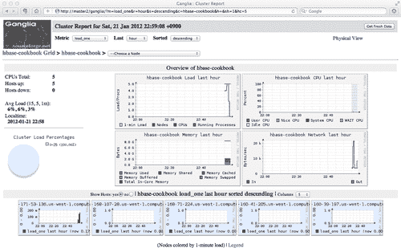
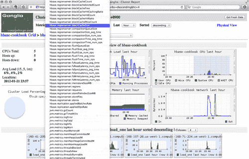
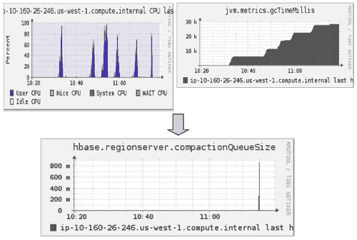
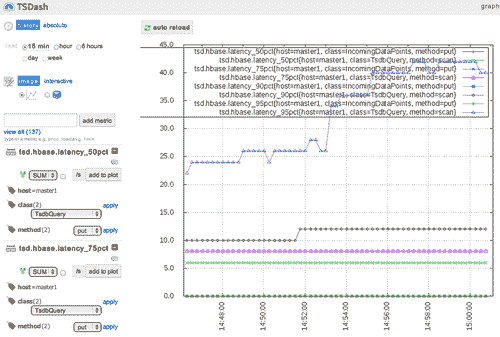
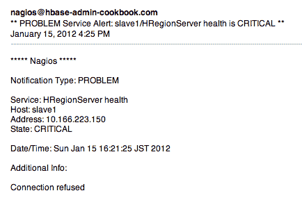
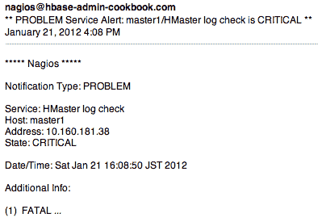
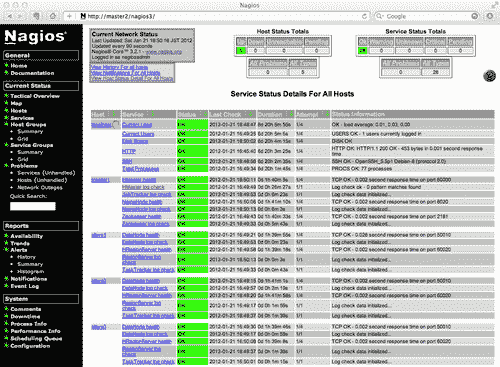

# 第五章：监测与诊断

在本章中，我们将重点介绍：

*   显示 HBase 表的磁盘利用率
*   设置 Ganglia 以监视 HBase 群集
*   OpenTSDB-使用 HBase 监视 HBase 群集
*   设置 Nagios 以监视 HBase 进程
*   使用 Nagios 检查 Hadoop/HBase 日志
*   用于报告群集状态的简单脚本
*   热区-写入诊断

# 简介

监视 HBase 群集的状态以确保其按预期运行是至关重要的。 除了单独考虑每台服务器的情况外，监视分布式系统的挑战还在于您还需要查看集群的整体状态。

HBase 继承了 Hadoop 指标框架的监控 API。 它公开了大量的指标，提供了集群的洞察信息。 这些指标随后被配置为公开其他监视系统，如 Ganglia 或 OpenTSDB，以收集它们并使其通过图形可见。 Ganglia/OpenTSDB 图帮助我们理解集群的洞察力，包括单个服务器和整个集群。

图形有助于获得历史状态的概述，但我们还需要一种机制来检查群集的当前状态，并在群集出现问题时向我们发送通知或采取一些自动操作。 Nagios 是这类监控任务的一个很好的解决方案。 Nagios 位于监控系统的中心，用于监视集群资源并提醒用户。

我们将介绍如何使用 Ganglia、OpenTSDB、Nagios 和其他工具监视和诊断 HBase 集群。 我们将从一个简单的任务开始，显示 HBase 表的磁盘利用率。 我们将安装和配置 Ganglia 以监视 HBase 指标，并使用 Ganglia 图显示一个示例。 我们还将设置 OpenTSDB，它类似于 Ganglia，但可伸缩性更好，因为它构建在 HBase 之上。

我们将设置 Nagios 来检查我们想要检查的所有内容，包括与 HBase 相关的守护进程运行状况、Hadoop/HBase 日志、HBase 不一致、HDFS 运行状况和空间利用率。

在最后一个菜谱中，我们将描述一种诊断和修复常见热点区域问题的方法。

# 显示 HBase 表的磁盘利用率

在本食谱中，我们将显示以下简单问题的答案：

HBase 或单个 HBase 表在 HDFS 上使用了多少空间？

这是一项非常简单的任务，但您可能需要经常回答这个问题。 我们会给您一些小费，让您轻松一点。

## 做好准备

启动您的 HBase 群集并登录到您的 HBase 客户端节点。 我们假设 HDFS 上的 HBase 根目录为 `/hbase`。

## 怎么做……

显示 HBase 表磁盘利用率的说明如下：

1.  通过执行以下命令显示所有 HBase 对象的磁盘利用率：

    ```scala
    $ $HADOOP_HOME/bin/hadoop fs -dus /hbase
    hdfs://master1:8020/hbase 1016842660

    ```

2.  通过执行以下命令显示特定 HBase 表(`hly_temp`)的磁盘利用率：

    ```scala
    $ $HADOOP_HOME/bin/hadoop fs -dus /hbase/hly_temp
    hdfs://master1:8020/hbase/hly_temp 54738763

    ```

3.  通过执行以下命令，显示 HBase 表的区域及其磁盘利用率的列表：

    ```scala
    $ $HADOOP_HOME/bin/hadoop fs -du /hbase/hly_temp
    Found 3 items
    27709729 hdfs://master1:8020/hbase/hly_temp/
    0b593d9dc044f1fe011ec0c902f68fc5
    13545245 hdfs://master1:8020/hbase/hly_temp/
    5740a39d9eaa59c4175487c14e0a272a
    13483789 hdfs://master1:8020/hbase/hly_temp/
    5ef67f6d2a792fb0bd737863dc00b6a7

    ```

## 它是如何工作的.

所有 HBase 对象都存储在 HDFS 上的 HBase 根目录下。 HBase 根目录由 HBase 配置文件(`hbase-site.xml`)中的 `hbase.rootdir`属性配置。 默认情况下，根目录为 `/hbase`。 因此，所有 HBase 对象的磁盘使用率等于 HBase 根目录下的 HDFS 使用率。

在步骤 1 中，为了显示 HDFS 的使用情况，我们运行 `hadoop fs -dus`命令，将我们的 HBase 根目录(/HBase)传递给它。 `/hbase`目录下的空间量以字节为单位显示在输出中。

在步骤 2 中，为了显示 `hly_temp`表的磁盘利用率，我们只将 `/hbase/hly_temp`传递给 `hadoop fs -dus`命令。 这是可能的，因为特定 HBase 表的对象存储在 HDFS 上的 `${hbase.rootdir}/<table_name>`目录下。

第三步有点不同。 我们运行 `hadoop fs -du`命令以显示 `hly_temp`表的区域及其磁盘利用率的列表。 `hadoop fs -du`命令类似于 `hadoop fs -dus`命令，但会显示特定路径下每个目录/文件的空间量。

## 还有更多...

正如您从输出中看到的，磁盘利用率是以字节为单位显示的，这对用户不友好，特别是当它是一个大数字时。 下面是一个简单的 JRuby 脚本，用于将输出转换为人类可读的格式：

1.  创建包含以下内容的 `dus.rb`文件：

    ```scala
    $ vi dus.rb
    include Java
    import org.apache.hadoop.util.StringUtils
    path = ARGV[0]
    dus = %x[$HADOOP_HOME/bin/hadoop fs -dus #{path}]
    splited = dus.split
    byteDesc = StringUtils.byteDesc(splited[1].to_i)
    puts splited[0] + "\t" + byteDesc

    ```

2.  Run `dus.rb` to show HBase's disk utilization with a humanly readable output:

    ```scala
    $ $HBASE_HOME/bin/hbase org.jruby.Main dus.rb /hbase
    hdfs://master1:8020/hbase 969.74 MB

    ```

    在 `dus.rb`中，我们只需执行相同的 `hadoop fs -dus`命令来确定 HBase 正在使用的空间量。 之后，我们使用 `org.apache.hadoop.util.StringUtils`类将值转换为友好的格式，然后将转换后的值显示为输出。

# 设置 Ganglia 以监视 HBase 群集

HBase 操作任务中最重要的部分之一是监视集群并确保其按预期运行。 HBase 从 Hadoop 继承其监控 API。 它公开了许多指标，这些指标提供了集群当前状态的洞察信息，包括基于区域的统计信息、RPC 详细信息以及**Java Virtual Machine(JVM)**内存和垃圾收集数据。

然后将这些指标配置为向 JMX 和 Ganglia 公开，从而使指标通过图形可见。 Ganglia 是监控大规模集群的推荐工具。 Ganglia 本身是一个可伸缩的分布式系统；据说它能够处理具有 2000 个节点的集群。

在本食谱中，我们将描述如何使用 Ganglia 监视 HBase 集群。 我们将在集群中的每个节点上安装**Ganglia Monitoring Daemon(Gmond)**，它将收集该节点的服务器和 HBase 指标。 这些指标随后被轮询到**Ganglia Meta Daemon(Gmetad)**服务器，在那里使用**轮询数据库工具(RRDtool)**计算指标并将其保存在轮询的时间序列数据库中。 我们在这里只设置一个 Gmetad 节点，但也可以向外扩展到多个 Gmetad 节点，在每个 Gmetad 节点上聚合其分配的 Gmond 节点的结果。

我们还将在同一个 Gmetad 服务器上安装 PHP Web 前端，这样我们就可以从 Web 浏览器访问 Ganglia。 最后，我们将描述如何配置 HBase 以将其指标公开给 Ganglia。

## 做好准备

除了集群中的服务器之外，您还需要一个 Gmetad 服务器来在其上运行 Gmetad 守护进程。 在我们的演示中，我们将使用 `master2`作为 Gmetad 服务器。

添加 `ganglia`用户作为 Ganglia 守护进程的所有者：

```scala
# adduser --disabled-login --no-create-home ganglia

```

在您想要监视的所有节点上，从[http://downloads.sourceforge.net/project/ganglia/ganglia%20monitoring%20core/3.0.7%20%28Fossett%29/ganglia-3.0.7.tar.gz](http://downloads.sourceforge.net/project/ganglia/ganglia%20monitoring%20core/3.0.7%20%28Fossett%29/ganglia-3.0.7.tar.gz)下载 Ganglia-3.0.7。

解压下载的 tarball。 您需要所有服务器上的 root 权限才能安装 Ganglia。

## 怎么做……

设置 Gmond 的说明如下；需要在要监视的所有节点上执行：

1.  安装依赖项：

    ```scala
    # apt-get install build-essential libapr1-dev libconfuse-dev libexpat1-dev python-dev

    ```

2.  构建并安装 Ganglia：

    ```scala
    # cd ganglia-3.0.7
    # ./configure
    # make
    # make install

    ```

3.  生成默认配置文件：__T0++
4.  对生成的配置文件进行以下更改：

    ```scala
    # vi /etc/gmond.conf
    globals {
    user = ganglia
    }
    cluster {
    name = "hbase-cookbook"
    }
    udp_send_channel {
    # mcast_join = 239.2.11.71
    host = master2
    port = 8649
    # ttl = 1
    }
    udp_recv_channel {
    # mcast_join = 239.2.11.71
    port = 8649
    # bind = 239.2.11.71
    }

    ```

5.  启动 Gmond：

    ```scala
    # gmond

    ```

    *   按照以下说明设置 Gmetad。 仅在 Gmetad 节点上执行它们。
6.  安装依赖项：

    ```scala
    # apt-get install build-essential libapr1-dev libconfuse-dev libexpat1-dev python-dev librrd2-dev

    ```

7.  构建并安装 Gmetad：

    ```scala
    # cd ganglia-3.0.7
    # ./configure --with-gmetad
    # make
    # make install

    ```

8.  将示例配置文件(`gmetad.conf`)复制到其默认位置：

    ```scala
    # cp ganglia-3.0.7/gmetad/gmetad.conf /etc/gmetad.conf

    ```

9.  找到并更改以下设置，如下面的代码片断所示：

    ```scala
    # vi /etc/gmetad.conf
    data_source "hbase-cookbook" master2
    gridname "hbase-cookbook"
    setuid_username "ganglia"

    ```

10.  为循环数据库创建目录，以存储收集的数据：

    ```scala
    # mkdir -p /var/lib/ganglia/rrds
    # chown -R ganglia:ganglia /var/lib/ganglia

    ```

11.  启动 Gmetad：

    ```scala
    # gmetad

    ```

    *   以下是设置 Ganglia Web 前端的说明。 仅在 Web 前端节点上执行这些步骤。 它通常与 Gmetad 节点相同。
12.  安装依赖项：

    ```scala
    # apt-get install rrdtool apache2 php5-mysql libapache2-mod-php5 php5-gd

    ```

13.  将 Ganglia Web 前端的 PHP 文件复制到存储 Apache Web 文件的位置：

    ```scala
    # cp -r ganglia-3.0.7/web /var/www/ganglia

    ```

14.  Restart the Apache web server:

    ```scala
    # /etc/init.d/apache2 restart

    ```

    *   You should be able to access your Ganglia web frontend page at: `http://master2/ganglia/.`

        Ganglia 前端页面包含 Ganglia 收集的所有指标图，如以下屏幕截图所示：

    

    *   最后，以下是 HBase 将其指标导出到 Ganglia 的说明：
15.  编辑 HBase 指标配置文件(`hadoop-metrics.properties`)，如下所示：

    ```scala
    hadoop@master1$ vi $HBASE_HOME/conf/hadoop-metrics.properties
    hbase.extendedperiod = 3600
    hbase.class=org.apache.hadoop.metrics.ganglia.GangliaContext
    hbase.period=10
    hbase.servers=master2:8649
    jvm.class=org.apache.hadoop.metrics.ganglia.GangliaContext
    jvm.period=10
    jvm.servers=master2:8649
    rpc.class=org.apache.hadoop.metrics.ganglia.GangliaContext
    rpc.period=10
    rpc.servers=master2:8649

    ```

16.  Sync `hadoop-metrics.properties` to the slave nodes and restart HBase. You will find that HBase metrics are now collected by Ganglia automatically, as shown in the following screenshot:

    

## 它是如何工作的.

在撰写本书时，HBase 只支持 Ganglia 3.0.x 版本。 这是因为在较新的 3.1.x 版本中更改了网络协议。 这就是为什么我们必须从源代码安装 Ganglia，而不是使用包管理系统。

我们通过在步骤 3 中执行 `gmond --default_config`命令生成了一个默认配置文件。该文件在 `/etc/gmond.conf`处创建，这是 gmond 守护进程将读取的默认配置文件。

在步骤 4 中，我们将 gmond 守护进程的所有者设置为 `ganglia`用户，并将群集名称设置为 `hbase-cookbook`。 我们将 Gmond 之间使用的默认 UDP 多播通信方法配置为使用单播消息，而不是使用默认的 UDP 多播通信方法。 这是通过注释掉多播地址和**生存时间(TTL)**设置，并在 `gmond.conf`文件中添加专用主 Gmond 节点(`master2`)来实现的。 我们选择单播是因为 Amazon EC2 环境不支持多播。 另一个原因是，使用单播对于大型集群是有好处的，比如拥有 100 个以上节点的集群。

需要在要监视的所有节点上安装并启动 Gmond。 默认情况下，Gmond 监视该节点上的一些基本服务器指标，例如平均负载和 CPU/内存/磁盘使用率。

要安装 Gmetad，我们添加了 `--with-gmetad`选项，以便从源代码编译 Gmetad。 在步骤 8 和 9 中，我们将示例配置文件(`gmetad.conf`)复制到默认位置 `/etc/gmetad.conf`，并添加了一些更改，包括设置 Gmetad 守护进程的数据源、网格名称和所有者用户。 请注意，当使用单播时，您需要将 `data_source`设置为在 Gmond 设置中配置的专用 Gmond 服务器。

在步骤 10 中，我们创建了默认目录(`/var/lib/ganglia/rrds`)，Gmetad 将收集的数据存储在循环数据库中。 之后，我们在 Gmetad 服务器(`master2`)上启动了 gmetad 守护进程。

Ganglia 设置的最后一部分是 PHP Web 前端。 它通常设置在相同的 Gmetad 节点上，以便它可以访问由 Gmetad 守护进程创建的循环数据库。 这一点在前面说明的步骤 12 到 14 中进行了说明。 您现在应该能够访问位于 `http://master2/ganglia/`的 Ganglia 网页，其中 `master2`是运行 Gmetad 的主机。 您将只看到 Gmond 节点的基本图表，因为 HBase 还没有配置为向 Ganglia 公开其指标。

它是在 `hadoop-metrics.properties`配置文件中设置的，用于集成 HBase 和 Ganglia。 请勿更改文件名，因为 HBase 从 Hadoop 继承其监控 API。 在该文件中，我们指示 HBase 使用 `org.apache.hadoop.metrics.ganglia.GangliaContext`类将服务器进程收集的指标发送到在 `master2:8649`上运行的 gmond 守护进程，这是我们在前面指定的专用 gmond 节点。

将 `hadoop-metrics.properties`同步到从节点，然后重新启动 HBase；您现在可以在 Ganglia 网页上找到 HBase 指标图。

有一些图表您应该特别注意，如下图所示：

*   CPU 和内存使用率
*   JVM GC 计数和时间
*   HBase RegionServer 压缩队列大小
*   HBase RegionServer 刷新队列大小

例如，压缩队列大小指示区域服务器中有多少存储已排队等待压缩。 通常这应该相当低(最多几十个 RegionServer)。 当服务器过载或出现 I/O 问题时，您将在图表上看到一个峰值。

下面的屏幕截图显示了在几轮繁重的写入高峰之后，区域服务器的 CPU 使用率、JVMGC 时间和 HBase 压缩队列大小。 如您所见，CPU 使用率和较长的垃圾收集时间表明服务器超载。 这会显著增加压缩队列大小。



## 还有更多...

Ganglia 也可以用来监控 Hadoop。 其设置类似于我们在本食谱中所描述的。 Ganglia 可以监控以下 Hadoop 指标：

*   HDFS 指标
*   MapReduce 指标
*   JVM 指标
*   Hadoop RPC 指标

## 另请参阅

在本章中：

*   *OpenTSDB-使用 HBase 监控 HBase 群集*

# OpenTSDB-使用 HBase 监控 HBase 群集

**OpenTSDB**是构建在 HBase 之上的高度可伸缩的**时间序列数据库(TSDB)**。 与 Ganglia 类似，OpenTSDB 可用于监视各种系统，包括 HBase。 与将数据存储在 RRDtool 中的 Ganglia 相比，OpenTSDB 利用 HBase 的可伸缩性对其进行更大规模的监控。 以下是 OpenTSDB 主页([http://opentsdb.net/](http://opentsdb.net/))的介绍：

> 由于 HBase 的可伸缩性，OpenTSDB 允许您以高速率(每隔几秒钟)从数千台主机和应用程序收集数千个指标。 OpenTSDB 永远不会删除或下采样数据，可以轻松存储数十亿个数据点。

要使用 OpenTSDB，我们需要编写一些小脚本来从我们的系统中收集数据，并每隔几秒钟将它们推送到 OpenTSDB 中。 **TCollector**是一个用于从 Linux、MySQL、Hadoop、HBase 等收集 OpenTSDB 指标的框架。 有趣的是，OpenTSDB 使用 HBase(存储指标)来监控 HBase 本身。

在本食谱中，我们将介绍如何设置 OpenTSDB 和 TCollector，并使用它们来监控我们的 HBase 集群。 在演示中，我们将只启动一个**时序守护进程(TSD)**。 但是，可以在多台服务器上运行更多 TSD，因为它们彼此独立。

## 做好准备

您需要一台服务器来运行 TSD。 在我们的演示中，我们将使用 `master2`作为 TSD 服务器。

在 TSD 服务器(`master2`)上，添加 `tsdb`用户作为 TSD 守护进程的所有者。 我们将所有 OpenTSDB 文件和数据存储在 `/usr/local/opentsdb:`下

```scala
root# adduser --disabled-login --no-create-home tsdb
root# mkdir /usr/local/opentsdb
root# chown tsdb:tsdb /usr/local/opentsdb

```

我们将在 `/usr/local/tcollector`目录下安装 TCollector。

您需要在 TSD 服务器和要监视的所有节点(如 Hadoop DataNodes 和 HBase RegionServers)上拥有 root 权限。

最后，确保您的 HBase 集群正在运行。 我们假设您的 `HBASE_HOME`环境变量是 `/usr/local/hbase/current`，并且 ZooKeeper 仲裁运行在 `master1:2181`。

## 怎么做……

OpenTSDB 和收集器的设置说明如下：

*   **在 TSD 服务器上设置 OpenTSDB：**首先，我们将在 TSD 服务器(`master2`)上安装和配置 OpenTSDB，如下所示：
    1.  安装依赖项：

        ```scala
        hac@master2$ sudo apt-get install gnuplot
        hac@master2$ sudo apt-get install autoconf

        ```

    2.  从[https://github.com/stumbleupon/opentsdb](http://https://github.com/stumbleupon/opentsdb)下载最新版本的 OpenTSDB。 我们假设下载的目录是 `$TSDB_INSTALL`。 要构建和安装 OpenTSDB，请执行以下命令：

        ```scala
        hac@master2$ cd $TSDB_INSTALL
        hac@master2$ PATH=$PATH:$JAVA_HOME/bin
        hac@master2$ ./build.sh
        hac@master2$ cd build
        hac@master2$ sudo make install

        ```

    3.  在 HBase 中创建 OpenTSDB 表：

        ```scala
        hac@master2$ export COMPRESSION=LZO
        hac@master2$ export HBASE_HOME=/usr/local/hbase/current
        hac@master2$ sh $TSDB_INSTALL/src/create_table.sh

        ```

        *   此步骤要求 HBase 群集支持 LZO 压缩。 如果您的集群不支持 LZO，请不要调用第一个命令。 有关如何向 HBase 添加 LZO 支持的信息，请参阅第 8 章*基本性能调整*中的*使用压缩*配方。
    4.  创建 OpenTSDB 存储其文件的目录，然后启动 TSD 守护进程：

        ```scala
        hac@master2$ sudo su tsdb
        tsdb@master2$ cd /usr/local/opentsdb
        tsdb@master2$ PATH=$PATH:$JAVA_HOME/bin
        tsdb@master2$ tsdtmp=/usr/local/opentsdb/var
        tsdb@master2$ mkdir -p "$tsdtmp"
        tsdb@master2$ tsdstatic=/usr/local/share/opentsdb/static
        tsdb@master2$ nohup tsdb tsd --port=4242 --staticroot="$tsdstatic"
        --cachedir="$tsdtmp" --zkquorum=master1:2181 &

        ```

    5.  要验证我们的安装，请通过执行以下命令创建 OpenTSDB 自己的指标：

        ```scala
        tsdb@master2$ echo stats | nc -w 1 localhost 4242 \
        | awk '{ print $1 }' | sort -u \
        | xargs tsdb mkmetric
        metrics tsd.compaction.count: [0, 0, 2]
        metrics tsd.connectionmgr.connections: [0, 0, 3]
        metrics tsd.connectionmgr.exceptions: [0, 0, 4]
        metrics tsd.hbase.latency_50pct: [0, 0, 5]
        metrics tsd.hbase.latency_75pct: [0, 0, 6]
        metrics tsd.hbase.latency_90pct: [0, 0, 7]
        metrics tsd.hbase.latency_95pct: [0, 0, 8]
        metrics tsd.hbase.meta_lookups: [0, 0, 9]
        metrics tsd.hbase.root_lookups: [0, 0, 10]
        metrics tsd.http.graph.requests: [0, 0, 11]
        metrics tsd.http.latency_50pct: [0, 0, 12]
        metrics tsd.http.latency_75pct: [0, 0, 13]
        metrics tsd.http.latency_90pct: [0, 0, 14]
        metrics tsd.http.latency_95pct: [0, 0, 15]
        metrics tsd.jvm.ramfree: [0, 0, 1]
        metrics tsd.jvm.ramused: [0, 0, 16]
        metrics tsd.rpc.errors: [0, 0, 17]
        metrics tsd.rpc.exceptions: [0, 0, 18]
        metrics tsd.rpc.received: [0, 0, 19]
        metrics tsd.uid.cache-hit: [0, 0, 20]
        metrics tsd.uid.cache-miss: [0, 0, 21]
        metrics tsd.uid.cache-size: [0, 0, 22]

        ```

    6.  创建一个简单的脚本来收集 OpenTSDB 公开的统计数据，并使用 OpenTSDB 监视自身：

        ```scala
        tsdb@master2$ vi tsdb-status.sh
        #!/bin/bash
        INTERVAL=15
        while :; do
        echo stats || exit
        sleep $INTERVAL
        done | nc -w 30 localhost 4242 \
        | sed 's/^/put /' \
        | nc -w 30 localhost 4242
        tsdb@master2$ chmod 755 tsdb-status.sh
        tsdb@master2$ nohup ./tsdb-status.sh &

        ```

    7.  By opening your browser and accessing `http://master2:4242/`, you will get the OpenTSDB web UI (make sure the 4242 port is open to your client). Enter a time period of the graph to show in the **From** and **To** fields, and metric name in the **Metric** (type `tsd.`, and metrics that start with `tsd`. will pop up) field, you should get a graph, as shown in the following screenshot:

        

*   **设置收集器：**对于您想要监控的所有节点，例如 Hadoop DataNodes 和 HBase RegionServers，我们需要在它们上设置收集器。 需要在要监视的每个节点上执行以下步骤：
    1.  从[http://github.com/stumbleupon/tcollector](http://github.com/stumbleupon/tcollector)下载最新版本的收集器，并执行以下命令：

        ```scala
        $ sudo mv tcollector /usr/local
        $ cd /urs/local/tcollector

        ```

    2.  有一个收集器，它附带了一个收集器，用于从 HBase RegionServer 收集指标。 Grep `hbase_regionserver_jmx.py`中的以下行并修改它们以适合您的环境：

        ```scala
        $ sudo vi collectors/0/hbase_regionserver_jmx.py
        #USER = "hadoop"
        USER = "your_running_user"
        CLASSPATH = [
        # "/usr/lib/jvm/java-6-sun/lib/tools.jar",
        "/your/java_home/lib/tools.jar",
        ]
        jmx = subprocess.Popen(
        # ["java", "-enableassertions", ...
        ["/your/java_home/bin/java", "-enableassertions", ...

        ```

    3.  在收集器的启动脚本中，添加运行 TSD 守护程序的服务器的 DNS 名称：

        ```scala
        $ sudo vi startstop
        TSD_HOST=master2

        ```

    4.  在您的 TSD 服务器上，使用 `--auto-metric`选项重新启动 TSD 守护进程：

        ```scala
        tsdb@master2$ nohup tsdb tsd --port=4242 --staticroot="$tsdstatic" --cachedir="$tsdtmp" --zkquorum=master1:2181 --auto-metric &

        ```

    5.  Start Tcollector to collect metrics and send them to TSD:

        ```scala
        $ sudo /usr/local/tcollector/startstop start

        ```

        一段时间后，您应该能够在 OpenTSDB web UI 上查看 TCollector 收集的指标。 下面的屏幕截图显示了我们的 HBase 集群由收集器收集的指标：

        

## 它是如何工作的.

在前面说明的步骤 1 和 2 中，我们安装了 OpenTSDB 及其依赖项。 因为 OpenTSDB 构建在 HBase 之上，所以我们需要首先在 HBase 中创建 OpenTSDB 的表。 在步骤 3 中，我们将 OpenTSDB 配置为创建支持 LZO 压缩的表。 这需要 HBase 群集支持 LZO。 您还可以使用其他 HBase 支持的压缩，如 Snappy 和 Gzip，但只要确保您的 HBase 集群上有可用的压缩即可。

之后，我们通过设置 `HBASE_HOME`环境变量来指定 HBase 的安装位置。 然后，我们调用 `create_table.sh`在 HBase 中实际创建表。 此脚本随 OpenTSDB 一起提供；它创建两个表-TSDB 和 `tsdb-uid`。 您可以在 HBase 主用户界面上找到这些表。

在步骤 4 中，我们创建了必要的目录，并启动了 OpenTSDB，并提供了使用这些目录的选项。 我们还传递了 `--zkquorum=master1:2181`选项来指定放置动物园管理员仲裁的位置。

为了验证我们的安装，我们在步骤 5 和 6 中将 OpenTSDB 设置为收集自己的指标。默认情况下，我们需要使用 `tsdb mkmetric`命令创建一个指标，然后才能将该指标存储到 OpenTSDB 中。 这是为了防止制定太多指标而设计的，因为过多的指标会使指标名称空间变得一团糟。 如我们在步骤 11 中所示，使用 `--auto-metric`选项启动 TSD 守护进程会将 OpenTSDB 配置为自动生成它收到的指标。

TSD 守护进程接受 `stats`命令以公开其自己的指标。 在步骤 5 中，我们使用这一点来制定指标。

在步骤 6 中，我们创建了一个简单的脚本，使用 `stats`命令定期获取 TSD 守护进程的指标，然后使用 `put`命令将它们放入 OpenTSDB。 如步骤 7 所示，收集的 OpenTSDB 自己的指标在其 Web UI 上显示为图形。

在步骤 8 到 12 中，我们在要监视的每台服务器上设置了收集器。 TCollector 从 Hadoop、HBase 等收集指标，并将它们发送到 TSD 守护进程。 在收集器的启动脚本(`startstop`)中，我们将 `TSD_HOST`设置为 TSD 服务器的 DNS 名称，以指定我们应该将指标发送到哪个服务器。

在步骤 11 中，我们使用 `--auto-metric`选项重新启动了 TSD 守护进程，以便在 OpenTSDB 中自动创建从 TCollector 接收的指标。 正如我们前面提到的，自动创建指标不被认为是一种良好的做法。 您应该知道系统正在收集哪些指标，并手动创建这些指标以确保指标名称空间是干净的。

最后，我们启动了 TCollector，开始收集指标并将其发送到 TSD 守护进程。 指标将存储在 HBase 中，并在 OpenTSDB 的 Web 用户界面上显示为图表。

## 还有更多...

**TSDash**是 OpenTSDB 的替代 Web UI/仪表板。 TSDash 提供了与 OpenTSDB web UI 相同的功能，但用户界面略有不同。 以下屏幕截图显示了 TSDash 的 UI 和示例图形：



TSDash 可在[https://github.com/facebook/tsdash/](http://https://github.com/facebook/tsdash/)获得。

# 设置 Nagios 以监视 HBase 进程

监控集群中的 HBase 相关进程是运行 HBase 的重要组成部分。 基本监控是通过对 HBase 进程运行运行状况检查并在任何进程关闭时通知管理员来完成的。

**Nagios**是一款流行的开源监控软件，用于监视主机、服务和资源，并在出现故障和再次恢复时向用户发出警报。 定制模块可以很容易地扩展 Nagios，这些模块被称为**插件**。 `check_tcp`插件随 Nagios 安装一起提供。 我们可以使用此插件向 Hadoop/HBase 守护进程的 RPC 端口发送 ping 命令，以检查该守护进程是否处于活动状态。

在本食谱中，我们将设置一个运行 Nagios 的监视服务器来监视整个集群中所有与 HBase 相关的进程。 我们将 Nagios 配置为在任何 Hadoop/HBase/zooKeeper 进程关闭时向我们发送电子邮件通知。

## 做好准备

您需要一个监控服务器来运行 Nagios。 我们假设您使用的是安装最少的 Debian 机器。 监控服务器需要能够通过正确的 TCP 端口与集群中的所有机器通信。 在我们的演示中，我们将使用 `master2`作为监控服务器。

启动要监视的 HBase 集群，然后登录到监视服务器。 确保您在监视服务器上具有 root 权限。

## 怎么做……

安装和配置 Nagios 以监视您的 HBase 集群的说明如下：

1.  使用 Linux 发行版的包管理工具在监视服务器上安装 Nagios：

    ```scala
    root@master2# apt-get install nagios3 nagios-plugins

    ```

    *   在安装过程中，会要求您输入`nagiosadmin`密码和 Samba 工作组设置；输入您的密码，并将 Samba 工作组设置设为默认设置。
2.  You should be able to access the Nagios admin page from your web browser using the URL `http://<monitor_host>/nagios3/`.

    系统将要求您输入帐号和密码；使用 nagiosadmin 和您在安装中设置的密码登录到 Nagios 管理页面。 Nagios 管理页面类似于以下屏幕截图：

    

3.  将 HBase 集群中的所有主机添加到 Nagios 主机配置文件：

    ```scala
    root@master2# vi /etc/nagios3/conf.d/hosts_nagios2.cfg
    #master1
    define host{
    use generic-host
    host_name master1
    alias master1
    address 10.160.41.205
    hostgroups masters
    }
    #slave1
    define host{
    use generic-host
    host_name slave1
    alias slave1
    address 10.168.71.224
    hostgroups slaves
    }
    #slave2
    define host{
    use generic-host
    host_name slave2
    alias slave2
    address 10.168.107.28
    hostgroups slaves
    }
    #slave3
    define host{
    use generic-host
    host_name slave3
    alias slave3
    address 10.160.39.197
    hostgroups slaves
    }

    ```

4.  通过执行以下命令将 `masters`和 `slaves`主机组添加到 Nagios：

    ```scala
    root@master2# vi /etc/nagios3/conf.d/hostgroups_nagios2.cfg
    # A list of your master servers
    define hostgroup {
    hostgroup_name masters
    alias Master servers
    members master1
    }
    # A list of your slave servers
    define hostgroup {
    hostgroup_name slaves
    alias Slave servers
    members slave1,slave2,slave3
    }

    ```

5.  配置 Nagios 以监视主节点上的主守护进程。 我们假设 NameNode、ZooKeeper 和 HMaster 守护进程在同一主节点(`master1`)上运行。

    ```scala
    root@master2# vi /etc/nagios3/conf.d/services_nagios2.cfg
    # check that NameNode is running
    define service{
    use generic-service
    host_name master1
    normal_check_interval 1
    service_description NameNode health
    check_command check_tcp!8020!
    }
    # check that ZooKeeper is running
    define service{
    use generic-service
    host_name master1
    normal_check_interval 1
    service_description Zookeeper health
    check_command check_tcp!2181!
    }
    # check that HMaster is running
    define service{
    use generic-service
    host_name master1
    normal_check_interval 1
    service_description HMaster health
    check_command check_tcp!60000!
    }

    ```

6.  将 Nagios 配置为监视所有从节点上的从守护进程：

    ```scala
    root@master2# vi /etc/nagios3/conf.d/services_nagios2.cfg
    # check that DataNodes are running
    define service{
    use generic-service
    hostgroup_name slaves
    normal_check_interval 1
    service_description DataNode health
    check_command check_tcp!50010!
    }
    # check that HRegionServers are running
    define service{
    use generic-service
    hostgroup_name slaves
    normal_check_interval 1
    service_description HRegionServer health
    check_command check_tcp!60020!
    }

    ```

7.  更改通知电子邮件地址；将其设置为您自己的地址：

    ```scala
    root@master2# vi /etc/nagios3/conf.d/contacts_nagios2.cfg
    define contact{
    contact_name root
    alias Root
    service_notification_period 24x7
    host_notification_period 24x7
    service_notification_options w,u,c,r
    host_notification_options d,r
    service_notification_commands notify-service-by-email
    host_notification_commands notify-host-by-email
    email address@example.com
    }

    ```

8.  安装 Postfix 电子邮件服务器，让 Nagios 发送电子邮件：

    ```scala
    root@master2# apt-get install postfix

    ```

    *   在安装过程中，将 Postfix 配置为**Internet Site**，并设置将从其接收 Nagios 邮件的域。
9.  通过执行以下命令验证配置更改：

    ```scala
    root@master2# /usr/sbin/nagios3 -v /etc/nagios3/nagios.cfg
    Total Warnings: 0
    Total Errors: 0

    ```

10.  If everything is fine, restart Nagios to apply the configuration changes:

    ```scala
    root@master2# /etc/init.d/nagios3 restart

    ```

    *   如下面的 Nagios 管理页面屏幕截图所示，Nagios 开始检查我们刚刚配置的与 HBase 相关的进程。 所有主机、Hadoop/HBase/zooKeeper 守护程序及其状态现在都显示在 Nagios 管理页面上：

    

11.  To test our Nagios settings, we stop the HRegionServer daemon from one of the slave nodes:

    ```scala
    hadoop@slave1$ hbase-daemon.sh stop regionserver

    ```

    *   一段时间后，Nagios 将检测到停机的区域服务器，并在 Nagios 管理页面上显示**Critical**状态，如以下屏幕截图所示：

    

    *   您还将收到一封来自 Nagios 的警报电子邮件，报告某个区域服务器已关闭，如以下屏幕截图所示：

    

12.  现在再次重新启动 HRegionServer 守护进程，以测试 Nagios 的恢复通知：

    ```scala
    hadoop@slave1$ hbase-daemon.sh start regionserver

    ```

    *   您会发现状态再次更改为**OK**。 您还将收到恢复电子邮件通知。

## 它是如何工作的.

Nagios 可用于许多 Linux 发行版。 使用发行版的包管理系统可以很容易地安装 Nagios。

Nagios 有一个管理网页，您可以在其中看到正在监视的集群的当前状态。 您可以按主机、主机组、服务和服务组查看状态。 您还可以在管理页面上生成非常详细的可用性和趋势报告。 管理页面的 URL 是 `http://<monitor_host>/nagios3/`，其中 `monitor_host`是监视服务器的主机名。

在步骤 3 中，我们将集群的主机定义添加到 Nagios 主机配置文件(`hosts_nagios2.cfg`)，以便 Nagios 可以监控这些远程节点。 在步骤 4 中，我们还设置了两个主机组： `masters`和 `slaves`主机组。 此设置允许我们以主机组为基础监视服务器。

在步骤 5 中，我们向 `services_nagios2.cfg`文件添加了几个服务定义，以配置 Nagios 来监视主节点(`master1`)上运行的主守护进程。 服务由 `check_command`监视，其中我们使用预定义的 `check_tcp`命令，将 NameNode/zooKeeper/HMaster 守护进程的 RPC 端口传递给它。

以类似的方式，我们定义了服务来监视在从节点上运行的从守护进程。 请注意，我们使用了之前在这些服务定义中添加的主机组(`slaves`)。

在步骤 7 中，我们通过编辑 `contacts_nagios2.cfg`文件将 Nagios 配置为向特定的电子邮件地址发送通知。 在那之后，我们安装了 Postfix 电子邮件服务器，让 Nagios 发送电子邮件。 最后，我们重新启动 Nagios 以应用我们的更改。

Nagios 定期向守护程序的 RPC 端口发送 ping，它正在监视该端口以检查守护程序是否处于活动状态。 如果 Nagios 无法从守护进程获得响应，它将在其管理页面上将守护进程的状态标记为**Critical**，并向我们指定的地址发送一封警报电子邮件。 此电子邮件包含有关主机名、守护进程状态、何时检测到**严重**状态以及其他其他信息的详细信息。

## 还有更多...

使用适当的端口，您还可以配置 Nagios 来监控其他 Hadoop/HBase/zooKeeper 守护进程，比如 MapReduce 的 JobTracker 和 TaskTracker 守护进程。 下表显示了您可能要监视的 Hadoop 守护程序及其默认 RPC/HTTP 端口的快速参考：

<colgroup><col style="text-align: left"> <col style="text-align: left"> <col style="text-align: left"> <col style="text-align: left"></colgroup> 
| 

精灵 / 恶魔 / 守护进程 / 后台程序

 | 

默认端口是默认端口

 | 

配置文件配置文件

 | 

配置参数

 |
| --- | --- | --- | --- |
| NameNode | 8020 | `core-site.xml` | `fs.default.name` |
| Second DaryNameNode | 50090 | `hdfs-site.xml` | `dfs.secondary.http.address` |
| JobTracker | 50030 | `mapred-site.xml` | `mapred.job.tracker.http.address` |
| HMaster | 60000 | `hbase-site.xml` | `hbase.master.port` |
| 动物园管理员法定人数 | 2181 | `zoo.cfg` | `clientPort` |
| 数据节点 | 50010 | `hdfs-site.xml` | `dfs.datanode.address` |
| 任务跟踪器 | 50060 | `mapred-site.xml` | `mapred.task.tracker.http.address` |
| HRegionServer | 60020 | `hbase-site.xml` | `hbase.regionserver.port` |

# 使用 Nagios 检查 Hadoop/HBase 日志

Hadoop、ZooKeeper 和 HBase 都会生成日志。 这些日志包括有关正常操作、警告/错误输出以及内部诊断数据的信息。 理想的做法是让系统收集和处理所有这些日志，以提取有关集群的有用洞察信息。 最基本的任务是检查这些日志，如果其中显示任何异常情况，就会得到通知。 只需几个简单的步骤，NRPE 和 `check_log`Nagios 插件就可以实现这个简单的目标。

NRPE 插件主页([http://exchange.nagios.org/directory/Addons/Monitoring-Agents/NRPE--2D-Nagios-Remote-Plugin-Executor/details](http://exchange.nagios.org/directory/Addons/Monitoring-Agents/NRPE--2D-Nagios-Remote-Plugin-Executor/details))的说明如下：

> NRPE 允许您在其他 Linux/Unix 计算机上远程执行 Nagios 插件。 这允许您监视远程机器指标(磁盘使用情况、CPU 负载等)。

使用 NRPE，我们可以在集群节点上远程执行 `check_log`Nagios 插件，以检查该节点生成的 Hadoop/HBase 日志。

`check_log`插件在指定的日志文件中递增地显示特定的查询词。 如果日志文件中的任何行与查询字匹配， `check_log`将向运行在同一节点上的 NRPE 服务器报告严重状态。 然后，NRPE 将其报告给 Nagios 服务器。

由于本书的范围有限，在本食谱中，我们将只演示如何设置 Nagios 来检查 HBase 的主守护进程日志。 您可以轻松地复制它并进行一些更改，以设置 Nagios 来监视其他日志。

## 做好准备

我们假设您已经正确设置了 Nagios 监控服务器，如前面的菜谱所述。

`check_log`插件将保存以前检查的日志，这样它只需要检查新添加的日志。 在主节点上为 `check_log`插件创建一个目录，以保存其先前检查的日志：

```scala
root@master1# mkdir -p /var/nagios/oldlog	

```

检查您的 HBase log4j 配置文件(`log4j.propertie`)，找出您的 HBase 生成其日志文件的位置。 我们假设它在这个配方中是 `/usr/local/hbase/logs/hbase-hadoop-master-master1.log`。

## 怎么做……

要使用 Nagios 检查 Hadoop/HBase 日志，请执行以下步骤：

1.  在监视服务器上安装 NRPE 插件(`master2`)：

    ```scala
    root@master2# apt-get install nagios-nrpe-plugin

    ```

2.  在 HBase 群集的主节点上安装 NRPE 服务器和插件：

    ```scala
    root@master1# apt-get install nagios-nrpe-server nagios-plugins

    ```

3.  在主节点上设置 NRPE，以允许监视服务器与其上运行的 NRPE 守护进程通信。 在 `nrpe.cfg`文件中更改监视服务器的 `allowed_hosts`设置，然后重新启动 NRPE 守护进程。 此步骤实现如下：

    ```scala
    root@master1# vi /etc/nagios/nrpe.cfg
    #allowed_hosts=127.0.0.1
    allowed_hosts=master2
    root@master1# /etc/init.d/nagios-nrpe-server restart

    ```

4.  在我们继续更改配置之前，请检查 NRPE 服务。 从监控服务器执行此操作。

    ```scala
    root@master2# /usr/lib/nagios/plugins/check_nrpe -H master1 -c check_users

    ```

    ```scala
    USERS OK - 2 users currently logged in |users=2;5;10;0

    ```

    *   输出应如下所示：
5.  在主节点上配置 `check_log`命令以检查 HBase 的主守护进程日志。 将以下命令添加到主节点上的 `nrpe.cfg`文件中。 您需要更改命令定义的日志文件路径以适合您的环境。

    ```scala
    root@master1# vi /etc/nagios/nrpe.cfg
    command[check_log_hmaster]=/usr/lib/nagios/plugins/ check_log -F /usr/local/hbase/logs/hbase-hadoop- master-master1.log -O/var/nagios/oldlog/hbase-hadoop- master-master1.log -q "ERROR|FATAL"

    ```

6.  重新启动主节点上的 NRPE 守护进程以应用我们的更改：

    ```scala
    root@master1# /etc/init.d/nagios-nrpe-server restart

    ```

7.  在监控服务器上添加以下服务定义以检查主日志：

    ```scala
    root@master2# vi /etc/nagios3/conf.d/services_nagios2.cfg
    # check HMaster log
    define service{
    use generic-service
    host_name master1
    normal_check_interval 1
    service_description HMaster log check
    max_check_attempts 1
    notification_options w,u,c
    check_command check_nrpe_1arg!check_log_hmaster
    }

    ```

8.  Restart Nagios on the monitor server to apply the service definitions:

    ```scala
    root@master2# /etc/init.d/nagios3 restart

    ```

    *   您会发现添加的服务显示在您的 Nagios 管理页面上。 Nagios 开始检查主节点上的 HMaster 守护进程的日志。

    

9.  Test the setup by adding a `FATAL` entry to the master daemon log:

    ```scala
    hadoop@master1$ echo "FATAL ..." >> /usr/local/hbase/logs/hbase- hadoop-master-master1.log

    ```

    *   一段时间后，Nagios 会检测到这一情况，并在 Nagios 管理页面上显示**Critical**状态，如以下屏幕截图所示：

    

    *   您还会收到一封来自 Nagios 的警报电子邮件，报告 HBase 的主守护程序日志中有问题，如以下屏幕截图所示：

    

## 它是如何工作的.

首先，我们需要在监视服务器上安装 NRPE 插件，在 HBase 集群中的所有节点上安装 NRPE 服务器和 Nagios 插件。

在步骤 3 中，为了允许监视服务器与远程节点上的 NRPE 守护进程对话，我们编辑了该节点上的 `nrpe.cfg`文件，将 `allowed_hosts`设置更改为监视服务器(`master2`)，然后重新启动了 NRPE 守护进程。

在步骤 4 中测试了 NRPE 设置之后，我们在步骤 5 中添加了 `check_log_hmaster`命令定义。该命令定义被添加到我们要检查的节点(HBase 主节点)上的 NRPE 配置文件(`nrpe.cfg`)中。 `check_log_hmaster`命令执行 `check_log`插件以检查 HBase 的主守护进程日志。

以下语法显示了 `check_log`插件的用法：

```scala
check_log <log_file> <old_log_file> <pattern>

```

我们传递了 HBase 主日志文件的完整路径、临时旧日志文件名和用于匹配异常状态日志的正则表达式。 我们只在日志文件中搜索 `ERROR`或 `FATAL`，它们是 log4j 记录错误或致命信息时的关键字。

在步骤 7 中，我们在监控服务器上的 `services_nagios2.cfg`文件中定义了一个服务。 请注意，在服务定义中：

*   `max_check_attempts`选项应为 `1`
*   不要将 `r`选项添加到 `notification_options`

这些都是必要的，因为 `check_log`插件的操作方式。

服务的 `check_command`选项是 `check_nrpe_1arg!check_log_hmaster`，这意味着它使用 NRPE 在远程服务器上执行 `check_log_hmaster`命令。

重新启动 HBase 主节点上的 NRPE 服务器和监控服务器上的 Nagios 守护进程。 您会发现 Nagios 开始监视 HBase 主日志，如果日志文件中出现 `ERROR`或 `FATAL`，则会向我们发送通知。

## 还有更多...

以下是您可能希望由 Nagios 监视的其他一些日志：

*   主节点上的 NameNode 日志
*   第二个 daryNameNode 记录在主节点上
*   主节点上的 JobTracker 日志
*   动物园管理员登录所有动物园管理员节点
*   RegionServer 登录所有区域服务器
*   DataNode 记录在所有从节点上
*   TaskTracker 记录在所有从节点上

您只需复制我们在此配方中所做的设置并更改日志文件路径，即可配置 Nagios 来监视这些日志。 如果所有这些日志都由 Nagios 监控，则您的 Nagios 管理页面应该类似于以下屏幕截图：



## 另请参阅

在本章中：

*   *设置 Nagios 以监视 HBase 进程*

# 报告群集状态的简单脚本

除了与 HBase 相关的守护进程及其日志的运行状况外，您可能需要监视集群的当前状态的概览。 该状态主要包括：

*   显示 HBase 表是否一致的 HBase `hbck`结果
*   显示 HDFS 是否正常的 Hadoop `fsck`结果
*   剩余的 HDFS 空间

在本食谱中，我们将创建一个 `check_hbase`Nagios 插件来执行监视任务。 我们将在集群的主节点上安装我们的 `check_hbase`插件，并使用 NRPE Nagios 插件在监控服务器上使用 Nagios 远程执行它。

## 做好准备

我们假设您已经在监视器和主服务器上安装并配置了 Nagios NRPE 插件。 如果您尚未安装，请参考前面的食谱了解详细的安装说明。

## 怎么做……

以下是获取 HBase 集群状态并通过 Nagios 对其进行监控的说明：

1.  创建如下所示的 `check_hbase`脚本：

    ```scala
    $ vi check_hbase

    #/bin/bash
    bin=`dirname $0`
    bin=`cd $bin;pwd`
    . $bin/utils.sh
    HADOOP_HOME=/usr/local/hadoop/current
    HBASE_HOME=/usr/local/hbase/current
    DFS_REMAINING_WARNING=15
    DFS_REMAINING_CRITICAL=5
    ABNORMAL_QUERY="INCONSISTENT|CORRUPT|FAILED|Exception"
    # hbck and fsck report
    output=/tmp/cluster-status
    $HBASE_HOME/bin/hbase hbck >> $output
    $HADOOP_HOME/bin/hadoop fsck /hbase >> $output
    # check report
    count=`egrep -c "$ABNORMAL_QUERY" $output`
    if [ $count -eq 0 ]; then
    echo "[OK] Cluster is healthy." >> $output
    else
    echo "[ABNORMAL] Cluster is abnormal!" >> $output
    # Get the last matching entry in the report file
    last_entry=`egrep "$ABNORMAL_QUERY" $output | tail -1`
    echo "($count) $last_entry"
    exit $STATE_CRITICAL
    fi
    # HDFS usage
    dfs_remaining=`curl -s http://master1:50070/dfshealth.jsp |egrep - o "DFS Remaining%.*%" | egrep -o "[0-9]*\.[0-9]*"`
    dfs_remaining_word="DFS Remaining%: ${dfs_remaining}%"
    echo "$dfs_remaining_word" >> $output
    # check HDFS usage
    dfs_remaining=`echo $dfs_remaining | awk -F '.' '{print $1}'`
    if [ $dfs_remaining -lt $DFS_REMAINING_CRITICAL ]; then
    echo "Low DFS space. $dfs_remaining_word"
    exit_status=$STATE_CRITICAL
    elif [ $dfs_remaining -lt $DFS_REMAINING_WARNING ]; then
    echo "Low DFS space. $dfs_remaining_word"
    exit_status=$STATE_WARNING
    else
    echo "HBase check OK - DFS and HBase healthy. $dfs_remaining_word"
    exit_status=$STATE_OK
    fi
    exit $exit_status

    ```

2.  将脚本复制到主节点上的 Nagios 插件文件夹，并更改其执行权限：

    ```scala
    root@master1# cp check_hbase /usr/lib/nagios/plugins
    root@master1# chmod 755 /usr/lib/nagios/plugins/check_hbase

    ```

3.  通过编辑 `nrpe.cfg`文件

    ```scala
    root@master1# vi /etc/nagios/nrpe.cfg
    command[check_hbase]=/usr/lib/nagios/plugins/check_hbase

    ```

    ，将 `check_hbase`命令添加到主节点上的 NRPE 配置中
4.  重新启动主节点上的 NRPE 守护进程以应用更改：

    ```scala
    root@master1# /etc/init.d/nagios-nrpe-server restart

    ```

5.  在监控服务器上添加 `check_hbase`服务定义：

    ```scala
    root@master2# vi /etc/nagios3/conf.d/services_nagios2.cfg
    # check hbck, fsck, and HDFS usage
    define service{
    use generic-service
    host_name master1
    normal_check_interval 5
    service_description hbck/fsck report and DFS usage check
    check_command check_nrpe_1arg!check_hbase
    }

    ```

6.  Restart Nagios to apply the changes:

    ```scala
    root@master2# /etc/init.d/nagios3 restart

    ```

    *   您会发现此服务已添加到您的 Nagios 管理页面，如以下屏幕截图所示：

    

7.  更改警告/严重阈值或异常查询词以测试插件。 例如，如果您将插件中的 `DFS_REMAINING_CRITICAL`更改为非常高的值，您将在一段时间后收到来自 Nagios 的警报通知。 具体实现如下：

    ```scala
    $ vi check_hbase
    #DFS_REMAINING_CRITICAL=10
    DFS_REMAINING_CRITICAL=40

    ```

如果剩余 HDFS 空间低于 40%，Nagios 将检测到此**临界**状态，如以下屏幕截图所示：


## 它是如何工作的.

在 `check_hbase`脚本中，我们首先执行 `hbase hbck`命令来获取 HBase 部署的当前状态报告。 我们还运行 `hadoop fsck /hbase`命令来检查 `/hbase`目录下的 HDFS 运行状况，该目录是 HBase 的默认根目录。 这些命令的输出被重定向到临时文件。

我们随后 grep 临时文件(如果找到任何 `ABNORMAL_QUERY`)，并将匹配计数和最后一个匹配条目显示为标准输出，然后以 `STATE_CRITICAL`状态退出。

剩余的 HDFS 空间从 HDFS 管理 Web URL 获取。 我们访问 URL，并使用正则表达式从 HTML 输出中提取剩余的空间值。 最后，我们将该值与警告/严重阈值进行比较，并生成脚本的正确输出和退出状态。 输出和退出状态随后将用作 Nagios 的监控结果。

在步骤 2 中，我们只是将脚本复制到 Nagios 插件目录，并使其具有足够的可执行性，可以作为 Nagios 插件安装。 然后，在步骤 3 和 4 中，我们添加了 NRPE 命令定义，并在主节点上重新启动了 NRPE 服务器。

在监控服务器上，我们在 `services_nagios2.cfg`文件中定义了 Nagios 服务，然后重新启动 Nagios 守护进程以应用更改。

如您所见，Nagios 开始使用我们的 `check_hbase`插件监视集群的状态，如果 `hbck`结果、 `fsck`结果或 HDFS 使用情况有任何异常，则发送通知。

## 还有更多...

您可能还希望监视群集的以下状态：

*   NameNode 存储文件系统映像的目录( `hdfs-site.xml)`中的`dfs.name.di`)中的可用空间
*   NameNode 存储事务(编辑)文件的目录中的可用空间( `hdfs-site.xml`中的`dfs.name.edits.dir`，默认情况下与 `dfs.name.dir`相同)
*   区域服务器托管的区域数量；上限应为 100 左右

这些可以用类似于我们刚才讨论的方式来完成。

## 另请参阅

*   *在本章中设置 Nagios 以监视 HBase 进程[t1*
*   *使用 Nagios 检查本章中的 Hadoop/HBase 日志*
*   *HBase hbck-使用管理工具检查[第 3 章](03.html "Chapter 3. Using Administration Tools")、*中的 HBase 群集*的运行状况*

# 热区-写入诊断

随着数据的不断增长，HBase 集群可能会因为表架构或行键设计不佳或其他一些原因而变得不平衡。 许多请求可能会到达表的一小部分区域。 这通常称为**热点区域问题**。

有两种类型的热点区域问题-热写和热读问题。 热写通常对我们更重要，因为热读将极大地受益于 HBase 内部缓存机制。 热写区问题的一种解决方案是找出热点区域，手动拆分，然后将拆分后的区域分发给其他地域服务器。

HBase 编辑将首先写入区域服务器的**预写日志(WAL)**。 一旦成功追加 WAL，就会发生对表数据的实际更新。 这种架构使得能够容易地获得近似的写入诊断。

在本食谱中，我们将创建一个 `WriteDiagnosis.java`Java 源，以从 Wal 获取写入诊断信息。 在某些情况下，此信息可用于找出 HBase 集群中的热点写入区域。

## 做好准备

启动您的 HBase 群集并登录到您的 HBase 客户端节点。

## 怎么做……

诊断您的 HBase 热点区域问题：

1.  创建一个 `WriteDiagnosis.java`文件，它有一个 `printWriteDiagnosis()`方法，如下所示：

    ```scala
    private static void printWriteDiagnosis(String logPath) throws IOException {
    Configuration conf = HBaseConfiguration.create();
    FileSystem fs = FileSystem.get(conf);
    FileStatus[] regionServers = fs.listStatus(new Path(logPath));
    HLog.Reader reader = new SequenceFileLogReader();
    Map<String, Long> result = new HashMap<String, Long>();
    for (FileStatus regionServer : regionServers) {
    Path regionServerPath = regionServer.getPath();
    FileStatus[] logs = fs.listStatus(regionServerPath);
    Map<String, Long> parsed = new HashMap<String, Long>();
    for (FileStatus log : logs) {
    System.out.println("Processing: " + log.getPath().toString());
    reader.init(fs, log.getPath(), conf);
    try {
    HLog.Entry entry;
    while ((entry = reader.next()) != null) {
    String tableName = Bytes.toString(entry.getKey().getTablename());
    String encodedRegionName = Bytes.toString(entry.getKey().getEncodedRegionName());
    String mapkey = tableName + "/" + encodedRegionName;
    Long editNum = parsed.get(mapkey);
    if (editNum == null) {
    editNum = 0L;
    }
    editNum += entry.getEdit().size();
    parsed.put(mapkey, editNum);
    }
    } finally {
    reader.close();
    }
    }
    for (String key : parsed.keySet()) {
    result.put(key, parsed.get(key));
    }
    }
    System.out.println();
    System.out.println("==== HBase Write Diagnosis ====");
    for (String region : result.keySet()) {
    long editNum = result.get(region);
    System.out.println(String.format("Region: %s Edits #: %d", region, editNum));
    }
    }

    ```

2.  前一个 Java 源代码的 `main()`方法条目如下所示：

    ```scala
    public static void main(String[] args) {
    try {
    if (args.length < 1) {
    usage();
    System.exit(-1);
    }
    String logPath = args[0];
    printWriteDiagnosis(logPath);
    } catch (Exception e) {
    e.printStackTrace();
    System.exit(-1);
    }
    }
    private static void usage() {
    System.err.println("Usage: WriteDiagnosis <HLOG_PATH>");
    System.err.println("HLOG_PATH:");
    System.err
    .println(" Path on HDFS where HLogs are stored. For example: /hbase/.logs");
    }

    ```

3.  将其打包为 JAR 文件(`hac-chapter5.jar`)，并使用 `hadoop jar`命令运行它：

    ```scala
    $HADOOP_HOME/bin/hadoop jar hac-chapter5.jar hac.chapter5.WriteDiagnosis /hbase/.logs

    ```

4.  You will get an output as shown in the following screenshot:

    

## 它是如何工作的.

HBase WAL 存储在 HDFS 的 `${hbase.rootdir}/.logs/<region_server>/`目录下。 WAL 以区域服务器为基础进行存储和轮换，这意味着单个 WAL 文件仅包含到同一托管区域服务器的区域的条目，而不包含到其他区域服务器的条目。 WAL 条目包含有关编辑的表格和区域名称以及编辑量的信息。

我们的 `WriteDiagnosis.java`文件只需遍历特定路径下的所有 WAL，提取表名、区域名称，并从 WAL 中编辑计数，然后打印每个区域的总编辑计数。

主要逻辑在 `printWriteDiagnosis()`方法中完成。 我们首先创建一个 `HLog.Reader`实例。 对于每个 WAL 文件，我们调用实例的 `init()`方法从 WAL 文件读取数据。 WAL 文件的条目由 `HLog.Entry`类表示。 对于每个条目，我们从其键中获取该条目所属的表名和区域名。 我们还使用 `HLog.Entry`类的 `getEdit().size()`方法获取条目的编辑次数。 有了所有这些信息，我们可以按区域汇总编辑总数。

`WriteDiagnosis.java`的 `main()`方法只从命令行检查日志路径参数，并将其传递给 `printWriteDiagnosis()`方法。

将 Java 源代码打包为 JAR 文件，并使用 `hadoop jar`命令运行它。 正如您从输出中看到的， `hly_temp`表有许多写请求，而表中的一个区域处理的请求是其他两个区域的两倍。 这是数据分布不均匀的典型情况。 您需要对我们刚刚找到的热点区域采取操作，例如手动将其一分为二。

请注意，输出中显示的编辑次数是近似值。 这是因为，如果 Wal 中的所有编辑都已持久化，则 Wal 可能会被后台线程删除；无法知道该已删除 Wal 中的编辑次数。

但是，对于许多情况，近似的写入诊断是足够好的解决方案。 您可以使用 `WriteDiagnosis.java`帮助查找热点写入区域。 当您关闭簇的自动区域分割时，它特别有用。

## 还有更多...

编译和执行我们的 `WriteDiagnosis.java`的一种更方便的方法是通过以下命令：

```scala
$ $HBASE_HOME/bin/hbase com.sun.tools.javac.Main WriteDiagno sis.java
$ $HBASE_HOME/bin/hbase WriteDiagnosis /hbase/.logs

```

## 另请参阅

*   *使用管理工具*中的[第 3 章](03.html "Chapter 3. Using Administration Tools")、*中的使用 HBase Shell 管理群集*