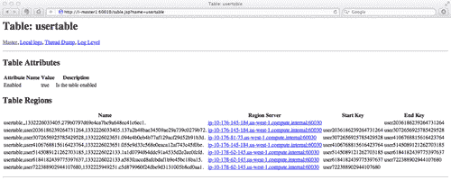
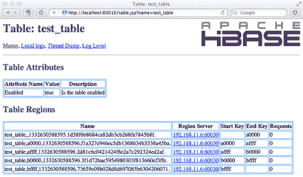
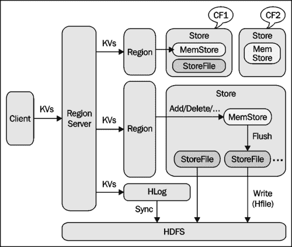
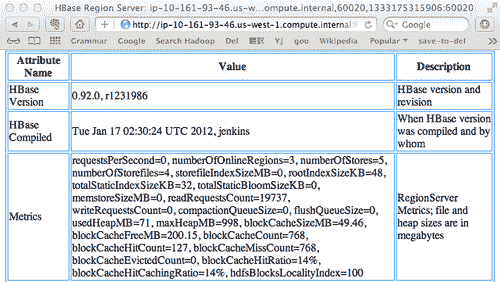
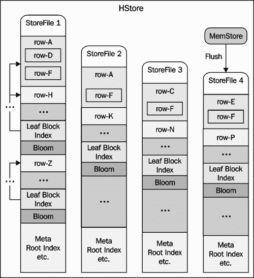

# 第 9 章：高级配置和调整

在本章中，我们将介绍：

*   使用 YCSB 对 HBase 群集进行基准测试
*   增加区域服务器处理程序计数
*   使用您自己的算法预先创建区域
*   避免写入密集型群集上的更新阻塞
*   调整 MemStore 的内存大小
*   针对低延迟系统的客户端调整
*   为列族配置块缓存
*   增加读取密集型群集上的数据块缓存大小
*   客户端扫描仪设置
*   调整数据块大小以提高寻道性能
*   启用 Bloom Filter 以提高整体吞吐量

# 简介

这是关于性能调优的另一章。 在[章](08.html "Chapter 8. Basic Performance Tuning")，*基本性能调优*中，我们描述了一些调整 Hadoop、操作系统设置、Java 和 HBase 本身以提高 HBase 集群整体性能的方法。 这些都是对许多用例的一般性改进。 在本章中，我们将描述更多的“具体”配方；其中一些是针对写入繁重的集群，而另一些则旨在提高集群的读取性能。

在调优 HBase 集群之前，您需要知道其性能如何。 因此，我们将首先介绍如何使用**Yahoo！ 云服务基准(YCSB)**用于测量(基准)HBase 集群的性能。

在第 2 章中的配方*在将数据移动到 HBase*之前预先创建区域中，我们介绍了如何使用 HBase 的 `RegionSplitter`实用程序创建包含预先创建的区域的表，以提高数据加载速度。 虽然 `RegionSplitter`默认情况下使用 MD5 编号边界预先创建区域，但对于行键不能表示为 MD5 编号的情况，我们需要使用其他拆分算法。 我们将描述一种预创建具有您想要指定的任何边界的区域的方法。

基本上有两种负载类型的 HBase 集群，写密集型集群和读密集型集群。 每种类型都有不同的调优选项。 许多调优选项在写性能和读性能之间进行权衡。 我们将有几个配方来描述如何调优 HBase 集群以获得更好的写入性能；同时，我们还将介绍调优读密集型 HBase 集群的配方。 这些方法包括服务器端配置调优、客户端设置和表模式选择。

不存在适用于所有情况的调优。 您需要仔细考虑系统的性能要求，并调整集群以获得读写性能之间的最佳平衡。

我们假设您对 HBase 架构有基本的了解，并且已经对您的集群进行了常规调优。 您可以参考[章](08.html "Chapter 8. Basic Performance Tuning")，*基本性能调优*了解 HBase 体系结构和基本 HBase 调优。

# 以 YCSB 为基准的 HBase 集群

测量 HBase 集群的性能或对集群进行基准测试与调整集群本身一样重要。 我们应该测量的 HBase 集群的性能特征至少包括以下内容：

*   群集的总体吞吐量(每秒操作数)
*   群集的平均延迟(每次操作的平均时间)
*   最小延迟
*   最大延迟
*   操作延迟的分布

YCSB 是对 HBase 集群性能进行基准测试的一个很好的工具。 YCSB 支持并行运行可变负载测试，以评估系统的插入、更新、删除和读取性能。 因此，您可以使用 YCSB 对写密集型和读密集型 HBase 集群进行基准测试。 每次测试都可以配置要加载的记录数、要执行的操作、读写比例以及许多其他属性，因此可以很容易地使用 YCSB 来测试集群的不同负载场景。

YCSB 还可用于评估许多其他不同键值存储的性能。 YCSB 的一个常见用途是对多个系统进行基准测试，并比较它们的性能。

在本指南中，我们将介绍如何安装 YCSB，并使用它测试写密集型和读密集型 HBase 集群。

## 做好准备

启动您的 HBase 群集并登录到您的 HBase 客户端节点。

## 怎么做……

要使用 YCSB 对您的 HBase 集群进行基准测试，需要遵循以下步骤：

1.  在您的 HBase 客户端节点上下载 YCSB 并解压缩：

    ```scala
    $ wget https://github.com/downloads/brianfrankcooper/YCSB/ycsb-0.1.4.tar.gz
    $ tar xfvz ycsb-0.1.4.tar.gz
    $ cd ycsb-0.1.4

    ```

2.  Add the HBase configuration file (`hbase-site.xml`) to YCSB HBase binding's classpath:

    ```scala
    $ rm hbase-binding/conf/hbase-site.xml
    $ ln -s $HBASE_HOME/conf/hbase-site.xml hbase-binding/conf/hbase-site.xml

    ```

    仅对于 HBase 0.92，将 HBase JAR 文件添加到 YCSB HBase 绑定的类路径中：

    ```scala
    $ cp $HBASE_HOME/hbase-0.92.0.jar hbase-binding/lib

    ```

    仅对于 HBase 0.92，将 ZooKeeper JAR 文件添加到 YCSB HBase 绑定的类路径中：

    ```scala
    $ cp $ZOOKEEPER_HOME/zookeeper-3.4.2.jar hbase-binding/lib

    ```

3.  在 HBase 中创建测试表：

    ```scala
    $ $HBASE_HOME/bin/hbase shell
    hbase> create 'usertable', {NAME => 'f1', VERSIONS => '1', COMPRESSION => 'LZO'}

    ```

4.  调用写入繁重基准：

    ```scala
    $ bin/ycsb load hbase -P workloads/workloada -p columnfamily=f1 -p recordcount=1000000 -p threadcount=4 -s | tee -a workloada.dat
    YCSB Client 0.1
    Command line: -db com.yahoo.ycsb.db.HBaseClient -P workloads/workloada -p columnfamily=f1 -p recordcount=1000000 -p threadcount=4 -s -load
    Loading workload...
    Starting test.
    0 sec: 0 operations;
    10 sec: 49028 operations; 4902.8 current ops/sec; [INSERT AverageLatency(us)=759.91]
    20 sec: 98060 operations; 4899.28 current ops/sec; [INSERT AverageLatency(us)=777.67]
    ...
    160 sec: 641498 operations; 0 current ops/sec;
    170 sec: 641498 operations; 0 current ops/sec;
    180 sec: 682358 operations; 4086 current ops/sec; [INSERT AverageLatency(us)=2850.51]
    ...
    240 sec: 1000000 operations; 4721.1 current ops/sec; [INSERT AverageLatency(us)=525.48]
    240 sec: 1000000 operations; 0 current ops/sec;
    [OVERALL], RunTime(ms), 240132.0
    [OVERALL], Throughput(ops/sec), 4164.376259723818
    [INSERT], Operations, 1000000
    [INSERT], AverageLatency(us), 935.844141
    [INSERT], MinLatency(us), 10
    [INSERT], MaxLatency(us), 26530269
    [INSERT], 95thPercentileLatency(ms), 0
    [INSERT], 99thPercentileLatency(ms), 0
    [INSERT], Return=0, 1000000
    [INSERT], 0, 999296
    [INSERT], 1, 42
    ...
    [INSERT], 999, 0
    [INSERT], >1000, 240

    ```

5.  调用读密集型基准测试：

    ```scala
    bin/ycsb run hbase -P workloads/workloadb -p columnfamily=f1 -p recordcount=1000000 -p operationcount=100000 -p threadcount=4 -s | tee -a workloadb.dat
    YCSB Client 0.1
    Command line: -db com.yahoo.ycsb.db.HBaseClient -P workloads/workloadb -p columnfamily=f1 -p recordcount=1000000 -p threadcount=4 -s -t
    Loading workload...
    Starting test.
    0 sec: 0 operations;
    10 sec: 11651 operations; 1165.1 current ops/sec; [UPDATE AverageLatency(us)=95.15] [READ AverageLatency(us)=3576.62]
    20 sec: 26265 operations; 1461.25 current ops/sec; [UPDATE AverageLatency(us)=43.71] [READ AverageLatency(us)=2877.47]
    ...
    60 sec: 100000 operations; 544.22 current ops/sec; [UPDATE AverageLatency(us)=25.15] [READ AverageLatency(us)=3139.45]
    [OVERALL], RunTime(ms), 60740.0
    [OVERALL], Throughput(ops/sec), 1646.3615409944023
    [UPDATE], Operations, 5082
    [UPDATE], AverageLatency(us), 45.35615899252263
    [UPDATE], MinLatency(us), 12
    [UPDATE], MaxLatency(us), 6155
    [UPDATE], 95thPercentileLatency(ms), 0
    [UPDATE], 99thPercentileLatency(ms), 0
    [UPDATE], Return=0, 5082
    [UPDATE], 0, 5080
    [UPDATE], 1, 1
    [UPDATE], 2, 0
    [UPDATE], 3, 0
    ...
    [UPDATE], >1000, 0
    [READ], Operations, 94918
    [READ], AverageLatency(us), 2529.312764702164
    [READ], MinLatency(us), 369
    [READ], MaxLatency(us), 484754
    [READ], 95thPercentileLatency(ms), 8
    [READ], 99thPercentileLatency(ms), 13
    [READ], Return=0, 94918
    [READ], 0, 31180
    [READ], 1, 21938
    [READ], 2, 18331
    [READ], 3, 10227
    ...

    ```

## 它是如何工作的.

撰写本文时，YCSB 的最新版本是 0.1.4。 此版本具有预编译的 HBase 绑定。 要使用 YCSB HBase 绑定，我们将 HBase 集群的配置文件(`hbase-site.xml`)的链接添加到 YCSB 安装下的 `hbase-binding/conf`文件夹。 这将告诉 YCSB 我们的 HBase 集群的连接信息。

由于 YCSB 0.1.4 tarball 是使用 HBase 0.90.5 构建的，如果您使用的是集群的 HBase 0.92，则需要将 YCSB 的 HBase 和 ZooKeeper JAR 文件更新为您的集群正在运行的版本，否则输出中可能会出现错误 `Not a host:port pair`。 要实现这一点，只需将 HBase 和 ZooKeeper JAR 文件复制到 YCSB 安装下的 `hbase-binding/lib`文件夹。

在运行负载测试之前，我们首先需要在 HBase 中创建测试表。 测试表的名称是固定的：它必须是 `usertable`。 我们还需要为表创建柱族。 在步骤 3 中，我们使用名为 `f1`的列族创建了 `usertable`，该列族只支持一个版本和 LZO 压缩。

创建测试表之后，我们可以使用 `ycsb`命令运行 YCSB 负载测试。 执行不带参数的 `ycsb`命令将显示命令用法。

```scala
$ bin/ycsb
Usage: bin/ycsb command database [options]
Commands:
load Execute the load phase
run Execute the transaction phase
shell Interactive mode
Databases:
basic https://github.com/brianfrankcooper/YCSB/tree/master/basic
cassandra-10 https://github.com/brianfrankcooper/YCSB/tree/master/cassandra
cassandra-7 https://github.com/brianfrankcooper/YCSB/tree/master/cassandra
cassandra-8 https://github.com/brianfrankcooper/YCSB/tree/master/cassandra
gemfire https://github.com/brianfrankcooper/YCSB/tree/master/gemfire
hbase https://github.com/brianfrankcooper/YCSB/tree/master/hbase
infinispan https://github.com/brianfrankcooper/YCSB/tree/master/infinispan
jdbc https://github.com/brianfrankcooper/YCSB/tree/master/jdbc
mapkeeper https://github.com/brianfrankcooper/YCSB/tree/master/mapkeeper
mongodb https://github.com/brianfrankcooper/YCSB/tree/master/mongodb
nosqldb https://github.com/brianfrankcooper/YCSB/tree/master/nosqldb
redis https://github.com/brianfrankcooper/YCSB/tree/master/redis
voldemort https://github.com/brianfrankcooper/YCSB/tree/master/voldemort
Options:
-P file Specify workload file
-p key=value Override workload property
-s Print status to stderr
-target n Target ops/sec (default: unthrottled)
-threads n Number of client threads (default: 1)
Workload Files:
There are various predefined workloads under workloads/ directory.
See https://github.com/brianfrankcooper/YCSB/wiki/Core-Properties
for the list of workload properties.

```

在步骤 4 中，我们调用了一个写入繁重的测试，将 100 万条记录加载到 HBase 中的测试表中。 测试行为由工作负载文件定义。 工作负载指定将加载到表中的数据，以及将对数据执行的操作。 YCSB 的 `workloads`目录下有预定义的工作负载。 在这里，我们选择 `workloads/workloada`作为工作负载文件。 这是一个更新繁重的工作负载。 我们还通过在命令行中指定 `-p recordcount=1000000`来覆盖工作负载的默认记录计数。 通过将 `-p threadcount=4`传递给命令，我们调用了四个客户端线程来运行测试。 `-s`选项使 YCSB 定期向输出报告状态。

正如您从 HBase web UI 中看到的那样，YCSB 开始将测试数据加载到我们之前在步骤 3 中创建的表中：



负载测试耗时 240132.0 毫秒完成，平均吞吐量为每秒 4,164 个操作。 输出还报告插入操作数量、总延迟和详细延迟。 所有插入都已成功完成(返回=0)。 几乎所有的插入(999296)在不到 1ms 的时间内完成，而 42 个插入在 1-2ms 之间完成。 还有 240 个插入操作耗时超过 1000ms 才能完成。 由于高负载，这些插件可能被区域服务器阻塞了一段时间。

我们还在步骤 5 中调用了读密集型测试。我们对测试数据执行了 100,000 个操作(-p `operationcount=100000)`，而 95%的操作是读操作(在 `workloads/workloadb)`中定义)。 测试在 60740.0 毫秒内完成；吞吐量为每秒 1646 次操作。 如您所见，HBase 写入比读取快得多。

YCSB 支持其他有用的属性，例如报告时间序列延迟。 有关工作量属性的列表，请参阅以下内容：

[https：//github.com/brianfrankcooper/YCSB/wiki/Core-Properties](http://https://github.com/brianfrankcooper/YCSB/wiki/Core-Properties)

## 还有更多...

HBase 附带了自己的性能评估(PE)工具，该工具也可用于对 HBase 进行基准测试。 以下是 HBase PE 工具的用法：

```scala
$ $HBASE_HOME/bin/hbase org.apache.hadoop.hbase.PerformanceEvaluation
Usage: java org.apache.hadoop.hbase.PerformanceEvaluation \
[--miniCluster] [--nomapred] [--rows=ROWS] <command> <nclients>
Options:
miniCluster Run the test on an HBaseMiniCluster
nomapred Run multiple clients using threads (rather than use mapreduce)
rows Rows each client runs. Default: One million
flushCommits Used to determine if the test should flush the table. Default: false
writeToWAL Set writeToWAL on puts. Default: True
Command:
filterScan Run scan test using a filter to find a specific row based on its value (make sure to use --rows=20)
randomRead Run random read test
randomSeekScan Run random seek and scan 100 test
randomWrite Run random write test
scan Run scan test (read every row)
scanRange10 Run random seek scan with both start and stop row (max 10 rows)
scanRange100 Run random seek scan with both start and stop row (max 100 rows)
scanRange1000 Run random seek scan with both start and stop row (max 1000 rows)
scanRange10000 Run random seek scan with both start and stop row (max 10000 rows)
sequentialRead Run sequential read test
sequentialWrite Run sequential write test
Args:
nclients Integer. Required. Total number of clients (and HRegionServers)
running: 1 <= value <= 500
Examples:
To run a single evaluation client:
$ bin/hbase org.apache.hadoop.hbase.PerformanceEvaluation sequentialWrite 1

```

以下是使用 HBase PE 测试顺序写入性能的示例：

```scala
$ $HBASE_HOME/bin/hbase org.apache.hadoop.hbase.PerformanceEvaluation sequentialWrite 1
12/03/20 16:34:42 INFO hbase.PerformanceEvaluation: Start class org.apache.hadoop.hbase.PerformanceEvaluation$SequentialWriteTest at offset 0 for 1048576 rows
12/03/20 16:34:50 INFO hbase.PerformanceEvaluation: 0/104857/1048576
12/03/20 16:34:57 INFO hbase.PerformanceEvaluation: 0/209714/1048576
...
12/03/20 16:36:11 INFO hbase.PerformanceEvaluation: Finished class org.apache.hadoop.hbase.PerformanceEvaluation$SequentialWriteTest in 88730ms at offset 0 for 1048576 rows

```

我们使用一个客户端将大约 100 万行(每行 100 字节)顺序写入 HBase 集群中的测试表。 这项测试花了 88 秒才完成。 不需要指定表和列族名称，因为 HBase PE 工具将创建一个名为 `TestTable`的表，其代码中包含一个名为 `info`的列族。

### 备注

请注意，在使用 PE 运行读取测试之前，您需要执行写入测试，因为读取测试使用写入测试插入的数据。

# 增加区域服务器处理程序计数

区域服务器保持多个正在运行的线程，以应答对用户表的传入请求。 为防止区域服务器内存不足，默认情况下将此数字设置为非常低。 对于许多情况，特别是当您有许多并发客户端时，您将需要增加此数量以处理更多请求。

在本菜谱中，我们将介绍如何调优区域服务器处理程序计数。

## 做好准备

以启动 HBase 的用户身份登录主节点。

## 怎么做……

要增加区域服务器处理程序计数，需要执行以下步骤：

1.  在主节点上，将以下内容添加到您的 `hbase-site.xml`文件：

    ```scala
    hadoop@master1$ vi $HBASE_HOME/conf/hbase-site.xml
    <property>
    <name>hbase.regionserver.handler.count</name>
    <value>40</value>
    </property>

    ```

2.  在群集中同步更改：

    ```scala
    hadoop@master1$ for slave in `cat $HBASE_HOME/conf/regionservers`
    do
    rsync -avz $HBASE_HOME/conf/ $slave:$HBASE_HOME/conf/
    done

    ```

3.  重新启动 HBase 以应用更改。

## 它是如何工作的.

`hbase.regionserver.handler.count`属性控制 RPC 侦听器线程的计数。 默认情况下，该属性设置为 10。这是一个相当低的值，可防止区域服务器在某些情况下内存不足。

如果您的区域服务器可用内存不足，则应将其设置为较低的值。 较低的值也适用于处理需要大量内存的请求，例如将较大的值放入 HBase 或使用较大的缓存配置扫描数据。 将 `hbase.regionserver.handler.count`设置为高意味着更多的并发客户端，这可能会消耗区域服务器中的过多内存，甚至会耗尽所有内存。

如果您的请求只需要少量内存，但需要较高的每秒事务处理量(TPS)，请考虑将其设置为更大的值，以便区域服务器可以处理更多并发请求。

调优此值时，我们建议您启用 RPC 级日志记录，并监视每个 RPC 请求的内存使用情况和 GC 状态。

您需要在整个集群中同步更改并重新启动 HBase 才能应用它。

## 另请参阅

*   *启用 HBase RPC 调试级日志记录*配方，参见[第 6 章](06.html "Chapter 6. Maintenance and Security")，*维护和安全*

# 使用您自己的算法预先创建区域

当我们在 HBase 中创建表时，该表从单个区域开始。 插入到该表中的所有数据都将进入单个区域。 随着数据的不断增长，当区域大小达到阈值时，会发生*区域分割*。 单个区域被分成两半，以便表可以处理更多数据。

在写入繁重的 HBase 集群中，此方法有几个问题需要解决：

*   The split/compaction storm issue.

    随着数据的均匀增长，大部分区域同时被分割，造成了巨大的磁盘 I/O 和网络流量。

*   Load is not well balanced until enough regions have been split.

    尤其是在创建表之后，所有请求都会转到部署第一个区域的同一个区域服务器。

拆分/压缩问题已在[章](08.html "Chapter 8. Basic Performance Tuning")，*基本性能调整*的*管理区域拆分*配方中进行了讨论。 通过使用手动分割方法。 对于第二个问题，我们在[第 2 章](02.html "Chapter 2. Data Migration")中的*在将数据移入 HBase*配方之前的*预创建区域中介绍了如何通过在创建表时创建区域来避免它。 我们描述了如何使用 HBase `RegionSplitter`实用程序预先创建区域。*

默认情况下， `RegionSplitter`实用程序使用 MD5 算法生成 MD5 校验和的区域起始键。 键的范围在“00000000”到“7FFFFFFF”之间。 这在许多情况下都很有效；但在某些情况下，您可能希望使用自己的算法生成密钥，以便在集群中很好地分配负载。

由于 HBase 行键完全由将数据放入 HBase 的应用程序控制，因此在许多情况下，行键的范围和分布在某种程度上是可以预测的。 因此，可以计算区域分割密钥并使用它们来创建预分割区域。

我们将在本食谱中描述如何实现这一目标。 我们将使用文本文件中指定的区域起始键，创建一个具有预定义区域的表。

## 做好准备

登录到您的 HBase 客户端节点，并在那里创建一个 `split-keys`文件。 将您的区域分割密钥放入文件中，每行一个密钥。 例如，我们假设该文件包含以下密钥：

```scala
$ cat split-keys
a0000
affff
b0000
bffff

```

## 怎么做……

按照以下说明使用您自己的算法预先创建面域：

1.  创建实现 `org.apache.hadoop.hbase.util.RegionSplitter.SplitAlgorithm`接口的 `FileSplitAlgorithm`Java 类：

    ```scala
    $ vi FileSplitAlgorithm.java
    import org.apache.hadoop.hbase.util.RegionSplitter.SplitAlgorithm;
    public class FileSplitAlgorithm implements SplitAlgorithm {
    public static final String SPLIT_KEY_FILE = "split-keys";
    }

    ```

2.  接口的 `split()`方法实现如下：

    ```scala
    $ vi FileSplitAlgorithm.java
    @Override
    public byte[][] split(int numberOfSplits) {
    BufferedReader br = null;
    try {
    File keyFile = new File(SPLIT_KEY_FILE);
    if (!keyFile.exists()) {
    throw new FileNotFoundException("Splitting key file not found: " + SPLIT_KEY_FILE);
    }
    List<byte[]> regions = new ArrayList<byte[]> ();
    br = new BufferedReader(new FileReader(keyFile));
    String line;
    while ((line = br.readLine()) != null) {
    if (line.trim().length() > 0) {
    regions.add(Bytes.toBytes(line));
    }
    }
    return regions.toArray(new byte[0][]);
    } catch (IOException e) {
    throw new RuntimeException("Error reading splitting keys from " + SPLIT_KEY_FILE, e);
    } finally {
    if (br != null) {
    try {
    br.close();
    } catch (IOException e) {
    // ignore
    }
    }
    }
    }

    ```

3.  要编译 Java 类，我们还需要实现接口的其他几个方法。 因为我们实际上并不使用它们，所以只需为每个方法创建一个空实现，如下所示(我们在这里跳过了一些方法)：

    ```scala
    $ vi FileSplitAlgorithm.java
    @Override
    public byte[] firstRow() {
    return null;
    }
    @Override
    public byte[] lastRow() {
    return null;
    }

    ```

4.  编译 Java 文件：

    ```scala
    $ javac -classpath $HBASE_HOME/hbase-0.92.0.jar FileSplitAlgorithm.java

    ```

5.  将包含拆分密钥的 `split-keys`文件复制到编译 `FileSplitAlgorithm`的目录。
6.  运行以下脚本以在创建表时预先创建区域：

    ```scala
    $ export HBASE_CLASSPATH=$HBASE_CLASSPATH:./
    $ $HBASE_HOME/bin/hbase org.apache.hadoop.hbase.util.RegionSplitter -D split.algorithm=FileSplitAlgorithm -c 2 -f f1 test_table
    12/03/25 08:09:42 DEBUG util.RegionSplitter: -D configuration override: split.algorithm=FileSplitAlgorithm
    12/03/25 08:09:42 DEBUG util.RegionSplitter: Creating table test_table with 1 column families. Presplitting to 2 regions
    12/03/25 08:09:49 DEBUG util.RegionSplitter: Table created! Waiting for regions to show online in META...
    12/03/25 08:09:49 DEBUG util.RegionSplitter: Finished creating table with 2 regions

    ```

7.  Confirm that the table and predefined regions has been created correctly via the HBase web UI:

    

## 它是如何工作的.

HBase 附带一个 `RegionSplitter`实用程序类，用于：

*   创建带有预分割区域的 HBase 表
*   对现有表中的所有区域执行滚动拆分
*   使用自定义算法分割区域

我们的说明基于这个实用程序类。

首先，我们创建了一个实现 `SplitAlgorithm`接口的 `FileSplitAlgorithm`Java 类。 `SplitAlgorithm`是在 `RegionSplitter`类中声明的 Java 接口，用于定义 `RegionSplitter`的功能。 我们还在 `FileSplitAlgorithm`类中定义了一个 `SPLIT_KEY_FILE`常量来引用包含区域起始键的文件。

`SplitAlgorithm`接口定义了实现类需要实现的几个方法。 要在创建表时拆分区域，我们只需像在步骤 2 中那样实现 `split()`方法。此方法由 `RegionSplitter`类调用以拆分整个表。 在我们的实现中，它从我们准备的文件中读取拆分密钥，每行一个密钥。 然后，将它们转换为表示表初始区域的拆分键的 `byte[]`数组。

其他 `SplitAlgorithm`接口方法对于我们的使用是不必要的，所以我们在步骤 3 中只将这些方法的实现放在空的位置。

在步骤 4 中，我们将 HBase JAR 添加到类路径中，然后运行 `javac`命令编译 Java 代码。

要使用该类分割区域，我们将 `FileSplitAlgorithm`类添加到 `HBASE_CLASSPATH`，然后使用以下参数调用 `RegionSplitter`实用程序：

*   `-D split.algorithm=FileSplitAlgorithm:`拆分算法。
*   `-c 2:`要将表拆分到的区域数；在我们的实现中不使用。
*   `-f f1:`创建名为“F1”的单个柱族。
*   `test_table:`要创建的表的名称。

正如您在步骤 7 中看到的， `test_table`被分成五个区域，由四个拆分键分隔。 拆分密钥与我们放在 `split-keys`文件中的密钥完全相同。

其他表属性都有缺省值；您可能希望通过 HBase Shell 使用 `alter`命令更改其中一些属性。

请注意，即使以前拆分区域，您也需要在应用层设计行键，以避免向单个区域写入过多的连续行键。 您需要仔细选择拆分算法以适合您的数据访问模式。

## 还有更多...

此方法的另一个有用场景是加快将数据从导出的备份 HBase 表导入到 HBase 中。

正如[第 4 章](04.html "Chapter 4. Backing Up and Restoring HBase Data")，*备份和还原 HBase 数据*中的配方*备份区域起始密钥*中提到的，您可以通过一个简单的脚本备份您的区域起始密钥。 通过 `FileSplitAlgorithm`类，我们可以使用这些键先前恢复 HBase 表的区域边界，然后通过从导出的数据文件导入来恢复数据。

与从单个区域导入数据相比，由于先将区域恢复并均衡到多个区域服务器，因此数据恢复速度将显著提高。

## 另请参阅

*   *[第 8 章](08.html "Chapter 8. Basic Performance Tuning")中的管理区域拆分*
*   *在将数据移动到[第 2 章](02.html "Chapter 2. Data Migration")中的 HBase*之前预先创建区域
*   *备份[第 4 章](04.html "Chapter 4. Backing Up and Restoring HBase Data")中的区域起始键*

# 避免写入密集型群集上的更新阻塞

在写入繁重的 HBase 群集上，您可能会发现写入速度不稳定。 大多数写操作都非常快，但也有一些写得很慢。 对于在线系统，即使平均速度非常快，这种不稳定的写入速度也是不可接受的。

这种情况很可能是由以下两个原因造成的：

*   拆分/压缩会使群集负载非常高
*   更新被区域服务器阻止

正如我们在[第 8 章](08.html "Chapter 8. Basic Performance Tuning")，*基本性能调优*中所描述的，您可以通过禁用自动拆分/压缩并在低加载时间调用它们来避免拆分/压缩问题。

Grep 您所在地区的服务器日志，如果您发现许多消息说“阻止更新...”，则可能是许多更新被阻止，并且这些更新的响应时间可能较短。

要解决此问题，我们需要调整服务器端和客户端配置以获得稳定的写入速度。 在本食谱中，我们将描述避免更新阻塞的最重要的服务器端调优。

## 做好准备

由启动 HBase 的用户登录到您的主节点。

## 怎么做……

要避免更新阻止，请执行以下步骤：

1.  增加 `hbase-site.xml`文件中的 `hbase.hregion.memstore.block.multiplier`属性值。

    ```scala
    $ vi $HBASE_HOME/conf/hbase-site.xml
    <property>
    <name>hbase.hregion.memstore.block.multiplier</name>
    <value>8</value>
    </property>

    ```

2.  增加 `hbase-site.xml`文件中的 `hbase.hstore.blockingStoreFiles`属性值。

    ```scala
    $ vi $HBASE_HOME/conf/hbase-site.xml
    <property>
    <name>hbase.hstore.blockingStoreFiles</name>
    <value>20</value>
    </property>

    ```

3.  跨群集中同步更改并重新启动 HBase 以应用更改。

## 它是如何工作的.

以下是 HBase 写操作的流程：



编辑首先写入 RegionServer 的**HLog**(预写日志)，其中编辑在**HDFS**上持久化。 之后，编辑转到宿主 HRegion，然后转到它的列族 HStore 的内存空间，称为**MemStore**。 当**MemStore**的大小达到阈值时，它被刷新到**HDFS**上的**StoreFile**。 StoreFiles 在内部使用**HFile**文件格式保存数据。

HBase 是一种多版本并发控制(MVCC)架构。 要更新/删除任何旧数据，而不是覆盖它，HBase 会向数据添加一个较新的版本。 这使得 HBase 写入非常快，因为所有写入都是顺序操作。

当 HDFS 上有许多小的 StoreFiles 时，HBase 开始压缩，将它们重写为更少但更大的文件。 如果一个区域的大小达到阈值，它将被一分为二。

为防止长时间压缩/拆分和内存不足错误，如果区域的 MemStore 大小达到阈值，HBase 会阻止更新，阈值由以下条件定义：

`hbase.hregion.memstore.flush.size`乘以 `hbase.hregion.memstore.block.multiplier`

`hbase.hregion.memstore.flush.size`属性指定 MemStore 将刷新到磁盘的大小。 其默认值为 128MB(在 0.90 版本中为 64MB)。

`hbase.hregion.memstore.block.multiplier`属性的默认值为 `2`，这意味着如果 MemStore 的大小为 256MB(128x2)，则该区域上的更新将被阻止。 在更新流量峰值期间，该值在写入繁重的群集中太小，因此我们需要提高阻塞阈值。

我们通常将 `hbase.hregion.memstore.flush.size`属性保留为其默认值，并将 `hbase.hregion.memstore.block.multiplier`属性调优为一个大得多的值(如 8)，以增加 MemStore 阻塞大小，从而减少更新阻塞计数。

请注意，增加 `hbase.hregion.memstore.block.multiplier`更有可能在刷新时触发压缩/拆分，因此请仔细调整。

步骤 2 适用于另一个阻塞场景。 如果任何一个**Store**的 StoreFiles 数超过 `hbase.hstore.blockingStoreFiles`(默认情况下为 7)(每个 MemStore 刷新一个 StoreFile)，则此区域的更新将被阻止，直到压缩完成或超过 `hbase.hstore.blockingWaitTime`(默认情况下为 90 秒)。 我们将其增加到 20，对于写入繁重的群集来说，这是一个相当大的值。 副作用是将有更多文件需要压缩。

此调优通常会降低发生更新阻塞的可能性。 同时，正如我们刚才提到的，它也有副作用。 我们建议您仔细调整这些设置，并在调整过程中观察写入吞吐量和延迟，以找到最佳配置值。

## 另请参阅

*   *调整 MemStores*的内存大小

# 调整 MemStore 的内存大小

正如我们在配方*避免写繁重集群上的更新阻塞*中所描述的那样，HBase 写操作首先在托管区域的 MemStore 中应用，然后在 MemStore 大小达到阈值时刷新到 HDFS 以节省内存空间。 MemStore 刷新使用 MemStore 的快照在后台线程上运行。 因此，即使在刷新 MemStore 时，HBase 也会继续处理写入。 这使得 HBase 写得非常快。 如果写入峰值过高，以致 MemStore 刷新无法跟上，则填充 MemStore 的写入速度和 MemStore 使用的内存将持续增长。 如果区域服务器中所有 MemStore 的大小达到可配置阈值，则会阻止更新并强制刷新。

在本文中，我们将介绍如何调优此总 MemStore 内存大小以避免更新阻塞。

## 做好准备

以启动 HBase 的用户身份登录到您的主节点。

## 怎么做……

需要执行以下步骤来调整 MemStore 的内存大小：

1.  增加 `hbase-site.xml`文件中的 `hbase.regionserver.global.memstore.upperLimit`属性值：

    ```scala
    $ vi $HBASE_HOME/conf/hbase-site.xml
    <property>
    <name>hbase.regionserver.global.memstore.upperLimit</name>
    <value>0.45</value>
    </property>

    ```

2.  增加 `hbase-site.xml`文件中的 `hbase.regionserver.global.memstore.lowerLimit`属性值：

    ```scala
    vi $HBASE_HOME/conf/hbase-site.xml
    <property>
    <name>hbase.regionserver.global.memstore.lowerLimit</name>
    <value>0.4</value>
    </property>

    ```

3.  跨群集中同步更改并重新启动 HBase 以应用更改。

## 它是如何工作的.

在阻止新更新并强制刷新之前， `hbase.regionserver.global.memstore.upperLimit`属性控制区域服务器中所有 MemStore 的最大大小。 这是一种防止 HBase 因写入峰值而耗尽内存的配置。 默认设置为 0.4，表示区域服务器堆大小的 40%。

默认值适用于许多情况。 但是，如果您在您的区域服务器日志中检测到许多日志条目显示 `Flush of region xxxx due to global heap pressure`，那么您可能需要调优此属性来处理高写入速率。

我们在步骤 2 中调优的 `hbase.regionserver.global.memstore.lowerLimit`属性指定当 MemStore 被强制刷新时，它们会一直刷新，直到 MemStore 占用的内存大小减少到这个标记。 默认值为区域服务器堆大小的 35%。

在写入繁重的群集上，增加这两个值有助于降低由于 MemStore 大小限制而阻止更新的可能性。 另一方面，您需要仔细地调优它，以避免出现垃圾回收满或内存不足错误的情况。

## 还有更多...

通常，读取性能不如写入密集型群集上的写入重要。 因此，我们可以调整群集以优化写入。 优化之一是减少分配给 HBase 块缓存的内存空间，并为 MemStore 腾出空间。 有关如何调优块高速缓存大小的信息，请参见配方*在读密集型集群上增加块高速缓存大小*。

## 另请参阅

*   *避免写入密集型群集上的更新阻塞*
*   *为列族*配置块缓存
*   *增加读密集型群集上的数据块缓存大小*

# 针对低延迟系统的客户端调整

我们介绍了几种避免服务器端阻塞的方法。 这些配方应该可以帮助集群稳定运行并具有高性能。 通过服务器端调优，集群吞吐量和平均延迟将显著提高。

然而，在低延迟和实时系统中，仅在服务器端调优是不够的。 即使只出现轻微的暂停，长时间暂停在低延迟系统中也是不可接受的。

有一些客户端配置我们可以调优，以避免长时间暂停。 在本食谱中，我们将介绍如何调优这些配置以及它们的工作方式。

## 做好准备

以访问 HBase 的用户身份登录到您的 HBase 客户端节点。

## 怎么做……

按照以下说明为写入繁重的群集执行客户端调整：

1.  减少 `hbase-site.xml`文件中的 `hbase.client.pause`属性值：

    ```scala
    $ vi $HBASE_HOME/conf/hbase-site.xml
    <property>
    <name>hbase.client.pause</name>
    <value>20</value>
    </property>

    ```

2.  调整 `hbase-site.xml`文件中的 `hbase.client.retries.number`属性值：

    ```scala
    $ vi $HBASE_HOME/conf/hbase-site.xml
    <property>
    <name>hbase.client.retries.number</name>
    <value>11</value>
    </property>

    ```

3.  在 `hbase-site.xml`文件中将 `hbase.ipc.client.tcpnodelay`设置为 `true`：

    ```scala
    $ vi $HBASE_HOME/conf/hbase-site.xml
    <property>
    <name>hbase.ipc.client.tcpnodelay</name>
    <value>true</value>
    </property>

    ```

4.  减少 `hbase-site.xml`文件中的 `ipc.ping.interval`值：

    ```scala
    $ vi $HBASE_HOME/conf/hbase-site.xml
    <property>
    <name>ipc.ping.interval</name>
    <value>4000</value>
    </property>

    ```

### 它是如何工作的.

在步骤 1 和 2 中调整 `hbase.client.pause`和 `hbase.client.retries.number`属性的目的是让客户端在连接到群集失败时在短时间内快速重试。

`hbase.client.pause`属性控制客户端应该在两次重试之间休眠多长时间。 其默认值为 1000 毫秒(1 秒)。 `hbase.client.retries.number`属性用于指定最大重试次数。 默认情况下，它的值为 10。

使用以下命令计算每次重试之间的休眠时间：

```scala
pause_time = hbase.client.pause * RETRY_BACKOFF[retries]

```

其中 `RETRY_BACKOFF`是重试退避乘数表，其定义如下：

```scala
public static int RETRY_BACKOFF[] = { 1, 1, 1, 2, 2, 4, 4, 8, 16, 32 };

```

重试 10 次以上后，HBase 将始终使用最后一个乘数(32)来计算暂停时间。

由于我们将暂停时间配置为 20ms，最大重试次数为 11，因此两次重试群集之间的暂停时间如下：

```scala
{ 20, 20, 20, 40, 40, 80, 80, 160, 320, 640, 640 }

```

这意味着客户端将在 2060ms 内重试 11 次，然后才会放弃连接到群集。

在步骤 3 中，我们将 `hbase.ipc.client.tcpnodelay`设置为 true。 此设置为客户端和服务器之间的套接字传输禁用*Nagle 算法*。

*Nagle 的算法*是一种提高网络效率的方法，它通过缓冲大量小的传出消息，并一次性发送它们。 *默认情况下启用 Nagle 算法*。 低延迟系统应通过将 `hbase.ipc.client.tcpnodelay`设置为 `true`来禁用*Nagle 算法*。

在步骤 4 中，我们将 `ipc.ping.interval`设置为 4000 毫秒(4 秒)，以便在客户端和服务器之间的套接字传输期间不会超时。 默认的 `ipc.ping.interval`是 1 分钟，这对于低延迟系统来说有点太长了。

### 还有更多...

您还可以在客户端代码中使用 `org.apache.hadoop.hbase.HBaseConfiguration`类来覆盖在 `hbase-site.xml`中设置的前面属性的值。 下面的示例代码与前面步骤 1 和 2 中的设置具有相同的效果：

```scala
Configuration conf = HBaseConfiguration.create();
conf.setInt("hbase.client.pause", 20);
conf.setInt("hbase.client.retries.number", 11);
HTable table = new HTable(conf, "tableName");

```

# 为列族配置块缓存

HBase 支持块缓存，提高读取性能。 执行扫描时，如果启用了块缓存并且还有剩余空间，则从 HDFS 上的 StoreFiles 读取的数据块将被缓存在区域服务器的 Java 堆空间中，以便下次访问同一块中的数据时，缓存的块可以提供服务。 数据块缓存有助于减少用于检索数据的磁盘 I/O。

块缓存可在表的列族级别进行配置。 不同的列族可以具有不同的高速缓存优先级，甚至可以禁用块高速缓存。 应用程序利用此缓存机制来适应不同的数据大小和访问模式。

在本食谱中，我们将介绍如何为列族配置块缓存，并介绍如何利用 HBase 块缓存。

## 做好准备

登录到您的 HBase 客户端节点。

## 怎么做……

要在列族级别配置数据块缓存，需要执行以下步骤：

1.  启动 HBase 外壳：

    ```scala
    $ $HBASE_HOME/bin/hbase shell
    HBase Shell; enter 'help<RETURN>' for list of supported commands.
    Type "exit<RETURN>" to leave the HBase Shell
    Version 0.92.0, r1231986, Tue Jan 17 02:30:24 UTC 2012
    hbase(main):001:0>

    ```

2.  执行以下命令以创建具有三个列族的表：

    ```scala
    hbase> create 'table1', {NAME => 'f1'}, {NAME => 'f2', IN_MEMORY => 'true'}, {NAME => 'f3', BLOCKCACHE => 'false'}
    0 row(s) in 1.0690 seconds

    ```

3.  显示先前创建的表的属性：

    ```scala
    hbase> describe 'table1'
    DESCRIPTION ENABLED
    {NAME => 'table1', FAMILIES => [{NAME => 'f1', BLOOMFILTER => 'NONE', REPLICATION_SCOPE => '0', VERSIONS => '3', true
    COMPRESSION => 'NONE', MIN_VERSIONS => '0', TTL => '2147483647', BLOCKSIZE => '65536', IN_MEMORY => 'false', BLOC
    KCACHE => 'true'}, {NAME => 'f2', BLOOMFILTER => 'NONE', REPLICATION_SCOPE => '0', VERSIONS => '3', COMPRESSION =
    > 'NONE', MIN_VERSIONS => '0', TTL => '2147483647', BLOCKSIZE => '65536', IN_MEMORY => 'true', BLOCKCACHE => 'true'}, {NAME => 'f3', BLOOMFILTER => 'NONE', REPLICATION_SCOPE => '0', VERSIONS => '3', COMPRESSION => 'NONE', MIN_
    VERSIONS => '0', TTL => '2147483647', BLOCKSIZE => '65536', IN_MEMORY => 'false', BLOCKCACHE => 'false'}]}
    1 row(s) in 0.0290 seconds

    ```

### 它是如何工作的.

我们创建了一个具有三个列族 `f1, f2`和 `f3`的表(`table1`)。 对于 Family `f1`，我们没有指定任何属性，因此它的所有属性都设置为默认值。 如步骤 3 所示，其块高速缓存被启用`(BLOCKCACHE => 'true')`，并且存储器中的块高速缓存被关闭`(IN_MEMORY => 'false')`。

HBase 块缓存包含三个块优先级级别：单次访问、多次访问和内存访问。 如有必要，将使用内存中标志添加一个块(这意味着 HBase 将尝试更积极地将该块保留在内存中，但不能保证)，否则它将成为单一访问优先级。 一旦数据块再次被访问，它将被标记为多路访问。 如下图所示，这三个优先级的缓存空间不同，单次访问和内存访问分别为 25%，多次访问分别为总缓存空间的 50%：


我们上面创建的列族 `f2`被标记为已启用内存。 因此，属于该系列的块以内存中的优先级进行缓存。 对于系列 `f3`，块高速缓存被禁用，这意味着列系列的数据块将不会被高速缓存。 不建议禁用数据块缓存。

由于数据是以块为单位进行缓存的，因此访问同一块中的数据非常高效。 对于小尺寸的行来说尤其如此。 因此，将同时访问的数据放在同一列族中是表模式设计的良好实践。 例如，当使用 HBase 存储从互联网上抓取的网页时，最好有一个 `meta`列族和一个 `raw`列族，其中 `meta`列族启用内存来保存网页的元数据，而 `raw`列族则存储页面的原始内容。

### 还有更多...

您还可以通过 HBase Shell 使用 `alter`命令更改现有列族的块缓存属性：

1.  禁用要更改的表：

    ```scala
    hbase> disable 'table1'
    0 row(s) in 7.0580 seconds

    ```

2.  使用 `alter`命令更改表的块大小：

    ```scala
    hbase> alter 'table1', {NAME => 'f1', IN_MEMORY => 'true'}
    Updating all regions with the new schema...
    1/1 regions updated.
    Done.
    0 row(s) in 6.0990 seconds

    ```

3.  使用 `describe`命令确认您的更改：

    ```scala
    hbase> describe 'table1'
    DESCRIPTION ENABLED
    {NAME => 'table1', FAMILIES => [{NAME => 'f1', BLOOMFILTER => 'NONE', REPLICATION_SCOPE => '0', VERSIONS => '3', false
    COMPRESSION => 'NONE', MIN_VERSIONS => '0', TTL => '2147483647', BLOCKSIZE => '65536', IN_MEMORY => 'true', BLOCK
    CACHE => 'true'}, {NAME => 'f2'...
    1 row(s) in 0.0300 seconds

    ```

4.  Enable the table again:

    ```scala
    hbase> enable 'table1'
    0 row(s) in 2.0530 seconds

    ```

    在这里，我们刚刚为表 `table1`中的现有列族 `f1`启用了内存中。

### 另请参阅

*   *增加读密集型群集上的数据块缓存大小*
*   *客户端扫描仪设置*

## 增加读密集型群集上的数据块缓存大小

如配方*调优 MemStores 的内存大小*和*为列族配置块缓存*中所述，区域服务器为 MemStores 分配大量的 Java 堆空间以提高写入性能。 它还使用大量堆空间缓存 StoreFile 块，以提高读取性能。

写入和读取性能之间存在平衡。 在读取密集型群集上，由于读取性能更重要，您可能希望为块缓存分配更多内存。

在本配方中，我们将介绍如何增加块缓存大小。 我们还将提供有关确定块缓存是否足够的提示。

### 做好准备

以启动 HBase 的用户身份登录到您的主节点。

### 怎么做……

要增加数据块缓存大小，需要执行以下步骤：

1.  增加 `hbase-site.xml`文件中的 `hfile.block.cache.size`属性值：

    ```scala
    $ vi $HBASE_HOME/conf/hbase-site.xml
    <property>
    <name>hfile.block.cache.size</name>
    <value>0.3</value>
    </property>

    ```

2.  跨群集中同步更改并重新启动 HBase 以应用更改。

### 它是如何工作的.

区域服务器的总块缓存空间由 `hfile.block.cache.size`属性配置。 此属性指定要分配给块缓存的最大区域服务器堆的百分比。 默认情况下，它分配最大堆大小的 25%。

在步骤 1 中，我们将块缓存的总空间增加到最大区域服务器堆大小的 30%。 在读取密集型群集上，建议减少 MemStore 的空间，并为块缓存分配更多内存。 MemStore 和块缓存通常消耗大约 60%~70%的最大区域服务器堆大小。 这是一个合理的值。 MemStore 上限和块缓存的合计值不应高于此级别，除非您绝对确定它会很好。

确定应该为块缓存分配多少内存的另一个指标是检查 Ganglia 或 HBase web UI 上的区域服务器指标。 例如，单击 HBase web UI 上的区域服务器链接；您将找到区域服务器的最重要指标：



检查页面上的 MemStore 大小、块缓存大小、命中率等；您会发现这些信息有助于调整集群。 如果块缓存命中率非常低，您可能需要检查您的表模式和数据访问模式；如果列总是同时被访问，则将它们放在一起。 使用 Bloom Filter 是提高块缓存命中率的另一种解决方案。 如果您遇到许多数据块逐出，请考虑增加数据块缓存大小以容纳更多数据块。

### 另请参阅

*   *调整 MemStores*的内存大小
*   *为列族*配置块缓存
*   *启用 Bloom Filter 提高整体吞吐量*

# 客户端扫描仪设置

要获得更好的读取性能，除了服务器端调优之外，重要的是客户端应用程序端的扫描仪设置。 更好的客户端扫描仪设置可使扫描过程更加高效。 相比之下，配置不佳的扫描仪不仅会降低扫描速度，还会对区域服务器造成负面影响。 因此，我们需要仔细配置客户端扫描仪设置。

最重要的扫描仪设置包括扫描缓存、扫描属性选择和扫描块缓存。 在本指南中，我们将介绍如何正确配置这些设置。

## 做好准备

由访问 HBase 的用户登录到您的 HBase 客户端节点。

## 怎么做……

要更改客户端扫描仪设置，需要执行以下步骤：

1.  要在扫描仪上调用 `next()`方法时提取更多行，请增加 `hbase-site.xml`文件中的 `hbase.client.scanner.caching`属性值：

    ```scala
    $ vi $HBASE_HOME/conf/hbase-site.xml
    <property>
    <name>hbase.client.scanner.caching</name>
    <value>500</value>
    </property>

    ```

2.  仅通过指定列族和限定符来获取所需的列。 示例代码如下所示：

    ```scala
    Scan scan = new Scan();
    // your scan filtering code
    scan.addColumn(family1, qualifier1);
    scan.addColumn(family1, qualifier2);

    ```

3.  要禁用特定扫描的块缓存，请在代码中添加以下内容。 请注意，这不会禁用服务器端的块缓存，但会阻止缓存扫描仪扫描的块。

    ```scala
    Scan scan = new Scan();
    // your scan filtering code
    scan.setCacheBlocks(false);

    ```

### 它是如何工作的.

在步骤 1 中，我们将扫描缓存更改为 500，这远远大于默认值 1。这意味着区域服务器将一次向客户端传输 500 行进行处理。 对于某些情况，比如运行 MapReduce 从 HBase 读取数据，将此值设置为更大的值会使扫描过程比缺省值高效得多。 但是，较高的缓存值需要更多内存来缓存客户端和区域服务器的行。

它还存在这样的风险，即客户端可能会在完成处理日期集并调用扫描仪上的 `next()`之前超时。 如果客户端进程较快，请将缓存设置得更高。 否则，您需要将其设置得更低。 我们将介绍如何在*中设置基于每次扫描的缓存。* 。 一节。

步骤 2 显示的想法是，如果只处理列族的一小部分，则只应将所需的数据传输到客户端。 当要处理大量行时(例如，在 MapReduce 期间)，这一点尤其重要。 不需要的数据传输开销会影响大型数据集的性能。 因此，我们不应该使用 `scan.addFamily()`将列族中的所有列返回给客户端，而应该调用 `scan.addColumn()`来只指定我们需要的列。

如果在扫描数据块的扫描仪上禁用了数据块缓存，则不会将数据块添加到数据块缓存中。 正如我们在步骤 3 中所做的那样，禁用特定扫描的块缓存有时非常重要。 例如，使用 MapReduce 完全扫描表时，应禁用扫描的块缓存，因为表中的所有块都将被扫描表中的所有块，这会用一次性访问块填满块缓存空间，并会一次又一次地触发缓存逐出过程。

在 HBase web 用户界面中，您将发现两个数据块缓存命中率指标： `blockCacheHitRatio`和 `blockCacheHitCachingRatio`。 它们的不同之处在于， `blockCacheHitRatio`是块缓存命中计数占总请求计数的百分比，而 `blockCacheHitCachingRatio`仅包括打开缓存的请求。 我们可以通过禁用某些扫描的块缓存来增加 `blockCacheHitCachingRatio`。

### 还有更多...

在上一节中，我们将 `hbase-site.xml`中的 `hbase.client.scanner.caching`属性更改为 `500`。 更改后，该节点上的所有客户端会话都将继承此默认缓存行号。 但是，您还可以使用 HBase 客户端扫描 API 指定每个扫描的缓存行。 下面的代码将扫描器设置为在调用 `next()`时提取 1000 行：

```scala
Scan scan = new Scan();
// your scan filtering code
scan.setCaching(1000);

```

### 另请参阅

*   *针对低延迟系统的客户端调整*

# 调整块大小以提高寻道性能

HBase 数据以 HFile 格式存储为 StoreFile。 StoreFile 由 HFile 块组成。 HFile 块是 HBase 从其 StoreFiles 读取的最小数据单位。 它也是区域服务器在块缓存中缓存的基本元素。

HFile 块的大小是一个重要的调优参数。 为了获得更好的性能，我们应该根据平均键/值大小和磁盘 I/O 速度选择不同的块大小。 与块缓存和 Bloom filter 一样，HFile 块大小也可以在列族级别进行配置。

在本文中，我们将介绍如何显示平均键/值大小和调优块大小以提高查找性能。

## 做好准备

登录到您的 HBase 客户端节点。

## 怎么做……

需要执行以下步骤来调整块大小以提高寻道性能：

1.  使用以下命令显示 HFile 中的平均键/值大小。 更改文件路径以适合您的环境。 H 特定列族的文件存储在 HDFS 的 `${hbase.rootdir}/table_name/region_name/column_family_name`下。

    ```scala
    $ $HBASE_HOME/bin/hbase org.apache.hadoop.hbase.io.hfile.HFile -m -f /hbase/hly_temp/0d1604971684462a2860d43e2715558d/n/1742023046455748097
    Block index size as per heapsize: 12240
    reader=/hbase/hly_temp/0d1604971684462a2860d43e2715558d/n/1742023046455748097, compression=lzo, inMemory=false, firstKey=USW000128350706/n:v01/1323026325955/Put, lastKey=USW000138830522/n:v24/1323026325955/Put, avgKeyLen=31, avgValueLen=4, entries=288024, length=2379789
    fileinfoOffset=2371102, dataIndexOffset=2371361, dataIndexCount=190, metaIndexOffset=0, metaIndexCount=0, totalBytes=12387203, entryCount=288024, version=1
    Fileinfo:
    MAJOR_COMPACTION_KEY = \x00
    MAX_SEQ_ID_KEY = 96573
    TIMERANGE = 1323026325955....1323026325955
    hfile.AVG_KEY_LEN = 31
    hfile.AVG_VALUE_LEN = 4
    hfile.COMPARATOR = org.apache.hadoop.hbase.KeyValue$KeyComparator
    hfile.LASTKEY = \x00\x0FUSW000138830522\x01nv24\x00\x00\x014\x0A\x83\xA1\xC3\x04
    Could not get bloom data from meta block

    ```

2.  启动 HBase 外壳：

    ```scala
    $ $HBASE_HOME/bin/hbase shell

    ```

3.  通过 HBase Shell 设置特定列族的块大小：

    ```scala
    hbase> create 'hly_temp', {NAME => 'n', BLOCKSIZE => '16384'}
    0 row(s) in 1.0530 seconds

    ```

4.  显示先前创建的表的属性：

    ```scala
    hbase> describe 'hly_temp'
    DESCRIPTION ENABLED
    {NAME => 'hly_temp', FAMILIES => [{NAME => 'n', BLOOMFILTER => 'NONE', REPLICATION_SCOPE => '0', VERSIONS => '3', true
    COMPRESSION => 'NONE', MIN_VERSIONS => '0', TTL => '2147483647', BLOCKSIZE => '16384', IN_MEMORY => 'false', BLOC
    KCACHE => 'true'}]}
    1 row(s) in 0.0330 seconds

    ```

### 它是如何工作的.

首先，我们想知道特定列族的平均键/值大小。 在步骤 1 中，我们调用了 HFile 工具(org.apache.hadoop.hbase.io.hfile.HFile 类)来显示 HFile 的元数据。 如配方*HFile Tool，View Textualized HFile Content*in[第 3 章](03.html "Chapter 3. Using Administration Tools")中所述，通过 `-m`选项，我们可以使用此工具获取 HFile 文件的元数据，包括平均键/值大小。 在步骤 1 中，我们传递了 `-f`选项和文件路径来显示单个 HFile 的元数据。 如果您的表只有一个列族，您还可以使用 `-r`选项和一个区域名称来显示属于该区域的每个 HFile 的元数据。 有了这些信息，我们就能够获得列族的大致平均键/值大小。

从步骤 1 的输出中可以看到，HFile 的平均键/值大小非常小(35 字节)。 在这种情况下，键/值的平均大小非常小(例如，100 字节)；我们应该使用较小的块(例如，16KB)，以避免在每个块中存储过多的键/值对，这会增加块内查找的延迟，因为查找操作总是在块内按顺序从第一个键/值对中查找键。

从步骤 2 到步骤 4，我们演示了如何通过 HBase Shell 配置列族的块大小。在步骤 3 中，我们创建了具有单个列族‘n’的 `hly_temp`表，并将列族的块大小指定为 16384 字节(16KB)。这比 64KB 的默认块大小小得多。

这里，我们选择较小的块大小以牺牲较大的块索引(更多内存消耗)来实现更快的随机访问。 另一方面，如果平均键/值较大，或者磁盘速度较慢导致瓶颈，则应选择较大的块大小，以便单个磁盘 I/O 可以获取更多数据。

### 还有更多...

您还可以使用 HBase Shell 中的 `alter`命令更改现有列族的块大小。 这将在创建新的 StoreFiles 时应用。

### 另请参阅

*   *HFile 工具，查看[第 3 章](03.html "Chapter 3. Using Administration Tools")中的文本化 HFile 内容*

# 启用 Bloom Filter 以提高整体吞吐量

HBase 支持 Bloom Filter，提升集群整体吞吐量。 HBase Bloom Filter 是一种节省空间的机制，用于测试 StoreFile 是否包含特定的行或行-列单元格。 下面是 Bloom filter 的详细信息：[http://en.wikipedia.org/wiki/Bloom_filter](http://en.wikipedia.org/wiki/Bloom_filter)。

在没有 Bloom Filter 的情况下，确定 StoreFile 中是否包含行键的唯一方法是检查 StoreFile 的块索引，它存储 StoreFile 中每个块的起始行键。 我们找到的行键很可能会落在两个块起始键之间；如果是这样，那么 HBase 必须加载块并从块的起始键开始扫描，以确定行键是否确实存在。

这里的问题是，在主要压缩将它们聚合成单个 StoreFiles 之前，将存在许多 StoreFiles。 因此，几个 StoreFiles 可能具有请求的行键的一些单元格。

考虑一下下面的示例；这是一张显示 HBase 如何在 StoreFile 中存储数据、块索引和 Bloom 过滤器的图像：



单个列族有四个 StoreFiles，它们是由 MemStore 刷新创建的。 StoreFiles 在行键中有类似的跨页。 一些行键(例如， `row-D)`)被本地化到几个 StoreFiles，而另一些(例如， `row-F)`)则分布在多个 StoreFiles 中。 虽然只有 StoreFile1 实际包含 `row-D`，但 HBase 还需要从 StoreFiles 2 和 3 加载第一个数据块，以确定该块是否包含 `row-D`的单元格，因为 `row-D`位于第一个数据块之间。 如果有一种机制告诉 HBase 跳过加载 StoreFiles 2 和 3，那就更好了。

在这种情况下，Bloom Filter 会有所帮助。 Bloom Filter 用于减少这些不必要的磁盘 I/O，从而提高集群的整体吞吐量。

在本食谱中，我们将介绍如何为列系列启用 Bloom Filter，以及如何利用 HBase Bloom Filter 提高总体吞吐量的提示。

## 做好准备

登录到您的 HBase 客户端节点。

## 怎么做……

要启用列族的 Bloom Filter，需要执行以下步骤：

1.  启动 HBase 外壳：

    ```scala
    $ $HBASE_HOME/bin/hbase shell
    HBase Shell; enter 'help<RETURN>' for list of supported commands.
    Type "exit<RETURN>" to leave the HBase Shell
    Version 0.92.0, r1231986, Tue Jan 17 02:30:24 UTC 2012
    hbase(main):001:0>

    ```

2.  执行以下命令以创建具有三个列族的表：

    ```scala
    hbase> create 'table2', {NAME => 'f1'}, {NAME => 'f2', BLOOMFILTER => 'ROW'}, {NAME => 'f3', BLOOMFILTER => 'ROWCOL'}
    0 row(s) in 1.0690 seconds

    ```

3.  显示先前创建的表的属性：

    ```scala
    hbase> describe 'table2'
    DESCRIPTION ENABLED
    {NAME => 'table2', FAMILIES => [{NAME => 'f1', BLOOMFILTER => 'NONE', REPLICATION_SCOPE => '0', VERSIONS => '3', true
    COMPRESSION => 'NONE', MIN_VERSIONS => '0', TTL => '2147483647', BLOCKSIZE => '65536', IN_MEMORY => 'false', BLOC
    KCACHE => 'true'}, {NAME => 'f2', BLOOMFILTER => 'ROW', REPLICATION_SCOPE => '0', VERSIONS => '3', COMPRESSION =>
    'NONE', MIN_VERSIONS => '0', TTL => '2147483647', BLOCKSIZE => '65536', IN_MEMORY => 'false', BLOCKCACHE => 'true'}, {NAME => 'f3', BLOOMFILTER => 'ROWCOL', REPLICATION_SCOPE => '0', VERSIONS => '3', COMPRESSION => 'NONE', MI
    N_VERSIONS => '0', TTL => '2147483647', BLOCKSIZE => '65536', IN_MEMORY => 'false', BLOCKCACHE => 'true'}]}
    1 row(s) in 0.0360 seconds

    ```

### 它是如何工作的.

我们创建了一个具有三个列族 `f1, f2`和 `f3`的表(`table2`)。 对于 Family `f1`，我们没有指定任何属性，因此它的所有属性都设置为默认值。 如步骤 3 所示，其布隆过滤器被禁用`(BLOOMFILTER => 'NONE')`。 我们为 `f2``(BLOOMFILTER => 'ROW')`指定了行级布隆过滤器，为 `f3``(BLOOMFILTER => 'ROWCOL')`指定了行+列级布隆过滤器。

如果启用 Bloom Filter，HBase 会在创建 StoreFile 时添加 Bloom Filter 和数据块。 Bloom filter 用于让 HBase 高效地判断 StoreFile 是否包含特定的行或单元格，而无需实际加载文件和扫描块。 Bloom 过滤器可能是假阳性，这意味着查询返回 `a row is contained in a file`，但实际上不是。 但是 Bloom Filter 不允许假阴性，因此当查询返回 `a row is not in a file`时，该行肯定不在文件中。

正常情况下，错误率为 0.01(由 `io.storefile.bloom.error.rate`设置配置)，因此 Bloom Filter 报告 StoreFile 包含行的可能性为 1%，但事实并非如此。 降低错误率需要更多的空间来存储 Bloom filter。

默认情况下，Bloom Filter 处于关闭状态，即 HBase 在创建 StoreFiles 时不会存储 Bloom Filter。 它可以基于列族进行配置，以启用行级或行+列级布隆过滤器。 行级 Bloom 过滤器用于测试 StoreFile 中是否包含行键，而行+列 Bloom 过滤器可以告诉 HBase StoreFile 是否包含特定单元。 行+列级布隆过滤器占用更多磁盘空间，因为单元格条目比行条目大得多。

即使启用了 Bloom Filter，单个 GET 操作也可能无法立即获得性能，因为 HBase 是并行读取数据的，并且延迟受磁盘 I/O 速度的限制。 但是，由于加载的块数量大大减少，因此显著提高了总体吞吐量，尤其是在负载较重的集群中。

另一个优点是使用 Bloom Filter 可以提高块缓存率。 启用 Bloom Filter 后，HBase 可以加载更少的块来获取客户端请求的数据。 由于不加载不必要的块，因此包含客户端实际请求的数据的块有更多机会保留在块缓存中。 这提高了整个群集的读取性能。

缺点是，Bloom Filter 中的每个条目都使用大约一个字节的存储空间。 如果您有较小的单元(例如，包含键/值信息开销的 20 个字节)，则 Bloom 过滤器将是文件的 1/20。 另一方面，如果您的平均单元格大小为 1KB，则 Bloom Filter 的大小约为文件大小的 1/1000。 假设 StoreFile 是 1 GB，那么筛选器只需要 1 MB 的存储空间。 因此，我们建议您对小型单元格列族禁用布隆过滤器，并始终为中型或大型单元格系列启用布隆过滤器。

如上所述，HBase 支持行级和行级+列级 Bloom 过滤器。 使用哪一种取决于您的数据访问模式。 返回到我们的示例 HStore，只有几个 StoreFiles 保存 `row-D`。 当 `row-D`的单元格被批量更新时，就会发生这种情况。 如果一行中的大多数单元格一起更新，则行级筛选器更好。 相反，就像我们示例中的 `row-F`一样，如果更新分布在多个 StoreFiles 中，并且大多数 StoreFiles 包含行的一部分，则建议使用行+列筛选器，因为它能够识别哪个 StoreFile 包含您所请求的行的确切部分。但是，您还需要考虑数据读取模式。 很明显，如果您总是请求整个行，行+列筛选器就没有意义了。 例如，要加载整个 `row-F`，区域服务器无论如何都需要加载所有四个 StoreFiles。 当您的读取模式是只加载一行的几列时，例如，只加载 StoreFile4 中的 `row-F`列，那么行+列筛选器很有用，因为区域服务器将跳过加载其他 StoreFiles。

### 备注

请注意，HFile 版本 1 是 HBase 0.92 之前版本的默认 HFile 格式，Bloom 过滤器可以容纳的元素数是最大的。 此数字由 `io.storefile.bloom.max.keys`属性控制，默认值为 128M 键。 如果 StoreFile 中的单元格太多，可能会超过此数字。 您需要使用行级筛选器来减少 Bloom 筛选器中的键数。

Bloom Filter 是提高集群整体性能的有效方法。 行级 Bloom 筛选器在许多情况下都可以很好地工作；您应该将其作为首选，并且只有在行级筛选器不适合您的使用时才考虑行+列 Bloom 筛选器。

### 还有更多...

您还可以通过 HBase Shell 使用 `alter`命令更改现有表的列族的 Bloom filter 属性。 它将应用于更改后创建的 StoreFiles。