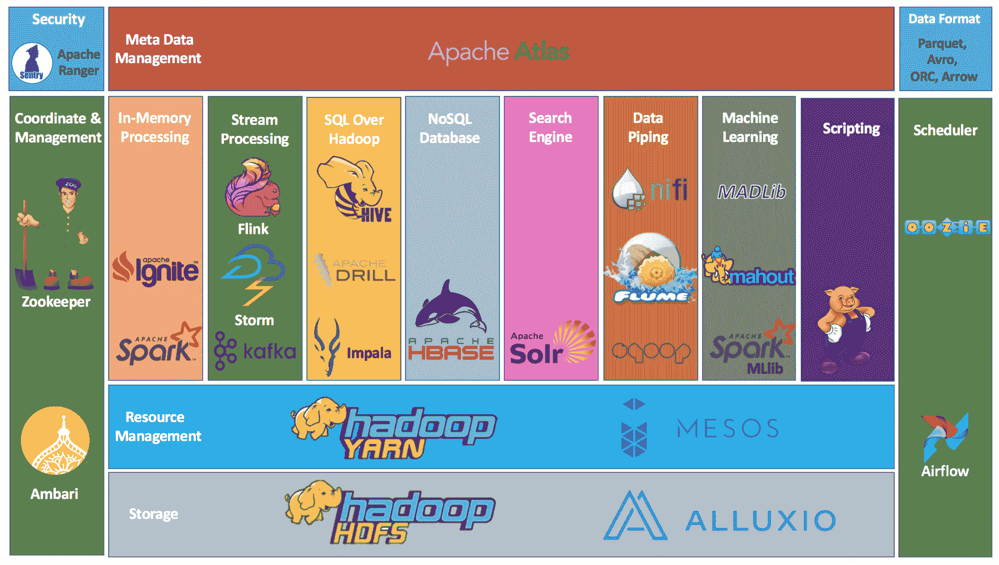
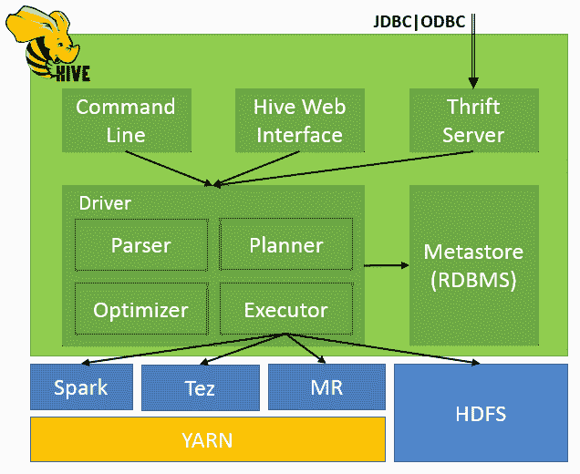

# 大数据和Hive概述

本章概述了大数据和Hive，尤其是 Hadoop 生态系统中的大数据和Hive。 它简要介绍了大数据的演变，让读者知道自己在大数据之旅中处于什么位置，并可以在未来的学习中找到自己喜欢的领域。 本章还介绍了蜂巢如何成为大数据生态系统中的领先工具之一，以及为什么它仍然具有竞争力。

在本章中，我们将介绍以下主题：

*   从数据库、数据仓库到大数据的短暂历史
*   引入大数据
*   关系型和非 SQL 数据库与 Hadoop
*   批处理、实时处理和流处理
*   Hadoop 生态系统概述
*   Hive概述

# 简短的历史

20 世纪 60 年代，当计算机成为企业更具成本效益的选择时，人们开始使用数据库来管理数据。 后来，在 20 世纪 70 年代，关系数据库变得更加流行以满足业务需求，因为它们可以轻松而紧密地将物理数据与逻辑业务联系起来。 在接下来的十年里，**结构化查询语言**(**SQL**)成为数据库的标准查询语言。 SQL 的有效性和简单性促使许多人使用数据库，并使数据库更接近广大用户和开发人员。 不久，人们观察到人们使用数据库进行数据应用和管理，并持续了很长一段时间。

一旦收集到大量的数据，人们就开始思考如何处理这些历史数据。 然后，术语数据仓库在 20 世纪 90 年代出现。 从那时起，人们开始讨论如何通过回顾历史数据来评估当前的业绩。 创建了各种数据模型和工具，以帮助企业有效地管理、转换和分析其历史数据。 传统的关系数据库也在发展，以提供更高级的聚合和分析功能以及数据仓库的优化。 主要的查询语言仍然是 SQL，但与以前的版本相比，它更加直观和强大。 数据仍然是结构良好的，模型是标准化的。 随着我们进入 21 世纪，互联网逐渐成为创造大多数数据的种类和数量最多的行业。 社交媒体分析、网络挖掘和数据可视化等新技术帮助许多企业和公司处理海量数据，以便更好地了解其客户、产品、竞争和市场。 数据量的增长和数据格式的变化比以往任何时候都快，这迫使人们寻找新的解决方案，特别是在研究和开源领域。 于是，大数据成为众多研究人员和企业关注的热门话题和具有挑战性的领域。

然而，每一次挑战都蕴藏着巨大的机遇。 在 2010 年代，Hadoop 作为大数据开源项目之一，由于其开源许可、活跃的社区和处理海量数据的能力而开始受到广泛关注。 这是少数几次开放源码项目在任何商业软件产品出现之前导致技术趋势改变的一次。 不久之后，NoSQL 数据库、实时分析和机器学习作为追随者，迅速成为 Hadoop 大数据生态系统的重要组件。 有了这些大数据技术，公司能够回顾过去，评估当前，并抓住未来的机遇。

# 引入大数据

大数据不仅仅是海量的数据。 这里，单词**大**指的是大范围的数据。 这个领域的一个众所周知的说法是，借助以字母 V 开头的三个单词来描述大数据：体积、速度和多样性。 但分析和数据科学界已经看到，除了大数据的基本三个 V 之外，数据在其他维度上也不同，如准确性、可变性、波动性、可视化和价值。 到目前为止提到的不同的 V 的解释如下：

*   **卷**：指以秒为单位生成的数据量。 当今世界 90%的数据是在过去两年中创建的。 从那时起，世界上的数据每两年翻一番。 如此大量的数据主要由机器、网络、社交媒体和传感器生成，包括结构化、半结构化和非结构化数据。
*   **速度**：这是指数据生成、存储、分析和移动的速度。 随着联网设备的出现，无线或有线机器和传感器可以在创建数据后立即传递数据。 这导致了实时数据流，并帮助企业做出有价值的快速决策。
*   **Varity**：指不同的数据格式。 过去，数据以`.txt`、`.csv`和`.dat`格式从文件系统、电子表格和数据库等数据源中存储。 这种类型的数据驻留在记录或文件中的固定字段中，称为结构化数据。 如今，数据并不总是采用传统的结构化格式。 更新的半结构化或非结构化形式的数据也是通过各种方法生成的，比如电子邮件、照片、音频、视频、PDF、SMS，甚至是我们不知道的东西。 这些不同的数据格式给存储和分析数据带来了问题。 这是我们在大数据领域需要克服的主要挑战之一。
*   **准确性**：指数据的质量，如数据的可信性、偏差、噪声、异常等。 数据损坏是很正常的。 它可能是由于多种原因造成的，例如打字错误、缺少或不常见的缩写、数据重新处理和系统故障。 然而，忽视这些恶意数据可能会导致不准确的数据分析，并最终导致错误的决策。 因此，确保数据在数据审核和修正方面是正确的，对于大数据分析来说是非常重要的。
*   **可变性**：指数据的变化。 这意味着相同的数据在不同的上下文中可能有不同的含义。 在进行情绪分析时，这一点尤为重要。 分析算法能够理解上下文，并发现该上下文中数据的确切含义和价值。
*   **波动性**：指数据的有效期和存储时间。 这对于实时分析尤其重要。 它需要确定数据的目标时间窗口，以便分析师可以专注于特定的问题，并从分析中获得良好的性能。
*   **可视化**：这指的是让数据更容易理解的方式。 可视化不仅仅意味着普通的图表或饼图；它还使大量数据在易于理解的多维视图中变得可理解。 可视化是显示数据更改的一种创新方式。 它需要大数据分析师和业务领域专家之间的大量交互、对话和共同努力，才能使可视化变得有意义。
*   **值**：指对大数据进行数据分析所获得的知识。 大数据的价值在于组织如何将自己转变为大数据驱动型公司，并将大数据分析的洞察力用于决策。

总而言之，大数据不仅仅是大量数据，它是从现有数据中发现新见解并指导分析新数据的一种实践。 大数据驱动的企业将更加敏捷，更具竞争力，以克服挑战，赢得竞争。

# 关系数据库和 NoSQL 数据库与 Hadoop

为了更好地理解关系数据库、NoSQL 数据库和 Hadoop 之间的区别，让我们将它们与旅行方式进行比较。 你会惊讶地发现它们有很多相似之处。 当人们旅行时，他们要么乘坐汽车，要么乘坐飞机，这取决于旅行的距离和费用。 例如，当你从多伦多到温哥华旅行时，从旅行时间和成本来看，飞机总是第一选择。 当你从多伦多去尼亚加拉瀑布旅行时，汽车总是不错的选择。 当你从多伦多到蒙特利尔旅行时，有些人可能更喜欢开车而不是飞机。 这里的距离和成本就像大数据量和投资一样。 传统的关系数据库就像汽车，Hadoop 大数据工具就像飞机。 当您处理少量数据(短距离)时，关系数据库(如汽车)始终是最佳选择，因为它处理少量或中等数量的数据既快又灵活。 当您处理大量数据(远距离)时，Hadoop(就像飞机一样)是最佳选择，因为它在处理海量数据时更具线性可伸缩性、速度和稳定性。 你可以从多伦多开车到温哥华，但太花时间了。 你也可以从多伦多乘飞机去尼亚加拉瀑布，但去机场的路上要花更多的时间，而且比开车更贵。 另外，你可以坐船或火车。 这类似于 NoSQL 数据库，它提供了关系数据库和 Hadoop 的特性和平衡，具有良好的性能和对中等到大量数据的多种数据格式支持。

# 批处理、实时处理和流处理

**批处理**用于批量处理数据。 它从输入读取数据，对其进行处理，然后将其写入输出。 Apache Hadoop 是使用 MapReduce 范例的分布式批处理系统最知名和最流行的开源实现。 数据存储在名为**Hadoop Distributed File System**(**HDFS**)的共享和分布式文件系统中，并划分为拆分，拆分是 MapReduce 处理的逻辑数据分区。

要使用 MapReduce 范例处理这些拆分，映射任务将读取拆分并将其所有键/值对传递给映射函数，然后将结果写入中间文件。 映射阶段完成后，还原器读取通过无序排列过程发送的中间文件，并将它们传递给 Reduce 函数。 最后，Reduce 任务将结果写入最终输出文件。 MapReduce 模型的优点包括使分布式编程更容易、近线性加速、良好的可扩展性以及容错能力。 这种批处理模型的缺点是不能执行递归或迭代作业。 此外，明显的批处理行为是，在 Reduce 作业开始之前，所有输入都必须由 MAP 准备好，这使得 MapReduce 不适合在线和流处理用例。

**实时处理**用于处理数据并几乎立即得到结果。 在大数据的实时`ad hoc`查询领域，这一概念最先由 Google 在 Dremel 实现。 它采用一种新颖的列存储格式用于嵌套结构，并使用快速索引和可伸缩聚集算法并行计算查询结果，而不是批处理序列。 这两种技术是实时处理的主要特点，并被类似的实现所使用，例如 Impala([https://impala.apache.org/](https://impala.apache.org/))、PRESTO([https://prestodb.io/](https://prestodb.io/))和 Drill([https://drill.apache.org/](https://drill.apache.org/))，它们由列存储和数据格式，例如 PARQUE([https://parquet.apache.org/](https://parquet.apache.org/))提供支持。 Orc([https://orc.apache.org/](https://orc.apache.org/))、CarbonData([https://carbondata.apache.org/](https://carbondata.apache.org/))和箭头([https://arrow.apache.org/](https://arrow.apache.org/))。 另一方面，内存计算无疑为实时处理提供了更快的解决方案。 内存计算提供了非常高的带宽，超过 10 千兆字节/秒，而硬盘只有 200 兆字节/秒。 此外，与硬盘相比，延迟相对较低，纳秒和毫秒。 随着内存的价格越来越低，内存计算作为一种实时解决方案变得更加实惠，比如 Apache Spark([https://spark.apache.org/](https://spark.apache.org/))，它是内存计算的一种流行的开源实现。 Spark 可以很容易地与 Hadoop 集成，其内存中的数据结构**弹性分布式数据集**(**RDD**)可以从 HDFS 和 HBase 等数据源生成，以实现高效缓存。

**流处理**用于连续处理并作用于实况流数据以获得结果。 在流处理中，有两个常用的通用流处理框架：Storm([https://storm.apache.org/](https://storm.apache.org/))和 Flink([https://flink.apache.org/](https://flink.apache.org/))。 这两个框架都运行在**Java 虚拟机**(**JVM**)上，并且都处理键控流。 就编程模型而言，Storm 为您提供了构建框架的基本工具，而 Flink 为您提供了定义良好且易于使用的框架。 此外，Samza([http://samza.apache.org/](http://samza.apache.org/))和 Kafka Stream([https://kafka.apache.org/documentation/streams/](https://kafka.apache.org/documentation/streams/))利用 Kafka 进行消息缓存和转换。 最近，Spark 还在其创新的连续处理模式方面提供了一种流处理。

# Hadoop 生态系统概述

Hadoop 于 2011 年由 Apache 首次发布，版本为 1.0.0，仅包含 HDFS 和 MapReduce。 Hadoop 从一开始就被设计为计算(MapReduce)和存储(HDFS)平台。 随着大数据分析需求的增加，Hadoop 吸引了很多其他软件来解决大数据问题，并融入了以 Hadoop 为中心的大数据生态系统。 下图简要概述了 Apache 堆栈中的 Hadoop 大数据生态系统：

Apache Hadoop ecosystem

在当前的 Hadoop 生态系统中，**HDFS**仍然是使用硬盘存储的主要选择，**AlLuxio**提供了虚拟分布式内存替代方案。 在 HDFS 之上，可以使用 Parquet、Avro 和 ORC 数据格式以及更快的压缩算法来进行计算和存储优化。 **Yarn**作为第一个 Hadoop 通用资源管理器，专为更好的资源管理和伸缩性而设计，**Spark**和**Ignite**作为内存计算引擎，也可以在 Yarn 上运行，与 Hadoop 紧密合作。

另一方面，**Kafka**、**Flink**和**Storm**正在主导流处理。**HBase**是领先的 NoSQL 数据库，特别是在 Hadoop 群集上。对于机器学习，它包括**Spark MLlib**和**Madlib**以及新的**Mahout**。 **Flume**是一个成熟的、分布式的、可靠的日志收集工具，用于将数据移动或收集到 HDFS。 **Impala**和**Drill**能够直接针对 Hadoop 上的数据启动交互式 SQL 查询。 此外，通过**Spark**/**tez**以及**Live Long and Process**(**LLAP**)，用户可以通过内存数据缓存在不同的计算框架(而不是 MapReduce)上的长时间进程中运行查询。 因此，**蜂巢**在生态系统中扮演着比以往任何时候都更重要的角色。 我们还很高兴地看到，**Ambari**作为新一代集群管理工具，除了**ZooKeeper**之外，还提供了更强大的集群管理和协调功能。 对于日程安排和工作流管理，我们可以使用**气流**或**Oozie**。 最后，我们有一个开源治理和元数据服务出现了，**Altas**，它支持生态系统中大数据的严格合规性和谱系。

# Hive概述

HIVE 是 Hadoop 中针对 PB 级数据的 SQL 查询的标准。 它提供对 HDFS 中数据的 SQL 式访问，使 Hadoop 能够用作数据仓库。 **配置单元查询语言**(**HQL**)与关系数据库中的标准 SQL 具有相似的语义和功能，因此经验丰富的数据库分析人员可以轻松掌握它。 HIVE 的查询语言可以在不同的计算引擎上运行，比如 MapReduce、TEZ 和 Spark。

HIVE 的元数据结构在 HDFS 之上提供了一个高级的表状结构。 它支持三种主要数据结构：表、分区和存储桶。 这些表对应于 HDFS 目录，可以划分为分区，其中数据文件可以划分为存储桶。 配置单元的元数据结构通常是 Hadoop 上的读取时架构概念的架构，这意味着在将数据存储到 HDFS 之前，您不必在配置单元中定义架构。 在存储数据后应用配置单元元数据可为您的数据工作带来更大的灵活性和效率。 Hive元数据的流行使其成为*事实上的*描述大数据的方式，并被大数据生态系统中的许多工具使用。

下图是 Hadoop 生态系统中配置单元的架构视图。 配置单元元数据存储(也称为元存储)可以使用嵌入式、本地或远程数据库。 节俭服务器是基于 Apache Thrift 服务器技术构建的。 在其最新版本 2 中，hiveserver2 能够处理多个并发客户端，支持 Kerberos、LDAP 和自定义的可插拔身份验证，并为 JDBC 和 ODBC 客户端提供更好的选项，尤其是元数据访问。

Hive architecture

以下是我们可以牢记的蜂巢的一些亮点：

*   与 MapReduce 相比，HIVE 提供了一个简单且优化的查询模型，编码更少
*   HQL 和 SQL 具有相似的语法
*   在相同数量的大数据集上，HIVE 的查询响应时间通常比其他设备快得多
*   HIVE 支持在不同的计算框架上运行
*   HIVE 支持`ad hoc`在 HDFS 和 HBase 上查询数据
*   配置单元支持用户定义的`java`/`scala`函数、脚本和过程语言，以扩展其功能
*   成熟的 JDBC 和 ODBC 驱动程序允许许多应用程序提取配置单元数据以实现无缝报告
*   HIVE 允许用户使用 SerDe 和输入/输出格式读取任意格式的数据
*   HIVE 是一个稳定可靠的批处理工具，可以长期投入生产
*   HIVE 具有定义良好的体系结构，用于元数据管理、身份验证和查询优化
*   有一个庞大的实践者和开发人员社区，他们正在工作和使用配置单元

# 简略的 / 概括的 / 简易判罪的 / 简易的

读完本章后，我们现在能够理解何时以及为什么要使用大数据而不是传统的关系数据库。 我们还了解了批处理、实时处理和流处理之间的区别。 我们现在熟悉 Hadoop 生态系统，尤其是蜂巢。 我们回到了过去，回顾了数据库、数据仓库和大数据的历史。 我们还探讨了一些大数据术语、Hadoop 生态系统、Hive架构以及使用Hive的优势。

在下一章中，我们将练习安装配置单元，并回顾在命令行环境中开始使用配置单元所需的所有工具。