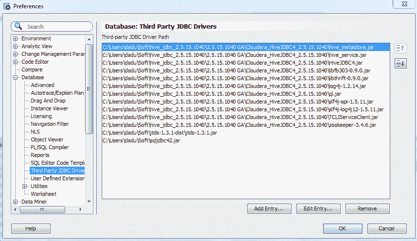
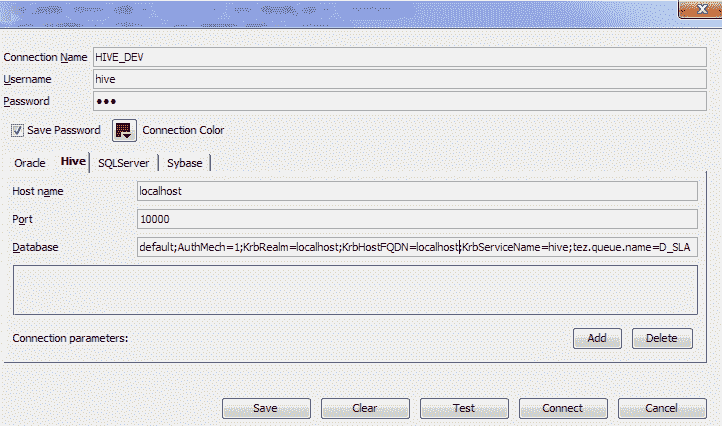

# 设置Hive环境

本章将介绍如何在集群和云中安装和设置Hive环境。 它还介绍了基本配置单元命令和配置单元集成开发环境的用法。

在本章中，我们将介绍以下主题：

*   从 Apache 安装配置单元
*   安装供应商提供的配置单元
*   在云中使用蜂巢
*   使用配置单元命令
*   使用配置单元 IDE

# 从 Apache 安装配置单元

为了介绍配置单元的安装，我们将使用配置单元版本 2.3.3 作为示例。 此安装的安装前要求如下：

*   JDK 1.8
*   Hadoop 2.x.y
*   Ubuntu 16.04/CentOS 7

Since we focus on Hive in this book, the installation steps for Java and Hadoop are not provided here. For steps on installing them, please refer to [https://www.java.com/en/download/help/download_options.xml](https://www.java.com/en/download/help/download_options.xml) and [http://hadoop.apache.org/docs/current/hadoop-project-dist/hadoop-common/ClusterSetup.html](http://hadoop.apache.org/docs/current/hadoop-project-dist/hadoop-common/ClusterSetup.html).

以下步骤介绍如何在命令行环境中安装 Apache Have：

1.  从 Apache 配置单元下载配置单元并解压缩：

```sql
 $cd /opt
 $wget https://archive.apache.org/dist/hive/hive-2.3.3/apache-
      hive-2.3.3-bin.tar.gz
 $tar -zxvf apache-hive-2.3.3-bin.tar.gz
 $ln -sfn /opt/apache-hive-2.3.3 /opt/hive 
```

2.  在文件`~/.profile`或文件`~/.bashrc`中添加必要的系统路径变量：

```sql
      export HADOOP_HOME=/opt/hadoop
      export HADOOP_CONF_DIR=/opt/hadoop/conf
      export HIVE_HOME=/opt/hive
      export HIVE_CONF_DIR=/opt/hive/conf
      export PATH=$PATH:$HIVE_HOME/bin:$HADOOP_HOME/
      bin:$HADOOP_HOME/sbin
```

3.  立即启用设置：

```sql
 $source ~/.profile
```

4.  创建配置文件：

```sql
 $cd /opt/hive/conf
 $cp hive-default.xml.template hive-site.xml
 $cp hive-exec-log4j.properties.template hive-exec-
      log4j.properties
 $cp hive-log4j.properties.template hive-log4j.properties
```

5.  修改`$HIVE_HOME/conf/hive-site.xml`*，*，其中有一些重要参数需要设置：

*   `hive.metastore.warehourse.dir`：这是到Hive仓库位置的路径。 默认情况下，它位于`/user/hive/warehouse`。
*   `hive.exec.scratchdir`：这是临时数据文件位置。 默认情况下，它位于`/tmp/hive-${user.name}`。

默认情况下，配置单元使用 Derby([http://db.apache.org/derby/](http://db.apache.org/derby/))数据库作为元数据存储。 它还可以使用其他关系数据库(如 Oracle、PostgreSQL 或 MySQL)作为元存储。 要在其他数据库上配置元存储区，应在`hive-site.xml`中配置以下参数：

*   **`javax.jdo.option.ConnectionURL`：**这是 JDBC URL 数据库
*   `javax.jdo.option.ConnectionDriverName`：这是 JDBC 驱动程序类名
*   **`javax.jdo.option.ConnectionUserName`**：这是用于访问数据库的用户名
*   **`javax.jdo.option.ConnectionPassword`**：**和**这是用于访问数据库的密码

以下是使用 MySQL 作为`metastore`数据库的示例设置：

```sql
<property>
  <name>javax.jdo.option.ConnectionURL</name>
  <value>jdbc:mysql://localhost/metastore?createDatabaseIfNotExist=true
  </value>
  <description>JDBC connect string for a JDBC metastore</description>
</property>
<property>
  <name>javax.jdo.option.ConnectionDriverName</name>
  <value>com.mysql.jdbc.Driver</value>
  <description>Driver class name for a JDBC metastore</description>
</property>
<property>
  <name>javax.jdo.option.ConnectionUserName</name>
  <value>hive</value>
  <description>username to use against metastore database</description>
</property>
<property>
  <name>javax.jdo.option.ConnectionPassword</name>
  <value>mypassword</value>
  <description>password to use against metastore database</description>
</property>
<property>
  <name>hive.metastore.uris</name>
  <value>thrift://localhost:9083</value>
  <description>By specify this we do not use local mode of metastore</description>
</property>
```

6.  确保 MySQL JDBC 驱动程序在以下位置可用：`$HIVE_HOME/lib`：

```sql
 $ln -sfn /usr/share/java/mysql-connector-java.jar 
      /opt/hive/lib/mysql-connector-java.jar
```

The difference between using default Derby or configured relational databases as the metastore is that the configured relational database offers a shared service so that all hive users can see the same metadata set. However, the default metastore setting creates the metastore under the folder of the current user, so it is only visible to this user. In the real production environment, it always configures an external relational database as the Hive metastore.

7.  在数据库中创建具有适当权限的配置单元`metastore`表，并使用`schematool`初始化模式：

```sql
 $mysql -u root --password="mypassword" -f \
 -e "DROP DATABASE IF EXISTS metastore; CREATE DATABASE IF NOT 
      EXISTS metastore;"
 $mysql -u root --password="mypassword" \
 -e "GRANT ALL PRIVILEGES ON metastore.* TO 'hive'@'localhost'
      IDENTIFIED BY 'mypassword'; FLUSH PRIVILEGES;"
 $schematool -dbType mysql -initSchema
```

8.  由于配置单元在 Hadoop 上运行，请先启动 HDFS 和纱线服务，然后启动`metastore`和`hiveserver2`服务：

```sql
 $start-dfs.sh
 $start-yarn.sh 
 $hive --service metastore 1>> /tmp/meta.log 2>> /tmp/meta.log & 
 $hive --service hiveserver2 1>> /tmp/hs2.log 2>> /tmp/hs2.log &
```

9.  使用`hive`或`beeline`命令连接配置单元，以验证安装是否成功：

```sql
 $hive 
 $beeline -u "jdbc:hive2://localhost:10000"
```

# 安装供应商提供的配置单元

目前，Cloudera 和 Hortonworks 等许多公司已经将 Hadoop 生态系统和管理工具打包到一个易于管理的企业发行版中。 每家公司采取的策略略有不同，但所有这些包的共识是让 Hadoop 生态系统更容易、更稳定地供企业使用。 例如，我们可以使用供应商分发中打包的 Cloudera Manager([https://www.cloudera.com/products/product-components/cloudera-manager.html](https://www.cloudera.com/products/product-components/cloudera-manager.html))或 Ambari([https://ambari.apache.org/](https://ambari.apache.org/))等 Hadoop 管理工具轻松安装配置单元。 安装并启动管理工具后，我们可以通过以下步骤将配置单元服务添加到 Hadoop 群集：

1.  登录 Cloudera Manager/Ambari，然后单击添加服务选项进入添加服务向导

2.  选择要安装的服务，例如***配置单元***

3.  为`hiveserver2`、`metastore server`、`WebHCat server`等选择适当的主机

4.  配置所有`metastore server`个数据库连接以及其他必要的配置

5.  检查并确认安装

For practice, we can import the vendors quick-start sandbox ([https://hortonworks.com/products/sandbox/](https://hortonworks.com/products/sandbox/) or [https://www.cloudera.com/downloads/quickstart_vms.html](https://www.cloudera.com/downloads/quickstart_vms.html)), which has commonly-used Hadoop ecosystem tools pre-installed. In addition, an automatic and optimized Hadoop environment provision virtual machine is also available ([https://github.com/datafibers/lab_env](https://github.com/datafibers/lab_env)) to install on computers with less RAM.

# 在云中使用蜂巢

目前，所有主要的云服务提供商，如亚马逊、微软和谷歌，都提供成熟的 Hadoop 和 Have 作为云服务。 使用云端版本的蜂巢非常方便。 它几乎不需要安装和设置。 Amazon EMR([Hadoop](http://aws.amazon.com/elasticmapreduce/))是云中最早的 http://aws.amazon.com/elasticmapreduce/服务。 但是，它不是一个纯粹的开源版本，因为它被定制为仅在**Amazon Web Services**(**AWS**)上运行。 Hadoop 企业服务和分发提供商(如 Cloudera 和 Hortonworks)也提供了工具，可以在不同的公共云或私有云上轻松部署自己的分发版本。 Cloudera Director([Hadoop](http://www.cloudera.com/content/cloudera/en/products-and-services/director.html))和 CloudBreak([http://www.cloudera.com/content/cloudera/en/products-and-services/director.html](https://hortonworks.com/open-source/cloudbreak/))通过简单的自助式界面开放云中的 Hadoop 部署，并且完全受 AWS、Windows Azure、Google Cloud Platform 和 OpenStack 的支持。 虽然 Hadoop 最初是在 Linux 上构建的，但 Hortonworks 和微软已经合作成功地将 Hadoop 引入了基于 Windows 的平台和云。 这里所有 Hadoop 云服务提供商的共识是，允许企业以更少的工作量和更少的成本提供高度可用、灵活、高度安全、易于管理和可管理的 Hadoop 群集。

# 使用配置单元命令

Hive最先以`hiveserver1`开头。 但是，此版本的配置单元服务器不太稳定。 它有时会悄悄地暂停或阻止客户端的连接。 从 v0.11.0 开始，配置单元包含了一个名为`hivesever2`的新储蓄服务器来取代`hiveserver1`。 `hiveserver2`具有专为多客户端并发和改进身份验证而设计的增强型服务器。 它还建议使用`beeline`作为主要配置单元命令行界面，而不是使用`hive`命令。 两个版本的服务器之间的主要区别在于客户端连接到它们的方式。 `hive`是基于 Apache-Thrift 的客户端，`beeline`是 JDBC 客户端。 `hive`命令直接连接到配置单元驱动程序，因此我们需要在客户机上安装配置单元库。 但是，`beeline`通过 JDBC 连接连接到`hiveserver2`，而不在客户端安装配置单元库。 这意味着我们可以从群集外部远程运行`beeline`。 有关`hiveserver2`及其接口访问的更多用法，请参考[https://cwiki.apache.org/confluence/display/Hive/HiveServer2+Clients](https://cwiki.apache.org/confluence/display/Hive/HiveServer2+Clients)。

以下两个表格列出了考虑不同用户首选项的不同命令模式下的常用命令：

| **目的** | `**hiveserver2 - beeline**` | `**hiveserver1 - hive**` |
| --- | --- | --- |
| 连接服务器 | `beeline –u <jdbc_url>` | `hive -h <hostname> -p <port>` |
| 帮助 / 有益于 / 促进 | `beeline -h` | `hive -H` |
| 运行查询 | `beeline -e "hql query"`
`beeline -f hql_query_file.hql`
`beeline -i hql_init_file.hql` | `hive -e "hql query"`
`hive -f hql_query_file.hql`
`hive -i hql_init_file.hql` |
| 赛斯（男子名）易变的 / 可变的 / 方向不定的 / 变量的 | `beeline --hivevar var_name=var_value` | `hive --hivevar var_name=var_value` |

| **目的** | `**hiveserver2** **- beeline**` | `**hiveserver1** **- hive**` |
| --- | --- | --- |
| 进入模式 | `beeline` | `hive` |
| 连接服务器 | `!connect <jdbc_url>` | 不适用不适用 |
| 列出表格 | `!table`
`show tables; --also support` | `show tables;` |
| 列表列 | `!column table_name`
`desc table_name;` | `desc table_name;` |
| 运行查询 | `select * from table_name;` | `select * from table_name;` |
| 保存结果 | `!record result_file.dat`
`!record` | 不适用不适用 |
| 运行 shell cmd | `!sh ls` | `!ls;` |
| 运行 DFS CMD | `dfs -ls;` | `dfs -ls;` |
| 运行 hql 文件 | `!run hql_query_file.hql` | `source hql_query_file.hql;` |
| 退出模式 | `!quit` | `quit;` |

In addition, Hive configuration settings and properties can be accessed and overwritten by the `SET` keyword in the interactive mode. For more details, refer to the Apache Hive wiki at [https://cwiki.apache.org/confluence/display/Hive/Configuration+Properties](https://cwiki.apache.org/confluence/display/Hive/Configuration+Properties).
For beeline, `;` is not needed after the command that starts with `!`. Both commands do not support running a pasted query with `<tab>` inside, because `<tab>` is used for auto-complete by default in the environment. Alternatively, running the query from files has no such issues. In interactive mode, we can use the keyboard's up and down arrow keys to retrieve the previous commands. The `!history` command can be used in beeline to show the command's history.  In addition, the `dfs` command may be disabled in beeline for permissions control in some Hadoop distributions. Both commands support variable substitution, which refers to [https://cwiki.apache.org/confluence/display/Hive/LanguageManual+VariableSubstitution](https://cwiki.apache.org/confluence/display/Hive/LanguageManual+VariableSubstitution).

# 使用配置单元 IDE

除了命令行界面，还有其他**集成开发环境**(**IDE**)工具可用于支持配置单元。 其中最好的是**Oracle SQL Developer**，它利用了 Oracle IDE 的强大功能，并且完全免费使用。 由于 Oracle SQL Developer 支持常规 JDBC 连接，因此在同一 IDE 中在配置单元和其他支持 JDBC 的数据库之间切换非常方便。 Oracle SQL Developer 从 4.0.3 版开始支持配置单元。 将其配置为与配置单元配合使用非常简单：

1.  下载 Oracle SQL developer([http://www.oracle.com/technetwork/developer-tools/sql-developer/downloads/index.html](http://www.oracle.com/technetwork/developer-tools/sql-developer/downloads/index.html))。
2.  下载配置单元 JDBC 驱动程序([https://www.cloudera.com/downloads/connectors/hive/jdbc.html](https://www.cloudera.com/downloads/connectors/hive/jdbc.html))。
3.  将驱动程序文件解压缩到本地目录。
4.  启动 Oracle SQL Developer，然后导航到首选项**、**|数据库**、**|第三方 JDBC 驱动程序。
5.  将解压目录中包含的所有`JAR`文件添加到窗口，如以下截图所示：



6.  单击[确定**和**按钮，然后重新启动 Oracle SQL Developer。
7.  在配置单元**和**选项卡中创建新连接，给出正确的连接名称、用户名、密码、主机名**和**(`hiveserver2 hostname`)、端口和数据库。 然后，点击[添加**、**和**、**连接**和**按钮连接到配置单元：



在 Oracle SQL Developer 中，我们可以运行所有配置单元交互命令和 HQL 查询。 我们还可以利用该工具的向导浏览或导出配置单元表格中的数据。 除了 Oracle SQL Developer，其他数据库 IDE，如 DBVisualizer([https://www.dbvis.com/](https://www.dbvis.com/))或 Quirrel SQL Client([http://squirrel-sql.sourceforge.net/](http://squirrel-sql.sourceforge.net/))也可以使用 ODBC 或 JDBC 驱动程序连接到配置单元。 然而，它的功能并不强大，很少使用。 相反，Ambari 蜂巢视图和色调([http://gethue.com/](http://gethue.com/))都是 Hadoop 和蜂巢生态系统的流行、用户友好且功能强大的 Web IDE。 在[第 10 章](10.html)*、**使用其他工具*中有更多有关使用这些 IDE 的详细信息。

# 简略的 / 概括的 / 简易判罪的 / 简易的

在本章中，我们学习了如何在不同的环境中设置Hive。 我们还研究了在`beeline`和`hive`的命令行和交互模式中使用配置单元命令的几个示例。 由于在配置单元中使用 IDE 非常高效，因此我们介绍了 Oracle SQL Developer for Have 的安装过程。 现在您已经完成了本章，您应该能够在本地设置您自己的配置单元环境并使用配置单元。

在下一章中，我们将深入研究Hive的数据定义语言的细节。