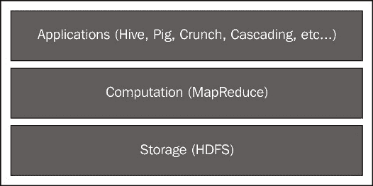
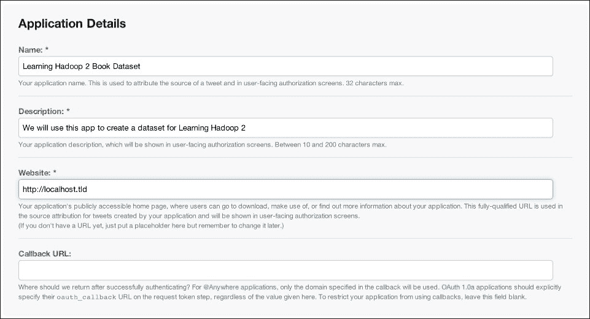
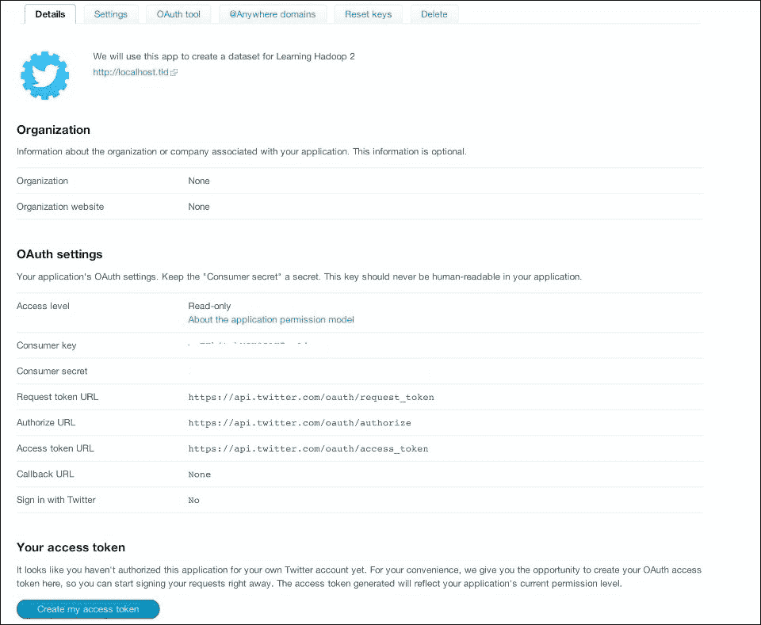

# 第一章：引言

本书将教您如何使用最新版本的 Hadoop 构建令人惊叹的系统。 不过，在你改变世界之前，我们需要做一些基础工作，这就是本章的用武之地。

在本介绍性章节中，我们将介绍以下主题：

*   简要回顾 Hadoop 的背景知识
*   Hadoop 演变一览
*   Hadoop 2 中的关键元素
*   我们将在本书中使用的 Hadoop 发行版
*   我们将在示例中使用的数据集

# 关于版本化的说明

在 Hadoop1 中，版本历史有点复杂，在 0.2x 范围内有多个分叉分支，这导致了奇怪的情况，在某些情况下，1.x 版本的特性可能比 0.23 版本少。 幸运的是，在版本 2 代码库中，这要简单得多，但是明确我们在本书中将使用哪个版本是很重要的。

Hadoop2.0 发布了 Alpha 和 Beta 版本，在此过程中引入了几个不兼容的更改。 特别值得一提的是，在测试版和最终发行版之间有一个重要的 API 稳定工作。

Hadoop 2.2.0 是 Hadoop2 代码库的第一个**通用版本**(**GA**)，它的接口现在被宣布为稳定且向前兼容。 因此，我们将在本书中使用 2.2 版本的产品和界面。 虽然这些原则可以在 2.0 测试版上使用，但特别是在测试版中会出现 API 不兼容的情况。 这一点尤其重要，因为 MapReducev2 已经被几个发行版供应商移植到 Hadoop1，但这些产品是基于测试版而不是 GAAPI 的。 如果您正在使用这样的产品，那么您将会遇到这些不兼容的更改。 建议将基于 Hadoop 2.2 或更高版本的版本用于任何 Hadoop 2 工作负载的开发和生产部署。

# Hadoop 的背景

我们假设大多数读者会对 Hadoop 略知一二，或者至少对大数据处理系统有所了解。 因此，我们不会在本书中给出 Hadoop 成功的原因或它帮助解决的问题类型的详细背景。 但是，特别是考虑到 Hadoop 2 和我们将在后面章节中使用的其他产品的某些方面，给出一个我们认为 Hadoop 如何适应技术环境以及我们认为它能带来最大好处的特定问题领域的草图是很有用的。

在古代，在“大数据”这个术语出现之前(大约相当于十年前)，几乎没有选择来处理以 TB 或更大为单位的数据集。 一些商业数据库可以通过非常具体和昂贵的硬件设置扩展到这一级别，但所需的专业知识和资本支出使其成为只有最大的组织才能选择的选择。 或者，可以针对手头的具体问题构建一个自定义系统。 这受到了一些相同的问题(专业知识和成本)的影响，并增加了任何尖端系统固有的风险。 另一方面，如果成功构建了一个系统，它很可能非常符合需求。

很少有中小型公司担心这一领域，不仅是因为解决方案超出了他们的能力范围，而且他们通常也没有任何接近于需要此类解决方案的数据量。 随着生成超大型数据集的能力变得越来越普遍，处理这些数据的需求也越来越大。

尽管大数据变得更加民主化，不再是少数特权阶层的领地，但如果能让小公司负担得起数据处理系统，就需要进行重大的架构改革。 第一个重大变化是减少了系统所需的前期资本支出；这意味着没有高端硬件或昂贵的软件许可证。 以前，高端硬件通常在数量相对较少的超大型服务器和存储系统中使用，每个服务器和存储系统都有多种方法来避免硬件故障。 虽然令人印象深刻，但这类系统非常昂贵，而转移到更多低端服务器将是大幅降低新系统硬件成本的最快方式。 更多地转向商用硬件，而不是传统的企业级设备，也将意味着弹性和容错能力的降低。 这些责任需要由软件层承担。 *更智能的软件，更愚蠢的硬件*。

谷歌在 2003 年开始了后来被称为 Hadoop 的变革，并在 2004 年发布了两篇学术论文，描述了**Google 文件系统**(**gfs**)([http://research.google.com/archive/gfs.html](http://research.google.com/archive/gfs.html))和MapReduce([http://research.google.com/archive/mapreduce.html](http://research.google.com/archive/mapreduce.html))。 这两者共同提供了一个以高效方式进行超大规模数据处理的平台。 谷歌采取了自己构建的方法，但他们没有针对一个特定的问题或数据集构建某种东西，而是创建了一个可以在其上实现多个处理应用程序的平台。 具体地说，他们利用了大量商用服务器，构建了 GFS 和 MapReduce，这种方式假定硬件故障是司空见惯的，只是软件需要处理的事情。

与此同时，Doug Cutting正在开发 Nutch 开源网络爬虫。 他正在研究系统中的元素，这些元素在 Google GFS 和 MapReduce 论文发表后引起了强烈共鸣。 Doug 开始致力于这些 Google 想法的开源实现，Hadoop 很快就诞生了，首先是作为 Lucene 的一个子项目，然后是它自己在 Apache Software Foundation 中的顶级项目。

雅虎!。 2006 年聘请了 Doug Cutting，并很快成为 Hadoop 项目最著名的支持者之一。 除了经常宣传一些世界上最大的 Hadoop 部署外，雅虎！ 允许 Doug 和其他工程师在受雇于公司的同时为 Hadoop 做出贡献，更不用说回馈一些内部开发的 Hadoop 改进和扩展了。

# Hadoop 组件

Bide Hadoop伞形项目有许多组件子项目，我们将在本书中讨论其中的几个。 Hadoop 的核心提供两项服务：存储和计算。 典型的 Hadoop 工作流包括将数据加载到**Hadoop 分布式文件系统**(**HDFS**)和使用**MapReduce**API或几个依赖 MapReduce 作为执行框架的工具进行处理。



Hadoop 1：HDFS 和 MapReduce

这两层都是 Google 自己的 GFS 和 MapReduce 技术的直接实现。

## 通用构建块

HDFS 和 MapReduce 都展示了上一节中描述的几个体系结构原则。 具体地说，的共同原则如下：

*   两者都设计为在商用(即中低规格)服务器集群上运行
*   两者都通过添加更多服务器(横向扩展)来扩展其容量，而不是之前的使用更大硬件的模型(纵向扩展)
*   两者都有识别和解决故障的机制
*   两者都透明地提供大部分服务，使用户能够专注于手头的问题
*   两者都有一个体系结构，其中软件群集位于物理服务器上，并管理应用程序负载平衡和容错等方面，而不依赖高端硬件来提供这些功能

## 存储

HDFS是文件系统，尽管不是 POSIX 兼容的文件系统。 这基本上意味着它不会显示出与常规文件系统相同的特征。 具体地说，特征如下：

*   HDFS 将文件存储在大小通常至少为 64 MB 或(现在更常见)128 MB 的数据块中，远远大于大多数文件系统中 4-32 KB 的大小
*   HDFS 针对延迟吞吐量进行了优化；它在流式读取大文件时非常高效，但在查找许多小文件时效率很低
*   HDFS 针对通常为一次写入和多次读取的工作负载进行了优化
*   HDFS 使用复制，而不是通过在磁盘阵列中设置物理冗余或类似策略来处理磁盘故障。 组成文件的每个数据块都存储在群集内的多个节点上，名为 NameNode 的服务会持续监视，以确保故障不会使任何数据块低于所需的复制系数。 如果确实发生了这种情况，则它会计划在群集中创建另一个副本。

## 计算

MapReduce是一个 API、一个执行引擎和一个处理范例；它提供了一系列从源数据集到结果数据集的转换。 在最简单的情况下，输入数据通过 MAP 函数馈送，生成的临时数据然后通过 Reduce 函数馈送。

MapReduce 最适用于半结构化或非结构化数据。 与符合严格模式的数据不同，我们的要求是可以将数据作为一系列键-值对提供给映射函数。 Map 函数的输出是一组其他键-值对，Reduce 函数执行聚合以收集最终结果集。

Hadoop 为映射和缩减阶段提供了标准规范(即接口)，这些阶段的实现通常称为映射器和减少器。 典型的 MapReduce 应用程序将包含许多映射器和减法器，其中几个非常简单并不少见。 开发人员专注于表示源数据和结果数据之间的转换，Hadoop 框架管理作业执行和协调的所有方面。

## 更好的结合在一起

我们可以欣赏 HDFS 和 MapReduce 各自的优点，但当它们组合在一起时，功能会更强大。 它们可以单独使用，但当它们结合在一起时，它们可以发挥彼此的最大优点，这种紧密的互通是 Hadoop1 成功和被接受的主要因素。

在规划 MapReduce 作业时，Hadoop 需要决定在哪台主机上执行代码，以便最有效地处理数据集。 如果 MapReduce 群集主机全部从单个存储主机或阵列提取其数据，则这在很大程度上无关紧要，因为存储系统是共享资源，会导致争用。 如果存储系统更透明，并允许 MapReduce 更直接地操作其数据，那么就有机会在更接近数据的地方执行处理，这是建立在移动处理成本低于数据的原则上的。

Hadoop 最常见的部署模式是将 HDFS 和 MapReduce 集群部署在同一组服务器上。 每个包含数据的主机和用于管理数据的 HDFS 组件还托管一个 MapReduce 组件，该组件可以调度和执行数据处理。 当作业提交到 Hadoop 时，它可以使用局部性优化来尽可能多地在数据驻留的主机上调度数据，从而最大限度地减少网络流量并最大限度地提高性能。

# Hadoop 2-有什么大不了的？

如果我们看看核心 Hadoop 分发版的两个主要组件，即存储和计算，我们会发现 Hadoop2 对每个组件都有非常不同的影响。 与 Hadoop 1 中的 HDFS 相比，Hadoop 2 中的 HDFS 主要是一个功能更丰富、弹性更强的产品，而对于 MapReduce，这些变化要深刻得多，实际上改变了人们对 Hadoop 作为处理平台的总体看法。 让我们先来看看 Hadoop2 中的 HDFS。

## Hadoop 2 中的存储

我们将在[第 2 章](02.html "Chapter 2. Storage")，*存储*中更详细地讨论HDFS 体系结构，但就目前而言，考虑主从模型就足够了。 从节点(称为 DataNode)保存实际文件系统数据。 具体地说，运行 DataNode 的每个主机通常都有一个或多个磁盘，将包含每个 HDFS 块的数据的文件写入到这些磁盘上。 DataNode 本身并不了解整个文件系统；它的角色是存储、服务和确保其负责的数据的完整性。

主节点(称为 NameNode)负责知道哪个 DataNode 持有哪个块，以及这些块是如何构成文件系统的。 当客户端查看文件系统并希望检索文件时，通过向 NameNode 发出请求来检索所需块的列表。

此模型运行良好，并已扩展到具有数万个节点的群集，例如 Yahoo！ 因此，尽管 NameNode 是可伸缩的，但存在弹性风险；如果 NameNode 变得不可用，那么整个集群实际上是无用的。 无法执行 HDFS 操作，而且由于绝大多数安装使用 HDFS 作为服务(如 MapReduce)的存储层，因此即使它们仍在正常运行，它们也变得不可用。

更具灾难性的是，NameNode 将文件系统元数据存储到其本地文件系统上的一个持久文件中。 如果 NameNode 主机以此数据不可恢复的方式崩溃，则群集上的所有数据实际上都将永远丢失。 数据仍将存在于各种 DataNode 上，但哪些块包含哪些文件的映射将丢失。 这就是为什么在 Hadoop1 中，最佳实践是让 NameNode 将其文件系统元数据同步写入本地磁盘和至少一个远程网络卷(通常通过 NFS)。

第三方供应商已经提供了几个 NameNode**高可用性**(**HA**)解决方案，但核心 Hadoop 产品在版本 1 中没有提供这样的弹性。考虑到这种体系结构单点故障和数据丢失的风险，听到**NameNode HA**是 Hadoop 2 中 HDFS 的主要功能之一也就不足为奇了，我们将在。 该功能不仅提供了一个备用 NameNode，可以在活动 NameNode 出现故障时自动升级为所有请求提供服务，而且还为该机制之上的关键文件系统元数据构建了额外的弹性。

Hadoop2 中的 HDFS 仍然是一个非 POSIX 文件系统；它仍然具有非常大的块大小，并且仍然以延迟换取吞吐量。 但是，它现在确实具有一些功能，可以使其看起来更像传统文件系统。 特别是，Hadoop2 中的核心 HDFS 现在可以远程挂载为 NFS 卷。 这是另一个特性，以前是由第三方供应商作为专有功能提供的，但现在是主要的 Apache 代码库。

总体而言，Hadoop 2 中的 HDFS 弹性更强，可以更轻松地集成到现有工作流和流程中。 这是 Hadoop1 中产品的强大发展。

## Hadoop 2 中的计算

HDFS2 上的工作是在 MapReduce 的方向明确之前开始的。 这很可能是因为像 NameNode HA 这样的特性是如此明显的路径，以至于社区知道要解决的最关键的领域。 然而，MapReduce 并没有一个类似的改进领域列表，这就是为什么当 MRv2 计划开始时，并不完全清楚它将走向何方。

也许 Hadoop1 中对 MapReduce 最频繁的批评是它的批处理模型不适合需要更快响应时间的问题领域。 例如，我们将在[第 7 章](07.html "Chapter 7. Hadoop and SQL")、*Hadoop 和 SQL*中讨论的 HIVE 提供了针对 HDFS 数据的类似 SQL 的接口，但在幕后，语句被转换为 MapReduce 作业，然后像其他作业一样执行。 许多其他产品和工具采取了类似的方法，提供了一个特定的面向用户的界面，隐藏了 MapReduce 翻译层。

尽管这种方法非常成功，并且已经构建了一些令人惊叹的产品，但在许多情况下，仍然存在不匹配的事实，因为所有这些接口(其中一些接口需要某种类型的响应)都在后台，在批处理平台上执行。 在寻求增强 MapReduce 时，可以对其进行改进，使其更适合这些用例，但根本的不匹配仍然存在。 这种情况导致 MRv2 计划的重点发生了重大变化；也许 MapReduce 本身不需要改变，但真正需要的是在 Hadoop 平台上启用不同的处理模型。 于是诞生了**又一个资源谈判者**(**纱线**)。

看看 Hadoop1 中的 MapReduce，该产品实际上做了两件完全不同的事情：它提供了执行 MapReduce 计算的处理框架，但它也管理着计算在集群中的分配。 它不仅将数据定向到特定的 map 和 Reduce 任务以及在它们之间定向数据，而且还确定每个任务将在何处运行，并管理整个作业生命周期、监视每个任务和节点的运行状况、在任何任务失败时重新调度等等。

这不是一项微不足道的任务，工作负载的自动并行化一直是 Hadoop 的主要优势之一。 如果我们查看 Hadoop1 中的 MapReduce，我们会看到，在用户定义了作业的关键标准之后，其他所有事情都由系统负责。 重要的是，从规模的角度来看，相同的 MapReduce 作业可以应用于托管在任何大小的集群上的任何卷的数据集。 如果数据大小为 1 GB，并且位于单个主机上，则 Hadoop 将相应地安排处理。 如果数据的大小改为 1 PB，并且托管在 1,000 台机器上，那么它也会这样做。 从用户的角度来看，数据和集群的实际规模是透明的，除了影响处理作业所需的时间外，它不会更改与系统交互的界面。

在 Hadoop2 中，作业调度和资源管理的这一角色与执行实际应用程序的角色是分开的，并由 YAR 实现。

YAIN 负责管理集群资源，因此 MapReduce 作为应用程序运行在 YAR 框架之上。 Hadoop2 中的 MapReduce 接口与 Hadoop1 中的 MapReduce 接口在语义和实践上都是完全兼容的。 然而，在幕后，MapReduce 已经成为纱线框架上的一个托管应用程序。

这种拆分的意义是，可以编写其他应用程序，提供更专注于实际问题领域的处理模型，并将所有资源管理和调度责任卸载给 YAR。 许多不同的执行引擎的最新版本已经移植到了纱线上，无论是处于生产就绪状态还是实验状态，并且已经表明，该方法可以允许单个 Hadoop 集群运行从面向批处理的 MapReduce 作业到快速响应 SQL 查询到连续数据流，甚至可以从**高性能计算**(**HPC)实现图形处理和**消息传递接口**(**MPI**)等模型。 下面的图显示了 Hadoop 2 的架构：**


Hadoop 2

这就是为什么围绕 Hadoop2 的大部分关注和兴奋都集中在它上面的纱线和框架上，比如 Apache Tez 和 Apache Spark。 有了 YAR，Hadoop 集群不再只是一个批处理引擎；它是一个单一平台，在该平台上可以将大量处理技术应用于存储在 HDFS 中的海量数据。 此外，应用程序可以基于这些计算范例和执行模型构建。

与实现某种牵引力的类比是将纱线视为处理内核，在此基础上可以构建其他领域特定的应用程序。 我们将在本书中更详细地讨论纱线，特别是在[第 3 章](03.html "Chapter 3. Processing – MapReduce and Beyond")，*Processing-MapReduce and Beyond*，[第 4 章](04.html "Chapter 4. Real-time Computation with Samza")，*使用 Samza*进行实时计算，以及[第 5 章](05.html "Chapter 5. Iterative Computation with Spark")，*使用 Spark 进行迭代计算*。

# Apache Hadoop 的发行版

在 Hadoop 非常早期的日子里，安装(通常是从源代码构建)和管理每个组件及其依赖项的负担落在用户身上。 随着该系统变得越来越流行，第三方工具和库生态系统开始增长，安装和管理 Hadoop 部署的复杂性急剧增加，以至于围绕核心 Apache Hadoop 提供连贯的软件包、文档和培训已成为一种业务模式。 进入 Apache Hadoop 的发行版世界。

Hadoop 发行版在概念上类似于 Linux 发行版如何提供一组围绕公共核心的集成软件。 它们自己承担捆绑和打包软件的负担，并为用户提供安装、管理和部署 Apache Hadoop 以及选定数量的第三方库的简单方法。 具体地说，发行版提供了一系列经认证相互兼容的产品版本。 从历史上看，构建一个基于 Hadoop 的平台通常非常复杂，因为各种版本的相互依赖。

Cloudera([http://www.cloudera.com](http://www.cloudera.com))、Hortonworks([http://www.hortonworks.com](http://www.hortonworks.com))和MapR([http://www.mapr.com](http://www.mapr.com))是最先上市的，每种产品都有不同的方法和卖点。 Hortonworks 将自己定位为开源玩家；Cloudera 也致力于开源，但增加了配置和管理 Hadoop 的专有部分；MapR 提供了混合的开源/专有 Hadoop 发行版，其特征是专有的 NFS 层而不是 HDFS，并且专注于提供服务。

分发生态系统中的另一个强大参与者是 Amazon，它在**Amazon Web Services**(**AWS**)基础设施之上提供了名为**Elastic MapReduce**(**EMR**)的 Hadoop 版本。

随着 Hadoop2 的问世，可用于 Hadoop 的发行版数量急剧增加，远远超过了我们提到的四个发行版。 包含 Apache Hadoop 的软件产品列表可能不完整，请访问[http://wiki.apache.org/hadoop/Distributions%20and%20Commercial%20Support](http://wiki.apache.org/hadoop/Distributions%20and%20Commercial%20Support)。

# 一种双重方式

在这本书中，除了展示如何通过 EMR 将处理推入云之外，我们还将讨论本地 Hadoop 集群的构建和管理。

这有两个原因：首先，尽管 EMR 使 Hadoop 更容易访问，但该技术的某些方面只有在手动管理集群时才会变得明显。 虽然也可以在更手动的模式下使用 EMR，但我们通常会使用本地集群进行此类探索。 其次，虽然这不一定是非此即彼的决定，但许多组织混合使用内部和云托管功能，有时是因为担心过度依赖单个外部提供商，但实际上，在本地容量上进行开发和小规模测试，然后将其按生产规模部署到云中通常比较方便。

在后面的几章中，我们将讨论与 Hadoop 集成的其他产品，我们将主要给出本地集群的示例，因为无论产品部署在哪里，它们的工作方式都没有区别。

# AWS-亚马逊提供的按需基础设施

AWS 是亚马逊提供的一套云计算服务。 在本书中，我们将使用其中的几项服务。

## 简单存储服务(S3)

亚马逊的**简单存储服务**(**S3**)位于[http://aws.amazon.com/s3/](http://aws.amazon.com/s3/)，是一个提供简单键值存储模型的存储服务。 使用 Web、命令行或编程界面创建对象(可以是从文本文件到图像再到 MP3 的任何对象)，您可以基于分层模型存储和检索数据。 在此模型中，您将创建包含对象的存储桶。 每个存储桶都有一个唯一的标识符，并且在每个存储桶中，每个对象都是唯一命名的。 这一简单的策略实现了一项极其强大的服务，亚马逊对此完全负责(除了数据的可靠性和可用性之外，还负责服务扩展)。

## 弹性 MapReduce(EMR)

亚马逊的 Elastic MapReduce 在[Hadoop](http://aws.amazon.com/elasticmapreduce/)上找到了，基本上就是云中的 http://aws.amazon.com/elasticmapreduce/。 使用多个界面(Web 控制台、CLI 或 API)中的任何，Hadoop 工作流都定义有所需的 Hadoop主机数量和源数据位置等属性。 提供了实现 MapReduce 作业的 Hadoop 代码，并按下了虚拟 Go 按钮。

在其最令人印象深刻的模式下，EMR 可以从 S3 提取源数据，在它在 Amazon 的虚拟主机按需服务 EC2 上创建的 Hadoop 集群上处理这些数据，将结果推送回 S3，并终止 Hadoop 集群和托管它的 EC2 虚拟机。 当然，这些服务中的每一项都有成本(通常是按存储 GB 和服务器使用时间计算)，但无需专用硬件即可访问如此强大的数据处理功能的能力是非常强大的。

# 入门

我们现在将描述本书中将使用的两个环境：Cloudera 的 QuickStart 虚拟机将是我们的参考系统，我们将在其上展示所有示例，但当在按需服务中运行示例有一些特别有价值的方面时，我们还将在 Amazon 的 EMR 上演示一些示例。

尽管提供的示例和代码旨在尽可能具有通用性和可移植性，但我们在讨论本地集群时，参考设置将是在 CentOS Linux 上运行的 Cloudera。

在很大程度上，我们将展示使用终端提示符或从终端提示符执行的示例。 尽管 Hadoop 的图形界面在过去几年中有了很大改进(例如，出色的色调和 Cloudera Manager)，但在开发、自动化和以编程方式访问系统时，命令行仍然是最强大的工具。

本书中提供的所有示例和源代码都可以从[https://github.com/learninghadoop2/book-examples](https://github.com/learninghadoop2/book-examples)下载。 此外，我们还有图书主页，我们将在[http://learninghadoop2.com](http://learninghadoop2.com)上发布更新和相关材料。

## Cloudera QuickStart 虚拟机

Hadoop 发行版的优势之一是，它们让能够访问易于安装的打包软件。 Cloudera 更进一步，提供了其最新发行版的可免费下载的虚拟机实例，称为 CDH QuickStart VM，部署在 CentOS Linux 之上。

在本书的其余部分中，我们将使用 CDH5.0.0 VM 作为参考和基准系统来运行示例和源代码。 VM 的镜像可用于 Vmware([http://www.vmware.com/nl/products/player/](http://www.vmware.com/nl/products/player/))、KVM([http://www.linux-kvm.org/page/Main_Page](http://www.linux-kvm.org/page/Main_Page))和VirtualBox([https://www.virtualbox.org/](https://www.virtualbox.org/))虚拟化系统。

## Amazon EMR

在使用**Elastic MapReduce**之前，我们需要设置一个 AWS 帐户并将其注册到必要的服务。

### 创建 AWS 帐户

Amazon已将其一般帐户与 AWS 集成，这意味着，如果您已经拥有任何亚马逊零售网站的帐户，则这是您使用 AWS 服务所需的唯一帐户。

### 备注

请注意，AWS 服务是有费用的；您需要一张与可以收费的账户相关联的活动信用卡。

如果您需要新的亚马逊帐户，请转到[AWS](http://aws.amazon.com)，选择**新建 http://aws.amazon.com 帐户**，然后按照提示操作。 Amazon 为一些服务添加了一个免费级别，因此您可能会发现，在测试和探索的早期，您的许多活动都保持在免费级别内。 免费级别的范围一直在扩大，所以要确保你知道你将会和不会被收费。

### 注册必要的服务

一旦您拥有 Amazon 帐户，您将需要注册该帐户以使用所需的 AWS 服务，即、**Simple Storage Service**(**S3**)、**Elastic Compute Cloud**(**EC2**)和**Elastic MapReduce**。 只需注册任何 AWS 服务即可免费使用；该流程只需将该服务提供给您的帐户即可。

转到从[http://aws.amazon.com](http://aws.amazon.com)链接的 S3、EC2 和 EMR 页面，单击每页上的**Sign Up****按钮，然后按照提示操作。**

 **## 使用弹性 MapReduce

在 AWS 上创建了帐户并注册了所有必需的服务后，我们可以继续配置电子病历的编程访问权限。

## 启动并运行 Hadoop

### 备注

小心！ 这可真花了不少钱啊！

在继续之前，了解使用 AWS 服务将会产生与您的 Amazon 帐户关联的信用卡上显示的费用，这一点至关重要。 大多数费用都很低，并且会随着基础设施使用量的增加而增加；在 S3 中存储 10 GB 数据的成本是 1 GB 的 10 倍，运行 20 个 EC2 实例的成本是单个 EC2 实例的 20 倍。 由于存在分层成本模型，因此实际成本往往在较高的水平上有较小的边际增长。 但在使用任何一项服务之前，您都应该仔细阅读每项服务的定价部分。 另请注意，目前从 AWS 服务(如 EC2 和 S3)传出的数据是收费的，但服务之间的数据传输是不收费的。 这意味着，仔细设计 AWS 的使用，通过尽可能多的数据处理将数据保留在 AWS 中通常是最具成本效益的。 有关亚马逊工作站和电子病历的信息，请咨询[http://aws.amazon.com/elasticmapreduce/#pricing](http://aws.amazon.com/elasticmapreduce/#pricing)。

### 如何使用电子病历

Amazon为 EMR 提供 Web 和命令行界面。 这两个界面只是同一个系统的前端；使用命令行界面创建的群集可以使用 Web 工具进行检查和管理，反之亦然。

在很大程度上，我们将使用命令行工具以编程方式创建和管理集群，并在有意义的情况下使用 Web 界面。

### AWS 凭据

在使用编程或命令行工具之前，我们需要了解帐户持有人如何向 AWS 进行身份验证以提出此类请求。

每个 AWS 帐户都有多个标识符，如下所示，可在访问各种服务时使用：

*   **帐户 ID**：每个AWS 帐户都有一个数字 ID。
*   **访问密钥**：关联的访问密钥用于标识发出请求的帐户。
*   **秘密访问密钥**：访问密钥的伙伴是秘密访问密钥。 访问密钥不是秘密，可以在服务请求中公开，但是秘密访问密钥是您用来验证自己是否为帐户所有者的密钥。 把它当做你的信用卡。
*   **密钥对**：这些是用于登录 EC2 主机的密钥对。 可以在 EC2 内生成公钥/私钥对，也可以将外部生成的密钥导入系统。

用户凭据和权限通过名为**Identity and Access Management**(**IAM**)的 Web 服务进行管理，您需要注册该服务才能获得访问和密钥。

如果这听起来令人困惑，那是因为它确实如此，至少在一开始是这样。 使用工具访问 AWS 服务时，通常只需将正确的凭据添加到已配置的文件中，然后一切就可以正常工作了。 但是，如果您确实决定探索编程工具或命令行工具，那么花点时间阅读每个服务的文档以了解其安全性是如何工作的将是值得的。 有关创建aws 帐户和获取访问凭证的更多信息，请参阅[http://docs.aws.amazon.com/iam](http://docs.aws.amazon.com/iam)。

## AWS 命令行界面

每个AWS 服务在历史上都有自己的命令行工具集。 不过，亚马逊最近创建了一个单一的、统一的命令行工具，允许访问大多数服务。 Amazon CLI位于[http://aws.amazon.com/cli](http://aws.amazon.com/cli)。

它可以从 tarball 安装，也可以通过`pip`或`easy_install`包管理器安装。

在 CDH QuickStart 虚拟机上，我们可以使用以下命令安装`awscli`：

```scala
$ pip install awscli

```

为了访问 API，我们需要将软件配置为使用我们的访问密钥和密钥向 AWS 进行身份验证。

这也是通过遵循[https://console.aws.amazon.com/ec2/home?region=us-east-1#c=EC2&s=KeyPair](https://console.aws.amazon.com/ec2/home?region=us-east-1#c=EC2&s=KeyPairs)提供的说明来设置 EC2 密钥对的好时机。

虽然密钥对并不是运行 EMR 集群所必需的，但它将使我们能够远程登录到主节点并获得对集群的低级别访问。

以下命令将引导您完成一系列配置步骤，并将结果配置存储在`.aws/credential`文件中：

```scala
$ aws configure

```

配置 CLI 后，我们可以使用`aws <service> <arguments>`查询 AWS。 要创建和查询 S3 存储桶，请使用类似以下命令的命令。 请注意，S3 存储桶需要在所有 AWS 账户中具有全局唯一性，因此最常用的名称(如`s3://mybucket`)将不可用：

```scala
$ aws s3 mb s3://learninghadoop2
$ aws s3 ls

```

我们可以使用以下命令配置具有五个`m1.xlarge`个节点的 EMR 群集：

```scala
$ aws emr create-cluster --name "EMR cluster" \
--ami-version 3.2.0 \
--instance-type m1.xlarge  \
--instance-count 5 \
--log-uri s3://learninghadoop2/emr-logs

```

其中`--ami-version`是 Amazon Machine Image 模板([EMR](http://docs.aws.amazon.com/AWSEC2/latest/UserGuide/AMIs.html))的 ID，`--log-uri`指示 http://docs.aws.amazon.com/AWSEC2/latest/UserGuide/AMIs.html 收集日志并将其存储在`learninghadoop2`S3 存储桶中。

### 备注

如果在设置 AWS CLI 时未指定默认区域，则还必须使用--region 参数在 AWS CLI 中添加一个 EMR 命令；例如，运行`--region eu-west-1`以使用 EU 爱尔兰区域。 您可以在[http://docs.aws.amazon.com/general/latest/gr/rande.html](http://docs.aws.amazon.com/general/latest/gr/rande.html)上找到所有可用 aws 区域的详细信息。

我们可以使用以下命令通过向正在运行的群集添加步骤来提交工作流：

```scala
$ aws emr add-steps --cluster-id <cluster> --steps <steps> 

```

要终止群集，请使用以下命令行：

```scala
$ aws emr terminate-clusters --cluster-id <cluster>

```

在后面的章节中，我们将向您展示如何添加执行 MapReduce 作业和 Pig 脚本的步骤。

有关使用 AWS CLI 的更多信息，请参阅[http://docs.aws.amazon.com/ElasticMapReduce/latest/DeveloperGuide/emr-manage.html](http://docs.aws.amazon.com/ElasticMapReduce/latest/DeveloperGuide/emr-manage.html)。

# 运行示例

所有示例的源代码都可以在[https://github.com/learninghadoop2/book-examples](https://github.com/learninghadoop2/book-examples)上找到。

Gradle([Java](http://www.gradle.org)/)脚本和配置用于编译大多数 http://www.gradle.org 代码。 示例中包含的`gradlew`脚本将引导 Graotstrap，并使用它来获取依赖项并编译代码。

可以通过`gradlew`脚本调用`jar`任务来创建 JAR 文件，如下所示：

```scala
./gradlew jar

```

作业通常通过使用`hadoop jar`命令提交 JAR 文件来执行，如下所示：

```scala
$ hadoop jar example.jar <MainClass> [-libjars $LIBJARS] arg1 arg2 … argN

```

可选的`-libjars`参数指定要发送到远程节点的运行时第三方依赖项。

### 备注

我们将要使用的一些框架，比如 Apache Spark，都有自己的构建和包管理工具。 我们会为这些特别个案提供更多资料和资源。

`copyJar`Gradle 任务可用于将第三方依存关系下载到`build/libjars/<example>/lib`，如下所示：

```scala
./gradlew copyJar

```

为方便起见，我们提供了一个`fatJar`Gradle 任务，该任务将示例类及其依赖项捆绑到单个 JAR 文件中。 尽管支持使用`–libjar`而不鼓励使用这种方法，但在处理依赖关系问题时，它可能会派上用场。

以下命令将生成`build/libs/<example>-all.jar`：

```scala
$ ./gradlew fatJar

```

# 使用 Hadoop 进行数据处理

在本书剩余的章中，我们将介绍 Hadoop 生态系统的核心组件以及一些第三方工具和库，这些工具和库将使编写健壮的分布式代码成为一项可访问且可望令人愉快的任务。 阅读本书时，您将学习如何从大量结构化和非结构化数据中收集、处理、存储和提取信息。

我们将使用从推特的([http://www.twitter.com](http://www.twitter.com))实时消防水龙带生成的数据集。 这种方法将允许我们在本地使用相对较小的数据集进行实验，一旦准备好，就可以将示例扩展到生产级数据大小。

## 为什么选择推特？

多亏了的编程 API，Twitter 提供了一种简单的方法来生成任意大小的数据集，并将它们注入到我们基于本地或云的 Hadoop 集群中。 除了绝对的大小之外，我们将使用的数据集还具有许多属性，这些属性适合几个有趣的数据建模和处理用例。

Twitter 数据具有以下属性：

*   **非结构化**：每个状态更新都是一条文本消息，可以包含对媒体内容(如 URL 和图像)的引用
*   **结构化**：tweet是带时间戳的顺序记录
*   **图**：诸如回复和提及等关系可以建模为交互网络
*   **地理位置**：发布推文或用户居住的位置
*   **实时**：Twitter 上生成的所有数据都可以通过实时消防软管获得

这些属性将反映在我们可以使用 Hadoop 构建的应用程序类型中。 这些例子包括情绪分析、社交网络和趋势分析。

## 构建我们的第一个数据集

Twitter 的服务条款禁止以任何形式重新分发用户生成的数据；因此，我们不能提供通用的数据集。 相反，我们将使用 Python 脚本以编程方式访问该平台，并创建从实况流收集的用户 tweet 的转储。

### 一个服务，多个接口

推特用户每天分享超过 2 亿条推文，也被称为状态更新。 该平台通过四种类型的 API 提供对这个数据库的访问，每种 API 代表 Twitter 的一个方面，旨在满足特定的使用案例，例如链接来自第三方来源(产品的 Twitter)的 Twitter 内容并与之交互、编程访问特定用户或站点的内容(REST)、跨用户或站点的时间轴的搜索功能(搜索)以及实时访问在 Twitter 网络上创建的所有内容(流)。

流 API 允许直接访问 Twitter 流、跟踪关键字、从特定地区检索带地理标记的 tweet 等等。 在本书中，我们将使用此 API 作为数据源来说明 Hadoop 的批处理和实时功能。 但是，我们不会与 API 本身交互；相反，我们将利用第三方库来卸载身份验证和连接管理等繁琐工作。

### 一条推特的解剖

调用实时 API 返回的每个tweet 对象被表示为一个序列化的 JSON 字符串，除了文本消息外，该字符串还包含一组属性和元数据。 这些附加内容包括唯一标识推文的数字 ID、共享推文的位置、共享该推文的用户(用户对象)、是否被其他用户重新发布(转发)和多少次(转发次数)、机器检测到的文本的语言、该推文是否回复了某人以及如果是的话，用户和回复的推文 ID，等等。

Tweet 的结构以及 API 公开的任何其他对象都在不断演变。 最新参考文献可在[https://dev.twitter.com/docs/platform-objects/tweets](https://dev.twitter.com/docs/platform-objects/tweets)找到。

### 推特凭证

Twitter利用 OAuth 协议对第三方软件对其平台的访问进行身份验证和授权。

应用程序通过外部渠道(例如 Web 表单)获得以下一对凭证：

*   消费者密钥
*   消费者秘密

消费者秘密永远不会直接传输给第三方，因为它被用来对每个请求进行签名。

用户通过一个三方流程授权应用程序访问服务，该流程一旦完成，将授予应用程序一个由以下内容组成的令牌：

*   访问令牌
*   访问密码

同样，对于消费者来说，访问秘密永远不会直接传输给第三方，而是用来对每个请求进行签名。

为了使用流 API，我们首先需要注册一个应用程序，并授予它对系统的编程访问权限。 如果您需要一个新的推特帐户，请进入[https://twitter.com/signup](https://twitter.com/signup)的注册页面，并填写所需信息。 完成此步骤后，我们需要创建一个样例应用程序，该应用程序将代表我们访问 API 并授予它适当的授权权限。 我们将使用位于[https://dev.twitter.com/apps](https://dev.twitter.com/apps)的 Web 表单来完成此操作。

当创建一个新的应用程序时，我们被要求给它一个名称、一个描述和一个 URL。 下面的屏幕截图显示了名为`Learning Hadoop 2 Book Dataset`的示例应用程序的设置。 出于本书的目的，我们不需要指定有效的 URL，因此我们使用了占位符。



填写表单后，我们需要查看并接受服务条款，然后单击页面左下角的**Create Application**按钮。

现在，我们看到一个总结应用程序详细信息的页面，如下面的屏幕截图所示；身份验证和授权凭据可以在 OAuth 工具选项卡下找到。

我们终于准备好生成我们的第一个 Twitter 数据集。



## 使用 Python 进行编程访问

在本节中，我们将使用 Python 和位于[https://github.com/tweepy/tweepy](https://github.com/tweepy/tweepy)的`tweepy`库来收集Twitter 的数据。 图书代码归档的`ch1`目录中的`stream.py`文件将监听器实例化到实时消防软管，获取数据样本，并将每个 tweet 的文本回显到标准输出。

可以使用`easy_install`或`pip`包管理器或通过克隆[https://github.com/tweepy/tweepy](https://github.com/tweepy/tweepy)处的存储库来安装`tweepy`库。

在 CDH QuickStart 虚拟机上，我们可以使用以下命令行安装`tweepy`：

```scala
$ pip install tweepy

```

当使用`-j`参数调用时，脚本将 JSON tweet 输出到标准输出；`-t`提取并打印文本字段。 我们指定使用`–n <num tweets>`打印多少条 tweet。 如果未指定`–n`，则脚本将无限期运行。 按*Ctrl*+*C*可终止执行。

脚本期望将OAuth 凭据存储为 shell 环境变量；必须在执行`stream.py`的终端会话中设置以下凭据。

```scala
$ export TWITTER_CONSUMER_KEY="your_consumer_key"
$ export TWITTER_CONSUMER_SECRET="your_consumer_secret"
$ export TWITTER_ACCESS_KEY="your_access_key"
$ export TWITTER_ACCESS_SECRET="your_access_secret"

```

一旦安装了所需的依赖项并设置了 shell 环境中的 OAuth 数据，我们就可以按如下方式运行该程序：

```scala
$ python stream.py –t –n 1000 > tweets.txt

```

我们依靠 Linux 的 shell I/O 将带有`stream.py`的`>`操作符的输出重定向到一个名为`tweets.txt`的文件。 如果一切都执行正确，您应该会看到一堵文字墙，其中每一行都是一条 tweet。

请注意，在本例中，我们根本没有使用 Hadoop。 在接下来的章节中，我们将展示如何将流 API 生成的数据集导入 Hadoop，并在本地群集和 Amazon EMR 上分析其内容。

现在，让我们看一下`stream.py`的源代码，它可以在[https://github.com/learninghadoop2/book-examples/blob/master/ch1/stream.py](https://github.com/learninghadoop2/book-examples/blob/master/ch1/stream.py)中找到：

```scala
import tweepy
import os
import json
import argparse

consumer_key = os.environ['TWITTER_CONSUMER_KEY']
consumer_secret = os.environ['TWITTER_CONSUMER_SECRET']
access_key = os.environ['TWITTER_ACCESS_KEY']
access_secret = os.environ['TWITTER_ACCESS_SECRET']

class EchoStreamListener(tweepy.StreamListener):
    def __init__(self, api, dump_json=False, numtweets=0):
        self.api = api
        self.dump_json = dump_json
        self.count = 0
        self.limit = int(numtweets)
        super(tweepy.StreamListener, self).__init__()

    def on_data(self, tweet):
        tweet_data = json.loads(tweet)
        if 'text' in tweet_data:
            if self.dump_json:
                print tweet.rstrip()
            else:
                print tweet_data['text'].encode("utf-8").rstrip()

            self.count = self.count+1
            return False if self.count == self.limit else True

    def on_error(self, status_code):
        return True

    def on_timeout(self):
        return True
…
if __name__ == '__main__':
    parser = get_parser()
    args = parser.parse_args()

    auth = tweepy.OAuthHandler(consumer_key, consumer_secret)
    auth.set_access_token(access_key, access_secret)
    api = tweepy.API(auth)
    sapi = tweepy.streaming.Stream(
        auth, EchoStreamListener(
            api=api, 
            dump_json=args.json, 
            numtweets=args.numtweets))
    sapi.sample()
```

首先，我们导入三个依赖项：`tweepy`、`os`和`json`模块，它们随 Python 解释器版本 2.6 或更高版本一起提供。

然后我们定义一个类`EchoStreamListener`，它从`tweepy`继承并扩展`StreamListener`。 顾名思义，`StreamListener`监听实时流上发布的事件和 tweet，并执行相应的操作。

每当检测到新事件时，它都会触发对`on_data()`的调用。 在此方法中，我们从 tweet 对象中提取`text`字段，并使用 UTF-8 编码将其打印到标准输出。 或者，如果使用`-j`调用该脚本，我们将打印整个 JSON tweet。 执行脚本时，我们使用标识 Twitter 帐户的 OAuth凭据实例化一个`tweepy.OAuthHandler`对象，然后使用该对象使用应用程序访问和密钥进行身份验证。 然后，我们使用`auth`对象创建`tweepy.API`类的实例(`api`)

在成功验证之后，我们告诉 Python 使用`EchoStreamListener`监听实时流上的事件。

发往`statuses/sample`端点的 http GET 请求由`sample()`执行。 该请求返回所有公共状态的随机样本。

### 备注

小心点！ 默认情况下，`sample()`将无限期运行。 记住通过按*Ctrl*+*C*来显式终止方法调用。

# 摘要

本章对 Hadoop 的起源、演变以及为什么版本 2 的发布是如此重要的里程碑进行了旋风式的介绍。 我们还在书中描述了 Hadoop 发行版的新兴市场，以及我们将如何结合使用本地和云发行版。

最后，我们描述了如何设置后续章节中所需的软件、帐户和环境，并演示了如何从我们将用作示例的 Twitter 流中提取数据。

了解了这些背景知识后，我们现在将继续详细研究 Hadoop 中的存储层。**