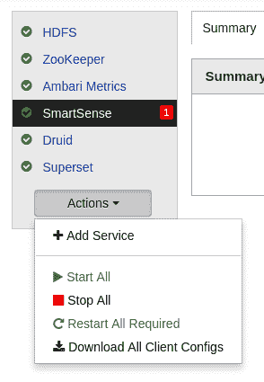
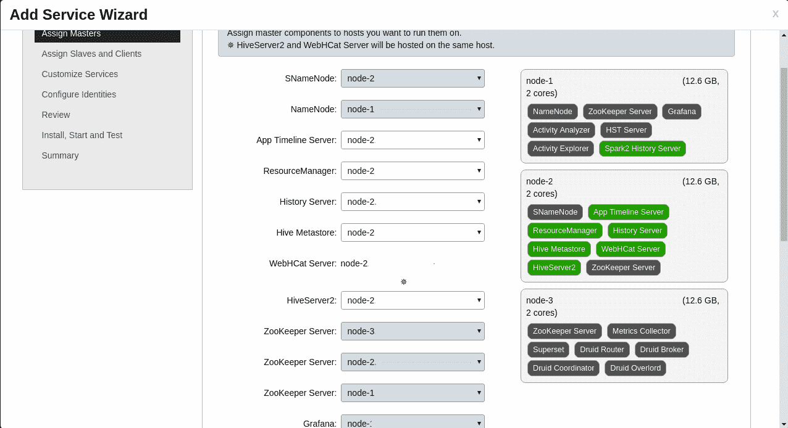
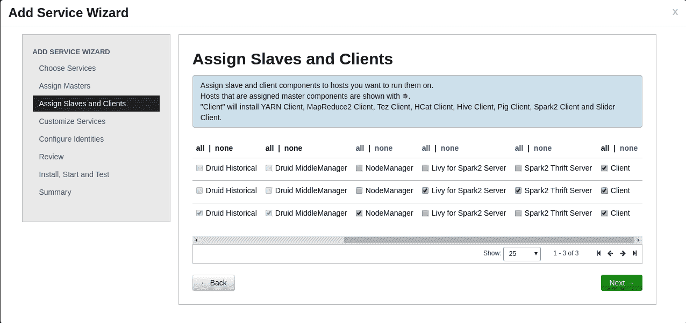
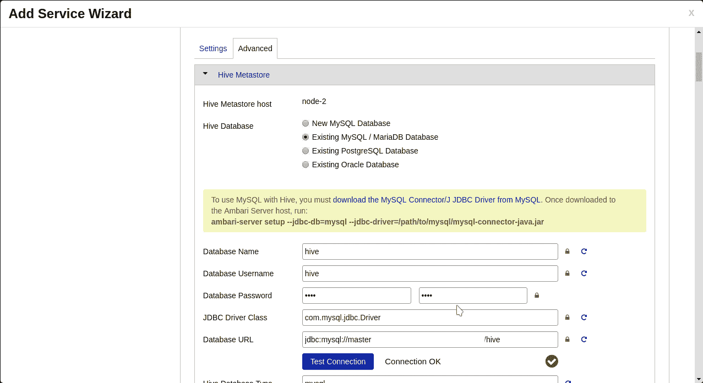
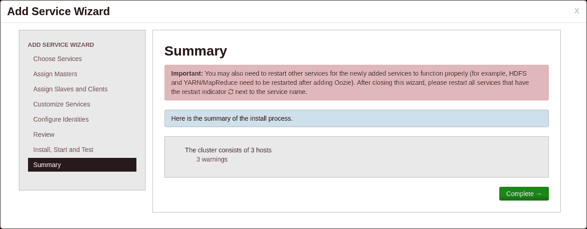
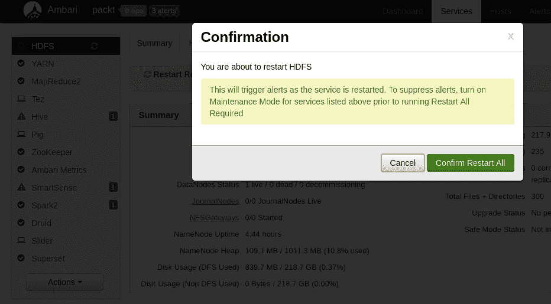
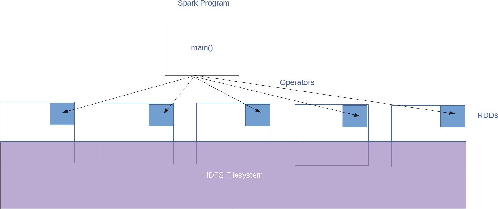

# 大规模数据处理框架

随着数据源的数量和复杂性不断增加，从数据中获取价值也变得越来越困难。自从 Hadoop 诞生以来，它已经构建了一个可大规模扩展的文件系统，HDFS。它采用了来自函数式编程的 MapReduce 概念来应对大规模数据处理挑战。随着技术不断发展以克服数据挖掘带来的挑战，企业也在寻找方法来迎接这些变化以保持领先地位。

在本章中，我们将重点介绍这些数据处理解决方案:

*   MapReduce
*   阿帕奇火花
*   火花 SQL
*   火花流

# MapReduce

MapReduce 是从函数式编程中借用的一个概念。数据处理分为地图阶段和缩减阶段，在地图阶段进行数据准备，在缩减阶段计算实际结果。MapReduce 发挥重要作用的原因是，当数据被分割到多个分布式服务器时，我们可以实现巨大的并行性。如果没有这个优势，MapReduce 就无法真正发挥出色。

让我们举一个简单的例子来理解 MapReduce 在函数式编程中是如何工作的:

*   使用我们选择的映射函数来处理输入数据
*   映射器函数的输出应该处于 reduce 函数可消耗的状态
*   映射器函数的输出被馈送到 reduce 函数，以生成必要的结果

让我们用一个简单的程序来理解这些步骤。该程序使用以下文本(随机创建)作为输入:

```sh
Bangalore,Onion,60
Bangalore,Chilli,10
Bangalore,Pizza,120
Bangalore,Burger,80
NewDelhi,Onion,80
NewDelhi,Chilli,30
NewDelhi,Pizza,150
NewDelhi,Burger,180
Kolkata,Onion,90
Kolkata,Chilli,20
Kolkata,Pizza,120
Kolkata,Burger,160
```

输入由以下字段组成的数据:**城市名称**、**产品名称**、**当日商品价格**。

我们想写一个程序，显示给定城市所有产品的总成本。这可以通过多种方式实现。但是让我们尝试使用 MapReduce 来处理这个问题，看看它是如何工作的。

映射程序是这样的:

```sh
#!/usr/bin/env perl -wl

use strict;
use warnings;

while(<STDIN>) {
    chomp;
    my ($city, $product, $cost) = split(',');
    print "$city $cost";
}
```

减少程序是:

```sh
#!/usr/bin/perl

use strict;
use warnings;

my %reduce;

while(<STDIN>) {
    chomp;
    my ($city, $cost) = split(/\s+/);
    $reduce{$city} = 0 if not defined $reduce{$city};
    $reduce{$city} += $cost;
}

print "-" x 24;
printf("%-10s : %s\n", "City", "Total Cost");
print "-" x 24;

foreach my $city (sort keys %reduce) {
    printf("%-10s : %d\n", $city, $reduce{$city});
}
```

我们使用 UNIX 终端创建了一个数据管道，如下所示:

```sh
[user@node-1 ~]$ cat input.txt | perl map.pl | perl reduce.pl 
------------------------
City : Total Cost
------------------------
Bangalore : 270
Kolkata : 390
NewDelhi : 440
```

我们可以看到，结果是意料之中的。这是一个非常简单的 MapReduce 案例。让我们试着看看发生了什么:

*   每个输入行都由`map.pl`程序处理，并打印城市和价格
*   `map.pl`程序的输出被馈送到`reduce.pl`，它对所有记录执行`SUM()`操作，并按城市对它们进行分类

让我们洗牌`input.txt`看看我们是否得到想要的结果。

下面是修改后的`input.txt`:

```sh
Bangalore,Onion,60
NewDelhi,Onion,80
Bangalore,Pizza,120
Bangalore,Burger,80
Kolkata,Onion,90
Kolkata,Pizza,120
Kolkata,Chilli,20
NewDelhi,Chilli,30
NewDelhi,Burger,180
Kolkata,Burger,160
NewDelhi,Pizza,150
Bangalore,Chilli,10
```

MapReduce 操作的输出是:

```sh
[user@node-1 ~]$ cat input-shuffled.txt | perl map.pl | perl reduce.pl 
------------------------
City : Total Cost
------------------------
Bangalore : 270
Kolkata : 390
NewDelhi : 440
```

没有区别，因为映射和缩减操作都是一次性独立执行的。这里没有数据并行。整个过程可以在该图中可视化:


我们可以看到，**贴图阶段**后有一个输入数据的副本，**还原阶段**后的最终输出才是我们感兴趣的。

运行单线程进程是有用的，当我们不需要处理大量数据时，它是必需的。当输入大小是无界的，无法放入单个服务器时，我们需要开始考虑分布式/并行算法来解决手头的问题。

# Hadoop MapReduce

Apache MapReduce 是一个框架，它使我们更容易在非常大的分布式数据集上运行 MapReduce 操作。Hadoop 的优势之一是分布式文件系统，它支持机架感知和可扩展。Hadoop 作业调度器足够智能，可以确保计算发生在数据所在的节点上。这也是一个非常重要的方面，因为它减少了网络 IO 的数量。

让我们看看这个框架是如何在这个图表的帮助下使大规模并行计算变得更加容易的:


这个图看起来比上一个图复杂一点，但是大部分事情都是 Hadoop MapReduce 框架自己为我们完成的。我们仍然编写映射和减少输入数据的代码。

让我们从上图中详细看看当我们使用 Hadoop MapReduce 框架处理数据时会发生什么:

*   我们的输入数据被分解成几部分
*   每一条数据都被输入到一个映射程序
*   来自所有映射程序的输出被收集、混洗和排序
*   每一个被分类的零件都被输入到减速器程序
*   来自所有减速器的输出被组合以生成输出数据

# 流式 MapReduce

流式 MapReduce 是 Hadoop MapReduce 框架中可用的功能之一，我们可以使用任何外部程序来充当映射器和缩减器。只要这些程序可以由目标操作系统执行，它们就可以运行映射和缩减任务。

在编写这些程序时，需要记住以下几点:

*   这些程序应该从`STDIN`读取输入
*   他们应该能够处理无限量的数据(流)，否则就会崩溃
*   在将这些程序用于流式 MapReduce 之前，应该提前了解它们的内存需求，否则我们可能会看到不可预测的行为

在前一节中，我们已经编写了简单的 Perl 脚本来进行映射和简化。同样在当前场景中，我们将使用相同的程序来理解它们如何执行我们的任务。

If you observe carefully, `map.pl` can process infinite amounts of data and will not have any memory overhead. But the `reduce.pl` program uses the Perl Hash data structure to perform the reduction operation. Here, we might face some memory pressure with real-world data.

在本练习中，我们使用随机输入数据，如下所示:

```sh
[user@node-3 ~]$ cat ./input.txt
 Bangalore,Onion,60
 NewDelhi,Onion,80
 Bangalore,Pizza,120
 Bangalore,Burger,80
 Kolkata,Onion,90
 Kolkata,Pizza,120
 Kolkata,Chilli,20
 NewDelhi,Chilli,30
 NewDelhi,Burger,180
 Kolkata,Burger,160
 NewDelhi,Pizza,150
 Bangalore,Chilli,10
```

稍后，我们需要将映射器和缩减器脚本复制到所有 Hadoop 节点:

We are using the same Hadoop cluster that's built as part of [Chapter 10](11.html), *Production Hadoop Cluster Deployment* for this exercise. If you remember, the nodes are master, `node-1`, `node-2`, and `node-3`.

```sh
[user@master ~]$ scp *.pl node-1:~
[user@master ~]$ scp *.pl node-2:~
[user@master ~]$ scp *.pl node-3:~
```

在这一步中，我们将输入复制到`hadoop /tmp/ directory`。

Please use a sensible directory in your production environments as per your enterprise standards. Here the `/tmp` directory is used for illustration purposes only.

```sh
[user@node-3 ~]$ hadoop fs -put ./input.txt /tmp/
```

在这一步中，我们使用 Hadoop 流式 MapReduce 框架来使用我们的脚本来执行计算:

The contents of the `map.pl` and `reduce.pl` are exactly the same as we have used in the previous examples.

```sh
[user@node-3 ~]$ hadoop jar \
    /usr/hdp/current/hadoop-mapreduce-client/hadoop-streaming.jar \
    -input hdfs:///tmp/input.txt \
    -output hdfs:///tmp/output-7 \
    -mapper $(pwd)/map.pl \
    -reducer $(pwd)/reduce.pl
```

输出存储在 HDFS，我们可以这样查看:

```sh
[user@node-3 ~]$ hadoop fs -cat /tmp/output-7/part*
 NewDelhi, 440
 Kolkata, 390
 Bangalore, 270
[user@node-3 ~]$
```

如果我们仔细观察，结果与我们的传统程序完全匹配。

# Java MapReduce

在前一节中，我们已经看到了如何使用任意编程语言在 Hadoop 上运行 MapReduce 操作。但是在大多数实际场景中，如果我们利用 Hadoop MapReduce 基础架构提供的库是很好的，因为它们功能强大，能够满足我们的许多需求。

让我们尝试使用 MapReduce 库编写一个简单的 Java 程序，看看我们是否能生成与前面练习中相同的输出。在这个例子中，我们将使用来自官方文档的官方 MapReduce 实现。

文档位于:[https://Hadoop . Apache . org/docs/r 2 . 8 . 0/Hadoop-MapReduce-client/Hadoop-MapReduce-client-core/MapReduce tutorial . html](https://hadoop.apache.org/docs/r2.8.0/hadoop-mapreduce-client/hadoop-mapreduce-client-core/MapReduceTutorial.html)

由于我们的输入与示例有很大不同，并且我们还想找到给定城市中所有产品的总价，因此我们必须根据我们的 CSV `input.txt`文件更改映射程序。reduce 函数与官方文档中的函数相同，我们的 mapper 函数会生成一个`<City, Price>`对。这很容易被现有的实现所消耗。

我们已经调用了我们的程序`TotalPrice.java`。让我们看看源代码的样子:

```sh
[user@node-3 ~]$ cat TotalPrice.java 
import java.io.IOException;
import java.util.StringTokenizer;

import org.apache.hadoop.conf.Configuration;
import org.apache.hadoop.fs.Path;
import org.apache.hadoop.io.IntWritable;
import org.apache.hadoop.io.Text;
import org.apache.hadoop.mapreduce.Job;
import org.apache.hadoop.mapreduce.Mapper;
import org.apache.hadoop.mapreduce.Reducer;
import org.apache.hadoop.mapreduce.lib.input.FileInputFormat;
import org.apache.hadoop.mapreduce.lib.output.FileOutputFormat;

public class TotalPrice {
  public static class TokenizerMapper extends Mapper<Object, Text, Text, IntWritable>{
    public void map(Object key, Text value, Context context) throws IOException, InterruptedException {
      StringTokenizer itr = new StringTokenizer(value.toString(), ",");
      Text city = new Text(itr.nextToken());
      itr.nextToken();
      IntWritable price = new IntWritable(Integer.parseInt(itr.nextToken()));
      context.write(city, price);
    }
  }

  public static class IntSumReducer extends Reducer<Text,IntWritable,Text,IntWritable> {
```

```sh
  private IntWritable result = new IntWritable();

    public void reduce(Text key, Iterable<IntWritable> values, Context context) throws IOException, InterruptedException {
      int sum = 0;
      for (IntWritable val : values) {
        sum += val.get();
      }
      result.set(sum);
      context.write(key, result);
    }
  }

  public static void main(String[] args) throws Exception {
    Configuration conf = new Configuration();
    Job job = Job.getInstance(conf, "TotalPriceCalculator");
    job.setJarByClass(TotalPrice.class);
    job.setMapperClass(TokenizerMapper.class);
    job.setCombinerClass(IntSumReducer.class);
    job.setReducerClass(IntSumReducer.class);
    job.setOutputKeyClass(Text.class);
    job.setOutputValueClass(IntWritable.class);
    FileInputFormat.addInputPath(job, new Path(args[0]));
    FileOutputFormat.setOutputPath(job, new Path(args[1]));
    System.exit(job.waitForCompletion(true) ? 0 : 1);
  }
}
```

一旦我们有了源代码，我们需要编译它来创建一个 **Java Archive** ( **JAR** )文件。它以下列方式完成:

```sh
 [user@node-3 ~]$ javac -cp `hadoop classpath` TotalPrice.java 
 [user@node-3 ~]$ jar cf tp.jar TotalPrice*.class
```

一旦我们创建了 JAR 文件，我们就可以使用 Hadoop 命令提交作业来处理`input.txt`，并在`/tmp/output-12`目录中产生输出:

As in the case of streaming MapReduce, we need not copy the source to all the Hadoop servers.

```sh
 [user@node-3 ~]$ hadoop jar tp.jar TotalPrice /tmp/input.txt /tmp/output-12
```

这个运行应该通过 fine，并将产生`/tmp/output-12`目录中的输出文件。我们可以使用以下命令查看输出内容:

```sh
[user@node-3 ~]$ hadoop fs -cat /tmp/output-12/part*
Bangalore       270
Kolkata 390
NewDelhi        440
```

这也与之前的运行完全一致。

正如我们所看到的，Hadoop Mapreduce 框架已经采取了所有必要的步骤来确保整个管道进度保持在其控制范围内，从而为我们提供了期望的结果。

即使我们使用了一个非常简单的数据集进行计算，Hadoop Mapreduce 也能确保无论我们处理的数据大小如何，我们之前编写的相同程序都会产生我们想要的结果。这使得它成为一个非常强大的批处理作业架构。

# 摘要

到目前为止，我们已经看到 Hadoop Mapreduce 是一个强大的框架，它提供了流式和批处理操作模式，以非常简单的指令处理大量数据。尽管 Mapreduce 最初是 Hadoop 中计算框架的选择，但它未能满足市场不断变化的需求，因此开发了新的架构来解决这些问题。在下一节中，我们将学习一个名为 **Apache Spark** 的框架。

# 阿帕奇火花 2

Apache Spark 是一个通用的集群计算系统。它非常适合大规模数据处理。当完全在内存中运行时，它的性能比 Hadoop 高 100 倍，当完全从磁盘运行时，它的性能比 Hadoop 高 10 倍。它有一个复杂的有向无环图执行引擎，支持无环数据流模型。

Apache Spark 拥有用 Java、Scala、Python 和 R 编程语言编写程序的一流支持，以迎合更广泛的受众。它提供了 80 多种不同的运营商来构建并行应用，而不用担心底层基础设施。

Apache Spark 拥有迎合**结构化查询语言**的库，被称为 Spark**SQL**；这支持在使用 ANSI SQL 的程序中编写查询。它还支持计算流数据，这在当今的实时数据处理需求中非常需要，例如为交互式用户体验系统的仪表板供电。Apache Spark 也有**机器学习库**，比如 **Mlib** ，它迎合了运行科学程序的需求。然后它支持为遵循图形数据结构的数据编写程序，称为 **GraphX** 。这使得它成为一个真正强大的框架，支持最先进的计算方式。

Apache Spark 不仅运行在 Hadoop 平台上，还运行在各种系统上，如 Apache Mesos、Kubernetes、Standalone 或 Cloud。这使得今天的企业选择它想要利用这个系统的力量的方式成为一个完美的选择。

在接下来的部分中，我们将了解更多关于 Spark 及其生态系统的信息。我们在本练习中使用的是 Spark 2.2.0。

# 使用安巴里安装火花

从上一章开始，我们有一个正在运行的现有 Ambari 安装。我们将利用相同的安装来增加 Spark 支持。让我们看看如何实现这一点。

# 安巴里管理中的服务选择

一旦我们登录到安巴里管理界面，我们会看到创建的主集群。在这个页面上，我们点击左侧菜单上的操作按钮。它显示如下屏幕。从该菜单中，我们单击添加服务选项:



# 添加服务向导

一旦我们点击添加服务菜单项，我们会看到一个向导，我们必须从安巴里所有支持的服务列表中选择 Spark 2。屏幕如下所示:


服务选择完成后，单击下一步按钮。

# 服务器放置

一旦选择了 Spark 2 服务，其他相关服务也会自动为我们选择，我们可以选择主服务器的位置。我保留默认选择不变:



当更改看起来不错时，单击“下一步”按钮。

# 客户和奴隶选择

在这一步中，我们可以选择作为我们在上一步中选择的主节点的客户端的节点列表。我们还可以选择可以安装客户端实用程序的服务器列表。根据您的选择进行选择:



更改完成后，单击“下一步”按钮。

# 服务定制

由于 Hive 也作为 Spark 2 选择的一部分被安装，我们可以选择定制 Hive 数据源的细节。我在主节点上创建了数据库，用户名为`hive`，密码为`hive`，数据库也为`hive`。在生产中进行更改时，请选择一个强密码。

定制屏幕如下所示:



正确完成更改后，单击下一步。

# 软件部署

在此屏幕中，我们看到了迄今为止所做选择的摘要。单击部署开始在选定的服务器上部署 Spark 2 软件。如果我们觉得我们错过了任何自定义，我们可以随时取消向导并在此步骤中重新开始:


# 火花安装进度

在这一步中，我们将看到 Spark 软件安装的进度及其其他依赖关系。一旦部署了所有内容，我们会看到任何警告和错误的摘要。从下面的屏幕中我们可以看到，在安装过程中遇到了一些警告，这表明一旦向导完成，我们需要重新启动一些服务。别担心，看到这些错误是很正常的。我们将在接下来的步骤中纠正这些错误，以使 Spark 系统成功运行:



单击完成完成向导。

# 服务重新启动和清理

由于在安装过程中出现警告，我们必须重新启动所有受影响的组件。该屏幕显示重启过程:



一旦我们给出一个确认，所有相关的服务将重新启动，我们将有一个成功运行的系统。

这就完成了 Spark 2 在由 Ambari 管理的现有 Hadoop 集群上的安装。在接下来的部分中，我们将了解更多关于 Spark 中各种数据结构和库的信息。

# Apache Spark 数据结构

尽管 Mapreduce 提供了一种处理大量数据的强大方法，但由于以下几个缺点，它受到了限制:

*   缺乏对各种运营商的支持
*   实时数据处理
*   缓存数据结果以加快迭代速度

仅举几个例子。自从 Apache Spark 从头开始构建以来，它一直以非常通用的方式处理大数据计算问题，并为开发人员提供了数据结构，使其更容易表示任何类型的数据，并以更好的方式使用这些数据进行计算。

# 关系数据库、数据框架和数据集

Apache Spark 的核心是被称为 **RDD** 的分布式数据集，也被称为**弹性分布式数据集**。这些是集群中存在的不可变数据集，具有高可用性和容错性。RDD 中的元素可以并行运行，为火花簇提供大量能量。

由于数据已经存在于存储系统中，如 HDFS、关系数据库管理系统、S3 等，因此可以从这些外部数据源轻松创建关系数据库。该应用编程接口还为我们提供了从现有内存数据元素创建关系数据库的能力。

这些关系数据库没有任何预定义的结构。因此，它们可以采取任何形式，并且通过利用 Spark 库中的不同运算符，我们可以编写强大的程序，为我们提供必要的结果，而不必太担心数据的复杂性。

为了满足关系数据库管理系统的需求，数据帧开始发挥作用，其中数据帧可以与关系数据库系统中的表进行比较。我们知道，表有行和列，数据的结构是提前知道的。通过了解数据的结构，可以在数据处理过程中进行一些优化。

Spark 数据集与数据框有些相似。但是它们通过用本地语言对象(Java 和 Scala)支持半结构化数据对象来扩展数据框架的功能。数据帧是具有关系模式语义的不可变对象集合。因为我们处理的是半结构化数据和本地语言对象，所以有一个编码器/解码器系统负责在类型之间自动转换。

下面是一个快速对比图:

| **功能** | **RDDs** | **数据帧** | **数据集** |
| 数据类型 | 非结构化数据 | 结构数据 | 半结构化数据 |
| 模式要求 | 完全自由形式 | 严格的数据类型 | 松散耦合 |
| Spark 提供的优化 | 不需要，因为数据是非结构化的 | 利用优化，因为数据类型是已知的 | 推断的数据类型提供了某种程度的优化 |
| 高级表达式/过滤器 | 因为数据形式本质上是复杂的，所以很难 | 我们可以利用这些，因为我们知道我们正在处理的数据 | 也可以在这里借力 |

# Apache Spark 编程

Apache Spark 有非常好的编程语言支持。它为 Java、Scala、Python 和 R 编程语言提供了一流的支持。尽管编程语言中可用的数据结构和运算符本质上是相似的，但我们必须使用特定于编程语言的结构来实现所需的逻辑。在本章中，我们将使用 Python 作为首选编程语言。然而，Spark 本身对这些编程语言是不可知的，无论使用哪种编程语言，都会产生相同的结果。

使用 Python 的 Apache Spark 可以有两种不同的使用方式。第一种方式是启动`pyspark`交互外壳，帮助我们运行 Python 指令。体验类似于 Python 外壳实用程序。另一种方法是编写可以使用 spark-submit 命令调用的独立程序。为了使用独立的火花程序，我们必须了解火花程序的基本结构:



spark 程序的典型结构由一个主要函数组成，该函数在 RDDs 上执行不同的运算符来生成所需的结果。Spark 库中支持 80 多种不同类型的操作员。在高层次上，我们可以将这些操作符分为两种类型:转换和动作。转换运算符将数据从一种形式转换为另一种形式。操作从数据中生成结果。出于性能原因，为了优化集群中的资源，Apache Spark 实际上在检查点执行程序。每个检查点只有在有操作符时才会到达。这是一件需要记住的重要事情，尤其是如果你是使用 Spark 编程的新手。即使是最高级的程序员有时也会困惑为什么他们没有看到期望的结果，因为他们没有对数据使用任何操作符。

回到前面的图表，我们有一个驱动程序，它有一个主例程，对存储在像 HDFS 这样的文件系统中的数据执行几个动作/转换，并给出我们想要的结果。我们知道 RDDs 是 Spark 编程语言中的基本并行数据存储。Spark 足够智能，可以像 HDFS 一样从种子存储中创建这些 rdd，一旦创建，它就可以将这些 rdd 缓存在内存中，并通过使这些 rdd 容错来使其高度可用。即使 RDD 的拷贝由于节点崩溃而离线，相同 RDDs 上的未来访问也将从最初生成它的计算中快速生成。

# 用于分析的样本数据

为了理解 spark 的编程 API，我们应该有一个样本数据集，在这个数据集上我们可以执行一些操作来获得信心。为了生成这个数据集，我们将从上一章的 employees 数据库中导入示例表。

以下是我们生成该数据集的说明:

登录服务器并切换到 Hive 用户:

```sh
ssh user@node-3
[user@node-3 ~]$ sudo su - hive
```

这将把我们放在一个远程 shell 中，我们可以从 MySQL 数据库转储该表:

```sh
[hive@node-3 ~]$ mysql -usuperset -A -psuperset -h master employees -e "select * from vw_employee_salaries" > vw_employee_salaries.tsv
[hive@node-3 ~]$ wc -l vw_employee_salaries.tsv 
2844048 vw_employee_salaries.tsv
[hive@node-3 ~]$ 
```

接下来，我们应该使用以下命令将文件复制到 Hadoop:

```sh
[hive@node-3 ~]$ hadoop fs -put ./vw_employee_salaries.tsv /user/hive/employees.csv
```

现在，数据准备工作已经完成，我们已成功将其复制到 HDFS。我们可以用 Spark 开始使用这些数据。

# 使用 pyspark 进行交互式数据分析

Apache Spark 发行版附带一个名为 **pyspark** 的交互式外壳。由于我们处理的是像 Python 这样的解释编程语言，所以我们可以在学习的同时编写交互式程序。

如果你还记得，我们已经安装了带有 Apache Ambari 的 Spark。因此，我们必须遵循 Apache Ambari 的标准目录位置来访问 Spark 相关的二进制文件:

```sh
[hive@node-3 ~]$ cd /usr/hdp/current/spark2-client/
[hive@node-3 spark2-client]$ ./bin/pyspark 
Python 2.7.5 (default, Aug  4 2017, 00:39:18) 
[GCC 4.8.5 20150623 (Red Hat 4.8.5-16)] on linux2
Type "help", "copyright", "credits" or "license" for more information.
Setting default log level to "WARN".
To adjust logging level use sc.setLogLevel(newLevel). For SparkR, use setLogLevel(newLevel).
Welcome to
      ____              __
     / __/__  ___ _____/ /__
    _\ \/ _ \/ _ `/ __/  '_/
   /__ / .__/\_,_/_/ /_/\_\   version 2.2.0.2.6.4.0-91
      /_/

Using Python version 2.7.5 (default, Aug  4 2017 00:39:18)
SparkSession available as 'spark'.
>>> 
```

前面的步骤启动了交互式火花外壳。

作为理解 Spark 数据结构的第一步，我们将从 HDFS 加载`employees.csv`文件，并使用以下指令计算文件中的总行数:

```sh
>>> ds = spark.read.text("employees.csv")
>>> ds.count()
2844048                                                                         
>>> 
```

如我们所见，该计数与 Unix shell 上之前的加载操作相匹配。

现在，让我们尝试从文件中加载前五条记录，并尝试查看数据结构对象的模式:

```sh
>>> ds.first()
Row(value=u'emp_no\tbirth_date\tfirst_name\tlast_name\tgender\thire_date\tsalary\tfrom_date\tto_date')
>>> ds.head(5)
[Row(value=u'emp_no\tbirth_date\tfirst_name\tlast_name\tgender\thire_date\tsalary\tfrom_date\tto_date'), Row(value=u'10001\t1953-09-02\tGeorgi\tFacello\tM\t1986-06-26\t60117\t1986-06-26\t1987-06-26'), Row(value=u'10001\t1953-09-02\tGeorgi\tFacello\tM\t1986-06-26\t62102\t1987-06-26\t1988-06-25'), Row(value=u'10001\t1953-09-02\tGeorgi\tFacello\tM\t1986-06-26\t66074\t1988-06-25\t1989-06-25'), Row(value=u'10001\t1953-09-02\tGeorgi\tFacello\tM\t1986-06-26\t66596\t1989-06-25\t1990-06-25')]
>>> ds.printSchema()
root
 |-- value: string (nullable = true)

>>> 
```

正如我们所看到的，即使我们有一个 CSV(制表符分隔的文件)，Spark 已经将该文件读取为由换行符分隔的普通文本文件，并且该模式只包含一个值，该值是字符串数据类型。

在这种操作模式下，我们将每条记录视为一行，我们只能执行几种类型的操作，例如计算给定名称的所有出现次数:

```sh
>>> ds.filter(ds.value.contains("Georgi")).count()
2323                                                                            
>>> 
```

这种操作模式有点类似于日志处理。但是 Spark 真正的力量来自于把数据当作一个有行有列的表，也就是 **DataFrames** 的力量:

```sh
>>> ds = spark.read.format("csv").option("header", "true").option("delimiter", "\t").load("employees.csv")
>>> ds.count()
2844047   
```

```sh
>>> ds.show(5)
+------+----------+----------+---------+------+----------+------+----------+----------+
|emp_no|birth_date|first_name|last_name|gender| hire_date|salary| from_date|   to_date|
+------+----------+----------+---------+------+----------+------+----------+----------+
| 10001|1953-09-02|    Georgi|  Facello|     M|1986-06-26| 60117|1986-06-26|1987-06-26|
| 10001|1953-09-02|    Georgi|  Facello|     M|1986-06-26| 62102|1987-06-26|1988-06-25|
| 10001|1953-09-02|    Georgi|  Facello|     M|1986-06-26| 66074|1988-06-25|1989-06-25|
| 10001|1953-09-02|    Georgi|  Facello|     M|1986-06-26| 66596|1989-06-25|1990-06-25|
| 10001|1953-09-02|    Georgi|  Facello|     M|1986-06-26| 66961|1990-06-25|1991-06-25|
+------+----------+----------+---------+------+----------+------+----------+----------+
only showing top 5 rows

>>> 
```

```sh
>>> ds.printSchema()
root
 |-- emp_no: string (nullable = true)
 |-- birth_date: string (nullable = true)
 |-- first_name: string (nullable = true)
 |-- last_name: string (nullable = true)
 |-- gender: string (nullable = true)
 |-- hire_date: string (nullable = true)
 |-- salary: string (nullable = true)
 |-- from_date: string (nullable = true)
 |-- to_date: string (nullable = true)

>>> 
```

现在，我们可以看到 Spark 已经自动将输入的 CSV 文本转换为数据帧。但所有字段都被视为字符串。

让我们尝试使用 spark 的模式推断功能来自动查找字段的数据类型:

```sh
>>> ds = spark.read.format("csv").option("header", "true").option("delimiter", "\t").option("inferSchema", "true").load("employees.csv")
18/03/25 19:21:15 WARN FileStreamSink: Error while looking for metadata directory.
18/03/25 19:21:15 WARN FileStreamSink: Error while looking for metadata directory.
>>> ds.count()                                                                  
2844047                                                                         
>>> ds.show(2)
+------+-------------------+----------+---------+------+-------------------+------+-------------------+-------------------+
|emp_no|         birth_date|first_name|last_name|gender|          hire_date|salary|          from_date|            to_date|
+------+-------------------+----------+---------+------+-------------------+------+-------------------+-------------------+
| 10001|1953-09-02 00:00:00|    Georgi|  Facello|     M|1986-06-26 00:00:00| 60117|1986-06-26 00:00:00|1987-06-26 00:00:00|
| 10001|1953-09-02 00:00:00|    Georgi|  Facello|     M|1986-06-26 00:00:00| 62102|1987-06-26 00:00:00|1988-06-25 00:00:00|
+------+-------------------+----------+---------+------+-------------------+------+-------------------+-------------------+
only showing top 2 rows

>>> ds.printSchema()
root
 |-- emp_no: integer (nullable = true)
 |-- birth_date: timestamp (nullable = true)
 |-- first_name: string (nullable = true)
 |-- last_name: string (nullable = true)
 |-- gender: string (nullable = true)
 |-- hire_date: timestamp (nullable = true)
 |-- salary: integer (nullable = true)
 |-- from_date: timestamp (nullable = true)
 |-- to_date: timestamp (nullable = true)

>>> 
```

现在我们可以看到，所有字段都有一个最接近 MySQL 表定义的正确数据类型。

我们可以对数据应用简单的操作来查看结果。让我们试着找出男性记录总数:

```sh
>>> ds.filter(ds.gender == "M").count()
1706321 
```

此外，尝试找到工资超过 10 万美元的男性记录:

```sh
>>> ds.filter(ds.gender == "M").filter(ds.salary > 100000).count()
57317   
```

就这么简单，对吧？在官方的 Spark 文档中，有更多的操作符可供探索。

# 带火花的独立应用程序

在前一节中，我们已经看到了如何使用交互外壳`pyspark`来学习 Spark Python API。在本节中，我们将编写一个简单的 Python 程序，在 Spark 集群上运行。在现实场景中，这是我们在 Spark 集群上运行应用程序的方式。

为了做到这一点，我们将编写一个名为`MyFirstApp.py`的程序，内容如下:

```sh
[hive@node-3 ~]$ cat MyFirstApp.py 
from pyspark.sql import SparkSession

# Path to the file in HDFS
csvFile = "employees.csv"

# Create a session for this application
spark = SparkSession.builder.appName("MyFirstApp").getOrCreate()

# Read the CSV File
csvTable = spark.read.format("csv").option("header", "true").option("delimiter", "\t").load(csvFile)

# Print the total number of records in this file
print "Total records in the input : {}".format(csvTable.count())

# Stop the application
spark.stop()
[hive@node-3 ~]$ 
```

为了在 Spark 集群上运行这个程序，我们必须使用 spark-submit 命令，它在调度和协调整个应用程序生命周期方面做了必要的工作:

```sh
[hive@node-3 ~]$ /usr/hdp/current/spark2-client/bin/spark-submit ./MyFirstApp.py 2>&1 | grep -v -e INFO -e WARN
Total records in the input : 2844047
```

正如预期的那样，这些是我们的输入文件中的记录总数(不包括标题行)。

# 火花流应用

spark 的强大功能之一是构建处理实时流数据并产生实时结果的应用程序。为了更好地理解这一点，我们将编写一个简单的应用程序，试图在输入流中找到重复的消息，并打印所有唯一的消息。

当我们处理不可靠的数据流，并且我们只想提交唯一的数据时，这种应用程序很有帮助。

这里给出了这个应用程序的源代码:

```sh
[hive@node-3 ~]$ cat StreamingDedup.py 
from pyspark import SparkContext
from pyspark.streaming import StreamingContext

context = SparkContext(appName="StreamingDedup")
stream = StreamingContext(context, 5)

records = stream.socketTextStream("localhost", 5000)
records
    .map(lambda record: (record, 1))
    .reduceByKey(lambda x,y: x + y)
    .pprint()

ssc.start()
ssc.awaitTermination()
```

在这个应用程序中，我们连接到端口`5000`上的远程服务，该服务在其自己的页面上发送消息。程序每 5 秒钟总结一次操作结果，如`StreamingContext`参数所定义。

现在，让我们使用 UNIX netcat 命令(`nc`)和一个简单的循环来启动一个简单的 TCP 服务器:

```sh
for i in $(seq 1 10)
do
  for j in $(seq 1 5)
  do
   sleep 1
   tail -n+$(($i * 3)) /usr/share/dict/words | head -3
  done
done | nc -l 5000

```

之后，将我们的计划提交给 spark cluster:

```sh
[hive@node-3 ~]$ /usr/hdp/current/spark2-client/bin/spark-submit ./StreamingDedup.py 2>&1 | grep -v -e INFO -e WARN
```

程序启动后，我们会看到以下输出:

```sh
-------------------------------------------
Time: 2018-03-26 04:33:45
-------------------------------------------
(u'16-point', 5)
(u'18-point', 5)
(u'1st', 5)

-------------------------------------------
Time: 2018-03-26 04:33:50
-------------------------------------------
(u'2', 5)
(u'20-point', 5)
(u'2,4,5-t', 5)
```

我们看到每个单词都有正好 5 作为计数，这是预期的，因为我们在 Unix 命令循环中打印了五次。

借助这个图表，我们可以理解这一点:


**输入流**产生连续的数据流，由**火花程序**实时消耗。之后，通过消除重复项来打印结果

如果我们按照时间顺序来看，从时间零点到时间五秒( **T0** - **T5** )的数据被处理，结果可以在 **T5** 时间获得。其他时间段也一样。

在这个简单的例子中，我们刚刚学习了如何使用 Spark Streaming 构建实时应用程序的基础知识。

# 火花 SQL 应用程序

使用 Spark 编写应用程序时，开发人员可以选择在结构化数据上使用 SQL 来获得所需的结果。一个例子让我们更容易理解如何做到这一点:

```sh
[hive@node-3 ~]$ cat SQLApp.py 
from pyspark.sql import SparkSession

# Path to the file in HDFS
csvFile = "employees.csv"

# Create a session for this application
spark = SparkSession.builder.appName("SQLApp").getOrCreate()

# Read the CSV File
csvTable = spark.read.format("csv").option("header", "true").option("delimiter", "\t").load(csvFile)
csvTable.show(3)

# Create a temporary view
csvView = csvTable.createOrReplaceTempView("employees")

# Find the total salary of employees and print the highest salary makers
highPay = spark.sql("SELECT first_name, last_name, emp_no, SUM(salary) AS total FROM employees GROUP BY emp_no, first_name, last_name ORDER BY SUM(salary)")

# Generate list of records
results = highPay.rdd.map(lambda rec: "Total: {}, Emp No: {}, Full Name: {} {}".format(rec.total, rec.emp_no, rec.first_name, rec.last_name)).collect()

# Show the top 5 of them
for r in results[:5]:
    print(r)

# Stop the application
spark.stop()
[hive@node-3 ~]$ 
```

在这个例子中，我们从`employees.csv`构建一个数据框架，然后在内存中创建一个名为**员工**的视图。稍后，我们可以使用 ANSI SQL 来编写和执行查询，以生成必要的结果。

由于我们有兴趣找到收入最高的员工，结果如预期所示:

```sh
[hive@node-3 ~]$ /usr/hdp/current/spark2-client/bin/spark-submit ./SQLApp.py 2>&1 | grep -v -e INFO -e WARN
[rdd_10_0]
+------+----------+----------+---------+------+----------+------+----------+----------+
|emp_no|birth_date|first_name|last_name|gender| hire_date|salary| from_date|   to_date|
+------+----------+----------+---------+------+----------+------+----------+----------+
| 10001|1953-09-02|    Georgi|  Facello|     M|1986-06-26| 60117|1986-06-26|1987-06-26|
| 10001|1953-09-02|    Georgi|  Facello|     M|1986-06-26| 62102|1987-06-26|1988-06-25|
| 10001|1953-09-02|    Georgi|  Facello|     M|1986-06-26| 66074|1988-06-25|1989-06-25|
+------+----------+----------+---------+------+----------+------+----------+----------+
only showing top 3 rows

Total: 40000.0, Emp No: 15084, Full Name: Aloke Birke
Total: 40000.0, Emp No: 24529, Full Name: Mario Antonakopoulos
Total: 40000.0, Emp No: 30311, Full Name: Tomofumi Coombs
Total: 40000.0, Emp No: 55527, Full Name: Kellyn Ouhyoung
Total: 40000.0, Emp No: 284677, Full Name: Richara Eastman
```

正如我们所看到的，Apache Spark 提供的简化的应用编程接口使得在 CSV 数据的基础上编写 SQL 查询变得更加容易(不需要关系数据库管理系统)，以获得我们想要的东西。

# 摘要

在本章中，您了解了大规模数据处理框架的基本概念，并了解到 spark 的强大功能之一是构建处理实时流数据并产生实时结果的应用程序。

在接下来的几章中，我们将讨论如何使用 Elasticsearch 堆栈构建实时数据搜索管道。