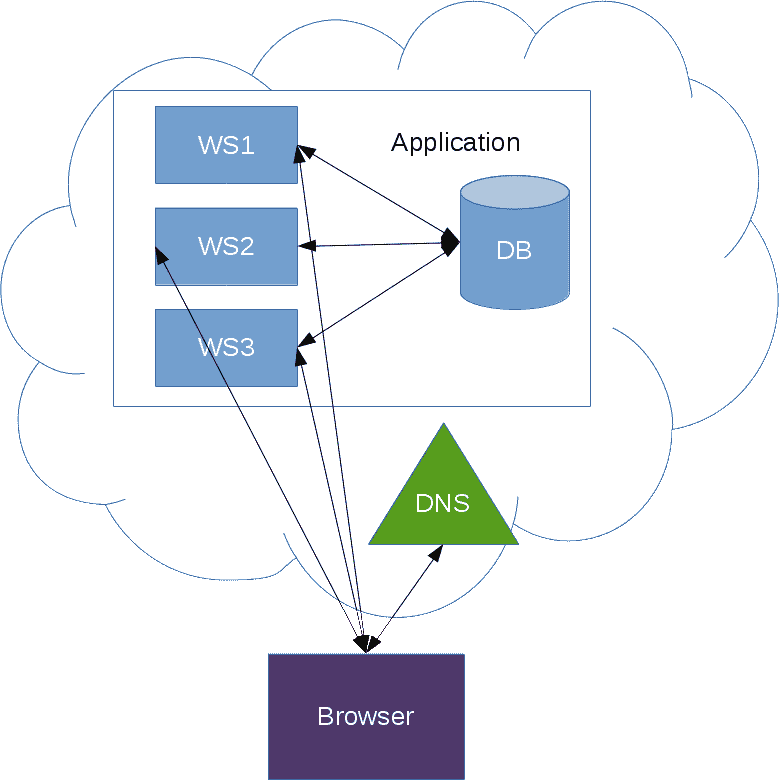
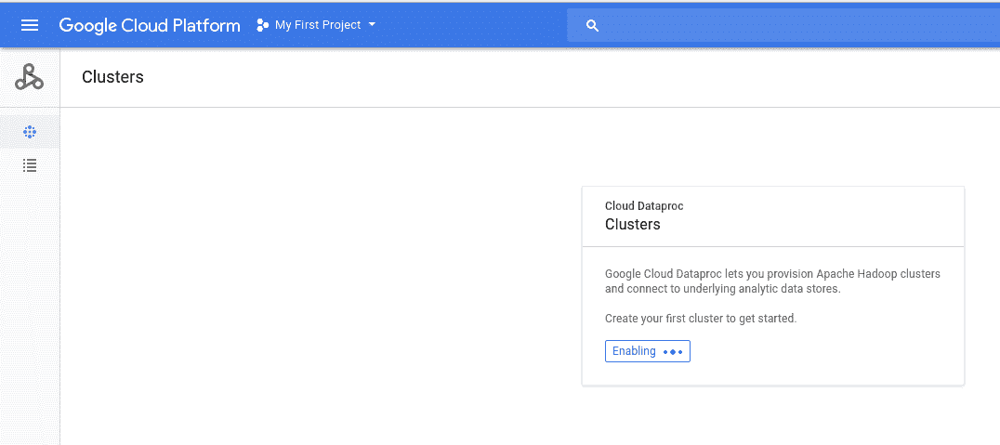
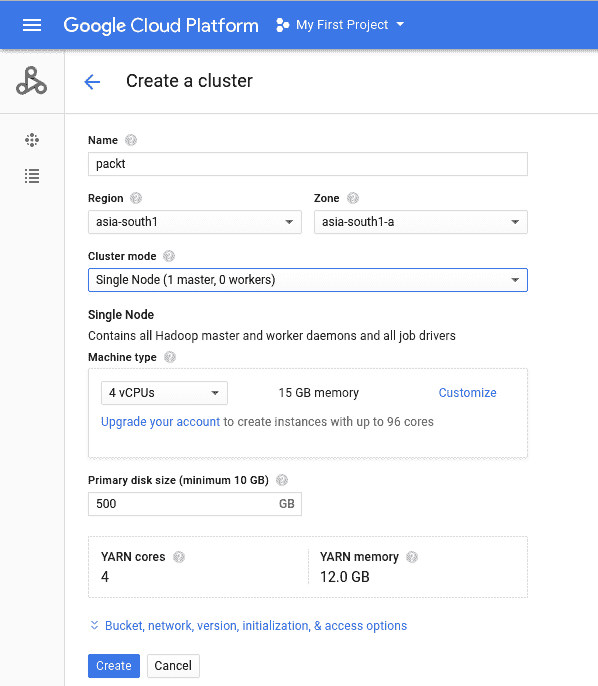
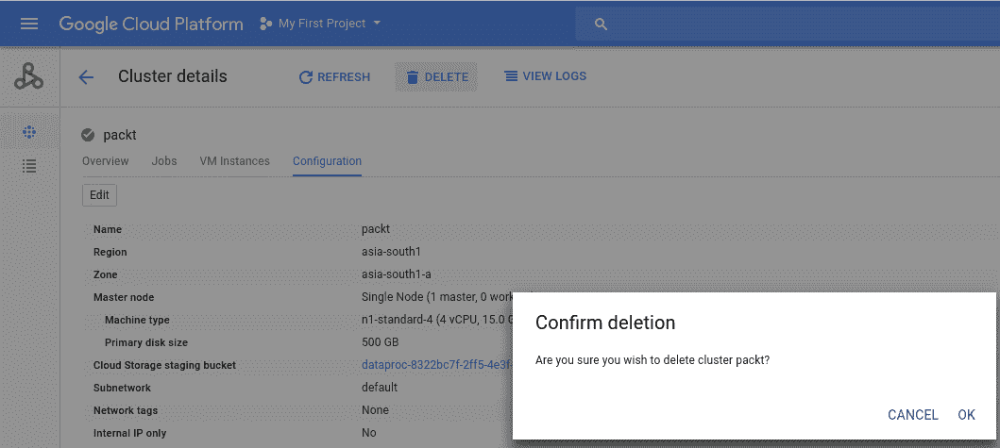
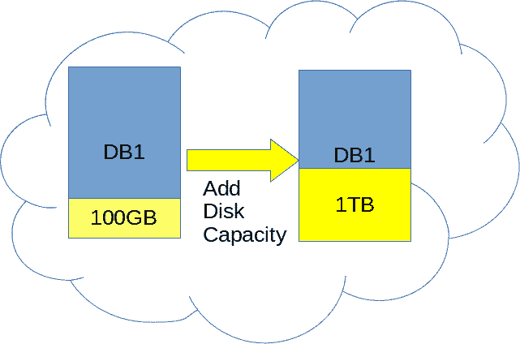

# 十、使用云开发应用

在计算的早期，CPU 能力和存储非常匮乏，因此购买相关设备的成本非常高。随着 80 年代初苹果和微软在个人计算发展方面的进步，越来越多的个人和组织获得了这些计算设备。随着行业发展芯片制造方式，数十亿(如果不是数万亿)个晶体管被放在单个芯片上，这些计算设备的尺寸已经大幅缩小，从占据整个房间到在数据中心包含单个机架单元。当计算速度和存储设备容量开始增加时，个人和企业开始意识到高效管理其计算资源正在成为一项挑战。

互联网的广泛使用也对个人如何获取资源做出了重大贡献。

在本章中，我们将涵盖以下主题:

*   什么是云？
*   云中可用的技术
*   规划云基础设施
    *   云中的高可用性
    *   云中的业务连续性规划
    *   云中的安全性
*   在云中构建 Hadoop 集群
*   云和内部应用
*   云中的数据访问

# 什么是云？

云计算，简称 Cloud，是一种在互联网上租用和使用电子存储空间、计算能力、网络带宽、IP 地址、数据库、网络服务器等资源的简单方式。云推动了*按使用付费*模式，即客户只为这些资源的使用付费，就像电网为其客户的电力消耗付费一样。

云计算已经改变了个人和组织在互联网上访问和管理其服务器和应用的方式。在云计算出现之前，每个人都习惯在自己的场所或专用数据中心管理自己的服务器和应用。单个芯片上多核计算的原始计算能力(中央处理器和图形处理器)的增加以及存储空间(硬盘和固态硬盘)的增加给有效利用可用计算资源带来了挑战。

# 云中可用的技术

随着云计算应用的增加，企业已经开始构建各种技术，并将其提供给消费者。我们将浏览率先推出云产品的组织列表，以及它们提供的不同类型的技术。

以下是提供云服务的公司列表:

*   Microsoft Azure (Azure)
*   亚马逊网络服务
*   谷歌云平台
*   国际商用机器公司
*   销售队伍
*   精力
*   神谕
*   VMware

正在以下列形式向消费者提供各种类型的资源:

*   平台即服务
*   基础设施即服务
*   软件即服务
*   后端即服务
*   网络即服务

随着此类产品的增加，许多组织无需关注基础设施，如房地产、服务器、防火墙、负载平衡器、交换机、电源等。但是他们可以从云提供商那里购买这些服务，然后专注于他们正在构建的应用。

现在，让我们看看顶级提供商微软、亚马逊和谷歌提供了哪些技术:

| **技术** | **蔚蓝** | **亚马逊网络服务** | **谷歌云** | **描述** |
| 服务器 | Azure 计算 | 亚马逊 EC2 | **谷歌计算引擎** ( **GCE** ) | 这项技术旨在提供随需应变的服务器，这些服务器可以是虚拟化的，也可以是专用/裸机的。 |
| 储存；储备 | 天蓝色存储 | 亚马逊 EBS | 谷歌存储 | 这是按需存储，可以根据需要连接到计算节点。一些供应商提供了按需扩展这些存储设备大小的能力。 |
| 网络 | Azure 网络 | 是 | 谷歌网络服务 | 提供商根据应用的网络要求提供 100 Mbps 至 10 Gbps 的网络带宽。 |
| 数据库 | Azure 数据库 | 亚马逊无线电数据系统 | 谷歌云 SQL | 对于托管数据库，我们不需要担心数据库服务器的维护，因为供应商会自动处理对这些服务器的支持。请记住，在某些情况下，我们需要为自己规划高可用性。 |
| 内容交付 | 天蓝色 CDN | 亚马逊云前线 | 谷歌云 CDN | 如果我们想通过利用交付网络将静态资产推给用户，这将非常有帮助，因为它可以显著降低延迟。我们还可以将它用作私有存储来存储所有文件，如备份、会议记录等。 |
| **域名系统** ( **域名系统**) | DNA 蓝色 | 亚马逊 S3 路线 | 谷歌云域名系统 | 域名系统对于在互联网上运行我们的应用至关重要。这项服务让我们的生活变得更加轻松，因为它让我们的服务器可以被基础设施的其他部分访问，而不必运行我们自己的 DNS 服务器。 |
| 业务邮件 | 微软 o365 | 亚马逊工作邮件 | 谷歌邮件 | 对于要求以安全和可扩展的方式访问电子邮件和日历的组织来说，这是必须的。 |
| 机器学习 | Azure AI +机器学习 | 亚马逊机器学习 | 谷歌 ML 引擎 | 机器学习技术已经成为这些天的流行语。供应商提供了几种与机器学习相关的技术，因为我们只需关注我们需要做什么，而不必担心运行这些算法所需的基础设施。 |
| **分布式拒绝服务** ( **分布式拒绝服务**)保护 | 天蓝色分布式拒绝服务保护 | 自动气象站防护罩 | – | 对于那些无法承受服务宕机的组织来说，这是一件非常重要的事情，当大规模拒绝服务攻击发生时，会影响网站的常规访问者。 |
| 监视 | 天蓝色监视器 | 亚马逊云观测 | 谷歌监控 | 如果不监控我们的应用和基础架构，我们将无法看到我们的表现。这些服务有助于我们保持业务正常运行，并对触发我们在云上运行的应用和基础架构宕机的事件做出响应。 |
| 容器 | **蔚蓝集装箱服务** ( **AKS** ) | **亚马逊库本内特弹性集装箱服务** ( **亚马逊 EKS** ) | 谷歌库比厄引擎 | 这是一种基础架构，允许您将应用作为容器运行，而不是拥有完整的计算环境来运行它们。 |

# 规划云基础架构

传统组织有自己的 IT/基础架构团队来管理其专用服务器和网络。在规划向云的迁移时，我们必须牢记以下事项，以提高基础架构的可操作性。

规划云基础架构涉及:

*   专用或共享服务器
*   高可用性
*   业务连续性规划
*   安全
*   网络体系结构

# 专用服务器与共享服务器

云提供商让您可以选择租赁完全拥有物理硬件的服务器，或者与我们这样的其他云用户共享物理硬件。为了对此做出决定，我们需要了解这些模型的优缺点。

# 专用服务器

这些类型的服务器的所有权属于单个用户或组织，不与任何其他用户共享。这种设置有以下几个优点:

*   我们完全拥有物理服务器，我们分配的任何其他服务器都将在相同的硬件上进行配置
*   对于这种设置，我们可能会收取更多的费用
*   有了幽灵和熔毁，我们得到了更好的保护，因为硬件不与任何人共享
*   我们不受邻居的影响，因为我们完全拥有硬件

# 共享服务器

对于简单的实验来说，拥有一台完整的服务器是昂贵的。在这种情况下，我们可以采用共享设置，在给定的物理硬件中租用一些资源。共享服务器的一些优势如下:

*   我们只对按需租用的虚拟服务器收费。
*   尽管云供应商提供了绝对的隔离，但有了 Spectre 和 flush，我们需要小心一点。
*   比专用服务器更容易调配。

# 高可用性

根据我们计划运行的应用类型，我们必须了解供应商就正常运行时间为这些应用提供的**服务级别协议** ( **SLA** )，并且我们需要相应地计划我们的应用。

让我们看一下使用 DNS 实现应用高可用性的简单方法:

在此设计中，会发生以下情况:

*   当用户试图使用谷歌浏览器或火狐浏览器连接到我们的网站时，它首先会尝试联系域名系统服务器
*   DNS 服务器知道我们的前端服务器，并返回所有服务器的列表
*   浏览器将直接连接到前端服务器
*   前端服务器连接到数据库并返回请求的资源

在这个设计中，我们需要记住以下几点:

*   前端服务器直接暴露在互联网中，因此我们应该采取适当的安全措施，例如防火墙或 DDos 保护来保护我们的服务器
*   这些前端服务器也应该安装最新的操作系统软件，以便防止任何攻击
*   数据库服务器不应该对外界可见，因此应该有一个适当的防火墙来允许来自前端服务器的请求

Cloud providers provide a private IP address. In order to minimize the risk of DB servers being accidentally exposed to the internet, we should block the public internet access to these servers.

让我们来看看另一种设计，它也能保护我们的网络服务器免受互联网攻击:

在本设计中，与之前的设计相比，我们做了以下更改:

*   当**浏览器**联系 **DNS** 服务器连接到我们的网站时， **DNS** 服务器提供**负载均衡器**(**LB**)/代理服务器的 IP 地址
*   浏览器连接到这个 **LB**
*   **LB** 跟踪哪些后端服务器可用，然后将请求转发给服务器:
    *   服务器与**数据库** ( **数据库**)对话，并完成响应的构建
    *   响应被发送回 **LB**
*   **LB** 向**浏览器**发送响应

如果我们仔细观察这个设计，我们会发现这些是优于前一个设计的优点:

*   **LB** 隐藏了我们的基础设施，因此外人无法轻易知道我们的基础设施中有多少台服务器
*   **LB** 保护我们的网络服务器免受多种攻击
*   **LB** 可以进行 SSL 卸载，所有的流量加密/解密都发生在 **LB** 级别，我们的服务器可以免除 SSL 开销

Depending on the security policy of the organization, you might need to enable SSL on the web servers as well.

# 业务连续性规划

**业务连续性规划** ( **BCP** )是组织处于成长阶段时需要考虑的一件非常重要的事情。网络、服务器或数据库或任何其他云基础架构组件的任何宕机都可能导致整个业务瘫痪。

在规划 BCP 时，有几件关键的事情要记住:

*   基础设施不可用
*   天灾
*   商业数据

# 基础设施不可用

如果云提供商提供的服务出现计划外停机，我们所有的服务都会随之中断。为了最大限度地提高我们业务的可用性，我们需要在另一个地理区域建立备份设置。对于一些组织来说，这可能是昂贵的，因为整个设置将被复制，但是为了业务连续性，这是规划云基础架构时要考虑的一个重要特性。

# 天灾

地震、洪水、火灾等事件很难预测。因此，我们需要制定必要的计划来保持我们的业务运行，这取决于我们的服务器在云上的位置，以及供应商在构建数据中心时遵循的技术标准。

# 商业数据

业务数据以多种形式存在，并以文件、数据库服务器和大数据系统的形式存储。对于 BCP，我们需要仔细分析我们可以计划在哪些其他远程位置保留我们的数据副本，并进行测试运行，看看我们的应用是否可以通过单击一个按钮从任何一个地理位置无缝运行。

当我们在这里处理多个地理位置时，我们需要了解，当数据量巨大时，将数据从一个数据中心复制到另一个数据中心需要时间。我们的应用也必须重新设计，以防我们在最初的设计中没有考虑 BCP。

# BCP 设计范例

此图试图解释我们如何通过在多个数据中心设置相同的应用来实现 BCP:

该系统可以是:

*   霍特
*   冷热

# 热-热系统

在 Hot-Hot 系统中，两个数据中心同时处于活动状态，为用户的流量提供服务。这里，我们采用了几种 CDN 和地理定位技术来将用户路由到给定的数据中心。

我们在这样做时面临的挑战是，如果一个区域完全空白，另一个区域应该有足够的空间来确保另一个区域的流量被吸收

使用该系统的优点是用户体验良好，因为在该设计中，用户被路由到最近的系统

# 冷热系统

在此系统/设计中，任何时候都只有一个区域处于活动状态，只有在 BCP(业务连续性规划)的情况下，我们才会回到另一个区域。

我们在使用该系统时面临的挑战如下:

*   在问题出现之前，很容易忘记另一个地区；持续同步使用两个区域以及数据和软件是非常重要的。
*   由于只有一个区域处于活动状态，因此必须考虑好用户到另一个数据中心的正确故障转移

使用该系统的优点是所有的写操作都发生在一个区域，这使得数据库设计变得简单。

# 安全

当您考虑迁移到云时，安全性非常重要。以下是需要记住的事情:

*   服务器安全性
*   应用安全
*   网络安全性
*   单点登录
*   AAA 要求

# 服务器安全性

当我们谈论云时，我们将永远无法物理访问服务器(除非我们获得云供应商的许可)。在这种情况下，我们必须了解云提供商遵循什么级别的策略和实践来确保我们的应用将在其上运行的服务器的物理安全。

例如，政府在考虑迁移到云时可能需要一整套不同的物理安全限制。同样，有几个标准，如 PCI 和 HIPAA，在这个模型上执行更强的规则。

如果我们的业务需要遵守这些标准，我们需要选择支持所有这些标准的云变体。

# 应用安全

在云上，我们可以选择自己托管应用，也可以使用作为服务提供的应用**软件即服务** ( **SaaS** )。如果我们在自己调配的服务器(专用或共享)上托管应用，我们需要在服务器级别实施正确的防火墙规则，以及正确的用户访问规则，以确保我们的软件只允许经过授权和正确身份验证的用户。

如果应用是内部的，我们应该确保我们的员工获得 2FA 或 3FA 方法来登录这些服务。

# 网络安全性

为了保护我们在云上的服务器，我们需要实施适当的防火墙规则、域名系统区域，甚至拥有自己的虚拟专用网络，以确保我们的所有资产不会受到损害并暴露在互联网上。

云是互联网的代名词，对我们的数据和基础设施构成持续威胁。除非我们实施适当的安全措施，否则任何人都可以从我们的系统中随意获取任何东西。

# 单点登录

**单点登录** ( **单点登录**)已经受到在云上为各个部门使用多个应用的组织的欢迎。最近，组织已经停止构建自己的应用来运行业务，而是开始采用其他服务。当此类应用的数量增加时，这些应用的用户不断面临在所有这些网站中输入用户名和密码的挑战。

为了提供无缝的浏览体验，同时遵守企业安全标准，许多提供商实现了 OAuth 和 SAML，因为它们是行业公认的。

这些单点登录/身份提供者与公司员工数据库集成，进一步吸收企业的云应用，如下图所示:

本设计试图解释组织如何利用身份提供者来利用单点登录:

*   组织与身份提供者共享员工和组织的详细信息:
    *   密码可以共享，也可以不共享，因为如果出现漏洞，可能会危及整个组织
    *   单点登录系统可以对员工强制使用自己的密码
*   当用户尝试打开组织中的任何应用时，它会将用户重定向到单点登录提供程序
*   单点登录提供程序完成身份验证，并与应用共享必要的凭据
*   应用基于来自单点登录的反馈授权用户
*   应用打开用户特定的细节，然后用户可以与应用交互

现在，这些单点登录的最大优势是，一旦用户与系统建立了会话，他们就可以登录到其他公司批准的应用，而无需进一步登录。

与单点登录提供商互动时，保密性是最大的挑战，因此组织应该仔细评估并选择符合其安全要求的正确解决方案。

# AAA 要求

谈到安全性，重要的是要理解遵循 AAA 标准的应用将解决企业面临的许多挑战。

美国汽车协会标准涉及:

*   证明
*   批准
*   审计

**认证**确保用户的身份被正确验证。

**授权**根据公司政策，进一步控制是否允许给定用户访问某些资源。

**审核**确保所有访问和使用资源的尝试都得到跟踪，这也可以用于任何调查，并提供适当的会计和计费(如果需要)。

通过遵循这些最佳实践，我们可以确保事情在大范围内顺利进行。

# 在云中构建 Hadoop 集群

我们之前看到，云提供了一种灵活且简单的方法来租用资源，如服务器、存储、网络等。云让消费者可以很容易地使用现收现付模式，但是云的许多复杂性被提供商隐藏了起来。

为了更好地理解 Hadoop 是否非常适合在云上，让我们尝试进一步挖掘，看看云是如何在内部组织的。

云的核心是以下机制:

*   大量具有各种硬件配置的服务器
*   通过 IP 网络连接并可用的服务器
*   托管这些设备的大型数据中心
*   跨地理位置的数据中心，具有演进的网络和数据中心设计

如果我们密切关注，我们正在谈论以下内容:

*   大量不同的中央处理器架构
*   速度和性能各不相同的大量存储设备
*   具有不同速度和互连性的网络

让我们看一下这样一个云上数据中心的简单设计:

在上图中，我们有以下设备:

*   **S1****S2**:机架式交换机
*   **U1-U6** :机架式服务器
*   **R1** :路由器
*   存储区域网络
*   网络附加存储

正如我们所看到的，云提供商拥有大量这样的体系结构，以使它们具有可扩展性和灵活性。

您应该已经正确地猜到，当这种服务器的数量增加时，当我们请求新的服务器时，提供商可以将服务器分配到该区域的任何地方。

这使得计算和存储在一起有点困难，但也提供了弹性。

为了解决这一同地问题，一些云提供商提供了创建虚拟网络和使用专用服务器的选项，然后在这些服务器上分配他们的所有虚拟节点。这在某种程度上更接近数据中心设计，但足够灵活，可以在不需要时返还资源。

让我们回到 Hadoop，并提醒自己，为了从 Hadoop 系统中获得最佳效果，我们应该让 CPU 功率更接近存储。这意味着中央处理器和存储器之间的物理距离应该更小，因为总线速度与处理要求相匹配。

中央处理器和存储之间的输入/输出速度越慢(例如，iSCSI、存储区域网络、网络连接存储等)，我们从 Hadoop 系统获得的性能就越差，因为数据是通过网络获取的，保存在内存中，然后馈送给中央处理器进行进一步处理。

这是在云上设计 Hadoop 系统时需要记住的重要事情之一。

除了性能原因，还有其他需要考虑的因素:

*   扩展 Hadoop
*   管理 Hadoop
*   保护 Hadoop

现在，让我们尝试了解如何在云环境中处理这些问题。

在前几章中，我们看到可以通过以下方法安装 Hadoop:

*   单独的
*   半分布式
*   全分布式

当我们想要在云上部署 Hadoop 时，我们可以使用以下方式进行部署:

*   自定义外壳脚本
*   云自动化工具(Chef、Ansible 等)
*   Apache人 Ambari
*   云供应商提供的方法
    *   谷歌云数据平台
    *   亚马逊 EMR
    *   Microsoft HDInsight
*   第三方管理的 Hadoop
    *   Cloudera
*   与云无关的部署
    *   Apache呼尔

# 谷歌云数据平台

在本节中，我们将学习如何使用谷歌云数据块来设置单节点 Hadoop 集群。

这些步骤可以分为以下几个部分:

1.  获得谷歌云帐户。
2.  激活谷歌云数据鹏服务。
3.  创建新的 Hadoop 集群。
4.  登录到 Hadoop 集群。
5.  正在删除 Hadoop 集群。

# 获得谷歌云账户

本节假设您已经有一个谷歌云帐户。

# 激活谷歌云数据鹏服务

登录谷歌云控制台后，您需要访问云数据鹏服务。激活屏幕如下所示:

# 创建新的 Hadoop 集群

一旦在项目中启用了数据块，我们就可以点击创建来创建一个新的 Hadoop 集群。

之后，我们会看到另一个屏幕，需要在其中配置集群参数:

我把大部分东西都保留了默认值。稍后，我们可以点击创建按钮，为我们创建一个新的集群。

# 登录到群集

成功创建集群后，我们将自动进入集群列表页面。从那里，我们可以启动一个 SSH 窗口来登录我们创建的单节点集群。

SSH 窗口如下所示:

如您所见，Hadoop 命令对我们来说是现成的，我们可以运行任何标准的 Hadoop 命令来与系统交互。

# 删除群集

要删除集群，请单击删除按钮，它将显示一个确认窗口，如下图所示。此后，群集将被删除:

看起来很简单，对吧？是的。云提供商让用户使用云变得非常简单，并且只为使用付费。

# 云中的数据访问

云已经成为存储个人数据和业务数据的重要目的地。根据数据的重要性和保密要求，组织已经开始使用云来存储他们的重要数据集。

下图试图总结典型企业的各种访问模式，以及它们如何利用云来存储数据:

云提供商提供不同种类的存储。让我们看看这些类型是什么:

*   块存储器
*   基于文件的存储
*   加密存储
*   离线存储

# 块存储器

当我们希望与计算服务器一起使用这种存储，并希望通过主机操作系统管理存储时，这种类型的存储非常有用。

为了更好地理解这一点，这种类型的存储相当于我们购买笔记本电脑/MacBook 时附带的硬盘/固态硬盘。就笔记本电脑存储而言，如果我们决定增加容量，我们需要用另一个磁盘替换现有磁盘。

说到云，如果我们想增加更多容量，我们可以购买另一个更大容量的存储，并将其连接到我们的服务器。这是云变得流行的原因之一，因为它可以非常容易地添加或缩减我们需要的存储。

记住这一点很好，因为我们的应用有许多不同类型的访问模式，云供应商还提供具有不同存储/速度要求的数据块存储，以他们自己的容量/IOPS 等衡量。

让我们举一个容量升级要求的例子，看看我们如何在云上利用这种数据块存储。

为了理解这一点，让我们看一下这个图中的例子:

想象一下由管理员创建的名为 **DB1** 的服务器，原始容量为 **100 GB** 。后来，由于客户的意外需求，一个应用开始消耗所有的 **100 GB** 存储，因此管理员决定将容量增加到 **1 TB** (1，024 GB)。

在这种情况下，工作流是这样的:

1.  在云上创建一个新的 1 TB 磁盘
2.  将磁盘连接到服务器并安装
3.  备份数据库
4.  将数据从现有磁盘复制到新磁盘
5.  启动数据库
6.  验证数据库
7.  销毁旧磁盘上的数据并归还磁盘

该过程得到了简化，但在生产中，这可能需要一些时间，具体取决于管理员执行的维护类型。但是，从云的角度来看，获取新的数据块存储非常快。

# 文件存储器

文件是计算的基础。如果你熟悉 UNIX/Linux 环境，你已经知道，*一切都是文件*在 UNIX 世界里。但是不要与此混淆，因为每个操作系统都有自己处理硬件资源的方式。在这种情况下，我们不担心操作系统如何处理硬件资源，但我们谈论的是用户作为日常业务的一部分存储的重要文档。

这些文件可以是:

*   电影/会议录音
*   图片
*   Excel 工作表
*   Word 文档

尽管它们在我们的计算机中看起来很简单，但它们可能具有重要的业务意义，当我们考虑将它们存储在云上时，应该小心处理。

大多数云提供商都提供了一种在云上存储这些简单文件的简单方法，并且在安全性方面也提供了灵活性。

获取此表单存储的典型工作流程如下:

1.  创建一个唯一标识的新存储桶
2.  向该桶添加私有/公共可见性
3.  向存储在此存储桶中的数据添加多地域复制要求

一些云提供商根据客户在创建存储桶时选择的功能数量向其收费。

Please choose a hard-to-discover name for buckets that contain confidential data, and also make them private.

# 加密存储

这是业务关键数据的一个非常重要的要求，因为我们不希望信息泄露到组织范围之外。云提供商为我们提供静态加密设施。一些供应商选择自动执行此操作，一些供应商还提供了灵活性，允许我们为自己拥有的数据选择加密密钥和加密/解密方法。根据组织策略，我们应该遵循最佳实践来处理云上的这种情况。

随着存储设备性能的提高，加密不会在解密/加密文件时增加大量开销。如下图所示:

继续之前的相同示例，当我们选择加密 **1 TB 的底层数据块存储时，**我们可以利用云提供的加密，在那里他们会自动为我们加密和解密数据。因此，我们不必在主机操作系统上使用特殊的软件来进行加密和解密。

请记住，加密可以是供应商提供的数据块存储和基于文件的存储中的一项功能。

# 冷藏

这种存储对于在云中存储很少访问的重要备份非常有用。由于我们在这里处理的是一种特殊类型的数据，我们还应该意识到，云供应商可能会对来自该存储的数据访问收取很高的费用，因为它应该被写入一次并被遗忘(直到需要为止)。这种机制的优势在于，我们只需支付更少的费用就可以存储甚至千兆字节的数据。

# 摘要

在这一章中，我们了解了云计算的含义，并看到了云如何彻底改变了我们在互联网上访问和管理服务器和应用的方式。然后，我们浏览了不同提供商在云上提供的不同技术的列表。

我们还学习了如何规划我们的云基础架构，并研究了在云上构建我们自己的 Hadoop 集群所涉及的不同步骤。最后，我们看到了在云上存储和访问数据的不同方式。

在下一章中，我们将了解一些部署 Hadoop 集群的策略和最佳实践。