# 第 4 章使用 SQL Server Analysis Services 创建数据模型

Apache Hadoop 带来了在传统的基于 RDBMS 的数据仓库系统(例如 SQL Server)中无法实现的灵活性和可扩展性。 在核心 Hadoop 之上，配置单元充当一个数据仓库，为您的 HDFS 数据提供逻辑架构，从而允许特殊查询机制处理大型数据集。 但是，查询执行、性能和周转时间通常是大多数常见 BI 实现场景的决定性因素。 来自 Hadoop 和 Have 的查询响应主要是批处理操作，这些操作的设计和预期都很耗时，而且不可能接近实时。 但有些场景是企业需要的，在这些场景中，他们需要对他们的查询进行实时回答。

您可以使用配置单元查询语言(HQL)将数据从 Hadoop 导入到 SQL Server Analysis Services(SSAS)。 然后，Analysis Services 可以从那里获取数据，并提供实时洞察力和强大的数据报告功能。 学完本章后，您应该能够：

*   创建要配置单元的 SQL 链接服务器
*   查询 SQL 链接服务器以从配置单元获取数据
*   从配置单元创建 Analysis Services 多维数据模型

# 将 SQL 链接服务器配置为配置单元

由于配置单元表仅通过 ODBC 公开，因此没有直接方法将 Analysis Services 数据库连接到 Hadoop，因为 Analysis Services只能连接到符合 OLE DB 的数据源。 要解决此问题，唯一的方法是使用配置单元 ODBC 驱动程序在 SQL Server实例中创建一个链接服务器，并通过 OLE DB for ODBC 使用它。 我们将重用在前面几章中创建的 DSN**HadoopOnLinux**来连接到配置单元。

要创建链接服务器，请执行以下步骤：

1.  Connect to the SQL Server instance using SQL Server Management Studio and expand the **Server Objects** as shown in the following screenshot:

    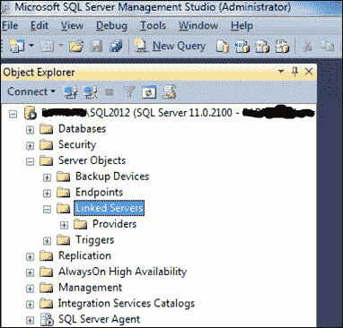

2.  Right-click on **Linked Servers** and choose **New Linked Server**. This should bring up the **New Linked Server** window as shown in the following screenshot:

    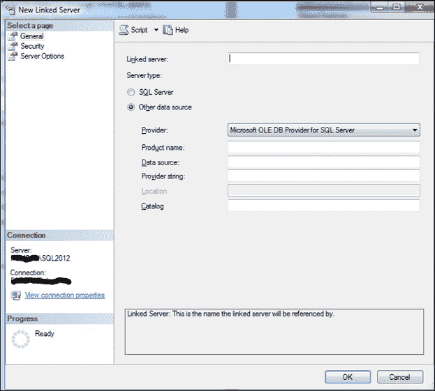

3.  You have to fill in the details of the Hive Data source that you would like connect to. In this case, I have named the Linked Server as **LINKTOHIVE**. You have to choose **Microsoft OLE DB Provider for ODBC Drivers** from the **Provider** list. You will also have to fill in the **Data source** property with the DSN named **HadoopOnLinux** so that we have an appropriate **Provider string** as shown in the following screenshot:

    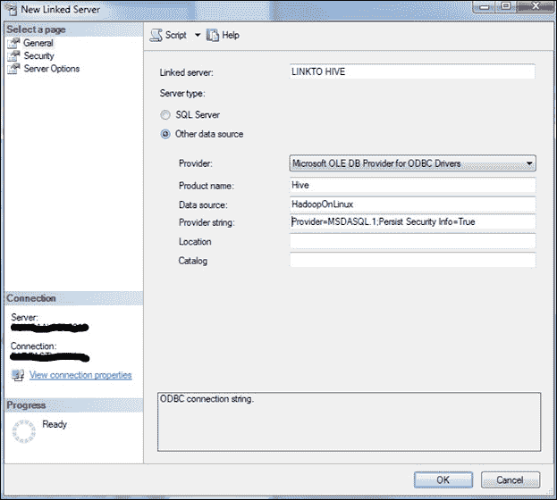

4.  Navigate to the **Security** section, select **Be made using this security context** and provide your Hadoop cluster credentials as shown in the following screenshot:

    

5.  Click on **OK** and this should create a new Linked Server named **LINKTOHIVE** under **SQL Server Linked Servers** as shown in the following screenshot. You can right-click on the **Linked Server** and test connection to confirm that everything is set up correctly.

    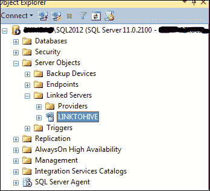

如果您喜欢基于脚本的数据库对象创建，也可以使用以下脚本创建链接服务器：

## 链接服务器脚本

通过从 SQL Server Management Studio 执行以下 Transact-SQL 脚本，可以将链接服务器设置为配置单元：

```sh
EXECmaster.dbo.sp_addlinkedserver@server= N'LINKTOHIVE',@srvproduct=N'Hive',@provider=N'MSDASQL',@datasrc=N'HadoopOnLinux',@provstr=N'Provider=MSDASQL.1;Persist Security Info=True'
/* For security reasons the linked server remote logins password is changed with ######## */
EXECmaster.dbo.sp_addlinkedsrvlogin@rmtsrvname=N'LINKTOHIVE',@useself=N'False',@locallogin=NULL,@rmtuser=N'debarchans',@rmtpassword='########'
```

### 备注

请确保将`rmtuser`和`rmtpassword`值替换为您自己的值。

您可以使用`OpenQuery`Transact-SQL 命令连接到数据源，在 Hadoop 群集上运行查询，然后将结果返回给 SQL Server。

## 使用 OpenQuery

以下 Transact-SQL 脚本说明了如何使用 SQL 链接服务器查询我们先前创建的`facebookinsights`配置单元表：

```sh
SELECT * FROM OpenQuery([LINKTOHIVE], 'SELECT * FROM facebookinsights;')
```

从查询分析器执行此查询应该会显示配置单元表中的记录，如以下屏幕截图所示：


本章的下一节讨论从链接服务器查询导入的数据创建**多维联机分析处理**数据模型(**MOLAP**)。 但是，多维项目仅支持 SQL 表或视图作为其数据源。 因此，在跳到商业智能项目之前，我们将基于链接服务器查询在我们的 SQL 数据库中创建一个视图。

## 创建视图

下面的 Transact-SQL根据我们之前使用的`OpenQuery`语句创建视图：

```sh
Create View KeyMetrices ASSELECT * FROM OpenQuery([LINKTOHIVE],'SELECT * FROM facebookinsights;')
```

### 备注

Analysis Services 表格项目支持直接 SQL 查询来创建数据模型。

# 创建 SSAS 数据模型

在运行 SQL Server 的计算机上创建链接服务器后，在 SQL Server 数据工具中将 Analysis Services 连接到配置单元非常简单。 本章的其余部分将介绍如何使用我们按照上一节提到的步骤创建的视图，将数据从配置单元表导入到 SSAS 多维和数据挖掘项目中。

执行以下步骤以创建 SSAS 数据模型：

1.  In **SQL Server Data Tools**, on the **File** menu, click on **New**, and then click on **Project**. In the **New Project** dialog box, under **Installed Templates**, navigate to **Business Intelligence** | **Analysis Services**, and then select **Analysis Services Multidimensional and Data Mining Project** as shown in the following screenshot:

    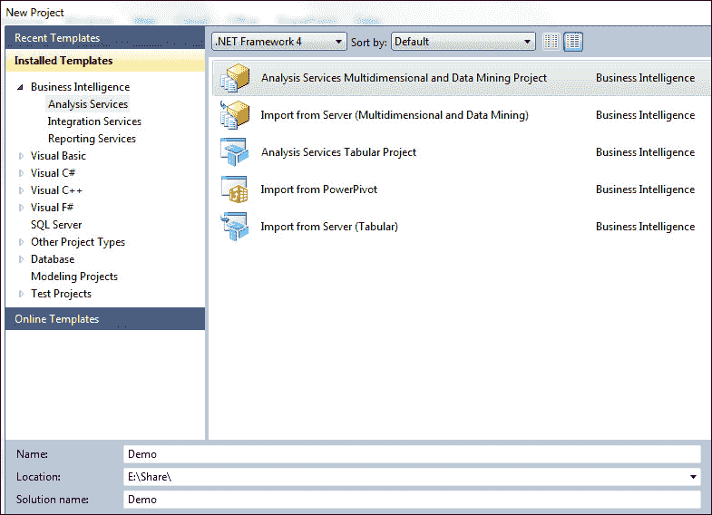

2.  在这里，您的需要为您的项目文件指定**名称**和**位置**。 默认情况下，**解决方案名称**将与项目名称相同；但是，如果需要，您可以键入不同的**解决方案名称**。 我将我的项目命名为**Demo**。 单击**确定**继续并创建项目。
3.  Once the project is created, the key tasks are to define your **Data Sources** and **Data Source Views**, which you can see in the **Solution Explorer** window as in the following screenshot:

    

4.  Right-click on **Data Sources** and choose **New Data Source**. This would launch the **Data Source Wizard** as in the following screenshot:

    

5.  Next, you have to define the connection to the database where you created the Linked Server and the View. You could select the connection if it is already prepopulated in the **Data Source Wizard**, else, you could click on the **New** button to set up the connection as in the following screenshot:

    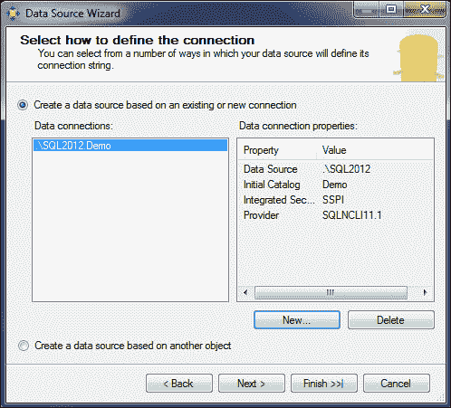

6.  Next, in the **Impersonation Information** page, make sure that **Use the credentials of the current user** is selected as in the following screenshot:

    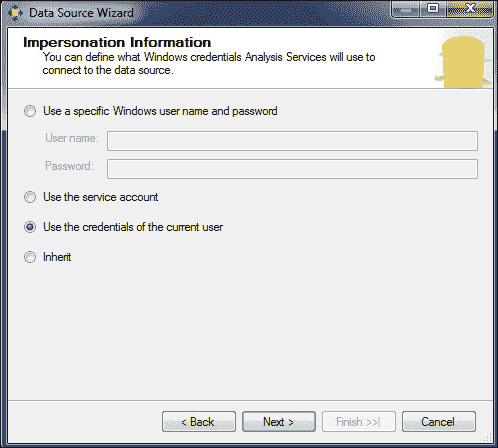

7.  Click on **Next**, you could choose a **Data source name** for your connection as shown in the following screenshot:

    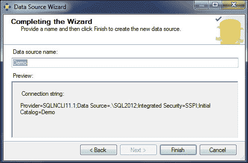

8.  Click on **Finish**, the data source would be created successfully and displayed in the **Solution Explorer** window as shown in the following screenshot:

    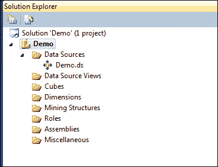

9.  Once the data source is created, you would need to define the data source views. These views will actually serve as the models for further creation of relationships, cubes, and dimensions in your solution based on the requirements. To create a view, right-click on **Data Source Views** and choose **New** to launch the **Data Source View Wizard** as shown in the following screenshot:

    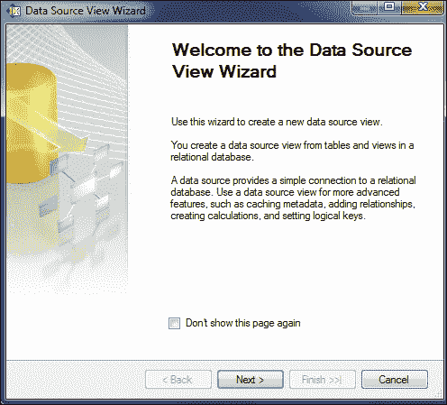

10.  Click on **Next** and select the data source **Demo** created previously, as shown in the following screenshot:

    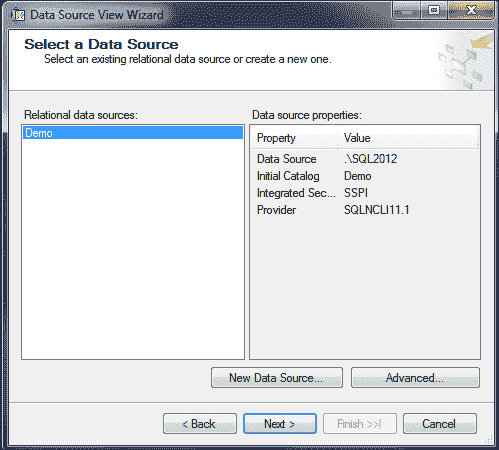

11.  Click on **Next** and you should be able to see the **KeyMetrices** view we created in the previous section under the **Available objects** list. Click on the right arrow to move it under the **Included objects** list as shown in the following screenshot:

    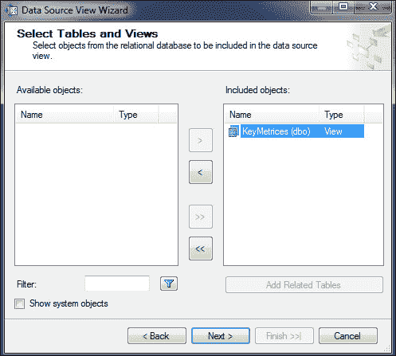

12.  The last screen of the wizard is where you provide the name for your data source view and complete the wizard by clicking on **Finish** as in the following screenshot:

    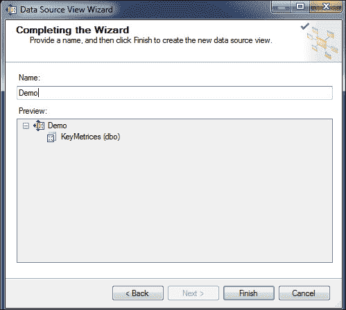

13.  Clicking on **Finish** will create the view and fetch the columns from the **Key metrics$** view as shown in the following screenshot:

    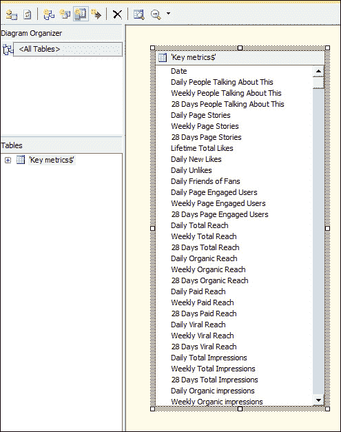

您可以按照的要求多次执行这些步骤，以添加您可能想要添加到模型中的其他表或视图。 一旦导入了对象并定义了关系，您就可以进一步处理项目，根据您的特定需求为您的数据仓库定义多维数据集和维度。 SQL Server 2012 Analysis Services 还支持表格项目，该项目可以根据列数据类型为您的仓库提供度量和事实建议。 如果您感兴趣，可以关注博客[http://dennyglee.com/2013/05/29/import-hadoop-data-into-sql-bi-semantic-model-tabular/](http://dennyglee.com/2013/05/29/import-hadoop-data-into-sql-bi-semantic-model-tabular/)，了解如何从配置单元数据创建 AS 表格模型。

# 摘要

在本章中，您了解了如何利用配置单元 ODBC 驱动程序从 Analysis Services 使用 Hadoop/配置单元。 由于 Analysis Services 直接不支持 ODBC，因此您必须使用 OLE DB to ODBC Bridge 创建一个链接服务器以配置单元，然后使用链接服务器查询作为 Analysis Services 表格项目模型中的数据源。 通过配置单元 ODBC 驱动程序，可以轻松地将 Hadoop 配置单元表中的数据导入到 SQL Server Analysis Services 多维数据模型中，在这些数据模型中可以使用商业智能工具进一步查看、整形和分析数据。

下一章将重点介绍微软提供的自助式 BI 工具，以及如何只需点击几下即可使用这些工具生成强大的交互式可视化效果。