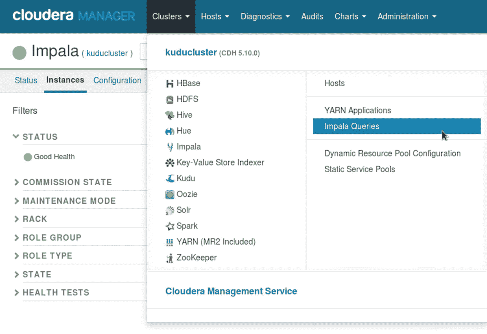
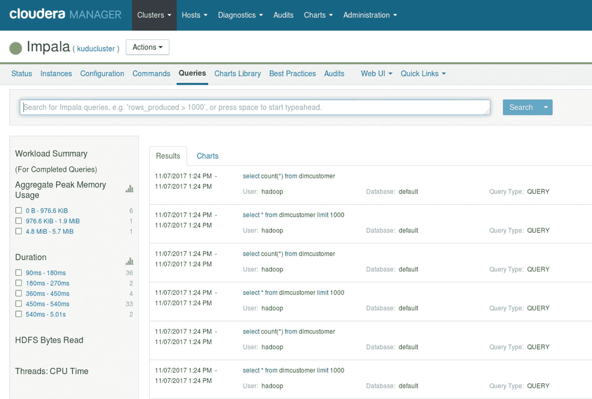
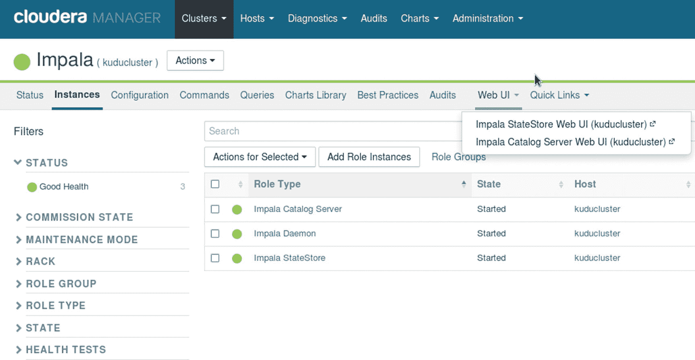
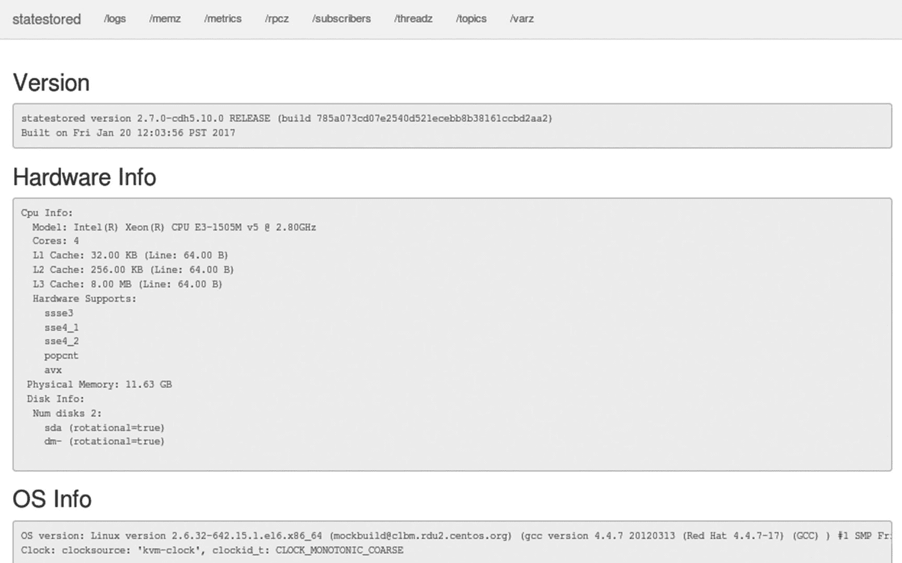
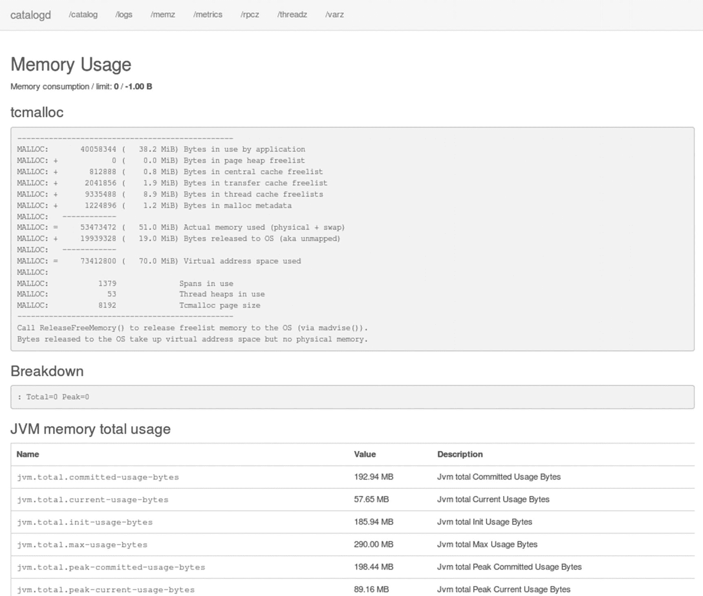
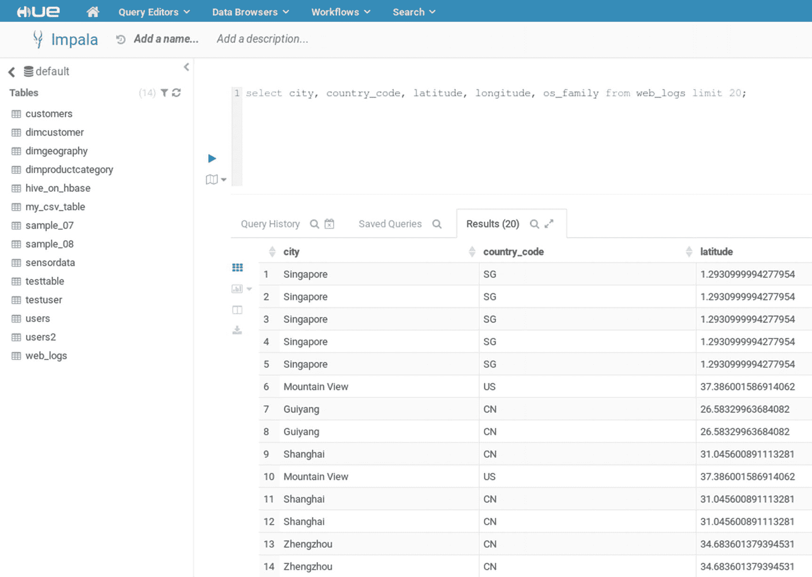

# 3.Impala 简介

Impala 是一个大规模并行处理(MPP) SQL 引擎，它是为在 Hadoop 平台上运行而全新设计和构建的。 [<sup>i</sup>](#Sec74) Impala 提供快速、低延迟的响应时间，适用于商业智能应用和特定数据分析。Impala 的性能匹配，在大多数情况下，超过商用 MPP 发动机。

Impala 最初是 Cloudera 的一个项目。它被捐赠给了阿帕奇软件基金会，并于 2015 年 12 月 2 日被纳入阿帕奇孵化器。在加入 Cloudera 之前，Impala 的架构师和技术负责人 Marcel Kornacker 是谷歌的一名软件工程师，他领导了谷歌 F1 项目的分布式查询引擎的开发， [<sup>ii</sup>](#Sec74) 是一个分布式关系数据库系统，用于支持谷歌高度关键和非常受欢迎的 AdWords 业务， [<sup>iii</sup>](#Sec74) Cloudera 于 2012 年 10 月发布了 Impala 的测试版，并于 2013 年 5 月宣布正式上市。

本章不会为你提供 Impala 所有特性的详尽列表。我写这一章的目的是给你足够的关于 Impala 的信息，让你马上开始。

## 体系结构

Impala 和其他 Hadoop 组件一样有一个分布式架构(图 [3-1](#Fig1) )。它利用守护进程在工作节点上直接本地执行查询。Impala 只是一个查询引擎，旨在集成多个存储引擎，如 HDFS、HBase、S3 和 Kudu。与 Oracle 和 SQL Server 等传统关系数据库系统相比，这是一种不同的体系结构，在这些系统中，查询和存储引擎紧密耦合在一起。


图 3-1

Impala Architecture

Impala 可以通过 ODBC 或 JDBC 访问流行的商业智能和数据可视化工具，如 Microsoft Power BI、Qlik、Tableau、Zoomdata、Business Objects 和 Microstrategy 等。

### Impala 服务器组件

Impala 的架构由三个服务组成:Impala 守护进程、目录服务和 Statestore。

#### 黑斑羚精灵

Impala 守护进程充当查询协调器，负责接受和管理集群中查询的执行。Impala 守护进程通常安装在数据节点上，利用数据局部性，允许它直接访问存储在 HDFS 的数据块。

#### 英帕拉目录服务

Impala 的目录服务存储和聚合从其他元数据存储库中收集的元数据信息，如 Hive Metastore 和 HDFS Namenode。

#### 黑斑羚国家商店

Statestore 向集群中的所有 Impala 进程分发和同步元数据信息。Statestore 是一个 pub-sub Impala 服务，它向 Impala 守护进程推送更新。

#### Impala 和 Hadoop 生态系统

Impala 是 Hadoop 生态系统的一部分，旨在与其他 Hadoop 组件协同工作。

##### 黑斑羚和蜂巢

Hive 是 Hadoop 的第一个 SQL 接口。Hive 最初构建在 MapReduce 之上，但也运行在其他数据处理引擎上，如 Tez 和 Spark。尽管 Hive 是出了名的慢，但是已经有很多人在使用它，所以构建一个不兼容的 SQL 接口是没有意义的。当 Cloudera 工程师在设计 Impala 时，他们的一个主要目标是使它尽可能与 Hive 互操作。利用现有的 Hive 基础设施，比如 Hive Metastore，是使 Impala 能够访问 Hive 表的关键。Impala(和 Hive)可以通过 HUE(Hadoop 用户体验)访问，这是一个基于 web 的 Hadoop SQL 工作台。此外，Impala 有自己的 shell，称为 impala-shell，可以通过命令行访问。我将在本章的后面讨论黑斑羚的外壳和色调。

##### 黑斑羚和 HDFS

在 Hive 和 Impala 中创建的表通常使用各种文件格式存储在 HDFS 中。要在 Impala 中创建 CSV 表格:

```scala
CREATE TABLE my_csv_table (
id BIGINT,
name STRING,
gender STRING
)
ROW FORMAT DELIMITED FIELDS TERMINATED BY ',';

```

若要大容量插入数据，可以使用下面的 LOAD DATA 或 INSERT…SELECT 语句。请注意，您必须首先创建表。

```scala
LOAD DATA INPATH '/mydata/mytextfile.txt' INTO TABLE my_csv_table;INSERT INTO my_csv_table SELECT customerkey, concat(firstname,' ',lastname), gender FROM dimcustomer;

```

可以一次插入一个值，但不建议这样做。

```scala
INSERT INTO my_csv_table VALUES (200,'Norman Bates','M');

```

执行的每个 INSERT…VALUES 语句都将在 HDFS 中生成一个小文件，并可能导致碎片和性能问题。执行大容量插入时，建议使用 LOAD DATA 或 INSERT…SELECT。如果必须执行许多单行插入，最好使用不同的存储引擎，比如 HBase 或 Kudu。

也可以手动复制表的数据目录(/user/hive/warehouse/my _ CSV _ table)中的 CSV 文件。在运行 refresh 或 invalidate 语句之前，以这种方式添加的数据对 Impala 是不可见的。我们将在本章的后面介绍元数据的刷新和失效。

##### 英帕拉和 HBase

Impala 可以通过 Hive 外部表查询 HBase 中存储的表。Impala 还可以将数据插入 Hive 外部表，数据存储在底层 HBase 表中。这里有一个例子。

启动 hbase shell。创建一个 HBase 表并插入一些测试数据。

```scala
create 'table1', 'colfam1'

put 'table1','firstrow','colfam1:name', 'Jeff Frazier'
put 'table1','firstrow','colfam1:city', 'Los Angeles'
put 'table1','firstrow','colfam1:age', '75'

put 'table1','secondrow','colfam1:name', 'Susan Fernandez'
put 'table1','secondrow','colfam1:city', 'New York'
put 'table1','secondrow','colfam1:age', '72'

put 'table1','thirdrow','colfam1:name', 'Tony Cheng'
put 'table1','thirdrow','colfam1:city','San Francisco'
put 'table1','thirdrow','colfam1:age','77'

```

在配置单元中创建外部表。

```scala
CREATE EXTERNAL TABLE hive_on_hbase (key string,name string, age int, city string)
STORED BY
'org.apache.hadoop.hive.hbase.HBaseStorageHandler'
WITH SERDEPROPERTIES
('hbase.columns.mapping'=':key, colfam1:name,colfam1:age,colfam1:city')
TBLPROPERTIES('hbase.table.name'='table1');

```

启动黑斑羚壳。因为这个表是在 Impala 之外创建的，所以它不知道这个新表的任何信息。在从新表中选择数据之前，请执行 invalidate metadata。

```scala
invalidate metadata;

select * from hive_on_hbase;

key          age    city            name
firstrow     75     Los Angeles     Jeff Frazier
secondrow    72     New York        Susan Fernandez
thirdrow     77     San Francisco   Tony Cheng

INSERT INTO hive_on_hbase VALUES ('fourthrow', 65,'Palo Alto','Kevin Lee');

select * from hive_on_hbase;

key         age    city            name
firstrow    75     Los Angeles     Jeff Frazier
secondrow   72     New York        Susan Fernandez
thirdrow    77     San Francisco   Tony Cheng
fourthrow   65     Palo Alto       Kevin Lee

```

##### 黑斑羚和 S3

亚马逊 S3 是一个流行的对象存储，经常被用作临时集群的数据存储。它还是备份和冷数据的经济高效的存储方式。从 S3 读取数据就像从 HDFS 或任何其他文件系统读取数据一样。从 CDH 5.8 (Impala 2.6)及更高版本开始，Impala 支持对存储在 S3 上的数据进行查询和插入。

```scala
CREATE TABLE my_s3_table (
id BIGINT,
name STRING,
gender STRING
)
ROW FORMAT DELIMITED FIELDS TERMINATED BY ','
LOCATION 's3://impala01/csvfiles/';

```

##### 黑斑羚和库杜

Kudu 是 Cloudera 的新关系数据存储。Kudu 是结构化数据的推荐存储引擎，可以与 Impala 无缝协作。我将在第 4 章中对黑斑羚和 Kudu 进行深入报道。

##### 文件格式

Impala 支持多种文件格式，如 Text、Avro、RCFile、SequenceFile 和 Parquet。Impala 不支持 Hortonworks 支持的 ORC 文件格式。Impala 可以创建所有文件格式的表格，并从中进行查询。Impala 不允许插入 Avro、RCFile 和 SequenceFile 表。您必须从 Hive 运行 insert 语句或使用 LOAD DATA 导入数据。

Impala 在创建表格时的默认文件格式是用 ASCII 0x01 字符(Ctrl-A)分隔值的文本。支持多种压缩编解码器，如 Snappy(速度和压缩率的最佳平衡)、GZIP(最高压缩级别，但速度较慢)、Deflate、BZip2 和 LZO。一般大多数情况下用 Snappy。

拼花是 Impala 的推荐文件格式。Parquet 最初是 Twitter 和 Cloudera 的一个联合项目。Parquet 是一种分栏式文件格式，专门为大型全表扫描和分析查询而设计，这正是 Impala 的设计初衷。要在 Impala 中创建拼花表，只需在 CREATE TABLE 语句中包含 STORED AS PARQUET，例如:

```scala
CREATE TABLE customer (
id BIGINT,
name STRING)
STORED AS PARQUET;

```

## Impala SQL

Impala 的行为就像一个传统的关系数据库管理系统。Impala 使用 SQL 来检索、管理和修改数据(与 Kudu 一起使用时)。表、视图和其他对象在数据库中进行逻辑组织。存储在表中的数据是按行和列组织的。这些列中的每一列都有一个关联的数据类型。

### 数据类型

就像典型的 RDBMS 一样，Impala 支持标准数据类型来存储不同种类的数据，如表 [3-1](#Tab1) 所示。

表 3-1

List of Data Types Supported by Impala

<colgroup><col align="left"> <col align="left"></colgroup> 
| 数据类型 | 描述 |
| :-- | :-- |
| 排列 | 可以包含一组元素的复杂数据类型。 |
| 比吉斯本 | 8 字节整数数据类型。范围:-9223372036854775808..9223372036854775807. |
| 布尔代数学体系的 | 代表真或假选择的数据类型。 |
| 茶 | 固定长度的字符类型。您可以指定的最大长度为 255。 |
| 小数 | 具有固定小数位数和精度的数值数据类型。适用于金融和其他算术计算。没有精度或小数位数值的 DECIMAL 等效于 DECIMAL(9，0)。 |
| 两倍 | 双精度浮点数据类型。范围:4.94065645841246544e-324d..1.79769313486231570e+308，正或负 |
| 浮动 | 单精度浮点数据类型。范围:1.40129846432481707e-45..3.40282346638528860e+38，正或负。 |
| （同 Internationalorganizations）国际组织 | 4 字节整数数据类型。范围:-2147483648..2147483647.没有无符号子类型。 |
| 地图 | 可以包含一组键值对的复杂数据类型。 |
| 真实的 | DOUBLE 数据类型的别名。 |
| 斯莫列特 | 双字节整数数据类型。范围:-32768..32767. |
| 线 | 长度:最大 32，767 字节。 |
| 结构体 | 可以包含单个项目的多个字段的复杂数据类型。 |
| 时间戳 | 数据类型。范围:允许的日期值范围从 1400-01-01 到 9999-12-31。 |
| Tinyint | 1 字节整数数据类型。范围:-128..127. |
| 可变长字符串 | 可变长度字符类型。您可以指定的最大长度是 65，535。 |

### SQL 语句

如前所述，Impala 使用 SQL 作为查询、管理和操作数据的语言。Impala 遵循 SQL-92 标准，其中包括许多现代 SQL 实现中常见的标准特性和内置函数。下面是 Impala 支持的常用 SQL 语句的部分列表。查阅 Impala SQL 语言参考 [<sup>iv</sup>](#Sec74) 以获得对 Impala SQL 的完整介绍。

#### 创建数据库

创建数据库在 Impala 中创建一个数据库。就像其他 RDBMS 一样，Impala 使用数据库的概念来存储它的表和其他对象。

```scala
CREATE DATABASE salesdb;

```

#### 创建表格

默认情况下，Impala 创建“内部”表。内部表由 Impala 管理。如果删除一个内部表，组成该表的物理文件也会被删除。

```scala
CREATE TABLE salesdb.customers (
id BIGINT,
name STRING,
gender STRING
)
ROW FORMAT DELIMITED FIELDS TERMINATED BY ','

```

#### 创建外部表

外部表允许您指定已经存储在存储引擎(如 HDFS、HBase、S3 或 Kudu)中的数据的位置。例如，我可以根据 HDFS 目录/user/bob/products 中存储的 CSV 数据创建一个名为 products 的外部表。外部表类似于视图。如果删除外部表，组成该表的物理文件不会被删除，只会删除表定义。您需要从底层存储中手动删除数据。

```scala
CREATE EXTERNAL TABLE salesdb.products (
(
id BIGINT,
productname STRING,
productdesc STRING,
cost DOUBLE
)
ROW FORMAT DELIMITED FIELDS TERMINATED BY ','

LOCATION '/user/bob/products/';

```

#### 挑选

SELECT 允许您从表或视图中检索数据。您可以手动指定列名以仅返回特定的列，或者如果希望返回所有列，则指定星号。

例子

```scala
SELECT customerkey, firstname, lastname, birthdate
FROM dimcustomer;

Customerkey  firstname    lastname    birthdate
11001        Eugene       Huang       1976-05-10
11044        Adam         Flores      1954-11-21
11063        Angela       Murphy      1980-10-04
11075        Felicia      Jimenez     1963-05-16
11099        Adam         Ross        1966-09-05
11107        Bianca       Lin         1976-03-04
11118        Alvin        Zeng        1962-12-31
11156        Maria        Roberts     1981-08-06
11169        Bryce        Richardson  1973-12-20
11171        Jonathan     Hill        1978-10-05

```

#### 在哪里

基于条件过滤数据。

例子

```scala
SELECT customerkey, firstname, lastname, birthdate
FROM dimcustomer
WHERE firstname="Eugene";

Customerkey  firstname    lastname    birthdate
11001        Eugene       Huang       1976-05-10

```

#### 与和或

AND 和 OR 允许用户在 WHERE 子句中组合多个条件。

例子

```scala
SELECT customerkey, firstname, lastname, birthdate
FROM dimcustomer
WHERE firstname = 'Adam'
AND lastname="Flores";

customerkey  firstname    lastname    birthdate
11044        Adam         Flores      1954-11-21

SELECT customerkey, firstname, lastname, birthdate
FROM dimcustomer
WHERE firstname = 'Adam'
OR firstname="Alvin";

customerkey  firstname    lastname    birthdate
11044        Adam         Flores      1954-11-21
11099        Adam         Ross        1966-09-05
11118        Alvin        Zeng        1962-12-31

```

#### 喜欢

LIKE 允许用户指定通配符来搜索列中的模式。

例子

```scala
SELECT customerkey, firstname, lastname, birthdate
FROM dimcustomer
WHERE lastname
LIKE 'R%'

Customerkey  firstname   lastname     birthdate
11099        Adam        Ross         1966-09-05
11156        Maria       Roberts      1981-08-06
11169        Bryce       Richardson   1973-12-20

```

#### 限制

LIMIT 限制 SQL 查询返回的行数。

例子

```scala
SELECT customerkey, firstname, lastname, birthdate
FROM dimcustomer
LIMIT 5;

customerkey  firstname    lastname    birthdate
11001        Eugene       Huang       1976-05-10
11044        Adam         Flores      1954-11-21
11063        Angela       Murphy      1980-10-04
11075        Felicia      Jimenez     1963-05-16
11099        Adam         Ross        1966-09-05

```

#### 以...排序

排序依据按降序或升序对结果进行排序。

例子

```scala
SELECT customerkey, firstname, lastname, birthdate
FROM dimcustomer
ORDER BY customerkey;

Customerkey  firstname    lastname    birthdate
11001        Eugene       Huang       1976-05-10
11002        Ruben        Torres      1971-02-09
11003        Christy      Zhu         1973-08-14
11004        Elizabeth    Johnson     1979-08-05
11005        Julio        Ruiz        1976-08-01
11006        Janet        Alvarez     1976-12-02
11007        Marco        Mehta       1969-11-06
11008        Rob          Verhoff     1975-07-04
11009        Shannon      Carlson     1969-09-29

```

#### 分组依据和拥有

GROUP BY 与 COUNT、AVG 和 SUM 等聚合函数一起使用，按一列或多列对结果进行分组。在汇总结果后过滤数据。它与 GROUP BY 一起使用。

例子

```scala
SELECT firstname, count(*)
FROM dimcustomer
GROUP BY firstname
HAVING firstname="Adam";

firstname    count(*)
Adam         51

```

#### 明显的

DISTINCT 返回列中的不同值。

例子

```scala
SELECT DISTINCT firstname
FROM dimcustomer;

```

#### 联合和联合独特

UNION 和 UNION DISTINCT 组合两个或多个 SELECT 语句的结果。两者都只返回不同的值。

例子

```scala
SELECT firstname
FROM dimcustomer
UNION
SELECT firstname
FROM dimcustomer2;

```

#### 联合所有

UNION ALL 类似于 UNION，只是它允许在结果中出现重复值。

例子

```scala
SELECT firstname
FROM dimcustomer
UNION ALL SELECT
firstname
FROM dimcustomer2;

```

#### 加入

JOIN 使用两个表中的公共值合并两个或多个表中的行。Impala 支持不同类型的连接。更多细节请参考 Impala SQL 语言参考。

例子

```scala
SELECT t1.firstname, t1.lastname, t2.salesamount
FROM
dimcustomer AS t1
INNER JOIN
salesfact AS t2
WHERE
t1.customerkey = t2.customerkey;

```

#### 子查询

子查询是另一个 SQL 查询中的 SQL 查询。

例子

```scala
SELECT firstname
FROM
dimcustomer
WHERE firstname
IN
(SELECT firstname FROM dimcustomer2);

```

#### 形容

DESCRIBE 返回关于表的元数据信息。

例子

```scala
DESCRIBE dimcustomer;

DESCRIBE FORMATTED dimcustomer;

```

#### 使元数据无效

无效元数据使一个或多个表的元数据无效。它迫使 Impala 在对表执行查询之前重新加载表的元数据。

例子

```scala
INVALIDATE METADATA dimcustomer;

```

#### 加载数据

加载数据将存储在 HDFS 文件中的数据加载到表格中。

例子

```scala
LOAD DATA INPATH '/home/bob/customers.txt' INTO TABLE dimcustomer;

```

#### 恢复精神

Refresh 立即重新加载表的元数据，但只加载新添加数据的部分元数据，与使元数据无效相比，这是一种开销较低的操作。

例子

```scala
REFRESH dimcustomer;

```

### 集合语句

SET 语句允许用户改变 SQL 语句的行为。这些设置只影响在 impala-shell 会话中执行的查询。

#### 数量 _ 节点

NUM_NODES 限制将执行 SQL 查询的节点数量。

例子

```scala
SET NUM_NODES=1

```

#### MEM _ 极限

MEN_LIMIT 定义了一个 SQL 查询在每个节点上可以利用的最大内存量。

例子

```scala
set mem_limit=3G;

set mem_limit=3000M;

```

#### 实时 _ 进度

LIVE_PROGRESS 显示一个实时进度条，显示已完成的执行百分比。

例子

```scala
SET LIVE_PROGRESS=TRUE;

```

#### 批量大小

BATCH_SIZE 显示 SQL 查询一次处理的行数。较大的数量可以提高 SQL 查询的性能，但会消耗更多内存。默认值设置为 1024。

例子

```scala
SET BATCH_SIZE=2048

```

### 显示语句

SHOW 语句使用户能够获得关于 Impala 对象的信息。下面是 Impala 支持的最常见的 SHOW 语句列表。

#### 显示数据库

显示数据库显示所有可用的数据库。

例子

```scala
SHOW DATABASES;

name                comment
_impala_builtins    System database for Impala builtin functions
default             Default Hive database

```

#### 显示表格

显示表格显示数据库中所有可用的表格。

例子

```scala
SHOW TABLES;

name
customers
dimcustomer
dimgeography
dimproductcategory
hbase_users
sample_07
sample_08
sensordata
testtable
testuser
users
web_logs

```

#### 显示文件

显示文件显示组成表格的所有 HDFS 文件。

例子

```scala
SHOW FILES IN web_logs;

Path                                         Size        Partition
hdfs://kuducluster:8020/user/cloudera/2015_11_18/web_logs_1.csv                    113.00KB    date=2015-11-18
hdfs://kuducluster:8020/user/cloudera/2015_11_19/web_logs_2.csv                    103.18KB    date=2015-11-19
hdfs://kuducluster:8020/user/cloudera/2015_11_20/web_logs_3.csv                    105.59KB    date=2015-11-20
hdfs://kuducluster:8020/user/cloudera/2015_11_21/web_logs_4.csv                     82.68KB    date=2015-11-21

```

#### 显示表格统计

显示表格 TATS 显示表格的低级信息。

例子

```scala
SHOW TABLE STATS web_logs;

date                 #Rows    #Files          Size       Bytes Cached Cache Replication    Format   Incremental stats Location
2015-11-18           -1       1               113.00KB   NOT CACHED   NOT CACHED           TEXT     false           hdfs://kuducluster:8020/user/cloudera/2015_11_18
2015-11-19           -1       1               103.18KB   NOT CACHED  NOT CACHED           TEXT     false           hdfs://kuducluster:8020/user/cloudera/2015_11_19
2015-11-20           -1       1               105.59KB   NOT CACHED      NOT CACHED           TEXT     false           hdfs://kuducluster:8020/user/cloudera/2015_11_20
2015-11-21           -1       1               82.68KB    NOT CACHED      NOT CACHED           TEXT     false           hdfs://kuducluster:8020/user/cloudera/2015_11_21
Total               -1        4               404.45KB   0B

```

### 内置函数

Impala 包含类似于现代 RDBMS 中的内置函数。这些函数可以在 SQL 语句中用于转换数据、操作字符串以及执行日期和数学计算。Impala 包括聚合函数、字符串函数、日期和时间函数以及数学函数等等。下面列出了 Impala 中包含的一些常用功能。参考 Impala SQL 语言参考 [<sup>v</sup>](#Sec74) 完整覆盖 Impala 的内置函数。

#### 全局唯一识别

`uuid`函数以字符串形式返回 UUID 或通用唯一标识符。此函数对于生成唯一值来标识对象非常有用。它也可以用作主键值。

```scala
select uuid();

uuid()                               
c14f1469-233b-4d95-9efe-8cf1d2205d7f

```

#### 现在

`now`函数返回当前日期和时间。

```scala
select now();

now()                         
2017-11-06 22:44:19.926002000

```

#### 正则表达式 _like

`regexp`函数返回 true 或 false 来表示字符串是否包含模式指定的正则表达式。

```scala
select regexp_like('water','wat');

regexp_like('water', 'wat')
true                        

```

#### 丙烯腈-丁二烯-苯乙烯

`abs`函数返回自变量的绝对值。

```scala
select abs(-100);

abs(-100)

100     

```

#### fnv_hash(类型五)

基于输入参数返回 64 位 BIGINT 值。此函数实现了一个版本的 Fowler–Noll–Vo 哈希函数，该函数在加密方面并不安全。它可用于需要简单哈希功能的应用程序，如负载平衡和哈希分区。

```scala
select abs(fnv_hash((now())));
abs(fnv_hash((now())))
5911639952301673123   

```

## 用户定义的函数

用户定义函数或 UDF 允许您编写自己的 Impala 函数。这在你需要一个 Impala 中没有的特性时很有用。Impala 支持用 Java 编写的 UDF，但是为了获得最佳性能，建议你用 C++编写 UDF。还可以创建用户定义的聚合函数(UDAFs ),根据一组值返回一个值。关于如何创建用户自定义函数，请参考 Cloudera 的文档。

## 黑斑羚的复杂类型

Impala 支持复杂类型，如 STRUCT、ARRAY 和 MAP。 [<sup>vi</sup>](#Sec74) 复杂数据类型有几个好处，比如通过消除对表连接的需要以及更简单的 ETL 和数据建模来提高查询性能。目前，对复杂类型的支持仅适用于通过 Hive 或 Spark 创建的拼花表。Impala 目前不能创建包含复杂类型的拼花桌。另外，Kudu 还不支持复杂类型；因此，在使用 Kudu 表时，需要传统的维度建模或反规范化。CDH 包括带有嵌套类型的示例表，您可以通过 HUE 安装这些表。让我们展示一些如何处理复杂类型的例子。

```scala
DESCRIBE customers;
+-------------------+------------------------+---------+
| name              | type                   | comment |
+-------------------+------------------------+---------+
| id                | int                    |         |
| name              | string                 |         |
| email_preferences | struct<                |         |
|                   |   email_format:string, |         |
|                   |   frequency:string,    |         |
|                   |   categories:struct<   |         |
|                   |     promos:boolean,    |         |
|                   |     surveys:boolean    |         |
|                   |   >                    |         |
|                   | >                      |         |
| addresses         | map<string,struct<     |         |
|                   |   street_1:string,     |         |
|                   |   street_2:string,     |         |
|                   |   city:string,         |         |
|                   |   state:string,        |         |
|                   |   zip_code:string      |         |
|                   | >>                     |         |
| orders            | array<struct<          |         |
|                   |   order_id:string,     |         |
|                   |   order_date:string,   |         |
|                   |   items:array<struct<  |         |
|                   |     product_id:int,    |         |
|                   |     sku:string,        |         |
|                   |     name:string,       |         |
|                   |     price:double,      |         |
|                   |     qty:int            |         |
|                   |   >>                   |         |
|                   | >>                     |         |
+-------------------+------------------------+---------+

```

### 查询结构字段

嵌套字段通过点符号来访问。

```scala
SELECT
id,
name,

email_preferences.email_format ef,
email_preferences.categories.promos ecp
FROM customers
LIMIT 10;

+-------+---------------------+------+-------+
| id    | name                | ef   | ecp   |
+-------+---------------------+------+-------+
| 75012 | Dorothy Wilk        | html | true  |
| 17254 | Martin Johnson      | text | true  |
| 12532 | Melvin Garcia       | html | true  |
| 42632 | Raymond S. Vestal   | html | true  |
| 77913 | Betty J. Giambrone  | text | false |
| 38807 | Rebecca T. Johnson  | html | true  |
| 71843 | David B. Allison    | text | true  |
| 67099 | Jay N. Weaver       | text | false |
| 83510 | Carol B. Houser     | html | false |
| 48072 | Octaviana Guiterrez | text | false |
+-------+---------------------+------+-------+

```

### 查询深度嵌套的集合

使用点标记法在 FROM 子句中指定嵌套数组。

```scala
SELECT
order_id,
order_date,
items.name,
items.qty
FROM
customers.orders,
customers.orders.items
LIMIT 10;
+----------------------+-----+
| name                 | qty |
+----------------------+-----+
| Evening Clutch       | 1   |
| Large Tassel Pouch   | 1   |
| Flameless Candle     | 2   |
| Tea for One          | 1   |
| Towel Set            | 4   |
| Maple Dining Table   | 1   |
| Paloma Accent Table  | 1   |
| Trunk Coffee Table   | 1   |
| Simple Scallop Table | 2   |
| Murano Glass Vase    | 4   |

+----------------------+-----+

```

### 使用嵌套集合的 ANSI-92 SQL 连接进行查询

Impala 支持嵌套集合的 ANSI-92 SQL 连接。注意，由于父子关系上的隐式连接，您不需要使用 on 子句。

```scala
SELECT
id,
name,
co.order_id,
co.order_date
FROM
customers c
INNER JOIN
customers.orders co
LIMIT 10;

+-------+--------------+----------+---------------------------+
| id    | name         | order_id | order_date                |
+-------+--------------+----------+---------------------------+
| 75012 | Dorothy Wilk | 4056711  | 2015-05-01T14:22:25-04:00 |
| 75012 | Dorothy Wilk | J882C2   | 2015-06-10T11:00:00-05:00 |
| 75012 | Dorothy Wilk | I72T39   | 2015-03-14T11:00:00-05:00 |
| 75012 | Dorothy Wilk | PB6268   | 2015-02-11T14:22:25-04:00 |
| 75012 | Dorothy Wilk | B8623C   | 2015-04-21T11:00:00-05:00 |
| 75012 | Dorothy Wilk | R9S838   | 2015-07-09T11:00:00-05:00 |
| 75012 | Dorothy Wilk | HS3124   | 2015-10-14T00:00:00       |
| 75012 | Dorothy Wilk | BS5902   | 2014-10-23T00:00:00       |
| 75012 | Dorothy Wilk | DN8815   | 2015-09-07T00:00:00       |
| 75012 | Dorothy Wilk | XR2771   | 2015-12-25T00:00:00       |

+-------+--------------+----------+---------------------------+

```

## 黑斑羚壳

Impala shell (impala-shell)是一个命令行实用程序，可以用来与 Impala 交互。您可以运行 SQL 语句，将查询的输出保存到文件中，或者显示有关查询的低级性能信息。您可以在交互和非交互模式下使用 impala-shell。

在执行 impala-shell 命令时，您可以使用几个命令行选项。表 [3-2](#Tab2) 中列出了一些最重要的选项。要获得更详尽的列表，请参考 Impala 文档。[T3】VIIT5】](#Sec74)

表 3-2

Impala Shell Command-Line Options

<colgroup><col align="left"> <col align="left"></colgroup> 
| 命令行选项 | 描述 |
| :-- | :-- |
| -i 主机名或-impalad =主机名 | impala-shell 将连接到运行 impala 守护进程的主机。 |
| -o 文件名或-输出文件文件名 | 将查询结果存储在指定的文本文件中。 |
| -d 默认数据库或-数据库=默认数据库 | 指定启动 impala-shell 时使用的默认数据库。 |
| -q 查询或-query =查询 | 从命令行执行查询。 |
| -f 查询文件或-查询文件=查询文件 | 执行存储在文件中的查询。 |
| -h 或者-救命 | 显示帮助信息。 |

让我们开始在交互模式下使用 impala-shell。让我们通过使用 impala-shell 选项使输出更容易显示。

```scala
impala-shell
Starting Impala Shell without Kerberos authentication
Connected to quickstart.cloudera:21000
Server version: impalad version 2.9.0-cdh5.12.0 RELEASE (build 03c6ddbdcec39238be4f5b14a300d5c4f576097e)
***************************************************************************
Welcome to the Impala shell.
(Impala Shell v2.9.0-cdh5.12.0 (03c6ddb) built on Thu Jun 29 04:17:31 PDT 2017)
Press TAB twice to see a list of available commands.
***************************************************************************
Pressing tab twice will list available impala-shell commands.

alter     create    describe  explain   insert    quit      shell     src
unset     use       with      compute   delete    drop      help      load
select    show      summary   update    values    connect   desc      exit
history   profile   set       source    tip       upsert    version

You can use help to list the commands anytime you're inside impala-shell.

help;

Documented commands (type help <topic>):
========================================
compute  describe  explain  profile  select  shell  tip    use     version
connect  exit      history  quit     set     show   unset  values  with   

Undocumented commands:
======================
alter   delete  drop  insert  source  summary  upsert
create  desc    help  load    src     update

```

如果您想要了解特定命令的功能，可以键入 help“command”

```scala
help tip;
Print a random tip

```

执行 tip 命令。

```scala
tip;

When you set a query option it lasts for the duration of the Impala shell session.

```

您可以查看和查询可用的数据库和表。

```scala
show databases;

+------------------+----------------------------------------------+
| name             | comment                                      |
+------------------+----------------------------------------------+
| _impala_builtins | System database for Impala builtin functions |
| default          | Default Hive database                        |
+------------------+----------------------------------------------+

use default;

show tables;

+-----------------+
| name            |
+-----------------+
| customer_backup |
| customers       |
| sample_07       |
| sample_08       |
| testtable       |
| web_logs        |
+-----------------+

select count(*) from customers;
+----------+
| count(*) |
+----------+
| 53       |
+----------+

select client_ip,city,country_name from web_logs limit 10;

+-----------------+---------------+---------------+
| client_ip       | city          | country_name  |
+-----------------+---------------+---------------+
| 128.199.234.236 | Singapore     | Singapore     |
| 128.199.234.236 | Singapore     | Singapore     |
| 128.199.234.236 | Singapore     | Singapore     |
| 128.199.234.236 | Singapore     | Singapore     |
| 128.199.234.236 | Singapore     | Singapore     |
| 66.249.76.236   | Mountain View | United States |
| 222.85.131.87   | Guiyang       | China         |
| 222.85.131.87   | Guiyang       | China         |
| 101.226.168.225 | Shanghai      | China         |
| 66.249.76.225   | Mountain View | United States |
+-----------------+---------------+---------------+

describe web_logs;

+-------------------+----------+---------+
| name              | type     | comment |
+-------------------+----------+---------+
| _version_         | bigint   |         |
| app               | string   |         |
| bytes             | smallint |         |
| city              | string   |         |
| client_ip         | string   |         |
| code              | tinyint  |         |
| country_code      | string   |         |
| country_code3     | string   |         |
| country_name      | string   |         |
| device_family     | string   |         |
| extension         | string   |         |
| latitude          | float    |         |
| longitude         | float    |         |
| method            | string   |         |
| os_family         | string   |         |
| os_major          | string   |         |
| protocol          | string   |         |
| record            | string   |         |
| referer           | string   |         |
| region_code       | bigint   |         |
| request           | string   |         |
| subapp            | string   |         |
| time              | string   |         |
| url               | string   |         |
| user_agent        | string   |         |
| user_agent_family | string   |         |
| user_agent_major  | string   |         |
| id                | string   |         |
| date              | string   |         |
+-------------------+----------+---------+

```

impala-shell 的一个便利特性是它能够运行 shell 命令。

```scala
shell iostat;

Linux 2.6.32-642.15.1.el6.x86_64 (kuducluster)         11/03/2017         _x86_64_        (4 CPU)

avg-cpu:  %user   %nice %system %iowait  %steal   %idle
          40.91    0.00    2.75    0.12    0.00   56.22

Device:            tps   Blk_read/s   Blk_wrtn/s   Blk_read   Blk_wrtn
sda              16.11       643.23       619.74    6647326    6404562
dm-0             83.61       631.40       597.55    6525034    6175256
dm-1              0.03         0.25         0.00       2600          0
dm-2              3.74        10.91        22.18     112770     229256

```

历史记录允许您列出最近执行的命令的历史记录。

```scala
history;

[1]
[2]: show tables;
[3]: select * from users;
[4]: select count(*) from dimcustomer;
[5]: select customerkey, firstname, lastname, birthdate from dimcustomer limit 10;
[6]: describe dimcustomer;
[7]: show databases;
[8]: show tables;
[9]: help;
[10]: history;

```

## 性能调整和监控

Impala 是一个高性能的 SQL MPP 引擎，能够查询 1 万亿行或更多。 [<sup>viii</sup>](#Sec74) 然而，有时仍然需要一些性能调整和监控，以确保 Impala 发挥其最大潜力。幸运的是，Cloudera Enterprise 包括一些工具和命令，可以帮助您调优和监控 Impala。

### 解释

Explain 显示 SQL 查询的执行计划。执行计划显示了 Impala 为执行您的 SQL 查询而执行的低级操作的顺序。您可以使用执行计划来评估查询的性能。你从下到上阅读执行计划。

```scala
explain select count(*) from web_logs;

Query: explain select count(*) from web_logs
Explain String
Estimated Per-Host Requirements: Memory=90.00MB VCores=1
WARNING: The following tables are missing relevant table and/or column statistics.
default.web_logs
""
PLAN-ROOT SINK
|
03:AGGREGATE [FINALIZE]
|  output: count:merge(*)
|
02:EXCHANGE [UNPARTITIONED]
|
01:AGGREGATE
|  output: count(*)
|
00:SCAN HDFS [default.web_logs]
   partitions=4/4 files=4 size=404.45KB
Fetched 16 row(s) in 3.50s

```

### 摘要

为查询执行的不同阶段提供计时。它帮助您确定潜在的瓶颈在哪里。下面的结果表明，大部分活动都用于执行 HDFS 扫描。

```scala
summary;

Operator      #Hosts        Avg Time     Max Time     #Rows
03:AGGREGATE   1            0ns           0ns          1
02:EXCHANGE    1            0ns           0ns          1
01:AGGREGATE   1            0ns           0ns          1
00:SCAN HDFS   1            44.00ms       44.00ms      1.00K

Est. #Rows    Peak Mem  Est.      Peak Mem       Detail
1              20.00 KB           -1 B           FINALIZE       
1              0 B                -1 B           UNPARTITIONED
1              16.00 KB           10.00 MB
-1             280.00 KB          80.00 MB       default.web_log

```

### 轮廓

Profile 显示关于 SQL 查询的更详细的性能报告，例如内存使用、网络和存储等待时间等。下面显示的是结果的摘录。

```scala
profile;

Query Runtime Profile:
Query (id=26414d8a59a8fff4:fd59c4f500000000):
  Summary:
    Session ID: 8e4d099336a7cabe:83d7327345384cb4
    Session Type: BEESWAX
    Start Time: 2017-11-05 22:21:59.218421000
    End Time: 2017-11-05 22:21:59.345006000
    Query Type: QUERY
    Query State: FINISHED
    Query Status: OK
    Impala Version: impalad version 2.7.0-cdh5.10.0 RELEASE (build 785a073cd07e2540d521ecebb8b38161ccbd2aa2)
    User: hadoop
    Connected User: hadoop
    Delegated User:
    Network Address: ::ffff:10.0.1.101:53796
    Default Db: default
    Sql Statement: select count(*) from web_logs
    Coordinator: kuducluster:22000
    Query Options (non default):
    Plan:

```

### Cloudera 经理

Cloudera Manager 提供了一个图形用户界面，可以用来监控 Impala(图 [3-2](#Fig2) )。


图 3-2

Cloudera Manager

您可以放大图表以获得不同性能指标的更详细视图，例如查询持续时间(图 [3-3](#Fig3) )。


图 3-3

Query Duration

您还可以监视查询。在 Cloudera Manager 中，导航到集群➤黑斑羚查询，如图 [3-4](#Fig4) 所示。



图 3-4

Cloudera Manager – Impala Queries

您将看到集群中已经执行或正在执行的 Impala 查询的历史。Cloudera Manager 还显示持续时间、用户和其他指标等信息(图 [3-5](#Fig5) )。



图 3-5

Impala Queries

Impala 有自己的 web 界面，提供关于其 StateStore 和目录服务器的底层细节(图 [3-6](#Fig6) )。



图 3-6

Impala Web UI

Impala StateStore WebUI 提供了关于 Impala StateStore 的详细性能和诊断信息(图 [3-7](#Fig7) )。



图 3-7

Impala StateStore WebUI

Impala 目录服务器 WebUI 提供了关于 Impala 目录服务器的详细性能和诊断信息(图 [3-8](#Fig8) )。



图 3-8

Impala Catalog Server WebUI

### Impala 性能建议

有些建议是特定于 Impala 的，而有些是大多数数据仓库共有的。

#### 使用黑斑羚拼花地板

Parquet 是一种高度优化的柱状文件格式，设计用于 Impala。创建表时尽可能使用拼花文件格式(如果您的环境中没有 Kudu)。我会在下一章讨论 Impala 和 Kudu。

#### 解决“小文件”问题

小文件对黑斑羚来说是个大问题。HDFS 没有优化处理大量的小文件。这通常是由于在一段时间内对一个表执行几个 INSERT…值造成的。解决这个问题的一种方法是通过创建另一个表并使用 INSERT…SELECT 将数据大容量插入该表来合并小文件。insert 语句的并行度取决于运行 Impala 的工作节点的数量。这意味着，如果集群中有 20 个工作节点，insert 语句可能会生成 20 个小文件。通过将 NUM_NODES 设置为 1，可以强制 Impala 写一个大文件，而不是 20 个小文件。这将强制 Impala 在 1 个节点上执行 insert 语句。因为您将并行度降低到 1，这可能会导致其他性能问题，所以请相应地进行测试。

#### 表分区

分区是大型表的一项要求。如果您有大型表分区，它应该导致查询处理单个较小的分区，而不是读取整个表。这就是所谓的分区修剪。在大多数情况下，分区修剪可以显著缩短执行时间，减少 Impala 检索的数据量。我在第 4 章中讨论了表分区。

#### 反规格化

反规范化是另一个优化选项。表连接通常是一些最低效的数据库操作，尤其是当您连接几个大表时。通过对表进行反规范化，可以提高读取性能，但代价是重复数据和降低写入性能。对于大多数 DSS 和报告系统来说，这是一个可以接受的折衷方案。

#### 创建汇总或汇总表

从技术上讲，创建汇总或汇总表是一种反规范化形式。在大多数 RDBMS 中，这是使用物化视图实现的。Impala 不支持物化视图，但是您可以通过预先构建包含聚合数据的汇总表来模仿它们。

#### 收集大型表连接中使用的表的统计信息

表统计数据需要是最新的，这样 Impala 就可以为包含在查询中的表计算出最有效的连接顺序。可以使用 COMPUTE STATS 定期收集频繁连接的表的统计信息。

关于如何调优 Impala 的更多细节，请参考 Impala 性能指南和最佳实践。 [<sup>ix</sup>](#Sec74)

## 工作量和资源管理

Impala 有自己的资源和工作负载管理功能，不像 Spark 和 MapReduce 等其他 Hadoop 组件那样与 YARN 集成。

Note

在早期版本的 CDH 中有一个称为骆驼的组件，它提供了与黑斑羚的纱线集成，但从 CDH 5.5 /黑斑羚 2.3 开始停止使用。

在 Impala 中，如果启用了静态分区，那么 CPU、网络和磁盘 IO 上的资源限制是通过使用 cgroups 来实现的。在内存使用方面，Impala 的内存限制(设置 MEM _ 限制)是用来限制内存使用的。动态资源池允许基于池中可用资源对 Impala 查询进行动态资源管理。

### 准入控制

准入控制是 Impala 中的一个资源管理特性，它限制 SQL 查询的并发性，以防止大量用户同时使用而导致的过度使用。准入控制将用户查询排队，直到资源被释放并变得可用。

有关 Impala 工作负载和资源管理特性的更多信息，请参考 Impala 的在线文档。 [<sup>x</sup>](#Sec74)

## Hadoop 用户体验

Hadoop 用户体验或 HUE 是一个基于 web 的用户界面，为 Impala 和 Hive 提供了一个易于使用的 SQL 编辑器和 Metastore 管理器。HUE 还包括其他功能，可以让您与 HBase、文件浏览器和作业浏览器进行交互。

SQL 编辑器允许用户运行 Impala 查询，是一个比 impala-shell 更友好的工具(图 [3-9](#Fig9) )。



图 3-9

HUE – Impala

Metastore 管理器允许用户管理 Impala 和 Hive 表以及其他对象(图 [3-10](#Fig10) )。


图 3-10

HUE – Metastore Manager

## 企业中的黑斑羚

由于其 JDBC 和 ODBC 驱动程序，Impala 与市场上流行的商业智能、数据争论和数据可视化工具兼容，例如 Microstrategy、Business Objects、Cognos、Oracle 商业智能企业版(OBIEE)、Tableau、Qlik、Power BI 和 Zoomdata 等。我在第 9 章中用 Impala 介绍了数据可视化和商业智能。

## 摘要

Impala 是 Cloudera Enterprise 最重要的组件之一。虽然 Hive 使 Hadoop 可以为大众所用，但正是 Impala 等 SQL MPP 引擎使 Hadoop 入侵企业成为可能。我们将在下一章讨论黑斑羚和库杜。

## 参考

1.  马塞尔·科尔纳克；“Impala:面向 Hadoop 的现代开源 SQL 引擎”，Cloudera，2015， [`http://cidrdb.org/cidr2015/Papers/CIDR15_Paper28.pdf`](http://cidrdb.org/cidr2015/Papers/CIDR15_Paper28.pdf) 。
2.  马塞尔·科尔纳克；《遇见工程师:Marcel Kornacker》，Cloudera，2013， [`https://blog.cloudera.com/blog/2013/01/meet-the-engineer-marcel-kornacker/`](https://blog.cloudera.com/blog/2013/01/meet-the-engineer-marcel-kornacker/) 。
3.  杰夫·舒特；F1:“可扩展的分布式 SQL 数据库”，谷歌，2013 年， [`https://research.google.com/pubs/pub41344.html`](https://research.google.com/pubs/pub41344.html) 。
4.  Cloudera《Impala SQL 语言参考》，Cloudera，2018， [`https://www.cloudera.com/documentation/enterprise/latest/topics/impala_langref.html`](https://www.cloudera.com/documentation/enterprise/latest/topics/impala_langref.html) 。
5.  Cloudera《Impala SQL 语言参考》，Cloudera，2018， [`https://www.cloudera.com/documentation/enterprise/latest/topics/impala_langref.html`](https://www.cloudera.com/documentation/enterprise/latest/topics/impala_langref.html) 。
6.  [`http://blog.cloudera.com/blog/2015/11/new-in-cloudera-enterprise-5-5-support-for-complex-types-in-impala/`](http://blog.cloudera.com/blog/2015/11/new-in-cloudera-enterprise-5-5-support-for-complex-types-in-impala/) 。
7.  Cloudera《impala-shell 命令行选项》，Cloudera，2018， [`http://www.cloudera.com/documentation/cdh/5-1-x/Impala/Installing-and-Using-Impala/ciiu_shell_options.html`](http://www.cloudera.com/documentation/cdh/5-1-x/Impala/Installing-and-Using-Impala/ciiu_shell_options.html) 。
8.  Cloudera《黑斑羚常见问题》，Cloudera，2018， [`https://www.cloudera.com/documentation/enterprise/latest/topics/impala_faq.html`](https://www.cloudera.com/documentation/enterprise/latest/topics/impala_faq.html) 。
9.  Cloudera《Impala 性能指南和最佳实践》，Cloudera，2018， [`https://www.cloudera.com/documentation/enterprise/latest/topics/impala_perf_cookbook.html#perf_cookbook__perf_cookbook_stats`](https://www.cloudera.com/documentation/enterprise/latest/topics/impala_perf_cookbook.html#perf_cookbook__perf_cookbook_stats) 。
10.  Cloudera《黑斑羚的资源管理》，Cloudera，2018， [`https://www.cloudera.com/documentation/enterprise/latest/topics/impala_resource_management.html`](https://www.cloudera.com/documentation/enterprise/latest/topics/impala_resource_management.html) 。