# 12.云中的大数据

在过去几年中，云中的大数据部署变得越来越流行。云的灵活性和敏捷性非常适合运行 Hadoop 集群。云显著降低了 IT 成本，同时为应用程序提供了扩展能力。扩展和收缩集群只需几分钟，并且大多数任务不需要系统管理员。虽然一些组织仍然倾向于本地大数据部署，但如今大多数大数据环境都部署在三大公共云提供商之一。

我在这一章的目标是给你一个关于云中的 Cloudera Enterprise 的高层次概述。对于这个主题的更完整的处理，请参考用于 AWS、 [<sup>i</sup>](#Sec35) Azure、 [<sup>ii</sup>](#Sec35) 和 Google 云平台 [<sup>iii</sup>](#Sec35) 部署的 Cloudera 参考架构。

## 亚马逊网络服务(AWS)

AWS 于 2006 年 3 月推出，是三大主要公共云提供商中的第一家也是最大的一家。 [<sup>iv</sup>](#Sec35) AWS 提供最广泛的存储、应用、分析和计算服务。由于其先发优势，AWS 是领先的云提供商，客户范围从最大的公司到创新型初创企业和小型企业。

### 微软 Azure 服务

微软 Azure 提供类似 AWS 的云服务，例如 SQL 数据库、存储、应用程序和虚拟机等等。Azure 最近开始蚕食亚马逊的市场份额，因为其积极的定价策略和与微软技术栈的紧密集成。根据一项调查，2017 年 Azure 的整体采用率从 20%增长到 34%，而 AWS 在其受访者中保持在 57%。 [<sup>v</sup>](#Sec35) 在企业中，Azure 也凭借 Azure 降低了 AWS 的领先优势，实现率从 26%大幅提升至 46%。AWS 在企业中的采用率从 56%略微上升到 59%。[T5】VIT7】](#Sec35)

### 谷歌云平台(GCP)

2011 年推出的谷歌云平台是三大主要公共云提供商中最年轻的一家。最初是为了支持自己的服务，如 YouTube 和谷歌搜索，谷歌最终建立了包括 Cloud Spanner 和 Cloud Bigtable 在内的其他云服务，并向公众开放。GCP 最近获得了一些牵引力，但与 AWS 和 Azure 相比，它仍被认为没有准备好迎接黄金时间。

表 [12-1](#Tab1) 提供了一个粗略的指南 [<sup>vii</sup>](#Sec35) 帮助您在三个提供商之间映射等价服务 [<sup>viii</sup>](#Sec35) 。

表 12-1

Service Comparison Between AWS, Azure, and GCP

<colgroup><col align="left"> <col align="left"> <col align="left"></colgroup> 
| 亚马逊网络服务 | 谷歌云平台 | 微软 Azure 服务 |
| :-- | :-- | :-- |
| 亚马逊 EC2 | 谷歌计算引擎 | Azure 虚拟机 |
| 亚马逊 EC2 容器服务 | 谷歌容器引擎 | Azure 集装箱服务 |
| AWS 弹性豆茎 | 谷歌应用引擎 | Azure 云服务和应用服务 |
| 自动气象站λ | 谷歌云功能 | 天青函数 |
| 亚马逊冰川和亚马逊 S3 标准——很少进入 | 谷歌云存储近线 |   |
| 亚马逊 S3 | 谷歌云存储标准 | 天蓝色块状斑点 |
| 亚马逊 EC2 容器注册中心 | 谷歌容器注册 |   |
| 亚马逊 DynamoDB | 谷歌云数据存储或谷歌云大表 | DocumentDB 蓝色 |
| 亚马逊 RDS | 谷歌云 SQL | 蓝色数据库 |
| 亚马逊 EMR 和 AWS 数据管道 | Google Cloud Dataflow 和 Google Cloud Dataproc | Azure HD Insight |
| 亚马逊 Kinesis 和亚马逊简单队列服务(SQS) | 谷歌云发布/订阅 | Azure 事件中心和 Azure 服务总线 |
| 亚马逊红移 | Google big query(Google big query) | Azure SQL 数据仓库和 Azure 数据湖分析 |
| 亚马逊云观测 | 谷歌云监控和谷歌云日志 | Azure 应用洞察和 Azure 运营洞察 |
| 亚马逊弹性负载平衡 | 谷歌云负载平衡 | Azure 负载平衡器 |
| 亚马逊 53 号公路 | 谷歌云域名系统和谷歌域名 | DNA 蓝色 |
| AWS 直接连接 | 谷歌云互联 | 蓝色快车路线 |
| AWS 身份和访问管理(IAM) | 谷歌云身份和访问管理 | 活动目录 |
| AWS 组织 | 谷歌云资源管理器 | Azure 资源管理器 |
| AWS 密钥管理服务(KMS) | 谷歌云密钥管理服务 | 蓝色钥匙保险库 |
| 亚马逊检查员 | 谷歌云安全扫描器 |   |
| AWS 云阵 | 谷歌云部署管理器 | Azure 资源管理器 |

## 云时代云中的企业

本章的重点是在云中运行 Cloudera Enterprise。在这种特定的设置下，云提供商只负责提供基础设施。将使用 Cloudera 企业组件和功能，而不是云提供商提供的服务。Cloudera Enterprise 可以集成亚马逊 S3 和 Azure Block Blobs 等云提供商提供的一些服务。

## 混合云和多云

您可能想知道，当三家公共云提供商已经提供大数据服务时，为什么有人会在云中使用 Cloudera Enterprise？两个原因:厂商锁定和数据可移植性。一旦你把数据放在一个云提供商那里，并且完全依赖他们的服务，你就被他们的平台锁定了。将您的数据迁移到本地或其他云提供商非常困难。即使您能够迁移您的数据，您仍然需要使用目标云提供商提供的服务来重构您的应用程序。将此与在云中使用 Cloudera Enterprise 进行比较。Cloudera Enterprise 是一个混合/多云大数据平台，这意味着可以部署 Cloudera Enterprise 集群在 AWS、Azure 和 GCP(或内部)上运行。将 Cloudera Enterprise 迁移到另一家云提供商要容易得多。因为您基本上只是在改变基础设施提供者，所以迁移您的应用程序只是更新连接细节的问题。

在当今不断变化的技术环境中，这种灵活性极其重要。多年来，许多公司一直在将其内部部署的 CDH 集群迁移到 AWS，反之亦然。我知道有几家公司成功地将其 CDH 集群从 AWS 迁移到 Azure。一些公司在内部部署生产集群，而他们的开发和测试/QA 环境在 AWS 或 Azure 中。

根据 RightScale 2017 年云状态报告，混合云是首选的企业战略，85%的企业拥有多云战略，高于 2016 年的 82%。 [<sup>ix</sup>](#Sec35)

## 瞬态集群

借助 Cloudera Enterprise，您可以选择在云中配置临时或永久(持久)集群。瞬态集群可以通过基于使用的定价来降低某些用例的成本。自助服务模式允许用户部署和管理自己的集群，从而提供了灵活性。它适用于间歇执行的数据科学或数据工程作业。您启动一个集群，运行您的作业，将您的数据存储在一个对象存储中，比如 S3(这样您的数据仍然可供将来使用)，然后在完成后关闭您的集群。这些步骤有时是脚本化的，所以一切都是自动化的。在这种类型的部署模型中，存储和计算是分离的。 [<sup>x</sup>](#Sec35) 瞬态工作负载的示例包括 ETL 作业、训练机器学习模型、临时数据分析以及开发和测试/QA 工作流 [<sup>xi</sup>](#Sec35) 等等。

## 持久集群

对于需要随时可用的集群，持久集群更合适。这些持久集群是云中永久“开启”的集群，与本地集群有相似的要求。这些星系团也被称为“提升移位”星系团。这些集群通常是企业环境的一部分，其中的用例更具战略性。这些集群通常具有高可用性和灾难恢复、资源管理、安全性和数据治理。持久集群的例子有大型多用户集群、BI/分析集群、HBase 和 Kafka 集群等等。 [<sup>xii</sup>](#Sec35) 持久集群的定价通常是传统的基于节点的许可。

### Cloudera 总监

Cloudera Enterprise 提供了一个强大的云管理工具，名为 Cloudera Director(见图 [12-1](#Fig1) )。Cloudera Director 通过提供灵活且易于使用的自助服务功能，在 AWS、Azure 和 GCP 等云环境中部署和管理 Cloudera Enterprise，从而支持 Cloudera 的混合云和多云功能。Cloudera Director 包括一个客户端组件和一个 REST API，可用于自动化和编写云部署脚本。


图 12-1

Cloudera Director

#### Cloudera Director 架构

Cloudera Director 使用户可以非常轻松地在所有三家公共云提供商上部署和维护 Cloudera 环境。如图 [12-2](#Fig2) 所示，CDH 集群的实际管理和监控仍由 Cloudera Manager 执行，而数据治理、安全性、审计和元数据管理则由 Cloudera Navigator 执行。一旦您的组织开始在云中部署多个集群，您就会开始体会到 Cloudera Director 的价值。

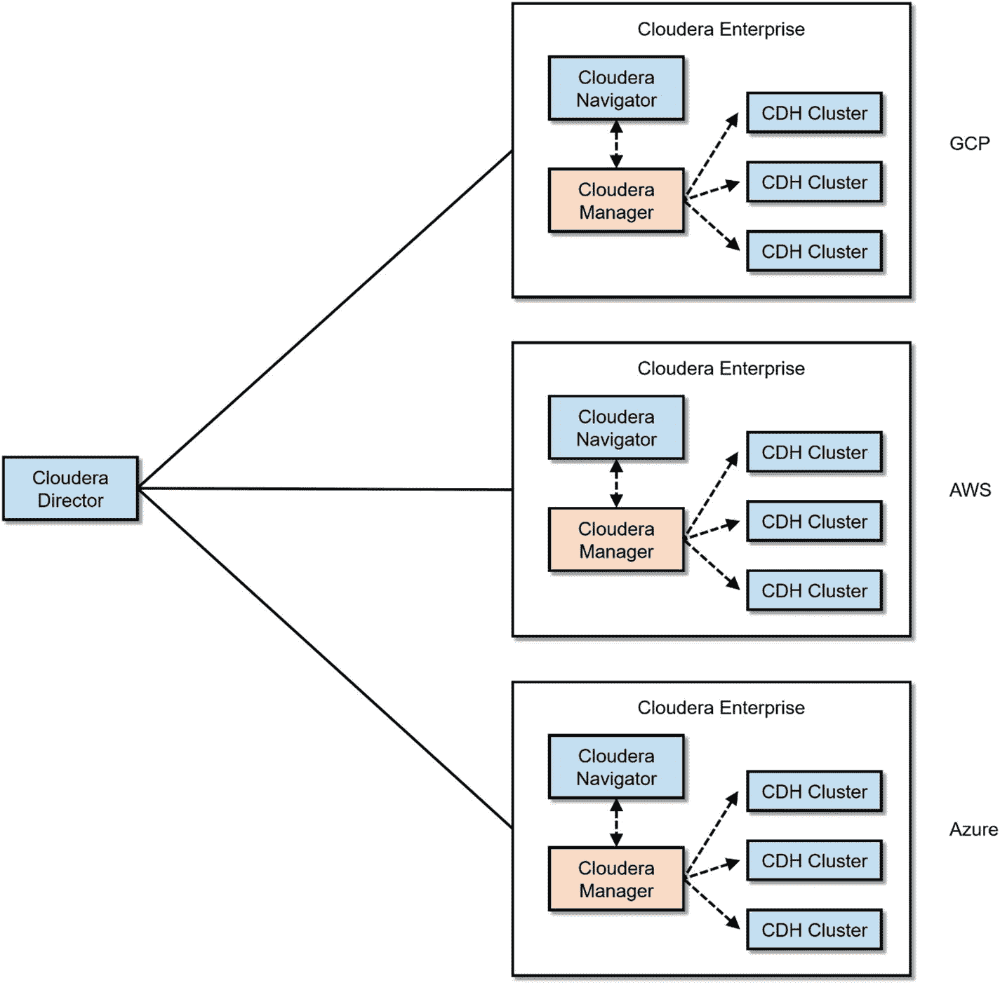

图 12-2

Cloudera Director high-level architecture

#### Cloudera Director 客户端

Cloudera Director 包括客户端软件，您可以使用该软件从命令行部署和管理集群。它通常用于快速部署测试和开发环境。客户端使用配置文件来自动化集群部署。

#### Cloudera Director REST API

Cloudera Director 的所有功能都可以通过 REST API 访问。您可以使用 REST API 来自动化安装和管理 Cloudera 云部署的任务。您可以从用 Python 和 Java 编写的脚本或应用程序中调用 REST API。要了解更多关于 Cloudera Director 的 REST API，请参考 Cloudera Director SDK Github 页面。[<sup>XIII</sup>T3】](#Sec35)

#### AWS 上的 Cloudera

由于 AWS 是最受欢迎的公共云提供商，我们将在本章重点介绍在 AWS 上运行 Cloudera Enterprise。我在本章谈到的大多数概念也适用于 Azure 和 GCP 上的 Cloudera Enterprise。我将对在 AWS 上部署 Cloudera Enterprise 的组件和需求进行概要介绍。提供在 AWS 上部署 Cloudera Enterprise 的全面指南超出了本章的范围。有关更多详细信息，请参考用于 AWS 部署的 Cloudera 企业参考架构。 [<sup>十四</sup>](#Sec35)

##### 区域和可用性区域

在 AWS 中，服务部署在自包含的地理位置，称为区域。区域被进一步细分为可用性区域。可用性区域是区域内可以部署集群的独立位置。Cloudera 企业部署只能驻留在单个可用性区域中。[<sup>XV</sup>T3】](#Sec35)

##### 虚拟专用云(VPC)

AWS 有一个虚拟私有云或 VPC 的概念。[<sup>XVI</sup>](#Sec35)VPC 呈现了一个虚拟网络，其行为类似于传统网络。

##### 安全组

安全组就像 AWS 中的防火墙。安全组使用户能够打开或关闭端口，限制 IP 地址，以及允许或禁止 EC2 实例的特定网络流量。Cloudera 企业集群需要三个安全组用于集群、flume 或摄取节点以及 edge 或 gateway 节点。 [<sup>xvii</sup>](#Sec35) 图 [12-3](#Fig3) 显示了在 AWS 中如何实现安全组的高级视图。


图 12-3

Cloudera Enterprise on AWS Security Groups

##### EC2 实例

EC2 实例有点像一个虚拟服务器，具有与之相关联的 CPU、RAM、网络和存储。Amazon 提供了几种针对各种用例优化的 EC2 实例类型。实例类型分为几个类别，以帮助您为您的应用程序选择正确的 EC2 实例类型。实例类型类别包括通用、计算优化、内存优化、加速计算和存储优化。Cloudera 为每个 CDH 集群节点类型推荐了合适的 EC2 实例类型。[<sup>XVIII</sup>T3】](#Sec35)

###### 主节点

将 EBS 存储用于主节点时，需要 EBS 优化的实例。

*   c 4.2x 大，c 4.4x 大，c 4.8x 大
*   m4.xlarge，m4.2xlarge，m4.4xlarge，m4.8xlarge，m4.10xlarge，m4.16xlarge
*   R4 . XL 大，r 4.2x 大，r 4.4x 大，r 4.8x 大，r 4.16 x 大

如果使用临时磁盘部署主节点，建议使用以下实例类型。

*   c 3.8 x 大号
*   d 2.8 x 大
*   12.8 x 大
*   3.16 倍大
*   r 3.8 x 大

###### 工作节点

将 EBS 存储用于工作节点时，需要 EBS 优化的实例。

*   c 4.2x 大，c 4.4x 大，c 4.8x 大
*   m4.xlarge，m4.2 倍大，m4.4 倍大，m4.10 倍大
*   R4 . XL 大，r 4.2x 大，r 4.4x 大，r 4.8x 大，r 4.16 x 大
*   EBS 优化的 D2、I2 或 R3 实例类型

如果使用临时磁盘部署主节点，建议使用以下实例类型。

*   c 3.8 x 大号
*   d 2.8 x 大
*   2.8 x 大，2.16 x 大
*   3.8 x 大，3.16 x 大
*   r 3.8 x 大

Note

Cloudera 建议大量使用 Impala 的 CDH 集群使用 d2.8xlarge、i2.8xlarge 或 i3.8xlarge 实例。

###### 边缘节点

对于边缘节点没有具体的建议。您可以选择任何实例类型，只要它对您的工作负载有足够的资源。

###### 关系数据库

Cloudera Enterprise 需要 MySQL、PostgreSQL 或 Oracle 等关系数据库来存储 Cloudera Manager、Hive 和 Impala metastore、Hue 和 Oozie 使用的数据库。您可以使用 EC2 实例或 RDS 来存放您的关系数据库。

###### Cloudera 总监

Cloudera 建议对 Cloudera Director 使用 c3.large 或 c4.large 实例。 [<sup>xix</sup>](#Sec35)

##### 仓库

我描述了 Cloudera Enterprise 支持的不同类型的存储。

###### 短暂的

如果您停止或终止附加到它的 EC2 实例，临时或实例存储将丢失(它将在实例重启后继续存在)。由于性能原因，临时存储适合于 HDFS 数据目录，因为从临时存储读取不需要通过网络远程读取。

使用临时存储时，您应该有一个备份或灾难恢复计划。使用 distcp 将数据复制到 S3，使用 Cloudera Manager 的备份和数据恢复(BDR)功能备份数据，或者使用 StreamSets Data Collector 等数据传输或复制工具，都有助于防止数据丢失。

###### 弹性块存储

与暂时存储相比，弹性块存储(EBS)为 EC2 实例提供永久的块级存储。即使您停止或终止 EC2 实例，数据也不会丢失。有几种类型的 EBS 存储，如 ST1、SC1 和 GP2 卷。Cloudera 建议所有 EBS 支持的实例都使用 GP2。Cloudera 还建议 GP2 卷的大小至少为 100 GB，以保持足够的 IOPS。[<sup>xx</sup>T3】](#Sec35)

###### S3

S3 是亚马逊作为服务提供的一个对象商店。S3 比传统存储引擎便宜得多，这使得它非常适合存储备份和“冷”数据，如旧的历史数据。对于瞬态工作负载，S3 也是保存 ETL 或 BI/分析工作流结果的理想数据存储。

S3 的一些 IO 特征使它不适合某些用例。首先是延迟。从 S3 读取数据比从 HDFS 或库都读取数据慢几倍。如果性能很重要，最佳实践是将“热”数据存储在 HDFS 或库都，将“冷”数据存储在 S3。其次，S3 是一个最终一致的数据存储，这意味着写入其中的数据可能在一段时间内不可读取，通常是几毫秒或几秒。有记录的案例表明滞后时间为几个小时。 [<sup>xxi</sup>](#Sec35) 这可能会给需要读取一致性的应用程序带来问题。

Cloudera Enterprise and S3

一些 Cloudera 企业服务可以与 S3 交互。Cloudera S3 连接器支持顺化的安全 S3 访问。 [<sup>xxii</sup>](#Sec35) 蜂巢，蜂巢上的 Spark、Spark 和 Impala 可以读写 S3 的数据。关于如何使用 Impala 访问 S3 数据的更多细节，请参阅第 [3](03.html) 章。有关如何使用 Spark 访问 S3 的详细信息，请参阅第 [5](05.html) 章。

S3Guard

如前所述，S3 是一个最终一致的数据存储。然而，大多数 Hadoop 应用程序需要读取一致性才能正常工作。Cloudera Enterprise 附带的大多数存储引擎(HDFS、HBase 和 Kudu)都提供读取一致性(Solr 最终是一致的)。

S3Guard 是由开源社区开发的，用于处理由 S3 最终一致性引起的问题。 [<sup>xxiii</sup>](#Sec35) S3Guard 不“修复”S3 的一致性模型，它通过将写入 S3 的所有元数据更改记录到外部“元数据存储”来工作；由于这个元数据存储应该是一致的，应用程序可以使用这些信息来完成丢失的元数据，这些元数据在 S3 可能还不可用。S3 护卫队和 CDH 一起出航。

##### 基于 AWS 架构的 Cloudera Enterprise

图 [12-4](#Fig4) 展示了 AWS 上典型的 Cloudera 企业环境。[T3】XXIVT5】](#Sec35)


图 12-4

Cloudera Enterprise on AWS Architecture

##### 使用 Cloudera Director 在 AWS 上部署 Cloudera Enterprise

没有比使用 Cloudera Director 在 AWS 上实际部署集群更好的学习方法了。请注意，此安装仅适用于测试或开发环境。

您需要在 EC2 实例上下载并安装 Cloudera Director。设置 AWS 环境超出了本书的范围。如果您需要有关如何为 Cloudera Director 设置 AWS 环境的指导，例如设置 VPC、安全组和 EC2 实例，请参考 Cloudera Director 用户指南。[<sup>XXV</sup>T3】](#Sec35)

我假设您已经启动了 EC2 实例。本例中我们将使用 Red Hat/CentOS 7 . x(Ubuntu 和 Red Hat/CentOS 6.x 也受支持)。

使用 pem 文件登录到 EC2 实例。

```
ssh –i mypemfile.pem ec2-user@cloudera_director_private_ip

```

Note

根据您使用的 AMI，您可能需要使用不同的 ssh 登录。在 AWS 控制台中，查看“实例”页面中的使用说明。您可能需要使用 centos 或 root 登录，而不是 ec2-user。

您需要安装受支持版本的 Oracle JDK。目前支持 JDK 7 和 8。您可以从 Oracle 网站下载 rpm。

```
sudo yum localinstall jdk-version-linux-x64.rpm

```

添加 Cloudera Director 存储库

```
cd /etc/yum.repos.d/
sudo wget http://archive.cloudera.com/director/redhat/7/x86_64/director/cloudera-director.repo

```

一旦更新了存储库，现在就可以安装 Cloudera Director 服务器和客户端软件了。

```
sudo yum install cloudera-director-server cloudera-director-client

```

启动 Cloudera Director 服务器。

```
sudo service cloudera-director-server start

```

有时会启用 Red Hat/CentoOS 7 中的防火墙。这将阻止您连接到 Cloudera Director。禁用并停止防火墙。

```
sudo systemctl disable firewalld
sudo systemctl stop firewalld

```

Note

Cloudera 不建议将您的安全组配置为允许通过互联网访问您的 EC2 实例的公共 IP 地址。Cloudera 建议您使用 SOCKS 代理服务器连接到集群节点和 Cloudera Manager。有关如何配置 SOCKS 代理服务器的更多详细信息，请参考 Cloudera Director 用户指南。出于测试目的，您可以打开安全组以允许访问公共 IP 地址。只是别忘了关上它！

打开 web 浏览器，转到运行 Cloudera Director 的 EC2 实例的端口 7189 上的公共或私有 IP 地址。在用户名和密码字段使用“admin”登录(参见图 [12-5](#Fig5) )。

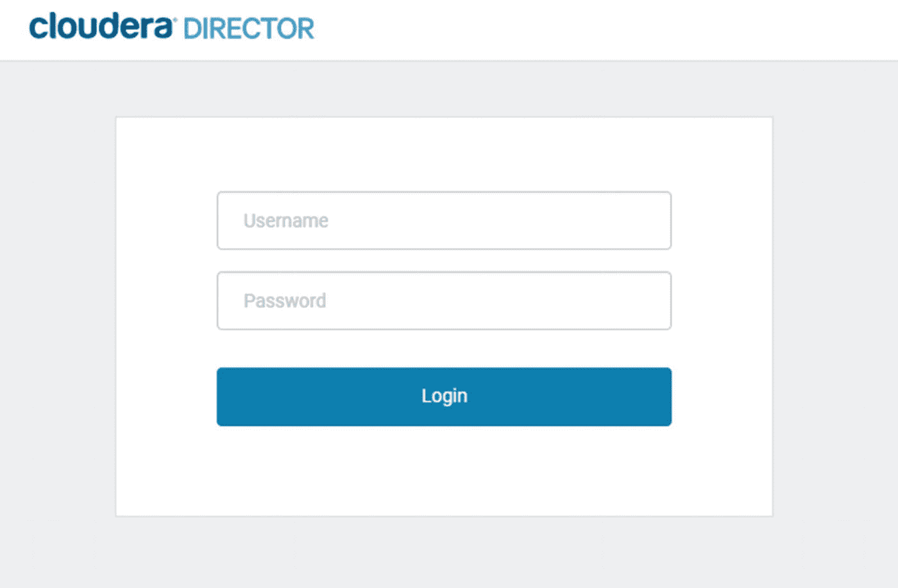

图 12-5

Cloudera Director Login Page

您将看到一个指示板，帮助您添加 Cloudera 管理器或集群。让我们添加一个 Cloudera 管理器(见图 [12-6](#Fig6) )。

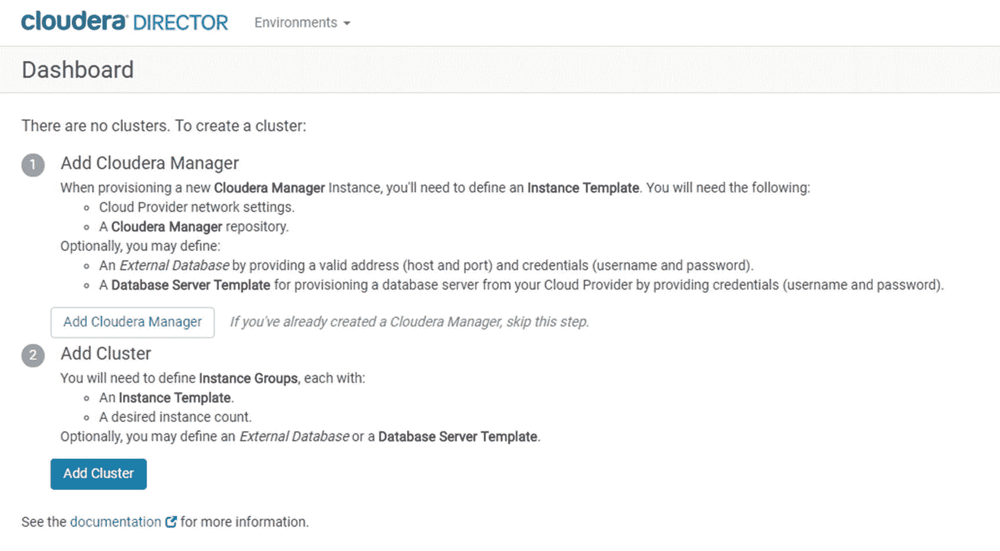

图 12-6

Cloudera Director Dashboard

填写创建 Cloudera Manager 实例所需的信息，例如实例类型、AMI ID、安全组 ID、VPC 子网 ID 等，如图 [12-7](#Fig7) 所示。

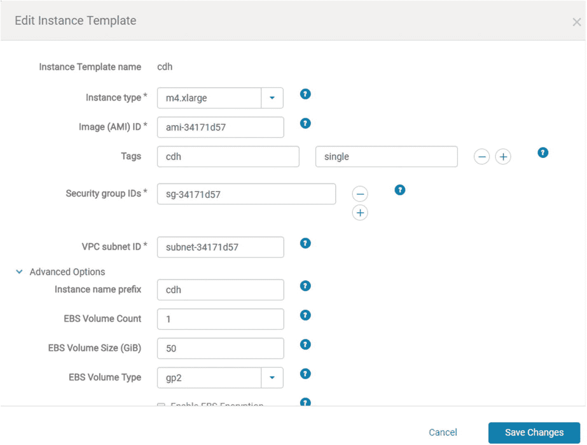

图 12-7

Edit Instance Template

向下滚动以输入关于您的实例的更多细节(参见图 [12-8](#Fig8) )。有关不同选项的更多信息，请参考 AWS 文档。完成后保存更改。

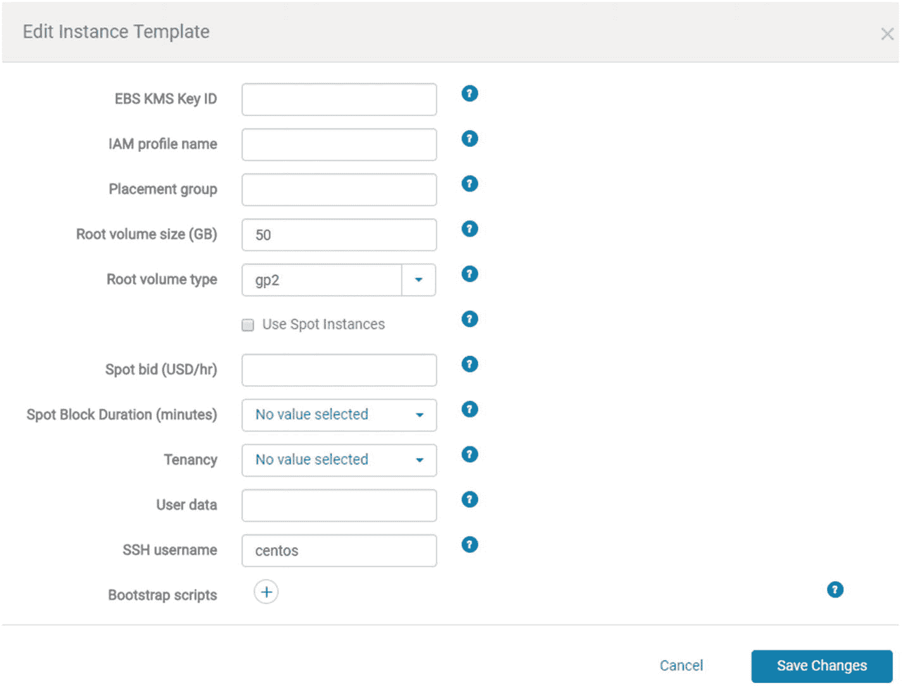

图 12-8

Edit Instance Template Page 2

输入关于 Cloudera Manager 实例的详细信息，例如名称和密码(参见图 [12-9](#Fig9) )。

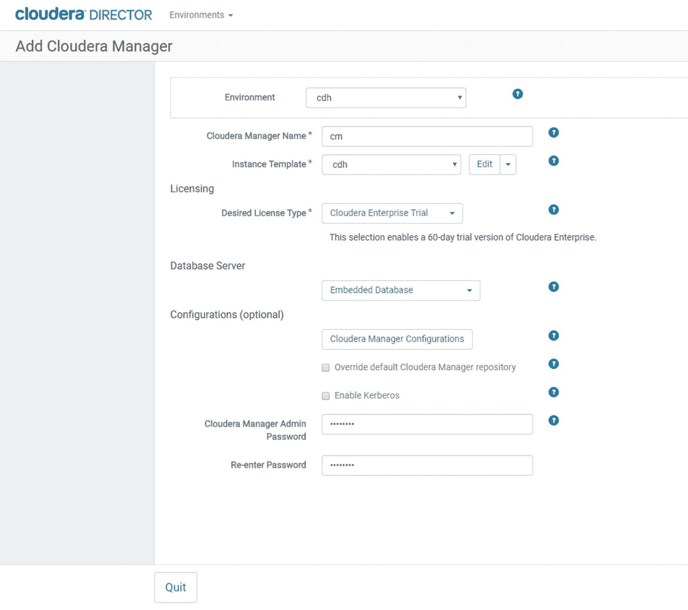

图 12-9

Add Cloudera Manager

在创建 Cloudera Manager 实例的同时，您可以开始创建集群。Cloudera Director 为您提供从头创建集群或从现有集群克隆的选项。您还必须输入集群名称，并选择要在集群上运行的服务(参见图 [12-10](#Fig10) )。

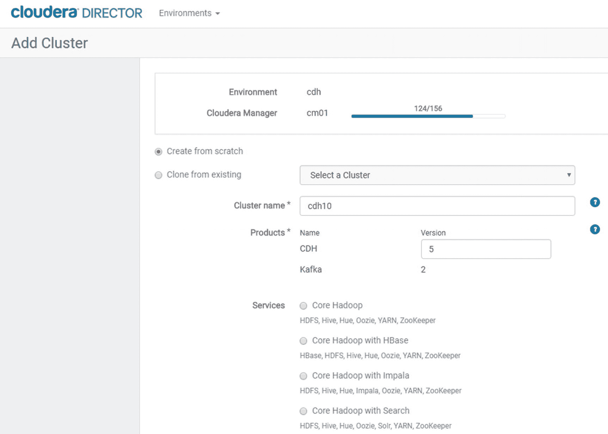

图 12-10

Add Cluster

Cloudera Director 让您可以轻松配置集群节点，如图 [12-11](#Fig11) 所示。请注意，您的员工至少需要三个节点。


图 12-11

Cluster nodes

确认集群中的节点数量。准备好后点击确定(见图 [12-12](#Fig12) )。


图 12-12

Confirmation to create compute instance

您将看到 Cloudera Manager 和集群安装的进度指示器(参见图 [12-13](#Fig13) )。


图 12-13

Cloudera Manager and Cluster installation

安装完成后点击“下一步”(参见图 [12-14](#Fig14) )。


图 12-14

Cloudera Manager and Cluster installation completed

将显示 Cloudera Director 仪表盘(参见图 [12-15](#Fig15) )。

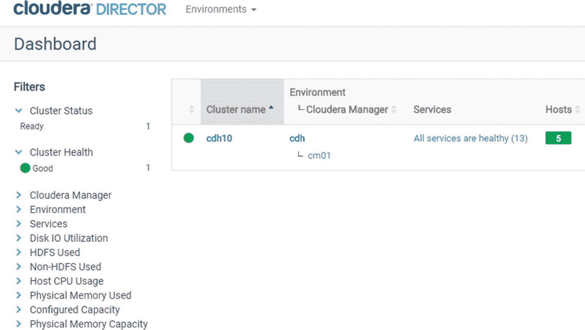

图 12-15

Cloudera Director Dashboard

点击 Cloudera Manager 安装的名称，获取更多关于 Cloudera Manager 的信息(见图 [12-16](#Fig16) )。

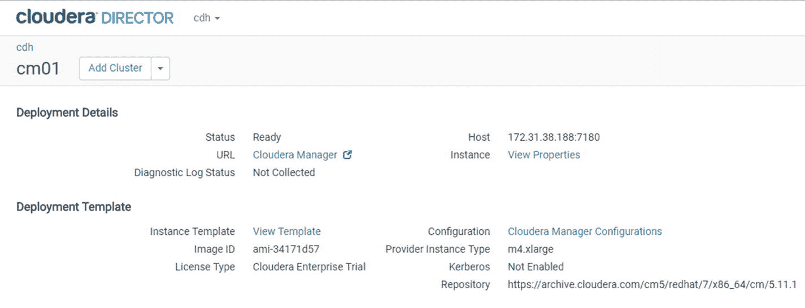

图 12-16

Cloudera Director Dashboard – Cloudera Manager Details

或者，您可以单击 Cloudera Enterprise 集群的名称来获取关于该集群的更多信息，例如已安装的服务和实例组状态(参见图 [12-17](#Fig17) )。

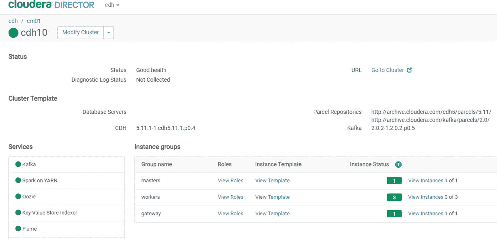

图 12-17

Cloudera Director Dashboard – Cluster Details

单击链接“转到集群”打开 Cloudera Manager。你会看到 Cloudera Manager 主页，如图 [12-18](#Fig18) 所示。

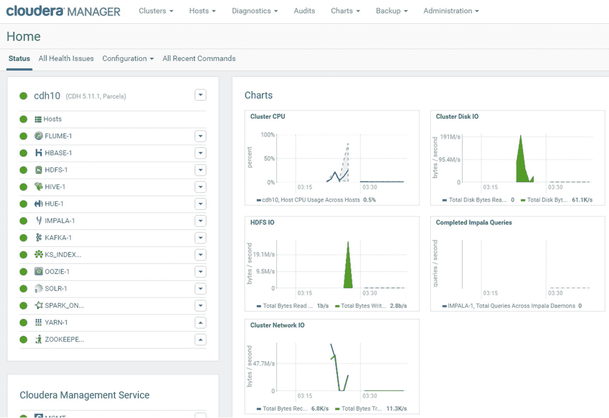

图 12-18

Cloudera Manager main page

导航到“主机”选项卡以获取集群节点列表(参见图 [12-19](#Fig19) )。


图 12-19

All Hosts

展开“角色”以获得每个节点上运行的服务列表(参见图 [12-20](#Fig20) )。

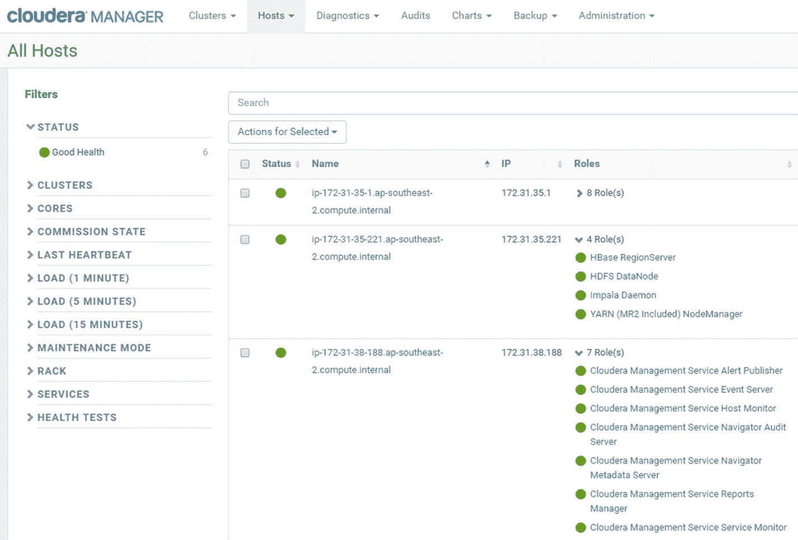

图 12-20

All Host – Roles

恭喜你！您刚刚使用 Cloudera Director 在 AWS 中安装了一个测试 Cloudera 企业集群。

#### Azure 和 GCP 上的 Cloudera 企业

有关如何在 Azure 和 GCP 上部署 Cloudera 的详细信息，请参考 Cloudera Director 用户指南。 [<sup>xxvi</sup>](#Sec35) 技术可能不同，但在 AWS 上部署 Cloudera Enterprise 中讨论的大部分概念也适用于 Azure 和 GCP。

Note

在 Microsoft Azure 上运行 Kudu 时，您可能会遇到 ntp [<sup>xxvii</sup>](#Sec35) 的问题。禁用时间同步应该可以解决这个问题。

#### 云是时候了

根据 Cloudera 的说法，cloud era Altus[<sup>XXVIII</sup>](#Sec35)是一种“平台即服务，可以轻松、经济地在云中处理大规模数据集。”它面向数据工程师，支持在 Spark、Hive on Spark、Hive on MapReduce 和 MapReduce 中创建的数据管道的提交和执行。数据工程师不需要担心创建集群，因为集群是按需自动创建的。您按小时、工作节点的数量以及您为集群选择的 AWS EC2 实例类型付费。 [<sup>xxix</sup>](#Sec35) 目前，Cloudera Altus 只在 AWS 上运行，但对 Azure 的支持即将推出。

如果您曾经使用 Cloudera Director 创建过临时集群来运行您的 ETL 管道，请将 Cloudera Altus 视为一个更加简化和自动化的版本。Cloudera Altus 在很多方面与亚马逊 EMR 相似。

#### 亚马逊弹性映射减少(EMR)

Amazon EMR 是第一个允许用户使用 EC2 实例在云中动态运行临时集群的服务。EMR 允许用户访问其他亚马逊服务，并将数据存储在亚马逊数据存储上，如 DynamoDB 和 S3。 [<sup>xxx</sup>](#Sec35) EMR 享有显著的市场份额，目标是具有瞬时大数据工作负载的公司。

#### 大数据

Databricks 是另一个基于云的大数据平台。由在加州大学伯克利分校 AMPLab 创建 Apache Spark 的同一团队于 2013 年创建。虽然除了 Spark (Hive 和 MapReduce)，Amazon 和 Cloudera 还提供了其他数据处理框架，但 Databricks 主要专注于 Spark。Databricks 最近又筹集了 1.4 亿美元的风险资金，使该公司筹集的资金总额达到 2.47 亿美元， [<sup>xxxi</sup>](#Sec35) 使其有足够的资金与 Cloudera、亚马逊、MapR 和 Hortonworks 等其他大数据平台竞争。

## 摘要

云中的大数据部署可以帮助组织更快、更便宜、更有效地从数据中获取价值。然而，并非所有的平台都是平等的。有些比其他的功能更多。有些提供了更多的灵活性。有些比较好用。在为您的组织选择合适的大数据和云平台时，有很多选择。我希望我在本章提供的信息能帮助你做出正确的决定。

## 参考

1.  Cloudera《面向 AWS 部署的 Cloudera 企业参考架构》，Cloudera，2017， [`http://www.cloudera.com/documentation/other/reference-architecture/PDF/cloudera_ref_arch_aws.pdf`](http://www.cloudera.com/documentation/other/reference-architecture/PDF/cloudera_ref_arch_aws.pdf)
2.  Cloudera《面向 Azure 部署的 Cloudera 企业参考架构》，Cloudera，2017， [`http://www.cloudera.com/documentation/other/reference-architecture/PDF/cloudera_ref_arch_azure.pdf`](http://www.cloudera.com/documentation/other/reference-architecture/PDF/cloudera_ref_arch_azure.pdf)
3.  Cloudera《Google 云平台部署的 Cloudera 企业参考架构》，Cloudera，2017， [`http://www.cloudera.com/documentation/other/reference-architecture/PDF/cloudera_ref_arch_gcp.pdf`](http://www.cloudera.com/documentation/other/reference-architecture/PDF/cloudera_ref_arch_gcp.pdf)
4.  沃尔夫，达米安；“三方云战谁胜？谷歌 vs. Azure vs. AWS，《ReadWrite，2017， [`https://readwrite.com/2017/02/20/wins-three-way-cloud-battle-google-vs-azure-vs-aws-dl1/`](https://readwrite.com/2017/02/20/wins-three-way-cloud-battle-google-vs-azure-vs-aws-dl1/)
5.  RightScale《RIGHTSCALE 2017 年云状况报告揭示云采用趋势》，RIGHTSCALE，2017， [`https://www.rightscale.com/press-releases/rightscale-2017-state-of-the-cloud-report-uncovers-cloud-adoption-trends`](https://www.rightscale.com/press-releases/rightscale-2017-state-of-the-cloud-report-uncovers-cloud-adoption-trends)
6.  RightScale《RIGHTSCALE 2017 年云状况报告揭示云采用趋势》，RIGHTSCALE，2017， [`https://www.rightscale.com/press-releases/rightscale-2017-state-of-the-cloud-report-uncovers-cloud-adoption-trends`](https://www.rightscale.com/press-releases/rightscale-2017-state-of-the-cloud-report-uncovers-cloud-adoption-trends)
7.  谷歌；《地图 AWS 服务到谷歌云平台产品》，谷歌，2017， [`https://cloud.google.com/free/docs/map-aws-google-cloud-platform`](https://cloud.google.com/free/docs/map-aws-google-cloud-platform)
8.  谷歌；《谷歌云平台产品的地图 Azure 服务》，谷歌，2017， [`https://cloud.google.com/free/docs/map-azure-google-cloud-platform`](https://cloud.google.com/free/docs/map-azure-google-cloud-platform)
9.  RightScale《RIGHTSCALE 2017 年云状况报告揭示云采用趋势》，RIGHTSCALE，2017， [`https://www.rightscale.com/press-releases/rightscale-2017-state-of-the-cloud-report-uncovers-cloud-adoption-trends`](https://www.rightscale.com/press-releases/rightscale-2017-state-of-the-cloud-report-uncovers-cloud-adoption-trends)
10.  Cloudera《Cloudera 企业在云端》，Cloudera，2016， [`http://www.clouderaworldtokyo.com/session-download/B5-ClouderaUpdateNov2016.pdf`](http://www.clouderaworldtokyo.com/session-download/B5-ClouderaUpdateNov2016.pdf)
11.  Cloudera《Cloudera 企业在云端》，Cloudera，2016， [`http://www.clouderaworldtokyo.com/session-download/B5-ClouderaUpdateNov2016.pdf`](http://www.clouderaworldtokyo.com/session-download/B5-ClouderaUpdateNov2016.pdf)
12.  Cloudera《Cloudera 企业在云端》，Cloudera，2016， [`http://www.clouderaworldtokyo.com/session-download/B5-ClouderaUpdateNov2016.pdf`](http://www.clouderaworldtokyo.com/session-download/B5-ClouderaUpdateNov2016.pdf)
13.  Cloudera《Cloudera Director API 客户端》，Cloudera，2018， [`https://github.com/cloudera/director-sdk`](https://github.com/cloudera/director-sdk)
14.  Cloudera《面向 AWS 部署的 Cloudera 企业参考架构》，Cloudera，2018， [`http://www.cloudera.com/documentation/other/reference-architecture/PDF/cloudera_ref_arch_aws.pdf`](http://www.cloudera.com/documentation/other/reference-architecture/PDF/cloudera_ref_arch_aws.pdf)
15.  Cloudera《面向 AWS 部署的 Cloudera 企业参考架构》，Cloudera，2018， [`http://www.cloudera.com/documentation/other/reference-architecture/PDF/cloudera_ref_arch_aws.pdf`](http://www.cloudera.com/documentation/other/reference-architecture/PDF/cloudera_ref_arch_aws.pdf)
16.  亚马逊；《亚马逊虚拟私有云概述》，亚马逊，2018， [`http://docs.aws.amazon.com/AmazonVPC/latest/GettingStartedGuide/ExerciseOverview.html`](http://docs.aws.amazon.com/AmazonVPC/latest/GettingStartedGuide/ExerciseOverview.html)
17.  Cloudera《面向 AWS 部署的 Cloudera 企业参考架构》，Cloudera，2018， [`http://www.cloudera.com/documentation/other/reference-architecture/PDF/cloudera_ref_arch_aws.pdf`](http://www.cloudera.com/documentation/other/reference-architecture/PDF/cloudera_ref_arch_aws.pdf)
18.  Cloudera《面向 AWS 部署的 Cloudera 企业参考架构》，Cloudera，2018， [`http://www.cloudera.com/documentation/other/reference-architecture/PDF/cloudera_ref_arch_aws.pdf`](http://www.cloudera.com/documentation/other/reference-architecture/PDF/cloudera_ref_arch_aws.pdf)
19.  Cloudera《为 Cloudera Director 创建 EC2 实例》，Cloudera，2018， [`https://www.cloudera.com/documentation/director/1-5-x/topics/director_deployment_start_launcher.html`](https://www.cloudera.com/documentation/director/1-5-x/topics/director_deployment_start_launcher.html)
20.  Cloudera《面向 AWS 部署的 Cloudera 企业参考架构》，Cloudera，2018， [`http://www.cloudera.com/documentation/other/reference-architecture/PDF/cloudera_ref_arch_aws.pdf`](http://www.cloudera.com/documentation/other/reference-architecture/PDF/cloudera_ref_arch_aws.pdf)
21.  GitHub“S3BinaryCacheStore 最终是一致的”，GitHub，2018， [`https://github.com/NixOS/nix/issues/1420`](https://github.com/NixOS/nix/issues/1420)
22.  Cloudera《如何在顺化启用 S3 云存储》，Cloudera，2018， [`https://www.cloudera.com/documentation/enterprise/5-11-x/topics/hue_use_s3_enable.html`](https://www.cloudera.com/documentation/enterprise/5-11-x/topics/hue_use_s3_enable.html)
23.  Cloudera《S3Guard 简介:Apache Hadoop 的 S3 一致性》，Cloudera，2018， [`https://blog.cloudera.com/blog/2017/08/introducing-s3guard-s3-consistency-for-apache-hadoop/`](https://blog.cloudera.com/blog/2017/08/introducing-s3guard-s3-consistency-for-apache-hadoop/)
24.  Cloudera《面向 AWS 部署的 Cloudera 企业参考架构》，Cloudera，2018， [`http://www.cloudera.com/documentation/other/reference-architecture/PDF/cloudera_ref_arch_aws.pdf`](http://www.cloudera.com/documentation/other/reference-architecture/PDF/cloudera_ref_arch_aws.pdf)
25.  Cloudera《Cloudera Director 用户指南》，Cloudera，2018， [`https://www.cloudera.com/documentation/director/latest/PDF/cloudera-director.pdf`](https://www.cloudera.com/documentation/director/latest/PDF/cloudera-director.pdf)
26.  Cloudera《Cloudera Director 用户指南》，Cloudera，2018， [`https://www.cloudera.com/documentation/director/latest/PDF/cloudera-director.pdf`](https://www.cloudera.com/documentation/director/latest/PDF/cloudera-director.pdf)
27.  Cloudera“酷度服务频繁宕机”，Cloudera，2018， [`https://community.cloudera.com/t5/Interactive-Short-cycle-SQL/kudu-service-are-getting-down-frequently/m-p/56122`](https://community.cloudera.com/t5/Interactive-Short-cycle-SQL/kudu-service-are-getting-down-frequently/m-p/56122)
28.  Cloudera《Cloudera 奥特斯云 PaaS》，Cloudera，2018， [`https://www.cloudera.com/products/altus.html`](https://www.cloudera.com/products/altus.html)
29.  ZDNet“Cloudera 推出 Altus，提供 Hadoop jobs 即服务”，Cloudera，2018， [`http://www.zdnet.com/article/cloudera-introduces-altus-offering-hadoop-jobs-as-a-service/`](http://www.zdnet.com/article/cloudera-introduces-altus-offering-hadoop-jobs-as-a-service/)
30.  亚马逊；《亚马逊电子病历》，Cloudera，2018， [`https://aws.amazon.com/emr/`](https://aws.amazon.com/emr/)
31.  商业内幕；“成立四年的初创公司 Databricks 又筹集了 1.4 亿美元来解决 AI 中最难的问题，”BusinessInsider，2017， [`https://www.businessinsider.com.au/databricks-ai-funding-valuation-2017-8?r=US&IR=T`](https://www.businessinsider.com.au/databricks-ai-funding-valuation-2017-8%3Fr=US%26IR=T)