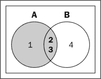
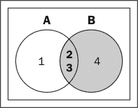
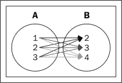

# 第五章。数据转换模式

在上一章中，您了解了与数据验证和清理相关的各种模式，从中您了解到有许多方法可以检测和删除数据中不正确或不准确的记录。当数据验证和清理完成时，甚至在数据被用于分析生命周期的下一步之前，数据中的不一致性就被识别出来了。然后，替换、修改或删除不一致的数据，使其更加一致。

在本章中，您将了解与数据转换相关的各种设计模式，例如结构化到分层、标准化、集成、聚合和一般化的设计模式。

# 数据转换过程

数据转换的过程是大数据分析知识发现过程的基本组成部分之一，也是至关重要的一步。数据转换是一个迭代的过程，将源数据修改成一种格式，使分析算法得到有效应用。通过确保以有利于应用程序分析的格式存储和检索数据，转换提高了算法的性能和准确性。这是通过提高源数据的整体质量来实现的。

大数据的数据转换主要包括以下主要过程:

*   **归一化**:本次变换对属性数据进行缩放，使其在指定范围内。通常，属性值被转换为适合 0 到 1 之间的范围。这是为了消除某些属性对分析的一些不必要的影响。规范化转换不同于关系数据库设计中使用的第一、第二和第三范式。
*   **聚合**:这个转换执行数据聚合操作，比如从每日的股票数据计算出月度和年度汇总，从而创建一个多维度和粒度分析的数据立方体。
*   **泛化**:在的变换中，使用概念层次将低级原始数据替换为更高级的抽象。例如，根据分析用例，低层数据(如街道)可以被高层抽象(如城市或州)所替代。
*   **数据集成**:是将多个结构相似或不相似的输入管道的数据连接成单个输出管道的过程。

以下部分详细描述了最常用的 Pig 设计模式，这些模式有助于数据转换。

# 从结构化到分层的转换模式

结构到层次的转换模式通过从结构化数据生成层次结构(如 XML 或 JSON)来处理数据转换。

## 背景

从结构到层次的转换模式创建了一个新的层次结构，比如 JSON 或 XML，数据存储在一个扁平的类似行的结构中。这是一种创建新记录的数据转换模式。与原始记录相比，新记录以不同的结构表示。

## 动机

Hadoop 擅长整合多个来源的数据，但要及时进行分析连接，始终是一项复杂耗时的操作。

为了高效地执行某些类型的分析(如日志文件分析)，数据有时不需要以标准化的形式存储在 Hadoop 中。将标准化数据存储在多个表中会产生一个额外的步骤，将所有数据连接在一起以对它们进行分析—连接通常在标准化结构化数据上执行，以将来自多个源的数据与外键关系集成在一起。

相反，原始数据通过反规格化分层嵌套。这种数据预处理将确保高效分析。

NoSQL 数据库，如 HBase、Cassandra 或 MongoDB，有助于将平面数据存储在列族或 JSON 对象中。Hadoop 可用于以批处理模式集成来自多个来源的数据，并创建可轻松插入这些数据库的分层数据结构。

## 用例

这种设计模式主要适用于集成来自多个独立数据源的结构化和基于行的数据。这种集成的具体目标是将数据转换成层次结构，以便可以分析数据。

这种模式对于将单个源中的数据转换成层次结构，然后使用层次结构将数据加载到柱状数据库和 JSON 数据库中也很有用。

## 模式实现

Pig 对元组和包形式的分层数据有现成的支持，用于在一行中表示嵌套对象。`COGROUP`运算符将数据分组为一个或多个关系，并创建输出元组的嵌套表示。

这种设计模式在 Pig 中作为独立的脚本实现。该脚本通过从结构化格式生成数据的分层表示来演示这种模式的用法。这个脚本加载一个非规范化的 CSV 文件，并将其传递给一个自定义的 Java UDF。Java UDF 使用`XMLParser`来构建一个 XML 文件。自定义存储函数以 XML 格式存储结果。

## 代码片段

为了说明该模型的工作原理，我们考虑存储在 HDFS 的制造数据集。文件`production_all.csv`包含从`production.csv`和`manufacturing_units.csv`导出的反规格化数据。我们将把结构化数据从 CSV 格式转换成层次化的 XML 格式。

猪脚本从结构化到分层的设计模式如下:

```sh
/*
Register the piggybank jar and generateStoreXml jar, it is a custom storage function which generates an XML representation and stores it
*/
REGISTER '/home/cloudera/pdp/jars/generateStoreXml.jar';
REGISTER '/usr/share/pig/contrib/piggybank/java/piggybank.jar';

/*
Load the production dataset into the relation production_details
*/
production_details = LOAD'/user/cloudera/pdp/datasets/data_transformation/production_all.csv' USING  PigStorage(',') AS(production_date,production_hours,manufacturing_unit_id,manufacturing_unit_name,currency,product_id,product_name,quantity_produced);

/*
Call the custom store function TransformStoreXML to transform the contents into a hierarchical representation i.e XML and to store it in the directory structured_to_hierarchical
*/
STORE production_details INTO'/user/cloudera/pdp/output/data_transformation/structured_to_hierarchical' USINGcom.xmlgenerator.TransformStoreXML('production_details','production_data');
```

以下是之前的 Pig 脚本用来执行结构到层次转换的 Java UDF 的片段:

```sh
  /**
   * data from tuple is appended to xml root element
   * @param tuple
   */
  protected void write(Tuple tuple)
  {
    // Retrieving all fields from the schema
    ResourceFieldSchema[] fields = schema.getFields();
    //Retrieve values from tuple
    List<Object> values = tuple.getAll();
    /*Creating xml element by using fields as element tag 
and tuple value as element value*/
    Element transactionElement =xmlDoc.createElement(TransformStoreXML.elementName);
    for(int counter=0;counter<fields.length;counter++)
    {
      //Retrieving element value from values
      String columnValue = String.valueOf(values.get(counter));
      //Creating element tag from fields
      Element columnName = xmlDoc.createElement(fields[counter].getName().toString().trim());
      //Appending value to element tag

      columnName.appendChild(xmlDoc.createTextNode(columnValue));
      //Appending element to transaction element
        transactionElement.appendChild(columnName);    
    }
    //Appending transaction element to root element
    rootElement.appendChild(transactionElement);
  }
```

## 结果

以下是对输入执行代码后生成的 XML 文件的片段:

```sh
<?xml version="1.0" encoding="UTF-8" standalone="no" ?>
<production_details>
  <production_data>
    <production_date>2011-01-01T00:00:00</production_date>
    <production_hours>7</production_hours>
    <manufacturing_unit_id>1</manufacturing_unit_id>
    <manufacturing_unit_name>unit1</manufacturing_unit_name>
    <currency>USD</currency>
    <product_id>C001</product_id>
    <product_name>Refrigerator 180L</product_name>
    <quantity_produced>49</quantity_produced>
  </production_data>
  <production_data>
    .
    .
    .

  </production_data>
  .
  .
  .
</production_details>
```

## 附加信息

本节的完整代码和数据集位于以下 GitHub 目录中:

*   `Chapter5/code/`
*   `Chapter5/datasets/`

# 数据归一化模式

数据标准化设计模式讨论了数据值标准化或规范化的方法。

## 背景

数据标准化是指将在不同尺度上测量的数据值拟合、调整或缩放到概念上的共同范围。举一个简单的例子，将数据集与不同的距离测量单位(如公里和英里)连接起来，当它们不标准化时，可以提供不同的结果。因此，它们被标准化，使它们返回到一个共同的单位，如公里或英里，这样不同测量单位的影响就不会被分析所感觉到。

## 动机

大数据中集成多个数据源时，在同一个数据属性中遇到不同的值是很常见的。

数据预处理和转换是通过标准化原始数据并将其缩放到指定范围(例如，0 到 1 的范围)以及为所有属性分配相等的权重来执行的。在标准化数据之前，从数据中移除任何异常值。当分析可能受到较高范围内测量单位和值的选择的影响时，需要数据标准化。

规范化用于分析，如聚类，这是一种基于距离的方法，可防止值较高的属性支配值较小的属性。标准化数字和非数字数据的技术如下:

*   **Normalizing numeric data**: Numeric data is normalized using methods such as min-max normalization, thus transforming the data to a value between a specified range [newMin, newMax]. The minValue and maxValue are usually identified from the dataset and the normalization is done by applying the following formula for each value:

    Normalized value = [(value-minimum)/(maximum-minimum)) * (new maximum-new minimum)+new minimum]

*   **归一化非数值数据**:非数值数据首先转换为数值数据，然后归一化。例如，如果评级属性的值可以是优秀、非常好、良好、一般、低于一般、差或最差，则可以将其转换为 1 到 7 之间的数值；因此，这些值可以被归一化以适合模型。

## 用例

可以考虑用这个设计模式作为预处理技术进行分析。这种模式可以用于用例分析，以避免初始值较高的属性和初始值较低的属性之间的对比。

这种模式可以被视为封装原始数据的一种方法，因为它通过规范化来转换原始数据。

## 模式实现

这个设计模式在 Pig 中作为独立脚本实现。用例识别给定产品的相似制造单元；它显示了标准化。该脚本为产品`C001`的每个制造单元加载数据并计算`total produced quantity`和`total production hours`。每个制造单元由`product`、`total produced quantity`和`total production hours`表示。该脚本使用最小-最大归一化技术归一化`total number of units produced`和`total production hours`，以便将所有值设置为相同的比率(范围从 0 到 1)。然后，脚本计算这些点之间的欧几里德距离。距离越小，制造单位越相似。

## 代码片段

为了说明该模型的工作原理，我们考虑存储在 HDFS 的制造数据集。文件`production.csv`包含各制造单元的生产信息；该文件包含`production_date`、`production_hours`、`manufacturing_unit_id`、`product_id`、`produced_quantity`等属性。我们将为产品`C001`的每个制造单元计算`total produced quantity`和`total production hours`，如下代码所示:

```sh
/*
Load the production dataset into the relation production
*/
production = LOAD'/user/cloudera/pdp/datasets/data_transformation/production.csv' USING PigStorage(',') AS(production_date:datetime,production_hours:int,manufacturing_unit_id:chararray,product_id:chararray,produced_quantity:int);

/*
Filter the relation products to fetch the records with product id C001
*/
production_filt = FILTER production BY product_id=='C001';

/*
Calculate the total production hours and total produced quantity of product C001 in each manufacturing unit
*/
production_grpd = GROUP production_filt BY(manufacturing_unit_id,product_id);
production_sum = FOREACH production_grpd GENERATE group.$0 ASmanufacturing_unit_id, group.$1 AS product_id,(float)SUM(production_filt.production_hours) ASproduction_hours,(float)SUM(production_filt.produced_quantity)AS produced_quantity;

/*
Apply Min max normalization on total production hours and total produced quantity for each manufacturing unit to scale the data to fit in the range of [0-1]
*/
production_sum_grpd = GROUP production_sum ALL;
production_min_max = FOREACH production_sum_grpd GENERATEMIN(production_sum.production_hours)-1 ASmin_hour,MAX(production_sum.production_hours)+1 AS max_hour,MIN(production_sum.produced_quantity)-1 AS min_qty,MAX(production_sum.produced_quantity)+1 AS max_qty;
production_norm = FOREACH production_sum 
{
  norm_production_hours = (float)(((production_hours -production_min_max.min_hour)/(production_min_max.max_hour -production_min_max.min_hour))*(1-0))+1;
  norm_produced_quantity = (float)(((produced_quantity -production_min_max.min_qty)/(production_min_max.max_qty -production_min_max.min_qty))*(1-0))+1;
  GENERATE manufacturing_unit_id AS manufacturing_unit_id,product_id AS product_id, norm_production_hours ASproduction_hours, norm_produced_quantity AS produced_quantity;
}
prod_norm = FOREACH production_norm GENERATE manufacturing_unit_idAS manufacturing_unit_id,product_id ASproduct_id,production_hours ASproduction_hours,produced_quantity AS produced_quantity;

/*
Calculate the Euclidean distance to find out similar manufacturing units w.r.t the product C001
*/
manufacturing_units_euclidean_distance  = FOREACH (CROSS production_norm,prod_norm) {
distance_between_points = (production_norm::production_hours -prod_norm::production_hours)*(production_norm::production_hours -prod_norm::production_hours) +(production_norm::produced_quantity -prod_norm::produced_quantity)*(production_norm::produced_quantity - prod_norm::produced_quantity);
GENERATE  production_norm::manufacturing_unit_id,production_norm::product_id,prod_norm::manufacturing_unit_id,prod_norm::product_id,SQRT(distance_between_points) as dist;         
};

/*
The results are stored on the HDFS in the directory data_normalization
*/
STORE manufacturing_units_euclidean_distance INTO'/user/cloudera/pdp/output/data_transformation/data_normalization';
```

## 结果

以下是对输入执行代码后生成的结果片段:

```sh
1  C001  1  C001  0.0
1  C001  3  C001  1.413113776343348
1  C001  5  C001  0.2871426024640011
3  C001  1  C001  1.413113776343348
3  C001  3  C001  0.0
3  C001  5  C001  1.1536163027782005
5  C001  1  C001  0.2871426024640011
5  C001  3  C001  1.1536163027782005
5  C001  5  C001  0.0
```

制造单位之间的相似度是为一个产品(`C001`)计算的。如前所示，制造单元`1`和`5`与产品`C001`相似，因为它们之间的距离小于其他单元之间的距离。

## 附加信息

本节的完整代码和数据集位于以下 GitHub 目录中:

*   `Chapter5/code/`
*   `Chapter5/datasets/`

# 数据整合模式

数据集成模式处理的是多来源数据集成的方法，以及解决此活动产生的数据不一致的技术。

## 背景

这个模型讨论了整合多个来源的数据的方法。数据集成有时会导致数据不一致。例如，不同的数据源可能使用不同的测量单位。解决数据不一致的集成模式处理技术。

## 动机

对于许多大数据解决方案来说，数据存在于不同的地方是很常见的，例如 SQL 表、日志文件和 HDFS。为了发现不同地方的数据之间令人兴奋的关系，有必要从不同的来源获取和整合这些数据。另一方面，这种来自多个来源的数据集成有时会导致数据不一致。的数据集成通过添加更多的属性并赋予它更多的意义和上下文来丰富它。它还可以通过删除不必要的细节来过滤数据。

数据集成主要通过连接操作来实现。联接操作基于名为外键的字段集成多个数据集中的记录。外键是表中等于另一个表的列的字段。它被用作表间交叉引用的手段。虽然这个操作在 SQL 中相当简单，但是 MapReduce 的工作方式使它成为 Hadoop 上最昂贵的操作之一。

以下示例以两个数据集 A 和 B 为例，说明了理解不同类型联接的简单方法。下图显示了每个数据集中的值。


以下是可以在数据集上执行的不同类型的连接:

*   **Inner join**: When this is performed on two datasets, all the matching records from both the datasets are returned. As shown in the following figure, it returns the matching records (**2**, **3**) from both the datasets.

    

*   **Left outer join**: When this is performed on two datasets, all the matching records from both the datasets are returned along with the unmatched records from the dataset on the left-hand side. As shown in the following figure, the matched records (**2**, **3**) along with the unmatched record in the dataset to the left (**1**) are returned.

    

*   **Right outer join**: When this is performed on two datasets, all the matching records from both the tables are returned along with the unmatched records from the dataset on the right-hand side. As shown in the following figure, the matched records (**2**, **3**) along with the unmatched record in the dataset to the right (**4**) are returned.

    

*   **Full outer join**: When this is applied on two datasets, all the matching records from both the tables are returned along with the unmatched records from both tables. As shown in the following figure, the matched records (**2**, **3**) along with unmatched records in both the datasets (**1**, **4**) are returned.

    

*   **Cartesian join**: When the Cartesian join is performed on two datasets, each record from the first dataset and all the records of the second dataset are joined together. As shown in the following figure, the result would be (**1**, **2**), (**1**, **3**), (**1**, **4**), (**2**, **2**), (**2**, **3**), (**2**, **4**), (**3**, **2**), (**3**, **3**), and (**3**, **4**).

    

组合来自多个来源的数据可能会导致数据不一致。不同的数据源可能使用不同的度量单位。例如，假设有两个数据源，并且每个数据源使用不同的货币，例如美元对欧元。因此，这两个来源整合的数据是不一致的。另一个问题是，每个源中的数据可能以不同的方式表示，例如真/假是/否。您必须使用数据转换来解决这些不一致。

在清管器中执行连接操作有两种主要技术:

*   **递减末端连接**: 【T2】第一种技术在 MapReduce 术语中称为递减末端连接。它在几个具有外键关系的大型数据集上使用默认连接运算符。该技术执行任何类型的连接操作(内部、外部、右侧、左侧等)。)对数据集的影响。此外，它可以同时处理多个数据集。这种连接操作最大的缺点就是会给网络带来巨大的负载，因为所有被连接的数据都是先进行排序，然后再发送给减速器，这就减缓了这种操作的执行速度。
*   **复制连接:** 第二种技术叫复制连接，使用`replicated`关键字和`Join`运算符语法。这种连接技术适用于非常大的数据集和许多小数据集。在内部，这种连接只在映射器端执行，不需要额外的数据排序和洗牌。复制允许 Pig 向每个节点分发一个小数据集(小到足以容纳内存)，这样数据集就可以直接连接到地图作业，从而消除了减少作业的需要。复制中并不支持所有类型的连接；它只支持内部连接和左侧外部连接。

## 用例

您可以考虑在以下场景中使用这种设计模式:

*   当您需要在应用分析之前组合来自多个来源的数据时
*   通过反规格化数据减少处理时间；去规范化可以通过将事务数据集与其关联的主数据集连接来实现。
*   转换数据，解决数据集成带来的数据不一致。
*   使用特定连接过滤数据。

## 模式实现

这个设计模式在 Pig 中作为独立脚本实现。它结合了所有制造单元的生产信息，通过转换数据来解决数据不一致的问题，并找出每个单元是否发挥了最佳性能。

该脚本首先加载每个制造单元的数据，并使用`UNION`进行组合。然后，它通过将连接应用于生产数据集及其主数据集来反规格化数据，以获得`manufacturing unit`和`product details`。它实现了复制连接，将一个巨大的生产数据集与一个更小的名为 products 的数据集连接起来。一个单位使用印度卢比作为其货币；这导致数据不一致。该脚本通过将单位的制造成本属性(以印度卢比表示)转换为美元来解决这种不一致。

然后，脚本将每个单元的`the actual quantity produced`与 `expected quantity`进行比较，以确定每个单元是否具有最佳性能。

## 代码片段

为了说明该模型的工作原理，我们考虑存储在 HDFS 的制造数据集。它包含三个主要文件；`manufacturing_units.csv`包含每个制造单元的信息，`products.csv`包含制造产品的详细信息，`manufacturing_units_products.csv`存储不同制造单元制造的产品的详细信息。生产数据集对于每个制造单元都有一个单独的生产文件；该文件包含 T3、T4、T5、T6 和 T7 等属性。下面的代码是 Pig 脚本，它演示了这种模式的实现:

```sh
/*
Load the production datasets of five manufacturing units into the relations
*/
production_unit_1 = LOAD'/user/cloudera/pdp/datasets/data_transformation/production_unit_1.csv' USING PigStorage(',') AS(production_date:datetime,production_hours:int,manufacturing_unit_id:chararray,product_id:chararray,produced_quantity:int);
production_unit_2 = LOAD'/user/cloudera/pdp/datasets/data_transformation/production_unit_2.csv' USING PigStorage(',') AS(production_date:datetime,production_hours:int,manufacturing_unit_id:chararray,product_id:chararray,produced_quantity:int);
production_unit_3 = LOAD'/user/cloudera/pdp/datasets/data_transformation/production_unit_3.csv' USING PigStorage(',') AS(production_date:datetime,production_hours:int,manufacturing_unit_id:chararray,product_id:chararray,produced_quantity:int);
production_unit_4 = LOAD'/user/cloudera/pdp/datasets/data_transformation/production_unit_4.csv' USING PigStorage(',') AS(production_date:datetime,production_hours:int,manufacturing_unit_id:chararray,product_id:chararray,produced_quantity:int);
production_unit_5 = LOAD'/user/cloudera/pdp/datasets/data_transformation/production_unit_5.csv' USING PigStorage(',') AS(production_date:datetime,production_hours:int,manufacturing_unit_id:chararray,product_id:chararray,produced_quantity:int);

/*
Combine the data in the relations using UNION operator
*/
production = UNIONproduction_unit_1,production_unit_2,production_unit_3,production_unit_4,production_unit_5;

/*
Load manufacturing_unit and manufacturing_units_products datasets
*/
manufacturing_units_products = LOAD'/user/cloudera/pdp/datasets/data_transformation/manufacturing_units_products.csv' USING PigStorage(',') AS(manufacturing_unit_id:chararray,product_id:chararray,capacity_per_hour:int,manufacturing_cost:float);
manufacturing_units = LOAD'/user/cloudera/pdp/datasets/data_transformation/manufacturing_units.csv' USING PigStorage(',') AS(manufacturing_unit_id:chararray,manufacturing_unit_name:chararray,manufacturing_unit_city:chararray,country:chararray,currency:chararray);

/*
Use replicated join to join the relation production, which is huge with a smaller relation manufacturing_units_products.
The relations manufacturing_units_products and manufacturing units are small enough to fit into the memory
*/
replicated_join = JOIN production BY(manufacturing_unit_id,product_id),manufacturing_units_products BY(manufacturing_unit_id,product_id) USING 'replicated';
manufacturing_join = JOIN replicated_join BYproduction::manufacturing_unit_id, manufacturing_units BYmanufacturing_unit_id USING 'replicated';

/*
Identify varying representation of currency and transform the values in the attribute manufacturing_cost to USD for the units that have INR as currency
*/
transformed_varying_values = FOREACH manufacturing_join GENERATE$0 AS production_date,$2 AS manufacturing_unit_id,$3 ASproduct_id,$4 AS actual_quantity_produced,($1*$7) AS expected_quantity_produced,(float)((($13 == 'INR') ?($8/60) : $8)*$4) AS manufacturing_cost;

/*
Calculate the expected quantity to be produced, actual quantity produced, percentage, total manufacturing cost for each month for each manufacturing unit and product to identify how each unit is performing
*/
transformed_varying_values_grpd = GROUP transformed_varying_valuesBY (GetMonth($0),manufacturing_unit_id,product_id);
quantity_produced = FOREACH transformed_varying_values_grpd 
{
  expected_quantity_produced =SUM(transformed_varying_values.expected_quantity_produced);
  actual_quantity_produced =SUM(transformed_varying_values.actual_quantity_produced);
  percentage_quantity_produced =100*actual_quantity_produced/expected_quantity_produced;
  manufacturing_cost =SUM(transformed_varying_values.manufacturing_cost);
  GENERATE group.$0 AS production_month,group.$1 ASmanufacturing_unit_id,group.$2 ASproduct_id,expected_quantity_produced ASexpected_quantity_produced,actual_quantity_produced ASactual_quantity_produced,percentage_quantity_produced ASpercentage_quantity_produced,ROUND(manufacturing_cost) ASmanufacturing_cost;
}

/*
Sort the relation by the percentage of quantity produced
*/
ordered_quantity_produced = ORDER quantity_produced BY $5 DESC;

/*
The results are stored on the HDFS in the directory data_integration
*/
STORE ordered_quantity_produced INTO '/user/cloudera/pdp/output/data_transformation/data_integration';
```

## 结果

以下是对输入执行代码后生成的结果片段:

```sh
6  2  C003  2400  2237	93  894800
10  2  C004  1984  1814  91  816300
12  3  L002  74400  66744  89  33372
```

第一列显示`month`，第二列为`manufacturing unit id`，第三列代表`product id`。`Expected quantity to be produced`、`actual quantity produced`、`percentage`、`total manufacturing cost per month`；所有这些都是根据每个单位的月度表现来计算的。

## 附加信息

本节的完整代码和数据集位于以下 GitHub 目录中:

*   `Chapter5/code/`
*   `Chapter5/datasets/`

# 聚合模式

聚合设计模式探索了 Pig 通过对数据应用聚合或聚合操作来转换数据的用法。

## 背景

聚合提供数据的汇总和高级视图。将多个属性聚合为一个属性，从而通过将一组记录视为单个记录或不关注不重要记录的子部分来减少记录总数。数据聚合可以在不同的粒度级别上执行。

数据聚合保持了数据的完整性，尽管结果数据集的体积比原始数据集小。

## 动机

数据聚合在大数据中起着关键作用，因为海量的数据本来就很难提供太多的整体信息。而是每天收集数据，然后汇总成周数据；每周的数据可以汇总成一个月的值，依此类推。此数据模式出现，可用于分析。一个简单的例子是细分年龄组，根据特定属性(如按年龄购买)获取特定群体的更多信息。这种使用特定属性聚合数据的能力可以快速为进一步分析提供有价值的见解。

有各种技术来聚合数据。聚合数据的基础技术有`SUM`、`AVG`、`COUNT`；先进技术包括`CUBE`和`ROLLUP`。

`CUBE`和`ROLLUP`在很多方面都很相似，都是汇总数据产生单个结果集。`ROLLUP`从小到大，计算不同级别的总量，如`SUM`、`COUNT`、`MAX`、`MIN`、`AVG`。

`CUBE`使用所选列中所有可能的值组合，启用来计算`SUM`、`COUNT`、`MAX`、`MIN`和`AVG`。一旦在一组列上计算了此聚合，它就可以提供这些维度上所有可能的聚合问题的结果。

## 用例

您可以考虑使用这种设计模式来生成数据的汇总表示。我们将看几个需要用摘要或摘要信息替换数据的场景。这种聚合是在数据被发送进行分析和处理之前完成的。聚合设计模式可用于以下特定场景:

*   包含交易信息的记录可以基于产品或交易日期等多个维度进行聚合。
*   每个家庭成员的收入等个人信息可以概括为代表家庭平均收入。

## 模式实现

这个设计模式是作为一个独立的 Pig 脚本实现的。该脚本实现了使用 Pig 0 . 11 . 0 版本中引入的`CUBE`和`ROLLUP`运算符来聚合数据。

聚合是**提取、转换、加载** ( **ETL** )中对转换阶段的数据进行的基本操作。聚合数据最快的方法是使用`ROLLUP`和`CUBE`。在大多数情况下，`ROLLUP`和`CUBE`提供最有意义的数据汇总。该脚本加载多个制造单元的生产数据。这些数据可以出于各种目的进行汇总。通过将`ROLLUP`应用于该数据，我们可以获得以下总量:

*   每个制造单位每月每个产品的生产数量
*   每个制造单元中每个产品在所有月份的生产数量
*   每个制造单位的总生产量
*   所有制造单位的总产量

通过将`CUBE`应用于同一数据集，除了前面的聚合之外，我们还获得了以下聚合:

*   每个制造单位的月生产量
*   每个产品每月的生产数量
*   每种产品的生产数量
*   每月生产数量

`CUBE`返回的其他四个聚合是其内置函数的结果，该函数可以为分组列的所有可能组合创建小计。

## 代码片段

为了说明该模型的工作原理，我们考虑存储在 HDFS 的制造数据集。它包含三个主要文件:`manufacturing_units.csv`包含每个制造单元的信息，`products.csv`包含制造产品的详细信息，`manufacturing_units_products.csv`保存不同制造单元制造的产品的详细信息。文件`production.csv`包含各制造单元的生产信息；该文件包含 T4、T5、T6、T7 和 T8 等属性。我们将在`manufacturing_unit_id`、`product_id`和`production_month`上应用`CUBE`和`ROLLUP`聚合，如下代码所示:

```sh
/*
Load the data from production.csv, manufacturing_units_products.csv, manufacturing_units.csv files into the relations production, manufacturing_units_products and manufacturing_units
The files manufacturing_units_products.csv and manufacturing_units.csv contain master data information.
*/
production = LOAD'/user/cloudera/pdp/datasets/data_transformation/production.csv' USING PigStorage(',') AS(production_date:datetime,production_hours:int,manufacturing_unit_id:chararray,product_id:chararray,produced_quantity:int);
manufacturing_units_products = LOAD'/user/cloudera/pdp/datasets/data_transformation/manufacturing_units_products.csv' USING PigStorage(',') AS(manufacturing_unit_id:chararray,product_id:chararray,capacity_per_hour:int,manufacturing_cost:float);
manufacturing_units = LOAD'/user/cloudera/pdp/datasets/data_transformation/manufacturing_units.csv' USING PigStorage(',') AS(manufacturing_unit_id:chararray,manufacturing_unit_name:chararray,manufacturing_unit_city:chararray,country:chararray,currency:chararray);

/*
The relations are joined to get details from the master data.
*/
production_join_manufacturing_units_products = JOIN production BY(manufacturing_unit_id,product_id), manufacturing_units_productsBY (manufacturing_unit_id,product_id);
manufacture_join = JOINproduction_join_manufacturing_units_products BYproduction::manufacturing_unit_id, manufacturing_units BYmanufacturing_unit_id;

/*
The manufacturing cost attribute is converted to dollars for the units that have currency as INR.
*/
transformed_varying_values = FOREACH manufacture_join GENERATE $2AS manufacturing_unit_id,$3 AS product_id,GetMonth($0) AS production_month,((($13 == 'INR') ? ($8/60) :$8)*$4) AS manufacturing_cost;

/*
Apply CUBE and ROLLUP aggregations on manufacturing_unit_id, product_id, production_month and store the results in the relations results_cubed and results_rolledup
*/
cubed = CUBE transformed_varying_values BYCUBE(manufacturing_unit_id,product_id,production_month);
rolledup = CUBE transformed_varying_values BYROLLUP(manufacturing_unit_id,product_id,production_month);
result_cubed = FOREACH cubed GENERATE FLATTEN(group),ROUND(SUM(cube.manufacturing_cost)) AS total_manufacturing_cost;
result_rolledup = FOREACH rolledup GENERATE FLATTEN(group),ROUND(SUM(cube.manufacturing_cost)) AS total_manufacturing_cost;

/*
The results are stored on the HDFS in the directories cube and rollup
*/
STORE result_cubed INTO'/user/cloudera/pdp/output/data_transformation/data_aggregation/cube';
STORE result_rolledup INTO'/user/cloudera/pdp/output/data_transformation/data_aggregation/rollup';
```

## 结果

对`manufacturing_unit_id`、`product_id`和`production_month`应用`ROLLUP`后，产生以下结果组合:

*   每个制造单位每月每个产品的生产数量如下:

    ```sh
    1  C001  1  536600
    5  C002  12  593610
    ```

*   每个制造单位每个产品的月生产量如下:

    ```sh
    1  C001    7703200
    2  C003    10704000
    5  C002    7139535
    ```

*   每个制造单元的总产量如下:

    ```sh
    1      15719450
    4      15660186
    ```

*   所有制造单位的总产量如下:

    ```sh
          69236355
    ```

将`CUBE`应用于`manufacturing_unit_id`、`product_id`和`production_month`后，除了`ROLLUP`生产的组合外，还获得了以下组合:

*   每个制造单元的月生产量如下:

    ```sh
    1    4  1288250
    5    12  1166010
    ```

*   每个产品每月的生产数量如下:

    ```sh
      C001  8  1829330
      L002  12  101748
      L001  10  36171
    ```

*   每个产品的生产数量如下:

    ```sh
      C002    15155785
      C004    16830110
      L002    667864
    ```

*   月生产量如下:

    ```sh
        2  5861625
        10  5793634
        11  5019340
    ```

如前所示，`CUBE`比`ROLLUP`多返回四个合计(每个制造单位的月生产量、每个产品的月生产量、每个产品的月生产量、每个产品的月生产量)。这是因为`CUBE`内置了为分组列的所有可能组合创建小计的功能。

## 附加信息

本节的完整代码和数据集位于以下 GitHub 目录中:

*   `Chapter5/code/`
*   `Chapter5/datasets/`

# 数据泛化模式

数据泛化模式通过创建概念层次并将数据替换为这些层次来处理数据转换。

## 背景

这个设计模式通过一个 Pig 脚本探索数据泛化的实现。数据泛化是创建称为概念层次的顶层概要层的过程，它以一般形式描述底层数据概念。这是一种描述方法的形式，其中数据由分组，并使用概念层次结构由更高级别的类别或概念替换。例如，属性 age 的原始值可以用概念标签(如成人、青少年或儿童)或区间标签(0 到 5、13 到 19 等)来代替。).这些标签可以递归地组织成更高级的概念，从而产生属性的概念层次。

## 动机

大数据背景下，海量数据的典型分析流水线需要多个结构化和非结构化数据集的集成。

数据泛化过程通过使用简洁通用的方式描述的泛化数据，减少了 Hadoop 集群中待分析数据所占用的空间。数据摘要的过程不是对整个数据语料库进行分析，而是以概念层次的形式呈现数据的一般属性，有助于快速获得更广更小的分析趋势视图，并在多个抽象层次进行挖掘。

应用数据泛化可能会导致细节的丢失，但在某些分析案例中，泛化的数据更有意义，也更容易解释。

通过在顶层概念层次中组织数据，可以在多个数据分析管道中实现一致的数据表示。此外，对精简数据集的分析需要更少的输入/输出操作和更少的网络吞吐量，并且比对更大的非标准化数据集的分析更有效。

由于这些好处，数据泛化通常被用作分析之前的预处理步骤，而不是在挖掘期间。有各种技术用于对数值数据进行数据汇总，例如宁滨、直方图分析、基于熵的离散化、卡方分析、聚类分析和通过视觉分割的离散化。类似地，对于分类数据，可以基于定义层次的属性的不同值的数量来执行一般化。

## 用例

您可以考虑在分析场景中使用这种设计模式来生成数字和分类结构化数据的广义表示，其中需要用更高级别的汇总来概括数据，而不是用低级别的原始数据来实现一致性。

您也可以考虑在数据集成过程之后立即使用这种模式作为分析加速器，以创建更适合高效分析的简化数据集。

## 模式实现

这个设计模式是作为一个独立的 Pig 脚本实现的。该脚本根据每个属性的不同值生成分类数据的概念层次结构。

脚本对`manufacturing_unit_products`、`products`、`components`和`product_components`的关系进行连接操作。然后从属性`components`和`products`中选择不同的值，生成概念层次；属性按其不同的值以升序排序。这将根据排序顺序生成层次结构；第一个属性位于层次结构的顶部，最后一个属性位于层次结构的底部。

## 代码片段

主数据集`components.csv`包含组件详细信息，`products_components.csv`文件包含组件详细信息和制造产品所需的组件数量。该文件包含 T2、T3 和 T4 等属性。下面的代码是 Pig 脚本，它演示了这种模式的实现:

```sh
/*
Load products_components data set into the relation products_components
*/
products_components = LOAD'/user/cloudera/pdp/datasets/data_transformation/products_components.csv' USING PigStorage(',') AS(product_id:chararray,component_id:chararray,required_qty_per_Unit:int);

/*
Calculate the distinct count for product_id and component_id and store the results in the relations products_unique_count and components_unique_count
*/
products_components_grpd = GROUP products_components ALL;
products_unique_count = FOREACH products_components_grpd
{
  attribute_name = 'Products';
  distinct_prod = DISTINCT products_components.product_id;
  GENERATE attribute_name AS attribute_name, COUNT(distinct_prod)AS attribute_count; 
}
components_unique_count = FOREACH products_components_grpd
{
  attribute_name = 'Components'; 
  distinct_comp = DISTINCT products_components.component_id;
  GENERATE attribute_name AS attribute_name, COUNT(distinct_comp)AS attribute_count; 
}

/*
The relations product_unique_count and components_unique_count are combined using the UNION operator.
This relation contains two columns attribute_name and attribute_count, it is then sorted by attribute_count
*/
combined_products_components_count = UNIONproducts_unique_count,components_unique_count;
ordered_count = ORDER combined_products_components_count BYattribute_count ASC;

/*
The results are stored on the HDFS in the directory data_generalization
*/
STORE ordered_count INTO'/user/cloudera/pdp/output/data_transformation/data_generalization'; 
```

## 结果

以下是对分类数据进行归纳的结果:

```sh
Products    6
Components  18
```

结果显示`attribute name`和`unique count`；属性的计数排序。结果描述了概念层次。第一个属性`Products`在层次结构的顶部，最后一个属性`Components`在层次结构的底部。

## 附加信息

本节的完整代码和数据集位于以下 GitHub 目录中:

*   `Chapter5/code/`
*   `Chapter5/datasets/`

# 总结

在本章中，您已经学习了各种大数据转换技术，这些技术处理将数据结构转换为分层表示，以利用 Hadoop 处理半结构化数据的能力。在分析数据之前，我们已经看到了标准化数据的重要性。然后，我们讨论使用连接来反规范化数据连接。`CUBE`、`ROLLUP`将数据聚合几次；这些聚合提供了数据的快照。在数据合成中，我们讨论了各种数字和分类数据的合成技术。

在下一章中，我们将重点介绍数据缩减技术。数据简化旨在获得数据的简化表示；它确保了数据的完整性，尽管获得的数据集的体积要小得多。我们将讨论数据约简技术，如降维、采样技术、宁滨和聚类。阅读本章后，您将能够选择正确的数据缩减模式。