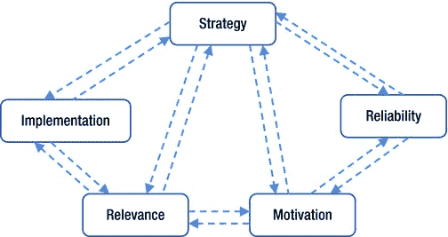
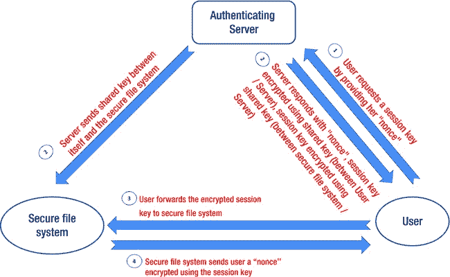
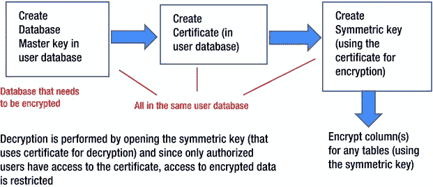
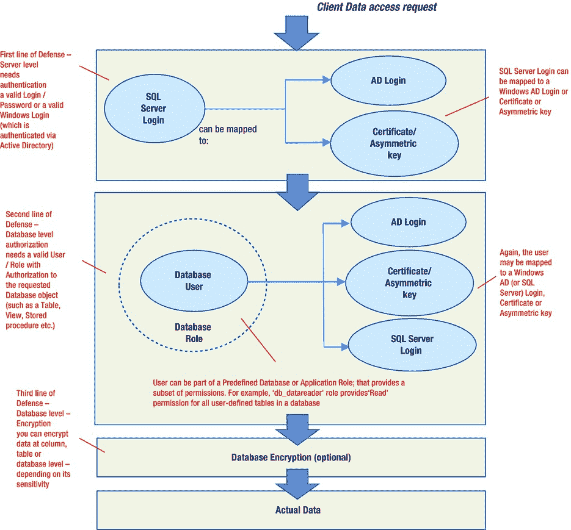

第一章


理解安全概念

在当今技术驱动的世界中，计算机已经渗透到我们生活的各个方面，我们的个人和公司数据比以往任何时候都更容易通过电子方式获得。不幸的是，提供如此多好处的同一技术也可能被用于破坏性目的。近年来，以前主要为个人利益而工作的个人黑客组织成了为经济利益而工作的团体，使得个人或公司数据被窃取用于非法目的的威胁变得更加严重和真实。恶意软件侵扰我们的计算机，并根据我们的浏览环境将我们的浏览器重定向到特定的广告网站。网络钓鱼邮件诱使我们登录看似真实但旨在窃取我们密码的网站。病毒或直接攻击破坏我们的网络，窃取密码和数据。随着大数据、分析和机器学习进入现代企业，暴露关键数据和造成伤害的机会呈指数级增长。

如果您想应对这些针对您个人财产(是的，您的数据是您的个人财产)或公司财产的攻击，您必须彻底了解这些威胁以及您自己的漏洞。只有这样，您才能设计一种策略来保护您的数据，无论是个人数据还是公司数据。

想象一下这样一个场景，您银行的投资部门使用 Hadoop 来分析万亿字节的数据，而您银行的竞争对手可以访问结果。或者，如果您的保险公司基于对数百万份索赔的大数据分析决定停止提供房主保险，而他们的竞争对手已经(秘密地)访问了这些数据，并发现用作分析基础的大部分索赔都是欺诈性的，情况会如何？你能想象这些安全漏洞会给受影响的公司带来多大的损失吗？不幸的是，只有这些漏洞凸显了安全的重要性。对于用户来说，一个好的安全设置——无论是个人的还是公司的——总是透明的。

本章为您开始构建安全策略奠定了基础。我首先定义一个安全工程框架。然后，我讨论了安全的一些心理学方面(人的因素),并介绍了安全协议。最后，我介绍了对程序安全性的常见潜在威胁，并解释了如何应对这些威胁，提供了一个安全分布式系统的详细示例。首先，让我向您介绍一下安全工程的概念。

安全工程简介

安全工程是关于设计和实现不泄露私人信息的系统，并且能够可靠地抵御恶意攻击、错误或灾难。作为一门科学，它专注于设计和实现完整系统以及改造现有系统所需的工具、过程和方法。

安全工程需要跨不同学科的专业知识，如密码学、计算机安全、计算机网络、经济学、应用心理学和法律。软件工程技能(从业务流程分析到实现和测试)也是必要的，但主要是为了应对错误和“灾难”——而不是恶意攻击。设计对抗恶意的系统需要专门的技能，当然也需要专门的经验。

安全要求因系统而异。通常您需要用户认证、授权、策略定义、审计、集成事务、容错、加密和隔离的平衡组合。许多系统失败是因为他们的设计者关注了错误的事情，忽略了其中的一些因素，或者关注了正确的事情但做得不充分。保护包含许多组件和接口的大数据系统尤其具有挑战性。传统的数据库只有一个目录和一个接口:SQL 连接。一个 Hadoop 系统有许多“目录”和许多接口(Hadoop 分布式文件系统或 HDFS、Hive、HBase)。这种日益增加的复杂性，以及此类系统中各种各样的海量数据，给安全工程师带来了许多挑战。

因此，保护系统取决于几种类型的过程。首先，您需要确定您的安全需求，然后如何实现它们。此外，您必须记住，安全系统除了技术组件之外，还有一个非常重要的组件:人的因素！这就是为什么你必须确保负责保护和维护系统的人有适当的动力。在下一节中，我定义了一个考虑所有这些因素的框架。

安全工程框架

良好的安全工程依赖于以下五个在系统概念化时需要考虑的因素:

*   策略:你的策略围绕着你的目标。一个具体的目标是为您的系统定义身份验证、授权、整体事务、容错、加密和隔离的良好起点。您还需要考虑可能的错误条件或恶意攻击场景。
*   **实现:**实现您的战略包括采购必要的硬件和软件组件，设计和开发满足您所有目标的系统，定义访问控制，并彻底测试您的系统以匹配您的战略。
*   **可靠性:**可靠性是你对你的每个系统组件以及整个系统的依赖程度。可靠性是根据故障和失灵来衡量的。
*   **相关性:**相关性决定系统抵御最新威胁的能力。为了保持相关性，尤其是对于安全系统，定期更新它以保持其应对新威胁的能力也是极其重要的。
*   **动机:**动机与负责管理和维护您的系统的人员正确完成工作的动力或奉献精神有关，也指攻击者试图挫败您的策略的诱惑。

[图 1-1](#Fig1) 说明了这五个因素是如何相互作用的。



[图 1-1](#_Fig1) 。设计安全框架前需要考虑的五个因素

注意这些关系，比如相关性的策略、策略的实现、相关性的实现、动机的可靠性等等。

通过一个真实世界的例子来考虑图 1-1 的框架。假设我正在设计一个存储高中生成绩的系统。这五个关键因素是如何发挥作用的？

带着我的目标——创建一个学生评分系统——我首先概述了这个系统的*策略*。首先，我必须定义学生、员工和学校管理员所需的身份验证和授权级别(访问策略)。显然，学生只需要对他们的个人成绩有读取权限，工作人员需要对他们学生的成绩有读写权限，学校管理员需要对所有学生记录有读取权限。任何数据更新都需要是一个*整体事务*，这意味着要么它应该完成所有相关的更改，要么如果它在进行中中止，那么所有的更改都应该恢复。因为数据是敏感的，所以应该加密——学生应该只能看到自己的成绩。应该使用内部防火墙将评分系统隔离在学校内部网中，并且当任何人试图使用该系统时，应该提示进行身份验证。

我的策略需要通过首先采购必要的硬件(服务器、网卡)和软件组件(SQL Server、C#)来*实现*。NET 组件、Java)。接下来是通过使用 SQL Server 设计过程流、数据流、逻辑数据模型、物理数据模型以及使用 Java 设计图形用户界面来设计和开发系统以满足目标。我还需要定义访问控制，以确定谁可以访问系统以及拥有什么权限(基于授权需求的角色)。例如，我将`School_Admin`角色定义为具有所有等级的读取权限，将`Staff`角色定义为具有读写权限，以此类推。最后，在构建系统之前，我需要对我的硬件和软件组件进行安全实践审查。

在彻底测试系统时，我可以通过确保没有人可以访问他们不应该访问的数据，以及确保所有用户都可以访问他们被允许访问的数据来测量可靠性。任何偏离这一功能的情况都会使系统不可靠。此外，系统需要全天候可用。如果不是，那也会降低系统的可靠性。这个系统的*相关性*将取决于它的固若金汤。换句话说，任何学生(或外部黑客)都不能使用任何最新的技术侵入它。

负责管理该系统(硬件、数据库等)的系统管理员。)应该是可靠的并且*有动力*有良好的职业操守。既然他们可以接触到所有的敏感数据，他们就不应该向任何未经授权的人透露(例如在该高中学习的朋友或亲戚，任何无良的招生人员，甚至媒体)。在这种情况下，禁止任何此类披露的法律可能是一个很好的动机；但是职业操守同样重要。

安全工程的心理学方面

为什么需要了解安全工程的心理学方面？对你的网络安全最大的威胁是欺骗:利用心理学和技术的恶意攻击。我们都收到过*网络钓鱼*电子邮件，警告我们支票、信用卡或 PayPal 账户存在一些“问题”,并敦促我们通过登录一个巧妙伪装的网站来“修复”它，该网站旨在出于非法目的捕获我们的用户名、密码或账号。*借口*是私家侦探或骗子窃取信息的另一种常见方式，无论是个人信息还是公司信息。它包括以虚假的借口给某人(掌握信息的受害者)打电话，并获取机密信息(通常是通过伪装成有权获得该信息的人)。开发人员或系统管理员接到“安全管理员”打来的电话，被要求提供密码信息，据说是为了验证或安全目的，这种情况有很多。你可能会认为这在今天是行不通的，但是这些情况即使在现在也很常见！最好通过电子邮件或书面形式请求披露任何机密或敏感信息。

公司使用许多对策来打击网络钓鱼:

*   **密码加扰器:**许多浏览器插件通过散列(使用秘密密钥)和被访问网站的域名，将你的密码加密成一个强大的、特定域的密码。即使您总是使用相同的密码，您访问的每个网站都会有一个不同的、唯一的密码。因此，如果你在一个钓鱼网站上错误地输入了你的美国银行密码，黑客就会得到你真实密码的一个不可用的变体。
*   **客户证书或定制应用:**一些银行提供自己的笔记本电脑和 VPN 接入，以便使用他们的定制应用连接到他们的系统。他们验证客户端是否使用了他们自己的硬件(例如，通过媒体访问控制或 MAC 地址)，并在允许用户连接到他们的系统之前使用 VPN 凭证来验证用户。一些银行还向他们的用户提供由他们的服务器认证的客户证书；因为它们驻留在客户端电脑上，黑客无法访问或使用它们。
*   **两阶段认证:**在该系统中，登录需要令牌密码和保存密码。安全令牌生成密码(一次性使用或基于时间)以响应您要访问的系统发送的质询。例如，每隔几秒钟，安全令牌就会显示一个与中央服务器同步的新的八位密码。输入令牌密码后，系统会提示您输入之前设置的已保存密码。这使得黑客无法使用您的密码，因为令牌密码变化太快，黑客无法使用。两阶段身份验证仍然容易受到实时“中间人”攻击(有关更多详细信息，请参见“中间人攻击”侧栏)。

中间人攻击

中间人攻击的工作原理是，黑客成为合法用户和验证者之间的隐形中继(中间人)，以获取非法使用的信息。黑客(或“网络钓鱼者”)捕获用户响应，并将它们转发给验证者。然后，他或她将来自身份验证者的任何质询转发给用户，并将任何后续的用户响应转发给身份验证者。因为所有的响应都通过黑客，所以他被认证为一个用户，而不是真正的用户，因此可以冒充合法用户自由地执行任何非法活动！

例如，假设一个用户想要登录他的支票账户，但是被一个网络钓鱼计划引诱而登录到一个网络钓鱼站点。网络钓鱼网站同时开启与用户银行的登录会话。当银行发送挑战时；钓鱼者将此转发给用户，用户使用他的设备对其进行响应；网络钓鱼者将此响应转发给银行，并且现在作为用户向银行进行了身份验证！当然，在那之后，他可以在那个支票账户上进行任何非法活动，比如把所有的钱转到他自己的账户上。

一些银行通过使用基于最后提取金额、收款人账号或交易序列号的认证代码作为响应，而不是简单的响应，来应对这种情况。

*   **可信计算:**这种方法包括在 PC 主板上安装 TPM(可信平台模块)安全芯片。TPM 是一个专用的微处理器，它生成密钥并使用它们进行加密/解密。因为本地化的硬件用于加密，所以它比软件解决方案更安全。为了防止任何恶意代码获取和使用密钥，您需要确保整个加密/解密过程都在 TPM 内完成，而不是由 TPM 生成密钥并将它们传递给外部程序。将这种硬件交易支持集成到 PC 中将使黑客更难侵入系统。例如，OpenSSL 中最近出现的 Heartbleed 错误将被 TPM 击败，因为密钥不会暴露在系统内存中，因此不会被泄漏。
*   强密码协议:史蒂夫·贝洛文和迈克尔·梅里特提出了一系列用于加密密钥交换的协议，通过这种方式，密钥交换与共享密码结合在一起，使得中间人(phisherman)无法猜出密码。其他各种研究人员提出了类似的协议，这项技术是我们今天使用的“安全”(HTTPS)协议的前身。因为使用 HTTPS 更方便，所以它被广泛地实现，而不是现在的浏览器都没有实现的强密码协议。
*   **双通道认证:**这包括通过单独的通道或设备(如用户的手机)向用户发送一次性访问码。此访问码与常规用户密码一起用作附加密码。这种身份验证类似于两阶段身份验证，也容易受到实时中间人攻击。

安全协议简介

安全系统由用户、公司和服务器等组件组成，这些组件使用包括电话、卫星链路和网络在内的多种渠道进行通信，同时还使用物理设备，如笔记本电脑、便携式 USB 驱动器等。安全协议是管理这些通信的规则，旨在有效对抗恶意攻击。

由于实际上不可能设计一个协议来对抗所有类型的威胁(除了昂贵之外)，协议被设计成仅对抗某些类型的威胁。例如，用于身份验证的 Kerberos 协议假设用户在输入用户名和密码时连接到了正确的服务器(而不是钓鱼网站)。

对协议进行评估时，通常会考虑它们所要应对的威胁出现的可能性，以及它们消除这种威胁的有效性。

在一个庞大而复杂的系统中，多种协议常常必须协同工作；因此，您需要注意这种组合不会暴露任何漏洞。在接下来的几节中，我将向您介绍一些常用的协议。

Needham-Schroeder 对称密钥协议

*Needham-Schroeder 对称密钥协议*在请求者和认证者之间建立了一个*会话密钥*，并在整个会话中使用该密钥来确保通信的安全。让我用一个简单的例子来解释一下。

用户需要从安全文件系统访问文件。作为第一步，用户通过提供她的 *nonce* (用于保证消息新鲜的随机数或序列号)和她需要访问的安全文件系统的名称，向认证服务器请求会话密钥(图 1-2 中的步骤 1)。服务器提供会话密钥，使用服务器和用户之间共享的密钥进行加密。会话密钥还包含用户的 nonce，只是为了确认它不是重播。最后，服务器向用户提供使用服务器和安全文件系统之间共享的密钥加密的会话密钥的副本(步骤 2)。用户将密钥转发给安全文件系统，安全文件系统可以使用与服务器共享的密钥对其进行解密，从而认证会话密钥(步骤 3)。安全文件系统向用户发送使用会话密钥加密的随机数，以表明它拥有该密钥(步骤 4)。用户在 nonce 上执行一个简单的操作，重新加密它，并将其发送回来，验证她仍然活着，并且她持有密钥。因此，在用户和安全文件系统之间建立了安全通信。

这个协议的问题是，安全文件系统必须假设它从认证服务器(通过用户)接收的密钥是新的。这可能不是真的。此外，如果黑客得到了用户的密钥，他可以用它与许多其他主体建立会话密钥。最后，如果用户通过使用日志发现冒名顶替或不当使用，她不可能撤销会话密钥。

总之，Needham-Schroeder 协议容易受到重放攻击，因为不可能确定会话密钥是新的还是最近的。



[图 1-2](#_Fig2) 。Needham-Schroeder 对称密钥协议

麻省理工学院开发的安全认证系统

Kerberos 是 Needham-Schroeder 协议的衍生物，起源于麻省理工学院，现在被用作 Linux 和 Windows 的标准认证工具。Kerberos 不是使用单个可信服务器，而是使用两个服务器:一个认证服务器，对用户登录进行认证；以及提供票证的票证授予服务器，允许访问各种资源(例如，文件或安全进程)。这提供了更具可伸缩性的访问管理。

如果用户需要访问使用 Kerberos 的安全文件系统，该怎么办？首先，用户使用密码登录到身份验证服务器。用户 PC 上的客户端软件从该服务器获取票证，该票证根据用户的密码进行加密，并包含会话密钥(仅在预定的持续时间内有效，如一小时或一天)。假设用户已经过身份验证，他现在使用会话密钥来访问由票据授予服务器控制的安全文件系统。

接下来，用户从票据授予服务器请求访问安全文件系统。如果访问是允许的(取决于用户的权限)，则创建一个包含合适密钥的票证并提供给用户。用户还可以获得在会话密钥下加密的密钥的副本。现在，用户通过向安全文件系统发送时间戳来验证票据，安全文件系统通过发回加 1 的时间戳来确认票据是否有效(这表明它能够正确解密票据并提取密钥)。之后，用户可以与安全文件系统通信。

Kerberos 通过用时间戳替换随机随机数来修复 Needham–Schroeder 的漏洞。当然，现在有一个基于时间戳的新漏洞，在这个漏洞中，作为更复杂攻击的一部分，各种客户端和服务器上的时钟可能会故意失去同步。

Kerberos 被广泛使用，并作为其身份验证机制被集成到 Windows Active Directory 服务器中。实际上，Kerberos 是使用最广泛的安全协议，其他协议只具有历史重要性。您将在后面的章节中了解更多关于 Kerberos 的内容，因为它是当今 Hadoop 使用的主要认证。

布伦斯-阿巴迪-李约瑟逻辑

burrows-Abadi-Needham(BAN)逻辑提供了定义和分析敏感信息的框架。基本原则是，如果消息满足三个标准，则它是可信的:它用相关密钥加密，它来自可信的来源，并且它还是新的(即，在协议的当前运行期间生成)。通常遵循的验证步骤是

1.  检查来源是否可信，
2.  检查加密密钥是否有效，以及
3.  检查时间戳以确保它是最近生成的。

一些银行使用 BAN 逻辑的变体(例如，Visa International 使用的 COPAC 系统)。BAN 逻辑是一个非常广泛的协议，因为它有多步验证过程；但这也是它不太受欢迎的确切原因。它实现起来很复杂，也容易受到时间戳操作的影响(就像 Kerberos 一样)。

考虑 BAN 逻辑的实际实现。假设 Mindy 从网络零售商处购买了一个昂贵的钱包，并授权通过她的信用卡向零售商支付 400 美元。Mindy 的信用卡公司必须能够核实和证明该请求确实来自 Mindy，如果她后来否认发送它。信用卡公司还想知道这个请求完全是 Mindy 的，并且没有被修改过。此外，该公司必须能够验证 Mindy 输入的加密密钥(来自信用卡的三位数安全码)。最后，公司希望确保消息是新的，而不是重复使用以前的消息。所以，查看需求，您可以得出结论，信用卡公司需要实现 BAN 逻辑。

现在，在回顾了这些协议以及它们可以用来对抗恶意攻击的方式之后，您认为使用一个强大的安全协议(来保护程序)足以克服软件中的任何“缺陷”(这些缺陷会使程序容易受到安全攻击)吗？还是像用一把昂贵的锁锁住房子的前门，而让窗户开着？要回答这个问题，您首先需要知道缺陷是什么，或者它们如何导致安全问题。

保护程序安全

在保护程序之前，您需要了解是什么因素使程序不安全。首先，使用安全协议只能保护程序的入口。一旦程序开始执行，它需要具有健壮的逻辑，只提供对必要资源的访问，而不为恶意攻击提供任何途径来修改系统资源或获得对系统的控制。那么，这就是一个程序没有缺陷的方式吗？好吧，我将简单地讨论一下，但是首先让我定义一些重要的术语，这将帮助你理解缺陷以及如何应对它们。

先说术语*程序*T2。程序是任何可执行的代码。甚至操作系统或者数据库系统都是程序。我认为一个程序是安全的，如果它确切地(并且仅仅)做了它应该做的事情——没有别的！安全性评估也可以基于程序对规范的符合性来决定——如果代码满足安全性要求，那么它就是安全的。为什么这很重要？因为当一个程序执行时，它有能力修改你的环境，你必须确保它只修改你想让它修改的。

因此，您需要考虑会阻止程序满足安全性要求的因素。这些因素有可能被称为程序中的缺陷。瑕疵可以是错误，也可以是失败*。*

*故障*是由于人为错误在系统中引入的异常。在设计阶段，由于设计者误解了分析师的需求，或者在实现阶段，由于程序员没有理解设计者的意图并且编码不正确，可能会引入错误。一个错误可以产生许多错误。综上所述，故障是系统的设计者或开发者在开发之后注意到的逻辑问题或矛盾。

一个*失败*是对系统所需功能的偏离。故障可以在软件开发生命周期(SDLC)的任何阶段被发现，例如测试或运行。单个故障可能导致多个故障(例如，如果没有输入，设计故障会导致程序退出)。如果功能需求文档包含错误，失败将表明系统没有按要求执行(即使它可能按指定执行)。因此，失败是故障的明显后果:用户可以看到的问题。

幸运的是，不是每个错误都会导致失败。例如，如果代码的错误部分从未被执行，或者逻辑的错误部分从未被输入，那么该错误将永远不会导致代码失败——尽管您永远无法确定失败何时会暴露该错误！

概括地说，这些缺陷可以分为:

*   非恶意(缓冲区溢出、验证错误等。)和
*   恶意(病毒/蠕虫攻击、恶意软件等。).

在接下来的几节中，我们将更仔细地研究这些缺陷、它们可能产生的安全漏洞的种类，以及如何设计一种策略来更好地保护您的软件免受此类漏洞的侵害。

非恶意缺陷

非恶意缺陷源于无意的、疏忽的人为错误。大多数这些缺陷只会导致程序故障。然而，最近几年，一些类别已经导致了许多安全漏洞。

缓冲区溢出

一个*缓冲区*(或*数组*或*字符串*)是一个分配的内存(或 RAM)量，数据在这里被临时保存以供处理。如果写入缓冲区的程序数据超过缓冲区先前定义的最大大小，则该程序数据基本上溢出缓冲区。一些编译器检测到缓冲区溢出并停止程序，而另一些则简单地认为溢出是附加指令并继续执行。如果继续执行，程序数据可能会覆盖系统数据(因为所有程序和数据元素在执行期间都与操作系统和其他代码共享内存空间)。黑客可能会发现溢出并在系统空间中插入代码，从而以更高的权限控制操作系统。 [<sup>1</sup>](#Fn1)

有几种编程技术用于防止缓冲区溢出，例如

*   强制检查缓冲区溢出；
*   系统堆栈区和用户代码区的分离；
*   使内存页面可写或可执行，但不能两者都写；和
*   监视器在系统堆栈被覆盖时发出警报。

不完全调解

当程序未经验证或确认就接受用户数据时，就会发生不完全中介。程序需要检查用户数据是否在指定的范围内，或者是否遵循预定义的格式。如果没有做到这一点，黑客就可以出于非法目的操纵数据。例如，如果一个网络商店不传递用户数据，黑客可能会关闭任何客户端 JavaScript(用于验证)或只编写一个脚本来与网络服务器交互(而不是使用网络浏览器)，并向服务器发送任意(非中介)值来操纵销售。在某些情况下，这种性质的漏洞是由于未能检查组件的默认配置造成的；默认情况下为 XML 数据启用 shell 转义的 web 服务器就是一个很好的例子。

不完全中介的另一个例子是 SQL 注入，攻击者能够插入(和提交)由 web 应用程序执行的数据库 SQL 命令(代替或与参数值一起),操纵后端数据库。当 web 应用程序未经彻底验证就接受用户提供的输入数据时，就会发生 SQL 注入攻击。巧妙格式化的用户数据欺骗应用程序执行非预期的命令或修改敏感数据的权限。黑客可以访问敏感信息，如社会安全号、信用卡号或其他财务数据。

SQL 注入的一个例子是一个 web 应用程序，它接受登录名作为输入数据，并为用户显示所有信息，但不验证输入。假设 web 应用程序使用以下查询:

```scala
"SELECT * FROM logins WHERE name ='" + LoginName + "';"

```

恶意用户可以使用`“' or '1'='1”`的`LoginName`值，这将导致 web 应用程序将所有用户的登录信息(带密码)返回给恶意用户。

如果用户输入根据一组定义的长度、类型和语法规则进行验证，就可以防止 SQL 注入。此外，重要的是要确保用户权限(数据库访问)应限制在尽可能低的权限内(仅在相关数据库内)，并且系统管理员帐户(如`sa`)不应用于 web 应用程序。不使用的存储过程应该删除，因为它们很容易成为数据操作的目标。

应该采取两个关键步骤进行防御:

*   必须执行基于服务器的中介。所有客户端输入在被处理之前都需要经过程序(位于服务器上)的验证。
*   需要检查客户端输入的范围有效性(例如，月份在一月和十二月之间)以及允许的大小(文本数据的字符数或数字数据的数值等)。).

检验时间到使用时间误差

当系统状态(或用户控制的数据)在特定任务的授权检查和任务执行之间发生变化时，检查时间到使用时间的错误就会发生。也就是说，在任务的授权和执行之间缺乏同步或串行化。例如，用户可以请求对无害日志文件的修改权限，并且在检查授权(针对此操作)和实际授予修改权限之间，可以将日志文件切换为关键系统文件(例如，`/etc/password`针对 Linux 操作系统)。

有几种方法可以消除这些错误:

*   将所请求的用户数据(对于请求)复制到系统区域，使修改变得不可能。
*   锁定请求数据，直到请求的操作完成。
*   对请求的数据执行校验和(使用验证程序)以检测修改。

恶意缺陷

恶意缺陷会在程序中产生意想不到的或不希望的影响，并且是故意设计来造成损害(数据损坏、系统崩溃等)的代码的结果。).恶意缺陷是由病毒、蠕虫、兔子、特洛伊木马、陷阱门和恶意软件引起的:

*   *病毒*是一种自我复制程序，它可以通过将恶意代码的副本附加到未被感染的程序上来修改这些程序。被感染的程序自己变成病毒，并进一步复制以感染整个系统。一个*短暂病毒*依赖于它的宿主程序(它是其中的一部分的可执行程序),并且当它的宿主执行时运行，传播它自己并且执行它被设计的恶意活动。一个*常驻病毒*驻留在系统内存中，可以作为独立程序执行，甚至在其宿主程序完成执行之后。
*   一个*蠕虫***不同于使用其他程序作为媒介来传播自己的病毒，它是一个独立的程序，通过网络进行复制。**
***   一只*兔子*是一种病毒或蠕虫，它可以无限制地自我复制，耗尽计算资源。例如，一只兔子可能会无限次地将自己复制到一个磁盘上，并填满整个磁盘。*   一个*特洛伊木马*是代码，除了它的主要目的之外，还有隐藏的恶意目的。*   一个*逻辑触发器*是在特定条件发生时执行的恶意代码(例如，当文件被访问时)。*时间触发器*是以特定时间或日期为激活条件的逻辑触发器。*   一个*陷阱门*是一个程序的秘密入口点，它可以让某人绕过正常的认证并获得访问权。活板门一直被程序员用于合法的目的，比如故障排除、调试或测试程序；但是，当不道德的程序员使用它们来获得未经授权的访问或执行恶意活动时，它们就会成为威胁。恶意软件可以在联网的电脑上安装恶意程序或陷阱门。一旦安装，陷阱门就可以打开互联网端口，进行匿名、恶意的数据收集，推销产品(广告软件)，或执行创建者设计的任何其他破坏性任务。**

 **我们如何防止恶意代码的感染？

*   仅安装从可靠、知名的供应商处获得的商业软件。
*   跟踪所有已安装的开源组件的版本和漏洞，并维护开源组件安全修补策略。
*   仔细检查任何已安装软件的所有默认配置；不要假定默认值是为安全操作而设置的。
*   孤立地测试任何新软件。
*   只打开来自已知来源的“安全”附件。此外，避免打开来自已知来源的包含奇怪或特殊邮件的附件。
*   每天或每周维护一个可恢复的系统映像(根据需要)。
*   制作并保留可执行系统文件以及可能包含“可感染”代码的重要个人数据的备份副本。
*   使用防病毒程序并根据需要安排每日或每周扫描。不要忘记更新病毒定义文件，因为每天都有大量新病毒产生！

保护分布式系统

到目前为止，我们已经检查了对 *程序的*安全性的潜在威胁，但是记住——分布式系统也是一个程序。上一节讨论的所有威胁和解决方案不仅适用于分布式系统，而且这些程序的特殊性质也使它们在其他方面容易受到攻击。这导致分布式系统需要多级安全性。

当我想到一个安全的分布式系统时，我会想到 SAP 或 PeopleSoft 等 ERP(企业资源)系统。此外，Oracle、Microsoft SQL Server 或 Sybase 等关系数据库系统是安全系统的良好范例。所有这些系统都配备了多层安全措施，并且已经运行了很长时间。随后，他们发现了许多针对存储数据的恶意攻击，并设计了有效的对策。为了更好地理解是什么使这些系统安全，我将讨论 Microsoft SQL Server 如何保护敏感的雇员工资数据。

对于一个安全的分布式系统，数据隐藏在多层防御之后([图 1-3](#Fig3) )。存在诸如身份验证(使用登录名/密码)、授权(具有一组权限的角色)、加密(使用密钥对数据进行加密)等级别。对于 SQL Server，第一层是用户身份验证层。其次是授权检查，以确保用户拥有通过数据库角色访问数据库的必要授权。具体来说，任何到 SQL Server 的连接都由服务器根据存储的凭据进行身份验证。如果身份验证成功，服务器会传递连接。连接后，客户端将继承系统管理员分配给已连接登录的授权。这种授权包括使用分配的角色(对于每个数据库)访问任何系统或用户数据库。也就是说，用户只能访问他有权访问的数据库——并且只能访问分配了权限的表。在数据库级别，安全性进一步划分为表级和列级安全性。必要时，视图被设计成进一步隔离数据并提供更详细的安全级别。数据库角色用于对一组表的安全设置进行分组。


[图 1-3](#_Fig3) 。SQL Server 通过多种安全级别保护数据

在[图 1-3](#Fig3) 中，经过身份验证并被允许连接的用户被授权查看 DB1 数据库中的员工数据，但工资数据除外(因为他不属于 HR 角色，只有人力资源部的用户被分配了 HR 角色)。因此，使用 SQL Server 中的角色可以很容易地限制对敏感数据的访问。虽然图中没有说明它们，但是更多的安全层是可能的，您将在接下来的几节中了解到。

证明

第一层安全是身份验证。 SQL Server 使用登录/密码对来验证存储的凭据元数据。您还可以将集成安全性用于 Windows，并且可以使用 Windows 登录来连接到 SQL Server(假设系统管理员已经提供了对该登录的访问权限)。最后，证书或一对非对称密钥可用于身份验证。提供了一些有用的功能，如密码策略实现(强密码)、登录的日期有效性、阻止登录的能力等，以增加便利性。

批准

第二层是授权。根据需要在各种数据库(服务器上)内创建第一层登录对应的用户来实现。如果用户不存在于数据库中，他或她就不能访问它。

在数据库中，有各种对象，如表(保存数据)、视图(对可能分布在多个表中的过滤数据库访问的定义)、存储过程(使用数据库脚本语言的脚本)和触发器(在事件发生时执行的脚本，如更新表中的列或插入表中的数据行)，用户可能具有对这些对象的读取、修改或执行权限。此外，对于表或视图，可以向用户提供部分数据访问权限(仅针对某些列)。这在配置访问时提供了灵活性和非常高的粒度。

加密

第三个安全层是加密。SQL Server 提供了两种加密数据的方法:对称密钥/证书和透明数据库加密(TDE)。这两种方法都是对存储在数据库中的“静态”数据进行加密。通过在服务器和客户端上配置相应的公共和私有证书以使用加密连接，SQL Server 还能够对从客户端传输到服务器的数据进行加密。仔细看看:

*   **使用对称密钥/证书加密:**一个*对称密钥*是一个二进制或十六进制字符序列，它与加密算法一起用来加密数据。服务器和客户端必须使用相同的密钥进行加密和解密。为了进一步增强安全性，可能需要包含公钥和私钥对的*证书*。客户端应用程序必须有这个对可用于解密。使用证书和对称密钥进行加密的真正优势是它提供的粒度。例如，你可以只加密单个表中的单个列([图 1-4](#Fig4))——不需要加密整个表或数据库(如 TDE)。加密和解密是 CPU 密集型操作，会占用宝贵的处理资源。这也使得加密数据的检索速度比未加密数据慢。最后，加密数据需要更多的存储空间。因此，如果数据库中只有一小部分包含敏感数据，那么使用该选项是有意义的。



[图 1-4](#_Fig4) 。使用对称密钥和证书创建列级加密

*   **TDE:** TDE 是 SQL Server 提供的使用对称密钥和证书对数据库进行完全加密的机制。一旦启用了数据库加密，数据库中的所有数据在存储到磁盘上时都会被加密。这种加密对请求数据的任何客户端都是透明的，因为数据在从磁盘传输到缓冲区时会自动解密。[图 1-5](#Fig5) 详细描述了为数据库实现 TDE 的步骤。


[图 1-5](#_Fig5) 。为 SQL Server 数据库实现 TDE 的过程

*   **使用加密连接:**该选项包括加密客户端到 SQL 服务器的连接，并确保传输中的数据是加密的。在服务器端，您必须将服务器配置为接受加密连接，创建证书，并将其导出到需要使用加密的客户端。然后，客户端的用户必须在客户端上安装导出的证书，配置客户端以请求加密连接，并打开到服务器的加密连接。

[图 1-6](#Fig6) 描绘了 SQL Server 安全的各个级别。如您所见，可以在访问的每个阶段过滤数据(根据需要)，为用户授权提供粒度。



[图 1-6](#_Fig6) 。包含详细信息的 SQL Server 安全层

Hadoop 也是一个分布式系统，可以从您在这里学到的许多原则中受益。在接下来的两章中，我将介绍 Hadoop，并概述 Hadoop 的安全架构(或者说缺乏安全架构)。

摘要

本章介绍了一般的安全概念，以帮助您更好地理解和欣赏将用于保护 Hadoop 的各种技术。但是，请记住，理解安全的心理因素和技术一样重要。如果你轻易地将你的密码提供给黑客，没有任何安全协议可以帮助你！

保护一个程序需要了解潜在的缺陷，这样你才能应对它们。通过在 SDLC 的每个阶段进行质量控制，并在实现阶段进行大量测试，可以减少或消除非恶意缺陷。专门的反病毒软件和程序纪律是解决形式化缺陷的唯一方法。

分布式系统由于其体系结构而需要多级安全性，这种体系结构将数据分布在多个主机上，并通过在多个位置执行的多个进程来修改数据。因此，重要的是设计能够在多个级别上工作的安全性，并根据主机的角色来保护系统中的各种主机(例如，中央主机或主控主机所需的安全性与其他主机不同)。大多数情况下，这些级别是认证、授权和加密。

最后，计算世界正在快速变化，新的威胁每天都在演变。设计一个安全的系统很重要，但保持系统的更新也同样重要。昨天还是最好的安全系统现在已经不够好了。今天必须是最好的，明天也可能是最好的！

________________

[<sup>1</sup>](#_Fn1) 请参考 Jonathan Pincus 和 Brandon Baker 撰写的 IEEE 论文“超越堆栈粉碎:利用缓冲区溢出的最新进展”,了解关于这类攻击的更多详细信息。该文章的 PDF 可在`http://classes.soe.ucsc.edu/cmps223/Spring09/Pincus%2004.pdf`获得。**