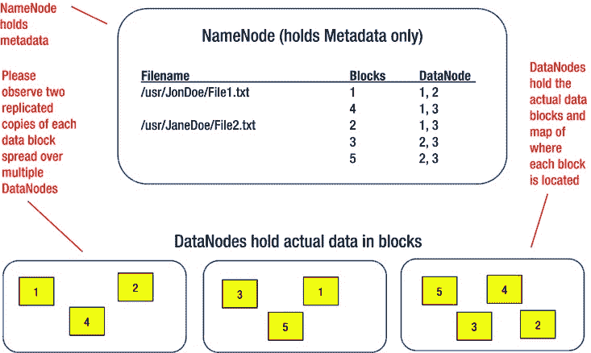
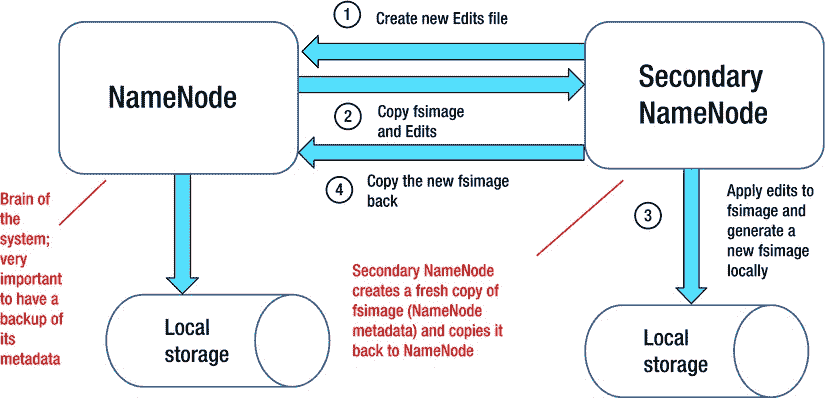
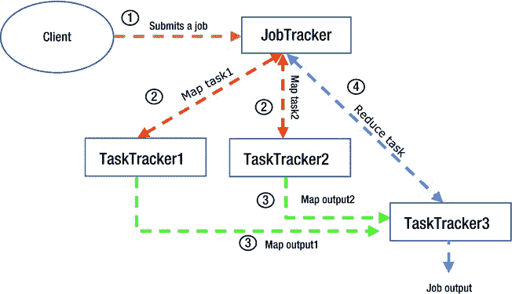
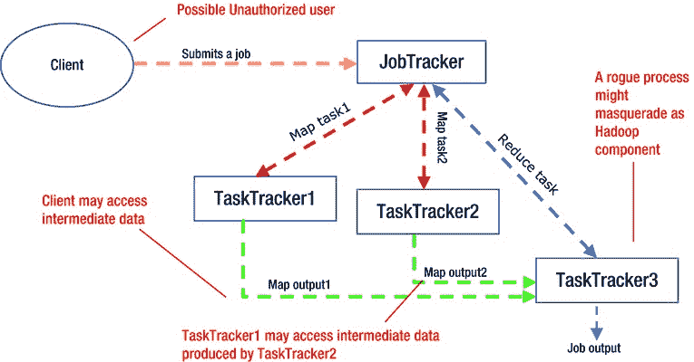
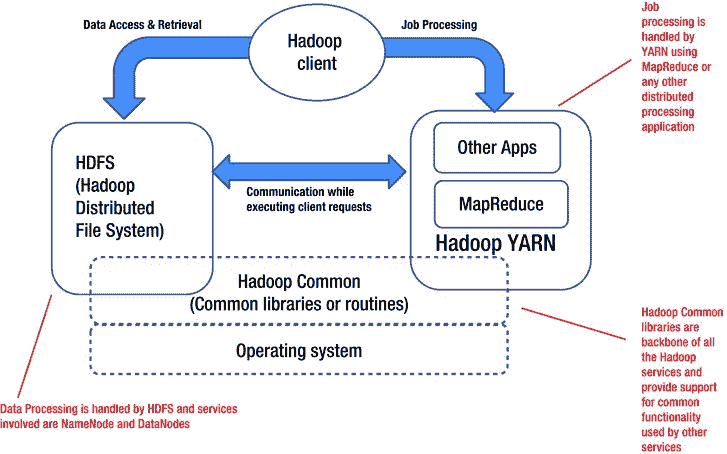

第二章

Hadoop 简介

我参加了一个数据仓库会议，与一家领先银行的高管谈论 Hadoop。当我告诉他这项技术时，他插话道:“但是它对我们有什么用处吗？我们没有任何互联网使用情况可以分析！”他只是表达了一个普遍的误解。Hadoop 不仅仅是一种用于分析网络使用或日志文件的技术；它在 Pb(每个 1,000)的世界中有真正的用途。这是一项超级智能的技术，可以帮助您高效快速地管理大量数据，而无需在硬件上花费大量资金。

Hadoop 可能始于实验室，一些真正聪明的人使用它来分析数据以实现行为目的，但它今天在企业界越来越受到支持。为了在这种新环境中生存，it 需要进行一些改变(例如增加安全性)，但随着这些改变的出现，越来越多的公司开始意识到它为管理和处理大量数据带来的好处。

例如，福特汽车公司使用大数据技术处理他们的混合动力汽车产生的大量数据(每小时约 25GB)，分析、总结并通过移动应用程序呈现给司机，该应用程序提供有关汽车性能、最近的充电站等信息。使用大数据解决方案，福特还通过消费者对其汽车的反馈和评论来分析社交媒体上的可用数据。使用传统的数据管理和分析工具来分析如此大量的不同数据是不可能的。

社交网站 LinkedIn 使用 Hadoop 以及定制开发的分布式数据库 Voldemort 和 Espresso 来增强其海量数据，使其能够快速提供热门功能，如“你可能认识的人”列表或 LinkedIn 社交图，只需点击一下。这对于传统的数据库或存储来说是不可能的。

Hadoop 使用低成本商用硬件和内置冗余，这是它吸引大多数将其用于存储或归档的公司的主要因素。此外，分布式处理等功能可以将您的处理能力乘以节点数，轻松处理数 Pb 的数据；无需停机即可扩展容量；高度的容错能力使得 Hadoop 对越来越多的企业用户具有吸引力。

在接下来的几节中，您将了解 Hadoop 架构、Hadoop 堆栈，以及 Hadoop 架构固有的安全问题。请注意，在本章中，我将只简要讨论这些安全问题；第 4 章包含了关于这些问题的更详细的讨论，以及可能的解决方案。

Hadoop 架构

网站将 Hadoop 定义为“一个框架，允许使用简单的编程模型在计算机集群上分布式处理大型数据集。”很简单，这就是哲学:提供一个易于使用、易于扩展的框架，并为生产使用提供容错和高可用性。

这个想法是利用现有的低成本硬件来建立一个强大的系统，可以非常高效和快速地处理数 Pb 的数据。Hadoop 通过将数据本地存储在其 *DataNodes* 上并在本地进行处理来实现这一点。所有这些都由 Hadoop 系统的大脑 *NameNode* 高效管理。所有客户端应用程序都通过 NameNode 读取/写入数据，正如您在[图 2-1](#Fig1) 的简单 Hadoop 集群中看到的。

[图 2-1](#_Fig1) 。使用 NameNode(大脑)和 DataNodes 进行数据存储的简单 Hadoop 集群

Hadoop 有两个主要组件:Hadoop 分布式文件系统(HDFS)和一个使用 MapReduce 范式并行处理大量数据的框架。让我先把你介绍给 HDFS。

HDFS

HDFS 是一个分布式文件系统层，位于操作系统的原生文件系统之上。例如，对于 Ubuntu 操作系统，HDFS 可以安装在 ext3、ext4 或 XFS 文件系统之上。它使用廉价、不可靠的硬件为大量数据提供冗余存储。在加载时，数据分布在所有节点上。这有助于高效的 MapReduce 处理。与大量小文件相比，HDFS 处理少量大文件(数千兆字节)的性能更好，这是其设计方式决定的。

文件是“写一次，读多次”新版本的文件现在提供了追加支持，但 HDFS 是针对大型流读取的，而不是随机访问。高持续吞吐量比低延迟更受青睐。

HDFS 中的文件存储为*块*，并为冗余或可靠性进行复制。默认情况下，数据块会跨 DataNodes 复制三次；所以每个文件都有三份拷贝。此外，块大小比其他文件系统大得多。例如，NTFS(用于 Windows)的最大块大小为 4KB，Linux ext3 的默认值为 4KB。与 HDFS 使用的默认块大小 64MB 相比！

NameNode

NameNode(或“大脑”)存储元数据并协调对 HDFS 的访问。元数据存储在 NameNode 的 RAM 中，以便快速检索并减少响应时间(对于 NameNode ),同时提供数据块的地址。这种配置提供了简单的集中式管理，同时也为 HDFS 提供了单点故障(SPOF)。在以前的版本中，辅助 NameNode 提供从 NameNode 故障中恢复的功能；但当前版本提供了在主动/被动配置中群集热备用(备用节点接管 NameNode 的所有功能，无需任何用户干预)节点的能力，以消除 NameNode 的 SPOF，并提供 NameNode 冗余。

由于元数据存储在 NameNode 的 RAM 中，并且文件的每个条目(及其块位置)都会占用一些空间，因此大量的小文件会产生大量的条目，并且会比大文件的少量条目占用更多的 RAM。此外，小于块大小(最小块大小为 64 MB)的文件仍将被映射到单个块，保留它们不需要的空间；这就是为什么大文件比小文件更适合使用 HDFS 的原因。

[图 2-2](#Fig2) 展示了 HDFS 集群各组成部分之间的关系。

[图 2-2](#_Fig2) 。HDFS 集群及其组件

HDFS 文件存储和数据块复制

HDFS 文件存储和复制系统的重要之处在于其内置的块放置智能，这提供了更好的节点故障恢复能力。当 NameNode 处理文件存储请求(来自客户端)时，它会在客户端本地存储块的第一个副本—如果它是群集的一部分。如果没有，NameNode 会将它存储在一个不太满或不太忙的 DataNode 上。它将数据块的第二个副本存储在位于同一机架上的不同 DataNode 上(是的，HDFS 在决定数据块放置时会考虑 DataNode 的机架使用情况)，并将第三个副本存储在位于不同机架上的 DataNode 上，只是为了降低由于机架故障而丢失全部数据的风险。[图 2-2](#Fig2) 展示了两个文件的两个副本(每个块的)是如何分布在可用的数据节点上的。

DataNode 向 NameNode 发送心跳，如果 DataNode 在特定时间内没有发送心跳，则认为它“丢失”NameNode 找到其他 DataNode(该 DataNode 上有数据块的副本),并指示它们将丢失的数据块复制到另一个 DataNode。这样，所有数据块的副本总数将始终与配置的*复制因子*相匹配(该因子决定将维护文件的多少个副本)。

添加或删除 DataNodes

在 HDFS 集群中添加或删除 DataNodes 非常容易。您只需要将新的 DataNode 的主机名添加到一个配置文件(一个名为`slaves`的文本文件)中，并运行一个管理实用程序来告诉 NameNode 这个添加。之后，在新的 DataNode 上启动 DataNode 进程，并且您的 HDFS 集群有了一个额外的 DataNode。

删除 DataNode 同样简单，只需要一个相反的过程——从`slaves`中删除主机名条目，然后运行管理实用程序让 NameNode 知道这一删除。此后，可以关闭该节点上的 DataNode 进程，并将其从 HDFS 集群中删除。NameNode 悄悄地将块(从退役的 DataNode)复制到其他 DataNode，生活继续进行。

集群重新平衡

添加或删除 DataNodes 很容易，但这可能会导致您的 HDFS 集群不平衡。在你的 HDFS 集群中，还有其他可能造成不平衡的活动。Hadoop 提供了一个实用程序(Hadoop Balancer ),可以再次平衡您的集群。平衡器将数据块从过度利用的数据节点移动到未充分利用的数据节点，同时仍然遵循 Hadoop 的存储和复制策略，即不将数据节点上的所有副本放在一个机架上。

数据块移动将持续进行，直到所有数据节点的利用率(已用空间与总容量的比率)都在彼此的阈值百分比范围内。例如，5%的阈值意味着所有 DataNodes 的利用率都在 5%以内。平衡器在后台以低带宽运行，不会加重集群负担。

磁盘存储器

HDFS 为 NameNode、辅助 NameNode 和 DataNodes 使用本地存储，因此使用正确的存储类型非常重要。作为集群的大脑，NameNode 需要冗余和容错存储。强烈建议使用 RAID 10(在至少两个磁盘上对数据进行条带化和镜像)。辅助 NameNode 需要 RAID 10 存储。就 DataNodes 而言，它们可以使用本地 JBOD(只是一堆磁盘)存储。请记住，这些节点上的数据已经复制了三次(或者无论复制因子是什么)，因此没有使用 RAID 驱动器的实际需要。

辅助 NameNode

现在让我们考虑一下辅助 NameNode 如何维护 NameNode 元数据的备用副本。NameNode 使用一个名为`fsimage`的图像文件来存储 HDFS 的当前状态(存储在文件系统中的所有文件及其对应块的位置的地图),并使用一个名为`edits`的文件来存储对 HDFS 的修改。随着时间的推移，`edits`文件会变得非常大；因此，`fsimage`不会有正确反映 HDFS 状态的最新图像。在这种情况下，如果 NameNode 崩溃，HDFS 的当前状态将会丢失，数据将不可用。

为了避免这种情况，辅助 NameNode 执行检查点(默认情况下每小时一次)，在本地合并 NameNode 的`fsimage`和`edits`文件，并将结果复制回 NameNode。因此，在最坏的情况下，只有对 HDFS 的编辑或修改会丢失——因为辅助 NameNode 在本地存储了最新的`fsimage`副本。[图 2-3](#Fig3) 提供了对这一过程的更多了解。

[图 2-3](#_Fig3) 。由辅助 NameNode 执行的检查点

所有这些对您的数据意味着什么？考虑一下 HDFS 是如何处理请求的。[图 2-4](#Fig4) 显示了 NameNode 如何处理数据请求，以及如何从相应的 DataNodes 中检索数据。

[图 2-4](#_Fig4) 。Hadoop 数据访问请求剖析

NameNode 高可用性

正如您在名称节点一节中所记得的，名称节点是一个 SPOF。但是，如果将 Hadoop 集群用作生产系统，就需要有一种方法来消除这种依赖性，并确保集群即使在 NameNode 失败的情况下也能正常工作。应对 NameNode 故障的方法之一是使用 *NameNode 高可用性*(或 *HA* )，其中一个集群部署有一对主动/被动的 NameNode。`edits`预写日志需要对两个 NameNodes(主动/被动)都可用，因此位于共享的 NFS 目录中。活动 NameNode 写入`edits`日志，备用 NameNode 重放相同的事务，以确保它是最新的(准备好在出现故障时接管)。DataNodes 向两个节点发送数据块报告。

您可以为手动或自动故障转移配置 HA 命名节点对(主动和被动节点互换角色)。对于手动故障转移，需要执行一个命令，让备用 NameNode 接管主 NameNode 或活动 NameNode。对于自动故障转移，每个 NameNode 需要运行一个称为*故障转移控制器*的额外进程，用于监控 NameNode 进程并根据需要协调状态转换。ZooKeeper 应用程序通常用于管理故障转移。

在故障转移的情况下，无法确定活动 NameNode 是否不可用，或者是否无法从备用 NameNode 访问它。如果两个 NameNode 进程并行运行，它们都可以写入共享状态并破坏文件系统元数据。这构成了*裂脑*场景，为了避免这种情况，您需要确保失败的 NameNode 被停止或“隔离”越来越严格的技术被用来实现击剑；从通过 RPC(远程过程调用)向 *STONITH* (或“击中另一个节点的头部”)发出停止请求开始，通过发出远程重启或(以编程方式)短时间切断机器电源来实现。

使用 HA 时，由于备用 NameNode 接管了辅助 NameNode 的角色，因此不需要单独的辅助 NameNode 进程。

hdfs 架构的互联网安全问题

回顾 HDFS 架构后，您会发现这不是我们都习惯的处理数据的传统客户机/服务器模型。没有服务器来处理数据、验证用户或管理锁定。在最初的 Hadoop 设计中，没有安全网关或认证机制。尽管 Hadoop 现在内置了强大的身份验证(您将在后面看到)，但与现有企业系统和基于角色的授权集成的复杂性仍然带来了挑战。

任何能够访问运行 NameNode 进程的服务器并对 Hadoop 二进制文件拥有执行权限的用户都有可能从 NameNode 请求数据并请求删除这些数据！访问权限仅受 Hadoop 目录和文件权限的限制；但是很容易模仿另一个用户(在这种情况下是 Hadoop 超级用户)并访问一切。此外，Hadoop 不支持基于角色的访问或对象级访问，也不支持足够粒度的属性级访问(针对特定对象)。例如，它不提供能够运行特定 Hadoop 守护进程(或服务)的特殊角色。管理员角色中有一个全能的 Hadoop 超级用户，但是其他人都是凡人。除非为特定所有者或组指定了文件访问权限，否则用户只需连接到 HDFS 并访问所有文件。

因此，Hadoop 架构提供的灵活性也因缺乏中央认证机制而产生了漏洞。由于数据分布在大量的 datanode 上，再加上分布式存储和处理的优势，datanode 也是潜在的攻击入口，需要很好地保护。

Hadoop 客户端使用 *RPC 协议*在 NameNode 执行元数据操作，如*创建文件*和*打开文件*，并使用称为*数据传输协议*的流套接字协议直接从 DataNodes 读取/写入文件数据。通过 Hadoop 配置文件可以轻松加密通过 RPC 协议完成的通信，但加密 DataNodes 和客户端之间的数据流量需要使用 Kerberos 或 SASL(简单身份验证和安全层)框架。

web 控制台和 Hadoop 守护进程(NameNode、辅助 NameNode、DataNode 等)之间的 HTTP 通信。)是不加密和不安全的(默认情况下，它允许在没有任何形式的身份验证的情况下访问)，如[图 2-5](#Fig5) 所示。因此，访问所有集群元数据非常容易。总而言之，HDFS 因其建筑而面临以下威胁:

*   未经授权的客户端可以通过 RPC 或 HTTP 协议访问 HDFS 文件或群集元数据(因为默认情况下通信是不加密和不安全的)。
*   未经授权的客户端可以通过管道流数据传输协议(同样，未加密的通信)在 DataNode 读取/写入文件的数据块。
*   任务或节点可能伪装成 Hadoop 服务组件(如 DataNode ),并修改元数据或执行破坏性活动。
*   具有网络访问权限的恶意用户可以截获未加密的节点间通信。
*   如果处理不当，大型 Hadoop 集群中故障磁盘上的数据可能会泄露私人信息。

[图 2-5](#_Fig5) 。Hadoop 通信协议和漏洞

当 Hadoop 守护进程(或服务)相互通信时，它们不会验证另一个服务是否真的是它所声称的那样。因此，很容易启动一个流氓 TaskTracker 来访问数据块。有一些方法可以让 Hadoop 服务执行相互认证；但是 Hadoop 在默认情况下不会实现它们，它们需要配置更改以及一些额外的组件来安装。[图 2-5](#Fig5) 总结了这些威胁。

我们将在[第 4 章](04.html)和[第 5 章](05.html)(涵盖认证和授权)以及[第 8 章](08.html)(重点是加密)中更详细地讨论安全问题(以及相关的解决方案)。现在，将注意力转向 Hadoop 的另一个主要组件:使用 MapReduce 范式并行处理大量数据的框架。

使用 MapReduce 的 Hadoop 作业框架

在前面的章节中，我们回顾了 Hadoop 的一个方面:HDFS，它负责跨多个 DataNodes 分发(和存储)数据。另一方面是数据的分布式处理；这是由 Hadoop 的作业框架处理的，它使用 MapReduce。

MapReduce 是一种跨多个节点分配任务的方法。每个节点处理存储在该节点上的数据(如果可能)。它由两个阶段组成:映射和还原。Map 任务处理一个*分割*或部分输入数据(一个键-值对)，转换它，并输出转换后的中间数据。然后在一个*洗牌*(排序)过程中节点之间有数据交换，同一个 key 的中间数据到同一个 *Reducer* 。

当 *Reducer* 从不同的映射器接收输出时，它使用键(键-值对)对输入的数据进行排序，并将同一键的所有值组合在一起。然后 reduce 方法被 reduce 调用。它通过迭代与给定键相关联的值来生成一个键-值对列表(可能为空),并将输出写入输出文件。

MapReduce 框架利用两个 Hadoop 守护进程(JobTracker 和 TaskTracker)来调度和处理 MapReduce 作业。 *JobTracker* 在主节点(通常是运行 NameNode 的同一个节点)上运行，并管理为 Hadoop 集群提交的所有作业。JobTracker 使用从属节点(DataNodes)上的多个*task tracker*根据需要处理部分作业。

一个*任务尝试*是在一个从(TaskTracker)节点上运行的一个任务的实例。任务尝试可能会失败，在这种情况下，它们将被重新启动。因此，至少会有与需要执行的任务一样多的任务尝试。

随后，MapReduce 程序导致以下步骤:

1.  客户端程序向 Hadoop 提交一个作业(数据请求)。
2.  该作业由一个映射器、一个缩减器和一个输入列表组成。
3.  作业被发送到主节点上的 JobTracker 进程。
4.  每个从节点运行一个名为 TaskTracker 的进程。
5.  JobTracker 指示 TaskTrackers 运行和监视任务(输入数据的映射或简化任务)。

图 2-6 说明了 Hadoop 的 MapReduce 框架以及它如何处理一个任务。

[图 2-6](#_Fig6) 。MapReduce 框架和作业处理

任务进程向 TaskTracker 发送心跳。TaskTrackers 向 JobTracker 发送心跳。任何未能在 10 分钟内报告的任务都将被视为失败，并被 TaskTracker 终止。此外，任何抛出异常的任务都被认为是失败的。

任务跟踪者将失败的任务报告给任务跟踪者。JobTracker 重新计划任何失败的任务，并试图避免在先前失败的同一 TaskTracker 上重新计划任务。如果一项任务失败超过四次，则整个作业都会失败。任何未能在 10 分钟内报告的 TaskTracker 被认为已经崩溃，所有分配的任务在另一个 TaskTracker 节点上重新开始。

任何报告大量失败任务的 TaskTracker 都被列入黑名单(以防止节点阻塞整个作业)。还有一个针对多个任务失败的 TaskTrackers 的*全局黑名单*。JobTracker 管理每个作业的状态，失败任务的部分结果将被忽略。

[图 2-7](#Fig7) 显示了 MapReduce 范式如何为输入键值对工作，并导致输出减少。

[图 2-7](#_Fig7) 。作业的 MapReduce 处理

对 MapReduce 的详细介绍超出了本书的范围；感兴趣的读者可以参考 Jason Venner 的*Pro Hadoop*(a press，2009)。Jason 在[的第 2 章](02.html)中介绍了 MapReduce，并在[的第 5 章](05.html)中详细讨论了 MapReduce 程序的结构。MapReduce 的每个组件都被详细讨论，提供了一个深入的理解。

Apache Hadoop 纱线

Hadoop 早期版本使用的 MapReduce 算法在许多情况下不足以满足需要定制资源处理的场景。有了 YARN，Hadoop 现在有了一个通用的分布式数据处理框架(带有内置的调度程序)，可以用来定义自己的资源处理。Hadoop MapReduce 现在只是可以与 YARN 一起使用的分布式数据处理应用程序之一。

YARN 将 JobTracker 的两个主要功能(资源管理和作业调度/监控)分配给单独的守护进程:一个全局资源管理器和一个基于应用程序的 ApplicationMaster。ResourceManager 和 NodeManager(运行在每个“从属”节点上)与 ApplicationMaster 一起构成了一个通用的分布式数据处理系统。

ResourceManager 是为集群中所有分布式数据处理应用程序分配资源的总权威。ResourceManager 使用一个可插拔的*调度器*(由您选择，例如，公平或先进先出[FIFO]调度器)，负责根据应用程序的需求为其分配资源。此计划程序不执行监控、跟踪状态或重新启动失败的任务。

每个应用程序的 ApplicationMaster 与 ResourceManager 协商资源，与 NodeManager 一起执行组件任务，跟踪它们的状态，并监视它们的进度。这项功能先前是由 TaskTracker 执行的(当然还有调度)。

NodeManager 负责启动应用程序的容器，监视它们的资源使用情况(CPU、内存、磁盘、网络)，并将其报告给 ResourceManager。

那么，MapReduce 和 YARN 有什么区别呢？如前所述，YARN 将 JobTracker 的功能分为 ResourceManager(调度)和 Application Master(资源管理)。有趣的是，这也将所有特定于应用程序框架的代码移动到 ApplicationMaster，使系统通用化，以便支持多种分布式处理框架，如 MapReduce、MPI(消息传递接口，一种用于并行计算机的消息传递系统，用于开发许多可扩展的大规模并行应用程序)和图形处理。

Hadoop 作业框架的固有安全问题

MapReduce 框架的安全问题围绕着 Hadoop 中缺乏身份验证、Hadoop 守护程序之间的通信不安全以及 Hadoop 守护程序不相互进行身份验证这一事实。主要的安全问题如下:

*   未经授权的用户可能会向队列提交作业，或者删除或更改作业的优先级(因为 Hadoop 不进行身份验证或授权，并且很容易冒充用户)。
*   未经授权的客户端可能会通过其 TaskTracker 的 HTTP shuffle 协议(未加密且不安全)访问地图作业的中间数据。
*   正在执行的任务可以使用主机操作系统接口来访问其他任务和本地数据，包括中间映射输出或在同一物理节点上运行的 DataNode 的本地存储(静态数据是未加密的)。
*   任务或节点可能伪装成 Hadoop 服务组件，如 DataNode、NameNode、JobTracker、TaskTracker 等。(无主机进程认证)。
*   一个用户可能作为另一个用户提交一个工作流(使用像 Oozie 这样的工作流包)(很容易模拟一个用户)。

正如你所记得的，[图 2-6](#Fig6) 展示了 MapReduce 框架如何处理一个任务。比较[图 2-6](#Fig6) 和[图 2-8](#Fig8) 会让你更好地了解 MapReduce 框架的安全问题。图 2-8 详细描述了相同上下文中的安全问题:作业执行。

[图 2-8](#_Fig8) 。MapReduce 框架漏洞

Hadoop 的运营安全困境

到目前为止，我们讨论的安全问题源于 Hadoop 的架构，而不是我们每天都要处理的运营问题。一些问题源于 Hadoop 相对较新，起源于隔离的安全环境中的隔离实验室。曾经有一段时间，通过严格限制对 Hadoop 集群的网络访问，Hadoop 是“安全的”。任何访问请求都必须附有安全部门和请求者自己的管理层的几份弃权书！

此外，一些现有技术还没有时间构建接口或提供网关来与 Hadoop 集成。例如，当你读到这篇文章的时候，一些现在缺失的特性可能已经被添加了。像过去的 Unix 一样，Hadoop 仍然是一项正在进行的工作，每天都有新功能和新技术加入。考虑到这一点，请考虑 Hadoop 目前面临的一些运营安全挑战。

无法使用现有的用户凭据和策略

假设您的组织使用单点登录或 active directory 域帐户连接到所使用的各种应用程序。如何在 Hadoop 中使用它们？嗯，Hadoop 确实提供了 LDAP(轻量级目录访问协议)集成，但配置它并不容易，因为这个接口仍处于萌芽阶段，文档也非常粗略(在某些情况下甚至没有文档)。这种情况由于 Hadoop 在各种 Linux 版本上的使用而变得更加复杂，并且问题因所使用的操作系统及其版本而异。因此，向 active directory 用户分配选择性 Hadoop 资源并不总是可行的。

此外，您如何实现现有的访问控制策略，例如应用程序用户的读权限、开发人员的读/写权限等等？答案是不能。最简单的方法是为 Hadoop 访问创建单独的凭据，并遵循组织策略手动重新建立访问控制。Hadoop 遵循自己的安全模型，它(在外观上)类似于 Linux，让很多人感到困惑。Hadoop 和 Hadoop 生态系统结合了许多具有不同配置端点和各种授权方法(基于 POSIX 文件、类似 SQL 数据库)的组件，这可能会给开发和维护安全授权策略带来巨大挑战。社区有解决这些问题的项目(例如 Apache Sentry 和 Argus)，但在撰写本文时还没有全面的解决方案。

难以与企业安全集成

大多数组织使用企业安全解决方案来实现各种目标。有时是为了降低网络攻击的风险，为了安全合规，或者仅仅是为了建立客户信任。然而，Hadoop 无法与这些安全解决方案集成。也许可以写一个自定义插件来适应 Hadoop 但是让 Hadoop 遵守所有的安全政策可能是不可能的。

传输中的未加密数据

Hadoop 是一个分布式系统，因此由多个节点(如 NameNode 和多个 DataNodes)组成，它们之间进行数据通信。这意味着数据通过网络传输，但没有加密。这可能是敏感的财务数据，如帐户信息或个人数据(如社会安全号码)，并且容易受到攻击。

Hadoop 中的节点间通信使用 RPC、TCP/IP 和 HTTP 等协议。目前，只有 RPC 通信可以轻松加密(即 NameNode、JobTracker、datanode 和 Hadoop 客户端之间的通信)，从而使客户端和 datanode(TCP/IP)之间的文件数据的实际读/写以及 HTTP 通信(web 控制台、NameNode/辅助 NameNode 和 MapReduce shuffle 数据之间的通信)容易受到攻击。

可以加密 TCP/IP 或 HTTP 通信；但这需要使用 Kerberos 或 SASL(简单认证和安全层)框架。还有，Hadoop 的内置加密对性能有非常负面的影响，没有被广泛使用。

静态无数据加密

静止时，数据存储在磁盘上。Hadoop 不加密存储在磁盘上的数据，这可能会将敏感数据暴露给恶意攻击。目前，没有为此目的提供编解码器或框架。由于 Hadoop 架构的性质，这尤其是一个大问题，它将数据分布在大量节点上，在所有这些不安全的入口点暴露数据块。

使用 Hadoop 实现静态加密有多种选择；但是它们是由不同的供应商提供的，并且依赖于它们的发行版来实现加密。最值得注意的是英特尔 Hadoop 发行版，它为存储在磁盘上的数据提供加密，并使用 Apache 和自定义编解码器来加密数据。其中一些功能被提议通过 Project Rhino(一个 Apache 开源项目)提供。

您必须了解，由于 Hadoop 通常处理大量数据，加密/解密需要时间，因此所用框架足够快地执行加密/解密非常重要，这样才不会影响性能。英特尔发行版声称能够以极高的速度执行这些操作——前提是英特尔 CPU 与英特尔磁盘驱动器和所有其他相关硬件一起使用。

Hadoop 不跟踪数据来源

存在多步骤 MapReduce 作业在中间步骤失败的情况，并且由于执行通常是面向批处理的，因此很难调试失败，因为输出数据集是所有可用的。

*数据起源* 是一个捕捉数据如何通过工作流处理的过程，并通过启用*回溯*来帮助调试——查找导致任何给定步骤的输出的输入数据。如果输出不寻常(或者不是预期的)，可以使用反向跟踪来确定被处理的输入。

Hadoop 不提供任何数据起源(或回溯)的工具；如果需要数据来源，需要使用 RAMP 等第三方工具。这使得排除作业故障变得非常困难和耗时。

我们对 Hadoop 架构和相关安全问题的讨论到此结束。接下来我们将讨论 Hadoop 堆栈。

Hadoop 堆栈

Hadoop 核心模块和主要组件被称为 *Hadoop 堆栈*。Hadoop*核心模块*共同为 Hadoop 集群提供基本的工作功能。Hadoop 公共模块提供共享库，HDFS 提供分布式存储和容错文件系统的功能。MapReduce 或 YARN 提供了分布式数据处理功能。因此，没有所有的华而不实，这是一个功能性的 Hadoop 集群。您可以将一个节点配置为 NameNode，并为一个基本的、正常工作的 Hadoop 集群添加几个 DataNodes。

下面是对每个核心模块的简要介绍:

*   **Hadoop Common** :这些是支持其他 Hadoop 模块功能的公共库或实用程序。由于其他模块大量使用这些库，这是 Hadoop 的主干，对其工作是绝对必要的。
*   **Hadoop 分布式文件系统(HDFS)** : HDFS 是 Hadoop 集群的核心。它是一个分布式的文件系统，具有容错能力，易于扩展，并在数据节点上使用本地处理和本地数据存储来提供高吞吐量。(我已经在“HDFS”一节中非常详细地讨论了 HDFS)。
*   **Hadoop YARN**: YARN is a framework for job scheduling and cluster resource management. It uses a global resource manager process to effectively manage data processing resources for a Hadoop cluster in conjunction with Node Manager on each data node.

    资源管理器还有一个可插拔调度器(可以使用任何调度器，如 FIFO 或 Fair 调度器)，它可以调度作业并与 DataNodes 上的应用程序主进程一起工作。默认情况下，它使用 MapReduce 作为分布式数据处理算法，但也可以根据需要使用任何其他分布式处理应用程序。

*   **Hadoop MapReduce** :基于 YARN 的大数据集并行处理系统。MapReduce 是“处理数据”的算法所有数据节点都可以本地、独立和并行地处理映射(输入到所需输出的转换)和归约(输出的排序和合并)，以提供超大型数据集所需的高吞吐量。我在前面的“使用 MapReduce 的 Hadoop 作业框架”一节中详细讨论了 MapReduce。

那么，你现在知道 Hadoop 核心模块是什么了，但是它们是如何相互关联以形成具有预期功能的内聚系统的呢？[图 2-9](#Fig9) 说明了相互连接。

[图 2-9](#_Fig9) 。Hadoop 核心模块及其相互关系

如您所见，Hadoop 的两个主要方面是分布式存储和分布式数据处理。您还可以清楚地看到这两个方面对 Hadoop 公共库和操作系统的依赖性。Hadoop 就像运行在操作系统环境中的任何其他应用程序一样。但是安全系统会怎么样呢？是从操作系统继承来的吗？这就是问题所在。安全性不是从操作系统继承的，Hadoop 的安全性虽然有所提高，但仍不成熟，难以配置。因此，您必须找到在 Hadoop 集群中对数据进行身份验证、授权和加密的方法。你将在第 4 章、[第 5 章](05.html)、[第 8 章](08.html)和第 9 章中学习这些技巧。

最后，请注意在现实世界中，在同一个节点上运行 NameNode(管理 HDFS 处理)和 JobTracker(管理作业处理)是很常见的。因此，[图 2-9](#Fig9) 仅表示加工的逻辑划分；在物理实现的情况下不一定如此。

Hadoop 的主要组件

正如您在上一节中看到的，Hadoop 核心模块提供了基本的 Hadoop 集群功能，但主要组件并不局限于核心模块。毕竟一个基本的 Hadoop 集群是不能作为生产环境的。任何数据存储和管理系统都需要额外的功能，例如 ETL 和从其他(非 Hadoop)数据源的批量加载功能、调度、快速基于键的检索和查询功能(针对数据)。Hadoop 的主要组件也提供了这些缺失的功能。

例如，Pig 组件提供了一种用于设计 ETL 的数据流语言。Sqoop 提供了一种在 HDFS 和关系数据库之间传输数据的方法。Hive 使用类似 SQL 的语言提供查询功能。Oozie 提供了调度功能，HBase 为海量数据存储和基于键的快速检索添加了列存储。表 2-1 列出了一些流行的组件及其用法。

[表 2-1](#_Tab1) 。流行的 Hadoop 组件

| 

成分

 | 

描述

 | 

笔记

 |
| --- | --- | --- |
| 巴什 | HBase 是一个开源、分布式、版本化、面向列的数据存储。 | 它可用于存储大量结构化和非结构化数据。它提供基于键的数据访问，因此可以非常快速地检索数据。它高度可扩展，并使用 HDFS 进行数据存储。HBase 的真正优势在于它能够存储非结构化的无模式数据，并使用行键快速检索这些数据。 |
| 储备 | Hive 提供了一种类似 SQL 的查询语言(HiveQL ),可用于查询 HDFS 数据。 | Hive 将查询转换为 MapReduce 作业，运行它们，并显示结果。Hive“表格”实际上是 HDFS 内部的文件。Hive 适合用于数据仓库，因为它不支持行级的插入、更新或删除。现在，脸书超过 95%的 Hadoop 工作都是由 Hive 前端驱动的。 |
| 猪 | Pig 是一种数据流语言，可以有效地用作仓库环境的 ETL 系统。 | 就像几乎什么都吃的真正的猪一样，猪编程语言被设计成处理任何类型的数据——因此得名。使用 Pig，您可以加载想要操作的 HDFS 数据，通过一组转换运行数据(在后台，这些数据被转换为 MapReduce 任务)，并在屏幕上显示结果或将结果写入文件。 |
| Sqoop | Sqoop 提供与关系数据库(微软 SQL Server、Oracle、MySQL 等)的连接。)，数据仓库，以及 NoSQL 数据库(Cassandra，HBase，MongoDB 等。). | 使用 Sqoop“连接器”可以很容易地在 HDFS(或 Hive/HBase 表)和这些数据源之间传输数据 Sqoop 与 Oozie 集成，以调度数据传输任务。Sqoop 的第一个版本是命令行客户端；但是 Sqoop2 有一个 GUI 前端和一个可以与多个 Sqoop 客户端一起使用的服务器。 |
| 驭象者 | Oozie 是一个工作流调度器，这意味着它基于工作流*运行作业。*在这个上下文中，*工作流*是安排在控制依赖 DAG(直接非循环图)中的动作的集合。 | 动作之间的控制依赖关系简单地定义了动作的顺序；比如第一个动作完成后，第二个动作才能开始。DAG 指的是一个无环图，它有一个起点和一个终点，并且沿一个方向前进，从不反转。总而言之，Oozie 只是按照预定义的顺序执行动作或作业(考虑到依赖性)。除非 Oozie 收到来自执行当前步骤或作业的远程系统的完成响应，否则不会启动序列中的下一个步骤。Oozie 通常用于调度 Pig 或 Sqoop 工作流，并与它们很好地集成。 |
| 水道 | Flume 是一个分布式系统，用于将大量数据从多个来源(同时根据需要转换或聚合数据)移动到一个集中的目的地或数据存储。 | Flume 有源、装饰器和接收器。*源*是数据源，如日志文件、进程输出、TCP/IP 端口的流量等。，而且 Flume 有许多预定义的源以便于使用。*装饰器*是对源数据流的操作(如压缩或解压缩数据，从数据流中添加或删除某些字符，对数字数据进行分组和平均等。).*接收器*是文本文件、控制台显示或 HDFS 文件等目标。Flume 的一个常见用途是将诊断或作业日志文件移动到一个中心位置，并使用关键字(例如，“错误”或“失败”)进行分析。 |
| 象夫 | Mahout 是一个机器学习工具 | 还记得当你访问亚马逊或网飞网站时，它们是如何根据你的浏览历史或之前的购买记录推荐产品的吗？这是 Mahout 或类似的机器学习工具在发挥作用，使用所谓的*协作过滤*来提出建议，这是 Mahout 使用的机器学习任务之一，它基于用户的点击、评级或过去的购买来生成建议。Mahout 使用其他几种技术来“学习”或理解数据，它提供了开发高度可伸缩的机器学习或数据挖掘库的优秀方法(即，在数据量发生巨大变化的情况下，它们仍然可以使用)。 |

您可能已经注意到没有组件专门用于提供安全性。您将需要使用开源产品，如 Kerberos 和 Sentry，来补充这一功能。你将在第 4 章和第 5 章中了解更多。

对主要组件的简要介绍非常重要，因为在讨论安全实现以及监控([第 7 章](07.html))、日志记录([第 6 章](06.html))或加密([第 8 章](08.html)和 9)的使用时，我假设整本书都使用“扩展的”Hadoop 集群(核心模块和主要组件)。

摘要

本章介绍了 Hadoop 的架构、核心模块、主要组件和固有的安全问题。

Hadoop 不是一个完美的安全系统，但什么是呢？以及 Hadoop 与之相比如何？为了使 Hadoop 成为一个安全的系统，你需要对它做哪些修改？[第 1 章](01.html)简要概述了一个模型安全系统(SQL Server)，我将在[第 4 章](04.html)到[第 8 章](08.html)中讨论如何使用各种技术保护 Hadoop。

在后面的章节中，您还将了解 Hadoop 集群如何使用这里介绍的 Hadoop 堆栈(Hadoop 核心模块和主要组件)。了解 Hadoop 堆栈的工作方式也将使您更容易理解我提出的补充安全性的解决方案。下一章概述了我将在整本书中讨论的解决方案。[第 3 章](03.html)还将帮助你决定你想要关注的具体解决方案，并指引你找到所需细节的章节。