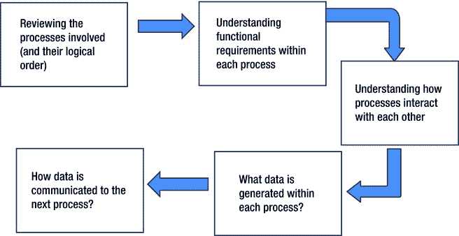
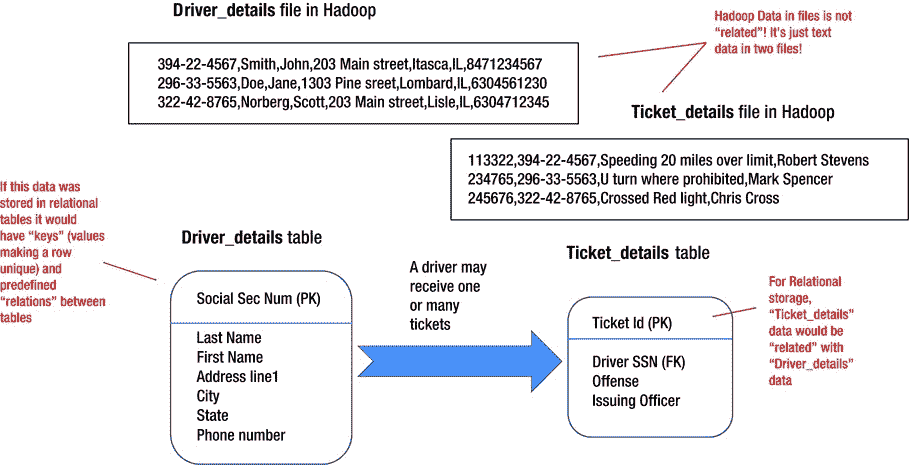
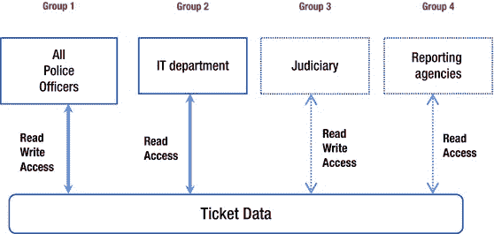
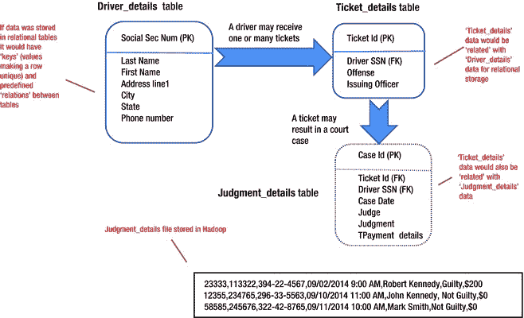
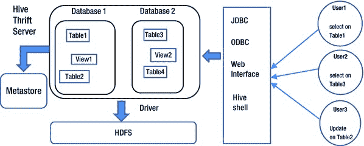

第五章


实施粒度授权

设计细粒度的授权让我想起了一个故事，一位著名的银行经理被一次对他的保险箱的抢劫所困扰。银行经理非常不安，他立即为金库设置了多层安全和密码。第二天，客户要求他打开保险库。经理在极度兴奋中忘记了密码，保险库不得不被强行打开(当然是合法的)。

您可能会发现，设计细粒度的安全性是一个棘手的问题。太多的安全和太少的安全一样会适得其反。没有什么魔法可以让它变得恰到好处。如果您分析了所有流程(包括手动和自动流程)并对数据进行了很好的分类，您就可以确定谁需要访问哪些特定资源以及需要什么级别的访问权限。这就是细粒度授权的定义:每个用户都拥有对必要资源的正确访问级别。微调 Hadoop 安全性以允许由功能需求驱动的访问将使您的 Hadoop 集群更不容易受到黑客和未授权访问的攻击，而不会牺牲可用性。

在本章中，您将学习如何确定安全需求(基于应用程序)，然后研究如何使用目录和文件级权限为应用程序设计高级安全性和细粒度授权。为了说明这一点，我将带您看一个修改过的真实世界的例子，这个例子涉及交通罚单数据以及警察、法院和报告机构对这些数据的访问。本章最后讨论了如何使用 Apache Sentry 实现细粒度的授权，并回顾了交通票据的例子，以突出 Sentry 在 Hive 中的使用，Hive 是一个与 HDFS 协同工作的数据库。在本章结束时，你将会对如何设计细粒度授权有一个很好的理解。

设计用户授权

定义细粒度授权的细节是一个多步骤的过程。这些步骤是:

1.  分析你的环境，
2.  对数据进行分类以便访问，
3.  确定谁需要访问什么数据，
4.  确定必要的访问级别，以及
5.  实现您设计的安全模型。

下面几节将通过这个完整的过程来定义真实场景中的细粒度授权。

打电话给警察:一个真实世界的安全例子

几年前我为芝加哥警察局做过一些工作，涉及到该部门的票务系统。该系统基本上有三个部分:警车上的移动控制台，当地警察局的本地数据库，以及芝加哥市中心警察总部的中央数据库。为什么微调授权在这种情况下很重要？考虑一下没有它的潜在滥用:例如，如果 it 部门拥有对数据的修改权限，某个既得利益者可以修改特定票据的数据。最初的系统是使用 Microsoft SQL Server 开发的，但是对于我的例子，我将针对 Hadoop 环境重新设计它。同时，您还将了解 Hadoop 实现与基于关系数据库的实现有何不同。

分析和分类数据

第一步是检查和分析所涉及的系统(或应用程序)。此外，审查系统的高级目标和用例有助于阐明访问需求。在考虑用例时，不要忘记维护、备份和灾难恢复。系统概述是一个很好的起点，回顾所涉及的手动过程也是如此(按照逻辑顺序)。在这两种情况下，您的目标是了解每个流程中的功能需求，了解流程之间的交互方式，确定每个流程中生成的数据，并跟踪这些数据是如何传递给下一个流程的。[图 5-1](#Fig1) 说明了一个系统的分析。



[图 5-1](#_Fig1) 。分析系统或应用程序

在我的例子中，第一个过程是由警官(签发罚单的人)生成罚单数据。这些数据被传输到当地警察局的数据库中，显然，检票员、他或她在警察局的主管以及警察总部的上层管理人员都需要拥有修改权限。

当地警察局的其他警察需要读取这些数据的权限，因为他们可能想要查看在特定日期开出的所有罚单或一个人的驾驶历史，同时决定是开罚单还是只开警告。因此，警官在当地警察局数据库(当天)以及位于警察总部的中央数据库中查找罚单数据(使用司机的社会安全号码或 SSN)。

作为第二个过程，来自当地警察局(来自整个芝加哥地区)的罚单数据每晚被传送到警察总部的中央数据库。

第三个也是最后一个过程是每天晚上为所有警察局的主管自动生成每日报告。这些报告汇总了当天的票证活动，由报告用户(由 IT 创建)运行。

票证数据的详细信息

这个票据数据不是一个单独的实体，而是一组包含所有数据的相关实体。理解保存这些数据的数据库的设计将有助于设计详细的安全级别。

两个*表*，或者 Hadoop 术语中的*文件*，保存所有的票数据。正如表被用来在关系数据库中存储数据一样，HDFS 使用文件。在这种情况下，假设 Hadoop 将数据存储为逗号分隔的文本文件。(当然，Hadoop 支持多种格式来存储数据，但是一个简单的例子有助于更好地理解这些概念。)表格和文件详情汇总在[图 5-2](#Fig2) 中。



[图 5-2](#_Fig2) 。票证数据的详细信息:信息的分类和表格与文件的存储

第一个表`Driver_details`，保存司机的所有个人信息:合法全名、SSN、当前地址、电话号码等等。第二个表`Ticket_details`包含罚单的详细信息:罚单编号、司机的 SSN、违规代码、签发官员等等。

此外，这些表彼此“相关”。关系符号表明每个司机(在`Driver_details`中出现)可能有一张或多张他名下的票，细节在`Ticket_details`中。罚单怎么会和司机有关系？通过使用 SSN。SSN 是*主键*(表示为 *PK* )或`Driver_details`表的唯一标识符，因为 SSN 唯一地标识一个驱动程序。然而，由于一个司机可能有多张票，SSN 不是`Ticket_details`表的唯一标识符，仅用于将票关联到一个司机(表示为 *FK* 或*外键*)。

请理解，票证数据示例非常简单，只是演示了如何使用粒度权限。此外，它还做出了以下假设:

*   该示例使用 Hadoop 2.x，因为我们需要向所有数据文件追加数据，而早期版本不支持追加。当地警察局当天的所有罚单将在每晚附加到位于警察总部的适当数据文件中。
*   记录不会被更新，但状态标志将用于指示活动记录(最近的记录被标记为活动的，较早的记录被标记为非活动的)。
*   没有对记录的并发修改。
*   在写入数据时没有会损害系统完整性的故障。
*   功能需求是，只有警官(签发罚单的人)、警官的主管和更高级别的管理人员应该有权修改罚单，但是这种期望的粒度在 HDFS 中是不可能的！为此需要使用 Hive 或另一个 NoSQL 数据库。目前，我只是给所有警察提供了修改权。然而，在下一节中，您将学习如何使用 Hive 和 Sentry 来重新实现这个示例，以达到期望的粒度。

生产系统可能要复杂得多，需要更复杂的设计来保证有效的安全性。

回到我们的例子，我们如何设计角色来保护票据数据并根据需要提供访问？我们的设计必须满足所有的功能需求(对于系统内的所有过程)，而不提供太多的访问(由于数据的敏感性)。本节的下一部分将解释如何实现。

确定访问组及其访问级别

根据三个流程的功能需求，车票数据需要读写(修改)访问权限。接下来的问题是，哪些组需要哪些权限([图 5-3](#Fig3) )？三个子组需要对此数据的部分读写权限；称他们为第一组:

*   出票警官
*   当地警察主管
*   总部的高级管理层


[图 5-3](#_Fig3) 。使用详细的访问权限对票证数据进行分组访问

第 2 组，警察总部的 IT 部门，需要读取权限。[图 5-3](#Fig3) 说明了这种访问。

[表 5-1](#Tab1) 列出了权限。

[表 5-1](#_Tab1) 。组和实体的权限详细信息(表)

<colgroup><col width="40%"> <col width="30%"> <col width="30%"></colgroup> 
| 

桌子

 | 

第一组

 | 

第二组

 |
| --- | --- | --- |
| `Driver_details` | 读/写 | 阅读 |
| `Ticket_details` | 读/写 | 阅读 |

因此，总结、分析和分类您的数据，然后确定需要访问数据适当部分的逻辑组。有了这些认识，您就可以设计用于定义细粒度授权的角色，并确定这些角色所需的权限组。

逻辑设计(即使是像票务系统这样非常高级的例子)也必须导致物理实现。只有这样，你才能有一个有效的系统。下一节重点介绍实现该示例设计的细节。

实现安全模型

实施安全模型是一个多步骤的过程。一旦您很好地理解了角色及其权限需求，您就可以开始了。以下是要遵循的步骤:

1.  安全的数据存储。
2.  根据需要创建用户和组。
3.  分配所有权、组和权限。

理解一些关于 Hadoop 文件权限的基本事实将在这个过程中帮助你。

Hadoop 中的票证数据存储

对于票务系统的例子，我将从在 HDFS 实现数据存储开始。正如您之前看到的，Hadoop 中的数据存储在文件`Driver_details`和`Ticket_details`中。这些文件位于 Hadoop 的根数据目录下，如图[图 5-4](#Fig4) 所示。为了更好地理解该图，考虑一些关于 HDFS 文件权限的基本事实。


[图 5-4](#_Fig4) 。HDFS 目录和文件权限

*   HDFS 文件有三组权限，分别针对所有者、组和其他人。使用十个字符的字符串来指定权限，比如`-rwxrwxrwx`。
*   第一个字符表示目录或文件(`-`表示文件或`d`表示目录)，接下来的三个字符表示文件所有者的权限，接下来的三个表示所有者的组，最后三个表示其他组。
*   任何分组的可能值是`r`(读权限)、`w`(写权限)、`x`(执行权限)或`–`(占位符)。注意`x`只对可执行文件或目录有效。

在[图 5-4](#Fig4) 中，文件`Driver_details`和`ticket_details`的所有者(root)拥有`rw-`权限，即读写权限。接下来的三个字符是组的权限(意味着属于该文件所属组的所有用户，在本例中为`hdfs`)。组的权限为`rw-`，表示所有组成员对该文件都有读写权限。最后三个字符表示对其他人的权限(不拥有该文件且不属于该文件所属的同一组的用户)。对于这个例子，其他人只有读权限(`r--`)。

添加 Hadoop 用户和组以实现文件权限

作为实现该系统基本授权的最后一步，我需要在 Hadoop 中定义适当的用户和组,并调整文件权限。

首先，我为这个服务器创建了与示例中的两个组相对应的组:组 1 称为`POfficers`，组 2 称为`ITD`。

```scala
[root@sandbox ~]# groupadd POfficers
[root@sandbox ~]# groupadd ITD

```

列出并验证组是一个好主意:

```scala
[root@sandbox ~]# cut –d: -f1 /etc/group | grep POfficers

```

我还为组`POfficers`创建了用户`Puser`，为组`ITD`创建了用户`Iuser`:

```scala
[root]# useradd Puser –gPOfficers
[root]# useradd Iuser –gITD

```

接下来，我设置了密码:

```scala
[root]# passwd Puser
Changing password for user Puser.
New password:
Retype password:
Passwd: all authentication tokens updated successfully.

```

现在，作为最后一步，我分配所有者和组来实现权限。在[图 5-5](#Fig5) 中可以看到，文件`Driver_details`和`Ticket_details`的所有者被更改为虚拟用户`Puser`，组权限被设置为写；因此来自组`POfficers`(所有警察)的用户将拥有读/写权限，来自其他组的用户(即 IT 部门)将只有读取权限。


[图 5-5](#_Fig5) 。更改 HDFS 文件的所有者和组

将[表 5-1](#Tab1) 与所有实体(HDFS 同名文件)的最终权限进行比较，你会发现目标已经达到:`Puser`拥有文件`Driver_details`和`Ticket_details`，属于组`POfficers`(组 1)。权限`-rw-rw-r--`表示组 1 中的任何一个用户都有读/写权限，而属于任何其他组(例如组 2)的用户只有读权限。

这个例子让您对 Hadoop 集群的微调授权有了一个基本的了解。不幸的是，现实世界是复杂的，我们不得不与之打交道的系统也是如此！所以，为了让事情更真实一点，我将扩展这个例子，你可以看到在票旁边发生了什么。

扩展票证数据

罚单只来自警方。最终，法院会介入进一步处理罚单。因此，一些票据数据需要与司法系统共享。该组需要读取以及修改数据的某些部分的权利，但只有在罚单通过交通法院处理后。此外，机票数据的某些部分需要与报告机构共享，报告机构根据需要将这些数据提供给保险公司、征信机构和其他国家实体。

这些假设不会改变基本组，但将需要两个新的组:一个用于司法机构(组 3)，另一个用于报告机构(组 4)。现在权限结构看起来像[图 5-6](#Fig6) 。



[图 5-6](#_Fig6) 。使用详细的访问权限对票证数据进行分组访问，显示新的组

随着功能和组的增加，数据也必须增加。例如，表`Judgement_details`将包含罚单的司法历史，比如案件日期、最终判决、罚单支付细节等等。Hadoop 将以相同的名称将该表存储在一个文件中([图 5-7](#Fig7) )。



[图 5-7](#_Fig7) 。票证数据的详细信息—信息分类—增加了法律详细信息表

像[图 5-2](#Fig2) ，[图 5-7](#Fig7) 也说明了如果关系数据库用于存储，数据将如何保存在表格中。这只是为了比较 Hadoop 中的数据存储和关系数据库系统中的数据存储。正如我前面所讨论的，存储在关系数据库系统中的数据是相关的:司机数据(`Driver_details`表)与票据数据(`Ticket_details`表)相关，使用 SSN 来关联或链接数据。使用附加表(`Judgement_details`)，票据的法院判决再次使用 SSN 与驾驶员和票据细节相关或链接。

众所周知，Hadoop 使用文件来存储数据。所以，就 Hadoop 而言，有一个额外的数据文件用于存储与司法相关的数据— `Judgement_details`。没有关联或链接存储在多个文件中的数据的概念。当然，您可以通过编程的方式链接数据，但是 Hadoop 不会自动为您这样做。当您在 HDFS 存储数据时，了解这种差异非常重要。

添加一个表也会改变权限结构，正如你在[表 5-2](#Tab2) 中看到的。

[表 5-2](#_Tab2) 。组和实体的权限详细信息


添加新的组增加了可能的权限排列，但无助于解决复杂的权限需求(请参考“使用 Apache Sentry 进行基于角色的授权”一节，以了解如何实现粒度权限)。例如，如果警察部门只希望出票官员和车站负责人拥有车票的书面许可，该怎么办？在[图 5-7](#Fig7) 和[表 5-2](#Tab2) 中定义的组显然不能用于实现这一要求。针对如此复杂的需求，Hadoop 提供了*访问控制列表*(*ACL*)，与 Unix 和 Linux 使用的 ACL 非常相似。

HDFS 的访问控制列表

根据 HDFS 权限模型，对于任何文件访问请求，HDFS 会针对最适用的特定用户类别实施权限。例如，如果请求者是文件所有者，则检查所有者类权限。如果请求者是拥有该文件的组的成员，则检查组类权限。如果请求者不是文件所有者或文件所有者组的成员，则检查其他类权限。

这种权限模型适用于大多数情况，但不是所有情况。例如，如果所有警察、IT 部门经理和负责管理票务系统的系统分析师都需要对`Ticket_details`和`Driver_details`文件的写权限，那么现有的四个组不足以实现这些安全要求。您可以创建一个名为`Ticket_modifiers`的新所有者群组，但是保持群组成员的最新状态可能会有问题，因为人员变动(人们更换工作)，以及由手动错误或疏忽导致的错误或不适当的权限。

用于限制对数据的访问，ACL 在您的权限需求复杂且具体的情况下提供了一个非常好的替代方案。因为 HDFS 使用与 Linux 相同的(基于 POSIX 的)权限模型，所以 HDFS ACL 是模仿 Unix 和 Linux 已经使用了很长时间的 POSIX ACLs。Apache Hadoop 2.4.0 以及所有其他主要供应商的发行版中都提供了 ACL。

除了文件的所有者和组之外，您还可以使用 HDFS ACL 为特定用户或组定义文件权限。但是，对文件使用 ACL 确实会导致 NameNode 使用额外的内存，因此您的最佳实践是为特殊情况保留 ACL，并为常规安全实现使用个人和组所有权。

要使用 ACL，您必须首先在 NameNode 上启用它们，方法是将以下配置属性添加到`hdfs-site.xml`并重新启动 NameNode:

```scala
<property>
<name>dfs.namenode.acls.enabled</name>
<value>true</value>
< /property>

```

启用 ACL 后，HDFS CLI(命令行界面)中会添加两个新命令:`setfacl`和`getfacl`。`setfacl`命令分配权限。通过它，我可以为票务示例的 it 经理(`ITMgr`)和分析师(`ITAnalyst`)设置读写权限:

```scala
> sudo -u hdfs hdfs dfs -setfacl -m user:ITMgr:rw- /Driver_details
> sudo -u hdfs hdfs dfs -setfacl -m user:ITAnalyst:rw- /Driver_details

```

使用`getfacl`，我可以验证权限:

```scala
> hdfs dfs -getfacl /Driver_details
# file: /Driver_details
# owner: Puser
# group: POfficers
user::rw-
user:ITAnalyst:rw-
user:ITMgr:rw-
group::r--
mask::rw-
other::r--

```

当 ACL 被启用时，文件列表显示`a + in`权限:

```scala
> hdfs dfs -ls /Driver_details
-rw-rw-r--+ 1 Puser POfficers 19 2014-09-19 18:42 /Driver_details

```

您可能会遇到需要对目录中的所有文件或目录中的所有子目录和文件应用特定权限的情况。在这种情况下，您可以为目录指定默认 ACL，该 ACL 将自动应用于该目录中所有新建的子文件和子目录:

```scala
> sudo -u hdfs hdfs dfs -setfacl -m default:group:POfficers:rwx /user

```

验证权限显示已应用默认设置:

```scala
> hdfs dfs -getfacl /user

# file: /user
# owner: hdfs
# group: hdfs
user::rwx
group::r-x
other::r-x
default:user::rwx
default:group::r-x
default:group:POfficers:rwx
default:mask::rwx
default:other::r-x

```

请注意，在我们的简单示例中，我为来自组`POfficers`的所有用户保留了`rw-`访问权限，因此 ACL 实际上没有限制任何内容。在现实世界的应用程序中，我很可能会将组`POfficers`的访问权限限制为比批准的 ACL 定义的用户更少(可能只是读权限)。

请注意`hdfs`将默认 ACL 仅应用于新创建的子目录或文件；默认 ACL 的应用或对父目录的默认 ACL 的后续更改不会自动应用到现有子目录或文件的 ACL。

您还可以使用 ACL 来阻止特定用户对目录或文件的访问，而不会意外撤销任何其他用户的权限。假设一名分析师已被调到另一个部门，因此不再有权访问票据信息:

```scala
> sudo -u hdfs hdfs dfs -setfacl -m user:ITAnalyst:--- /Driver_details

```

验证更改:

```scala
> hdfs dfs -getfacl /Driver_details

# file: /Driver_details
# owner: Puser
# group: POfficers
user::rw-
user:ITAnalyst:---
user:ITMgr:rw-
group::r--
mask::rw-
other::r--

```

有效使用 ACL 的关键是了解用户访问 HDFS 文件时 ACL 条目的评估顺序。权限按以下顺序评估和实施:

1.  如果用户拥有该文件，则强制实施所有者权限。
2.  如果用户有 ACL 条目，则这些权限将被强制执行。
3.  如果用户是(文件所有权)组的成员，则使用这些权限。
4.  如果某个组有一个 ACL 条目，并且用户是该组的成员，则使用这些权限。
5.  如果用户是文件组或任何其他具有拒绝访问文件的 ACL 条目的组的成员，则用户被拒绝访问(文件)。如果用户是多个组的成员，则对所有匹配条目实施权限联合。
6.  最后，如果没有其他权限适用，则使用组`others`的权限。

总而言之，HDFS ACL 对于实现复杂的权限需求或向特定用户或组提供不同于文件所有权的权限非常有用。但是，请记住，要明智地使用 ACL，因为带有 ACL 的文件会导致 NameNode 占用更多的内存。如果您确实计划使用 ACL，请确保在确定 NameNode 内存大小时考虑到这一点。

基于角色的 Apache Sentry 授权

Sentry 是一个为存储在 HDFS 的数据提供基于角色的授权的应用程序，由 Cloudera 开发并提交给 Apache Hadoop 社区。它提供了与关系数据库非常相似的细粒度授权。在撰写本文时，Sentry 是为存储在 HDFS 的数据提供 RBAC(基于角色的授权控制)的最成熟的开源产品，尽管 Hortonworks (Argus)的另一个项目是一个挑战者。Sentry 目前与 Hive(由 Apache 软件基金会提供的数据库/数据仓库)和 Impala(由 Cloudera 开发的查询引擎，受谷歌 Dremel 的启发)合作。

Hive 架构和授权问题

Hive 是一个与 HDFS 合作的数据库。它的查询语言在语法上非常类似于 SQL，这也是它受欢迎的原因之一。需要记住的数据库的主要方面如下:

*   Hive 将数据组织成熟悉的数据库概念，如表、行、列和分区。
*   Hive 支持原始数据类型:整数、浮点数、双精度数和字符串。
*   配置单元表是 HDFS 目录(和其中的文件)。
*   分区(对于配置单元表)是“表”HDFS 目录中的子目录。
*   配置单元权限存在于数据库或表级别，可以授予用户、组或角色。
*   配置单元权限包括 select(读取)、update(修改数据)和 alter(修改元数据)。

然而，Hive 并不完美。它使用存储库(Metastore)来存储与表相关的元数据，因此，如果直接更改底层 HDFS 对象的权限，可能会出现表元数据和 HDFS 权限不匹配的情况。Hive 没有能力阻止或识别这种情况。因此，通过用户的操作系统用户或组，用户可能被授予对某个表的 select 权限，但对 HDFS 内的相应目录/文件具有 update 或 write 权限。此外，Hive 无法为表数据的特定部分或部分表数据提供权限。无法提供列级权限、定义视图(用于更精细的数据访问控制)或定义服务器级角色。

Sentry 解决了其中的一些问题。它提供了服务器、数据库和表级别的角色，并且可以使用 Hive 外部表—您可以使用这些表对用户进行部分数据访问控制。

图 5-8 展示了 Hive 的架构以及它与 HDFS 的关系。



[图 5-8](#_Fig8) 。Hive 体系结构及其授权

哨兵建筑

作为一个集成了 Hive 和 Impala 的安全模块，Sentry 提供了高级授权控制，能够更安全地访问 HDFS 数据。我们将关注 Sentry 与 Hive 的集成(因为它的使用更广泛)。Sentry 使用*规则*为数据库对象指定精确的权限，并使用*角色*来组合或合并规则，从而可以轻松地对不同数据库对象的权限进行分组，同时提供为各种类型的权限创建规则的灵活性(如选择或插入)。

为哨兵创建规则和角色

Sentry 使用*规则*授予精确的控制权，以指定用户对数据库、模式或表中数据子集的访问。例如，如果数据库`db1`有一个名为`Employee`的表，那么为`Insert`提供访问的规则可以是:

```scala
server=MyServer->db=db1->table=Employee->action=Insert

```

一个*角色*是一组访问配置单元对象的规则。各个规则用逗号分隔，并分组形成一个角色。

例如，`Employee_Maint`角色可以指定为:

```scala
Employee_Maint = server=Myserver->db=db1->table=Employee->action=Insert, \
server=server1->db=db1->table=Employee_Dept->action=Insert, \
server=server1->db=db1->table=Employee_salary->action=Insert

```

这里，`Employee_Maint`角色允许任何用户(拥有该角色)在表`Employee`、`Employee_Dept`和`Employee_salary`中插入行。

基于角色的授权简化了权限管理，因为管理员可以根据其组织内的职能角色为权限分组创建模板。

多部门管理使中央管理员能够委托单个管理员使用数据库级角色管理每个独立数据库或模式的安全设置。例如，在下面的代码中，`DB2_Admin`角色授权数据库`db2`的所有权限，而`Svr_Admin`授权服务器`MyServer`的所有权限:

```scala
DB2_Admin = server=MyServer->db=db2
Svr_Admin = server=MyServer

```

在 Sentry 中创建规则和角色只是第一步。如果要使用角色，需要将角色分配给用户和组。Sentry 如何识别用户和群组？下一节将对此进行解释。

了解 Sentry 中的用户和组

*用户*是由认证子系统认证并被允许访问 Hive 服务的人。因为该示例假设正在使用 Kerberos，所以用户将是 Kerberos 主体。一个*组*是被授予一个或多个授权角色的一个或多个用户的集合。Sentry 目前支持 HDFS 支持的组和本地配置的组(在配置文件`policy.xml`中)。例如，考虑`policy.xml`中的以下条目:

```scala
Supervisor = Employee_Maint, DB2_Admin

```

如果`Supervisor`是一个 HDFS 支持的组，那么属于这个组的所有用户都可以执行角色`Employee_Maint`和`DB2_Admin`允许的任何 HiveQL 语句。但是，如果`Supervisor`是一个本地组，那么属于这个组的用户(称他们为`ARoberts`和`MHolding`)必须在文件`policy.xml`中定义:

```scala
[users]
ARoberts = Supervisor
MHolding = Supervisor

```

[图 5-9](#Fig9) 展示了 Sentry 在带有 Kerberos 认证的 Hadoop 架构中的位置。


[图 5-9](#_Fig9) 。使用 Sentry 的 Hadoop 授权

总的来说，在回顾了 Hive 和 Sentry 架构之后，您已经了解了它们各自提供的安全范围。您已经简要了解了如何设置规则、角色、用户和组。因此，您现在已经准备好重新实现本章前面部分定义的票务系统(使用 Sentry)。

实施角色

在用适当的规则、角色、用户和组重新实现票务系统之前，花点时间回顾一下它的功能需求。罚单是由开罚单的警察开出的。罚单数据存储在当地警察局的数据库中，所有警察都需要有修改权限。位于警察总部的 IT 部门需要对这些数据的读取权限，以便进行报告。一些罚单数据由司法系统共享，他们需要对部分数据的读取和修改权限，因为数据在罚单通过交通法院处理后被修改。最后，这些数据的某些部分需要与报告机构共享，这些报告机构根据需要向保险公司、征信机构和其他国家机构提供这些数据。表 5-3 总结了这些要求；更多细节，请参考图 5-7 。

[表 5-3](#_Tab3) 。组和实体的权限详细信息


最初使用 HDFS 文件权限的实现很简单，但是没有考虑以下问题:

*   创建票证时，会自动创建一个司法记录(案例),其中包含父记录`ticket_id`(指明该案例属于哪个票证)和案例详细信息。警察应该有权将该记录插入到包含罚单详细信息的`Judgement_details`表中，但不允许修改判决和其他案件详细信息的列。文件权限不够灵活，无法实现这一要求。
*   (为案例分配的)法官应该对包含案例详细信息的列拥有修改权限，但不应该对包含票证详细信息的列拥有修改权限。还是那句话，文件权限处理不了这个。

要实现这些需求，您需要 Sentry(或其等价物)。然后，使用 Hive，您需要创建具有相关列的外部表(司法人员或警察需要写访问的列)，并为适当的部门提供对这些外部表的写访问，而不是对`Ticket_details`和`Judgement_details`表的写访问。

对于此示例，假设集群(用于实施)运行的是 CDH4.3.0 (Cloudera Hadoop 发行版 4.3.0)或更高版本，并且安装了带有 Kerberos 身份验证的 HiveServer2。

作为第一步，您需要进行一些配置更改。将配置单元仓库目录(`/user/hive/warehouse`或配置单元配置文件`hive-site.xml`中为属性`hive.metastore.warehouse.dir`指定的任何其他路径)的所有权更改为用户`hive`和组`hive`。将仓库目录的权限设置为`770 (rwxrwx---)`，即所有者和组的读、写、执行权限；但是对于`others`或不属于组`hive`的用户没有权限。您可以在`hive-site.xml`中将属性`hive.warehouse.subdir.inherit.perms`设置为`true`，以确保子目录上的权限也将被设置为`770`。接下来，将属性`hive.server2.enable.doAs`更改为`false`。这将作为运行服务`Hiveserver2`的用户执行所有查询。最后，在配置文件`taskcontroller.cfg`中将属性`min.user.id`设置为`0`。这是为了确保`hive`用户可以提交 MapReduce 作业。

完成这些配置更改后，您就可以设计必要的表、规则、角色、用户和组了。

设计表格

您需要创建表 `Driver_details`、`Ticket_details`和`Judgement_details`，以及一个外部表`Judgement_details_PO`，如下所示:

```scala
CREATE TABLE Driver_details (SocialSecNum STRING,
Last Name STRING,
First Name STRING,
Address STRUCT<street:STRING, city:STRING, state:STRING, zip:INT>,
Phone BIGINT)
ROW FORMAT DELIMITED FIELDS TERMINATED BY '\;'
LOCATION "/Driver_details";

CREATE TABLE Ticket_details (TicketId BIGINT,
DriverSSN STRING,
Offense STRING,
Issuing Officer STRING)
ROW FORMAT DELIMITED FIELDS TERMINATED BY '\;'
LOCATION "/Ticket_details";

CREATE TABLE Judgement_details (CaseID BIGINT,
TicketId BIGINT,
DriverSSN STRING,
CaseDate STRING,
Judge STRING,
Judgement STRING,
TPaymentDetails STRING)
ROW FORMAT DELIMITED FIELDS TERMINATED BY '\;'
LOCATION "/Judgement_details";

CREATE EXTERNAL TABLE Judgement_details_PO (CaseID BIGINT,
TicketId BIGINT,
DriverSSN STRING)
ROW FORMAT DELIMITED FIELDS TERMINATED BY '\;'
LOCATION "/user/hive/warehouse/Judgement_details";

```

如果你参考图 5-5 中的[，你会发现我使用了相同的列(就像我们在 Hadoop 文件或表格中使用的一样)来创建这些表格，并且只是根据需要替换数据类型(例如，`Last Name`是一个字符串，或者数据类型`STRING`；但是`TicketId`是大整数还是`BIGINT`。最后一个表`Judgement_details_PO`被创建为 Hive *外部表*，这意味着 Hive 只管理这个表的元数据，而不管理实际的数据文件。我创建这个表作为外部表，表的前两列是`Judgement_details`,因为我需要某些资源来拥有只修改这两列的权限——而不是那个表中的其他列。](#Fig5)

设计规则

我需要设计规则来提供实现票务系统所需的安全性。该示例有四个表，各种角色将需要读取(选择)或修改(插入)权限，因为没有对 Hive 或 HDFS 数据的“更新”。我将简单地追加(或插入)记录的新版本。所以，规则如下:

```scala
server=MyServer->db=db1->table=Driver_details->action=Insert
server=MyServer->db=db1->table=Ticket_details->action=Insert
server=MyServer->db=db1->table=Judgement_details->action=Insert
server=MyServer->db=db1->table=Judgement_details_PO->action=Insert
server=MyServer->db=db1->table=Driver_details->action=Select
server=MyServer->db=db1->table=Ticket_details->action=Select
server=MyServer->db=db1->table=Judgement_details->action=Select

```

这些规则只是对所有表执行选择或修改操作。

设计角色

让我们使用我们创建的规则来设计角色。第一个角色是所有警察:

```scala
PO_role = server=Myserver->db=db1->table= Driver_details ->action=Insert, \
server=MyServer->db=db1->table= Driver_details ->action=Select, \
server=MyServer->db=db1->table= Ticket_details ->action=Insert, \
server=MyServer->db=db1->table= Ticket_details ->action=Select, \
server=MyServer->db=db1->table= Judgement_details ->action=Select, \
server=MyServer->db=db1->table= Judgement_details_PO ->action=Insert

```

请注意，该角色允许所有警官对表`Driver_details`和`Ticket_details`拥有读/写权限，但只对`Judgement_details`拥有读权限。理由是警察不应该被允许改变判决的细节。您还将观察到警察拥有对`Judgement_details_PO`的写权限，这是为了纠正前两列(没有任何司法信息)——以防有任何错误！

下一个角色是 IT 部门的员工:

```scala
IT_role = server=MyServer->db=db1->table= Driver_details ->action=Select, \
server=MyServer->db=db1->table= Ticket_details ->action=Select, \
server=MyServer->db=db1->table= Judgement_details ->action=Select

```

IT 员工对所有的表只有读权限，因为他们不允许修改任何数据。

司法机构的作用如下:

```scala
JU_role = server=MyServer->db=db1->table= Judgement_details ->action=Insert, \
server=MyServer->db=db1->table= Driver_details ->action=Select, \
server=MyServer->db=db1->table= Ticket_details ->action=Select

```

judiciary 拥有驾驶员和票证数据的读取权限(因为他们不应该修改这些数据)，但拥有输入司法数据的写入权限，因为只有他们才可以修改这些数据。

最后，对于报告机构来说，作用很简单:

```scala
RP_role = server=MyServer->db=db1->table=Judgement_details->action=Select

```

报告机构拥有对`Judgement_details`表的读取权限，只是因为他们被允许报告判决。所有其他数据都是保密的，他们对此没有任何权限。

设置配置文件

我必须为 Sentry 设置各种配置文件，以整合我们之前设置的角色。第一个文件是`sentry-provider.ini`，它定义了每个数据库的策略文件(及其位置)、任何服务器级或数据库级角色，以及 Hadoop 组及其分配的(服务器级或数据库级)角色。下面是`sentry-provider.ini`如何寻找我们的例子:

```scala
[databases]
# Defines the location of the per DB policy file for the db1 DB/schema
db1 = hdfs://Master:8020/etc/sentry/customers.ini

[groups]
# Assigns each Hadoop group to its set of roles
db1_admin = db1_admin_role
admin = admin_role

[roles]
# Implies everything on MyServer -> db1\. Privileges for
# db1 can be defined in the global policy file even though
# db1 has its only policy file. Note that the Privileges from
# both the global policy file and the per-DB policy file
# are merged. There is no overriding.
db1_admin_role = server=MyServer->db=db1

# Implies everything on server1
admin_role = server=MyServer

```

在本例中，数据库`db1` ( `customers.ini`)有一个特定的策略文件，并使用其位置进行定义。定义了服务器和数据库`db1`的管理员角色(`admin_role`、`db1_admin_role`)。适当的 Hadoop 组(`db1_admin`、`admin`)被分配给这些管理员角色。

下一个文件是`db1.ini`。它是数据库`db1`的每个数据库的策略文件:

```scala
[groups]
POfficers = PO_role
ITD = IT_role
Judiciary = JU_role
Reporting = RP_role

[roles]
PO_role = server=MyServer->db=db1->table= Driver_details ->action=Insert, \
server=MyServer->db=db1->table= Driver_details ->action=Select, \
server=MyServer->db=db1->table= Ticket_details ->action=Insert, \
server=MyServer->db=db1->table= Ticket_details ->action=Select, \
server=MyServer->db=db1->table= Judgement_details ->action=Select, \
server=MyServer->db=db1->table= Judgement_details_PO ->action=Insert

IT_role = server=MyServer->db=db1->table= Driver_details ->action=Select, \
server=MyServer->db=db1->table= Ticket_details ->action=Select, \
server=MyServer->db=db1->table= Judgement_details ->action=Select

JU_role = server=MyServer->db=db1->table= Judgement_details ->action=Insert, \
server=MyServer->db=db1->table= Driver_details ->action=Select, \
server=MyServer->db=db1->table= Ticket_details ->action=Select

RP_role = server=MyServer->db=db1->table=Judgement_details->action=Select

```

注意上面我已经在`roles`部分定义了所有的角色(之前设计的)。`groups`部分将 Hadoop 组映射到定义的角色。现在，我之前建立了 Hadoop 组`POfficers`和`ITD`。我将需要建立两个额外的组(`Judiciary`和`Reporting`)，因为我在`db1.ini`文件中为它们映射了角色。

最后一步是设置哨兵配置文件`sentry-site.xml`:

```scala
<configuration>
  <property>
    <name>hive.sentry.provider</name>
    <value>org.apache.sentry.provider.file.HadoopGroupResourceAuthorizationProvider</value>
  </property>

  <property>
    <name>hive.sentry.provider.resource</name>
    <value>hdfs://Master:8020/etc/sentry/authz-provider.ini</value>
  </property>

  <property>
    <name>hive.sentry.server</name>
    <value>Myserver</value>
  </property>
</configuration>

```

最后，要启用 Sentry，我们需要向`hive-site.xml`添加以下属性:

```scala
<property>
<name>hive.server2.session.hook</name>
<value>org.apache.sentry.binding.hive.HiveAuthzBindingSessionHook</value>
</property>

<property>
<name>hive.sentry.conf.url</name>
<value>hdfs://Master:8020/etc/sentry-site.xml</value>
</property>

```

这就结束了使用 Apache Sentry 的票务系统示例的重新实现。为我们的票务系统指定正确的授权级别是可能的，因为 Sentry 允许我们定义规则和角色，在必要时限制对数据的访问。如果没有这种灵活性，要么分配太多的访问权限，要么没有访问权限。

摘要

作为为数不多的为 Hadoop 数据提供基于角色的授权的应用程序之一，Sentry 是一个相对较新的版本，仍处于萌芽状态。尽管如此，它在实现基于角色的安全性方面还是提供了一个良好的开端，尽管它远不能与现有的关系数据库技术所提供的安全性相媲美。诚然，Sentry 在提供可与 Oracle 或 Microsoft SQL Server 相媲美的产品方面还有很长的路要走，但目前它是为数不多的可用选项之一。这也是为什么最佳实践是用 Hive 的一些特性来补充哨兵功能的原因！

您可以使用 Hive 来补充和扩展 Sentry 的功能。例如，在票务示例中，我使用 Hive 的外部表特性来创建一个角色，该角色只对表的某些列提供写权限。Sentry 本身不能提供对表的部分写权限，但是您可以将它与 Hive 结合使用来提供这样的权限。我鼓励您研究其他有用的 Hive 特性，并创建自己的角色来扩展 Sentry 的功能。位于`https://cwiki.apache.org/confluence/display/Hive/LanguageManual+DDL`的 Apache 文档提供了许多有用的建议

最后，本章的票务示例证明了您可以通过在 Hive 中定义一个外部表来为角色提供部分数据访问(从第一列开始的列数)。有趣的是，对于一个使用 Sentry 的表，您不能只提供对某些列的访问(例如第四至第八列)。当然，使用 Hive 提供的特性，还有其他方法来实现这样的请求！