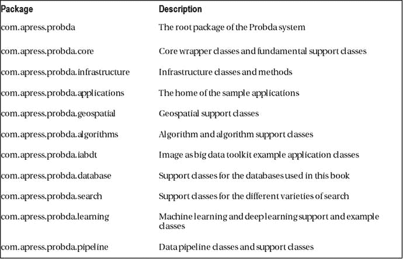
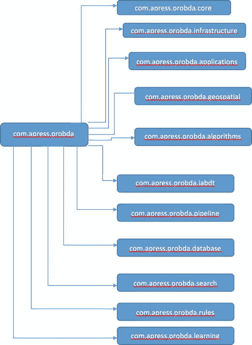
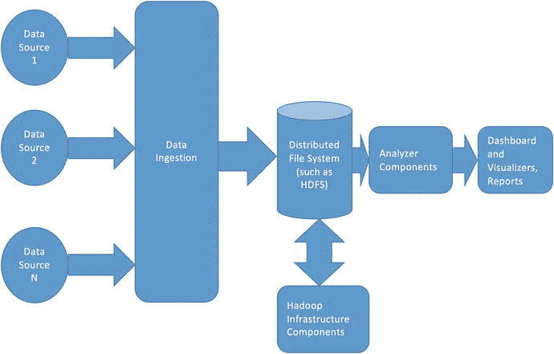
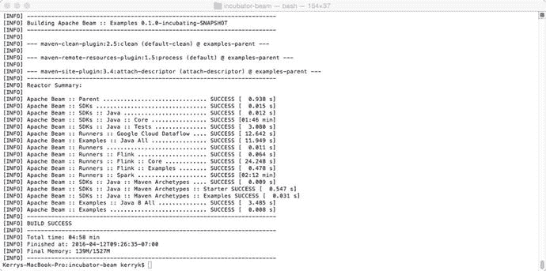
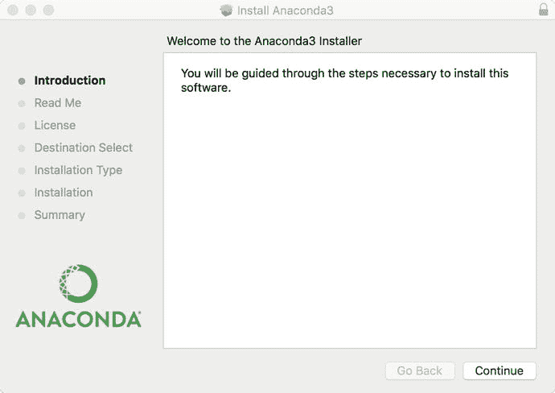
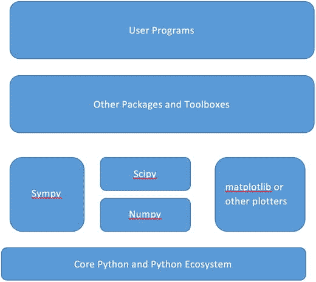
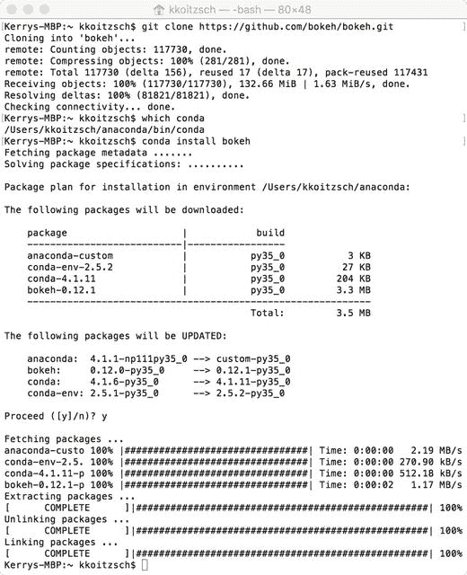
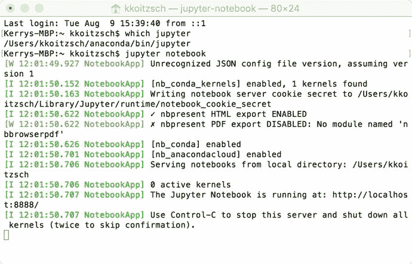

# 5.数据管道以及如何构建它们

在本章中，我们将讨论如何使用标准数据源和 Hadoop 生态系统构建基本的数据管道。我们提供了一个端到端的例子，说明如何使用 Hadoop 和其他分析组件来链接和处理数据源，以及这与标准 ETL 过程有何相似之处。我们将在第 [15](08.html) 章更详细地阐述本章提出的观点。

A Note About the Example System Structure

由于我们将认真地开始开发示例系统，所以在这里对示例系统的包结构做一个说明是合适的。整本书中开发的示例系统的基本包结构如图 [5-1](#Fig1) 所示，附录 a 中也有再现。在进入数据管道构建之前，让我们简要检查一下包包含的内容及其作用。图 [5-2](#Fig2) 显示了 Probda 系统的一些主要子包的简要描述。



图 5-2。

Brief description of the packages in the Probda example system



图 5-1。

Fundamental package structure for the analytics system

在这一章中，我们将关注包`com.apress.probda.pipeline`中的类。

代码贡献中提供了五个基本 java 类，这将使您能够使用基本的数据管道策略来读取、转换和编写不同的数据源。有关更多详细信息，请参见代码贡献注释。

## 5.1 基础数据管道

一个基本的分布式数据管道可能看起来像图 [5-3](#Fig3) 中的架构图。



图 5-3。

A basic data pipeline architecture diagram

我们可以使用标准的现成软件组件来实现这种类型的架构。

我们将使用 Apache Kafka、Beam、Storm、Hadoop、Druid 和 Gobblin(以前的 Camus)来构建我们的基本管道。

## 5.2 Apache Beam 简介

Apache Beam ( [`http://incubator.apache.org/projects/beam.html`](http://incubator.apache.org/projects/beam.html) `)`是专门为构建数据管道而设计的工具包。它有一个统一的编程模型，并被设计成这样，因为我们在本书中的方法的核心是设计和构造分布式数据管道。无论是使用 Apache Hadoop、Apache Spark 还是 Apache Flink 作为核心技术，Apache Beam 都以一种非常符合逻辑的方式融入了技术堆栈。在写这本书的时候，Apache Beam 还是一个酝酿中的项目，所以请查看网页了解它的现状。

Apache 射束编程模型中的关键概念是:

*   “PCollection”:表示数据的集合，其大小可以是有界的或无界的
*   “PTransform”:表示将输入 PCollections 转换为输出 PCollections 的计算
*   “管道”:管理准备执行的 PTransforms 和 PCollections 的有向非循环图
*   “PipelineRunner”:指定管道应该在何处以及如何执行

这些基本元素可用于构建具有许多不同拓扑的管道，如清单 [5-1](#Par14) 中的示例代码。



图 5-4。

Successful Maven build of Apache Beam, showing the reactor summary

```scala
 static final String[] WORDS_ARRAY = new String[] {
 "probda analytics", "probda", "probda pro analytics",
 "probda one", "three probda", "two probda"};

 static final List<String> TEST_WORDS = Arrays.asList(WORDS_ARRAY);

 static final String[] WORD_COUNT_ARRAY = new String[] {
 "probda: 6", "one: 1", "pro: 1", "two: 1", "three: 1", "analytics: 2"};

 @Test
 @Category(RunnableOnService.class)
 public void testCountWords() throws Exception {
 Pipeline p = TestPipeline.create();

 PCollection<String> input = p.apply(Create.of(TEST_WORDS).withCoder(StringUtf8Coder.of()));

 PCollection<String> output = input.apply(new CountWords())
 .apply(MapElements.via(new FormatAsTextFn()));

 PAssert.that(output).containsInAnyOrder(WORD_COUNT_ARRAY);
 p.run().waitUntilFinish();
 }

```

```scala
cd to contribs/Hadoop and run the Maven file installation
    mvn clean package

Listing 5-1.Apache Beam test code snippet example

```

## 5.3 阿帕奇猎鹰简介

Apache Falcon(https://falcon.apache.org)是一个 feed 处理和 feed 管理系统，旨在使最终用户更容易在 Hadoop 集群上进行 feed 处理和执行 feed 管理。

Apache Falcon 提供了以下功能:

Apache Falcon ( [`https://falcon.apache.org`](https://falcon.apache.org) `)`)可用于处理和管理 Hadoop 集群上的“feeds ”,从而提供一个管理系统，使实现 onboarding 和建立数据流变得更加简单。它还有其他有用的功能，包括:

*   在 Hadoop 环境中建立各种数据和处理元素之间的关系
*   feed 管理服务，如 feed 保留、跨集群复制、归档等。
*   易于采用新的工作流/管道，支持后期数据处理和重试策略
*   与 metastore/目录(如 Hive/HCatalog)集成
*   根据源组(相关源的逻辑组，可能会一起使用)的可用性向最终客户提供通知
*   支持在 colo 和全局聚合中进行本地处理的用例
*   捕获提要和进程的沿袭信息

## 5.4 数据源和接收器:使用 Apache Tika 构建管道

Apache Tika(tika.apache.org)是一个内容分析工具包。请参阅附录 a 中的 Apache Tika 安装说明。

使用 Apache Tika，几乎所有主流数据源都可以与分布式数据管道一起使用。

在本例中，我们将加载一种特殊的数据文件，采用 DBF 格式，使用 Apache Tika 处理结果，并使用 JavaScript 可视化工具观察我们的工作结果。

DBF 文件通常用于表示标准的数据库面向行的数据，如清单 [5-2](#Par30) 所示。

```scala
Map: 26 has: 8 entries...
STATION-->Numeric
5203
MAXDAY-->Numeric
20
AV8TOP-->Numeric
9.947581
MONITOR-->Numeric
36203
LAT-->Numeric
34.107222
LON-->Numeric
-117.273611
X_COORD-->Numeric
474764.37263
Y_COORD-->Numeric
3774078.43207

```

DBF 文件通常用于表示标准的数据库面向行的数据，如清单 [5-3](#Par30) 所示。

读取 DBF 文件的典型方法如清单 [5-3](#Par30) 所示。

```scala
public static List<Map<String, Object>>readDBF(String filename){
                Charset stringCharset = Charset.forName("Cp866");
        List<Map<String,Object>> maps = new ArrayList<Map<String,Object>>();
                try {
                File file = new File(filename);
                DbfReader reader = new DbfReader(file);
                DbfMetadata meta = reader.getMetadata();
                DbfRecord rec = null;
                int i=0;
                while ((rec = reader.read()) != null) {
                        rec.setStringCharset(stringCharset);
                        Map<String,Object> map = rec.toMap();
                        System.out.println("Map: " + i + " has: " + map.size()+ " entries...");

                        maps.add(map);
                        i++;
                }
                reader.close();
                } catch (IOException e){ e.printStackTrace(); }
                catch (ParseException pe){ pe.printStackTrace(); }
                System.out.println("Read DBF file: " + filename + " , with : " + maps.size()+ " results...");
                return maps
}

```

goblin([`http://gobblin.readthedocs.io/en/latest/`](http://gobblin.readthedocs.io/en/latest/)`)`)——原名加缪——是另一个基于我们之前谈到的“通用分析范式”的系统的例子。

“这里缺少一些东西:是一个通用的数据接收框架，用于从各种数据源(如数据库、rest APIs、FTP/SFTP 服务器、文件服务器等)提取、转换和加载大量数据。，到 Hadoop 上。Gobblin 处理所有数据摄取 ETL 所需的常见例行任务，包括作业/任务调度、任务划分、错误处理、状态管理、数据质量检查、数据发布等。Gobblin 在同一个执行框架中接收来自不同数据源的数据，并在一个地方管理不同来源的元数据。这一点，再加上其他特性，如自动可伸缩性、容错性、数据质量保证、可扩展性和处理数据模型演变的能力，使 Gobblin 成为一个易于使用、自助式和高效的数据摄取框架。”

图 [5-5](#Fig5) 显示了 Gobblin 系统的成功安装。


图 5-5。

A successful installation of Gobblin

## 5.5 计算和转换

我们的数据流的计算和转换可以通过少量的简单步骤来执行。这部分处理管道有几个候选方案，包括 Splunk 和提供 Rocana Transform 的商业软件。

我们可以使用 Splunk 作为基础，也可以使用 Rocana Transform。Rocana 是一个商业产品，因此为了使用它，您可以购买它或使用免费的评估试用版。

Rocana ( [`https://github.com/scalingdata/rocana-transform-action-plugin`](https://github.com/scalingdata/rocana-transform-action-plugin) ) Transform 是一个配置驱动的转换库，可以嵌入任何基于 JVM 的流处理或批处理系统，如 Spark Streaming、Storm、Flink 或 Apache MapReduce。

其中一个代码贡献示例展示了如何构建 Rocana 转换引擎插件，该插件可以在示例系统中执行事件数据处理。

在 Rocana 中，转换插件由两个重要的类组成，一个基于 Action 接口，另一个基于 ActionBuilder 接口，如代码贡献中所述。

## 5.6 可视化和报告结果

一些可视化和报告最好用面向笔记本的软件工具来完成。大多数基于 Python——比如 Jupyter 或 Zeppelin。回想一下，Python 生态系统看起来有点像图 [5-6](#Fig6) 。Jupyter 和 Zeppelin 将在“其他包和工具箱”标题下，但这并不意味着它们不重要。


图 5-8。

Successful installation of the Anaconda Python system



图 5-7。

Initial installer diagram for the Anaconda Python system



图 5-6。

Basic Python ecosystem , with a place for notebook-based visualizers

在接下来的章节中，我们将会看到几个复杂的可视化工具包，但是现在让我们从一个更流行的基于 JavaScript 的工具包 D3 开始，它可以用来可视化各种各样的数据源和表示类型。这些包括地理位置和地图；标准饼图、折线图和条形图；表格报告；以及许多其他东西(定制的表示类型、图形数据库输出等等)。

一旦 Anaconda 正常工作，我们就可以安装另一个非常有用的工具包 TensorFlow。TensorFlow ( [`https://www.tensorflow.org`](https://www.tensorflow.org) `)`是一个机器学习库，其中也包含对各种“深度学习”技术的支持。



图 5-10。

Successfully installing Anaconda



图 5-9。

Successfully running the Jupyter notebook program Note

回想一下，要构建 Zeppelin，请执行以下步骤:

```scala
mvn clean package -Pcassandra-spark-1.5 -Dhadoop.version=2.6.0 -Phadoop-2.6 -DskipTests

```


图 5-11。

Sophisticated visualizations may be created using the Jupyter visualization feature .

## 5.7 总结

在本章中，我们讨论了如何构建一些基本的分布式数据管道，并概述了一些更有效的工具包、堆栈和策略来组织和构建您的数据管道。其中包括 Apache Tika、Gobblin、Spring Integration 和 Apache Flink。我们还安装了 Anaconda(这使得 Python 开发环境更容易设置和使用)，以及一个重要的机器学习库 TensorFlow。

此外，我们还研究了各种输入和输出格式，包括古老但有用的 DBF 格式。

在下一章，我们将讨论使用 Lucene 和 Solr 的高级搜索技术，并介绍一些有趣的 Lucene 新扩展，如 ElasticSearch。

## 5.8 参考文献

Lewis，N.D .用 Python 一步步深度学习。2016.[T2`www.auscov.com`](https://falcon.apache.org)

克里斯·马特曼和朱卡·齐汀。蒂卡在行动。纽约州谢尔特岛:曼宁出版公司，2012 年。

扎克内，吉安卡洛。TensorFlow 入门。英国伯明翰:PACKT 开源出版，2016 年。