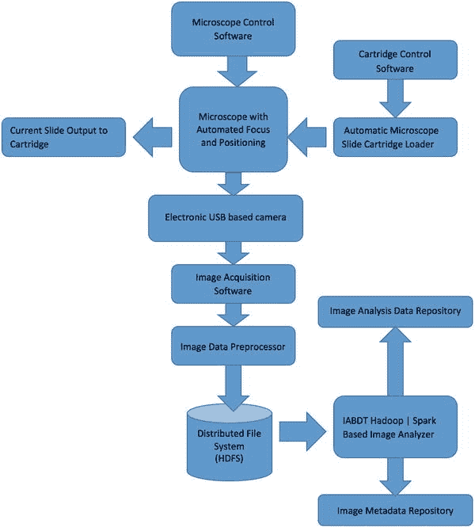
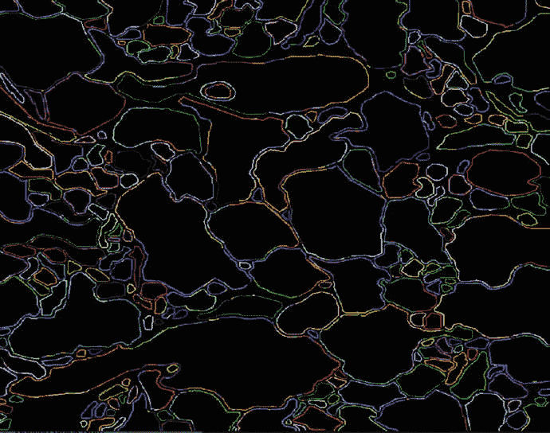
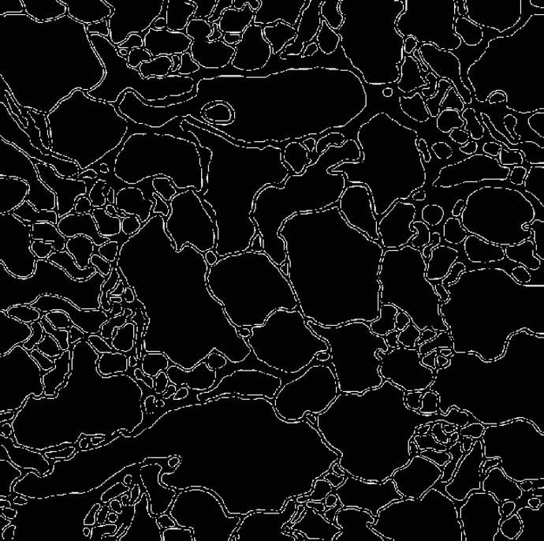
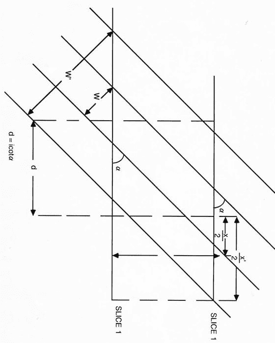
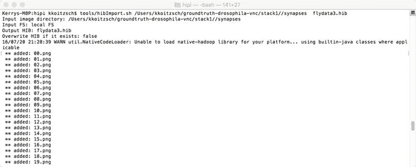
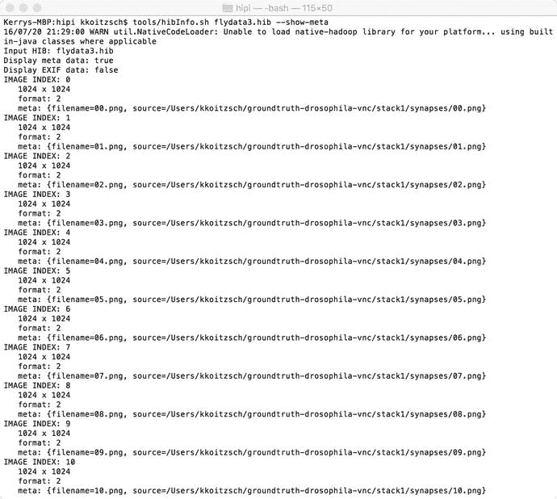

# 11.生物信息学案例研究:分析显微镜载玻片数据

在这一章中，我们描述了一个分析显微载玻片数据的应用程序，例如在对病人样本的医学检查或犯罪现场的法医证据中可能发现的数据。我们举例说明了 Hadoop 系统如何用于组织、分析和关联生物信息学数据。

Note

本章使用一组免费提供的果蝇图像来展示如何分析显微镜图像。严格地说，这些图像来自电子显微镜，它能够实现比你可能在高中生物课上第一次遇到的普通光学显微镜更高的图像放大倍数和分辨率。然而，对传感器数据输出的分布式分析的原理是相同的。例如，您可以使用来自小型无人机的图像，并对无人机相机输出的图像进行分析。软件组件和许多分析操作保持不变。

## 11.1 生物信息学简介

生物学作为一门科学有着悠久的历史，跨越了许多世纪。然而，只是在过去的五十年左右，生物数据作为计算机数据才成为理解信息的一种方式。

生物信息学是将生物数据理解为计算机数据，并对计算机数据进行有规律的分析。我们通过利用专门的库来翻译和验证生物和医学数据集中包含的信息来执行生物信息学，这些数据包括 x 射线、显微镜载玻片图像、化学和 DNA 分析、传感器信息(如心电图、MRI 数据)以及许多其他类型的数据源。

光学显微镜已经存在了数百年，但是直到最近，图像处理软件才开始分析显微镜载玻片图像。最初，这些分析是以非常特别的方式进行的。然而，现在显微镜载玻片图像本身已经成为“大数据”集，可以通过使用数据分析管道进行分析，正如我们在整本书中所描述的那样。

在这一章中，我们检查了一个分布式分析系统，该系统专门用于执行我们在图 [8-1](08.html#Fig1) 中看到的自动化显微镜载玻片分析。在我们的其他例子中，我们将使用标准的第三方库在 Apache Hadoop 和 Spark 基础设施上构建我们的分析系统。

对于医学生物信息学的技术和算法的深入描述，参见 Kalet (2009)。

在我们深入到这个例子之前，我们应该再次强调在前面介绍的节点中提出的观点。无论我们使用电子显微镜图像、显微镜载玻片的光学图像，还是更复杂的图像，例如通常代表 X 射线的 DICOM 图像。

Note

本案例研究需要几个特定领域的软件组件，包括一些专门设计的软件包，用于将显微镜及其摄像头集成到标准图像处理应用中。

我们将在本章讨论的示例代码基于图 [11-1](#Fig1) 所示的架构。大多数情况下，我们并不关心机械装置的物理力学，除非我们想要精确控制显微镜的设置。分析系统从该过程的图像采集部分结束的地方开始。与我们所有的示例应用程序一样，在开始定制代码之前，我们会经历一个简单的技术堆栈——组装阶段。使用显微镜是图像处理的一个特例，即“作为大数据的图像”，我们将在第 [14](14.html) 章中对此进行更详细的讨论。



图 11-1。

A microscope slide analytics example with software and hardware components

当我们为我们的技术堆栈选择软件组件时，我们也发展了我们希望在软件中实现的高层次图表。这种想法的一个结果可能如图 [11-2](#Fig2) 所示。我们有数据源(主要来自显微镜摄像头)、处理元素、分析元素和结果持久性。其他一些组件也是必要的，比如保存中间结果的缓存存储库。


图 11-2。

A microscope slide software architecture: high-level software component diagram

## 11.2 自动化显微镜介绍

图 [11-3](#Fig3) 至 [11-5](#Fig5) 显示了载玻片在自动显微镜中经历的阶段。



图 11-5。

Color-coded regions in the image



图 11-4。

Contour extraction from the microscope image


图 11-3。

Original electron microscope slide image, showing a fruit fly tissue slice

我们可以使用组织切片的几何模型，如图 [11-6](#Fig6) 所示。



图 11-6。

Geometric computation of slice dimensions

我们可以使用三维可视化工具来分析一堆神经组织切片，如图 [11-7](#Fig7) 和 [11-8](#Fig8) 中的例子所示。


图 11-8。

Another example of organizing neural tissue


图 11-7。

An example of analyzing slices of neural tissue

## 11.3 代码示例:用图像填充 HDFS

我们将使用 HIPI 包( [`http://hipi.cs.virginia.edu/gettingstarted.html`](http://hipi.cs.virginia.edu/gettingstarted.html) )将图像摄取到 HDFS。Apache Oozie 可以用来安排导入。我们可以按照 HIPI 的在线说明，从基本的 Hadoop 工作开始:

```scala
package com.apress.probda.image;
import org.apache.hadoop.conf.Configured;
import org.apache.hadoop.util.Tool;
import org.apache.hadoop.util.ToolRunner;
public class ImageProcess extends Configured implements Tool {
  public int run(String[] args) throws Exception {
    System.out.println("---- Basic HIPI Example ----");
    return 0;
  }
  public static void main(String[] args) throws Exception {

    ToolRunner.run(new ImageProcess(), args);
    System.exit(0);
  }
}

```

编辑、编译和运行程序以验证结果。

程序的第二次迭代如下:

```scala
package com.apress.probda.image;
import org.hipi.image.FloatImage;
import org.hipi.image.HipiImageHeader;
import org.hipi.imagebundle.mapreduce.HibInputFormat;
import org.apache.hadoop.conf.Configured;
import org.apache.hadoop.util.Tool;
import org.apache.hadoop.util.ToolRunner;
import org.apache.hadoop.fs.Path;
import org.apache.hadoop.io.IntWritable;
import org.apache.hadoop.io.Text;
import org.apache.hadoop.mapreduce.lib.input.FileInputFormat;
import org.apache.hadoop.mapreduce.lib.output.FileOutputFormat;
import org.apache.hadoop.mapreduce.Job;
import org.apache.hadoop.mapreduce.Mapper;
import org.apache.hadoop.mapreduce.Reducer;
import org.apache.hadoop.mapreduce.lib.input.FileInputFormat;
import org.apache.hadoop.mapreduce.lib.output.FileOutputFormat;
import java.io.IOException;
public class ImageProcess extends Configured implements Tool {

  public static class ImageProcessMapper extends Mapper<HipiImageHeader, FloatImage, IntWritable, FloatImage> {
    public void map(HipiImageHeader key, FloatImage value, Context context)
      throws IOException, InterruptedException {
    }
  }
  public static class ImageProcessReducer extends Reducer<IntWritable, FloatImage, IntWritable, Text> {
    public void reduce(IntWritable key, Iterable<FloatImage> values, Context context)
      throws IOException, InterruptedException {
    }
  }
  public int run(String[] args) throws Exception {
    // Check input arguments
    if (args.length != 2) {
      System.out.println("Usage: imageProcess <input HIB> <output directory>");
      System.exit(0);
    }
    // Initialize and configure MapReduce job
    Job job = Job.getInstance();
    // Set input format class which parses the input HIB and spawns map tasks
    job.setInputFormatClass(HibInputFormat.class);
    // Set the driver, mapper, and reducer classes which express the computation
    job.setJarByClass(ImageProcess.class);
    job.setMapperClass(ImageProcessMapper.class);
    job.setReducerClass(ImageProcessReducer.class);
    // Set the types for the key/value pairs passed to/from map and reduce layers
    job.setMapOutputKeyClass(IntWritable.class);
    job.setMapOutputValueClass(FloatImage.class);
    job.setOutputKeyClass(IntWritable.class);
    job.setOutputValueClass(Text.class);
    // Set the input and output paths on the HDFS
    FileInputFormat.setInputPaths(job, new Path(args[0]));
    FileOutputFormat.setOutputPath(job, new Path(args[1]));

    // Execute the MapReduce job and block until it complets
    boolean success = job.waitForCompletion(true);

    // Return success or failure
    return success ? 0 : 1;
  }
  public static void main(String[] args) throws Exception {
    ToolRunner.run(new ImageProcess(), args);
    System.exit(0);
  }
}

```

在代码贡献中寻找完整的代码示例。



图 11-9。

Successful population of HDFS with University of Virginia’s HIPI system

通过在命令行中键入以下命令，检查图像是否已使用 HibInfo.sh 工具成功加载:

```scala
tools/hibInfo.sh flydata3.hib --show-meta

```

您应该会看到类似于图 [11-10](#Fig10) 中的结果。



图 11-10。

Successful description of HDFS images (with metadata information included)

## 11.4 摘要

在本章中，我们描述了一个使用分布式生物信息学技术来分析显微镜载玻片数据的示例应用程序。

在下一章，我们将讨论一个基于贝叶斯分类和数据建模方法的软件组件。这被证明是一种非常有用的技术，可以补充我们的分布式数据分析系统，并已被用于各种领域，包括金融、法医和医疗应用。

## 11.5 参考

格哈德，斯蒂芬，芬克，简，马特尔，朱利安，卡多纳，阿尔伯特，和费特，理查德。"神经组织的分段各向异性系统数据集."检索到 2013 年 11 月 20 日 16:09(格林尼治时间) [`http://dx.doi.org/10.6084/m9.figshare.856713`](http://dx.doi.org/10.6084/m9.figshare.856713)

生物医学信息学原理。英国伦敦:学术出版社 Elsevier，2009 年。

《计算机视觉的特征提取和图像处理》,第三版。英国伦敦:学术出版社 Elsevier，2008 年。