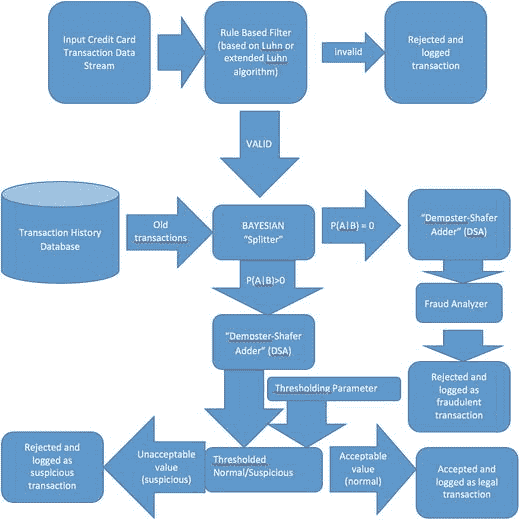
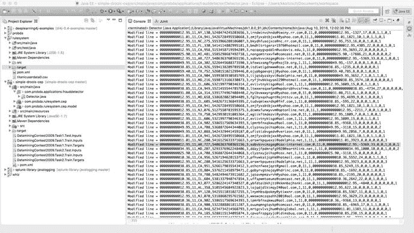
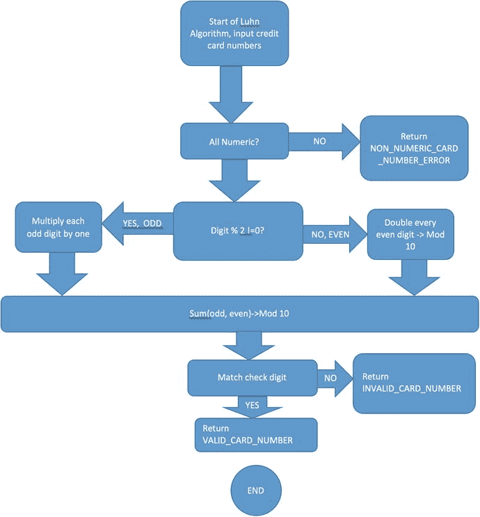

# 12.贝叶斯分析组件:识别信用卡欺诈

在这一章中，我们描述了一个贝叶斯分析软件组件插件，该插件可用于分析信用卡交易流，以识别非法用户对信用卡的欺诈性使用。

Note

我们将主要使用 Apache Mahout 提供的朴素贝叶斯实现，但是我们将讨论使用贝叶斯分析的几种可能的解决方案。

## 12.1 贝叶斯分析简介

贝叶斯网络(也称为信念网络或概率因果网络)是观察、实验或假设的表示。“信念”和“贝叶斯网络”的整个概念是相辅相成的。当我们进行物理实验时，比如使用盖革计数器来识别放射性矿物，或者对土壤样本进行化学测试来推断天然气、煤炭或石油的存在，这些实验的结果都与“信念因素”有关。实验有多精确？实验的“数据模型”——前提、数据、数据变量之间的关系、方法——有多可靠？而我们又有多相信实验的“结论”呢？幸运的是，我们在过去几章中建立的许多基础设施对于处理各种贝叶斯技术非常有用，尤其是图形数据库。几乎所有的贝叶斯网络问题都受益于用图形表示——毕竟，它们是网络——图形数据库可以帮助无缝表示贝叶斯问题。

Note

贝叶斯分析是一个不断发展的概念和技术的巨大领域，现在包括深度学习和机器学习方面。本章末尾的一些参考资料提供了到目前为止在贝叶斯分析中使用的概念、算法和技术的概述。

贝叶斯技术与一个正在发生的金融问题特别相关:识别信用卡欺诈。让我们来看看一个简单的信用卡欺诈算法，如图 18-1 所示。所示的实现和算法基于 Triparthi 和 Ragha (2004)的工作。

我们将描述如何基于图 [12-1](#Fig1) 所示的算法构建一个分布式信用卡欺诈检测器，使用前几章中描述的一些现在已经很熟悉的策略和技术。



图 12-1。

A credit card fraud detection algorithm, following Triparthi and Ragha (2004)

首先:将一个环境变量添加到您的。该应用程序的 bash_profile 文件:

```scala
  export CREDIT_CARD_HOME=/Users/kkoitzsch/probda/src/main/resources/creditcard

```

首先，让我们获取一些信用卡测试数据。我们从在 [`https://www.cs.purdue.edu/commugrate/data/credit_card/`](https://www.cs.purdue.edu/commugrate/data/credit_card/) 发现的数据集开始。这个数据集是 2009 年一个代码挑战的基础。我们只对这些文件感兴趣:

```scala
DataminingContest2009.Task2.Test.Inputs
DataminingContest2009.Task2.Train.Inputs
DataminingContest2009.Task2.Train.Targets

```

将文件下载到`$CREDIT_CARD_HOME/data`。

让我们看看信用卡交易记录的结构。CSV 文件中的每一行都是由以下字段组成的交易记录:

```scala
amount,hour1,state1,zip1,custAttr1,field1,custAttr2,field2,hour2,flag1,total,field3,field4,indicator1,indicator2,flag2,flag3,flag4,flag5
000000000025.90,00,CA,945,1234567890197185,3,redjhmbdzmbzg1226@sbcglobal.net,0,00,0,000000000025.90,2525,8,0,0,1,0,0,2
000000000025.90,00,CA,940,1234567890197186,0,puwelzumjynty@aol.com,0,00,0,000000000025.90,3393,17,0,0,1,1,0,1
000000000049.95,00,CA,910,1234567890197187,3,quhdenwubwydu@earthlink.net,1,00,0,000000000049.95,-737,26,0,0,1,0,0,1
000000000010.36,01,CA,926,1234567890197202,2,xkjrjiokleeur@hotmail.com,0,01,1,000000000010.36,483,23,0,0,1,1,0,1
000000000049.95,01,CA,913,1234567890197203,3,yzlmmssadzbmj@socal.rr.com,0,01,0,000000000049.95,2123,23,1,0,1,1,0,1

```

…以及更多。

查看这个数据集中 CSV 行的标准结构，我们注意到关于字段 4 的一些情况:虽然它有一个 16 位的类似信用卡的代码，但它不符合可以通过 Luhn 测试的标准有效信用卡号。

我们编写一个程序，将事件文件修改为更合适的形式:每个记录的第四个字段现在将包含一个“有效的”Visa 或 Mastercard 随机生成的信用卡号，如图 [12-2](#Fig2) 所示。我们想引入一些“坏的”信用卡号码，以确保我们的检测器能够发现它们。



图 12-2。

Merging valid and invalid “real” credit card numbers with test data

## 12.2 用于信用卡欺诈检测的贝叶斯组件

原则上，从数据集中识别信用卡欺诈的贝叶斯组件与我们讨论的许多其他类型的数据管道是相同的。这又回到了本书的基本原则:分布式分析系统总是某种数据管道，某种工作流处理。可以使用不同的布置、配置和技术选择，但是就整体设计而言，它们共享一些基本特性。

### 12.2.1 信用卡验证基础

我们从信用卡验证的基本原则开始。使用 Luhn 检查可以确定信用卡号码有效，如清单 [12-1](#Par19) 所示。

```scala
public static boolean checkCreditCard(String ccNumber)
    {
            int sum = 0;
            boolean alternate = false;
            for (int i = ccNumber.length() - 1; i >= 0; i--)
            {
                    int n = Integer.parseInt(ccNumber.substring(i, i + 1));
                    if (alternate)
                    {
                            n *= 2;
                            if (n > 9)
                            {
                                    n = (n % 10) + 1;
                            }
                    }
                    sum += n;
                    alternate = !alternate;

            }
            return (sum % 10 == 0);
    }

```

Luhn 信用卡卡号验证算法如图 [12-3](#Fig3) 流程图所示。



图 12-3。

The simple Luhn credit card validation algorithm .

我们可以将机器学习技术添加到欺诈检测组合中。

看一下图 [12-4](#Fig4) 中的算法流程图。该过程包括训练阶段和检测阶段。


图 12-4。

Training and detection phases of a credit card fraud detection algorithm

在训练阶段，聚类过程创建数据模型。

在检测阶段，先前创建的模型用于检测(识别)新的输入事件。

训练/检测程序的实现如图 [12-5](#Fig5) 和图 [12-6](#Fig6) 所示。


图 12-6。

Starting the Apache Storm supervisor from the command line


图 12-5。

Starting Zookeeper from the command line or script is straightforward

您可以运行代码贡献中的完整示例。

## 12.3 摘要

在这一章中，我们讨论了一个围绕贝叶斯分类器开发的软件组件，专门用于识别数据集中的信用卡欺诈。这个应用程序已经被重做和重新思考了很多次，在这一章中，我们想要展示一个实现，在这个实现中，我们使用了我们在整本书中已经开发的一些软件技术来激发我们的讨论。

在下一章，我们将讨论一个现实世界的应用:用计算机模拟寻找矿产资源。“资源寻找”应用程序是一种常见的程序类型，在这种程序中，对现实世界的数据集进行挖掘、关联和分析，以确定“资源”的可能位置，这可能是从地下的石油到无人机图像中的树木簇，或者显微镜载玻片上的特定类型的细胞。

## 12.4 参考

贝叶斯统计导论。纽约州纽约市:约翰·威利父子公司，2004 年。

专家系统和概率网络模型。纽约州纽约市:施普林格出版社，1997 年。

阿德南·达威奇。贝叶斯网络建模与推理。纽约州纽约市:剑桥大学出版社，2009 年。

昆切娃，柳德米拉。组合模式分类器:方法和算法。新泽西州霍博肯:威利跨科学，2004 年。

专家系统中的概率推理:理论与算法。纽约州纽约市:约翰·威利父子公司，1990 年。

尚克，罗杰，里斯贝克，克里斯托弗。内部计算机理解:五个程序加缩影。新泽西州希尔斯代尔:劳伦斯厄尔鲍姆联合公司，1981 年。

特里帕蒂，克里希纳·库马尔和拉加，拉塔。“信用卡欺诈检测的混合方法”，国际软计算与工程杂志(IJSCE) ISSN: 2231-2307，第 3 卷，第 4 期，2013 年 9 月。