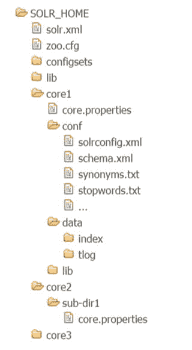
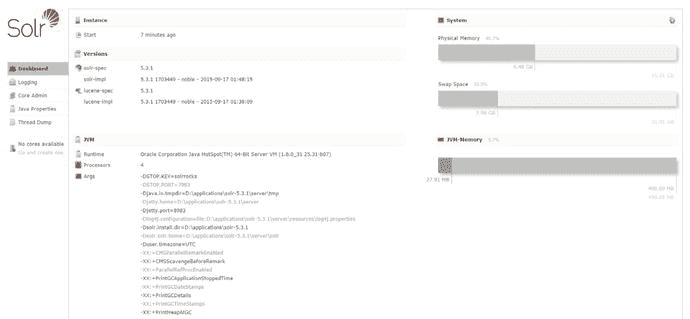
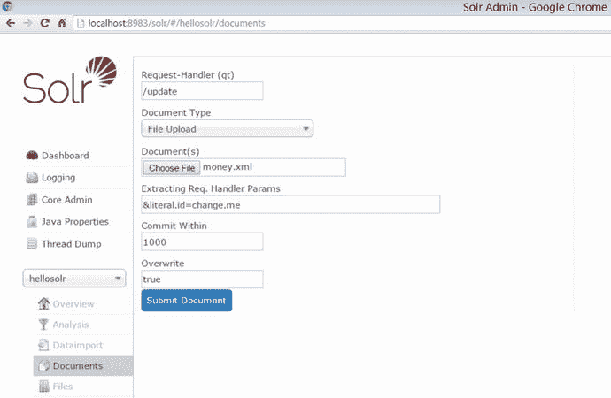
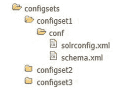

# 2.Solr 设置和管理

索引和搜索是 Solr 中执行的两个主要操作。索引是将内容添加到 Solr 索引以使其可搜索的过程。但是在索引之前，首先需要设置 Solr。版本 5.0 的主要焦点是提高易用性，这使得 Solr 的设置过程变得非常容易。这些步骤非常简单，如果您在无模式模式下运行 Solr，使 Solr 能够动态猜测字段类型并定义字段，整个设置过程可以在几分钟内完成。

本章首先介绍 Solr 基础知识，包括它的术语和目录结构。然后，您将设置 Solr 并简单地索引和搜索示例文档。对于初次使用或从 4.x 版本迁移过来的用户，本章采用了一种简单的演示方法。在阅读这些章节的过程中，您将会看到更高级的例子，并获得一些关于 Solr 特性和组件的背景知识。

此外，您将了解 Solr 的主要用户选项和管理特性。通过这些解释，您将看到 Solr 在早期版本中是如何工作的。为了易于理解和方便，本章假设一个环境只有一个 Solr 实例(或服务器)。第 10 章重点介绍分布式方法和 SolrCloud，它支持复制、可伸缩性和容错。

本章涵盖以下主题:

*   Solr 作为独立服务器
*   重要术语和目录/文件结构
*   实用程序脚本
*   Web 管理界面
*   存储器管理
*   实例管理
*   常见例外

## 独立服务器

Solr 作为一个独立的服务器运行，预先捆绑了启动和运行实例所需的一切。在 5.0 版之前，Solr 是作为 WAR 文件分发的。要部署它，要么使用预绑定的 Jetty 实例，要么将`dist/solr-<version>.war`复制到 Tomcat 或另一个 servlet 容器。但是现在 Solr 抽象了部署过程，需要您将它视为一个独立的服务器，而不必担心在哪里以及如何部署。如果您使用的是以前的版本，您需要从记忆中抹去这些知识，并开始使用为管理提供的脚本。对于那些对它现在是如何部署的感到好奇的人，Solr 在内部使用 Jetty servlet 容器——但那是一个实现细节，你应该把它看作一个独立的服务器。在其他容器中部署 Solr 的灵活性已经被取消，以便更好地利用容器的网络堆栈特性。

图 [2-1](#Fig1) 用一个 Tomcat 的例子来描述 Solr 作为一个服务器以及在 4.x 和 5.x 版本中的部署有何不同。

图 2-1。

Solr versions 4.x and 5.x

在 Solr 5.3.0 之前的版本中，您可以嗅探到`server/webapps`目录中的`solr.war`。

Note

术语“独立服务器”在这里指的是您看待 Solr 的新视角，而不是指只有一个 Solr 实例的环境。在 SolrCloud 模式下，这里提到的每个独立服务器都是一个实例(或节点)。

## 先决条件

Apache Solr 是用 Java 编写的，安装 Solr 5.3.1 的唯一先决条件是 Java 7 或更高版本。建议使用更新版本 u55 或更高版本。强烈建议不要使用以前的版本。如果你的机器运行的是 Java 8，那就更好了，因为它可以提高性能。继续之前，请检查您的 Java 版本，如下所示:

`$ java –version`

`java version "1.8.0_31"`

`Java(TM) SE Runtime Environment (build 1.8.0_31-b13)`

`Java HotSpot(TM) 64-Bit Server VM (build 25.31-b07, mixed mode)`

对于 4.8.x 之前的 Solr 版本，可以使用 Java 6。如果前面的命令没有在您的机器上找到 Java 安装，您可以从 [`www.oracle.com/technetwork/java/javase/downloads/index.html`](http://www.oracle.com/technetwork/java/javase/downloads/index.html) 下载一个副本。安装步骤参见 [`www.java.com/en/download/help/download_options.xml`](https://www.java.com/en/download/help/download_options.xml) 。

## [计] 下载

可以从 [`http://lucene.apache.org/solr/downloads.html`](http://lucene.apache.org/solr/downloads.html) 下载 Solr 的最新二进制。下载页面包含对 Apache 镜像站点的引用。单击建议的选项或任何备份站点，下载最新的二进制文件(zip 或 tar)。

下载完成后，使用适当的工具从压缩的二进制文件中提取目录，如下所示:

`$ tar –xvf solr-5.3.1.tgz (*nix)`

`$ unzip solr-5.3.1.zip (Windows)`

## 术语

为了避免歧义并更好地理解 Solr，了解一些术语以及 Solr 上下文中使用的文件是很重要的。在我们进一步讨论之前，本节先介绍常见术语，然后是 SolrCloud 特定术语，最后是一些重要的文件。

### 通用术语

以下是所有类型的 Solr 设置中使用的通用术语列表:

*   Solr 实例:这个通用术语用在应用服务器的上下文中——例如，Tomcat 实例或 Jetty 实例。这里它指的是运行在 Java 虚拟机(JVM)内部的 Solr 服务器。可以配置零个或多个内核在 Solr 实例中运行。每个 Solr 实例都需要引用一个单独的 Solr 主目录。
*   Solr 核心:您的每个索引和该索引所需的文件构成一个核心。因此，如果您的应用程序需要多个索引，您可以在一个 Solr 实例中运行多个内核(而不是多个 Solr 实例，每个实例包含一个内核)。物理上，每个内核映射到 Solr 主目录中的一个子目录。
*   Solr home:这是 Solr 几乎所有内容都参考的目录。它包含关于核心及其索引、配置和依赖性的所有信息。本书使用术语`$SOLR_HOME`来指代这个目录。
*   Solr shard:这个术语用在分布式环境中，在这种环境中，您在多个 Solr 实例之间划分数据。特定实例上的每个数据块称为一个碎片。碎片包含整个索引的子集。例如，假设您有 3000 万个文档，并计划将它们分成三份，每份包含 1000 万个文档。您将需要三个 Solr 实例，每个都有一个具有相同名称和模式的核心。在提供查询服务时，任何一个碎片都可以接收请求，并将其分发给其他两个碎片进行处理，获得所有结果，然后将合并后的结果返回给客户端。

### 太阳云术语

在 Solr 中，可以有两种类型的分布式架构:传统和 SolrCloud。从 1.3 版开始，分布式搜索的传统方法使用主从架构。在这种方法中，索引是在主服务器上创建的，它被复制到一个或多个专用于搜索的从服务器上。这种方法有几个限制，你会在第 10 章中了解到。

为了解决这些限制，SolrCloud 发布了 4.0 版。这种革命性的方法建立了一个 Solr 服务器集群，以提供容错和高可用性，并提供分布式索引、集中式配置、自动负载平衡和故障转移等功能。

SolrCloud 引入了与传统架构略有不同的新术语。如果您正在使用 SolrCloud，记住这些术语很重要。为了简单起见，本书使用与传统架构相关的术语，除非我们正在做一些特定于 SolrCloud 的事情。以下列表定义了与 SolrCloud 相关的关键术语:

*   节点:Solr 的单个实例在 SolrCloud 中称为一个节点。
*   集群:环境中的所有节点。
*   集合:簇中的完整逻辑索引。集合中的所有碎片都使用同一套配置文件。
*   碎片:一个集合的逻辑部分或切片。每个碎片由一个或多个索引副本组成，以实现冗余。
*   副本:碎片的物理副本，作为 Solr 核心在节点中运行。
*   首领:在一个碎片的所有复制品中，有一个被选为首领。SolrCloud 将所有请求转发给 shard 的领导者，后者将请求分发给副本。
*   ZooKeeper: ZooKeeper 是一个 Apache 项目，被分布式系统广泛用于集中配置和协调。SolrCloud 使用它来管理集群和选举领导者。

### 重要的配置文件

您可以开发一个成熟的搜索引擎，并将其投入生产，甚至不用编写一行 Java 代码。Solr 使这成为可能，它允许您只通过修改 XML 就可以配置所有的特性和模式。您可以通过注册组件并在基于 XML 的配置文件中适当地链接它们来实现一个特性。以下是一些主要的配置文件:

*   `solr.xml`:在启动 Solr 实例时，`solr.xml`是 Solr 在`$SOLR_HOME`目录中寻找的第一个文件。该文件主要包含与 SolrCloud 相关的信息。它的配置适用于 Solr 实例，而其他文件特定于一个核心。Solr 曾经引用这个文件来识别要加载的内核。在 4.4 版中，引入了自动核心发现，在`solr.xml`中创建条目的规定已被否决，从 5.0 版起不再受支持。
*   `solrconfig.xml`:该文件包含与请求处理、响应格式化、索引、配置其他组件、管理内存、缓存和提交相关的特定于核心的配置和定义。
*   `schema.xml` : `C`包含整个模式——字段的定义、类型(也称为`fieldType`)和评分策略(如果有的话)。`fieldType`定义了要在字段上执行的文本分析，以控制索引和搜索时的匹配行为。
*   `core.properties` : Solr 引用该文件进行核心发现。这是一个 Java 属性文件，包含特定于核心的配置，例如核心的名称和数据目录的路径。您还可以在该文件中将自定义属性定义为键值对，并在 Solr 配置文件中引用它来进行值替换。它可以位于任何子目录和任何深度，该目录被视为核心目录。唯一的限制是同一个目录层次不能有多个`core.properties`(不能在另一个核心中创建一个核心)。

## 目录结构

要设置和使用 Solr，您需要理解两组目录结构。一个是 Solr 发行版(从下载的 tar 或 zip 中提取的目录),另一个是 Solr 主目录，其中包含所有内核的索引和配置。

### 太阳能装置

Solr 5.x 发行版的目录结构不同于以前的版本。这一改变是为了让 Solr 更有条理，更易于使用。图 [2-2](#Fig2) 显示了这个新的目录结构。省略号(...)表示该目录包含其他文件或目录。

图 2-2。

Solr installation directory structure

以下是 Solr 发行目录中所有目录和重要文件的描述:

*   `bin`:包含启动、停止和管理 Solr 的实用程序脚本。该目录在 4.8 版中引入，包含适用于 Windows 和*nix 机器的脚本。以下列表描述了这些脚本:
    *   用于启动、停止和其他管理目的的脚本。接下来的章节将对此进行更详细的介绍。
    *   `solr.in.sh/solr.in.cmd`:特定于实例的设置的环境文件。
    *   使用这个脚本，您可以强制终止在特定端口上运行的 Solr 实例。Windows 没有相应的实用程序。
    *   `solr.<port>.port`:当您使用脚本启动 Solr 实例时，会创建这个文件。它供内部使用，在停止实例时会自动删除。
    *   `post`:将文档索引到 Solr 的脚本。
    *   如果你想把 Solr 作为一个服务来安装，这个脚本可以让你以一种交互的方式来完成。
    *   `init.d`:如果想在 Unix 环境下使用`init`进程运行 Solr，可以参考的目录。
*   除了核心库之外，Solr 还包含了其他的库，它们是 Solr 的一部分，但是是来自其他项目的贡献，在需要的时候使用。该目录包含以下子目录，每个子目录构成一个模块:
    *   `analysis-extras`:这包含了额外的国际化和多语言支持的分析器。
    *   `clustering`:上一章提到了 Carrot2。该目录包含在 Solr 中使用 Carrot2 时实现集群的插件。
    *   如果 Solr 是您的二级存储，而 SQL 数据库是您的一级存储，那么您不必担心编写自己的客户端程序来从数据库中获取数据并对其进行索引。`DataImportHandler`是一个贡献的插件，允许您从各种来源导入数据，只需少量的 XML 更改。它不限于数据库，还可以用于从 XML 和 HTTP 数据源导入数据。
    *   `dataimporthandler-extras`:包含使用`DataImportHandler`导入数据时可能需要的附加插件。
    *   `extraction`:要从 Microsoft Word 文档或 Adobe PDFs 等富文档中提取数据，可以使用 Apache Solr 内容提取库(Solr Cell)。这个插件使用 Apache Tika 进行提取，我们在第一章的[中提到过。](01.html)
    *   如果你的文本不是英文的，你的项目可能需要这个模块。Apache Solr 语言标识符插件允许您识别文本的语言并适当地处理它。
    *   `map-reduce`:这个实验模块使您能够使用 map-reduce 作业建立索引。
    *   `morphlines-cell`:这是一个内容提取的实验模块。
    *   `morphlines-core`:这是另一个实验性的插件，它依赖于 Kite Morphlines 框架，在加载到 Solr 时，可以快速轻松地执行海量数据的提取、转换和加载(ETL)。
    *   这个世界上并不是一切都是完美的，你的数据可能就是如此。如果您的数据不是结构化的，您可以在索引数据时使用非结构化信息管理体系结构(UIMA)项目。
    *   如果你想为你的搜索引擎设计一个用户界面，你可以在 Solr 中使用 Apache Velocity 模板引擎。
*   `docs`:这包含了你下载的 Solr 版本的特定文档。
*   `licenses`:这包含了 Solr 提供的所有库的许可信息。
*   默认情况下，这个目录是与 Solr 实例相关的所有内容的中心位置。它包含服务器、Solr 主目录和日志。它还包含 Jetty 配置文件，可以修改这些文件来改变服务器的行为；但是，您应该避免这样做，因为 Solr 希望您忽略实现细节。对于任何定制，您都应该调整`bin`脚本中可用的属性。对于生产环境，建议将 Solr 主目录和日志位置配置为不同于服务器目录。以下是服务器目录中的子目录:
    *   `contexts` : Solr 内部使用 Jetty，这个目录包含 Jetty 为 Solr 所需要的部署描述符。
    *   `etc`:该目录包含 Jetty 配置文件。
    *   `lib`:这包含了 Solr 实例所需的 Jetty 和其他库。
    *   `logs`:默认情况下，Solr 日志在此目录下创建。
    *   `modules`:Jetty 使用它来包含模块定义。
    *   `resources`:包含`log4j.properties`等配置文件。
    *   `scripts`:包含 SolrCloud 的实用脚本。
    *   这是默认的 Solr 主目录，您在“通用术语”一节中已经了解了。我们将在下一节更详细地讨论它。
    *   `solr-webapps` : Jetty 提取这个目录中的 Solr。
    *   `start.jar`:用于启动 Jetty 的可执行 JAR。Solr 5.3.0 已经过内部升级，可以在 Jetty 9 上运行。Solr 不再支持使用“java -jar start.jar”直接运行它，bin/solr 脚本是唯一的方法。

Note

在本书中，术语`$SOLR_DIST`指的是本节讨论的 Solr 发行目录。

### Solr Home

Solr 主目录包含 Solr 配置文件和索引，是与 Solr 实例相关的所有内容的主目录。一个 Solr 实例可以有多个内核，它们都在这个目录中定义。Solr 服务器需要一个对主目录的引用，如果没有提供，将采用配置的默认路径。为了成功启动核心，Solr 要求配置和库以适当的方式可用。在`$SOLR_HOME`中创建一个`lib`目录或者包含相关库的核心目录也是一个很好的实践。

图 [2-3](#Fig3) 显示了一个样本 Solr 主目录，包含三个内核，分别位于`core1`、`core2/sub-dir1`和`core3`，由相应的`core.properties`文件检测。您还可以在`$SOLR_HOME`中看到一个`lib`目录，在所有已定义的内核之间共享依赖关系。

图 2-3。

Solr home directory structure

以下是 Solr 主目录中所有子目录和重要文件的描述:

*   `solr.xml`:这已经在“术语”一节中介绍过了。
*   `zoo.cfg`:包含 ZooKeeper 的配置。第十章采访动物园管理员。如果没有使用 SolrCloud，可以忽略这个文件。
*   `configsets`:如果您想在实例上的多个内核之间共享配置，您可以使用 Solr 4.8 中引入的配置集。即将到来的“核心管理”部分将更详细地介绍这一点。
*   将所有的公共库保存在这个目录中，以便在所有内核之间共享。
*   核心(`core1`、`core2/sub-dir1`、`core3`):在这个例子中，我们有三个索引，所以我们有三个核心。该目录是所有核心相关文件的根目录。
    *   `core.properties` : Solr 引用该文件进行核心的自动发现。它可以出现在目录树中的任何级别，包含该文件的目录将是核心根目录。在图 [2-3](#Fig3) 中，`core2`的目录为`core2/sub-dir1`。因此`conf`、`data`，以及核心特有的一切都应该存在于`sub-dir1`。该文件是一个 Java 属性文件，您可以在其中配置特定于核心的属性。
    *   `conf`:该目录包含所有内核特有的配置文件，包括`solrconfig.xml`和`schema.xml`。
    *   这个目录是为你的索引准备的。`index`子目录包含 Solr 索引，它是在索引文档时创建的。`tlog`子目录包含您的事务日志，这对确保文档写入的一致性至关重要。
    *   `lib`:该目录包含所有特定于核心的依赖项。

## 动手练习

您一定渴望快速启动 Solr 实例并开始搜索结果。本节采用一种简单的方法来启动 Solr、索引文档和搜索结果。在我们在接下来的章节中讨论更详细的例子之前，对整个过程的概述将对您的实验有所帮助。在下一节中，您将更详细地研究如何启动和管理 Solr。

### 开始 Solr

您可以使用发行包中提供的脚本(从 4.10 版开始)来启动 Solr。

`$ cd bin`

`$ ./solr start`

`Started Solr server on port 8983 (pid=2108). Happy searching!`

现在，您的 Solr 实例已经启动，您可以将浏览器指向`http://localhost:8983/solr`。图 [2-4](#Fig4) 显示了 Solr 管理界面。

图 2-4。

Dashboard, the home page of the Solr admin interface

如果您的仪表板显示如图 [2-4](#Fig4) 所示，则 Solr 已经成功启动。如果出现错误，要么不显示该页面，要么在仪表板顶部高亮显示错误信息，如图 [2-5](#Fig5) 所示。如果错误出现在某个特定的内核中，如图 [2-5](#Fig5) 所示，其他内核将按预期工作。

图 2-5。

Core initialization exception

在图 [2-4](#Fig4) 左侧选项卡的底部，您会看到“无内核可用”这是因为我们还没有配置任何核心。如您所知，要创建一个索引，您需要定义一个核心，而核心在物理上位于`SOLR_HOME`目录中。所以首先你应该知道你的`SOLR_HOME`在哪里，或者让服务器把你的首选目录称为`SOLR_HOME`。在下一节中，您将在默认的`SOLR_HOME`目录中创建一个核心，这个目录是分布目录中的`server/solr`。

如果您想在特定端口上运行 Solr，可以按如下方式进行:

`$ ./solr start –p 8980`

指定希望 Solr 运行的端口。前面的命令在端口 8980 上运行 Solr。该参数是可选的。默认情况下，Solr 运行在端口 8983 上。

同样默认情况下，脚本在后台模式下运行 Solr，输出被发送到`solr-<PORT>-console.log`。如果您运行 Solr 的时间很短，并且希望在控制台上打印输出，那么您可以使用`–f`选项来运行它:

`$ ./solr start –f –p 8983 –V`

`-V`是可选的详细模式，即使在后台模式下运行 Solr 时也可以使用。

### 创建一个核心

在 Solr 5.x 中创建内核最简单的方法是无模式化。在无模式模式下，字段是在索引文档时由字段猜测机制动态定义的。下面是一个快速创建无模式核心的例子，默认情况下，当您没有提供配置目录时，Solr 会创建它:

`$ ./solr create -c hellosolr`

`Setup new core instance directory:`

`/home/applications/solr-5.3.1/server/solr/hellosolr`

`Creating new core ’hellosolr’ using command:`

`http://localhost:8983/solr/admin/cores?action=CREATE&name=hellosolr&instanceDir=hellosolr`

`{`

`"responseHeader":{`

`"status":0,`

`"QTime":2461},`

`"core":"hellosolr"}`

`-c <corename>`是您要创建的核心的名称。

刷新您的 Solr 管理页面，您将看到“No cores available”消息被一个列出您创建的核心的下拉菜单所取代。

### 索引一些数据

选择 hellosolr 核心并转到 Documents 选项卡。此选项卡允许您直接从界面中索引文档。图 [2-6](#Fig6) 显示了屏幕快照。要索引文档，您需要选择一种文档类型并以该格式提供数据。让我们将 Solr 附带的样本数据编入索引，并在`example/exampledocs`中提供。因为我们的核心是无模式的，所以我们可以索引目录中的任何 XML 或 JSON 文件，而不用担心字段定义。使用以下步骤对 Solr 提供的`money.xml`文件中的文档进行索引:

From the Document Type drop-down list, select File Upload.   Browse the `money.xml` file.   Click the Submit Document button to index the documents in that file.  

图 2-6。

Uploading the file for indexing

或者，从“文档类型”下拉列表中，您可以选择 XML 选项并粘贴文档进行索引。成功上传或提交后，您将看到回复状态“成功”此状态表示文档已被索引，但只有在提交更改后才能满足搜索请求。默认情况下，管理界面触发此提交，因此您可以开始搜索结果。

Note

`example/exampledocs`中的文件包含 Solr 指定格式的文档，不要随意上传文档。要索引您自己的数据，请创建一个遵循示例文件中约定的文档。

### 搜索结果

访问查询选项卡，然后单击执行查询按钮。这将显示您索引的文档。默认情况下，Solr 从索引中获取前 10 个文档。在“查询”窗格中，q 文本框包含您的查询，您需要以“字段名:查询”的格式指定该查询。这里，* *表示所有字段中的所有值。如果您想要特定查询的结果，例如在`manu`字段中包含短语“Bank of America”的所有文档，您可以在 q 文本框中键入 manu:“Bank of America”。`wt`参数指定了响应格式。图 [2-7](#Fig7) 显示了 json 格式的结果，JSON 被选为 wt 值。

图 2-7。

Search results

既然您已经理解了索引和搜索的简单过程，那么您可以跳过任何不需要的部分，直接跳到与您相关的部分。但是，我建议你按照顺序来。在接下来的部分中，您将深入了解设置和管理任务的细节。

## Solr 脚本

Solr 脚本是在 4.10 版中引入的，从 Solr 5.3.0 开始，脚本是启动 Solr 的唯一条款。对 start.jar 的支持——用 Jetty 运行 Solr 的传统方式——已经被撤销，以支持 HTTP 和 HTTPS Jetty 模块。因此，要启动和停止 Solr，应该使用以下脚本:

`bin/solr – *nix`

`bin/solr.cmd – Windows`

Note

为了避免出现重复的代码，本书使用名称`bin/solr`来指代这两个脚本。这两个脚本的目的是相同的。每一种都有其特定的环境。

在本节中，您将详细了解如何使用`bin/solr`脚本来启动、停止和管理 Solr。这里提供的例子假设您在 Windows 机器上运行来自`bin`目录的脚本。

### 启动 Solr

启动 Solr 很容易！你已经在“动手练习”部分完成了。在这一节中，您将了解更多关于它的细节。

Solr 可以两种模式启动:单机和 SolrCloud。我们忽略了传统的分布式架构，因为它的启动机制与独立模式相同。默认情况下，Solr 以独立模式运行，为了简单起见，本章将对此进行介绍。以下命令使用默认端口 8983 上的默认设置启动 Solr。

`$ solr start`

您可以向 Solr 提供额外的参数来覆盖默认设置，如下例所示。

`$ solr start -p 8983 -h localhost -m 4g`

*   `-p`指定服务器端口
*   `-h`指定主机名
*   `-m`指定 JVM 的堆大小。此参数为-Xms 和-Xmx 指定了相同的值

如果您正在运行 Solr 的早期版本，您可以使用下面指定的`server`目录中的`start.jar`来启动它:

`$ java -jar start.jar`

了解脚本支持的命令及其提供的选项的最简单方法是利用`bin/solr`脚本的`help`命令。您将在下一节学习使用帮助菜单。

### 使用 Solr 帮助

`bin/solr`脚本冗长且有据可查。最好的方法是使用`–` `help`选项。这提供了所有可用的命令以及一些示例:

`$ solr -help`

`Usage: solr COMMAND OPTIONS`

`where COMMAND is one of: start, stop, restart, healthcheck, create, create_core, create_collection, delete`

下面是一个独立的服务器示例(它在后台通过端口 8984 启动 Solr):

`$ solr start -p 8984`

下面是一个 SolrCloud 示例(它使用 localhost:2181 在云模式下启动 Solr 以连接到 ZooKeeper，最大堆大小为 1GB，并启用了远程 Java 调试选项):

`$ solr start -c -m 1g -z localhost:2181 -a "-Xdebug -Xrunjdwp:transport=dt_socket,server=y,suspend=n,address=1044"`

`Pass -help after any COMMAND to see command-specific usage information,`

`such as:    solr start -help or solr stop -help`

现在，如果您知道想要使用的命令，您可以通过在命令名称后键入`–help`来获得关于其用法的更多信息:

`$ solr stop -help`

`Usage: solr stop [-k key] [-p port]`

`-k key      Stop key; default is solrrocks`

`-p port     Specify the port the Solr HTTP listener is bound to`

`-all        Find and stop all running Solr servers on this host`

### 停止 Solr

您可以通过运行如下脚本来停止 Solr:

`$ solr stop –p 8983`

这将停止在端口 8983 上运行的 Solr 实例。必须提供`–p`或`–all`参数。如果指定`–all`，该命令将停止所有正在运行的节点。此外，只有当 Solr 已经用`bin/solr`脚本启动时，前面的命令才会停止 Solr。

当您使用`bin/solr`脚本启动 Solr 时，它会在`bin`目录中创建一个`solr-<port>.port`文件，以标识正在运行的 Solr 实例，然后`stop`命令会删除这个文件。

### 重启 Solr

您可以使用`restart`命令重启一个正在运行的 Solr 实例。start 选项的所有参数都与 restart 一起使用；唯一的区别是`–p <port>`选项是强制的。以下是重启在端口 8983 上运行的 Solr 实例的示例命令:

`$ solr restart –p 8983`

### 确定 Solr 状态

使用`status`命令，您可以在机器中验证 Solr 的所有运行实例。该命令提供实例运行的端口号、Solr 主目录的路径、分配的堆内存量及其消耗状态:

`$ solr status`

`Found Solr process 8076 running on port 8983`

`{`

`"solr_home":"D:\\applications\\solr-5.3.1\\server\\solr\\",`

`"version":"5.3.1 1703449 - noble - 2015-09-17 01:48:15",`

`"startTime":"2015-11-05T18:07:32.916Z",`

`"uptime":"0 days, 0 hours, 57 minutes, 44 seconds",`

`"memory":"80.7 MB (%16.4) of 490.7 MB"}`

`}`

### 配置 Solr 启动

在启动 Solr 之前，您可能希望定制一些属性，比如服务器主机/端口、堆空间分配和 Solr home。以下是这种自定义的两种常用方法:

*   在`solr.in`环境文件中设置属性
*   将这些值作为参数传递给`solr`脚本

环境文件是设置属性的推荐位置，也是持久的。在多次重新启动之间，环境会保留下来。如果通过传递参数来启动 Solr，它将覆盖或附加到环境文件中定义的属性值。

您可以通读环境文件中的注释，或者运行这个命令来查找所有的 Solr 启动选项:

`$ solr start -help`

## 管理 Web 界面

在运行 Solr 的过程中，您使用了 Solr 管理界面进行索引和搜索。Solr admin UI 是一个非常强大的工具，它为 Solr 管理员和开发人员提供了关于他们的核心、实例以及整个集群和环境的深刻见解。它为用户提供了一个丰富的界面来查看配置文件、运行查询、分析文档等等。以下是使用 Solr 管理界面的主要原因:

*   JVM 属性和线程转储:Java Properties 选项卡提供了运行 Solr 的 JVM 的属性，比如类路径和内存设置。“线程转储”选项卡允许您检查服务器线程信息，如线程状态、执行时间和堆栈跟踪。
*   核心管理:控制台中的核心管理选项卡允许您添加、卸载、重新加载、重命名、优化和交换核心。
*   日志管理:Logging 选项卡用一种颜色方案显示日志消息。每种颜色代表不同的日志记录级别。为了方便起见，这些消息是折叠的，可以单击以展开为详细视图。该选项卡还允许您动态更改包和类的日志记录级别。
*   Core overview:选择 Core，默认情况下会加载“overview”页面，提供重要的统计信息，包括索引中的文档数、索引的总大小、上次索引时间、复制信息以及与 core 目录相关的信息。
*   搜索:选择一个核心，然后单击 Query 选项卡进行查询、facet、拼写检查或调用任何自定义搜索处理程序。此页面经常用于运行、调试和评估即席查询。
*   索引:选择一个核心并单击 Documents，通过提交表单来索引 XML、JSON 或 CSV 文档，或者您可以从本地驱动器上传一个文件。如果在`solrconfig.xml`中配置了数据导入，您可以从数据库中导入数据。对于此任务,“数据导入”选项卡提供了一个专用页面。
*   分析:程序员经常使用管理界面来分析字段或字段类型的行为。您可以单击分析选项卡，在相应的字段中输入要索引或查询的文本，然后单击分析值按钮。该系统提供逐步的文本分析，在索引和查询时执行，并在两个标记匹配的步骤处突出显示文本。
*   复制:如果您在传统的主从环境中运行 Solr，您可以通过 Replication 选项卡启用、禁用或强制核心的复制。
*   浏览文件:文件选项卡列出了`<core>/conf`目录中的所有文件和目录。
*   查看组件统计数据:插件/统计数据选项卡允许您查看重要的统计数据。
*   使用模式浏览器:此屏幕允许您选择一个字段或字段类型，并浏览其模式信息和索引标记。这个屏幕对于探索索引术语非常有用。例如，如果要为字段生成停用词列表，可以使用浏览器提供的索引词和计数来评估候选停用词。
*   可视化段信息:底层索引可以由一组子索引或段组成。“段信息”页面将这些段可视化，并提供有关它的元数据，如索引文档数和删除的文档数。

在 Solr 5.1 中，UI 已经使用 AngularJS 进行了重构。

## 存储器管理

在 Solr 中，核心包含一个索引，它的配置文件如`solrconfig.xml`和`schema.xml`，以及其他相关文件。每个核心可以有不同的索引结构，并可用于不同的搜索需求。Solr 实例可以有多个内核，它提供了对所有内核的统一管理。Solr 允许你动态地创建一个内核，重命名它，卸载它，等等。在本节中，您将学习如何在不重启 Solr 服务器的情况下执行所有这些任务。

### 配置集

Solr 4.8 引入了创建配置集的规定，配置集是一组可共享的配置文件，可用于创建新的内核。这些在分布式环境中很有用。Solr 5.x 发行版还捆绑了一些预配置的配置集，您可以参考这些配置集来创建您的核心，而不是从头开始编写。这些命名的配置集可以在`server/solr/configsets`目录中找到。以下是 Solr 5.3.1 中预绑定的配置集列表:

*   `basic_configs`:这包含运行 Solr 所需的最低配置。
*   如果你想无模式化，你可以使用这个配置。它被配置为支持带有字段猜测的托管模式。
*   这是一个成熟的配置，启用了大多数可选功能。您可以使用这个配置集作为核心配置的起点。

### 创建配置集

配置集目录的默认主目录是`SOLR_HOME`。您可以按如下方式创建配置集:

Create a configset directory in `SOLR_HOME`: `$ cd $SOLR_HOME` `$ mkdir configsets`   The `configsets` directory is your configset base directory. In this directory, you can create as many subdirectories as you need. The name of each subdirectory indicates the name of that configset: `$ cd configsets` `$ mkdir configset1 configset2 configset3`   Your named configset subdirectory should contain a `conf` subdirectory with `solrconfig.xml`, `schema.xml`, and other configuration files.   If you want to change the name of your configset base directory, you can do it in `solr.xml`: `<solr>`   `<configSetBaseDir>sharedConfigSets</configSetBaseDir>` `</solr>`  

图 [2-8](#Fig8) 显示了一个配置集目录结构。

图 2-8。

Config Sets directory structure Note

在即将到来的版本中，Solr 将引入 REST API 来管理配置集。这个 API 将允许您将配置集上传到一个模板位置，并使用它们来创建核心。

### 创建核心

假设您有一个新的搜索需求，它需要一个具有不同结构的新模式定义。在上一节中，您使用默认模式创建了一个核心。在本节中，您将学习如何使用现有的配置集创建核心。在第 4 章中，您将学习如何创建模式和定义字段。

如果您的 Solr 实例已经包含一个核心，并且您希望对新的核心使用相同的配置，那么您可以使用该配置创建一个配置集。如果新模式是不同的，我建议您使用与 Solr 预绑定的 configset。命名配置集`sample_techproducts_config`是任何模式设计的良好起点，因为它定义了大多数 Solr 特性。

以下是在 Solr 中创建新内核的方法。创建核心后，通过获取状态或使用 Solr admin UI 来验证它。

#### bin/solr 脚本

`bin/solr`脚本可以在机器上运行的任何 Solr 实例中创建一个新的内核。创建核心的命令如下:

`solr create –c <corename> -d <confdir> -p <port>`

`corename`是强制参数。Solr 自动在`SOLR_HOME`中创建指定的核心目录，以及核心发现所需的`core.properties`文件。

`confdir`是您要使用的命名配置集之一或 conf 目录的路径。Solr 将配置文件从这个目录复制到核心目录。如果没有指定`–d`，Solr 将使用`data_driven_schema_configs`配置集。

`port`标识要在其中创建核心的本地 Solr 实例。如果没有指定`port`，将在脚本找到的第一个运行实例中创建核心。

下面是一个示例命令，它使用`sample_techproducts_configs`配置集在端口 8983 上运行的 solr 实例中创建一个名为 hellosolr 的核心。

`$ ./solr create –c hellosolr -d sample_techproducts_configs -p 8983`

或者，您可以使用带有相同选项的`create_core`命令:

`solr create_core –c <core-name> -d <conf-dir> -p <path>`

`create`选项检查 Solr 在指定端口上是以独立模式还是 SolrCloud 模式运行，并基于此调用`create_core`或`create_collection`。`create_collection`选项用于 SolrCloud 模式。你会在[第 10 章](10.html)中看到一个系列创作的例子。

当使用脚本创建核心时，您不应该手动创建相应的目录，因为脚本会处理它。

#### 核心管理 REST API

创建核心的另一种方法是调用核心管理 API。因为它是一个 REST API，你可以从你的程序中调用它，使用`curl`甚至浏览器。如果您想使用 API 创建一个核心，可以按如下方式进行:

`http://host:port/solr/admin/cores?action=CREATE&name=corename&instanceDir=path/to/instance&config=solrconfig.xml&schema=schema.xml&dataDir=data`

`corename`和`instanceDir`是强制参数。如果不提供其他参数，Solr 会提供默认值。

您可以使用现有配置集创建核心，如下所示:

`http://host:port/solr/admin/cores?action=CREATE&name=corename&instanceDir=path/to/instance&configSet=configset1`

以下是使用核心管理 API 创建 hellosolr 核心的示例:

`$ curl``http://localhost:8983/solr/admin/cores?action=CREATE&name=hellosolr`T2】

#### 管理界面

Solr admin UI 提供了一个创建核心的屏幕——以及核心管理支持的所有操作。尽管本章涵盖了核心管理 API 提供的所有管理选项，但它仅涵盖了用于创建核心的 UI。

在浏览器中打开管理界面。打开“核心管理员”选项卡，然后单击“添加核心”按钮。在显示的表单中填入适当的值，然后单击添加核心。图 [2-9](#Fig9) 显示了创建核心的屏幕快照。

图 2-9。

Solr admin screen for core creation

#### 用手

您甚至可以手动创建一个核心，但是这需要 Solr 重启。以下是手动创建核心需要遵循的步骤:

Create a core directory in `SOLR_HOME`.   Create a `core.properties` file in that directory and define a property `name=<corename>` inside the file. `corename` is the name of your core.   Copy the `conf` directory in the newly created core directory.   Restart the Solr instance.  

同样，您可以手动执行其他核心管理操作。

我介绍这种方法是为了帮助您更好地理解核心管理。您可以在试验和开发过程中采用这种方法。但是在生产中这样做会导致 Solr 实例停机，所以不推荐这样做。

### 核心状态

您可以通过使用核心管理 API 来获取注册的核心的状态。下面的调用给出了所有核心的状态。即使您尚未注册任何核心，也可以进行此呼叫:

`http://localhost:port/solr/admin/cores?action=STATUS`

如果您对特定内核的状态感兴趣，您需要用`<corename>`传递一个额外的`core`参数。

`http://localhost:port/solr/admin/cores?action=STATUS&core=<corename` `>`

`bin/solr`脚本没有为您提供获得核心状态的条款。通过使用这个脚本，您可以只获得 Solr 实例的状态。

### 卸载核心

如果不再需要核心，可以使用核心管理 API 卸载它。此处显示了卸载的终点以及所需的参数:

`http://localhost:port/solr/admin/cores?action=UNLOAD&core=<corename>`

只有在所有现有请求都得到服务后，才卸载核心。所有对核心的新请求都将抛出 404 错误。卸载还提供了通过分别传递参数`deleteIndex=true`、`deleteDataDir=true`和`deleteInstanceDir=true`来删除索引、数据和核心目录的选项。

`deleteInstanceDir`操作也删除了它的子目录。在这种情况下，您不需要在数据目录或索引目录上调用 delete。

Solr 脚本没有为卸载核心提供任何准备。

### 删除核心

如果你不再需要一个核心，可以用以下方法删除。

您可以使用`bin/solr`脚本:

`solr delete -c <corename> -p <port>`

或者，您可以使用核心管理 REST API:

`http://localhost:port/solr/admin/cores?action=UNLOAD&core=<corename>&deleteInstanceDir=true`

有关 API 的详细信息，请参考前面的“卸载核心”一节。

### 核心重命名

如果要更改活动核心的名称，可以使用核心管理 API，如下所示:

`http://host:port/solr/admin/cores?action=RENAME&core=old&other=new`

这会将核心从旧名称重命名为新名称。

### 核心互换

如果您想要交换两个核心的名称，您可以使用核心管理交换 API。例如，您可能需要在活动核心和备用核心之间切换:

`http://host:port/solr/admin/cores?action=SWAP&core=core1&other=core2`

### 核心分裂

Solr 允许您将一个索引拆分成两个或多个索引。当索引变得很大时，您可能希望这样做。这通常在 SolrCloud 中进行分片。以下是分割核心的端点和支持的参数:

`http://host:port/solr/admin/cores?action=SPLIT&core=sourcecore&targetCore=core1&targetCore=core2`

`core`参数表示您想要分割的源核心。为了写入目标内核，您需要提供`targetCore`或`path`参数。如果提供了`path`，索引的相等子集将被写入该路径。如果提供了`targetCore`，那么内核必须可用。索引块将被合并到目标核心。`path`和`targetCore`参数都是多值的。前面的示例在内核`core1`和`core2`之间拆分源内核中的索引。

### 索引备份

失败确实会发生，所以做备份总是让你感到安全。您可以在 Solr 中通过调用`ReplicationHandler,`组件将数据从主实例复制到从实例来进行备份。此处提供了用于备份的 API:

`http://host:port/solr/core/replication?command=backup` `&name=backup-name&location=backup-location`

默认情况下，Solr 会在数据目录中拍摄一个带有当前时间戳的索引快照。如果提供了 location 参数，快照将在绝对目录或 Solr 实例目录的相对目录中拍摄。快照目录以提供的名称或当前时间戳作为后缀。如果您的 Solr 版本早于 5.0，请确保在调用此 API 之前，在`solrconfig.xml`中配置了`ReplicationHandler`。

您还可以配置 Solr 在`commit`或`optimize`期间自动备份索引，并可以指定要维护的备份数量:

`<requestHandler name="/replication" >`

`<lst name="master">`

`<str name="replicateAfter">startup</str>`

`<str name="replicateAfter">optimize</str>`

`<str name="backupAfter">commit</str>`

`<str name="maxNumberOfBackups">2</str>`

`</lst>`

`</requestHandler>`

Solr 允许您通过使用`details`命令来跟踪备份操作的状态:

`http://host:port/solr/core/replication?command=details`

### 索引恢复

Solr 5.2 引入了一个用于恢复备份索引的 API。该 API 将命名备份恢复到当前核心中，恢复完成后，搜索将开始显示快照数据。用于恢复备份的 API 如下:

`http://host:port/solr/core/replication?command=restore&name=<backup-name` `>`

Solr 不允许您在一个操作正在进行时执行另一个备份或恢复操作。

Solr 允许您通过使用`restorestatus`命令来跟踪恢复操作的状态:

`http://host:port/solr/core/replication?command=restorestatus`

在 Solr 5.2 之前的版本中，您需要手动恢复索引。手动过程要求您停止 Solr，重命名/删除索引目录，将快照目录重命名为索引，然后启动 Solr。

## 实例管理

在本节中，您将学习管理和定制应用于 Solr 实例的特性和属性。

### 设置 Solr 主页

你已经知道`SOLR_HOME`是什么，但是直到现在我们一直在谈论默认的 Solr home。从 Solr 5.0 开始，默认的主目录是`server/solr`，在更早的版本中是`example/solr`。最好让`SOLR_HOME`路径不同于您的服务器路径，这样升级就不会那么痛苦。如果您希望您的 Solr 服务器为您的`SOLR_HOME`指向一个不同的位置，您可以使用以下方法之一:

*   用`–s`或`–solr.home`选项启动 Solr 脚本:`$ ./solr start -s /home/` `solr`
*   在`solr.in`环境文件中设置`SOLR_HOME`属性:`SOLR_HOME=/home/solr (*nix)` `set SOLR_HOME=D:\playground\solr (Windows)`

您可以在 Solr admin UI 中通过在 JVM args 部分查找- `Dsolr.solr.home`来验证`SOLR_HOME`的路径。或者，您可以运行`solr`脚本来获取状态:

`$ ./solr` `status`

当使用脚本运行 Solr 时，不能使用`–Dsolr.solr.home=/path/to/home`设置 home 路径，因为如果 Solr 没有找到前面提到的 home 路径，它将引用默认的`SOLR_HOME`。

### 内存管理

堆内存是 Solr 运行和完成所有处理所需的空间。因为 Solr 是用 Java 编写的，所以可以传递 JVM 参数`–Xms`和`–Xmx`，这两个参数分别设置内存的初始大小和最大大小。默认情况下，Solr 5.3.1 将固定堆大小设置为 512MB，这对于您的初始实验来说已经足够合理了。当您计划将 Solr 投入生产时，您应该以最佳方式设置该值。建议将`–Xms`设置为与`–Xmx`相同的值，以避免一系列的堆扩展。确定最佳大小的最佳方法是通过实验，因为如果将最大堆大小设置得太低，系统可能会抛出`OutOfMemoryError`，如果设置得太高，垃圾收集将需要更长的时间:

`SEVERE: java.lang.OutOfMemoryError: Java heap space`

如果您收到前面的错误，是时候增加堆的大小了。下面是如何设置堆内存:

*   在`solr.in`环境文件:`SOLR_JAVA_MEM="-Xms1024m -Xmx1024m"`中设置`SOLR_JAVA_MEM`属性
*   用`–m`选项启动 Solr。使用此选项，您可以将`–Xms`和`–Xmx`设置为相同的大小:`solr start –m 1g`

Caution

确保将最大堆设置为仅占总内存的一部分，并为操作系统留出适当的内存。

即使在设置了堆内存之后，如果您仍然在获取`OutOfMemoryError`，您可以进行堆转储来确定失败的原因。您需要在 solr.in 脚本中将`HeapDumpOnOutOfMemoryError`和`HeapDumpPath`参数添加到 GC_TUNE 属性中，如下所示:

`set GC_TUNE=–XX: +HeapDumpOnOutOfMemoryError ^–XX:HeapDumpPath=/var/log/dump/`

每当 Solr 抛出`OutOfMemoryError`时，它就会转储你的堆。如果接下来出现此错误，请转到在指定路径下创建的文件并对其进行评估。

### 日志管理

日志对于调试和分析至关重要。生产中的日志设置将与开发或测试中的日志设置有所不同。在本节中，您将看到如何更改日志设置。

Solr 使用 Log4j 进行日志记录，因此依赖于`log4j.properties`文件。Log4j 配置参见 [`http://logging.apache.org/log4j/1.2/manual.html`](http://logging.apache.org/log4j/1.2/manual.html) 。

#### 日志位置

默认情况下，Solr 在发行版`server/resources`目录中提供了一个预配置的`log4j.properties`文件，它将日志消息写到`server/logs/solr.log`文件中。如果您的属性文件存在于不同的位置，您可以在`solr.in`环境文件中设置它。

`LOG4J_PROPS=<dir-path>/log4j.properties`

`SOLR_LOGS_DIR=<log-dir>`

`LOG4J_PROPS=${solr.solr.home}/path/log4j.properties - relative to $SOLR_HOME`

#### 日志级别

默认记录级别设置为`INFO`。您可能希望根据您的需求和环境来更改级别。您可以对日志记录级别进行永久更改，或者如果您不希望更改持续下去，可以对调试进行临时更改。

如果您想要在 Solr 重启之间保持永久设置，您可以使用以下步骤:

Set the level in `log4j.properties`: `log4j.rootLogger=INFO, file, CONSOLE`   Set the threshold in `solr.xml`. Details are in the upcoming “Log Implementation” section. `<int name="threshold">INFO</int>`  

如果您想临时更改日志级别，可以使用 Solr admin UI。从 Logging/Level 选项卡中，您可以更改根本身或者任何包或者子包的级别。请记住，因为这些更改是暂时的，所以它们会在内核重新加载或 Solr 重启时丢失。

#### 日志实现

`solr.xml`还允许你管理你的日志。通过对`solr.xml`进行更改，您可以完全禁用日志记录，或者使用完全不同的日志记录实现。您可以设置大小来指定 Solr 在将事件刷新到日志文件之前应该缓冲的事件数量。您还可以更改日志记录级别。以下是一个配置示例:

`<solr>`

`<logging>`

`<str name="enabled">true</str>`

`<str name="class">com.ClassName</str>`

`<watcher>`

`<int name="size">50</int>`

`<int name="threshold">INFO</int>`

`</watcher>`

`</logging>`

`...`

`</solr>`

## 常见例外

本节介绍了在运行 Solr 和执行管理任务时出现的一些常见异常。

### OutOfMemoryError—Java 堆空间

当分配给 JVM 的内存不够时，Solr 会抛出`OutOfMemoryError`。您需要为 Solr 分配更多的堆空间，或者优化您的设置。有关详细信息，请参考前面的“内存管理”部分。

### outofmemoryerror—permgen 允许空间

如果你觉得堆空间和 PermGen 是一样的，那你就错了。您可能有足够的堆空间用于 JVM，但是用完了 PermGen(永久生成堆)。类装入器使用 PermGen 空间来存储所有的元数据，比如类的名称、属性和方法。只有当它们的类装入器准备好进行垃圾收集时，分配给它们的空间才会被回收。只有当加载了太多的类或发生内存泄漏时，才会出现此错误。第一种解决方案是通过将 PermGen 堆作为 Java 选项传递来增加其大小:

`-XX:MaxPermSize=256m`

如果在增加 PermGen 大小后仍然出现该异常，则需要检查自定义组件中可能存在的漏洞，或者查找配置问题。

### 太多打开的文件

如果您看到这个错误，您的 Solr 实例没有问题，但是您的机器限制了打开文件的数量。您可以按如下方式解决这个问题:

If you are using a *nix machine, increase the `ulimit`, as shown next. For a Windows machine, you can use Process Explorer. Refer to [`https://technet.microsoft.com/en-us/sysinternals/bb896653.aspx`](https://technet.microsoft.com/en-us/sysinternals/bb896653.aspx) for more details. `ulimit -n 1000000 – *nix`   Set `useCompoundFile` to `true` in `solrconfig.xml`. Enabling this will use fewer descriptions while indexing but will lead to performance degradation: `<useCompoundFile>true</useCompoundFile> - solrconfig.xml`   Use a lower `mergeFactor` in `solrconfig.xml`, which will merge fewer segments and hence fewer open files: `<mergeFactor>10</mergeFactor>`  

### UnSupportedClassVersionException

如果 JVM 在加载 Solr 类时发现它的版本号不受支持，它会抛出这个异常。如果您收到这个错误，您可能正在旧版本的 JVM 上运行 Solr。

## 摘要

本章首先概述了 Solr 领域中使用的概念和术语。您学习了如何启动和运行 Solr 的第一个实例，然后创建核心、索引文档和搜索结果。然后，您简短地浏览了 Solr 管理界面。有了这些，我感觉新手对 Solr 会有一个基本的了解，会开始有家的感觉。然后，您探索了管理任务，如实例和核心管理，并了解了在使用 Solr 时可能遇到的常见异常。您可以将管理部分作为一个手册，在创建核心时或在实例运行之前参考。

下一章是关于信息检索，这对于解决复杂问题和在工作中表现出色是至关重要的。这一章与其他章节关系不大，可以不按顺序查阅。如果你急着学习更多关于索引和搜索文档的知识，你可以跳过下一章，在你喜欢的时候阅读。