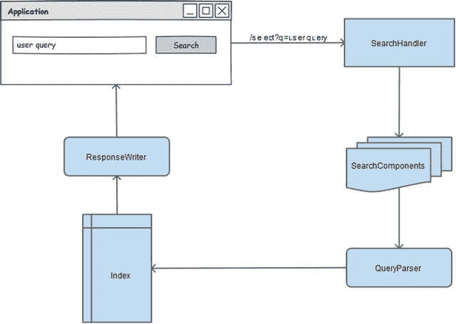
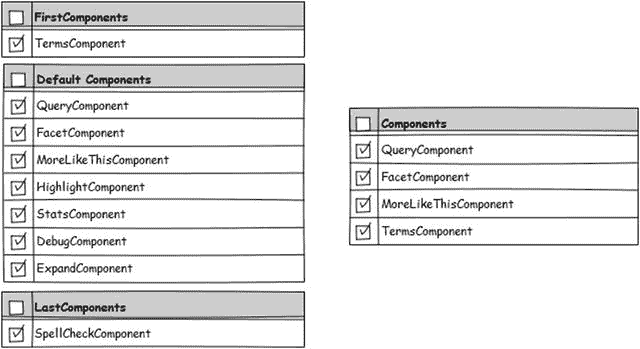
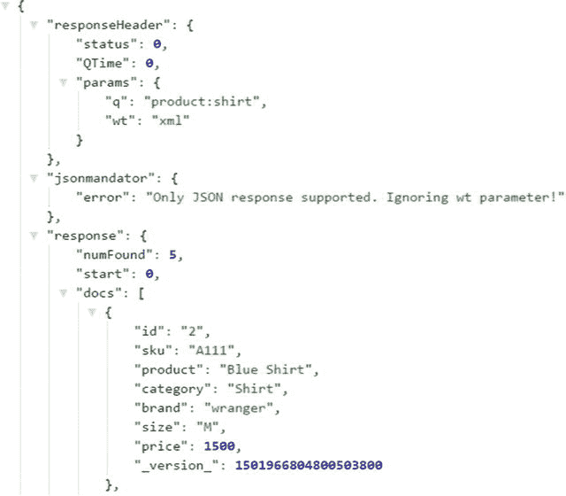

# 6.搜索数据

前面所有的章节都是本章的敲门砖。到目前为止，您已经了解了 Solr 的基础知识，包括配置核心、定义模式和索引文档。文档成功编制索引后，您就可以搜索结果了。

Solr 提供了广泛的搜索功能，比如查询、分面、点击高亮、拼写检查、建议和自动完成。本章介绍搜索过程，然后概述主要组件。然后进入查询结果的细节。本章涵盖以下主题:

*   先决条件
*   搜索过程
*   搜索组件
*   查询的类型
*   查询分析器
*   JSON 请求 API
*   自定义`SearchComponent`
*   常见问题

## 搜索基础

在上一章中，您了解了用于索引文档的工具。同样的工具也可以用于搜索结果。您还可以从浏览器或任何 GET 工具(如 Wget)执行查询。

对于分析和开发来说，Solr 管理控制台是运行查询的最佳地方，因为它提供了丰富的 GUI，即使您不记得 URL 和请求参数，它也很方便。对于一组标准的功能，控制台提供了相关的文本框；相关的新框会根据您选择的功能自动加载。如果请求参数没有文本框，可以在原始查询参数文本框中提供键值对。在这个文本框中，每一对都应该用一个&符号分隔，并且应用标准 HTTP 请求参数的规则。

下面是一个用户查询示例:请求被发送到带有`q`参数的`hellosolr`内核的`/select`端点，其中包含用户查询 solr 搜索引擎:

`$ curl``http://localhost:8983/solr/hellosolr/select?q=solr`T2】

对于那些不熟悉 Solr 并希望比较 Solr 中的查询和 SQL 数据库中的查询的人来说，映射如下。记住，SQL 和 Solr 返回的结果可能是不同的。

*   SQL 查询:`select album,title,artist``from hellosolr``where album in ["solr","search","engine"]`T3】
*   Solr 查询:`$ curl``http://localhost:8983/solr/hellosolr/select?q=solr``search engine`T3】

## 先决条件

Solr 搜索能力和行为在很大程度上取决于字段属性，这些属性基于`schema.xml`中的字段定义。您可以在`schema.xml`本身或者 Solr admin UI 中的模式浏览器中验证字段属性。要搜索字段并显示匹配的文档，以下是一些先决条件:

*   应该对可搜索字段(您查询的字段)进行索引。这需要您在`schema.xml`的字段定义中指定`indexed="true"`属性。下面是一个示例字段定义，其中的`indexed`属性用粗体标记:`<field name="name" type="text_general"` `indexed="true"` `stored="true"/>`
*   作为 Solr 响应的一部分检索的字段(`fl`参数中的字段)应该被存储。这要求您在`schema.xml`的字段定义中指定`stored="true"`属性。下面是一个示例字段定义，其中的`stored`属性用粗体标记:`<field name="name" type="text_general" indexed="true"` `stored="true"` `/>`

第 4 章提供了更多关于字段定义和属性如何影响搜索行为的细节。

## Solr 搜索过程

本节展示了与`/select`端点相关的底层查询过程，这是 Solr 管理控制台中最常用的默认端点。当您向`/select`发出请求时，它会被`SearchHandler`处理，后者是查询文档的主要请求处理器。如果您浏览`solrconfig.xml`，您会发现这个处理程序被定义并映射到`/select`，如下所示:

`<requestHandler name="/select" class="solr.SearchHandler">`

`<!-- default values for query parameters can be specified, these`

`will be overridden by parameters in the request -->`

`<lst name="defaults">`

`<str name="echoParams">explicit</str>`

`<int name="rows">10</int>`

`</lst>`

`</requestHandler>`

`SearchHandler`执行一系列`SearchComponents`来处理搜索请求。负责处理搜索查询的`SearchComponent``QueryComponent`执行配置好的`QueryParser`，后者解析原始查询，将其翻译成 Solr 理解的格式。被解析的查询被`SolrIndexSearcher`用来匹配索引文档。匹配的文档由`ResponseWriter`根据`wt`请求参数格式化，然后用户最终得到响应。图 [6-1](#Fig1) 描述了搜索查询如何流经各种组件来检索匹配的文档。

图 6-1。

Search request flow

### 搜索处理程序

`SearchHandler`是负责处理搜索请求的控制器。处理程序声明一个组件链，并将请求的处理交给它们。组件按照它们在链中注册的顺序执行。链中的每个组件代表一个搜索特性，例如查询或分面。

#### 注册组件

以下是默认情况下在`SearchHandler`中注册的组件:

*   `QueryComponent`
*   `FacetComponent`
*   `MoreLikeThisComponent`
*   `HighlightComponent`
*   `StatsComponent`
*   `DebugComponent`
*   `ExpandComponent`

在这些组件中，`QueryComponent`针对所有请求执行。只有当请求包含适当的参数时，所有其他组件才会执行。例如，`FacetComponent`仅在搜索请求中提供了`facet=true`参数时执行。

`SearchHandler`通过将组件注册到`solrconfig.xml`中处理程序的`first-components`或`last-components`部分，使您能够将组件添加到链的开头或结尾:

`<requestHandler name="/select" class="solr.SearchHandler">`

`<lst name="defaults">`

`..`

`</lst>`

`<arr name="first-components">`

`<str>terms</str>`

`</arr>`

`<arr name="last-components">`

`<str>spellcheck</str>`

`</arr>`

`</requestHandler>`

图 [6-2](#Fig2) 的左侧提供了在声明前面的`first-components`和`last-components`后注册到`SearchHandler`的最终组件列表。这些组件将按照它们在列表中出现的顺序执行。

图 6-2。

Chain of SearchComponents

您可以覆盖默认组件，通过在`components`部分注册，只执行您想要的组件。例如，如果您只想执行`QueryComponent`、`FacetComponent`、`MoreLikeThisComponent`和`TermsComponent`，您可以在`components`部分注册它们，如下所示。组件链将如图 [6-2](#Fig2) 右侧的表格所示。

`<arr name="components">`

`<str>query</str>`

`<str>facet</str>`

`<str>mlt</str>`

`<str>terms</str>`

`</arr>`

不允许将`first-components`和`last-components`与`components`段一起注册，这样的尝试会抛出`SolrException`:

`SolrException: First/Last components only valid if you do not declare ’components’`

您注册到`components`、`first-components`或`last-`T3 的组件名必须在`solrconfig.xml`中定义，以便 Solr 将其映射到相应的可执行 Java 类。例如，如果您将`terms`注册为`SearchHandler`中的一个组件，`solrconfig.xml`应该有如下定义:

`<searchComponent name="terms" class="solr.TermsComponent"/>`

Note

如果使用`first-components`或`last-components`部分，`DebugComponent`被设计为总是最后出现。如果不希望这样，您必须在`components`部分显式声明所有组件。

#### 声明参数

`SearchHandler`使您能够根据对用户提供的请求参数的所需操作，通过在各种列表中指定参数来控制请求参数的值。它允许您以三种方式声明参数。

##### 默认

`defaults`值指定了参数列表及其默认值。如果用户请求包含相同的参数，该值将被覆盖。在下面的例子中，`rows`在默认列表中声明；如果用户请求不包含该参数，默认情况下，响应中将返回 10 个文档。

`<lst name="defaults">`

`<int name="rows">10</int>`

`</lst>`

##### 附加

`appends`值指定了应该附加到所有搜索请求的参数列表，而不是像在`defaults`部分的情况下那样被覆盖。对于下面的例子，如果用户请求是`q=bob marley`，那么`appends`部分会将`fq=genre:reggae`添加到请求中。如果在`defaults`部分指定了相同的参数，它甚至会追加。

`<lst name="` `appends">`

`<int name="fq">genre:reggae</int>`

`</lst>`

##### 不变量

`invariants`值指定了参数列表，其值是强制应用的，并且不能被参数的任何其他定义覆盖，例如在用户查询请求或`defaults`部分中。这是配置您不想让用户控制其行为的功能的好地方。以下是`invariants`部分中请求参数的定义示例。

`<lst name="invariants">`

`<str name="fq">country:usa<str>`

`</lst>`

### 搜索组件

`SearchComponent`是一个抽象的 Java 类，这个类的每个实现都代表一个搜索特性。实现类应该在`solrconfig.xml`中声明，然后在处理程序中注册。下面是在`solrconfig.` `xml`中访问索引术语的组件`TermsComponent`的配置:

`<searchComponent name="terms" class="solr.TermsComponent"/>`

`<requestHandler name="/terms" class="solr.SearchHandler" startup="lazy">`

`<lst name="defaults">`

`<bool name="terms">true</bool>`

`<bool name="distrib">false</bool>`

`</lst>`

`<arr name="components">`

`<str>terms</str>`

`</arr>`

在本例中，`TermsComponent`被注册在`components`部分，所以默认情况下不会注册其他组件，比如查询或方面。

表 [6-1](#Tab1) 提供了 Solr 提供的主要部件的关键信息。在表中,“名称”列表示组件的默认名称，您可以更改它。默认栏列出了在`SearchHandler`中默认配置的组件。要使用非默认的组件，您需要将它注册到现有的处理程序，或者配置一个新的处理程序并将其注册到该处理程序。

表 6-1。

Solr Primary Components

<colgroup><col> <col> <col> <col></colgroup> 
| 成分 | 名字 | 默认 | 描述 |
| --- | --- | --- | --- |
| `QueryComponent` | `query` | `True` | 处理查询参数以检索相关文档。 |
| `FacetComponent` | `facet` | `True` | 生成方面，即通常出现在许多页面左侧的聚合。 |
| `MoreLikeThisComponent` | `mlt` | `True` | 查询与结果文档相似的文档。 |
| `HighlightComponent` | `highlight` | `True` | 突出显示响应中的查询词。 |
| `StatsComponent` | `stats` | `True` | 获取有关字段中值的统计信息。 |
| `DebugComponent` | `debug` | `True` | 获取调试信息，如已解析的查询或文档分数说明。 |
| `TermsComponent` | `terms` | `False` | 查找索引词及其计数。对自动完成等功能很有用。 |
| `TermVectorComponent` | `tvComponent` | `False` | 获取有关匹配文档的附加信息。 |
| `SpellCheckComponent` | `spellcheck` | `False` | 获取与查询词相似的词。有用的功能，如拼写纠正和你的意思是。 |
| `QueryElevationComponent` | `elevation` | `False` | 配置查询的顶级结果。活动、促销和付费搜索的理想选择。 |
| `SuggestComponent` | `suggest` | `False` | 建议与查询词相似的词。对于构建自动建议功能非常有用。 |

对于每个传入的请求，一个`SearchComponent`分两个阶段执行:准备和处理。`SearchHandler`按照链中出现的顺序执行所有的准备方法，然后执行所有的处理方法。prepare 方法对请求进行初始化，process 方法进行实际的处理。所有准备方法都保证在任何处理方法之前执行。

你将在第 7 章和第 9 章中详细了解这些重要的组件。

### QueryParser(查询解析器)

解析用户查询，将其转换成 Solr 能够理解的格式。`QueryComponent`基于`defType`请求参数调用适当的解析器。同一个查询可以为不同的查询解析器获取不同的结果，因为每个解析器对用户查询的解释不同。Solr 支持的一些查询解析器是 standard、DisMax 和 eDisMax 查询解析器。在本章的后面你会学到更多关于`QueryParser`的知识。

### QueryResponseWriter

默认情况下，Solr 以 XML 格式返回对查询的响应。为了以另一种支持的格式获得响应，可以在请求中指定或在处理程序中配置`wt`参数。其他支持的格式有 JSON、CSV、XSLT、javabin、Velocity、Python、PHP 和 Ruby。

javabin 响应返回一个 Java 对象，Java 客户端可以使用这个对象。对于使用 SolrJ 客户端的请求，这是首选的响应格式。类似地，Python、PHP 和 Ruby 格式也可以被这些语言的客户端直接使用。Velocity 是另一种受支持的有趣的响应格式，它允许您使用 Apache Velocity 模板引擎将响应转换成网页。

Solr 5.3.0 支持新的 smile 格式，这是一种二进制格式，非 Java 语言可以使用这种格式进行高效响应。参考 [`http://wiki.fasterxml.com/SmileFormat`](http://wiki.fasterxml.com/SmileFormat) 了解这种格式。

## Solr 查询

您已经做了一些查询，并且知道您通过使用`q`参数发送查询请求。但是还有更多。在这一节中，您将看到用于控制文档匹配和排序行为的查询语法。然后你会看到各种各样的解析器。

使用`q`参数发送的查询由查询解析器进行语法检查和解析。在字段的分析阶段，查询将被标记化，生成的标记将根据索引进行匹配，并根据评分算法进行排名。

图 [6-3](#Fig3) 描述了如何处理用户查询以搜索相关结果。此图提供了检索相关文档的搜索请求流程，不包括`SearchHandler`等组件。请参考图 [6-1](#Fig1) 以获得更广泛的流程视图，该流程适用于任何搜索功能，如分面和建议，而不是专门用于检索文档。

图 6-3。

Search request processing

图 [6-3](#Fig3) 中的例子描述了用户查询 kills the mockingbird 的搜索流程。[第 4 章](04.html)在覆盖领域分析中使用了这个例子。我有意使用这个部分匹配的查询来让您理解真实场景中的匹配。此外，让我们假设处理程序被配置为使用`ExtendedDismaxQParser`进行查询解析，这允许您执行类似于 Google 中的自由文本搜索。

以下是 Solr 执行的步骤，如图 [6-3](#Fig3) 所示:

The user-provided query is passed to the query parser. The purpose of the query parser is to parse the user query and convert it into a format that Lucene understands.   The query parser sends the query to appropriate analyzers to break the input text into terms. In this example, the analyzer for the `title` and `artist` fields are invoked, which is based on the `qf` parameter provided in the request.   The query parser returns the `Query` object, which is provided to `SolrIndexSearcher` for retrieving the matching documents. The `Query` object contains the parsed query, which you can see if you execute the search request in debug mode (by providing the additional request parameter `debug="true"`).   `SolrIndexSearcher` does lots of processing and invokes all the required low-level APIs such as for matching and ranking the documents. It also performs several other tasks such as caching.   `SolrIndexSearcher` returns the `TopDocs` object, which is used to prepare the response to send it back to the application.  

图 [6-3](#Fig3) 中指定的所有任务(在前面的步骤中解释过)都由`QueryComponent`类协调，它是一个负责执行搜索请求的`SearchComponent`。

### 默认查询

在 Solr 中，当我们说查询时，默认情况下我们指的是基于术语的匹配。术语是匹配的最小单位。术语可以由一个单词、后续单词或单词的一部分组成。假设您想要匹配单词的一部分，您可以通过使用 N 元语法来创建更小的术语，N 元语法在单词中创建 N 个字符的标记。本节描述如何查询。

#### 查询默认字段

当您仅指定查询字符串和`q`参数时，您正在查询结果的默认字段:

`q=to kill a mockingbird`

您可以使用`df`参数指定默认字段。在下面的例子中，Solr 将对字段`album`执行查询:

`q=to kill a mockingbird&df=album`

#### 查询指定的字段

查询特定字段的标准语法使用后跟冒号和值的字段名称，如下所示:

`title:mockingbird`

这将在`title`字段中搜索术语`mockingbird`。

现在，如果您的查询包含多个标记，并且您将它指定为:

`q=title:to kill a mockingbird&df=album`

这将在`title`字段中查询`to`，在`album`字段中查询令牌`catch a mockingbird`。如果要在一个字段中搜索多个标记，需要用括号将它括起来:

`q=title:(to kill a mockingbird)&df=album`

这将在`title`字段中查询令牌，而`album`字段根本不会被查询。

#### 匹配多个字段中的令牌

标准的查询解析器为查询文档提供了粒度控制。您可以针对不同的术语查询不同的字段。以下查询将在`title`字段中搜索标记`buffalo soldier`，并在`artist`字段中搜索标记`bob marley`:

`q=title:(buffalo soldier) artist:(bob marley)`

字段和标记之间应用的默认运算符是`OR`。Solr 支持一组操作符，允许您将布尔逻辑应用于查询，以指定匹配文档的条件。上述查询也可以通过显式指定运算符来表达:

`q=title:(buffalo OR soldier) OR artist:(bob OR marley)`

因此，前面的两个查询都将检索包含任何这些术语的所有文档。

#### 查询运算符

以下是查询分析器支持的运算符:

*   `OR`:执行 Union，如果满足任何子句，文档将匹配。
*   `AND`:只有两个子句都满足，才会进行关联，匹配一个单据。
*   `NOT`:排除包含该子句的文档的操作符。
*   `+/-`:操作员强制条款的出现。`+`确保包含令牌的文档必须存在，`-`确保包含令牌的文档不能存在。

请注意，`AND` / `OR` / `NOT`在标准查询解析器中是区分大小写的。因此，查询`bob and marley`不同于`bob AND marley`。第一个查询将搜索包含任何标记`bob`、`and`或`marley`的文档。第二个查询将搜索包含标记`bob`和`marley`的文档。

此外，您可以用多种方式设置查询的格式。例如，`q=(Bob AND marley)`和`q=(+bob +marley)`构成同一个查询。

### 短语查询

前面的查询匹配流中任何地方存在这些术语的所有文档。如果您想要查找具有连续术语的文档，您需要执行短语搜索。短语搜索要求在双引号内指定查询。例如，`q="bob marley"`是一个短语查询。

### 邻近查询

邻近查询匹配彼此邻近出现的术语。您可以将其视为一个自由短语查询，它考虑了附近的术语。邻近查询要求短语 query 后跟波浪号(`∼`)运算符和数字距离，用于标识邻近的术语。

为了帮助您理解所有这些概念，请考虑下面的示例索引，它包含四个文档并支持不区分大小写的匹配。

`Index`

`doc1: While Bob took the initial lead in race Marley finally won it.`

`doc2: Bob Marley was a legendary Jamaican`[`reggae`](http://en.wikipedia.org/wiki/Reggae#Reggae)T2】

`doc3: Jamaican singer Bob Marley has influenced many singers across the world.`

`doc4: Bob is a renowned rugby player.`

`Query`

`q=bob marley \\ Default operator OR. All 4 documents match`

`q=(bob AND marley) \\ AND operator. Both the terms must exist. First 3 documents match`

`q="bob marley" \\ Phrase query. doc2 and doc3 matches`

`q="jamaican singer" \\ Phrase query. Only doc3 matches`

`q="jamaican singer"∼1 \\ Proximity query. Both doc2 and doc3 match`

`q="singer jamaican"∼1 \\ Proximity query. Only doc3 matches`

`q="jamaican singer"∼3 \\ Proximity query. Both doc2 and doc3 match`

在邻近查询`q="jamaican singer"∼1`中指定数值 1 匹配`doc2`和`doc3`，因为移动`doc2`的`Jamaican` [`reggae`](http://en.wikipedia.org/wiki/Reggae#Reggae) `singer`序列中的一个术语将形成短语。但是在查询`q="singer jamaican"∼1`中，只有`doc3`匹配，因为`singer`在`jamaican`之前，需要更多的移动来匹配`doc2`的短语。正如您在最后一个例子中看到的，查询中的数值 3 将使它同时匹配`doc2`和`doc3`。

### 模糊查询

除了精确匹配术语之外，如果想要匹配相似的术语，可以使用模糊查询。模糊查询基于 Damerau-Levenshtein 距离或编辑距离算法，该算法确定将一个令牌转换为另一个令牌所需的最少编辑次数。要使用它，标准查询解析器需要在术语后有一个波浪号(`∼`)，后面可选地跟一个数值。该数值可以在 0 到 2 的范围内。默认值 2 匹配最大编辑次数，值 0 表示没有编辑，与术语查询相同。模糊查询的分数基于编辑次数:0 次编辑表示最高分(因为最不宽松)，2 次编辑表示最低分(因为最宽松)。下面是模糊查询的语法:

`Syntax`

`q=<field>:<term>∼`

`q=<field>:<term>∼N // N specifies the edit distance`

`Example`

`q=title:mockingbird∼2`

`q=title:mockingbird∼    // effect is same as above`

`q=title:mockingbird∼1.5 // invalid`

早些时候，Solr 允许将 N 指定为 0.0 到 1.0 范围内的浮点值，该值被转换为适当的编辑距离。在 4.0 版中，引入了一种更直接的方法来指定整数值 0、1 或 2，其中表示 N 个插入、删除或替换。Solr 不允许小数编辑距离，如果您的查询包含小数编辑距离，将会响应以下错误:

`"error": {`

`"msg": "org.apache.solr.search.SyntaxError: Fractional edit distances are not allowed!",`

`"code": 400`

`}`

模糊查询是搜索容易出现拼写错误的文本(例如 tweets、SMS 或移动应用程序)的好解决方案，在这些情况下，词干和语音技术是不够的。

模糊查询中的波浪号不要与邻近查询中的波浪号混淆。在邻近查询中，波浪号应用于引号之后(例如，`q="jamaican singer"∼1`)。模糊查询没有引号，并且在标记后应用波浪号(例如，`q=bob∼1 marley∼1`)。

### 通配符查询

Solr 标准查询解析器支持单个查询的通配符搜索。您可以指定通配符`?`，它只匹配一个字符，或者指定`*`，它匹配零个或多个字符。它们不能应用于数值或日期字段。以下是通配符查询示例:

`q=title:(bob* OR mar?ey) OR album:(*bird)`

通配符查询的一个经典例子是`*:*`，它匹配所有字段中的所有术语，并检索语料库中的所有文档。请注意，不能在字段名中使用通配符来搜索符合某个模式的一个或多个术语(可以在整个索引中搜索符合某个模式的一个或多个术语)。以下查询无效，将引发异常:

`q=*:mockingbird // undefined field *`

`q=ti*:mocking*  // SyntaxError: Cannot parse ’ti*:mocking*’`

通配符查询执行起来可能会很慢，因为它需要遍历所有与模式匹配的术语。您应该避免以通配符开头的查询，因为它们可能会更慢。通配符查询为所有匹配的文档返回 1.0 的常量分数。

### 范围查询

范围查询支持匹配下限和上限之间的字段值。范围查询广泛用于数值和日期字段，但也可用于文本字段。范围查询允许边界包含、排除或两者的组合。它们也支持通配符。以下是范围查询的示例:

`q=price:[1000 TO 5000] // 1000 <= price <= 5000`

`q=price:{1000 TO 5000} // 1000 < price > 5000`

`q=price:[1000 TO 5000} // 1000 <= price > 5000`

`q=price:[1000 TO *]    // 1000 <= price`

查询解析器的语法要求方括号`[]`表示包含值，花括号`{}`表示排除值。连接器`TO`应该用大写字母指定；否则，解析器将抛出一个异常。范围查询为所有匹配的文档提供 1.0 的恒定分数。

### 函数查询

在真实的场景中，您并不总是希望文档仅基于 TF-IDF 匹配进行排名。其他因素也会发挥作用，您可能希望这些因素对整个文档排名有所贡献。例如，人气计数在电子商务网站的产品排名中起着重要作用，用户评级在电影或产品评论中起着作用，空间信息在本地搜索中起着作用。

函数查询的解析器使您能够定义一个函数查询，该函数查询根据一个数值(常量或字段中的索引值或另一个函数的计算值)生成一个分数。

函数查询因使用函数来导出值而得名。在计算分数、返回字段值或对文档进行排序时，可以应用函数查询。这个主题在第 7 章中有详细介绍，在那里你会看到函数查询是如何帮助推断一个实际的相关性分数的。

### 过滤查询

过滤查询帮助您过滤掉与请求不相关的文档，留给您一个执行主查询的文档子集。筛选子句只与索引匹配，不计分，不匹配筛选条件的文档会被直接拒绝。应该在请求参数`fq`中指定过滤器查询。过滤子句也可以在主查询中指定，但是过滤查询在获得快速响应时间方面证明是有利的。Solr 为过滤器查询维护一个单独的缓存。当新的查询带有相同的过滤条件时，会发生缓存命中，从而导致查询时间减少。解析器允许多个过滤器查询，并且为每个`fq`参数创建一个单独的缓存。因此，您可以在同一个`fq`参数中包含所有过滤子句，或者在不同的`fq`参数中包含每个过滤子句。将条件放在哪里的选择完全取决于您的业务案例。此示例以不同的方式指定相同的查询子句:

`// no filter cache`

`q=singer(bob marley) title:(redemption song) language:english genre:rock`

`// one cache entry`

`q=singer(bob marley) title:(redemption song)&fq=language:english AND genre:rock`

`// two cache entry`

`q=singer(bob marley) title:(redemption song)&fq=language:english&fq=genre:rock`

`fq`参数是关联的。如果指定了多个`fq`参数，查询解析器将选择匹配所有`fq`查询的文档子集。如果希望子句被`OR`连接，那么过滤查询应该是单个`fq`参数的一部分。

例如，在法律搜索引擎中，律师一般从特定国家的法院搜索案例。在这种情况下，国家名称是一个很好的过滤查询，如下所示:

`q=labour laws&fq=country:usa`

类似地，在空间搜索(如本地交易搜索)中，城市和交易类别可以使用`fq`参数，如下所示:

`q=product:restaurant&fq=city:california&fq=category:travel`

但是，如果拉斯维加斯市的大多数查询是关于旅游交易的，则请求可以形成如下:

`q=product:hotel&fq=city:"las vegas" AND category:travel`

### 查询提升

在一个查询中，并不是所有的术语都同样重要，因此 Solr 使您能够提高查询术语的重要性。查询提升是 Solr 在计算分数时考虑的一个因素；较高的提升值会返回较高的分数。提升术语的因素取决于您的需求、术语的相对重要性以及术语的预期贡献程度。得出最佳值的最佳方法是通过实验。

通过在令牌后指定一个(`^`)运算符，后跟增强因子来应用增强。DisMax 和 e DisMax 查询解析器允许您提升查询字段，从而提升在该字段上搜索的所有术语。默认情况下，所有字段和令牌都获得 1.0 的提升。

下面是一个应用了 boost 的示例查询。该查询指定 redemption 和 song 是最重要的术语，提升值为 2.0，其次是术语 bob 和 marley，提升值为 1.4；所有其他术语的默认提升值为 1.0。

`q=singer(bob marley)^1.4 title:(redemption song)^2.0 language:english genre:rock`

您将在第 8 章的[中了解查询提升如何影响文档得分。](08.html)

### 全局查询参数

Solr 提供了一组查询参数。有些是通用的，适用于所有类型的搜索请求，而有些是特定于用于处理请求的查询解析器的。

这是适用于所有搜索请求的查询参数的综合参考部分。特定于查询解析器的请求参数包含在本章的“查询解析器”一节中。

#### q

此参数定义用于检索相关文档的主查询字符串。这是一个强制参数，如果没有指定，其他参数将不起任何作用。

#### 会计季度(fiscal quarter)

使用此参数指定筛选查询。一个请求可以有多个`fq`参数，每个参数都是关联的。您已经在“过滤查询”一节中了解了这个参数。

#### 行

指定要在结果集中检索的文档数。默认值为 10。不要指定一个很高的值，因为这样效率会很低。一个更好的替代方法是分页和分块获取文档。当您仅对其他搜索特性(如方面或建议)感兴趣时，可以指定`rows=0`。

#### 开始

指定文档返回的偏移量。默认值为 0(返回第一个匹配文档的结果)。您可以同时使用`start`和`rows`来获得分页的搜索结果。

#### 定义类型

指定用于解析查询的查询解析器。每个解析器都有不同的行为，并支持专门的参数。

#### 分类

指定以逗号分隔的字段列表，结果应根据该列表进行排序。字段名后面应该跟有`asc`或`desc`关键字，以分别按升序或降序对字段进行排序。要排序的字段应该是单值的(`multiValued=false`)，并且应该只生成一个令牌。非数值字段按字典顺序排序。要按分数排序，您可以指定`score`作为字段名以及`asc` / `desc`关键字。默认情况下，结果按分数排序。这里有一个例子:

`sort=score desc,popularity desc`

#### 股骨长度

指定要在响应中显示的以逗号分隔的字段列表。如果列表中的任何字段不存在或未存储，它将被忽略。要在结果中显示分数，可以将分数指定为字段名称。例如，`fl=score,*`将返回文档的分数以及所有存储的字段。

#### 重量

指定返回响应的格式，如 JSON、XML 或 CSV。默认的响应格式是 XML。响应是由响应编写器格式化的，这在本章开始时已经介绍过。

#### 调试查询

这个布尔参数在分析查询是如何被解析的以及文档是如何得到分数的方面非常有用。调试操作成本很高，不应在实时生产查询中启用。该参数目前仅支持 XML 和 JSON 响应格式。

#### 解释其他

`explainOther`对于分析不属于调试解释的文档非常有用。`debugQuery`解释作为结果集一部分的文档的分数(如果您指定`rows=10`，`debugQuery`将只为这 10 个文档添加解释)。如果您想要额外文档的解释，您可以在`explainOther`参数中指定一个 Lucene 查询来识别这些额外文档。记住，`explainOther`查询将选择要解释的附加文档，但是解释将针对主查询。

#### 允许的时间

指定允许执行查询的最长时间(以毫秒为单位)。如果达到这个阈值，Solr 将返回部分结果。

#### 奥米泰德

默认情况下，Solr 响应包含`responseHeader`，它提供响应状态、查询执行时间和请求参数等信息。如果您不希望这些信息作为响应，您可以指定`omitHeader=true`。

#### 躲藏

默认情况下，缓存是启用的。您可以通过指定`cache=false`来禁用它。

## 查询分析器

您已经学习了一些关于查询解析器的知识，并且知道`defType`参数指定了查询解析器的名称。在本节中，您将看到主要的查询解析器:standard、DisMax 和 eDisMax。

### 标准查询解析器

标准查询解析器是 Solr 中的默认解析器。您不需要为此指定`defType`参数。标准查询解析器适用于结构化查询，并且是形成复杂查询的优秀解析器，但是它有一些限制。它希望您严格遵守语法，如果遇到任何意外字符，它将抛出异常。特殊字符和符号应该正确转义，否则 Solr 将抛出语法错误:

`<lst name="error">`

`<str name="msg">org.apache.solr.search.SyntaxError:`

`Cannot parse ’article:mock:bird’: Encountered " ":" ":`

`"" at line 1, column 12.`

`Was expecting one of:`

`<EOF>`

`<AND> ...`

`<OR> ...`

`<NOT> ...`

`"+" ...`

`"-" ...`

`<PREFIXTERM> ...`

`<LPARAMS> ...`

`...`

`<NUMBER> ...`

`</str>`

`<int name="code">400</int>`

### DisMax 查询解析器

标准的查询解析器是默认的 Solr 解析器，但是它提供的灵活性很小，因为它是基于结构的，并且接受像`title:(buffalo OR soldier) OR singer:(bob OR marley)`这样语法上必须正确的布尔查询。如果语法不正确，或者用户查询包含在语法中有特殊含义的符号，Solr 将抛出异常。

Solr 提供了 DisMax 解析器来处理类似人类的自然查询和短语。它允许跨字段的有机搜索，从而不受特定字段中的值的限制。它还允许您为字段增加权重，这是查询任何搜索域的更实用的方法。例如，对于典型的电子商务网站，品牌将具有高的相关搜索相关性。

#### 使用 DisMax 查询解析器

DisMax 解析器更适合 Google 这样的搜索引擎，标准解析器更适合高级搜索，在高级搜索中，用户可以明确指定在哪个字段上搜索什么。例如，在法律搜索中，辩护律师可能更喜欢在一个框中指定诉讼细节，在另一个框中指定请愿者细节，而在另一个框中指定法院名称。

因为 DisMax 是针对自然用户查询的，所以它尽最大努力优雅地处理错误场景，几乎不会抛出任何查询解析异常。

另一个区别是，标准解析器将所有子查询的分数相加，而 DisMax 考虑所有子查询返回的最大分数——因此命名为 DisMax，这意味着析取最大值。如果您希望 DisMax 计分像标准解析器一样，那么您可以应用一个 tiebreaker，这可以使它像标准解析器一样计分。

如果你正在构建你的第一个搜索引擎，DisMax 是一个比 standard 更容易的选择。

下面是一个 DisMax 查询示例:

`$ curl``http://localhost:8983/solr/hellosolr/select`T2】

`q=to kill a mockingbird&qf=movie^2 artist^1.2 description`

`&rows=10&fl=score,*&defType=dismax`

#### 查询参数

除了前面提到的通用查询参数，DisMax 还支持其他特定于它的参数。这些参数可用于控制文档的匹配和排序，而无需对主查询进行任何更改。Solr 管理控制台中的 Query 选项卡为 DisMax 解析器提供了一个复选框；单击它之后，特定于解析器的参数将自动变得可见。以下是 DisMax 支持的附加参数:

##### q

指定用户查询或短语。为该参数提供的值是自然查询，其结构不同于标准查询。

##### 速射的

该参数指定应应用`q`参数中提供的查询的字段列表。所有查询术语都在所有指定的字段中匹配，您不能有选择地指定不同的术语来匹配不同的字段。如果一个查询包含一个字符串，但是您的`qf`参数指定了一个`int`或`date`字段，不用担心；这将被很好地处理，只有查询中的整数会与一个`int`字段匹配。

`qf`参数中的所有字段都应该用空格分隔，并且可以有选择地增加，如下所示。如果您的列表指定了一个未在`schema.xml`中定义的字段，它将被忽略。

`qf=album^2 title^2 description`

##### q .老

DisMax 有一个用于查询的回退机制。如果缺少`q`参数，它将使用标准查询解析器解析在`q.alt`参数中指定的查询。

##### 毫米

在标准的查询解析器中，您可以在术语和子查询上显式应用布尔运算符。`mm`参数意味着最小值应该匹配，它通过允许您控制应该匹配的子句的数量，提供了一种更实用的解决问题的方法。它的值可以是整数、百分比或复杂表达式。以下是详细情况:

*   整数:指定必须匹配的最小子句数。还可以指定负值，这意味着可接受的不匹配可选子句的最大数量。例如，如果一个查询包含四个子句，`mm=1`意味着至少有一个子句必须匹配，`mm=-1`意味着至少有三个子句必须匹配。值越高，搜索越严格，值越低，搜索越宽松。
*   百分比:整数应用硬值，并且是固定的。百分比指定与可选条款总数相匹配的最小条款数。例如，如果一个查询包含四个子句，`mm=25%`表示至少应该匹配一个子句，`mm=-25%`表示至少应该匹配三个子句(75%)。指定`mm=100%`意味着所有的子句必须匹配，其行为与对所有查询子句应用`AND`操作符相同。指定`mm=0%`意味着没有最小期望值，其行为将与对所有查询子句应用`OR`操作符相同。如果从百分比中计算出的数字包含一个十进制数字，它将被舍入到最接近的较小整数。
*   表达式:您可以应用一个或多个由空格分隔的条件表达式，格式为`n<integer|percent`。一个表达式指定，如果可选子句的数量大于`n`，则指定的条件适用；否则，所有条款都是强制性的。如果指定了多个条件，每个条件仅在`n`的值大于其前面条件中指定的值时有效。例如，表达式`2<25% 4<50%`指定如果查询有两个可选子句，它们都是强制的；如果它有三个或四个可选条款，至少有 25%应该匹配；如果它有四个以上的子句，至少 50%应该匹配。

##### 全国工业产品生产许可证

查询短语 slop 允许您控制短语搜索中的接近程度。在标准的查询解析器中，通过指定一个波浪号(`∼`)后跟一个邻近因子来执行邻近搜索。DisMax 解析器提供了一个额外的参数`qs`，用于控制邻近因子并保持主查询简单。下面是一个使用标准和 DisMax 解析器时应用相同近似性的示例:

`q="bob marley"∼3&defType=standard`

`q="bob marley"&qs=3&defType=dismax`

##### 脉波频率（Pulse Frequency 的缩写）

DisMax 解析器使您能够提升匹配的文档。您可以在`pf`参数中指定一个字段列表以及 boost，这些字段中的匹配短语会相应地得到增强。重要的是要记住，这个参数的作用是提高匹配短语的排名，而不影响匹配文档的数量。`pf`参数可以对结果重新排序，但是总的结果计数将始终保持不变。

`pf=album^2 title^` `2`

##### 著名图象处理软件

该参数允许您对短语字段应用邻近系数，没有`pf`参数则没有意义。由于`pf`只对匹配的文档排序有贡献，对决定匹配计数没有作用，同样的规则也适用于`ps`。

##### 领带

标准解析器将子查询的分数相加，但是 DisMax 取子查询分数的最大值，因此命名为(dis)max。一旦应用了 tie，DisMax 就开始对分数求和，计算行为类似于标准解析器。允许 0.0 到 1.0 范围内的浮点值。`tie=0.0`取子查询中的最大值，`tie=1.0`将所有子查询的得分相加。DisMax 使用以下算法来计算分数:

`score = max(subquery1,..,subqueryn) + (tie * sum(other subqueries)`

如果两个文档得到相同的分数，您可以使用该参数让子查询影响最终分数并打破它们之间的平局。

##### 贝克勒尔

boost 查询参数使您能够添加一个查询子句来提高匹配文档的分数。可以提供多个`bq`参数，每个参数中子句的分数会被添加到主查询的分数中。例如，您可以使用`bq`来提高`titles`的评级:

`q=bob marley&bq=rating:[8 TO *]`

##### 板英尺(board foot)

通过应用函数查询，可以使用增强函数来增强文档。升压功能在`bf`请求参数中提供。和`bq`一样，可以多次指定这个参数，分数是累加的。以下是一个 boost 函数的示例，该函数使用`sqrt()`函数查询，通过计算评级的平方根来计算助推因子。[第 7 章](07.html)更详细地介绍了函数查询。

`q=bob marley&bf=sqrt(rating)`

#### DisMax 查询示例

下面是一个几乎完全成熟的 DisMax 查询的示例:

`$ curl``http://localhost:8983/solr/hellosolr/select`T2】

`q=to kill a mockingbird&qf=album^2 title^2 description`

`&rows=10&fl=album,title&defType=dismax&qs=3&mm-25%`

`&pf=album^3 title^3&ps=2&tie=0.3`

`&bf=sqrt(rating)&bq=rating:[8 TO *]`

### eDisMax 查询解析器

顾名思义，扩展的 DisMax 查询解析器是 DisMax 查询解析器的扩展。它支持 DisMax 提供的特性，增加了其中一些特性的智能性，并提供了额外的特性。您可以通过设置`defType=edismax`来启用这个查询解析器。

eDisMax 查询解析器支持 Lucene 查询解析器语法，而 DisMax 不支持。DisMax 不允许您在特定字段中搜索特定令牌。您在`qf`参数中指定要搜索的字段集，您的查询将应用于所有这些字段。但是，因为 eDisMax 支持 Lucene 查询，所以您也可以在特定的字段上执行特定的令牌。以下是一个查询示例:

`Query`

`$ curl``http://localhost:8983/solr/hellosolr/select`T2】

`q=buffalo soldier artist:(bob marley)&debugQuery=true`

`&defType=dismax&qf=album title`

`DebugQuery`

`<str name="parsedquery">`

`(+(DisjunctionMaxQuery((title:buffalo | album:buffalo))`

`DisjunctionMaxQuery((title:soldier | album:soldier))`

`DisjunctionMaxQuery(((title:artist title:bob) | (album:artist album:bob)))`

`DisjunctionMaxQuery((title:marley | album:marley))) ())/no_coord`

`</str>`

在这个调试查询中，您可以看到 DisMax 将`artist`字段视为一个查询标记，并在`qf`参数中指定的所有字段上搜索它。我们期望解析器在字段`artist`中搜索`bob marley`。因为 eDisMax 支持 Lucene 查询，所以它将满足您的期望。

`Query`

`$ curl``http://localhost:8983/solr/hellosolr/select`T2】

`q=buffalo soldier artist:(bob and marley)`

`&debugQuery=true&defType=edismax&qf=album title`

`DebugQuery`

`<str name="parsedquery">`

`(+(DisjunctionMaxQuery((title:buffalo | album:buffalo)) DisjunctionMaxQuery((title:soldier | album:soldier)) (+artist:bob +artist:marley)))/no_coord`

`</str>`

此外，您可以注意到 eDisMax 将`and`解析为布尔运算符，并通过在标记`bob`和`marley`之前应用`+`运算符来强制标记`bob`和【】。eDisMax 支持`AND`、`OR`、`NOT`、`+`、`-`等布尔运算符。Lucene 查询解析器不把小写标记`and/or`视为布尔操作符，但是 eDisMax 把它们视为有效的布尔操作符(相当于`AND/OR`)。

eDisMax 支持 DisMax 的请求参数。以下是 eDisMax 提供的附加请求参数:

#### 低级运算符

在前面的例子中，您看到 eDisMax 将小写字母`and`视为布尔运算符`AND`。如果你想禁用这个特性，让 eDisMax 把`and`和`or`当作其他令牌，你可以设置`lowercaseOperators=false`。默认情况下，该布尔参数设置为`true`。

#### 促进

`boost`参数的功能与`bf`相似，但是它的分数与主查询的分数相乘，而`bf`的分数相加。eDisMax 允许多个`boost`参数，并使用`BoostedQuery`将每个参数的分数乘以主查询的分数。

`Query`

`boost=log(popularity)&boost=sum(popularity)`

`DebugQuery`

`<str name="parsedquery">`

`BoostedQuery(boost...,`

`product(log(int(popularity)),sum(int(popularity)))))`

`</str>`

#### pf2/pf3

`pf`参数提高与精确短语匹配的文档的分数。`pf2`和`pf3`分别创建大小为 2 和 3 的瓦片区，并对文档进行匹配以增强它们。对于查询`top songs of bob marley`，创建的短语如下:

`pf=[’top songs of bob marley’]`

`pf2=[’top songs’,’songs of’,’of bob’,’bob marley’]`

`pf3=[’top songs of’,’songs of bob’,’of bob marley’]`

与`pf`一样，在请求中可以指定多个`pf2` / `pf3`参数。

#### ps2/ps3

与`pf`参数一样，可以通过使用`ps2`和`ps3`分别在`pf2`和`pf3`上应用斜坡。如果未指定该参数，`ps`参数的值将成为其默认值。

#### 停止言语

eDisMax 允许您通过设置布尔参数`stopwords=false`绕过字段分析链中配置的`StopFilterFactory`。

#### 超滤膜

此参数指定用户字段(允许用户查询的字段)。该值可以是特定的字段名称或字段的通配符模式。任何别名也可以用作字段名。

#### 别名

正如 SQL 数据库允许您为列提供别名一样，eDisMax 支持字段的别名。别名可以映射到在`schema.xml`中定义的单个字段或一组字段。该参数可配置如下:

`f.song.qf=title`

当您想要将与某个概念相关的字段组合在一起时，这也证明是有帮助的，如下例所示:

`f.artist.qf=singer,musician,actor,` `actress`

## JSON 请求 API

在本章中，您已经使用请求参数来查询结果，但是这种方法有以下限制:

*   它是非结构化的，因此指定适用于特定字段的参数不方便。您将在 faceting 和 terms 组件等功能中看到字段级参数，在这些功能中，您通常希望以不同的方式搜索不同的字段。第 7 章展示了这些查询的例子。
*   创建带有大量参数的请求是不方便的，而且由于缺乏可读性，您可能会多次添加同一个参数。
*   它是非类型化的，将所有内容都视为字符串。
*   错误的参数名会被忽略，没有办法验证它。

为了解决查询参数的所有这些限制，Solr 5.1 引入了 JSON 请求 API。这个 API 允许您指定 JSON 格式的请求，可以在请求体中发送，也可以作为`json`请求参数的一部分发送。Solr 还允许在一个查询中组合 JSON 和请求参数，这样一些参数可以在 JSON 主体中，而另一些可以在请求参数中，用一个&符号(`&`)隔开。

表 [6-2](#Tab2) 为 API 支持的每个 JSON 请求提供了一个示例查询。表中的第一个请求基于标准请求参数，以帮助您比较这两种类型的请求。此外，示例使用了`/query`端点而不是`/select`，因为默认情况下在`solrconfig.xml`中配置它来返回 JSON 响应。注意，表中的所有请求都返回相同的 JSON 响应。

表 6-2。

Approaches for Search Queries

<colgroup><col> <col> <col></colgroup> 
| 请求类型 | 示例查询 | 描述 |
| --- | --- | --- |
| 请求参数 | `$ curl http://localhost:8983/solr/hellosolr/query?q=bob` `marley&rows=20` | 我们在本书中一直使用的标准方法。 |
| 获取请求正文 | `$ curl http://localhost:8983/solr/hellosolr/query` `-d` `’{` `"query":"bob marley",` `"limit":20` | 通过使用`GET`方法在请求体中指定 JSON 格式的查询。如果您使用任何其他客户端，您可能需要在请求中指定`Content-Type: application/json`。 |
| 发布请求正文 | `$ curl -H "Content-Type: application/json" -X POST` `http://localhost:8983/solr/hellosolr/query -d` `’{` `"query":"bob marley",` `"limit":20` | 通过使用`POST`方法在请求体中指定 JSON 格式的查询。如果您使用的是 Postman 之类的 REST 客户端，这种方法非常有用。 |
| 请求参数中的 JSON | `$ curl http://localhost:8983/solr/hellosolr/query`？json='{ `"query":"bob marley",` `"limit":20` `}’` | 查询在`json`请求参数中指定。 |
| 两者的结合 | `$ curl``http://localhost:8983/solr/hellosolr/query``?json=’{``"query":"bob marley"`T4】 | 查询使用 JSON API 和请求参数的组合。 |
| JSON 中的请求参数 | `$ curl``http://localhost:8983/solr/hellosolr/query``-d``’{``params: {``q:"bob marley",``rows:20``}``}’` | 使用 JSON 主体进行查询，该主体在`params`块中指定标准请求参数。`params`块允许您在 JSON 主体中指定任何标准请求参数。 |
| 参数代换 | `$ curl``http://localhost:8983/solr/hellosolr/query?QUERY=bob``marley&RESULTCOUNT=20 -d``’{``"query":"${QUERY}",``"limit":${RESULTCOUNT}`T6】 | JSON 主体使用参数替换来填充参数值。JSON 请求体完全兼容参数替换，你将在第 7 章中了解到。 |

JSON 请求 API 还没有成熟到可以包含所有的请求参数。到目前为止，它只支持 Solr 支持的参数子集。此外，JSON 主体参数的名称不同于标准的请求参数。例如，如果在 JSON 主体中指定了`defType`参数，这是一个有效的请求参数，Solr 将报告以下异常:

`error":{`

`"msg":"Unknown top-level key in JSON request : defType",`

`"code":400`

`}`

表 [6-3](#Tab3) 列出了 JSON 主体参数和它们对应的标准请求参数。如果您提供一个无效的 JSON 参数，Solr 将抛出前面提到的同样的异常。

表 6-3。

JSON API Parameter Name Mapping

<colgroup><col> <col></colgroup> 
| 标准请求参数 | JSON API 参数 |
| --- | --- |
| `q` | `Query` |
| `fq` | `Filter` |
| `fl` | `Fields` |
| `start` | `Offset` |
| `rows` | `Limit` |
| `sort` | `Sort` |

## 定制 Solr

在本章中，您学习了 Solr 提供的搜索处理程序、搜索组件和查询解析器及其实现。这些实现非常适合标准用例，Solr 试图使它们高度可配置，以适应各种各样的需求。然而，您可能仍然有一个特定于您需求的案例，或者您可能正在开发一些对 Solr 有很大贡献的东西。在这些场景中，您可能想要编写一个定制组件并将其与 Solr 挂钩。

Solr 为挂钩你的插件提供了一个广泛的选择，一个你已经在第五章中看到的例子。你可以在 [`https://cwiki.apache.org/confluence/display/solr/Solr+Plugins`](https://cwiki.apache.org/confluence/display/solr/Solr+Plugins) 的官方文档中找到 Solr 中可插拔类的列表。集成过程相当简单，不需要修改 Solr 源代码。您可以将您的插件视为类似于 Solr contrib 模块提供的插件。

以下是向 Solr 添加任何自定义插件的高级步骤:

Create a Java project and define your class, which extends an API provided by Solr based on where you want to hook your implementation in Solr. You need to add the required Solr dependencies to your project to access the API classes.   Add your custom functionality by overriding the API methods. This requires you to understand the input parameters of the API, to read the required values from them, and to add your functionality for processing. You may also need to consider other factors such as how your custom functionality would affect the other components downstream in the chain, if applicable.   Package your project as a JAR file and add it to `lib` directory, which is available in Solr’s classpath.   Define the feature in either `solrconfig.xml`, `schema.xml`, or another file where it fits.   Wire your named definition to the appropriate component. As Solr assembles the customizable components through XML configuration to build a feature, you either need to replace the existing name with what you defined in step 4 or add your name to the chain, if applicable.  

在下一节中，您将通过一个例子学习如何在 Solr 中挂接一个定制的`SearchComponent`。

### 自定义搜索组件

假设您想要根据上传到文件中的常见拼写错误执行拼写检查。在这种情况下，表 [6-1](#Tab1) 中描述的 Solr 提供的`SpellCheckComponent`将没有帮助。在这种情况下，您可能希望为拼写检查器编写自己的实现。您可以通过扩展`SearchComponent` API 并将其插入 Solr 来将这个定制功能与 Solr 挂钩。

以下是插入自定义`SearchComponent`的步骤。

#### 扩展搜索组件

创建一个 Java 类并扩展`SearchComponent`抽象类。您需要将所需的依赖项添加到项目中。

`public class CustomSearchComponent extends SearchComponent {`

`}`

您可以将`$SOLR_DIST/dist`目录中的`solr-core-5.3.1`添加到您的项目类路径或 Maven 依赖项中，具体视情况而定，如下所示:

`<dependency>`

`<groupId>org.apache.solr</groupId>`

`<artifactId>solr-core</artifactId>`

`<version>5.3.1</version>`

`</dependency>`

#### 重写抽象方法

覆盖`prepare()`、`process()`和`getDescription()`方法。在`getDescription()`方法中，提供组件的简短描述。任何注册组件的`prepare()`方法都在`process()`方法之前执行。如果您的组件的目的是修改任何其他组件的处理，那么`prepare()`方法是修改请求参数的好地方，该请求参数由您想要更改其行为的组件的 process 方法使用。`process()`方法是您可以编写所有定制逻辑的地方。

`@Override`

`public String getDescription() {`

`return null;`

`}`

`@Override`

`public void prepare(ResponseBuilder rb) throws IOException {`

`}`

`@Override`

`public void process(ResponseBuilder rb) throws IOException {`

`}`

#### 获取请求和响应对象

从`ResponseBuilder`获取请求和响应对象，以获取定制处理所需的信息:

`@Override`

`public void process(ResponseBuilder rb) throws IOException {`

`SolrQueryRequest req = rb.req;`

`SolrQueryResponse rsp = rb.rsp;`

`// your custom logic goes here`

`}`

#### 将 JAR 添加到库中

将可执行文件 JAR 添加到 Solr 库中。

#### 向处理程序注册

要执行定制组件，应该在`solrconfig.xml`中定义它，并注册到所需的处理程序。

### 样本组件

下面是一个简单的要求 JSON 响应的`SearchComponent`实现。如果请求中没有指定`wt`参数，它会将其设置为 JSON。如果它被指定为其他东西，它会将其重置为 JSON，并在 JSON 中响应相应的消息。消息在单独的部分中返回。如果您正在实现一个新特性，您可以类似地在一个单独的部分中返回结果。

以下示例还修改了请求参数。从请求对象中检索的`SolrParams`是只读的，因此您需要创建一个`ModifiableSolrParams`的实例，复制所有现有的参数，并在请求中进行所有的修改和设置，替换现有的值。

下例中的所有逻辑都写在`prepare()`方法中，因为您希望它在请求的实际处理完成之前执行。

#### Java 源代码

下面是 Java 源代码:

`package com.apress.solr.pa.chapter` `06.component;`

`import java.io.IOException;`

`import org.apache.solr.common.params.CommonParams;`

`import org.apache.solr.common.params.ModifiableSolrParams;`

`import org.apache.solr.common.params.SolrParams;`

`import org.apache.solr.common.util.NamedList;`

`import org.apache.solr.common.util.SimpleOrderedMap;`

`import org.apache.solr.handler.component.ResponseBuilder;`

`import org.apache.solr.handler.component.SearchComponent;`

`import org.apache.solr.request.SolrQueryRequest;`

`import org.apache.solr.response.SolrQueryResponse;`

`public class JsonMandatorComponent extends SearchComponent {`

`public static final String COMPONENT_NAME = "jsonmandator";`

`@Override`

`public String getDescription() {`

`return "jsonmandator: mandates JSON response.";`

`}`

`@Override`

`public void prepare(ResponseBuilder rb) throws IOException {`

`SolrQueryRequest req = rb.req;`

`SolrQueryResponse rsp = rb.rsp;`

`SolrParams params = req.getParams();`

`ModifiableSolrParams mParams`

`= new ModifiableSolrParams(params);`

`String wt = mParams.get(CommonParams.WT);`

`if(null != wt && !"json".equals(wt)) {`

`NamedList nl = new SimpleOrderedMap<>();`

`nl.add("error",`

`"Only JSON response supported. Ignoring wt parameter!");`

`rsp.add(COMPONENT_NAME, nl);`

`}`

`mParams.set(CommonParams.WT, "json");`

`req.setParams(mParams);`

`}`

`@Override`

`public void process(ResponseBuilder rb) throws IOException {`

`}`

`}`

#### solrconfig.xml

以下是要在`solrconfig.xml`中完成的更改:

`<lib dir="directory" regex="solr-practical-approach-1.0.0.jar" />`

`<searchComponent name="jsonmandator"`

`class="com.apress.solr.pa.``ch`T2】

`<requestHandler name="/select" class="solr.SearchHandler">`

`<!-- default values for query parameters can be specified, these`

`will be overridden by parameters in the request`

`-->`

`<lst name="defaults">`

`<str name="echoParams">explicit</str>`

`<int name="rows">10</int>`

`</lst>`

`<arr name="first-components">`

`<str>jsonmandator</str>`

`</arr>`

`</requestHandler>`

#### 询问

通过在`wt`参数中将响应格式指定为 XML(搜索请求不支持 XML)来创建查询:

`$ curl` `http://localhost:8983/solr/hellosolr/select?q=product:shirt&wt=xml&indent=true`

#### 反应

定制组件强制 JSON 响应，并添加一个带有适当错误消息的部分。图 [6-4](#Fig4) 显示了 Solr 为前面的查询返回的响应。

图 6-4。

Search request manipulation by the custom SearchComponent

## 常见问题

本节介绍了搜索结果时的一些常见问题。

### 我在 fieldType 定义中使用了 KeywordTokenizerFactory，但是为什么我的查询字符串在空白上被标记化了？

意外的标记化可能是由于查询解析器，在查询时字段分析中应该没有问题。查询解析器对空白进行标记，以识别查询子句和操作符，所以当查询到达过滤器时，它已经被标记了。您可以通过转义查询字符串中的空格来解决这个问题。下面是一个转义查询示例，展示了您的预期行为。

`q=bob\ marley&debugQuery=true&defType=edismax&qf=album title`

### 如何找到所有没有价值的文档？

通过使用求反运算符，可以找到所有包含空白或 null 值的文档。这里有一个例子:

`-field:* or -field:[’’ TO *]`

### 我如何对条款应用负提升？

Solr 中的默认提升是 1.0，任何高于这个值的都是正提升。Solr 不支持负 boosting，你也不能指定一个 boost 比如`music:jazz^-5.0`。

如果您对诸如`music:rock^100 music:metal^100 music:jazz^0.02`之类的术语应用较低的提升，包含 jazz 的文档仍将排在仅包含 rock 和 metal 的文档之上，因为您仍在对 jazz 进行一些提升。解决方案是给不包含 jazz 的文档一个非常高的提升。查询应该按如下方式增强:

`q=music:rock^100 music:metal^100 (*:* -music:jazz)^1000`

### 它们是查询字符串中的特殊字符。应该如何处理它们？

特殊字符是在 Solr 中具有特殊含义的字符。例如，子句前的加号(`+)`表示它是强制性的。如果您的查询也包含一个`+`符号呢？查询解析器不能确定它是一个有效的术语。为了让解析器理解这个符号是一个有效的术语，而不是一个特殊的指令，应该对它进行转义。您可以在这些字符前使用斜线(`\)`)来转义它们。以下是有效特殊字符的当前列表:

`+ - && || ! ( ) { } [ ] ^ " ∼ * ? : \ /`

如果您使用的是 Lucene 查询解析器，那么在发出请求之前，您需要对这些特殊字符进行转义。否则，Solr 可能会抛出异常。但是 DisMax 查询解析器很好地处理了这些异常，只有当您的查询包含引号或`+` / `-`操作符时，您才需要转义。下面是一个转义特殊字符的示例:

`a \+ b`

## 摘要

本章涵盖了 Solr 最重要的方面:搜索结果。您看到了 Solr 如何处理查询、涉及的组件以及请求流。您了解了各种类型的查询及其重要性，以及查询解析器及其请求参数。您看到了如何使用 DisMax 和 e DisMax 解析器构建类似 Google 的搜索引擎，以及如何使用 Lucene 解析器获得更好的控制。您学习了扩展`SearchComponent`来定制搜索过程。和前几章一样，你学习了一些实际问题及其解决方案。

下一章将更详细地介绍搜索过程，并介绍搜索的其他重要方面。