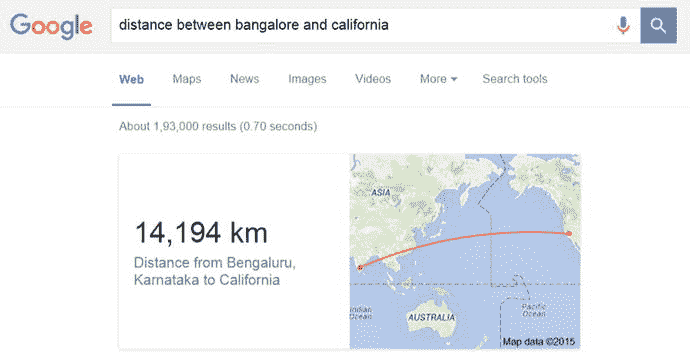
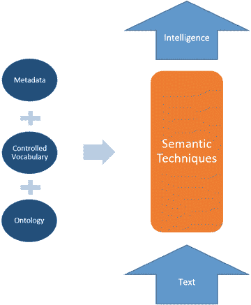
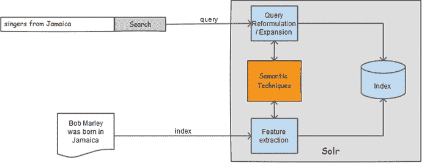
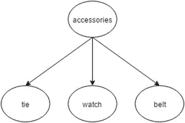

# 11.语义搜索

您已经读到了本书的最后一章，在这一过程中，您已经了解了 Solr 的重要特性以及使用它的基本原理。在前面的章节中，您还了解了信息检索概念和相关性排名，这对于理解 Solr 的内部原理以及评分的方式和原因是必不可少的。这些知识对于您大部分时间要做的事情是不可或缺的:调整文档相关性。有了所有这些信息，您应该能够开发一个有效的搜索引擎来检索与查询相关的文档，对它们进行适当的排序，并提供增加用户体验的其他功能。

到目前为止，一切顺利，但用户期望更多。如果你看看市场上的一些搜索应用程序，它们正在实现许多创新功能，并插入不同的框架和组件，以将搜索体验提升到一个新的水平。由于期望值很高，所以需要超越关键词的匹配来理解底层语义和用户意图。例如，谷歌也像一个问答系统。它运用巨大的智能来理解查询的语义，并相应地采取行动。如果您分析您的查询日志，您会发现相当多的查询包含用户的意图，而不仅仅是关键字，尽管这取决于领域。

此时，您应该能够开发一个不错的基于关键字的搜索引擎，但是有一些限制。当你把所有这些放在一起时，系统不会理解语义。例如，如果您的应用程序面向医疗领域，那么用户查询心脏病发作将无法检索到心脏骤停的结果，而这可能是医疗从业者更感兴趣的。

语义搜索通过理解用户意图和术语的上下文含义来解决基于关键字的搜索的局限性。可以以多种方式利用所获得的知识来提高搜索准确度和相关性排名。

语义搜索是一个高级而广泛的话题，介绍它的文本分析技术需要一本专门的书。在本章中，您将了解一些最简单形式的技术，以及可用于进一步探索的参考资料。本章涵盖以下主题:

*   基于关键字的系统的局限性
*   语义搜索简介
*   构建语义功能的常用工具
*   将语义能力集成到 Solr 的技术
*   识别标记的词性
*   从非结构化数据中提取命名实体，如人员、组织和位置
*   语义丰富

## 关键词系统的局限性

基于关键字的文档排序基本上依赖于关于查询术语的统计信息。尽管它们对于许多用例是有益的，但是如果用户未能制定适当的查询或提供意图查询，它们通常不会为用户提供有价值的结果。如果用户在搜索时多次改写同一个查询，这意味着需要扩展搜索引擎以支持高级文本处理和语义功能。计算机科学家汉斯·彼得·鲁恩描述了关键字系统的局限性:

> This fairly simple argument about "importance" avoids linguistic meanings such as grammar and syntax ... and pays no attention to the logical and semantic relations established by the author.

基于关键字的系统的主要限制可以分类如下:

*   上下文和意图:基于关键字的系统不知道上下文，也不考虑文档的认知特征。对白色正式衬衫的查询表明用户意图，但是关键字系统可能检索到与用户期望无关的文档。类似地，在音乐搜索引擎中，对今年热门歌曲的查询是纯粹的意图查询，基于关键字的系统可能最终检索到包含这些标记的专辑或标题，这与用户正在寻找的内容无关。
*   重要术语:基于关键字的搜索引擎在统计信息的基础上确定术语的重要性和意义，而忽略底层语义。
*   同义词:基于关键字的引擎检索包含匹配标记的文档，但忽略语言学上指代同一事物的术语。这些被系统视为不相关的被忽略的标记实际上可能更相关，如在前面的心脏病发作的例子中。
*   你可能会争论`synonyms.txt`解决了同义词的问题，但是这有两个限制。首先，该文件应该手动创建，并且仅限于手工制作的同义词。其次，它忽略了语义和一个词的同义词可以根据上下文而不同的事实。
*   多义性:在英语中，单词是多义的(一个单词可以有不同的意思)。`synonyms.txt`中定义的同义词对于这样的单词可能会出错。例如，如果在`synonyms.txt`文件中将心脏映射到情绪，那么查询心脏病发作将扩展到情绪发作，而实际上它应该扩展到心脏停搏。
*   非结构化数据:非结构化数据基本上是供人们使用的，其中隐藏着大量的信息。基于关键字的系统未能充分利用这些非结构化数据中的可用知识。

## 语义搜索

语义搜索是指一套解释意图、上下文、概念、意义和术语之间关系的技术。这个想法是开发一个遵循认知过程的系统，以类似于我们人类的方式理解术语。Technopedia.com 给出了语义搜索的定义:

> Semantic search is a data search technology. In this technology, the purpose of search query is not only to find keywords, but also to determine the intention and contextual meaning of words used by a person to search.

在搜索应用程序中利用语义功能的潜力是无限的。您利用它们的方式在很大程度上取决于您的领域、数据和搜索需求。例如，谷歌使用语义功能来传递答案，而不仅仅是链接。图 [11-1](#Fig1) 展示了 Google 语义能力的一个例子，它精确理解用户意图并回答查询。

图 11-1。

An example of the question-answering capability of Google

从历史上看，搜索引擎是为满足基于关键字的查询而开发的，但由于其局限性，这些引擎也提供了高级搜索功能。这在某些垂直领域是可以接受的(例如，法律搜索)，但是很少有用户觉得这有吸引力。用户更喜欢单个盒子，因为它易于使用和简单。由于搜索框是开放式的(你可以键入任何你想要的)，用户用自然语言提供查询，使用日常生活中的语言学。早期谷歌的主页上有高级搜索选项，但在 2011 年被隐藏了。谷歌的高级搜索现在可以在它的主页设置中找到，需要额外点击，或者你需要去 [`www.google.com/advanced_search`](http://www.google.com/advanced_search) 。在高级搜索中，您可以提供有关查询术语及其适用字段的详细信息。它通常被图书管理员、律师和医疗从业者所偏爱。

图 [11-2](#Fig2) 显示了一个智能搜索的例子，由 Amazon.com 为用户查询 white formal shirt for men 执行。搜索引擎通过使用内置的语义功能找到您想要的东西。

图 11-2。

An example of query intent mining in Amazon.com

语义搜索技术通过使用人工智能、自然语言处理和机器学习等技术来对文本进行深度分析。在这一章中，你将学习其中的一些，以及如何将它们集成到 Solr 中。

语义功能可以在索引和搜索时集成到 Solr 中。如果您正在处理新闻、文章、博客、日志或电子邮件，这些数据将是非结构化或半结构化的。在这种情况下，您应该从文本流中提取元数据和可操作的信息。由于非结构化数据是为人类消费而创建的，因此机器可能很难解释，但通过使用自然语言处理等文本处理功能，可以提取有用的信息。

语义处理主要取决于以下几点:

*   知识库:语义知识源包含关于与术语和概念相关的实体或事实的信息。知识可以作为本体、分类法、辞典、其他受控词汇、训练模型甚至一组规则来获得。这些知识可以由第三方供应商提供、由社区众包或内部开发。
*   文本处理:这是指应用于知识的处理、推理规则和推理，以检测实体、建立逻辑连接或确定上下文。

## 工具

本节介绍了一些工具和技术，您可能希望在处理文本以丰富语义时对它们进行评估。您可以扩展 Solr 组件来插入适合您的文本处理需求的工具。在继续本节内容之前，请参考第 3 章的“文本处理”部分复习这些概念。

### OpenNLP

Apache OpenNLP 项目提供了一套处理自然语言文本的工具，用于执行常见的 NLP 任务，如句子检测、标记化、词性标记和命名实体提取等。OpenNLP 为这些任务中的每一项提供了单独的组件。这些组件可以单独使用，也可以组合起来形成一个文本分析管道。该图书馆使用最大熵和感知器等机器学习技术来训练模型，并建立高级文本处理能力。OpenNLP 发布了一组通用模型，这些模型在一般用例中表现良好。如果您想要为您的特定需求构建一个定制模型，它的组件提供了一个用于训练和评估模型的 API。

该项目获得了 Apache 软件许可证的许可，可以在 [`https://opennlp.apache.org/`](https://opennlp.apache.org/) 下载。其他 NLP 库也是可用的，比如斯坦福 NLP，但是它们要么不是开源的，要么需要类似 GPL 的许可，这可能不符合许多公司的许可要求。

OpenNLP 的免费模型可以从 [`http://opennlp.sourceforge.net/models-1.5/`](http://opennlp.sourceforge.net/models-1.5/) 下载。

OpenNLP 集成尚未在 Solr 中提交，也不能作为开箱即用的特性。更多详情请参考 [`https://wiki.apache.org/solr/OpenNLP`](https://wiki.apache.org/solr/OpenNLP) 的 Solr wiki。在本章的后面，你会看到将 OpenNLP 与 Solr 集成的例子。

Note

有关整合的更多详情，请参考 JIRA [`https://issues.apache.org/jira/browse/LUCENE-2899`](https://issues.apache.org/jira/browse/LUCENE-2899) 。

### Apache 的游泳

如您所知，UIMA 代表非结构化信息管理架构，这是一个 Apache 项目，允许您开发可互操作的复杂组件，并将它们组合在一起运行。这个框架允许您开发一个分析引擎，可以用来从非结构化的文本中提取元数据和信息。

分析引擎允许您开发一个管道，您可以用它来链接注释器。每个注释器代表一个独立的组件或特性。注释器可以消费和产生一个注释，一个注释的输出可以输入到链中的下一个。该链可以通过使用 XML 配置来形成。

UIMA 的可插拔架构、可重复使用的组件和可配置的管道允许您扔掉整体结构，设计一个多阶段的过程，其中不同的模块需要建立在彼此的基础上，以获得一个强大的分析链。这也允许您向外扩展并异步运行组件。你可能会发现这个框架有点复杂；它有一个学习曲线。

来自不同供应商的注释可供使用，可以添加到管道中。Open Calias 和 AlchemyAPI 等供应商为文本处理提供了各种注释，但需要许可证。

UIMA 的 Solr 集成作为 contrib 模块提供，Solr 的丰富可以通过少量的配置更改来完成。关于 UIMA 集成，请参考位于 [`https://cwiki.apache.org/confluence/display/solr/UIMA+Integration`](https://cwiki.apache.org/confluence/display/solr/UIMA+Integration) 的 Solr 官方文档。

### 阿帕哈奇·斯坦布尔

Apache Stanbol 是一个基于 OSGi 的框架，它提供了一组用于推理和内容增强的可重用组件。它提供的额外好处是内置的 CMS 功能和供应，以持久化语义信息，如实体和事实，并定义知识模型。

没有可用的 Solr 插件，这个框架也不需要任何插件，因为 Stanbol 内部使用 Solr 作为文档存储库。它还使用 Apache OpenNLP 进行自然语言处理，并使用 Apache Clerezza 和 Apache Jena 作为 RDF 和存储框架。Stanbol 提供了一个管理链的 GUI，并提供了额外的功能，如网络服务器和安全功能。

如果您正在从头开始开发一个具有语义功能的系统，您可能想要评估这个框架，因为它为您提供了完整的套件。

## 应用的技术

语义搜索已经成为一个活跃的研究领域很长一段时间了，仍然是一个没有解决的问题，但在这个领域已经取得了很多进展。典型的例子是 IBM 的沃森；这个智能系统能够用自然语言回答问题，赢得了 2011 年的危险挑战。构建语义能力可能是一项相当复杂的任务，这取决于您想要实现什么。但是您可以使用简单的技术来提高结果质量，有时一点点语义就能帮您走很长的路。

图 [11-3](#Fig3) 概述了语义技术如何与不同的知识库相结合来处理输入文本和构建智能。从这些知识库中获得的信息可用于扩展术语、指示概念之间的关系、介绍事实以及从输入文本中提取元数据。[第 3 章](03.html)概述了这些知识库。在本节中，您将看到如何利用这些知识来执行智能搜索。

图 11-3。

Semantic techniques

在本书的前面，您已经了解到 Solr 通过使用向量空间模型等模型来对文档进行排序。该模型将文档视为一个单词包。对于用户查询，它基于诸如术语频率和逆文档频率之类的因素来检索文档，但是它不理解术语之间的关系。诸如此类的语义技术可以在 Solr 中应用，以检索更相关的结果:

*   查询解析:语义技术可以应用于查询以挖掘用户意图。基于领域，可以通过开发文本分类系统或其他技术来挖掘用户意图。这个特性可以通过编写一个定制的查询解析器插入 Solr。基于对意图的理解，解析器可以重构查询，或者用同义词和其他相关概念扩展查询术语。重新制定可能是一项艰巨的任务，应该小心进行。
*   文本分析:在执行文本分析时，可以用语义相关的单词来丰富标记，这与使用同义词过滤器工厂的方式类似。您可以通过编写一个定制的令牌过滤器来插入丰富内容，该过滤器可以在索引文档的字段时应用，也可以在查询结果时应用。本章稍后将介绍自动扩展同义词的示例实现。
*   查询重新排序:意图挖掘甚至可以通过编写定制的重新排序查询来应用，您在第 7 章的[中了解到了这一点，用于改变检索到的文档的顺序。与定制查询解析器的情况不同，查询重排序不会引入全新的文档。](07.html)
*   索引文档:结构化内容比非结构化内容更有价值。如果您正在索引非结构化数据，如书籍或期刊的文本，您应该对其进行结构化。您可以应用多种技术从这些内容中提取实体和隐藏的事实，并自动生成元数据。包含这些提取的实体的字段可以基于其重要性被提升，可以用于生成方面和控制可以表示结果的方式。在本章的后面，您将学习编写一个定制的更新请求处理器，用于从非结构化内容中自动提取元数据。
*   排名模型:用于对文档评分的排名模型可以进行调整，以考虑术语的语义关系，但这不是一项简单的任务。我建议您考虑其他有助于文档排名的方法，通过使用现有的模型，例如通过应用提升或有效载荷。

图 [11-4](#Fig4) 描述了语义能力如何应用于 Solr 以提高相关性。

图 11-4。

Application of semantic techniques in Solr

接下来，您将看到各种自然语言处理和语义技术，它们可以集成到 Solr 中以提高结果的精确度。

## 词性标注

句子中的每个单词都可以被归类到一个词汇类别中，也称为词类。常见的词类包括名词、动词和形容词。这些可以进一步分类，例如，名词可以分为普通名词或专有名词。这种分类和次分类信息可以用来发现术语在上下文中的意义，甚至可以用来提取大量关于单词的有趣信息。我建议你对词类有一个公平的理解，因为这可能有助于你理解单词的重要性和用途。例如，名词用于标识人、地点和事物(例如，衬衫或乔)，形容词定义一个名词的属性(例如红色或智能)。类似地，子类如普通名词描述一类实体(如国家或动物)，专有名词描述实例(如 America 或 Joe)。图 [11-5](#Fig5) 提供了示例文本及其词性。在图 [11-5](#Fig5) 中，标签 NNP、VBD、VBN 和 In 分别指专有名词(单数)、动词(过去式)、动词(过去分词)和连词(介词或从属关系)。

图 11-5。

Part-of-speech tagging

有了对词类的理解，你就能清楚地认识到并非所有的词都同等重要。如果您的系统可以标记词类，这种知识可以用于根据上下文中标记的重要性来控制文档排名。目前，在索引文档时，您要么提升一个文档，要么提升一个字段，但是忽略了这样一个事实，即每个术语可能也需要不同的提升。在一个句子中，通常名词和动词更重要；您可以提取这些术语，并将其索引到不同的字段。这为您提供了一个包含更小且更集中的术语集的字段，在查询时可以为其分配更高的提升。Solr 特性如`MoreLikeThis`在这个领域使用更重要的标记会更好。您甚至可以在索引时对它们应用有效负载。

词性标注可能是许多类型的高级分析的必要功能和先决条件。语义丰富的例子，你将在本章后面看到，需要词性标记的单词，因为一个单词的含义和定义可能因其词性而异。词性标注器使用宾夕法尼亚树库项目中的标签来标注句子中单词的词性。

### 用于 POS 标记的 Solr 插件

在本节中，您将学习从被索引的文档中提取重要的词类，并将提取的术语填充到一个单独的 Solr 字段中。这个过程需要两个主要步骤:

Extract the part of speech from the text. In the provided sample, you’ll use OpenNLP and the trained models freely available on its web site. The model can be downloaded from [`http://opennlp.sourceforge.net/models-1.5/`](http://opennlp.sourceforge.net/models-1.5/) .   Write a custom update request processor, which will create a new field and add the extracted terms to it.  

接下来详细提供将期望的词性添加到单独的 Solr 字段所遵循的步骤。

Write a Java class to tag the part of speech by using OpenNLP. The steps for part of-speech tagging in OpenNLP are provided next. These steps doesn’t relate to Solr but is called by the plugin for getting the POS. Read the trained model using `FileInputStream` and instantiate the `POSModel` with it. The path of model is passed to the `InputStream` during instantiation. OpenNLP prebundles two POS models for English and a few other languages. You can use `en-pos-maxent.bin`, a model which is based on maximum entropy framework. You can read more details about maximum entropy at [http://​maxent.​sourceforge.​net/​about.​html](http://maxent.sourceforge.net/about.html). `InputStream modelIn = new FileInputStream(fileName);` `POSModel model =  new POSModel(modelIn);`   Instantiate the `POSTaggerME` class by providing the `POSModel` instance to its constructor. `POSTaggerME tagger = new POSTaggerME(model);`   `POSTaggerME` as a prerequisite requires the sentence to be tokenized, which can be done using OpenNLP tokenization. If this code had been part of an analysis chain, the sentence could be tokenized using Solr provided tokenizer. The simplest form of tokenization can even be built using Java String’s `split()` method, also used in this example, though it’s prone to creating invalid tokens. `String [] tokens = query.split(" ");`   Pass the tokenized sentence to the `POSTaggerME` instance, which returns a string array containing all the tagged parts of speech. `String [] tags = tagger.tag(tokens);`   Iterate over the array to map the tags to the corresponding tokens. You have populated the extracted tags to the `PartOfSpeech` bean that holds the token and its corresponding part of speech.   `int i = 0;` `List<PartOfSpeech> posList = new ArrayList<>();` `for(String token : tokens) {`   `PartOfSpeech pos = new PartOfSpeech();`   `pos.setToken(token);`   `pos.setPos(tags[i]);`   `posList.add(pos);`   `i++;` `}`   Write a custom implementation of `UpdateRequestProcessor` and its factory method. Follow the next steps to add the terms with specified parts of speech to a separate field. (Refer to [Chapter 5](05.html) if you want to refresh your memory about writing a custom update request processor.) Read the parameters from `NamedList` in the `init()` method of `POSUpdateProcessorFactory`, the custom factory, to populate the instance variables for controlling the tagging behavior. Also, set up the POS tagger that can be used for extraction, as mentioned in step 1. `private String modelFile;` `private String src;` `private String dest;` `private float boost;` `private List<String> allowedPOS;` `private PartOfSpeechTagger tagger;` `public void init(NamedList args) {`         `super.init(args);`         `SolrParams param = SolrParams.toSolrParams(args);`         `modelFile = param.get("modelFile");`         `src = param.get("src");`         `dest = param.get("dest");`         `boost = param.getFloat("boost", 1.0f);`         `String posStr = param.get("pos","nnp,nn,nns");`         `if (null != posStr) {`                 `allowedPOS = Arrays.asList(posStr.split(","));`         `}`         `tagger = new PartOfSpeechTagger();`         `tagger.setup(modelFile);` `};`   In the `processAdd()` method of `POSUpdateProcessor`, a custom update request processor, read the field value of the document being indexed and provide it to the tagger object for tagging the parts of speech. Create a new field and add the important tag to it.   `@Override` `public void processAdd(AddUpdateCommand cmd) throws IOException {`   `SolrInputDocument doc = cmd.getSolrInputDocument();`   `Object obj = doc.getFieldValue(src);`   `StringBuilder tokens = new StringBuilder();`   `if (null != obj && obj instanceof String) {`     `List<PartOfSpeech> posList = tagger.tag((String) obj);`     `for(PartOfSpeech pos : posList) {`       `if (allowedPOS.contains(pos.getPos().toLowerCase())) {`         `tokens.append(pos.getToken()).append(" ");`       `}`     `}`     `doc.addField(dest, tokens.toString(), boost);`   `}`   `// pass it up the chain`   `super.processAdd(cmd);` `}`   Add the dependencies to the Solr core library. `<lib dir="dir-containing-the-jar" regex=" solr-practical-approach-\d.*\.jar" />`   Define the preceding custom processor in `solrconfig.xml`. In the parameters, you need to specify the path of the model, the source field, the destination field, the parts of speech to be extracted, and the boost to be provided to the destination field. `<updateRequestProcessorChain name="nlp">`   `<processor class="com.apress.solr.pa.chapter``11``.opennlp.POSUpdateProcessorFactory">`     `<str name="modelFile">path-to-en-pos-maxent.bin</str>`     `<str name="src">description</str>`     `<str name="dest">keywords</str>`     `<str name="pos">nnp,nn,nns</str>`     `<float name="boost">1.4</float>`   `</processor>`   `<processor class="solr.LogUpdateProcessorFactory" />`   `<processor class="solr.RunUpdateProcessorFactory" />` `</updateRequestProcessorChain>`   Register the defined update chain to the `/update` handler. `<str name="update.chain">nlp</str>`   Restart the instance and index documents. The terms with the specified part of speech will be automatically added to the `keywords` field, which is defined as a destination field in `solrconfig.xml`. The following is an example of the resultant document. `{`   `"id": "1201",`   `"description": "Bob Marley was born in Jamaica",`   `"keywords": "Bob Marley Jamaica "` `}`  

## 命名实体提取

如果您的搜索引擎需要索引非结构化内容，如书籍、期刊或博客，一项至关重要的任务是提取隐藏在文本流中的重要信息。在本节中，您将了解提取这些信息的不同方法，并利用它们来提高精确度和整体搜索体验。

非结构化内容主要是供人们消费的，提取隐藏在其中的重要实体和元数据需要复杂的处理。这些实体可以是通用信息(例如，人员、位置、组织、资金或时间信息)或特定于某个领域的信息(例如，医疗保健中的疾病或解剖)。识别诸如个人、组织和位置等实体的任务被称为命名实体识别(NER)。例如，在文本“鲍勃·马利出生在牙买加”中，NER 应该能够检测出鲍勃·马利是人而牙买加是地点。图 [11-6](#Fig6) 显示了本例中提取的实体。

图 11-6。

Named entities extracted from content

提取的命名实体可以在 Solr 中以多种方式使用，实际的用法取决于您的需求。Solr 中的一些常见用法如下:

*   使用实体支持分面导航
*   对实体的结果进行排序
*   为自动建议词典查找实体，如人名
*   为实体分配不同的提升，以改变它们在域中的重要性
*   基于检测到的实体类型搜索有限的字段集的查询重构。

NER 的方法可以分为三类，在下面的小节中详细介绍。该方法及其实现取决于您的需求、用例以及您试图提取的实体。前两种方法可以通过使用 Solr 或任何高级 NLP 库的现成特性来实现。对于第三种方法，您将定制 Solr 来集成 OpenNLP 并提取命名实体。定制或提取可以根据您的需要而有所不同。

### 使用规则和正则表达式

对于 NER 来说，规则和正则表达式是最简单的方法。您可以定义一组规则和一个正则表达式模式，它与实体提取的传入文本相匹配。这种方法适用于提取遵循预定义模式的实体，例如电子邮件 id、URL、电话号码、邮政编码和信用卡号。

在分析链中使用`PatternReplaceCharFilterFactory`或`PatternReplaceTokenFilterFactory`可以集成一个简单的正则表达式。用于确定电话号码的正则表达式可以像这样简单:

`^[0-9+\(\)#\.\s\/ext-]+$`

为了提取电子邮件 id，可以使用 Lucene 提供的`UAX29URLEmailTokenizerFactory`。参见 [`http://wiki.apache.org/solr/AnalyzersTokenizersTokenFilters#solr.UAX29URLEmailTokenizerFactory`](http://wiki.apache.org/solr/AnalyzersTokenizersTokenFilters#solr.UAX29URLEmailTokenizerFactory) 了解记号赋予器的详细信息。您可能会觉得有趣的是，有一个针对电子邮件的官方标准正则表达式，称为 [RFC 5322](http://tools.ietf.org/html/rfc5322#section-3.4) 。详见 [`http://tools.ietf.org/html/rfc5322#section-3.4`](http://tools.ietf.org/html/rfc5322#section-3.4) 。它描述了有效的电子邮件地址必须遵守的语法，但是实现起来太复杂了。

如果您正在寻找复杂的正则表达式规则，您可以评估 Apache UIMA 提供的正则表达式注释器，在这里您可以定义规则集。关于注释器的详细信息，请参考 [`https://uima.apache.org/downloads/sandbox/RegexAnnotatorUserGuide/RegexAnnotatorUserGuide.html`](https://uima.apache.org/downloads/sandbox/RegexAnnotatorUserGuide/RegexAnnotatorUserGuide.html) 。如果您正在使用 Drools 之类的规则引擎，您可以通过编写自定义更新处理器或过滤器工厂将其集成到 Solr 中。

如果您想将 OpenNLP 用于基于正则表达式的 NER，您可以使用`RegexNameFinder`并指定模式，而不是使用`NameFinderME`。参考“使用训练好的模型”一节中的例子，您可以使用`RegexNameFinder`进行替换。

这种 NER 方法的局限性在于，遵循指定模式或满足规则的任何不相关的事物都将被检测为有效实体；例如，格式错误的五位数薪水可能会被检测为邮政编码。此外，这种方法仅限于遵循已知模式的实体类型。它不能用于检测名称或组织等实体。

### 使用字典或地名词典

实体提取的基于词典的方法，也称为基于地名词典的方法，维护适用类别的术语列表。输入文本在地名词典上进行匹配以提取实体。这种方法适用于适用于特定领域且术语有限的实体。典型的例子是你组织中的职位、国籍、宗教、一周中的几天或一年中的几个月。

您可以通过从本地数据源或外部来源(如维基百科)提取信息来构建列表。维护字典的数据结构可以是满足您需求的任何数据结构。它可以像从文本文件填充的 Java 集合一样简单。基于文件的方法在单独的字段中填充实体的一个更简单的实现是使用 Solr 的`KeepWordFilterFactory`。以下是对它的一个样本文本分析:

`<analyzer>`

`<tokenizer class="solr.StandardTokenizerFactory"/>`

`<filter class="solr.LowerCaseFilterFactory"/>`

`<filter class="solr.KeepWordFilterFactory" words="keepwords.txt"/>`

`</analyzer>`

该列表可以在数据库表中维护，但是大的列表可能会降低性能。一种更快、更高效的方法是构建一个自动机。可以参考 Solr 建议模块中的 FST 数据结构或者大卫·斯迈利在 [`https://github.com/OpenSextant/SolrTextTagger`](https://github.com/OpenSextant/SolrTextTagger) 提供的数据结构。

如果您想查找短语和单个术语，可以使用 OpenNLP Chunker 组件或 Solr 提供的`ShingleFilterFactory`来处理输入的文本。下面是用于生成不同大小的瓦片区的过滤器定义。已经提供了参数`outputUnigrams="true"`来匹配单个令牌。

`<filter class="solr.ShingleFilterFactory" maxShingleSize="3" outputUnigrams="true"/>`

这种方法的好处是不需要培训，但是不太受欢迎，因为很难维护。它不能用于常见的实体，如名称或组织，因为这些术语可能有歧义，并且不限于一组定义的值。这种方法也忽略了上下文。例如，这种方法不能区分文本汤米·席尔菲格是指一个人还是一个组织。

OpenNLP 提供了一种更好的基于字典的提取方法，它扫描字典中的名称，让您不必担心匹配短语。

以下是 NER 在 OpenNLP 中使用字典的步骤:

Create an XML file containing the dictionary terms. `<dictionary case_sensitive="false">`   `<entry ref="director">`     `<token>Director</token>`   `</entry>`   `<entry ref="producer">`     `<token>Producer</token>`   `</entry>`   `<entry ref="music director">`     `<token>Music</token><token>Director</token>`   `</entry>`   `<entry ref="singer">`     `<token>Singer</token>`   `</entry>` `</dictionary`   Create a `FileInputStream` and instantiate the dictionary with it. `InputStream modelIn = new FileInputStream(file);` `Dictionary dictionary = new Dictionary(modelIn);` Alternatively, the `Dictionary` object can be created using a no-arg constructor and tokens added to it as shown here: `Dictionary dictionary = new Dictionary();` `dictionary.put(new StringList("Director"));` `dictionary.put(new StringList("Producer"));` `dictionary.put(new StringList("Music",  "Director"));` `dictionary.put(new StringList("Singer"));`   Create the `DictionaryNameFinder` instance by using the `Dictionary` and assigning a name to it. `DictionaryNameFinder dnf = new DictionaryNameFinder(dictionary, "JobTitles");`  

请参考下面“使用训练模型”一节中的实现步骤，因为其余步骤保持不变。

如果您觉得可以提高精确度，可以使用基于规则和基于地名词典的混合方法。

### 使用经过训练的模型

对 NER 使用训练模型的方法属于机器学习的监督学习类别:需要人工干预来训练模型，但在模型被训练后，它会返回几乎准确的结果。

这种方法使用统计模型来提取实体。这是提取不限于一组值的实体的首选方法，例如在名称或组织的情况下。这种方法可以找到模型中没有定义或标记的实体。该模型考虑了文本的语义和上下文，很容易解决实体之间的歧义，例如人名和组织名。使用早期的方法无法解决这些问题；训练有素的模特是唯一的出路。它不需要创建难以维护的大型字典。

#### 用于实体提取的 Solr 插件

在本节中，您将学习从被索引的文档中提取命名实体，并将提取的术语填充到一个单独的 Solr 字段中。这个过程需要两个主要步骤:

Extract the named entities from the text. In the provided sample, you’ll use OpenNLP and the trained models freely available on its web site. The model can be downloaded from [`http://opennlp.sourceforge.net/models-1.5/`](http://opennlp.sourceforge.net/models-1.5/) .   Write a custom update request processor, that will create a new field and add the extracted entities to it.  

以下是将提取的命名实体添加到单独的字段时要遵循的详细步骤:

Write a Java class to extract the named entities by using OpenNLP. Here are the steps for extraction: Read the trained model by using `FileInputStream` and instantiate the `TokenNameFinderModel` with it. OpenNLP requires a separate model for each entity type. To support multiple entities, a separate model should be loaded for each entity. `InputStream modelIn = new FileInputStream(fileName);` `TokenNameFinderModel model = new TokenNameFinderModel(modelIn);`   Instantiate the `NameFinderME` class by providing the model to its constructor. A separate instance of `NameFinderME` should be created for each entity type. `NameFinderME  nameFinder = new NameFinderME(model);`   `NameFinderME` as a prerequisite requires the sentence to be tokenized, which can be done using the OpenNLP tokenization component. If this code is part of the analysis chain, the sentence can be tokenized by using the Solr-provided tokenizer. The simplest form of tokenization can even be using Java String’s `split()` method, also used in this example, though it’s prone to creating invalid tokens. `String [] sentence = query.split(" ");`   Pass the tokenized sentence to the `NameFinderMe` instance, which returns the extracted named entity. `Span[] spans = nameFinder.find(sentence);`   Iterate the `Span` array to extract the named entities. We have populated the extracted entities to the `NamedEntity` bean that holds the entity and its corresponding entity type. `List<NamedEntity> neList = new ArrayList<>();` `for (Span span : spans) {`   `NamedEntity entity = new NamedEntity();`   `StringBuilder match = new StringBuilder();`   `for (int i = span.getStart(); i < span.getEnd(); i++) {`     `match.append(sentence[i]).append(" ");`   `}`   `entity.setToken(match.toString().trim.());`   `entity.setEntity(entityName);`   `neList.add(entity);` `}`   After processing the sentences of a document, call `clearAdaptiveData()` to clear the cache, which is maintained by OpenNLP to track previous entity extraction of a word. `nameFinder.clearAdaptiveData();`     Write a custom implementation of `UpdateRequestProcessor` and its factory method. The following are the steps to be followed for adding the extracted entities to a separate field. (Refer to [Chapter 5](05.html), if you want to refresh your memory about writing a custom update request processor.) Read the parameters from `NamedList` in the `init()` method of `NERUpdateProcessorFactory`, the custom factory, to populate the instance variables for controlling the extraction behavior. Also, set up the `NamedEntityTagger` that can be used for extraction as mentioned in step 1. `private String modelFile;` `private String src;` `private String dest;` `private String entity;` `private float boost;` `private NamedEntityTagger tagger;` `public void init(NamedList args) {`   `super.init(args);`   `SolrParams param = SolrParams.toSolrParams(args);`   `modelFile = param.get("modelFile");`   `src = param.get("src");`   `dest = param.get("dest");`   `entity = param.get("entity","person");`   `boost = param.getFloat("boost", 1.0f);`   `tagger = new NamedEntityTagger();`   `tagger.setup(modelFile, entity);` `};`   In the `processAdd()` method of `NERUpdateProcessor`, a custom update request processor, read the field value of the document being indexed and provide it to the NER object for extracting the entities. Create a new field and add the extracted entities to it. `@Override` `public void processAdd(AddUpdateCommand cmd) throws IOException {`   `SolrInputDocument doc = cmd.getSolrInputDocument();`   `Object obj = doc.getFieldValue(src);`   `if (null != obj && obj instanceof String) {`     `List<NamedEntity> neList = tagger.tag((String) obj);`     `for(NamedEntity ne : neList) {`       `doc.addField(dest, ne.getToken(), boost);`     `}`   `}`   `super.processAdd(cmd);` `}`     Add the dependencies to the Solr core library. `<lib dir="dir-containing-the-jar" regex=" solr-practical-approach-\d.*\.jar" />`   Define this custom processor in `solrconfig.xml`. In the parameters, you need to specify the path of the model, the source field, the destination field, the entity to be extracted, and the boost to be provided to the destination field. The destination field should be multivalued, as multiple entities can be extracted from the text. `<updateRequestProcessorChain name="nlp">`   `<processor class="com.apress.solr.pa.chapter``11``.opennlp.NERUpdateProcessorFactory">`     `<str name="modelFile">path-to-en-ner-person.bin</str>`     `<str name="src">description</str>`     `<str name="dest">ext_person</str>`     `<str name="entity">person</str>`     `<float name="boost">1.8</float>`   `</processor>`   `<processor class="solr.LogUpdateProcessorFactory" />`   `<processor class="solr.RunUpdateProcessorFactory" />` `</updateRequestProcessorChain>`   Register the defined update chain to the `/update` handler. `<str name="update.chain">nlp</str>`   Restart the instance and index documents. The extracted entities will be automatically added to the destination field. The following is an example of a resultant document. `{` `"id": "1201",` `"description": "Bob Marley and Ricky were born in Jamaica",` `"ext_person": [`   `"Bob Marley ",`   `"Ricky "` `]` `}`  

这段源代码只提取了一种类型的实体。在现实生活中，您可能希望提取多个实体，并将它们填充到不同的字段中。您可以通过加载多个模型并将提取的术语添加到单独的字段来扩展这个更新请求处理器，以适应所需的功能。

OpenNLP 为每个实体类型使用一个单独的模型。相比之下，另一个 NLP 软件包 Stanford NLP 对所有实体使用相同的模型。

这种实体提取的方法应该返回准确的结果，但是输出也取决于标记质量和模型训练的数据(记住，垃圾输入，垃圾输出)。此外，基于模型的方法在内存需求和处理速度方面成本很高。

## 语义丰富

在[第 4 章](04.html)中，您学习了使用`SynonymFilterFactory`来生成同义词以扩展令牌。这种方法的主要限制是它没有考虑语义。一个词可以是多义的(有多个意思)，同义词可以根据它们的词性或上下文而变化。例如，一个典型的泛型`synonym.txt`文件可以将单词 large 指定为 big 的同义词，这将把查询 big brother 扩展为 big brother，这在语义上是不正确的。

不使用定义术语及其同义词列表的文本文件，而是使用受控词汇表(如 WordNet 或医学主题词(MeSH ))来应用更复杂的方法，这些词汇表不需要手动定义或手工制作。同义词扩展只是其中的一部分。词汇表和叙词表还包含其他有用的信息，如上义词、下义词和部分义词，您将进一步了解这些信息。该信息可用于理解语义关系和进一步扩展查询。

这些辞典通常由社区或企业维护，它们用最新的单词不断更新语料库。词汇表可以是通用的，也可以是特定于特定领域的。WordNet 是一个通用词库的例子，它可以被整合到任何搜索引擎中，用于任何领域。网格是一个适用于医学领域的词汇。

您还可以通过构建包含适用于您的领域的概念树的分类法和本体论来执行语义丰富。查询术语可以与分类法进行匹配，以提取更宽、更窄或相关的概念(例如`altLabel`或`prefLabel)`),并执行所需的丰富。你可以从网上获得这些分类法，或者你可以让一个分类法专家为你定义一个。您还可以使用 DBpedia 等资源，这些资源以 RDF 三元组形式提供从 Wikipedia 中提取的结构化信息。Wikidata 是另一个链接数据库，它包含来自 Wikimedia 项目(包括维基百科)的结构化数据。

这些知识库可以通过各种方式集成到 Solr 中。以下是将所需的丰富内容插入 Solr 的方法:

*   文本分析:编写一个定制的令牌过滤器，使用从受控词汇表中提取的同义词或其他关系来扩展令牌。实现可以类似于 Solr 提供的`SynonymFilterFactory`，它使用一个受控的词汇表文件来代替`synonyms.txt`文件。`SynonymFilterFactory`以最简单的形式支持 WordNet。在本章的后面，您将看到同义词扩展的自定义实现。
*   Query parser: Write a query parser for expanding the user query with its related or narrower term. For example, in an e-commerce web site for clothing, the user query men accessories can be expanded to search for belts or watches. This additional knowledge can be extracted from a taxonomy that contains accessories as a broader term, and belts and watches as its narrower terms. Figure [11-7](#Fig7) specifies the relationship between the broader and narrower concepts. Instead of just expanding the query, you can extend the system to reformulate the query to build a new query.

    

    图 11-7。

    Concept tree

### 同义词扩展

在本节中，您将学习如何自动扩展术语以包含它们的同义词。该过程需要执行以下两项任务:

Knowledge extraction: The first step is to extract the synonyms from the controlled vocabulary. The extraction process depends on the vocabulary and supported format. In the following example, you will extract knowledge from WordNet by using one of the available Java libraries.   Solr plug-in: The feature can be plugged into any appropriate extendable Solr component. In this section, you will expand the synonym by using a custom token filter.  

在执行这些任务之前，您将学习 WordNet 的基础知识和它提供的信息，然后实际操作同义词扩展。

### WordNet

WordNet 是一个大型的英语词汇数据库。它将名词、动词、形容词和副词分成称为同义词集的认知同义词集，每个同义词集表达一个不同的概念。同素集通过概念、语义和词汇关系相互联系。它的结构使它成为计算语言学和自然语言处理的有用工具。它包含 155，287 个单词，组织在 117，659 个[同义词集中](https://en.wikipedia.org/wiki/Synsets#Synsets)，总共有 206，941 个词义对。

WordNet 是在 BSD 风格的许可下发布的，可以从它的网站 [`https://wordnet.princeton.edu/`](https://wordnet.princeton.edu/) 免费下载。也可以在 [`http://wordnetweb.princeton.edu/perl/webwn`](http://wordnetweb.princeton.edu/perl/webwn) 评测网络版词库。

WordNet 中单词之间的主要关系是同义词，因为它的同义词集将表示相同概念并在许多上下文中可以互换的单词组合在一起。除同义词之外，同义词词典还包含以下主要信息(以及其他信息):

*   上下义关系:这是指词与词之间的关系。它将一个普通的 synset(如 accessory)链接到一个更具体的 synset(如 belt)。比如，accessory 是 belt 的上位词，belt 是 accessory 的下位词。这些关系保持了层次结构，并且是可传递的。
*   部分关系:这是词与词之间的整体-部分关系。例如，纽扣是衬衫的部分名称。
*   转喻:这是指表达越来越具体的方式来描述一个事件的动词。例如，whisper 是 talk 的词源。
*   注释:这是一个词的简短定义。在大多数情况下，它还包含一个或多个说明 synset 成员用法的短句。

WordNet 需要词类和单词作为先决条件。

有一些 Java 库可以用来访问 WordNet，每一个都有自己的优缺点。你可以参考 [`http://projects.csail.mit.edu/jwi/download.php?f=finlayson.2014.procgwc.7.x.pdf`](http://projects.csail.mit.edu/jwi/download.php?f=finlayson.2014.procgwc.7.x.pdf) 一篇比较初级库的特性和性能的论文。

### 用于同义词扩展的 Solr 插件

本节提供了开发术语简单扩展机制的步骤。下面是实现该特性所需的两个步骤

Write a client to extract synonmys from wordnet.   Write a Solr plugin to integrate the extracted synonyms for desired expansion. In this section, the enrichment is integrated to Solr using a custom token filter.  

#### 使用 WordNet 扩展同义词

要从 WordNet 中提取同义词，有两个先决条件:

Download the database from WordNet’s download page at [`https://wordnet.princeton.edu/wordnet/download/current-version/`](https://wordnet.princeton.edu/wordnet/download/current-version/) and extract the dictionary from `tar/zip` to a folder.   You will need a Java library to access the dictionary. The example uses the Java WordNet Library (JWNL). You can use any other library that suits your requirements.  

所提供的这些步骤是最简单的形式；您可能需要优化以使代码生产就绪。此外，该程序只提取同义词。您可以扩展它来提取前面讨论过的其他相关信息。从 WordNet 等通用同义词库中提取相关术语时，需要注意的另一件事是，您可能希望执行消歧，以便为要扩展的术语确定合适的同义词集；例如，像 bank 这样的词是多义的，根据上下文可以表示河岸或银行机构。如果您使用特定于领域的词汇表，歧义消除就不那么重要了。(涵盖歧义消除超出了本书的范围。)

以下是使用 WordNet 扩展同义词的步骤:

The JWNL requires an XML-based properties file to be defined. The following is a sample properties file. The path of the extracted WordNet dictionary should be defined in the `dictionary_path` parameter in this file. `<?xml version="1.0" encoding="UTF-8"?>` `<jwnl_properties language="en">`   `<version publisher="Princeton" number="3.0" language="en"/>`   `<dictionary class="net.didion.jwnl.dictionary.FileBackedDictionary">`     `<param name="dictionary_element_factory"       value="net.didion.jwnl.princeton.data.PrincetonWN17FileDictionaryElementFactory"/>`     `<param name="file_manager"`         `value="net.didion.jwnl.dictionary.file_manager.FileManagerImpl">`       `<param name="file_type"`           `value="net.didion.jwnl.princeton.file.PrincetonRandomAccessDictionaryFile"/>`       `<param name="dictionary_path" value="/path/to/WordNet/dictionary"/>`     `</param>`   `</dictionary>`   `<resource class="PrincetonResource"/>` `</jwnl_properties>`   Create a new `FileInputStream` specifying the path of the JWNL properties file and initialize the JWNL by providing the `FileInputStream`. Create an instance of `Dictionary`. `JWNL.initialize(new FileInputStream(propFile));` `Dictionary dictionary = Dictionary.getInstance();`   WordNet requires the part of speech to be specified for the tokens, and that value should be converted to a POS enum that is accepted by the dictionary. The part of speech can be tagged by using the OpenNLP part-of-speech tagger, as discussed in the previous example, or any other package you are familiar with. `POS pos = null;` `switch (posStr) {` `case "VB":` `case "VBD":` `case "VBG":` `case "VBN":` `case "VBP":` `case "VBZ":`   `pos = POS.VERB;`   `break;` `case "RB":` `case "RBR":` `case "RBS":`   `pos = POS.ADVERB;`   `break;` `case "JJS":` `case "JJR":` `case "JJ":`   `pos = POS.ADJECTIVE;`   `break;` `//  case "NN":` `//  case "NNS":` `//  case "NNP":` `//  case "NNPS":` //   pos = POS.NOUN; //   break; `}` This code snippet has a section commented out to ignore the synonym expansion for nouns as nouns will introduce more ambiguity. You can uncomment it, if you introduce a disambiguation mechanism.   Invoke the `getIndexWord()` method of the `Dictionary` instance by providing the word and its POS. The returned value is `IndexWord`. `IndexWord word = dictionary.getIndexWord(pos, term);`   The `getSenses()` method of `IndexWord` returns an array of `Synset`, which can be traversed to get all the synonyms. The synset returned varies on the basis of the POS provided. The following block of code populates the `synonyms` Java set with all the extracted synonyms. `Set<String> synonyms = new HashSet<>();` `Synset[] synsets = word.getSenses();`   `for (Synset synset : synsets) {`     `Word[] words = synset.getWords();`     `for (Word w : words) {`           `String synonym = w.getLemma().toString()`                          `.replace("_", " ");`           `synonyms.add(synonym);`   `}` `}`  

#### 用于同义词扩展的自定义令牌过滤器

在上一节中，您学习了从 WordNet 中提取同义词。现在，必须将提取的同义词添加到索引的术语中。在本节中，您将学习编写一个定制的标记过滤器，它可以被添加到一个字段的文本分析链中，以用它的同义词来丰富标记。

Lucene 在包`org.apache.lucene.analysis.*`中为令牌过滤器定义了类。为了编写您的定制令牌过滤器，您需要扩展以下两个 Lucene 类:

*   TokenFilterFactory:创建`TokenFilter`实例的工厂应该扩展这个抽象类。
*   TokenFilter:在第 4 章的[中，你了解到令牌过滤器是一个令牌流，它的输入是另一个令牌流。`TokenFilter`是一个抽象类，提供对所有标记的访问，无论是从文档的字段还是从查询文本。自定义实现应该继承这个`TokenFilter`抽象类并覆盖`incrementToken()`方法。](04.html)

以下是编写自定义令牌过滤器并将其插入字段的文本分析链时应遵循的步骤:

Write a custom implementation of `TokenFilterFactory` that creates the `TokenFilter`. Here are the steps: Extend the `TokenFilterFactory` abstract class. The `ResourceLoaderAware` interface is implemented by classes that optionally need to initialize or load a resource or file. `public class CVSynonymFilterFactory extends TokenFilterFactory implements ResourceLoaderAware {` `}`   Override the `create()` abstract method and return an instance of the custom `TokenStream` implementation, which you will create in the next step. You can optionally pass additional parameters to the implementing class. Here you pass the instantiated resources: `@Override` `public TokenStream create(TokenStream input) {`   `return new CVSynonymFilter(input, dictionary, tagger, maxExpansion);` `}`   If you want to read parameters from the factory definition in `schema.xml`, you can read it from the map that is available as an input to the constructor. You have read the path of the JWNL properties file, the OpenNLP POS model, and the maximum number of desired expansions. `public CVSynonymFilterFactory(Map<String, String> args) {`   `super(args);`   `maxExpansion = getInt(args, "maxExpansion", 3);`   `propFile = require(args, "wordnetFile");`   `modelFile = require(args, "posModel");` `}`   Initialize the required resources by overriding the `inform()` method provided by the `ResourceLoaderAware` interface. `@Override` `public void inform(ResourceLoader loader) throws IOException {`   `// initialize for wordnet`   `try {`     `JWNL.initialize(new FileInputStream(propFile));`     `dictionary = Dictionary.getInstance();`   `} catch (JWNLException ex) {`     `logger.error(ex.getMessage());`     `ex.printStackTrace();`     `throw new IOException(ex.getMessage());`   `}`   `// initialize for part of speech tagging`   `tagger = new PartOfSpeechTagger();`   `tagger.setup(modelFile);` `}`     Create a custom class by extending the `TokenFilter` abstract class that performs the following tasks. Initialize the required attributes of the tokens. You have initialized the `CharTermAttribute`, `PositionIncrementAttribute`, `PositionLengthAttribute`, `TypeAttribute`, and `OffsetAttribute` that contain the term text, position increment information, information about the number of positions the token spans, the token type, and the start/end token information, respectively. `private final CharTermAttribute termAttr = addAttribute(CharTermAttribute.class);` `private final PositionIncrementAttribute posIncrAttr`     `= addAttribute(PositionIncrementAttribute.class);` `private final PositionLengthAttribute posLenAttr`     `= addAttribute(PositionLengthAttribute.class);` `private final TypeAttribute typeAttr = addAttribute(TypeAttribute.class);` `private final OffsetAttribute offsetAttr = addAttribute(OffsetAttribute.class);`   Define the constructor and do the required initialization. `public CVSynonymFilter(TokenStream input,`         `Dictionary dictionary, PartOfSpeechTagger tagger, int maxExpansion) {`   `super(input);`   `this.maxExpansion = maxExpansion;`   `this.tagger = tagger;`   `this.vocabulary = new WordnetVocabulary(dictionary);`   `if (null == tagger || null == vocabulary) {`     `throw new IllegalArgumentException("fst must be non-null");`   `}`   `pendingOutput = new ArrayList<String>();`   `finished = false;`   `startOffset = 0;`   `endOffset = 0;`   `posIncr = 1;` `}`   Override the `incrementToken()` method of `TokenFilter`. The method should play back any buffered output before running parsing and then do the required processing for each token in the token stream. The `addOutputSynonyms()` method extracts the synonym for each term provided. When the parsing is completed, the method should mandatorily return the Boolean value `false`. `@Override` `public boolean incrementToken() throws IOException {`   while (!finished) {     // play back any pending tokens synonyms     while (pendingTokens.size() > 0) {       String nextToken = pendingTokens.remove(0);       termAttr.copyBuffer(nextToken.toCharArray(), 0, nextToken.length());       offsetAttr.setOffset(startOffset, endOffset);       posIncAttr.setPositionIncrement(posIncr);       posIncr = 0;       return true;     }     // extract synonyms for each token     if (input.incrementToken()) {       String token = termAttr.toString();       startOffset = offsetAttr.startOffset();       endOffset = offsetAttr.endOffset();       addOutputSynonyms(token);     } else {       finished = true;   } }   // should always return false   return false; } private void addOutputSynonyms(String token) throws IOException { pendingTokens.add(token); `List<PartOfSpeech> posList = tagger.tag(token);`   if (null == posList || posList.size() < 1) {    return;   }   Set<String> synonyms = vocabulary.getSynonyms(token, posList.get(0)     .getPos(), maxExpansion);   if (null == synonyms) {     return;   }   for (String syn : synonyms) {     pendingTokens.add(syn);   } } `@Override` `public void reset() throws IOException {`   super.reset();   finished = false;   pendingTokens.clear();   startOffset = 0;   endOffset = 0;   posIncr = 1; } The processing provided here tags the part of speech for each token instead of the full sentence, for simplicity. Also, the implementation is suitable for tokens and synonyms of a single word. If you are thinking of getting this feature to production, I suggest you refer to `SynonymFilter.java` in the `org.apache.lucene.analysis.synonym` package and extend it using the approach provided there.     Build the program and add the Java binary JAR to the Solr classpath. Alternatively, place the JAR in the `$SOLR_HOME/core/lib` directory. `<lib dir="./lib" />`   Define the custom filter factory to the analysis chain of the desired `fieldType` in `schema.xml`. `<fieldType name="text_semantic" class="solr.TextField" positionIncrementGap="100">`   `<analyzer type="index">`     `<tokenizer class="solr.StandardTokenizerFactory"/>`     `<filter class="solr.StopFilterFactory" ignoreCase="true" words="stopwords.txt" />`     `<filter class="solr.LowerCaseFilterFactory"/>`   `</analyzer>`   `<analyzer type="query">`     `<tokenizer class="solr.StandardTokenizerFactory"/>`     `<filter class="solr.StopFilterFactory" ignoreCase="true" words="stopwords.txt" />`     `<filter class="com.apress.solr.pa.chapter``11``.enrichment.CVSynonymFilterFactory" maxExpansion="3" wordnetFile="path-of-jwnl-properties.xml" posModel="path-to-en-pos-maxent.bin" />`     `<filter class="solr.LowerCaseFilterFactory"/>`   `</analyzer>` `</fieldType>`   Restart the instance, and you are good to query for semantic synonyms. If the token filter has been added to index-time analysis, the content should be reindexed. Verify the expansion in the Analysis tab in the Solr admin UI.  

## 摘要

在这一章中，你学习了搜索引擎的语义方面。您看到了基于关键字的引擎的局限性，并了解了语义搜索增强用户体验和文档可查找性的方法。语义搜索是一个高级而广泛的话题。鉴于本书范围有限，我们将重点放在简单的自然语言处理技术上，用于识别句子中的重要单词，以及从非结构化文本中提取元数据的方法。您还了解了一种基本的语义丰富技术，用于发现之前完全被忽略但用户可能会非常感兴趣的文档。综上所述，本章提供了在 Solr 中集成这些特性的示例源代码。

你已经到了这本书的结尾。我真诚地希望它的内容对您开发实用的搜索引擎有所帮助，并有助于您了解 Apache Solr。